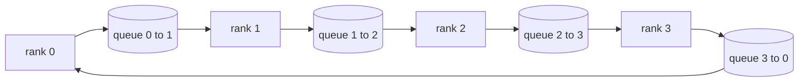

# العمليات الجماعية من الصفر

> العمليات الجماعية الأربعة التي تحتوي على التدريب الموزع معا هي كلخفض، البث، جمع كل، و تقليل_الانتشار. كل إطار تدريب بديهي آخر يقدم هو غلاف حول هذه. بناءها مرة واحدة على`multiprocessing.Queue`التشابك، التحقق منها ضد تنفيذ مرجعية، وبقية المسار يصبح الصباك.

**Type:** Build
**Languages:** Python
**Prerequisites:** Phase 19 Track C lessons 42-49
**Time:** ~90 min

## أهداف التعلم

- قم بتنفيذ حلقة allreduce في مرّتين (حدّ من التنبع ثم جمع) وإثبات حجم الاتصال لكل درجة هو 2(N-1) / N bytes لكل عنصر.
- بناء البث، وجمع، وتقليل_تشتت فوق نقطة إلى نقطة إرسال على `multiprocessing.Queue`. . .
- تحقق كل بدائي ضد`torch.distributed`الإشارة المضادة لنفس المدخل
- الدفاع عن خيار الحلقة مقابل الشجرة على شكل الكluster ، الأرضية التأخير ، وسقف عرض النطاق.

## المشكلة

إنّ التخفيض السذاجي على صفوف N يرسّل N مرات الجهاز إلى الجذر ويعيد N مرات. يُقاس عرض النطاق على O ((N) لكل رتبة، يصبح الجذر عقدة زجاجة، و الأرضية في الساعة الجدارية هي أبطأ ربط مضرب N. الحلقة جميعها تقليل المسطحات إلى 2 ((N-1) قطع من حجم T / N ، بحيث تنخفض البايتات لكل رتبة إلى 2T ((N-1) / N مستقلة عن حجم الكluster. شجرة كلخفض الفوز على N الصغيرة والارتباطات عالية التأخير لأن عمق هو log2(N) هوب بدلا من 2(N-1). اختر الترتيب الخطأ لشكل الكluster و أبطأ GPU يحدد الوقت الخطوة.

كل إطار تدريب منتشر ستقرأه هذا المسار يعتمد على هذه الأربعة البدائيات PyTorch DDP يزامن التدرج مع واحد كلخفض لكل علبة المعلمات. يقطع زرو حالة التكيف عن طريق تقليل_تشتت وتبث المعلمات المحدثة من قبل آلجستر. تحويل FSDP كامل للأمام إلى كل جمع زائد تقليل_تشتت. احتياجات الانبعاث الموازية للخطوط النابضة لتنشيط المجموعات المرحلية. إذا لم تتمكن من تنفيذ هذه الجماعات الأربعة، فلا يمكنك التفكير حول سبب توقف التدريب، لماذا يظهر عدم توافق التدفق في المرتبة الثالثة، أو لماذا تتضاعف فقاعة الأنابيب عند تبادل التأثيرات.

## المفهوم



### الحلقة كلخفض في مرّتين

تقسيم الجهاز إلى N قطع متساوية مؤشر 0..N-1. كل صف يمتلك مؤشر قطعة يساوي صفعه. الممر 1، تقليل الانتشار، تشغيل خطوات N-1. في الخطوة s، يرسل rank r chunk (r - s) mod N إلى rank (r + 1) mod N ويستقبل chunk (r - s - 1) mod N من rank (r - 1) mod N، ويتراكم الجزء المُتلقى في نسخة محلية. بعد خطوات N-1، يمتلك رتبة r المبلغ الكامل لقطعة r. الممر 2، كلّم، اجري خطوة أخرى N-1 وتدور قطع النهائية حول الحلقة حتى كل صف يحمل المبلغ الكامل لكل قطعة.

| Primitive | Per-rank bytes | Steps | When to use |
|-----------|---------------|-------|-------------|
| Ring allreduce | 2T(N-1)/N | 2(N-1) | Large T, fat-pipe homogeneous cluster |
| Tree allreduce | T log2(N) | 2 log2(N) | Small T or high-latency links |
| Broadcast | T | log2(N) tree | Parameter init, scalar config |
| Allgather | T(N-1)/N | N-1 | Sharded forward, ZeRO unshard |
| Reduce_scatter | T(N-1)/N | N-1 | ZeRO gradient sharding |

### شبكة الصف كمركز بديل لـ NCCL

NCCL تعمل على PCIe و NVLink مع تخفيضات خارجية من الأجهزة.`multiprocessing.Queue`يمنحك كل حافة حلقة توصيل أمر من نقطة إلى نقطة مع منتج واحد ومستهلك واحد. يحدث التخفيض في مساحة المستخدم، لذلك تدفع تكاليف Python العليا، ولكن نمط الأسلاك هو نفسه لـ NCCL حلقة جميعها.

### التحقق من الغضب

كل شيء بدائي يصل إلى الوطن مع اختبار وحدة يُقارن إنتاجها مع`torch.distributed`يتم تشغيلها مع الخلفية المضيئة على نفس الجهاز العصبي على نفس الحجم العالمي. إذا كان حلقك الردودس يختلف عن الجهاز العصبي بأكثر من إكسيلون 32، فإن الاختبار يفشل. التحقق من تنفيذ مرجعية غير قابل للتفاوض؛ دون ذلك يبدو البدائي صحيحًا حتى الخطوة 10000 من عملية تدريب حقيقية.

```figure
ci-ring-allreduce
```

## بناءها

`code/main.py`تطبيقات:

- `Mesh`الفئة التي تسلك N `multiprocessing.Queue`الاحتمالات في حلقة و التفاشيات`send(dst, tensor)`و`recv(src)`لكل رتبة
- `ring_allreduce(mesh, rank, world_size, tensor)`تشغيل خوارزمية الممرين
- `broadcast(mesh, rank, world_size, tensor, src)`فوق شجرة محاسبية
- `allgather(mesh, rank, world_size, tensor)`باستخدام دورانات N-1
- `reduce_scatter(mesh, rank, world_size, tensor)`في النصف الأول من "الردوس"
- `_gloo_reference(op, world_size, tensor)`الذي يمر عبر نفس المدخل`torch.distributed`مع غلو للمقارنة بثنائيات

إشغله

```bash
python3 code/main.py
```

الناتج: جدول التحقق الأولي مقارنة نتائج صف-شبكة والخروج من الظلام، تليها عداد البايت لكل رتبة يثبت مقياس 2T(N-1) / N.

## أنماط الإنتاج في البرية

ثلاثة أنماط تصلب البدائيين بما فيه الكفاية لنقل.

**Bucket gradients before allreduce.**نموذج 1B-المعلم لديه عشرات الآلاف من مضغوطات التنمر. واحد كلخفض لكل مضغوطة يدفع مستوى التخفيف N مرات. DDP تشتت تراجع إلى ~ 25 MB قطع وإصدار واحد كلخفض لكل سطل. السوارة الصغيرة على ظهر الكبيرة. دون تشتت التخفيف فوق يهيمن على الخطوة.

**Overlap communication with computation.**يقوم الجهاز بتحساب التدفقات طبقة بعد طبقة بالترتيب العكسي. في اللحظة التي تكون فيها التدفقات الأخيرة جاهزة، يبدأ كل تخفيضها بينما تبقى الطبقة التالية في الحوسبة. يقوم PyTorch DDP بتحويل هذا مع حلقات جاهزة للدواء. يقلل التداخل من وقت الاتصال المرئي عندما تكون الشبكة مهووسة.

**Pick ring or tree by message size, not religion.**تقوم NCCL بإرسال كاشف التوبولوجي الذي يختار الحلقة من الرسائل فوق ~ 1 MB والشجرة أدناه. التقاطع هو عرض النطاق مقابل التأخير: فوق 1 MB، يهيمن مصطلح عرض النطاق 2T(N-1) / N ويغلب الحلقة. تحت 1 MB، يفوز عدد الهوب. تكلفة تشكيل التوبولوجي واحد من خلال النطاق على حجم الرسالة الخطأ.

## استخدمها

أنماط الإنتاج:

- **PyTorch DDP.**مكالمات`dist.all_reduce`على تراجعات بالدجاج بعد العودة. حجم بالدجاج قابلة للتنسيق؛ 25 MB افتراضي هو معقول ل 100Gbit إيثرنت.
- **DeepSpeed ZeRO.**القضايا تقلل_تشتت إلى تراجع شظائف وجمعها معا لإعادة بناء المعايير الكاملة قبل المضي قدما.
- **FSDP.**يبدأ التقدم مع كل جمع لفتح الطبقة، يحسب، ثم يقلل مع reduce_scatter ويستبعث من غير المقطوعة. نفس الأسباب البدائية، جدول مختلف.

## أرسله

استخدموا أسباب الوصف في الدروس 77-81. الدروس 77 جميع الأسلاك تقليل إلى DDP. الدروس 78 الأسلاك تقليل_تشتت إلى ZeRO. الدروس 79 الأسلاك تنشر في تنشيط خطوط الأنابيب. الدروس 81 يجمع كل أربعة في التجربة النهائية إلى النهاية.

## التمارين

1. إضافة شجرة كل خيارات تقليل وتبديل بين الخاتم والشجرة حسب حجم الرسالة. قياس التقاطع.
2. إضافة`recv_timeout_ms`لذا فإنّ رتبة متوقفة تظهر خطأ في الموعد النهائي بدلاً من الإعدام للأبد.
3. استبدل`multiprocessing.Queue`مع مصابيح TCP للأربعة البدائية نفس الاختبارات، الأسلاك الحقيقية.
4. أضف خط عرض النطاق الترددي لضرب أجهزة حتى سجل معداد البايت لكل رتبة إلى JSONL.
5. مقارنة الوقت الحائط-الساعة من الخاتم مقابل الشجرة على 4 صفوف لجهازات التنسور الحجم 1KB، 1MB، 16MB. الدفاع عن التقاطع تجريبيا.

## الشروط الرئيسية

| Term | What people say | What it actually means |
|------|----------------|------------------------|
| Allreduce | "Sum across ranks" | After the call every rank holds the same reduced tensor |
| Ring | "The fast topology" | N-1 chunks of size T/N flow around the cycle twice |
| Tree | "The log topology" | Reduction follows a binary tree; depth is log2(N) hops |
| Allgather | "Concatenate shards" | Every rank ends with every other rank's shard |
| Reduce_scatter | "Split the sum" | Each rank ends with the sum of one chunk only |
| Bucket | "Fuse small tensors" | Coalesce N small allreduces into one large one |

## المزيد من القراءة

- [PyTorch Distributed: NCCL collectives](https://pytorch.org/docs/stable/distributed.html#collective-functions)
- [Horovod ring allreduce paper](https://arxiv.org/abs/1802.05799)
- [NCCL topology and algorithm selection](https://docs.nvidia.com/deeplearning/nccl/user-guide/docs/index.html)
- [Patarasuk and Yuan, Bandwidth optimal allreduce algorithms](https://www.cs.fsu.edu/~xyuan/paper/09jpdc.pdf)
- المرحلة 10 الدروس 05 - استعراض التدريب الموزع
- المرحلة 19 الدروس 77 - DDP سلكية فوق هذه البدائيات
