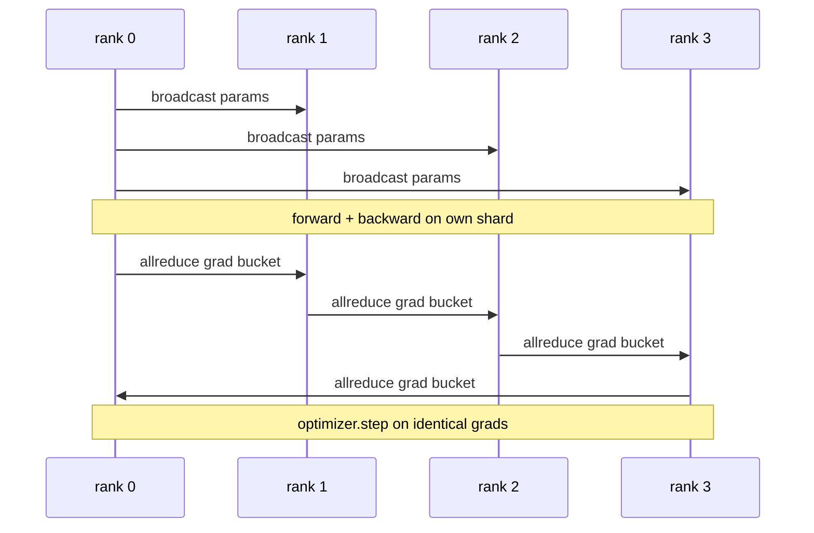

# البيانات المتوازية DDP من الصفر

> الموزع المزدوج هو خطوة فوق كلخفض. لف نموذج، تنشر المعلمات الأولية من الصف 0 بحيث تبدأ كل صف متطابقة، ووضع خطوة خلفية على كل معايير التي تنطلق كلخفض من التراجع، والباقي هو تراجع التراجع. النمط كله 200 خط.

**Type:** Build
**Languages:** Python
**Prerequisites:** Phase 19 Track C lessons 42-49
**Time:** ~90 min

## أهداف التعلم

- سلكي`DistributedDataParallel`-غلفة ذات شكل ينشر المعايير الأولية ويقلل كل التراجع بعد التراجع.
- Spawn N CPU تصنف مع `torch.multiprocessing.spawn`على الخلفية المظلمة مع المواعيد القائمة على الملفات.
- إثبات صحة التزامن بين التراجع والتحرك عن طريق تدريب نفس النموذج على نفس البيانات بشكل متسلسل وإظهار موازية المعلمات لكل خطوة.
- الدفاع عن استخدام السفن (اندماج التدريج) والتداخل (تواصل خلال الخلف) كالتغييرين التي تحويل DDP العمل إلى DDP الإنتاج.

## المشكلة

نموذج ذو برميل مليار دولار مع 12 جيجابايت من التفعيلات لا يناسب مع واحد من أجهزة التشغيل المستهلك. حتى عندما يناسب ، يستغرق التدريب أسابيع. تقسم البيانات بالتوازي المجموعة عبر صفوف N ، يقوم كل صف بحساب المقدمة والخلفية على شظائفها ، وفي كل خطوة يتم جمع تراجع كل صف حتى تظل جميع نسخ N متطابقة. تراجع المجموع هو ما يقوم به المُحسن.

بدون التزامن التدريجي، تنحرف نسخ N بموجب الخطوة 2. لم يعد النموذج "نموذج واحد مدرب على المزيد من البيانات" ، بل هو N نماذج منفصلة التي تقاسم الوزن الأولية. مع التزام المرافقات المرتفعة بشكل سيء (حد واحد كلحد لكل مبرمير، لا تخطي، لا تطبيق) الشبكة هي عقدة الزجاجة والجهازات المعالجة البيانية تتوقف في انتظار السلك. إنّ مركبة (دي.بي.بي) تجعل التزامن بين التدرج تقريباً حراً بالنسبة للحوسبة. ينجح PyTorch DDP القائم على القوانين من خلال تخفيض المراجع، والتداخل مع كلخفض مع الدرجة التالية إلى الوراء، واستخدام NCCL على NVLink. يمكننا القيام بكل ثلاثة على CPU مع غلو وتعلم نفس الدروس.

## المفهوم



### الحاجة إلى عمليات DDP الثلاثة

| Stage | Collective | Why |
|-------|-----------|-----|
| Init | broadcast from rank 0 | Every rank starts with the same parameters |
| After backward | allreduce of each grad | The mean gradient is what the optimiser steps on |
| Sometimes | broadcast of buffers | Batchnorm running stats stay synchronised |

### لماذا يعني وليس جمع

كلخفض-SUM مقسمة على world_size يعطي متوسط التراجع. متوسط غير متغير إلى world_size: معدل التعلم المنسق في صف واحد يعمل في أربعة صفوف لأن حجم التراجع في كل خطوة لا يتغير. كلخفض-SUM دون القسم يضطرك إلى إعادة ضبط معدل التعلم كل مرة تغير فيها حجم الكلاستر. DDP يلف المجموع ويقسم؛ قم بنفس الشيء في الدروس.

### لماذا تراجع السفن

يحتوي محول على آلاف من مضغوطات المعلمات. يقوم كلخفض لكل مضغوط بتسديد مستوى التخفيف المضيء آلاف المرات. يقوم DDP بتجميع التدرجات إلى علبة من 25 ميغابايت و يصدر كلخفض واحد لكل علبة. تتحرك نفس البايتات الإجمالية عبر السلك ولكن يتم تعويض التخفيف على علبة. بالنسبة لنموذج الدروس الصغير نقوم بتجميع كل شيء إلى علبة واحدة. هي الهيكل ما يحمل عبر.

### لماذا تُلقى البذور

كل رتبة يجب أن تدعو`torch.manual_seed(seed + rank)`لتحريك لكن`torch.manual_seed(seed)`بالنسبة لبرامج init. البذور المشتركة الواحدة تعني أن كل صف يرى نفس ترتيب الحزمة (تفاوت البيانات بالتوازي) ؛ البذور المحددة للدرجة للبرامج تعني أن المعلمات الأولية تختلف عن طريق الاختيار المتحرك و التزامن المتحرك لم يعد يجعل النسخ المتكاملات متطابقة. الحصول على نمط البذور الصحيح أو الفشل في اختبار تكافؤ المعلمات في الخطوة 1.

```figure
ci-ddp-grad-sync
```

## بناءها

`code/main.py`تطبيقات:

- `MiniMLP`: 3 طبقات MLP صغيرة بما فيه الكفاية لتحقيق التقارب في ثوانٍ، كبيرة بما فيه الكفاية للكشف عن السلك.
- `DistributedDataParallel(model, world_size)`: يُبث المعلومات في وقت الإنشاء، ويُرجع لفّة`sync_grads`يُقسم المتراكمين جميع المُدرسين المُخفضين إلى مجموعهم حسب حجم العالم.
- `worker(rank, world_size, ...)`: حلقة تدريب كاملة مع `torch.distributed`إبتدائها فوق الغراء، للأمام، والخلف، التزامن، الخطوة.
- `_reference_single_process_loop(...)`: يقوم بتدريب نفس النموذج على نفس البيانات بشكل متسلسل على صف واحد، يستخدمها اختبار تعادل المعلمات المتساوية بالبايت بعد كل خطوة.

إشغله

```bash
python3 code/main.py
```

الناتج: جدول تدريب لكل خطوة يقارن خسارة عملية واحدة ومجموعات التحقق من المعلمات مع DDP على 4 صفوف. تنتج المساراتتان منحنى الخسارة المماثلة لتعديل epsilon ، مما يثبت أن مزامنة التدفق الصحيحة.

## أنماط الإنتاج في البرية

ثلاثة أنماط صلبة DDP بما فيه الكفاية لنقل.

**Find unused parameters.**بعض المسارات الأمامية تخطي المعلمات مشروطًا (الخروج المبكر، جهاز توجيه مزيج من الخبراء). لا توجد لقطات تخطي، ولكن خطة DDP جاهزة للدواء لا تزال تنتظرها وتقلل جميع الحواجز المقطوعة. `find_unused_parameters=True`يخبر DDP أن ننظر إلى أي معايير حصلت على تراجع قبل تقليل. التكلفة هي الرسم البياني المشي في كل خطوة، لذلك دعوه بعيدا ما لم فرع الأمام.

**Static graph optimisation.**عندما يكون المقدمة مستقرة عبر الخطوات`static_graph=True`يسمح لـ DDP بحساب جدول الباديل مسبقًا. التحسين مهم على النطاق: الحساب المسبق يوفّر بضع ميسارات لكل خطوة التي تتراوح بين 10000 خطوة.

**Gradient accumulation needs care.**التراكم في التراجع على ك ميكروباتش دون مزامنة كل ميكروباتش هو فائدة 10x التشغيل.`no_sync()`وذلك كمدير سياق يوقف كل التخفيضات بعد التخفيض. إنسى المدير وكل التخفيضات K مرات لا شيء؛ وتقليل التكامل إلى الأرض.

## استخدمها

أنماط الإنتاج:

- **PyTorch DDP.**التنفيذ القنوني. `torch.nn.parallel.DistributedDataParallel(model)`الأسلاك تتدفق، والتداخل، والسياق لا_مزامن.
- **HuggingFace Accelerate.**يضيف قاذف يُمسك به`torchrun`و الموديل و الملف نفسه نفس الموديل تحت الغطاء
- **Megatron-LM data parallel.**يجمع بين DDP مع متوازي التنسور للنماذج الكبيرة؛ قطعة متوازية البيانات هي نفس النمط كلخفض بعد الخلف.

## أرسله

الدرس 78 (تقسيم ZeRO) يستبدل كل الحدود المحددة بتقليل_تشرين بحيث تخزن كل صف فقط شظيفة من حالة المحسن. الدرس 81 يجمع DDP مع ZeRO في التجربة النهائية إلى النهاية.

## التمارين

1. إضافة علب التراجع من الحجم المُمكن التكوين وقياس السرعة مقابل واحد كل خفض لكل مُعيار على نموذج أعمق.
2. تنفيذ`no_sync()`كمدير سياق و التحقق من تراكم التدفقات تتطابق مع خط أساس عملية واحدة على الكربونات الكترونية.
3. إضافة`find_unused_parameters`وضع حيث يخطط المقدم أحياناً إلى أحد طبقات MLP؛ بدون العلم يجب أن يكون الجري في حالة تعقّب.
4. استبدل غلو بـ `torch.distributed.barrier()`- التزامن فقط ليشعر الفرق بين التزامن القائم على القليل والحواجز.
5. قياس التكلفة العليا للتزامن بين التهابات كجزء من وقت الخطوة لأحجام اللحوم 1، 16، 256 و شرح التوسع.

## الشروط الرئيسية

| Term | What people say | What it actually means |
|------|----------------|------------------------|
| DDP | "Data parallel" | Wrapper that broadcasts params and allreduces grads each step |
| Bucket | "Fuse grads" | Group N small allreduces into one large one |
| Overlap | "Hide comm" | Issue allreduce while later layers still computing backward |
| no_sync | "Accumulate" | Skip the post-backward allreduce for gradient accumulation |
| find_unused | "Branchy forward" | Detect parameters with no grad before reducing |

## المزيد من القراءة

- [PyTorch DistributedDataParallel docs](https://pytorch.org/docs/stable/generated/torch.nn.parallel.DistributedDataParallel.html)
- [PyTorch DDP internals tutorial](https://pytorch.org/tutorials/intermediate/ddp_tutorial.html)
- [Li et al, PyTorch Distributed: Experiences on Accelerating Data Parallel Training](https://arxiv.org/abs/2006.15704)
- المرحلة 19 الدروس 76 - الجماعات DDP مبنية على
- المرحلة 19 الدروس 78 - زرو شقق يبدل كل الحد الأساسي للحد من الدرجات مع reduce_scatter
