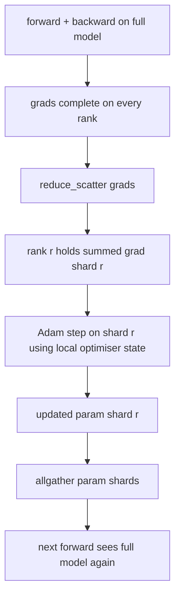

# زرو تحسين حالة شرد

> آدم تخزين اثنين من تقديرات اللحظة لكل مبرمج، كلاهما في float32. نموذج معدل 7B يحمل 56 جيجا غابايت من حالة تحسين. زرو مرحلة 1 تقطع على طول صفوف N؛ كل صف يمتلك 1/N من المكيف. بعد الخطوة المحلية تم إرسال شرائح المعلمات المحدثة مرة أخرى، كل صف يعيد بناء النموذج الكامل، وبدء الخطوة التالية. الفوز هو انخفاض خطي في الذاكرة على أكبر تخصيص واحد في كومة التدريب.

**Type:** Build
**Languages:** Python
**Prerequisites:** Phase 19 Track C lessons 42-49
**Time:** ~90 min

## أهداف التعلم

- حالة تحسين الشظايا (اللحظة الأولى والحظة الثانية، نسخة رئيسية fp32) عبر صفوف N بحيث كل صف يملك 1/N.
- استخدم "reduc_scatter" لتقديم كل صف فقط مجموع تراجع شرائحها، ثم جمع جميعها لنشر شرائح المعلمة المحدثة مرة أخرى.
- احسب جدول حفظ الذاكرة للمرحلة 1، المرحلة 2، المرحلة 3 مقابل DDP الفانيليا.
- الدفاع عن اختيار المرحلة 1 مقابل المرحلة 2 مقابل المرحلة 3 على حجم النموذج وفضل الميزانية.

## المشكلة

يكرر Vanilla DDP كل شيء: المعلمات والتحريفات وحالة التحسين موجودة بالكامل في كل صف. بالنسبة لنموذج 7B-المعلم في fp16 يعني 14 جيجابايت من المعلمات، 14 جيجابايت من التحريفات، و 28 جيجابايت من حالة التحسينات لكل صف. الحالة التحسينية هي أكبر مصطلح وأسهل للشقق لأنه يتم لمسها فقط أثناء الخطوة، وليس أثناء المضي قدما أو الخلفية.

مرحلة 1 من "زيرو" تُقضي على حالة التمثيل. كل صف يحمل 1/N من لحظات آدم. بعد الخلف، بدلاً من تقليل التسلسل الكامل والتحرك محلياً، تقوم ZeRO بتقليل_تسلسلات بحيث لا تتلقى كل صف سوى التسلسل المجمّع لقطعة. يطبق الرتب خطوة التكامل على شظائه من المعلمات الرئيسية. ثم تجمع كل شرائح المعايير المحدثة مرة أخرى بحيث كل صف لديه نموذج كامل للقدمة التالية. الذاكرة المُتحسنة تنخفض بـ N حركة المرور عبر الأسلاك لكل خطوة هي نفس DDP: واحد reduce_scatter زائد واحد allgather يساوي واحد allreduce من خلال عرض النطاق. الذاكرة تفوز، وتتبع.

## المفهوم



### مراحل الزيرو

| Stage | What is sharded | Memory per rank | Comm per step |
|-------|----------------|------------------|---------------|
| DDP | nothing | params + grads + optim | 1x allreduce |
| ZeRO-1 | optimiser state | params + grads + optim/N | 1x reduce_scatter + 1x allgather |
| ZeRO-2 | optim + grads | params + grads/N + optim/N | 1x reduce_scatter + 1x allgather |
| ZeRO-3 | optim + grads + params | params/N + grads/N + optim/N | 1x allgather per layer + 1x reduce_scatter per layer |

المرحلة 1 هي أرخص فوز لأن حالة التحسين تهيمن على الميزانية. المرحلة 2 تحتاج إلى منطق تراكم شرائح التراجع ولكن عرض النطاق هو نفسه. المرحلة 3 (FSDP) تدفع للاتصالات لكل طبقة للأمام والخلف، وتحصل على انخفاض الذاكرة شرائح المعلم. ينفذ الدروس المرحلة 1 بالكامل.

### الرياضيات الذاكرة، الأرقام الحقيقية

بالنسبة لنموذج مع ملامح P المدربة مع آدم بدقة مختلطة:

| Term | Vanilla | ZeRO-1 | Why |
|------|---------|--------|-----|
| fp16 params | 2P bytes | 2P bytes | needed for forward |
| fp16 grads | 2P bytes | 2P bytes | needed for backward |
| fp32 master copy | 4P bytes | 4P/N bytes | only the optim uses it |
| fp32 first moment | 4P bytes | 4P/N bytes | only the optim uses it |
| fp32 second moment | 4P bytes | 4P/N bytes | only the optim uses it |
| Total | 16P bytes | 4P + 12P/N bytes |   |

عند N=8: فانيلا 16P، زرو-1 5.5P، انخفاض 65%. عند N=64: فانيلا 16P، زرو-1 4.19P، انخفاض 74%.

### لماذا ضربات تقليل_تشتت كل تقليل-ثم-تقطيع

كلخفض يعطي كل رتبة تراجع كامل المجموع. إذا كنت بحاجة فقط إلى شارت r، فإن (N-1) / N من التراجع الذي تم تقليصه يُضيع على رتبة r. تقليل_تشتت يوفر بالضبط الشظيفة التي تمتلكها كل صف؛ البايتات لكل صف هي نفسها مثل allreduce (بما أن allreduce هو reduce_scatter + allgather) ولكن يتم استبدال النصف الثاني بواسطة شظيفة المعلمات كلجمع في وقت لاحق. الأسلاك الشبكة هي نفسها DDP، والذاكرة مقسمة.

```figure
cd-zero-shard
```

## بناءها

`code/main.py`تطبيقات:

- `flatten_params(module)`و`unflatten_into(module, flat)`يجمع معايير النموذج إلى تنسور واحد متواصل ويكشف الخلف. التخطيط المسطح هو ما يجعل شقق من خلال الترتيب شريحة بسيطة.
- `ZeroOptimizer(model, world_size, rank, lr)`الذي يمتلك شظيفة الدرجة من النسخة الرئيسية و لحظات آدم.
- `step()`الذي يعمل على تقليل_تشتت على التسلسل السطحي، يطبق آدم على شظيفة الصف، ويعيد جميع المعلمات المحدثة.
- عرض تجريبي تدرب 3 طبقات MLP لمدة 20 خطوة وتطبيع ميزانية الذاكرة لكل خطوة جنبا إلى جنب مع خط أساسي DDP الفانيليا.

إشغله

```bash
python3 code/main.py
```

الناتج: فقدان لكل خطوة و جدول الذاكرة الذي يظهر ZeRO-1 يحمل 1/N من حالة المحسن على كل صف مقابل النسخة الكاملة من DDP.

## أنماط الإنتاج في البرية

ثلاثة أنماط صلبة زيرو بما فيه الكفاية لنقل.

**Sharded checkpointing matters.**يتم تقسيم حالة التكيف في ZeRO-1 عبر الصفوف؛ يجب على نقطة التفتيش تسجيل أي صف يمتلك أي. يُبني الدروس 80 منشور نقطة التفتيش الممزقت الذي يستأنف تشغيل ZeRO على نفس حجم العالم. بدونها لا يمكن قراءة الحالة المحفوظة عند إعادة تشغيلها.

**Mixed precision is the point.**زيرو هي تقنية بدقة مختلطة. النسخة الرئيسية fp32 هي ما يتم شققها. تدير زيرو دون دقة مختلطة يدفع ضريبة الذاكرة على fp32 master دون الفوز المقابلة fp16 إلى الأمام. تشغيل الإنتاج دائمًا زيرو مع أوتوكاسط أو أوزان bf16.

**Stage 1 is a near-free win.**إن الاتصالات متطابقة مع DDP من حيث عرض النطاق. توفير الذاكرة خطي في N. التكلفة الوحيدة هي الحفظ بالحسابات لقطعة المحسن. تقوم سلسلة الإنتاج بتقليصها بشكل افتراضي إلى المرحلة 1 ما لم تكن ذاكرة القسم المعلمة مشكلة أيضًا. ثم المرحلة 2 أو 3 تتداول الاتصالات للذاكرة.

## استخدمها

أنماط الإنتاج:

- **DeepSpeed ZeRO.**تنفيذ المرجعية `deepspeed_config.json`يختار مرحلة 1/2/3 وحجم القسم.
- **PyTorch FSDP.**المُتَساوِيّة الأصليّة لـ (بيتورش)`ShardingStrategy.SHARD_GRAD_OP`هو زيرو-2`FULL_SHARD`هو زيرو-3.
- **HuggingFace Accelerate.**يربط كل من DeepSpeed و FSDP تحت تشكيل موحد.

## أرسله

الدروس 79 (موازة الأنابيب) هي محور التمزيق الأرثوجونال: بدلاً من تقسيم حالة المحسنة عبر نفس النموذج ، تقطع أنابيب الأقمشة عبر الصفوف. الدروس 81 تكوين DDP + ZeRO على التجربة النهائية إلى النهاية.

## التمارين

1. تمتد إلى ZeRO-2 عن طريق تقطيع التدرجات: كل صف يحتفظ فقط بتدرجات لقطعته ، والتي يتم تحقيقها عن طريق تسريح الجزء غير المتقطع بعد التراجع.
2. إضافة ملف تعريف الذاكرة الذي يطبخ استخدام البايت الفعلي fp32 على صف 0 مقابل تنبؤ الصيغة.
3. قياس الوقت في كل خطوة في ساعة الجدار من فانيلا DDP مقابل ZeRO-1 ويتحلل إلى الأمام والخلفية، الاتصالات.
4. تنفيذ قطع التراجع تحت ZeRO-1: يجب حساب معيار L2 عبر جميع الشظايا عن طريق كلخفض المعيار المحلي إلى مربع.
5. تنفيذ "ZRO سذاجة" مع allreduce بدلا من reduce_scatter، قياس الفرق في الوقت السلكي. الدفاع عن خيار reduce_scatter بأرقام.

## الشروط الرئيسية

| Term | What people say | What it actually means |
|------|----------------|------------------------|
| ZeRO-1 | "Shard the optimiser" | Each rank holds 1/N of fp32 master + Adam moments |
| ZeRO-2 | "Shard grads too" | Each rank also drops the non-shard gradients after reduce_scatter |
| ZeRO-3 | "Shard params" | Each rank holds 1/N of fp16 params; allgather per layer in forward |
| Master copy | "fp32 weights" | The high-precision parameter copy the optimiser updates |
| Reduce_scatter | "Split the sum" | Deliver each rank only its shard's summed gradient |

## المزيد من القراءة

- [Rajbhandari et al, ZeRO: Memory Optimizations Toward Training Trillion Parameter Models](https://arxiv.org/abs/1910.02054)
- [DeepSpeed ZeRO documentation](https://www.deepspeed.ai/tutorials/zero/)
- [PyTorch FSDP documentation](https://pytorch.org/docs/stable/fsdp.html)
- المرحلة 19 الدروس 76 - تخفيض_تشتت وجميعا هذا الدروس يقف على
- المرحلة 19 الدروس 80 - نقطة تفتيش شقق يجب أن تستخدم دولة ZeRO
