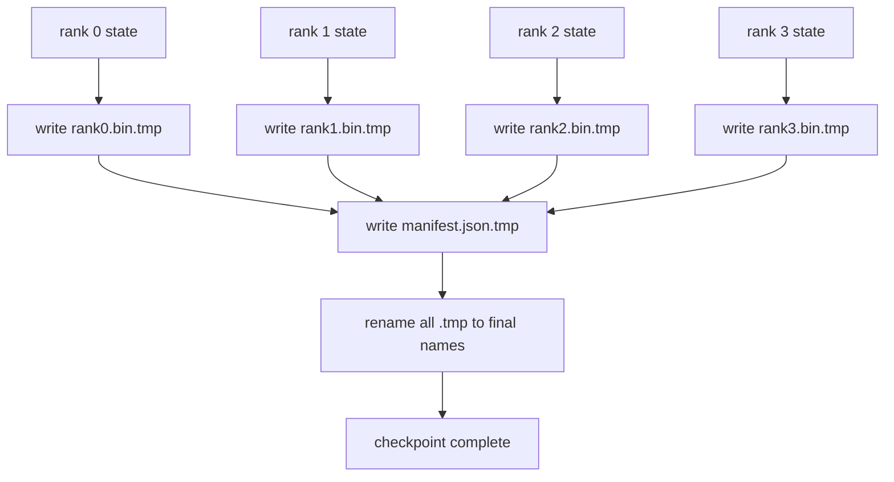

# نقطة تفتيش مقطوعة و سير الذرة

> وظيفة تدريبية بعيار 70B تعيق بسبب فشل العقد كل بضع ساعات أسلوب نقطة التفتيش يقرر ما إذا كنت تفقد 30 دقيقة أو 30 ساعة. نقطة تفتيش مقطوعة تكتب شظيفة كل رتبة بالتوازي وتسجل الملكية في مذكرة. سيرتكاب أعمال تحميل كل شقق من الملف الخاص بها، إعادة بناء الدولة على نفس حجم العالم، والخطوات الأكثر تفاعلا كما لو لم يحدث شيء. الكتابة الذرية تحافظ على نقطة تفتيش شبه مكتملة من تسمم السيرة الذاتية التالية.

**Type:** Build
**Languages:** Python
**Prerequisites:** Phase 19 Track C lessons 42-49
**Time:** ~90 min

## أهداف التعلم

- حفظ نقطة تفتيش متعددة الصفوف كملف شارت لكل صف و إضافة إلى مذكرة تسجل أي صف يمتلك ما.
- استخدم نمط الكتابة الذرية (الكتابة إلى مسار مؤقت ثم إعادة تسميته) حتى لا تنتج النقطة التفتيشية منتصف الكتابة المتصاعدة نصف نهايتها.
- استئناف من المظاهر، التحقق من حالة متساوية البايت لكل من معايير fp16 وحالة إضفاء التكيف على ZeRO في كل صف.
- الدفاع عن النظام المبين ضد ثلاثة أوضاع الفشل: تغيير حجم العالم، وعدد القشرات غير مطابقة، والكتابة الجزئية.

## المشكلة

نقطة تفتيش الفانيليا تقرأ جميع المعلمات وحالة المحسنة إلى صف 0 ، تجمع ، وتكتب ملف واحد. لنموذج 70B الذي هو 1.1 تي بي من الدولة من خلال منفذ شبكة من صف واحد. الكاتب يمنع كل صفوف أخرى لأنهم يتوقون للانتظار عرض النطاق IO هو أبطأ اتصال شبكة واحد GPU، وليس الجماعة. في مجموعة حقيقية قد تستغرق خطوة التجميع ثم الكتابة وقتًا أطول من ساعة التدريب السابقة، مما يعني أن العمل يصل إلى أقل من نقطة تفتيش واحدة في يوم التدريب.

نقاط التفتيش الممزقة تغير النمط: كل صف يكتب شظائفه الخاصة إلى ملفه الخاص بالتوازي. السجلات المعلنة التي تصنفها المرتبة التي تمتلكها تلك الشظايا لذا استئناف يمكن أن يعيد كل شظايا حيث جاءت. يكتب مجموع مقياس عرض النطاق مع الكluster. نقطة تفتيش 1 تي بي التي استغرقت 4 ساعات عبر صف واحد تستغرق 4 دقائق عبر 64 صف. بالإضافة إلى ذلك، يمنحك المخطط عقدًا لنواظف غير متوافقة: تغيير حجم العالم يمكن اكتشافه، والكتابات الجزئية يمكن اكتشافها، ويمكن أن يفشل مسار الحمل بصوت عال بدلاً من الصمت باستخدام البيانات القديمة.

## المفهوم



### النظام المعلن

```json
{
  "world_size": 4,
  "step": 1234,
  "wall_clock_seconds": 4521,
  "shards": [
    {"rank": 0, "path": "rank0.bin", "sha256": "...", "param_shard_offset": 0, "param_shard_numel": 65536},
    {"rank": 1, "path": "rank1.bin", "sha256": "...", "param_shard_offset": 65536, "param_shard_numel": 65536}
  ],
  "schema_version": 1
}
```

ثلاثة حقل تحمل الحمل`world_size`يجعل سيرته الذاتية على حجم مختلف يفشل بصوت عال بدلا من أن تكون فاسدة بصمت`sha256`في كل شظيفة يلتقط كتابة جزئية أو فاسدة`param_shard_offset`و`param_shard_numel`لكل شقّة دع الحمولة تعيد بناء تنصر المعلمات السطحية في الموقف الصحيح.

### الكتابة الذرية

النمط القياسي: اكتب كل شقق إلى`<name>.tmp`، اكتب المذكرة إلى`manifest.json.tmp`إعادة تسمية POSIX داخل نفس النظام الملفي هي ذرية؛ إما الملف الجديد موجود بالكامل أو القديم هو. إن حادث قبل إعادة تسمية النهائي يغادر نقطة التفتيش السابقة كالمباشر. دون كتابة ذرية يمكن أن يترك حادث شظيفة جزئية مع بيان حالي يشير إليها، والحمل يفسد حالة المحسن في سيرته الذاتية.

### ثلاثة أوضاع فشل يجب أن تتدافع النظام عن

| Failure | Symptom | Defence |
|---------|---------|---------|
| World-size change | resume on N=8 with manifest from N=4 | world_size mismatch in manifest, fail loudly |
| Shard count mismatch | resume sees fewer rank*.bin files than shards in manifest | enumerate shards, verify every one exists |
| Partial write | shard file truncated mid-flush | sha256 verification on load |

كل دفاع يرفض الحمل السيء مبكراً، البديل هو الفساد الصامت الذي يظهر بعد 100 خطوة عندما تذهب الخسارة إلى NaN.

### لماذا ملفات لكل رتبة، وليس ملف واحد كبير

كتابة متزايدة إلى ملف واحد عبر `O_APPEND`يعمل على POSIX للكتب المتحالفة بالبايت ، ولكن في الممارسة العملية فإن التداعيات داخل شارت واحد تتراوح بين مناطق بحجم MB والقفز يهيمن عليها. لا يوجد أي خلاف في ملفات الفئة وتستفيد من الشريط عندما يكون النظام الملفي الأساسي متوازيا (Lustre ، GPFS). تستخدم كومات الإنتاج (DeepSpeed ، FSDP ، NeMo) جميعها ملفات الفئة لهذا السبب.

```figure
ci-sharded-checkpoint
```

## بناءها

`code/main.py`تطبيقات:

- `ShardManifest`فئة البيانات مع النموذج أعلاه بالإضافة `to_json`-أجل`from_json`. . .
- `save_sharded(state_dict_per_rank, dir, step)`يكتب كل صف الدينية إلى ملفه الخاص باستخدام نمط التغيير الذري، ثم يكتب المخطط.
- `load_sharded(dir, expected_world_size)`الذي يقرأ المخطط، يُحقق من شكل كل شظيفة، ويعود إلى إصدارات الحالة لكل رتبة.
- اختبار ذهاب وإياب: بناء حالة لكل رتبة، حفظ، تحميل، تأكيد بايت-ساوي.

إشغله

```bash
python3 code/main.py
```

إنتاج: 4 ملفات شارت زائد المخطط مكتوب، ثم إعادة تحميل مع التحقق من بايت.

## أنماط الإنتاج في البرية

ثلاثة أنماط تقسيم نقطة التفتيش بما فيه الكفاية لشحن.

**Async write.**تعطي كومات الإنتاج نقطة التفتيش كتابة على خيط أو عملية منفصلة حتى يستمر التدريب. الحاجز في نقطة التفتيش التالية: لا تبدأ الحفظ التالي حتى يتم الانتهاء من السابق.`async_io`هذا ما تفعله الدرسة، والدرس يبقي الكتابة متزامنة حتى تكون الخطوات مرئية.

**Local fast disk first, then async upload.**كتابة إلى NVMe المحلي (سريع) ثم تحميل التزامن إلى S3 أو GCS. النمط المستويين يبقي نقطة التفتيش داخل المجموعة سريعة لترجمه أثناء شحن نسخة دائمة خارج المجموعة للمؤلفات. يحمل المخطط المسار المحلي؛ ويحمل المخطط تحميل المسار البعيد.

**Rotation matters.**تعمل عمليات الإنتاج على الحفاظ على نقاط التفتيش K الأخيرة (عادة 3-5) وتدور الأكبر سناً. دون دوران يملأ القرص منتصف الجولة ويفشل نقطة التفتيش التالية. مع التناوب يقوم الحفظ التالي بحذف الأكبر سناً أولاً، مما يطلق الحرية على الميزانية.

## استخدمها

أنماط الإنتاج:

- **DeepSpeed checkpointing.** `deepspeed.save_checkpoint(tag=step)`يكتب ملفات لكل رتبة و `latest`الملف يُشير إلى علامة النشاط
- **PyTorch FSDP checkpointing.** `torch.distributed.checkpoint`يُحفظ الحالة الممزقة مع `Planner`الذي يقرر ترتيب كل رتبة.
- **NeMo.**يربط " ديبسيبيد " و " ايف إس دي بي " بنوع`save_to_checkpoint`API التي تضيف البيانات المعدنية.

## أرسله

الدرس 81 يحفظ نقطة تفتيش مقطوعة من إطار DDP+ZeRO من نهايتها إلى نهايتها ويرجعها إلى نفس حجم العالم لإثبات صلة عقد سيرته الذاتية.

## التمارين

1. إضافة كتابة غير متزامنة: بدء حفظ في خيوط ودع التدريب يستمر. حظر حفظ التالي حتى تنتهي السابقة.
2. إضافة`last_5_steps`التناوب: الحفاظ على 5 نقاط تفتيش أحدث، وإزالة الأكثر قداسة قبل حفظ واحدة جديدة.
3. إضافة مسار التحقق السريع CRC فقط لإعادة الشحن الداخلي (التداول يدور نقطة تفتيش إلى كونها نقطة تفتيش جديدة نشطة دون sha256 كاملة).
4. إضافة حمولة عبر العالم: إعادة توازن الشظايا من N = 4 إلى N = 8 من خلال قراءة المظاهر، وتحديد السلاسل، وإعادة شظائف.
5. إضافة تحميل إلى S3 مزيف (قائمة ثانية) و كتابة إرشاد تحميل. الدفاع عن سياسة تخزين المستويين.

## الشروط الرئيسية

| Term | What people say | What it actually means |
|------|----------------|------------------------|
| Sharded checkpoint | "Per-rank save" | Each rank writes its own shard file in parallel |
| Manifest | "Index" | JSON file recording shard paths, offsets, and sha256 |
| Atomic write | "tmp then rename" | Write to .tmp then POSIX rename so a crash leaves the previous file live |
| Partial write | "Truncated shard" | A crash during write produces a corrupt shard; sha256 catches it |
| Rotation | "Keep last K" | Delete oldest checkpoint before writing new one to bound disk usage |

## المزيد من القراءة

- [DeepSpeed checkpointing](https://deepspeed.readthedocs.io/en/latest/model-checkpointing.html)
- [PyTorch torch.distributed.checkpoint](https://pytorch.org/docs/stable/distributed.checkpoint.html)
- [POSIX rename atomicity](https://pubs.opengroup.org/onlinepubs/9699919799/functions/rename.html)
- المرحلة 19 الدروس 78 - الدولة ZeRO هذا المراقبة مصممة لإنقاذ
- المرحلة 19 الدروس 81 - التجربة التجريبية من نهاية إلى نهاية
