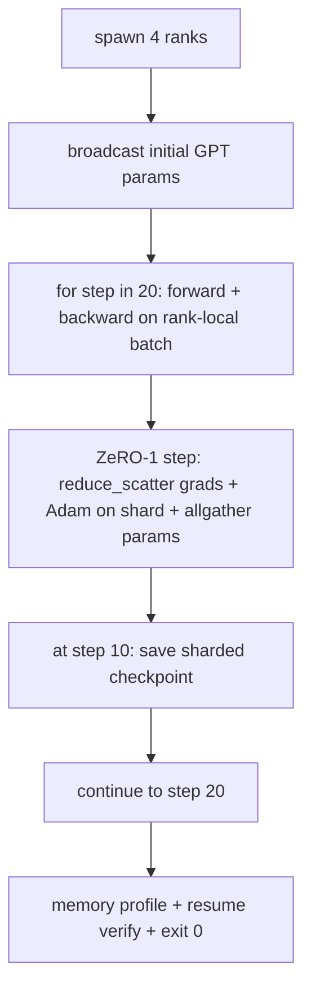

# التدريب الموزع من نهاية إلى نهاية

> دروس 76 إلى 80 كل منها بنيت قطعة واحدة. هذه هي الجمع: GPT الصغيرة تدرب على 4 صفوف محاكاة مع DDP للتزامن التدريجي، ZeRO-1 للتشقق الحالة المثالي، ونقطة تفتيش شقق في علامة منتصف الطريق. تم تشغيل التجربة 20 خطوة، وتنهي نفسها، وتطبيع منحنى الخسارة بالإضافة إلى ملف ذاكرة، وتكتب نقطة تفتيش قابلة لإعادة التشغيل.

**Type:** Build
**Languages:** Python
**Prerequisites:** Phase 19 Track C lessons 42-49
**Time:** ~90 min

## أهداف التعلم

- قم بتجميع DDP (المدرسة 77) + ZeRO-1 (المدرسة 78) + نقاط التفتيش الممزقة (المدرسة 80) في حلقة تدريبية واحدة.
- تدريب نموذج لغة محول 2 طبقات على جسم صناعي صغير لمدة 20 خطوة عبر 4 صفوف محاكاة.
- طبع جدول الخسائر لكل خطوة، وملف ذاكرة لكل رتبة، وخطاب نقطة التفتيش الذي يستمر بنفس الكمية العالمية.
- الدفاع عن التركيبة: كل قطعة يمكن اختبارها بشكل مستقل في الدروس السابقة وهذا الدروس يثبت أنها تكوين.

## المشكلة

حجر أساسي هو دليل على ان القطع تناسب بعضها البعض الدروس 76 المجموعات المطبقة الدروس 77 أغلقتهم في DDP. الدروس 78 حالة تحسينات شقق مع تخفيض_تشتت. دراسة 79 تحليل خط الأنابيب. الدروس 80 أنقذت نقطة تفتيش مُمزقتة كل درس كان بمثابة اختبار خاص به تستخدم عملية تدريب حقيقية كل البدائية في وقت واحد؛ إذا كان التركيب خاطئًا، فإن الخسارة تختلف، أو ترفض نقطة التفتيش استئنافها، أو تتزايد الذاكرة لكل رتبة عندما يجب أن تقلص.

هذه الدروس تشغيل التجربة من نهايتها إلى نهايتها وتحقق من أربعة مستثمرات: (أ) الخسارة تقل بشكل متوحد عبر 20 خطوة داخل ضجيج العائمة، (ب) كل صف يحمل نفس المعيار القياسي في كل خطوة، (ج) ذاكرة المحسنة لكل صف يساوي صيغة ZeRO-1 12P / N البايت، و (د) نقطة التفتيش في الخطوة 10 إعادة تحميل البايت-ساوي عند إعادة تشغيل. التجربة تنتهي ذاتياً: 20 خطوة، أمر واحد، خروج 0.

## المفهوم



### الـ " ميني جي بي تي "

النموذج صغير على وجه الخصوص: 2 كتلة تحويل، ضم ضباب 32، 4 رؤوس الاهتمام، الكلمات 64، طول التسلسل 16، دفعة 4. بضعة آلاف المعلمات الكبير بما فيه الكفاية لتنفيذ كل قرار التشغيل (التأمل متعدد الرؤوس يدير المسار المخفي القياسي؛ ليرنورم لديه أوزان للتزام؛ رأس LM هو إلقاء خطي منفصل إلى الكلمة). صغير بما فيه الكفاية لكى تنتهي 20 خطوة على 4 صفوف من CPU في ثوان

### قواعد التكوين

| Lesson piece | What it owns | What it leaves to the loop |
|--------------|--------------|----------------------------|
| DDP broadcast | Initial parameter sync | One call at construct time |
| ZeRO-1 step | Gradient sync, master copy update, parameter broadcast | One call per step replacing optimiser.step |
| Sharded checkpoint | Persist per-rank state, manifest with sha256 | Called on rank 0 with state collected via allgather |
| Training loop | Forward, backward, loss logging | Calls the three above in order |

لا يعرف الحلقة عن ملفات reduce_scatter أو rendezvous. وحدات ZeRO ومقاطع التفتيش تعرض واجهات ضيقة التي يكونها الحلقة.

### لماذا GPT صغير وليس فقط MLP

كان المعلومات المختلفة من الدروس 77 كافية للتحقق من التزامن بين التدرجات. يضيف GPT الصغير ثلاثة أشياء: رأس LM منفصل فوق الكلمة (في هذه الدروس ، منفصلة من أجل وضوح ؛ GPT الكاملة عادة ما تربط الرأس إلى إضافة الرمز) ، softmax + cross-entropy كخسارة (أكثر حالات الحافة الرقمية من MSE) ، والقدمة غير متساوية (التربية ثم الاهتمام ثم MLP لكل طبقة). إنّ الالتزام بمخطط MLP للحجر الأساسي سيسدّ ما إذا كان التركيب يتعامل مع LayerNorm أو شكل درجة الطبقة المضمنة بشكل صحيح.

### الإنتهاء الذاتي يعني الخروج 0

الحلقة تعمل على 20 خطوة ثابتة وتخرج`while True`لا تدخل بشري، لا سير سيرته الذاتية من الحالة الخارجية. حجر نهاية يمكنك تركها تعمل دون مراقبة وتجد سجل كامل عندما ينتهي هو حجر نهاية التي تثبت أن النظام محمول بشكل صحيح. إذا كان أي قطعة لا يصل إلى الحدود التجربة لا يعود أبدا وبرنامج الاختبار يلتقطها.

```figure
ci-distributed-assembly
```

## بناءها

`code/main.py`تطبيقات:

- `MiniGPT`: محول طبقة 2 مع مراقبة ذاتية مخفية ورأس LM منفصل.
- `make_corpus(seed, total_tokens)`: بيانات تحديدية للتنبؤ بالبرمجة التالية.
- `_train_worker`: ينشأ لكل رتبة؛ ينشر إعدادات init، ويقوم بتشغيل الحلقة، ويدعو خطوة ZeRO، ويكتب نقطة التفتيش الممزقتة في الخطوة 10.
- `verify_resume`: بعد التشغيل الرئيسي، إعادة شحن نقطة التفتيش الخطوة 10 في العملية وتؤكد أن الشرائح الرئيسية المحفوظة تتطابق مع اللقطة الفورية في الذاكرة بايت مقابل بايت.
- `main`: ينسق النموذج التجريبي بأكمله، ويقوم بطبع جدول الخسائر، وملف الذاكرة، ونتيجة التحقق.

إشغله

```bash
python3 code/main.py
```

الناتج: جدول الخسائر في 20 صف، و 4 صفوف لكل صفوف من المعلومات المتعلقة بالذاكرة، و مذكرة نقطة التفتيش، و خط "إعادة التحقق" على النجاح.

## أنماط الإنتاج في البرية

ثلاثة أنماط تنتهي من التركيب لدورات حقيقية.

**Checkpoint every K minutes, not every K steps.**يختلف وقت الخطوة مع طول المقطع والعدد من الميكروباتش. يتم ضبط تسلسل نقطة التفتيش لمدة 10 دقائق نفس الحساب بغض النظر عن حجم النموذج. تستخدم الدروس خطوة على أساس البساطة. تستخدم الإنتاج على أساس الساعة الحائطية.

**Detect divergence early.**إضافة مسارات الإنتاج حارس NaN بعد الظهر ومكشف ارتفاع الخسارة. إذا قفز الخسارة بأكثر من 2x في خطوة واحدة ، ارجع إلى نقطة التفتيش السابقة بدلاً من السماح للمحافظ على التميز إلى حالة مهينة. منحنى الخسارة في الدروس سلس بحيث لا يتم استخدام الحارس ولكن الرف يبقى.

**Aggregate the memory profile across ranks.**يختلف الذاكرة لكل صفوف من خلال الرتب في الجوائز الحقيقية (الرتب مع أكبر مرحلة خط الأنابيب تحتوي على المزيد من التفعيلات). تسجل الإنتاج أقصى عدد من الرتب بالإضافة إلى المتوسط. الطباعة الدروس لكل صف لإظهار مطابقة الصيغة.

## استخدمها

أنماط الإنتاج:

- **DeepSpeed.**يجمع بين DDP + ZeRO + خط أنابيب + تشغيل نقطة التفتيش تحت تشكيل واحد. تكوين الدروس هو شكل DeepSpeed في التفاصيل.
- **PyTorch FSDP.**المُتَساوِي الأصلي.`FullyShardedDataParallel`مع`ShardingStrategy.SHARD_GRAD_OP`هو زيرو-2
- **NeMo and Megatron-LM.**أضف متوازي التنسور للنماذج الأكبر جداً؛ وإلا فإن التركيب هو نفس الشكل.

## أرسله

تنتهي المسار الكامل هنا. الدرس الست معا هي النظام الفرعي للتدريب الموزع الذي سيبنيه فريق حقيقي قبل اعتماد DeepSpeed. تم إثبات الاستخراج ضد الغضب وتم ممارسة أساليب الفشل. المرحلة 17 (البنية التحتية والإنتاج) هي المكان الذي تأخذ هذا إلى مجموعة حقيقية.

## التمارين

1. إضافة تقسيم متوازي للضغط على رأس الاهتمام والتحقق من أن الخسارة تتطابق مع خط أساسي الصف الواحد. صفين: نصف الرؤوس لكل صف، كلخفض من خروج الاهتمام.
2. أضف تراكم التراجع على 4 ميكروباتش و أثبت أن التراجع يساوي تراجع مجموعة كبيرة واحدة.
3. إضافة سير سيرته الذاتية من الخطوة 10 المسار الذي يواصل التدريب في الواقع إلى الخطوة 20 ويؤدي إلى نفس الخسارة النهائية كما كان الحال في الجولة الأصلية.
4. إضافة بيانات تصدير (الخسارة، المعيار الدراسي، وقت الخطوة) إلى JSONL حتى يتم تصور الجولة بعد الفعل.
5. إضافة حارس NaN الذي يتدحرج إلى نقطة التفتيش السابقة على نقطة الخسارة، وإجبار نقطة مع مضاعف LR خطوة واحدة على ممارسة التدحرج.

## الشروط الرئيسية

| Term | What people say | What it actually means |
|------|----------------|------------------------|
| End-to-end | "Wire it all up" | One run composes every piece, not a unit test per piece |
| Memory profile | "GB per rank" | Bytes held on each rank for params, grads, optimiser state |
| Resume contract | "Save and load" | Per-rank state byte-equal after a checkpoint round-trip |
| Self-terminating | "Bounded run" | Fixed step count, exit 0 on completion, no human in the loop |

## المزيد من القراءة

- [DeepSpeed end-to-end training tutorial](https://www.deepspeed.ai/getting-started/)
- [PyTorch FSDP advanced tutorial](https://pytorch.org/tutorials/intermediate/FSDP_advanced_tutorial.html)
- [Megatron-LM training script reference](https://github.com/NVIDIA/Megatron-LM)
- المرحلة 19 الدروس 76-80 - كل قطعة هذا الدروس يكوّن
- المرحلة 17 - نقل التركيب إلى مجموعة حقيقية
