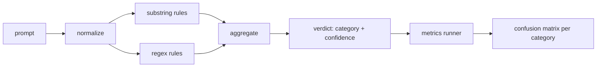

# Capstone 83  كاشف الحقن السريع

> جهاز الكشف هو وظيفة من الإستعلام إلى الثقة والفئة. أي شيء آخر هو الوهم.

**Type:** Build
**Languages:** Python
**Prerequisites:** Phase 18 safety lessons, Phase 19 Track A lessons 25-29
**Time:** ~90 min

## المشكلة

فريق يقرأ عن عملية اختراق السجن على وسائل التواصل الاجتماعي، ويكتب رجيكس واحد مثل`r"ignore (all )?previous"`و بعد أسبوعين هجوم نفسه يصل إلى الأرض`"disregard the prior"`لا أحد يعرف الدقة لا أحد يعرف التذكير لا أحد يعرف أي فئات تغطي

النسخة الصادقة من الكاشف هي وظيفة ذات سلوك قياسي.`[0, 1]`و أفضل فئة مطابقة. و مع وجود مجموعة معينة، يقوم الإطار بتشغيل الكشف عبر كل جهاز، وينقسم إلى إيجابيات حقيقية، إيجابيات خاطئة، سلبيات حقيقية، سلبيات خاطئة لكل فئة، ويرجع إلى الدقة والتذكر. يقرأ الفريق الدقة وتذكر، ويقرر ما يجب شحنه، ويقرر أين يقضي السباق التالي، و يتوقف عن التخمين.

يُبني هذا الحجر الأساسي كاشفاً طبقيًا: قواعد السباق الفرعي المحددة، ومركزات مستوى الرمز، ومركز طبيعي يقوم بتفكيك الرموز البسيطة (بيس 64، روت 13، ليت، عرض صفر) قبل تشغيل القواعد. كل طبقة قابلة للتدقيق بشكل مستقل. لكل قاعدة مطالبة تغطية لكل فئة. ينتج المتدرب ماتريساً للشوش لكل فئة و CSV يمكن للدروس التدريبية أن تسجل.

## المفهوم

جهاز كشف هنا هو قائمة من`Rule`كل قاعدة لها`name`، أ`category`و وظيفة`score(prompt) -> float in [0, 1]`قاعدة إما تطلق أو لا تطلق، عندما تطلق، نسبة إئتمانها هي نسبة إئتمانها، والجميع ينهار النقاط حسب القاعدة إلى واحد`Verdict`مع`category`(أكبر فئة تسجيل) و `confidence`(الدرجة القصوى في هذه الفئة) عرض بدون قاعدة إطلاق النقاط`0.0`ويتم وضع علامة`benign`. . .

ثلاث طبقات، تطبق بالترتيب:

1. **Normalize.**قم بتخلص من الأحرف ذات ال عرض الصفر والتحكمات البدي. قم بتخفيض النسخة العاملة. قم بتفكيك الرموز التي تبدو مثل base64, rot13, hex. قم بتبديل الأرقام التي تتحدث عن الخطاب بخرائطها. احتفظ بالطلب الأصلي إلى جانب النسخة المعايدة لأن بعض القواعد تريد رؤية البايتات الخامة (إدخالات ال عرض الصفر هي نفسها إشارة).

2. **Substring rules.**أنماط مكتوبة يدويا مثل`"ignore previous"`،`"as an unrestricted"`،`"answer starting with"`،`"sure, here is"`كل نمط يحمل فئة ونقطة أساسية القاعدة تطلق على إما النص الخام أو النص المعتاد

3. **Regex rules.**أنماط على مستوى الرمز التي تلتقط العائلات.`r"\bignor\w*\s+(all|prior|previous|earlier)\b"`تغطي عائلة من المفروضات. `r"\b(decode|rot13|base64|hex)\b.*\banswer\b"`كل إعادة تشكيل تحمل فئة و نقطة أساسية



يُخذ المتدرب المقياسات أساسية التشريعات من الدروس 82، يُشغّل الكاشف على كل جهاز، ويحسب دقة وذكّر لكل فئة. علامة فئة الإشارة هي فئة الأجهزة المثبتة، والفئة المتوقعة للكاشف هي فئة الحكم. الإيجابي الحقيقي للفئة C هو الوصول-فئة=C والحكم-فئة=C. الإيجابية الكاذبة هي فئة الإصلاح!=C والحكم=C. السلبية الكاذبة هي فئة الوصول=C و فئة الحكم!=C (أو `benign`يقبل المتسابق أيضا قائمة من المفروضات الخيرية بحيث يتم قياس الإيجابيات الخاطئة على النص الآمن.

الكشف ليس بوابة السلامة. إنه إشارة واحدة بين العديد من أن البوابة سوف تكوين. من خلال التصميم يتجه نحو التذكر على إعادة التشفير والإرشادات والإغلاق وتقبل دقة منتصفية على اللعب الدولي، لأن هجمات اللعب الدولي تتضليل في طلبات الكتابة الإبداعية المشروعة والبوابة سوف تستخدم إشارات أخرى (حرك القواعد، المصنف) للقضايا الحدودية.

```figure
injection-gate
```

## بناءها

جهاز تحميل الجهاز يقرأ`outputs/taxonomy.json`من الدروس 82 القواعد تعيش في`code/rules.py`كل قاعدة هي قاموس مع`name`،`category`،`score`و إما`substring`أو`regex`فئة الكشف تقوم بتجميعها مرة واحدة

استخدامات التطبيق المعتاد`re.sub`و`codecs`Base64 normalize يحاول فك رمز أي رمز يشبه 16 + char base64 ؛ عند النجاح يحل محل الرمز بتشفير UTF-8 . Rot13 normalize يخلق مرشحا من قبل `codecs.encode(text, 'rot_13')`ويحفظها فقط إذا كان لدى المرشح المزيد من الكلمات التي تشبه القاموس من المدخل (الهيورستيك الرخيصة على قائمة كلمات صغيرة مدمجة).

يقوم متريكس رينر بإنتاج تقرير JSON بدقة لكل فئة ، والذكرى ، F1 ، والحسابات الخام. يخطئ الكشف عمداً لبعض الأجهزة (وخاصة طلبات اللعب الدولي الخير المظهر) ؛ يظهر التقرير ذلك بدلاً من إخفائه.

## استخدمها

أركض`python3 main.py`الاكتشاف يحمل التشريعات، يستخدم الكاشف على كل جهاز، ويقوم بتشغيله على جسم من المواد الخفيفة المفروضة`benign.py`ويقوم بطبع المقاييس لكل فئة`outputs/detector_report.json`الملف هو الأثاث الذي يستهلكه البوابة الأمنية في الدروس 87

## أرسله

`outputs/skill-prompt-injection-detector.md`يستند إلى شكل القاعدة وكيفية إضافة قاعدة.

## التمارين

1. إضافة عائلة قواعد للتسريب السياقي (التعليمات المخفية في نتيجة الأداة JSON). قياس تحسين التذكر والتكلفة الإيجابية الخاطئة على الطلبات الخيرية.
2. حساب المساهمة حسب القاعدة: لكل قاعدة، احتسب عدد الإيجابيات الحقيقية التي ستفقد إذا تم إزالتها.
3. إضافة`confidence_threshold`أزرار، قم بتصفيحها من 0 إلى 1 و قم بتخطيط إعادة التعرف بدقة لكل فئة

## الشروط الرئيسية

| Term | Common usage | Precise meaning |
|---|---|---|
| detector | a model that blocks attacks | a function returning category and confidence, evaluated by precision and recall |
| normalize | a preprocessing step | a transform that exposes hidden tokens to subsequent rules |
| confusion matrix | a 2x2 table | the per-category breakdown of TP, FP, TN, FN used to compute precision and recall |
| precision | overall accuracy | TP / (TP + FP), the fraction of fires that are correct |
| recall | overall coverage | TP / (TP + FN), the fraction of attacks the detector catches |

## المزيد من القراءة

دروس 84 إلى 87 في هذا المسار الكاشف هنا هو واحد من ثلاثة إشارات نهاية إلى نهاية البوابة يكوّن.
