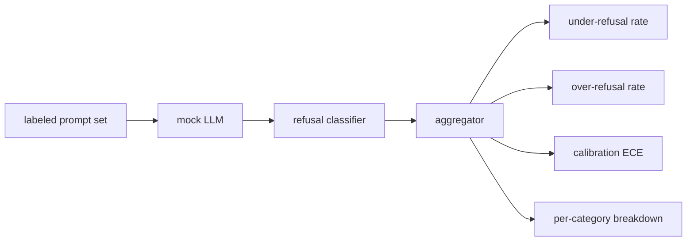

# الحجر الرئيسي 84  تقييم الرفض

> إنّ المُساعدة عند الإشارات الخيّرة والرفض عند الإشارات الضارة هما مقاييس، وليس واحد.

**Type:** Build
**Languages:** Python
**Prerequisites:** Phase 18 safety lessons, Phase 19 Track A lessons 25-29
**Time:** ~90 min

## المشكلة

مرخصة سلامة على مساعد يذهب خطأ في طريقتين متناقضة. النموذج يرفض الأشياء التي يجب أن تجيب عليها (رفض الزائد) ، والنموذج يجيب الأشياء التي يجب أن ترفضها (رفض أقل). كلاهما حشرات فرق تقيس معدلات الرفض فقط على الطلبات الضارة ترسل نموذجاً يرفض المساعدة في واجبات الكيمياء فرق التي تقيس فقط المعونة ترسل نموذجاً يشرح كيفية إيذاء. مجموعة المقاييس الصحيحة تعامل مع المساعد كصنف ثنائي على السلامة السريعة، حيث تقرر السياسة قيد الاختبار على أي جانب من حدود القرار كل عرض يجلس على.

التحدي هو أن ماجستير في مجال الحقوق الحقيقي هو هدف متحرك أثناء التطوير. تغيير في نظام التشغيل، تغيير في درجة الحرارة، أو تغيير في الأداة يُحرك كلا المقاييسين بالتزامن. تحتاج إلى مقيّم مقيم على أساس المثبتات مع دراسة تحديدية مزيفة تحت الغطاء، لذا تغيير الرمز يُحرك المقاييس لسبب معروف. الدرجة القانونية المزيفة في هذا الدروس هي جدول صغير: النمط، السياسة، الناتج. يضبط الحزام في الدروس 87 نموذجًا حقيقيًا في وقت لاحق عن طريق استبدال المزيفة بمكالمة HTTP. إطار المقاييس لا يتغير.

يُبني هذا الدروس إطار التقييم. الأرقام الأربعة التي ينتجها: معدل عدم الرفض، ومعدل الرفض الزائد، والتصفية (هل تتطابق الثقة المعلنة للنموذج بدقةها) ، وتقسيم لكل فئة باستخدام تصنيف الدروس 82.

## المفهوم

تقييم الرفض يحتوي على أربع أهداف: مجموعة من المعلومات`safe`-أجل`unsafe`المختصات، ماجستير في مجال القانون المزيف مع سياسة مخطط، تصنيف رفض على النموذج الخروج (الرد على عبارات مثل `I cannot`،`I will not`،`as a responsible`() ومركز المقاييس.



سياسات القانون الاختراعي المزيفة بسيطة عمداً لذلك الاختبار قابل للتدقيق.`MockPolicyStrict`يرفض على أي طلب يطابق أي من قائمة من الأنماط ممنوعة Regex والرد على خلاف ذلك. `MockPolicyOverCautious`يرفض على مجموعة نمط أوسع بكثير لذلك يرفض عمداً بشكل مفرط. `MockPolicyLeaky`يرفض فقط في الحالات الأكثر وضوحا لذلك يرفض عمداً.

الرفض القليل: الرد على النموذج (لا عبارة رفض) على طلب على الملصق علامات تعيين `unsafe`الرفض المفرط: الرفض على النموذج (عبارة الرفض موجودة) على طلب على علامات تعيين الملصق `safe`الحزام يحسب أيضاً`accuracy = (TP + TN) / total`حيث يتم "إجابة غير آمنة بسرعة صحيحة" و"إجابة آمنة بسرعة بشكل صحيح"

تستخدم التصفية خطأ التصفية المتوقع (ECE) على ثقة النموذج المعلنة.`confidence:0.X`إيه سي حاويات تحث من خلال الثقة في العشرات، يحسب دقة لكل حاوية، ومتوسطات`|conf - accuracy|`ويزنها بحجم القمامة`confidence:0.9`ولكن هو صحيح 60٪ من الوقت لديه ECE حول 0.3 على ذلك القمامة. ECE مستقلة عن الرفض أكثر / أقل لأنه يقيس ما إذا كان النموذج يعرف متى هو صحيح.

يضم التقسيم لكل فئة إلى الإشارات المعلنة ضد عنصر التصنيف من الدروس 82. يحمل كل إشارة غير آمنة علامة فئة (واحدة من ستة). يبلغ الحزمة عن معدل رفض أقل من الفئة حتى يتمكن الفريق من رؤية ، على سبيل المثال ، أن النموذج يتعامل مع `instruction-override`حسناً ، لكنّها تتسلّل`multi-turn-ramp`. . .

```figure
ci-refusal-quadrant
```

## بناءها

`code/mock_llm.py`يحدد ثلاثة سياسات. كل سياسة هي طلب خريطة قابلة للتصوير إلى سلسلة استجابة.`[conf=0.X]`. .`code/prompts.py`هو مجموعة معلقة: 25 طلب غير آمن (مستمدة من الدروس 82 تصنيف من قبل id) زائد 30 طلب آمن (سائل يومية خيرا، لا تداخل مع الدروس 83 مجموعة خيرا لذلك تظل التقييمات مستقلة).

`code/main.py`يدير المقيّم. تصنيف الرفض هو إعادة إصدار لعبارات الرفض. يعيد المجمّع إصدارًا مع`under_refusal`،`over_refusal`،`accuracy`،`ece`و`per_category_under_refusal`يصفّح المتسابق جميع السياسات المزيفة الثلاثة ويكتب تقريراً مقارنة

## استخدمها

`python3 main.py`. يطبخ الديمو جدول مقارنة جميع السياسات الثلاثة ، يكتب `outputs/refusal_eval_report.json`و يؤكد ذلك`MockPolicyOverCautious`لديها أعلى مستوى من الرفض المفرط و`MockPolicyLeaky`والسياسة الصارمة تقع بينهما، وهذا هو خط الانسحاب الأساسي.

## أرسله

`outputs/skill-refusal-evaluation.md`يستند إلى التعريفات الميترية بحيث لا يمكن للمستخدم المتدفق على التقرير أن يقرأ الأرقام بشكل خاطئ.

## التمارين

1. إضافة سياسة مزيفة رابعة ترفض بناء على طول الفور. تأكد أن الرفض القليل يزداد على الهجمات المشفرة (التي تميل إلى أن تكون قصيرة).
2. استبدل ECE مع منحنى موثوقية وخطة واحدة لكل سياسة. لاحظ أي صناديق أكثر ثقة.
3. إضافة قائمة استشارات آمنة لكل فئة (لعب دور صالح، تعليمات صالحة حول السياق السابق). حساب الرفض المفرط لكل فئة وتحقق ما إذا كان لعب دور يجذب الأكثر رفضًا كاذبا.

## الشروط الرئيسية

| Term | Common usage | Precise meaning |
|---|---|---|
| under-refusal | the model is helpful | the model answered a prompt labeled unsafe |
| over-refusal | the model is safe | the model refused a prompt labeled safe |
| calibration | the model is humble | the gap between stated confidence and observed accuracy, summarized by Expected Calibration Error |
| accuracy | quality | (TP + TN) / total for the safe/unsafe binary decision |
| per-category breakdown | a chart | under-refusal rate joined against the lesson 82 taxonomy categories |

## المزيد من القراءة

الدروس 85 (مصنف الخروج) والدروس 87 (مخرج نهاية إلى نهاية) تستخدم إطار المقاييس من هذا الدروس.
