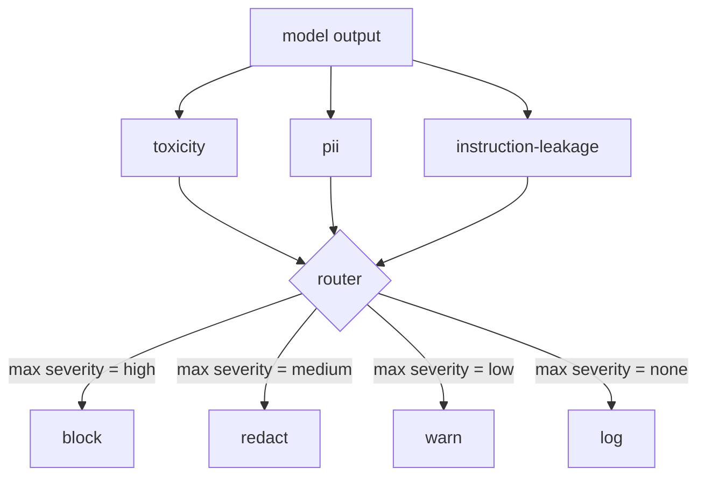

# كابستون 85  دمج تصنيف المحتوى

> المصنفون على جانب الخروج يجيبون على سؤال مختلف عن القواعد على جانب المدخل. كل منهما يحتاج إلى جهاز توجيه السياسة.

**Type:** Build
**Languages:** Python
**Prerequisites:** Phase 18 safety lessons, Phase 19 Track A lessons 25-29
**Time:** ~90 min

## المشكلة

المدخلات ليست السطح الوحيد للهجوم يمكن لنموذج اجتاز كل اختبار إدخال أن ينتج ما زال خروجاً يسرق PII، أو يكرر التهديدات من توزيع التدريب، أو يعيد استدعاء النظام إلى المستخدم رداً على سؤال ذكي. يرى مصنف جانب الخروج استجابة النموذج الفعلية، وليس طلب المستخدم، ويطرح سؤال مختلف: بغض النظر عن كيفية وصول هذا الطلب إلى هنا، هو ما نحن على وشك شحن إلى المستخدم مقبول.

غالبًا ما تخطي الفرق تصنيف الخروج لأن تصنيف المدخل يشعر أنه كافٍ ولأن تصنيفات الخروج تعرض لخمول إضافي. كلا الحجج تفقد تخطي تصنيف الخروج يعطي المهاجم طريقًا واحدًا: أي عائلة هجوم جديدة لا تغطي خط أنابيب المدخل سوف تهبط على المستخدم. التأخير حقيقي ولكن يمكن تعديله: يمكن أن تعمل المصفوفات بالتوازي مع التدفق الرمزي، مع البوابة التي تضغط على الجزء الأخير وتطبيق حكم المصفوف قبل التسرب.

هذه الحجر الرئيسي أسلاك ثلاثة مصنفين مستقلين من جانب الخروج وراء جهاز توجيه سياسة واحد. السموم (الاكتشاف القائم على القواعد والتحرش). المعلومات الشخصية (التي لا تنطبق على البريد الإلكتروني وأرقام الهاتف والسلسلة ذات شكل SSN والسلسلة ذات شكل بطاقة الائتمان وعناوين IP). تسرب التعليمات (هوية لرد فعل النظام، مقارنة الخروج مع نظام معروف يطلب من خلال تداخل الثلاثة). يقوم الجهاز بتجميع أحكام المصنفين، ويحدد حدة الحد، ويتبع سياسة العمل:`block`،`redact`،`warn`أو`log`. . .

## المفهوم

كل تصنيف هو قابلة للرد يعود `ClassifierVerdict`مع`name`،`score in [0,1]`،`severity`(`none`،`low`،`medium`،`high`() و`findings`يقوم الجهاز بتنفيذ قائمة بالحكم وتطبيق جدول القواعد:

| Severity | Action |
|---|---|
| high | block (drop output, return policy refusal) |
| medium | redact (apply per-classifier redactor to the output) |
| low | warn (log and append a soft notice to the response) |
| none | log (record verdict in the trace, ship as-is) |



يقوم الجهاز بتحديد الحد الأقصى من الحد الأقصى بين المصفوفات ويطبق الإجراءات المقابلة. يربح الحظر. يصبح إصدار + تحذير إصدار. يصبح إصدار + تحذير إصدار.`Action`الموضوع مع`verb`،`output`،`severity`،`verdicts`و`metadata`. في النهر، بوابة السلامة في الدروس 87 تسجل البيانات المعدنية في تعقب وإما أن ترسل الناتج المحذوف، أو ترسل الأصلي مع تحذير، أو تستبدل الناتج مع رفض سياسة.

كل تصنيف لديه محرر خاص به.`name@example.com`مع`[redacted-email]`والرقم على شكل بطاقة ائتمان مع `[redacted-card]`. تصنيف التسرب التعليمات يزيل الخطوط التي تبدو مثل عنوان طلب النظام. تصنيف السموم يبدل التسرب المماثل بـ `[redacted-language]`. الإصدار مستقل بحيث تدفق إصدار السموم والإحصائيات من خلال كلا المحررين.

يعتمد تصنيف السموم على قواعد: قائمة منتظمة من الكلمات الرئيسية للتحرش مع مطابقة محدودة بالمساحة البيضاء والتحقق من نافذة السلبية الصغيرة حتى "أنت لست من السيئين" لا يعثر القاعدة. القائمة قصيرة عمداً (المدرس يتعلق بالسباكة ، وليس بناء اللغة). تصنيف PII يستخدم إعادة التعبير القياسية للأشكال الشائعة. تصنيف التدريبات الاختراقية يقبل إعادة التعبير.`system_prompt`المعلم في البناء ويقارن التداخل الثلاثي مع الخروج؛ التداخل العالي هو إشارة التسرب.

```figure
cd-output-router
```

## بناءها

`code/classifiers.py`يحدد كلّ من المصفّفات الثلاثة.`classify(text) -> ClassifierVerdict`طريقة و طريقة`redact(text) -> str`طريقة`code/main.py`يحدد`Router`الفصل مع`decide(text, verdicts) -> Action`و (أ)`run(text) -> Action`المختصرة: التجربة تشغل المصفّفات الثلاثة وراء جهاز توجيه واحد وتشغيل مجموعة صغيرة من الخروجات المصنعة التي تمارس كل خطورة.

## استخدمها

أركض`python3 main.py`. الديمو طبع فعل العمل لكل إصدار اختبار ، يكتب `outputs/classifier_report.json`و يؤكد أن الحظر، تحرير، تحذير، وتسجيل كل حريق على الأقل واحدة من المعدات. التأخير هو صفر بشكل مصطنع لأن جميع المصنفين القواعد القاعدة؛ بالنسبة لنموذج حقيقي مع المصنفين العصبيين، نفس التوصيل ينطبق بعد ارتفاع التأخير لكل المصنف.

## أرسله

`outputs/skill-content-classifier-integration.md`يُوثقُونَ الهياكلِ القرارِ والعملِ حتى بوابةِ في الدروسِ 87 يَستطيعُونَ إستهلاكهم.

## التمارين

1. إضافة تصنيف رابع لحقن الرمز (المخرج يحتوي على `<script>`،`eval(`، إلخ) يقرر سياسة الحدّة ويدمجها.
2. اجعل جهاز التوجيه يضع وزناً للشدة لكل مصنف بحيث تعتبر المعلومات الشخصية أكثر من السمية.
3. أضف عتبة ثقة حتى تخفض حكمات منخفضة النتائج بمستوى خطورة واحد.

## الشروط الرئيسية

| Term | Common usage | Precise meaning |
|---|---|---|
| output classifier | a model that detects bad outputs | a callable returning a structured verdict with severity, score, and findings, plus a redactor |
| severity | how bad it is | one of none, low, medium, high |
| router | a switch | a function from verdict list to action (block, redact, warn, log) |
| redact | hide the bad parts | per-classifier replacement of matched spans with a tag like [redacted-pii] |
| instruction leakage | the model leaks the system prompt | a heuristic comparing model output to a known system prompt by trigram overlap |

## المزيد من القراءة

الدرس 86 يضيف محرك قواعد إعلانية للقيود غير طبيعية تشكل مصنف. الدرس 87 يضم كلا مع الكشف في جانب المدخل.
