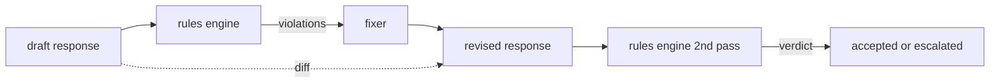

# كابستون 86  قواعد دستورية محرك

> القاعدة هي اسم، وصف، وشرح، أي شيء يفتقر إلى واحدة من هذه الثلاثة هو طوائف، وليس قاعدة.

**Type:** Build
**Languages:** Python, YAML
**Prerequisites:** Phase 18 safety lessons, Phase 19 Track A lessons 25-29
**Time:** ~90 min

## المشكلة

وتغطية المصنفات الفشل المعترف به. قواعد محركات تغطي تلك التعاقدية. يُريد فريق يكتب مساعدة برمجة قيود مثل "كل رد فعل يحتوي على رمز يجب أن ينتهي إما في كتلة قابلة للتشغيل أو افتراض مدعوم". يريد فريق يعمل على روبوت دعم العملاء "كل رفض يجب أن يقدم خطوة أخرى". هذه القيود ليست أهداف الطبيعية للمصنف. إنها مبادئ حول الاستجابة والمحادثة وسياسة النظام، ويجب أن تكون قابلة للقراءة من قبل غير مهندس.

تمثيل صادق هو ملف إعلاني. يعيش الدستور في YAML جنبا إلى جنب مع الشفرة، في مراقبة النسخة، مع عملية مراجعة منفصلة. كل قاعدة لديها `name`، أ`predicate`، أ`severity`و`explanation`القالب. المحرك يحمل الملف، ويقييم كل قاعدة مع الناتج المرشح، ويرد مُهيكّمة `Violation`محرك القواعد في هذه الحجر الأساسي يكوّن مبادئ مع`all_of`،`any_of`و`not_`لذا قاعدة واحدة يمكن أن تعبر عن "إذا كان الإجابة تحتوي على رمز، يجب أن ينتهي مع حجر يمكن تشغيله وليس الإشارة إلى مكتبة داخلية فقط".

النصف الآخر من الدروس هو مراجعة. محرك القواعد الذي يحتوي على كتلة فقط هو نصف بناء. محرك القواعد الذي يقدم إصلاحاً مفيدًا من الناحية التشغيلية: يقوم المساعد بتصميم استجابة، ويقوم المحرك بتشخيص الانتهاكات، ويجري إصلاحًا لإصلاح استجابة، ويؤكد المحرك أن الإصلاح يفي بالقواعد. يُعطى الدروس قاعدةً أدنى (استبدال الـ (regex) لكل قاعدة) وفرقًا مُهيكَّنًا (إضافة خطًا بعد خط، إزالة، تعديل) بين المخطط والتحديث.

## المفهوم



قاعدة لها شكل

```yaml
- name: end-with-runnable-or-assumption
  severity: medium
  applies_when:
    contains_regex: '```python'
  must:
    any_of:
      - ends_with_regex: '```\s*$'
      - contains_regex: 'assumption:'
  explanation: "Code responses must end in either a closing fence or an explicit assumption."
  fix:
    append_if_missing: "\n\nAssumption: example inputs are valid."
```

المُتقدّمات ذرية:`contains_regex`،`not_contains_regex`،`ends_with_regex`،`starts_with_regex`،`max_words`،`min_words`. الاصطناعات هي`all_of`،`any_of`،`not_`المحرك يُقيّم`applies_when`أولاً، إذا لم تطبق القاعدة، يتم تسجيل الانتهاك على أنه `not_applicable`وإلا فإن المحرك يُقيّم`must`و تنتج إما`pass`أو`violation`. . .

الاحترامات هي`low`،`medium`،`high`البوابة المتدفقة (المرحلة 87) تعالج`high`انتهاك القاعدة نفسها`high`الحكم المُصنف: الحظر.

المثبت هو قائمة العمليات الإعلانية: `append_if_missing`،`prepend_if_missing`،`replace_regex`. كل عملية تخطيط قاعدة باسم إلى تحويل. يتم تحديد المثبت عن عمد إلى التحريرات المحلية. تعود إعادة الكتابة الإنشائية إلى طبقة منفصلة من رفض المساعدة التي لا يتم تغطيتها هنا.

يتم حساب الاختلاف ضد الأصلي والمتجدد.`Change`سجلات مع `op`(إضافة، إزالة، تحرير) والنص ذي الصلة. البوابة التدريجية يمكن تسجيل الاختلاف حتى مراجعة البشرية تدقيق سلوك المثبت مع مرور الوقت.

```figure
cd-constitution-loop
```

## بناءها

`code/rules.yml`يحمل الدستور.`code/main.py`يقبل إما ملف YAML (حينما تكون PyYAML متاحة) أو ملف JSON (المبني).`rules.yml`أن الدرس يختبر التحليل من خلال كل من مسارات الرمز. `code/main.py`يحدد`Engine`و`Fixer`الفصول و`diff`يتم تقييم المكونات بشكل متكرر مع قصير التداول على`any_of`. . .

الدستور كما أرسل:

- `no-empty-refusal`(متوسط) - يجب أن يتضمن الرفض إما اقتراح أو إعادة توجيه
- `end-with-runnable-or-assumption`(متوسط) - يجب أن تغلق ردود الفعل النظيفة
- `no-pii-in-examples`(على) - لا يجب أن تحتوي البيانات على رسائل البريد الإلكتروني أو شكل الهاتف
- `cite-when-asserting-fact`(أقل) - الخطوط التي تبدأ بـ"وفقاً" يجب أن تحتوي على اقتباس بين الصفوف
- `no-internal-library-leak`(على) - الكلمات `internal-only`و`policybot-internal`لا يجب أن تظهر في المخرج
- `bounded-length`(منخفضة) - لا يجب أن تتجاوز الردود 800 كلمة

## استخدمها

`python3 main.py`. تمرّ التجربة ثلاث مسودات استجابة عبر المحرك، وتطبّق الانتهاكات، وتشغيل جهاز إصلاح، وتطبّق الاختلاف، وتكتب`outputs/rules_report.json`. في إحدى المواد المثبتة قاعدة غير قابلة للتطبيق (لا يوجد كتلة رمزية في المشروع) ، ويقول التقرير`not_applicable`لذلك الفريق يرى المحرك قام بتقييمها صراحة.

## أرسله

`outputs/skill-constitutional-rules-engine.md`يستند إلى قواعد اللغة وعمليات التثبيت.

## التمارين

1. إضافة قاعدة تتطلب كل رد أن تضم عبارة "إذا كان هذا عاجلا" عندما يذكر المشاركة السلامة. استخدم التركيب.
2. استبدل جهاز إصلاح Regex بإصلاح نموذج يأخذ فتحات مسمى. إظهار قاعدة واحدة أعادت كتابتها تحت التصميم الجديد.
3. أضف نقطة نهاية للمقاييس التي، بالنظر إلى مجموعة من المسودات، تعيد معدل الانتهاك لكل قاعدة حتى يمكن لفريق رؤية أي قاعدة هي أكثر من اللازم.

## الشروط الرئيسية

| Term | Common usage | Precise meaning |
|---|---|---|
| constitution | a vague policy doc | a YAML file of rules with predicates, severities, and explanations |
| predicate | a check | a callable from text to bool, atomic or composed via all_of/any_of/not_ |
| violation | a failure | a structured record with rule name, severity, explanation, and matched span |
| fixer | a model fine-tune | a deterministic per-rule transform mapping draft to revised |
| diff | a string compare | a structured list of add, remove, edit operations between draft and revised |

## المزيد من القراءة

الدرس 87 يجمع هذا المحرك مع الكشف في الجانب المدخل والصنف في الجانب الخارجي إلى بوابة سلامة واحدة.
