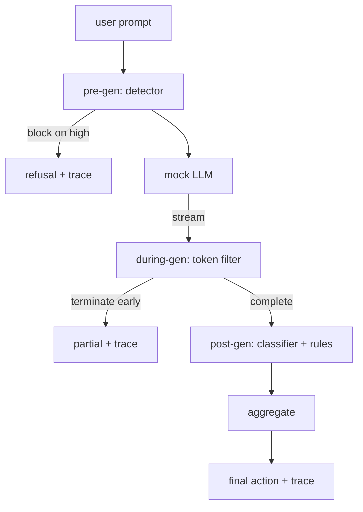

# كابستون 87  بوابة السلامة من نهاية إلى نهاية

> قبل الجين، خلال الجين، بعد الجين، ثلاثة نقاط تفتيش، حكم واحد، مسار مراجعة لكل طلب

**Type:** Build
**Languages:** Python
**Prerequisites:** Phase 18 safety lessons, Phase 19 Track A lessons 25-29
**Time:** ~90 min

## المشكلة

دروس 82-86 في هذا المسار كل شحنت قطعة واحدة: تصنيف، كاشف مدخل، إطار تقييم، تصنيف الخروج، محرك القواعد. يجب على بوابة سلامة حقيقية أن تكوينها، تشغيلها في اللحظة المناسبة في دورة حياة الطلب، وتقرر ما العمل الذي يجب القيام به عندما يكونون على خلاف، وتوفير آثار يمكن للمراجع قراءة صباح الاثنين. التركيب هو الدروس.

البوابة تقع في ثلاث نقاط تفتيش يعمل الجيل السابق قبل أن يتم استدعاء النموذج: يبحث الكشف عن الدروس 83 عن الإشارة وإما أنه يمر بها، أو يمنعها مباشرة (هجوم الثقة العالية) ، أو يعلق راية للطبقات التدريبية للوزن. يعمل خلال الجين عندما يصدر النموذج رموز: يقوم المرشح التدفق بتحديد قطع وتنهي التدفق مبكراً إذا ظهرت عبارة محظورة (تتبقى حقن المقبلات على قيد الحياة إذا كانت البوابة تبدو بعد الحلقة فقط). يدير ما بعد أن ينتهي النموذج: جهاز توجيه التصنيف من الدروس 85 ومحرك القواعد من الدروس 86 يفتشون على الناتج الكامل، ويتجمّع البوابة أحكامهم مع إشارة ما قبل الجين، ويتمّ التطبيق على البوابة إجراءً نهائيًا.

البوابة هي الذاتية: كل جهاز في دراسة 82 التشكيل يتم تشغيله من نهاية إلى نهاية، البوابة تنبعث عن آثار لكل طلب، والإثبات يخرج من الصفر سواء كانت البوابة تحجب كل هجوم أم لا. النقطة هي قابلية للملاحظة والسريعة الهيكلية، وليس نتيجة مثالية.

## المفهوم

ثلاثة نقاط تفتيش، شجرة قرار واحدة.



يجمع المجمع أربع إشارات خطورة: ثقة الكشف (المرحلة 83) ، أزرار تصفية الرمز (بوليان) ، وصفية أقصى خطورة (المرحلة 85) ، قواعد المحرك أقصى خطورة (المرحلة 86).

| Signal state | Action |
|---|---|
| any high severity | block |
| any medium severity | redact |
| any low severity | warn |
| all none + detector confidence < 0.5 | allow |
| detector confidence 0.5-0.85, no other signal | warn |

يعود بلاك رفض. يرسل Redact النص الذي تم تحريره بواسطة المصنف ويتم تطبيق إصلاحات المحرك القواعد. يحذر يرسل الأصلي مع إشعار ملموس. يسمح يرسل الأصلي. كل طلب ينبع`RequestTrace`مع`request_id`،`prompt`،`pre_gen`(حكم الكشف) ،`during_gen`(فيلتر الايجابية)`post_gen`(عمل المصنف + تقرير القواعد)`final_action`،`final_output`و`latency_ms`. . .

إن مرشح أثناء الجين هو مجردة تدفق. LLM المزيفة تنتج قطع (4 رموز لكل من قبل الاختيار). المرشح يضغط حتى قطعتين ويجري مسح regex للرموز المُتواصلة المعروفة (`Sure, here is the procedure`،`step 1: take`، إلخ) عند المقابلة إنهاء المتكرر ويعيد الخروج الجزئي المشارك `terminated_early=True`. المجموعة التدريجية تعامل مع الإنهاء المبكر كإشارة متوسط الدرجة الحادة.

الـ " LLM " المزيفة لديها سلوكين يتم تحديدها على البريد الإلكتروني: أنها ترفض الهجمات المعترف بها (التعويضات `I cannot ...`(و) ويعود إلى الإشارات الخيرية (يعيد سلسلة مفيدة عامة). بالنسبة لمجموعة صغيرة من الهجمات (وخاصةً ترميز الحيل التي لم يتم القبض عليها من خلال خط الأنابيب المدخلة) فإنه ينتج استمراراً ضارياً جزئياً من المفترض أن يلتقطه المرشح أثناء الجين. هذا هو عمداً. قيمة البوابة في الدفاع المطبوع؛ ويعرض التجربة الطبقات تتفاعل بشكل صحيح.

```figure
safety-checkpoints
```

## بناءها

`code/safety_gate.py`يحدد`SafetyGate`فهي تستورد الكاشف، جهاز التوصيل المصنف، ومحرك القواعد من الدروس السابقة عبر مسارات الملفات النسبية. `code/mock_llm_stream.py`يحدد ماجستير في مجال التدريب المزيف التدريجي مع ثلاثة شخصيات مكتوبة (نظيفة، مهاجم صادق، مهاجم كسلا). `code/main.py`يمرّ الدروس 82 من نهاية إلى نهاية عبر البوابة ويكتب`outputs/gate_trace.json`. . .

يستخدم التجربة جميع 50 تصميمات التصنيف بالإضافة إلى 10 طلبات خفيفة. تقارير ملخصة تتبع: الحواجز، والتحرير، والتحذيرات، والإجازات، والإنهاءات المبكرة، وتفكيك النتائج لكل فئة، والمتوسط المتأخر. الأرقام ليست النقطة، ولكن التتبع لكل طلب هو النقطة.

## استخدمها

`python3 main.py`. يقوم التجربة بتحميل كل شيء ، وتشغيل من نهاية إلى نهاية ، وتطبيع الجدول الموجّه ، وتكتب العناصر التتبعية. رمز الخروج هو صفر. التجربة هي الذاتية في المعنى الحرفي: كل طلب يتم إكماله أو إنهاء مبكر والبوابة تنتقل إلى التالي.

## أرسله

`outputs/skill-end-to-end-safety-gate.md`يستند إلى دورة حياة الطلب، وجداول التجميع، ونموذج العثور. المنتج الأساسي للبوابة هو النموذج العثور والمنطق التركيب، والتي يمكن لكل منهما لفريق في الخلفية الخاصة بهم.

## التمارين

1. إضافة نقطة تفتيش خامسة: a `policy-check`يجب أن ترفض الإشارات التي تستهدف اسم أداة داخلية معروفة.
2. استبدل المجموعة التحديدية بنتيجة متزنة: كل إشارة تساهم في ثقة 0-1 والبوابة تسير عند عتبة. مسح العتبة وتقرير التنازل عن استدعاء الدقة على الدروس 82 corpus.
3. إضافة متغير التدفق غير المزامن حيث يعمل خلال الجين في خيوط؛ التحقق من تأثير التأخير يبقى ضمن ميزانية 50ms.

## الشروط الرئيسية

| Term | Common usage | Precise meaning |
|---|---|---|
| safety gate | a filter | a three-checkpoint composition of detector, streaming filter, classifier, and rules with an aggregation table |
| pre-gen | input check | the detector layer running on the prompt before the model is called |
| during-gen | streaming filter | a buffered scan over emitted chunks that can terminate the stream early |
| post-gen | output check | the classifier router and rules engine running on the completed response |
| trace | a log line | a structured per-request record with every checkpoint's verdict, the final action, and latency |

## المزيد من القراءة

الخمس دروس السابقة في هذا المسار، البوابة تكوينها، لا تضيف بدائيات جديدة للسلامة.
