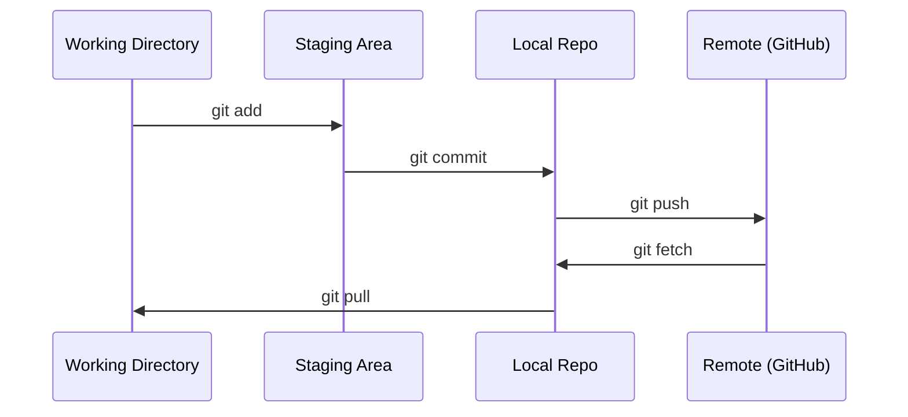

# Git y colaboración

> Cada experimento, modelo, lección se rastrea.

**Type:** Learn
**Languages:** --
**Prerequisites:** Phase 0, Lesson 01
**Time:** ~30 minutes

## Objetivos de aprendizaje

- Configurar la identidad de git y utilizar el flujo de trabajo diario de agregar, comprometer y empujar
- Crear y fusionar ramas para experimentos aislados sin romper el principal
- Escriba un`.gitignore`que excluye los puntos de control de modelo y los archivos binarios grandes
- Navegar por el historial de compromisos con `git log`para comprender la evolución del proyecto

## El problema

Estás a punto de escribir cientos de archivos de código en 20 fases sin control de versión perderás trabajo, romperás cosas que no puedes deshacer y no tendrás manera de colaborar con otros.

Git es la herramienta. GitHub es donde vive el código. Esta lección cubre lo que necesitas para este curso y nada más.

## El concepto



Tres cosas que recordar:
1. Salvar con frecuencia (`git commit`(en inglés)
2. Empujar a la distancia (`git push`(en inglés)
3. Ramo de los experimentos (`git checkout -b experiment`(en inglés)

```figure
s0-commit-dag
```

## Construye el mismo

### Paso 1: Configurar git

```bash
git config --global user.name "Your Name"
git config --global user.email "you@example.com"
```

### Paso 2: Flujo de trabajo diario

```bash
git status
git add file.py
git commit -m "Add perceptron implementation"
git push origin main
```

### Paso 3: La ramificación para los experimentos

```bash
git checkout -b experiment/new-optimizer

# ... make changes, commit ...

git checkout main
git merge experiment/new-optimizer
```

### Paso 4: Trabajar con este curso de reposición

No se puede presionar al propio repo del curso  sólo los mantenedores tienen acceso a escribir.`origin`puntos en su propia copia:

```bash
git clone https://github.com/YOUR-USERNAME/ai-engineering-from-scratch.git
cd ai-engineering-from-scratch

git checkout -b my-progress
# work through lessons, commit your code
git push origin my-progress
```

## Usalo

Para este curso, necesitas exactamente estos comandos:

| Command | When |
|---------|------|
| `git clone` | Get the course repo |
| `git add` + `git commit` | Save your work |
| `git push` | Back it up to GitHub |
| `git checkout -b` | Try something without breaking main |
| `git log --oneline` | See what you've done |

No necesitas rebases, selección de cerezas o submodules para este curso.

## Los ejercicios

1. Forque este repo, clone su tenedor, crea una rama llamada `my-progress`, hacer un archivo, comprometerlo, empujarlo
2. Crear un `.gitignore`que excluye los archivos de los puntos de control modelo (`.pt`¿ Qué ?`.pth`¿ Qué ?`.safetensors`(en inglés)
3. Mira el historial de los compromisos de este repo con `git log --oneline`y leer cómo se agregaron las lecciones

## Términos clave

| Term | What people say | What it actually means |
|------|----------------|----------------------|
| Commit | "Saving" | A snapshot of your entire project at a point in time |
| Branch | "A copy" | A pointer to a commit that moves forward as you work |
| Merge | "Combining code" | Taking changes from one branch and applying them to another |
| Remote | "The cloud" | A copy of your repo hosted somewhere else (GitHub, GitLab) |
