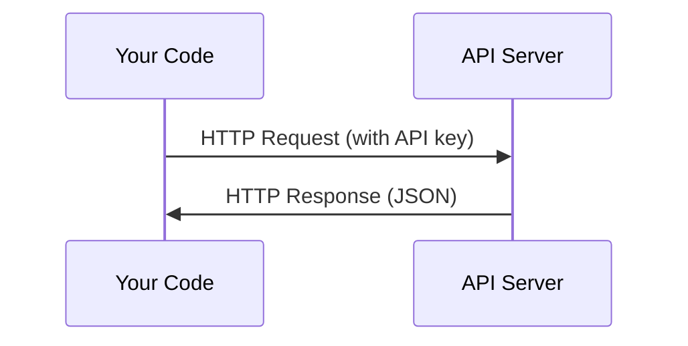

# Las API y las claves

> Cada API de IA funciona de la misma manera: enviar una solicitud, obtener una respuesta. Los detalles cambian, el patrón no.

**Type:** Build
**Languages:** Python, TypeScript
**Prerequisites:** Phase 0, Lesson 01
**Time:** ~30 minutes

## Objetivos de aprendizaje

- Almacenar las claves de API de forma segura utilizando variables del entorno y `.env`archivos
- Hacer una llamada de API LLM utilizando tanto el SDK de Python Antropic como el HTTP crudo
- Comparar los formatos de solicitud/respuesta HTTP basados en SDK y en bruto para el depuración
- Identificar y manejar errores comunes de API, incluidos los límites de autenticación y tasa

## El problema

A partir de la Fase 11, llamará a las API de LLM (Antropic, OpenAI, Google). En la Fase 13-16 construirá agentes que utilizan estas API en bucles. Necesita saber cómo funcionan las claves de API, cómo almacenarlas de forma segura y cómo hacer su primera llamada de API.

## El concepto



Cada llamada de API tiene:
1. Un punto final (URL)
2. Una clave de API (autenticación)
3. Un organismo de solicitud (lo que quieras)
4. Un cuerpo de respuesta (lo que obtienes de vuelta)

```figure
s0-secret-inject
```

## Construye el mismo

### Paso 1: Almacenar las claves de API de forma segura

Nunca ponga claves API en el código.

```bash
export ANTHROPIC_API_KEY="sk-ant-..."
export OPENAI_API_KEY="sk-..."
```

O usar un`.env`archivo (agrega a `.gitignore`):

```
ANTHROPIC_API_KEY=sk-ant-...
OPENAI_API_KEY=sk-...
```

### Paso 2: Primera llamada de API (Python)

```python
import os

import anthropic

client = anthropic.Anthropic()

MODEL = os.environ.get("LLM_MODEL", "claude-sonnet-5")

response = client.messages.create(
    model=MODEL,
    max_tokens=256,
    messages=[{"role": "user", "content": "What is a neural network in one sentence?"}]
)

print(response.content[0].text)
```

`LLM_MODEL`Selecciona el id del modelo Anthropic, y el alias predeterminado es el alias Sonnet no datado. Otros proveedores (OpenAI, Google y otros) siguen el mismo patrón de una clave más un id del modelo, pero cada uno tiene su propio SDK, punto final y esquema de solicitud / respuesta.

### Paso 3: Primera llamada de API (TypeScript)

```typescript
import Anthropic from "@anthropic-ai/sdk";

const client = new Anthropic();

const MODEL = process.env.LLM_MODEL ?? "claude-sonnet-5";

const response = await client.messages.create({
  model: MODEL,
  max_tokens: 256,
  messages: [{ role: "user", content: "What is a neural network in one sentence?" }],
});

console.log(response.content[0].text);
```

### Paso 4: HTTP crudo (sin SDK)

```python
import os
import urllib.request
import json

url = "https://api.anthropic.com/v1/messages"
headers = {
    "Content-Type": "application/json",
    "x-api-key": os.environ["ANTHROPIC_API_KEY"],
    "anthropic-version": "2023-06-01",
}
body = json.dumps({
    "model": os.environ.get("LLM_MODEL", "claude-sonnet-5"),
    "max_tokens": 256,
    "messages": [{"role": "user", "content": "What is a neural network in one sentence?"}],
}).encode()

req = urllib.request.Request(url, data=body, headers=headers, method="POST")
with urllib.request.urlopen(req) as resp:
    result = json.loads(resp.read())
    print(result["content"][0]["text"])
```

Esto es lo que hacen los SDKs bajo el capó. Entender la llamada HTTP crudo ayuda al desactivar.

## Usalo

Para este curso:

| API | When you need it | Free tier |
|-----|-----------------|-----------|
| Anthropic (Claude) | Phases 11-16 (agents, tools) | $5 credit on signup |
| OpenAI | Phase 11 (comparison) | $5 credit on signup |
| Hugging Face | Phases 4-10 (models, datasets) | Free |

No las necesitas todas ahora, hazlas cuando la lección lo requiera.

## Envío

Esta lección produce:
- `outputs/prompt-api-troubleshooter.md`- diagnóstico de errores comunes de API

## Los ejercicios

1. Obtenga una clave de API de Anthropic y haga su primera llamada de API
2. Prueba la versión HTTP en bruto y compara el formato de respuesta con la versión del SDK
3. Usar intencionalmente una clave de API incorrecta y leer el mensaje de error

## Términos clave

| Term | What people say | What it actually means |
|------|----------------|----------------------|
| API key | "Password for the API" | A unique string that identifies your account and authorizes requests |
| Rate limit | "They're throttling me" | Maximum requests per minute/hour to prevent abuse and ensure fair usage |
| Token | "A word" (in API context) | A billing unit: input and output tokens are counted and charged separately |
| Streaming | "Real-time responses" | Getting the response word by word instead of waiting for the full response |
