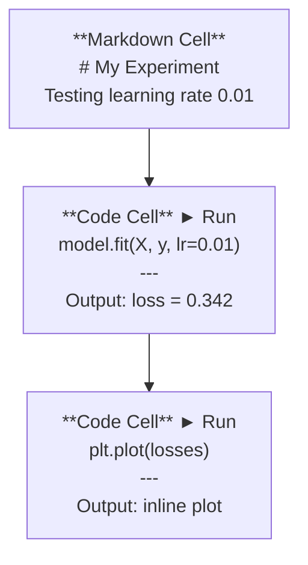
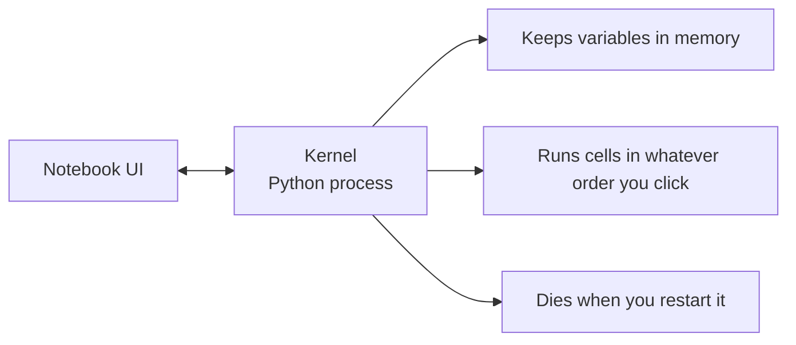

# Cuadernos de Jupyter

> Las computadoras son el banco de laboratorio de la ingeniería de IA.

**Type:** Build
**Languages:** Python
**Prerequisites:** Phase 0, Lesson 01
**Time:** ~30 minutes

## Objetivos de aprendizaje

- Instalar y lanzar JupyterLab, Jupyter Notebook o VS Code con la extensión Jupyter
- Utilice comandos mágicos (`%timeit`¿ Qué ?`%%time`¿ Qué ?`%matplotlib inline`) para comparar y visualizar en línea
- Distinguir cuándo utilizar cuadernos de notas vs scripts y aplicar el flujo de trabajo "explorar en cuadernos de notas, enviar en scripts"
- Identificar y evitar las trampas comunes de los portátiles: ejecución fuera de orden, estado oculto y fugas de memoria

## El problema

Cada artículo de IA, tutorial y competencia Kaggle utiliza cuadernos Jupyter. Te permiten ejecutar código en pedazos, ver las salidas en línea, mezclar código con explicaciones e iterar rápidamente. Si intentas aprender IA sin cuadernos, estás haciendo tareas matemáticas sin rascar papel.

Pero los cuadernos tienen trampas reales. La gente los usa para todo, incluso para cosas en las que son terribles. Saber cuándo usar un cuadrilátero y cuándo usar un guión te salvará de deshacerte de pesadillas más tarde.

## El concepto

Un cuaderno es una lista de células. Cada célula es código o texto.



El kernel es un proceso de Python que se ejecuta en segundo plano. Cuando ejecuta una célula, envía el código al kernel, que lo ejecuta y devuelve el resultado. Todas las células comparten el mismo kernel, por lo que las variables persisten entre las células.



Esa parte de "qué orden que hagas" es tanto la superpotencia como la pistola.

```figure
s0-cell-order
```

## Construye el mismo

### Paso 1: Seleccione su interfaz

Tres opciones, un formato:

| Interface | Install | Best for |
|-----------|---------|----------|
| JupyterLab | `pip install jupyterlab` then `jupyter lab` | Full IDE experience, multiple tabs, file browser, terminal |
| Jupyter Notebook | `pip install notebook` then `jupyter notebook` | Simple, lightweight, one notebook at a time |
| VS Code | Install "Jupyter" extension | Already in your editor, git integration, debugging |

Los tres leen y escriben lo mismo .`.ipynb`JupyterLab es el más común en el trabajo de IA.

```bash
pip install jupyterlab
jupyter lab
```

### Paso 2: Cortes de teclado que importan

Operas en dos modos.`Escape`para el modo de comando (barra azul a la izquierda), `Enter`para el modo de edición (barra verde).

**Command mode (most used):**

| Key | Action |
|-----|--------|
| `Shift+Enter` | Run cell, move to next |
| `A` | Insert cell above |
| `B` | Insert cell below |
| `DD` | Delete cell |
| `M` | Convert to markdown |
| `Y` | Convert to code |
| `Z` | Undo cell operation |
| `Ctrl+Shift+H` | Show all shortcuts |

**Edit mode:**

| Key | Action |
|-----|--------|
| `Tab` | Autocomplete |
| `Shift+Tab` | Show function signature |
| `Ctrl+/` | Toggle comment |

`Shift+Enter`Es el que usarás mil veces al día.

### Paso 3: Tipos de células

**Code cells**ejecuta Python y muestra la salida:

```python
import numpy as np
data = np.random.randn(1000)
data.mean(), data.std()
```

Producción: `(0.0032, 0.9987)`

**Markdown cells**Los textos en formato de texto se pueden utilizar para documentar lo que estás haciendo y por qué.`$E = mc^2$`), tablas e imágenes.

### Paso 4: comandos mágicos

Estos no son Python, son comandos específicos de Jupyter que comienzan con`%`(magia de línea) o `%%`(magia celular).

**Time your code:**

```python
%timeit np.random.randn(10000)
```

Producción: `45.2 us +/- 1.3 us per loop`

```python
%%time
model.fit(X_train, y_train, epochs=10)
```

Producción: `Wall time: 2.34 s`

`%timeit`ejecuta el código muchas veces y promedios. `%%time`Lo ejecuta una vez.`%timeit`para las microbensores, `%%time`para las carreras de entrenamiento.

**Enable inline plots:**

```python
%matplotlib inline
```

Cada uno .`plt.plot()`o `plt.show()`Ahora se hace directamente en el cuaderno.

**Install packages without leaving the notebook:**

```python
!pip install scikit-learn
```

El `!`prefijo ejecuta cualquier comando de shell.

**Check environment variables:**

```python
%env CUDA_VISIBLE_DEVICES
```

### Paso 5: Muestre la salida rica en línea

Los portátiles muestran automáticamente la última expresión en una célula.

```python
import pandas as pd

df = pd.DataFrame({
    "model": ["Linear", "Random Forest", "Neural Net"],
    "accuracy": [0.72, 0.89, 0.94],
    "training_time": [0.1, 2.3, 45.6]
})
df
```

Esto representa una tabla HTML formateada, no un vertedero de texto.

```python
import matplotlib.pyplot as plt

plt.figure(figsize=(8, 4))
plt.plot([1, 2, 3, 4], [1, 4, 2, 3])
plt.title("Inline Plot")
plt.show()
```

La gráfica aparece justo debajo de la célula. Es por eso que los portátiles dominan el trabajo de IA. Veas los datos, la gráfica y el código juntos.

Para las imágenes:

```python
from IPython.display import Image, display
display(Image(filename="architecture.png"))
```

### Paso 6: Colab de Google

Colab es un portátil Jupyter gratuito en la nube. Te da una GPU, bibliotecas preinstaladas e integración con Google Drive. No se requiere configuración.

1. ¡ Vamos 
2. Cargar cualquier `.ipynb`archivo de este curso
3. Tiempo de ejecución > Cambiar el tipo de tiempo de ejecución > GPU T4 (gratuito)

Diferencias entre Colab y Jupyter local:
- Los archivos no persisten entre sesiones (salvo en Drive o descarga)
- Preinstalado: numpy, pandas, matplotlib, antorcha, tensorflow, sklearn
- `from google.colab import files`para subir/descargar archivos
- `from google.colab import drive; drive.mount('/content/drive')`para almacenamiento persistente
- Tiempo de descanso después de 90 minutos de inactividad (nive libre)

## Usalo

### Cuadernos versus guiones: cuándo usar cuál

| Use notebooks for | Use scripts for |
|-------------------|-----------------|
| Exploring a dataset | Training pipelines |
| Prototyping a model | Reusable utilities |
| Visualizing results | Anything with `if __name__` |
| Explaining your work | Code that runs on a schedule |
| Quick experiments | Production code |
| Course exercises | Packages and libraries |

La regla:**explore in notebooks, ship in scripts**¿ Qué ?

Un flujo de trabajo común en IA:
1. Explorar los datos en un cuaderno
2. Protótipo de su modelo en el cuaderno
3. Una vez que funcione, mueva el código a `.py`archivos
4. Importar esos .`.py`archivos de vuelta en el cuaderno para más experimentos

### Trampas comunes

**Out-of-order execution.**Se ejecuta la celda 5, luego la celda 2, luego la celda 7. El portátil funciona en su máquina pero se rompe cuando alguien lo ejecuta de arriba a abajo.

**Hidden state.**Se elimina una célula pero la variable que creó todavía está en la memoria. El cuaderno se ve limpio pero depende de una célula fantasma. Corrección: reiniciar el núcleo regularmente.

**Memory leaks.**Cargar un conjunto de datos de 4 GB, entrenar un modelo, cargar otro conjunto de datos. Nada se libera.`del variable_name`y `gc.collect()`, o reiniciar el núcleo.

## Envío

Esta lección produce:
- `outputs/prompt-notebook-helper.md`para desactivar los problemas de los cuadernos

## Los ejercicios

1. Abra JupyterLab, cree un cuaderno y use `%timeit`para comparar la comprensión de la lista vs numpy para crear una matriz de 100.000 números aleatorios
2. Crea un cuaderno con marcado y células de código que cargue un CSV, muestre un marco de datos y trace un gráfico. Luego ejecuta Kernel > Reiniciar y ejecutar todo para verificar que funciona de arriba a abajo
3. Tome el código de `code/notebook_tips.py`, pegarlo en una libreta Colab, y ejecutarlo con una GPU gratuita

## Términos clave

| Term | What people say | What it actually means |
|------|----------------|----------------------|
| Kernel | "The thing running my code" | A separate Python process that executes cells and keeps variables in memory |
| Cell | "A code block" | An independently runnable unit in a notebook, either code or markdown |
| Magic command | "Jupyter tricks" | Special commands prefixed with `%` or `%%` that control the notebook environment |
| `.ipynb` | "Notebook file" | A JSON file containing cells, outputs, and metadata. Stands for IPython Notebook |

## Leer más

- [JupyterLab Docs](https://jupyterlab.readthedocs.io/)para el conjunto completo de características
- [Google Colab FAQ](https://research.google.com/colaboratory/faq.html)para los límites y características específicos de Colab
- [28 Jupyter Notebook Tips](https://www.dataquest.io/blog/jupyter-notebook-tips-tricks-shortcuts/)para los atajos de usuario de energía
