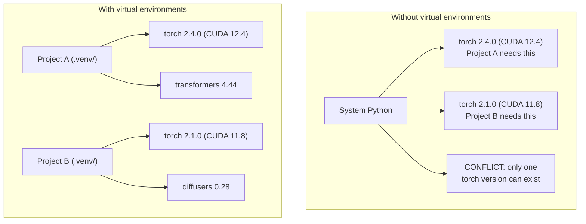

# Entornos de Python

> El infierno de la dependencia es real.

**Type:** Build
**Languages:** Shell
**Prerequisites:** Phase 0, Lesson 01
**Time:** ~30 minutes

## Objetivos de aprendizaje

- Crear entornos virtuales aislados utilizando `uv`¿ Qué ?`venv`, o`conda`
- Escriba un`pyproject.toml`con grupos de dependencias opcionales y generar ficheros de bloqueo para la reproducibilidad
- Diagnóstico y solución de fallos comunes: instalaciones globales, mezcla de pip/conda, incompatibilidades de la versión CUDA
- Implementar una estrategia de entorno por fase para proyectos con dependencias contradictorias

## El problema

Instalas PyTorch 2.4 para un proyecto de ajuste fino. La semana que viene, un proyecto diferente necesita PyTorch 2.1 porque su construcción CUDA está fijada. Actualiza globalmente, y el primer proyecto se rompe. Bajas la calificación, y el segundo se rompe.

Esto es el infierno de la dependencia.

- PyTorch, JAX y TensorFlow envían sus propios enlaces CUDA
- Las bibliotecas de modelos pin versiones de marco específicas
- Un mundo `pip install`sobreescribe lo que haya existido antes
- CUDA 11.8 construcciones no funcionan con los controladores CUDA 12.x (y viceversa)

La solución: cada proyecto tiene su propio entorno aislado con sus propios paquetes.

## El concepto



```figure
s0-env-isolation
```

## Construye el mismo

### Opción 1: uv venv (recomendado)

`uv`Es el administrador de paquetes Python más rápido (10-100 veces más rápido que pip).

```bash
curl -LsSf https://astral.sh/uv/install.sh | sh

uv python install 3.12

cd your-project
uv venv
source .venv/bin/activate
```

Instalar paquetes:

```bash
uv pip install torch numpy
```

Crear un proyecto con `pyproject.toml`en un solo paso:

```bash
uv init my-ai-project
cd my-ai-project
uv add torch numpy matplotlib
```

### Opción 2: venv (construido)

Si no puedes instalarlo`uv`, las naves Python con `venv`¿Qué es esto ?

```bash
python3 -m venv .venv
source .venv/bin/activate  # Linux/macOS
.venv\Scripts\activate     # Windows

pip install torch numpy
```

Más lento que`uv`, pero funciona en todas partes Python está instalado.

### Opción 3: conda (cuando lo necesites)

Conda administra dependencias no Python como kits de herramientas CUDA, cuDNN y bibliotecas C. Utilice cuando:

- Necesitas una versión específica de CUDA sin instalarla en todo el sistema
- Estás en un grupo compartido donde no puedes instalar paquetes de sistema
- Las instrucciones de instalación de una biblioteca dicen "usar conda"

```bash
# Install miniconda (not the full Anaconda)
curl -LsSf https://repo.anaconda.com/miniconda/Miniconda3-latest-Linux-x86_64.sh -o miniconda.sh
bash miniconda.sh -b

conda create -n myproject python=3.12
conda activate myproject

conda install pytorch torchvision torchaudio pytorch-cuda=12.4 -c pytorch -c nvidia
```

Una regla: si utiliza conda para un entorno, use conda para todos los paquetes en ese entorno.`pip install`En un conda env causa conflictos de dependencia que son dolorosos de depurar.

### Para este curso: Estrategia por fase

No, las diferentes fases necesitan diferentes dependencias (a veces contradictorias).

Estrategia:

```
ai-engineering-from-scratch/
├── .venv/                    <-- shared lightweight env for phases 0-3
├── phases/
│   ├── 04-neural-networks/
│   │   └── .venv/            <-- PyTorch env
│   ├── 05-cnns/
│   │   └── .venv/            <-- same PyTorch env (symlink or shared)
│   ├── 08-transformers/
│   │   └── .venv/            <-- might need different transformer versions
│   └── 11-llm-apis/
│       └── .venv/            <-- API SDKs, no torch needed
```

El guión en `code/env_setup.sh`crea el entorno de base para este curso.

## pyproject.toml Basics

Cada proyecto Python debe tener un`pyproject.toml`- Se reemplaza .`setup.py`¿ Qué ?`setup.cfg`, y `requirements.txt`en un archivo.

```toml
[project]
name = "ai-engineering-from-scratch"
version = "0.1.0"
requires-python = ">=3.11"
dependencies = [
    "numpy>=1.26",
    "matplotlib>=3.8",
    "jupyter>=1.0",
    "scikit-learn>=1.4",
]

[project.optional-dependencies]
torch = ["torch>=2.3", "torchvision>=0.18"]
llm = ["anthropic>=0.39", "openai>=1.50"]
```

Luego instale:

```bash
uv pip install -e ".[torch]"    # base + PyTorch
uv pip install -e ".[llm]"     # base + LLM SDKs
uv pip install -e ".[torch,llm]" # everything
```

## Ficha de bloqueo

Un archivo de bloqueo pinsa todas las dependencias (incluidas las transitivas) a versiones exactas. Esto garantiza la reproducibilidad: cualquier persona que instala desde el archivo de bloqueo obtiene exactamente los mismos paquetes.

```bash
# uv generates uv.lock automatically when using uv add
uv add numpy

# pip-tools approach
uv pip compile pyproject.toml -o requirements.lock
uv pip install -r requirements.lock
```

Cuando alguien clona el repo, instala desde el archivo y obtiene versiones idénticas.

## Errores comunes

### 1. Instalación a nivel mundial

```bash
pip install torch  # BAD: installs to system Python

source .venv/bin/activate
pip install torch  # GOOD: installs to virtual environment
```

Compruebe dónde van sus paquetes:

```bash
which python       # should show .venv/bin/python, not /usr/bin/python
which pip           # should show .venv/bin/pip
```

### 2. Mezcla de pip y conda

```bash
conda create -n myenv python=3.12
conda activate myenv
conda install pytorch -c pytorch
pip install some-other-package   # BAD: can break conda's dependency tracking
conda install some-other-package # GOOD: let conda manage everything
```

Si debe utilizar pip dentro de conda (algunos paquetes son solo conda), instale primero todos los paquetes conda, luego los paquetes conda duran.

### 3. Olvidar activar

```bash
python train.py           # uses system Python, missing packages
source .venv/bin/activate
python train.py           # uses project Python, packages found
```

El prompt de la captura debe mostrar el nombre del entorno:

```
(.venv) $ python train.py
```

### 4. Compromiso .venv a git

```bash
echo ".venv/" >> .gitignore
```

Los entornos virtuales son de 200 MB a 2 GB. Son locales, no portátiles entre máquinas.`pyproject.toml`y el archivo de bloqueo en su lugar.

### 5. Desajuste de la versión CUDA

```bash
nvidia-smi                # shows driver CUDA version (e.g., 12.4)
python -c "import torch; print(torch.version.cuda)"  # shows PyTorch CUDA version

# These must be compatible.
# PyTorch CUDA version must be <= driver CUDA version.
```

## Usalo

Ejecutar el guión de configuración para crear su entorno de curso:

```bash
bash phases/00-setup-and-tooling/06-python-environments/code/env_setup.sh
```

Esto crea un`.venv`en la raíz de repo con dependencias centrales instaladas y verificadas.

## Los ejercicios

1. - ¿ Qué ?`env_setup.sh`y verificar el paso de todos los cheques
2. Crear un segundo entorno virtual, instalar una versión diferente de numpy en él, y confirmar que los dos entornos están aislados
3. Escriba un`pyproject.toml`para un proyecto que necesita tanto PyTorch como el SDK Anthropic
4. Instalar un paquete de forma deliberada a nivel mundial (sin activar un venv), notar hacia dónde va, y luego desinstalarlo

## Términos clave

| Term | What people say | What it actually means |
|------|----------------|----------------------|
| Virtual environment | "A venv" | An isolated directory containing a Python interpreter and packages, separate from the system Python |
| Lockfile | "Pinned dependencies" | A file listing every package and its exact version, guaranteeing identical installs across machines |
| pyproject.toml | "The new setup.py" | The standard Python project configuration file, replacing setup.py/setup.cfg/requirements.txt |
| Transitive dependency | "A dependency of a dependency" | Package B depends on C; if you install A which depends on B, C is a transitive dependency of A |
| CUDA mismatch | "My GPU isn't working" | PyTorch was compiled for a different CUDA version than what your GPU driver supports |
