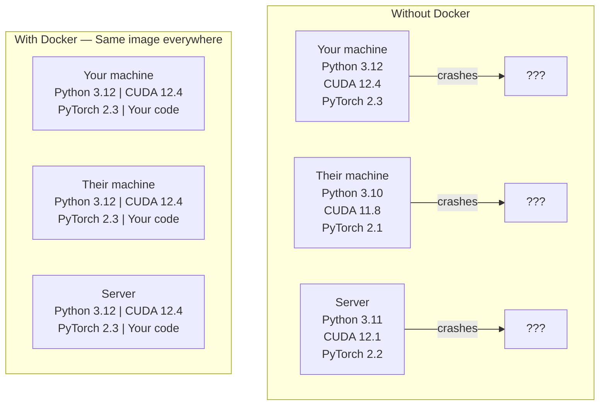

# Docker para IA

> Los contenedores hacen que "trabajar en mi máquina" sea algo del pasado.

**Type:** Build
**Languages:** Docker
**Prerequisites:** Phase 0, Lessons 01 and 03
**Time:** ~60 minutes

## Objetivos de aprendizaje

- Construir una imagen de Docker habilitada por GPU con bibliotecas de CUDA, PyTorch y IA desde un archivo de Docker
- Montar directorios de host como volúmenes para persistir en modelos, conjuntos de datos y código en las reconstrucciones de contenedores
- Configurar el kit de herramientas NVIDIA Container para exponer las GPUs dentro de los contenedores
- Orquesta aplicaciones de IA multi-servicio (servidor de inferencia + base de datos vectorial) utilizando Docker Compose

## El problema

Entrenó un modelo en su computadora portátil con PyTorch 2.3, CUDA 12.4 y Python 3.12. Su colega tiene PyTorch 2.1, CUDA 11.8 y Python 3.10.

Los proyectos de IA son pesadillas de dependencia. Una pila típica incluye Python, PyTorch, controladores CUDA, cuDNN, bibliotecas C a nivel de sistema y paquetes especializados como flash-attn que necesitan versiones de compilador exactas. Docker empaqueta todo esto en una sola imagen que se ejecuta de manera idéntica en todas partes.

## El concepto

Docker envuelve su código, tiempo de ejecución, bibliotecas y herramientas del sistema en una unidad aislada llamada un contenedor. Piense en ella como una máquina virtual ligera, excepto que comparte el kernel del sistema operativo host en lugar de ejecutar el propio, por lo que comienza en segundos en lugar de minutos.



### Por qué los proyectos de IA necesitan Docker más que la mayoría

1. **GPU drivers are fragile.**CUDA 12.4 código no se ejecuta en CUDA 11.8. Docker aisla el kit de herramientas CUDA dentro del contenedor mientras comparte el controlador de GPU host a través del NVIDIA Container Toolkit.

2. **Model weights are large.**Un modelo de parámetro 7B es de 14 GB en fp16. no se quiere volver a descargar cada vez que se reconstruye.

3. **Multi-service architectures are common.**Una aplicación de IA real no es solo un script de Python. Es un servidor de inferencias, una base de datos vectorial para RAG, tal vez un frontend web. Docker Compose orquesta todo esto con un solo comando.

### El vocabulario clave

| Term | What it means |
|------|---------------|
| Image | A read-only template. Your recipe. Built from a Dockerfile. |
| Container | A running instance of an image. Your kitchen. |
| Dockerfile | Instructions to build an image. Layer by layer. |
| Volume | Persistent storage that survives container restarts. |
| docker-compose | A tool for defining multi-container applications in YAML. |

### Modelos comunes de contenedores en IA

```
Dev Container
  Full toolkit. Editor support. Jupyter. Debugging tools.
  Used during development and experimentation.

Training Container
  Minimal. Just the training script and dependencies.
  Runs on GPU clusters. No editor, no Jupyter.

Inference Container
  Optimized for serving. Small image. Fast cold start.
  Runs behind a load balancer in production.
```

```figure
s0-image-layers
```

## Construye el mismo

### Paso 1: Instalar Docker

```bash
# macOS
brew install --cask docker
open /Applications/Docker.app

# Ubuntu
curl -fsSL https://get.docker.com | sh
sudo usermod -aG docker $USER
# Log out and back in for group change to take effect
```

Verifique:

```bash
docker --version
docker run hello-world
```

### Paso 2: Instalar el kit de herramientas NVIDIA Container (Linux con GPU NVIDIA)

Esto permite que los contenedores de Docker accedan a su GPU. los usuarios de macOS y Windows (WSL2) pueden omitir esto; Docker Desktop maneja la GPU de manera diferente en esas plataformas.

```bash
distribution=$(. /etc/os-release;echo $ID$VERSION_ID)
curl -fsSL https://nvidia.github.io/libnvidia-container/gpgkey | sudo gpg --dearmor -o /usr/share/keyrings/nvidia-container-toolkit-keyring.gpg
curl -s -L https://nvidia.github.io/libnvidia-container/$distribution/libnvidia-container.list | \
    sed 's#deb https://#deb [signed-by=/usr/share/keyrings/nvidia-container-toolkit-keyring.gpg] https://#g' | \
    sudo tee /etc/apt/sources.list.d/nvidia-container-toolkit.list

sudo apt-get update
sudo apt-get install -y nvidia-container-toolkit
sudo nvidia-ctk runtime configure --runtime=docker
sudo systemctl restart docker
```

Prueba de acceso de GPU dentro de un contenedor:

```bash
docker run --rm --gpus all nvidia/cuda:12.4.1-base-ubuntu22.04 nvidia-smi
```

Si ves la información de tu GPU, el kit de herramientas está funcionando.

### Paso 3: Comprender las imágenes básicas

Elegir la imagen base correcta ahorra horas de depuración.

```
nvidia/cuda:12.4.1-devel-ubuntu22.04
  Full CUDA toolkit. Compilers included.
  Use for: building packages that need nvcc (flash-attn, bitsandbytes)
  Size: ~4 GB

nvidia/cuda:12.4.1-runtime-ubuntu22.04
  CUDA runtime only. No compilers.
  Use for: running pre-built code
  Size: ~1.5 GB

pytorch/pytorch:2.6.0-cuda12.4-cudnn9-runtime
  PyTorch pre-installed on top of CUDA.
  Use for: skipping the PyTorch install step
  Size: ~6 GB

python:3.12-slim
  No CUDA. CPU only.
  Use for: inference on CPU, lightweight tools
  Size: ~150 MB
```

### Paso 4: Escriba un archivo de Docker para el desarrollo de IA

Aquí está el archivo de Docker en `code/Dockerfile`- Caminar por ella:

```dockerfile
FROM nvidia/cuda:12.4.1-devel-ubuntu22.04

ENV DEBIAN_FRONTEND=noninteractive
ENV PYTHONUNBUFFERED=1

RUN apt-get update && apt-get install -y --no-install-recommends \
    software-properties-common \
    git \
    curl \
    build-essential \
    && add-apt-repository -y ppa:deadsnakes/ppa \
    && apt-get update && apt-get install -y --no-install-recommends \
    python3.12 \
    python3.12-venv \
    python3.12-dev \
    && rm -rf /var/lib/apt/lists/*

RUN update-alternatives --install /usr/bin/python python /usr/bin/python3.12 1

RUN curl -sSL https://raw.githubusercontent.com/pypa/get-pip/3b73145063be545b649ad9ca83ea8da5fc915a4f/public/get-pip.py -o /tmp/get-pip.py \
    && echo "a341e1a43e38001c551a1508a73ff23636a11970b61d901d9a1cad2a18f57055  /tmp/get-pip.py" | sha256sum -c - \
    && python /tmp/get-pip.py \
    && rm /tmp/get-pip.py \
    && update-alternatives --install /usr/bin/pip pip /usr/local/bin/pip3.12 1

RUN python -m pip install --no-cache-dir --upgrade pip setuptools wheel

RUN python -m pip install --no-cache-dir \
    torch==2.6.0+cu124 \
    torchvision==0.21.0+cu124 \
    torchaudio==2.6.0+cu124 \
    --index-url https://download.pytorch.org/whl/cu124

RUN python -m pip install --no-cache-dir \
    numpy \
    pandas \
    scikit-learn \
    matplotlib \
    jupyter \
    transformers \
    datasets \
    accelerate \
    safetensors

WORKDIR /workspace

VOLUME ["/workspace", "/models"]

EXPOSE 8888

CMD ["python"]
```

Construye:

```bash
docker build -t ai-dev -f phases/00-setup-and-tooling/07-docker-for-ai/code/Dockerfile .
```

Esto toma un tiempo la primera vez (descargar CUDA base imagen + PyTorch).

- ¿Qué quieres decir ?

```bash
docker run --rm -it --gpus all \
    -v $(pwd):/workspace \
    -v ~/models:/models \
    ai-dev python -c "import torch; print(f'PyTorch {torch.__version__}, CUDA: {torch.cuda.is_available()}')"
```

Ejecutar Jupyter dentro del contenedor:

```bash
docker run --rm -it --gpus all \
    -v $(pwd):/workspace \
    -v ~/models:/models \
    -p 8888:8888 \
    ai-dev jupyter notebook --ip=0.0.0.0 --port=8888 --no-browser --allow-root
```

### Paso 5: Montes de volumen para datos y modelos

Los montantes de volumen son críticos para el trabajo de la IA. Sin ellos, sus descargas de modelos de 14 GB desaparecen cuando el contenedor se detiene.

```bash
# Mount your code
-v $(pwd):/workspace

# Mount a shared models directory
-v ~/models:/models

# Mount datasets
-v ~/datasets:/data
```

Dentro de tu guión de entrenamiento, carga desde el camino montado:

```python
from transformers import AutoModel

model = AutoModel.from_pretrained("/models/llama-7b")
```

El modelo vive en tu sistema de archivos host. Reconstruye el contenedor tantas veces como quieras sin volver a descargarlo.

### Paso 6: Docker Compone para aplicaciones de IA multi-servicio

Una aplicación RAG real necesita un servidor de inferencias y una base de datos vectorial.

¿ Qué ?`code/docker-compose.yml`¿Qué es esto ?

```yaml
services:
  ai-dev:
    build:
      context: .
      dockerfile: Dockerfile
    deploy:
      resources:
        reservations:
          devices:
            - driver: nvidia
              count: all
              capabilities: [gpu]
    volumes:
      - ../../../:/workspace
      - ~/models:/models
      - ~/datasets:/data
    ports:
      - "8888:8888"
    stdin_open: true
    tty: true
    command: jupyter notebook --ip=0.0.0.0 --port=8888 --no-browser --allow-root

  qdrant:
    image: qdrant/qdrant:v1.12.5
    ports:
      - "6333:6333"
      - "6334:6334"
    volumes:
      - qdrant_data:/qdrant/storage

volumes:
  qdrant_data:
```

Comienza todo:

```bash
cd phases/00-setup-and-tooling/07-docker-for-ai/code
docker compose up -d
```

Ahora su contenedor de desarrollo de IA puede llegar a la base de datos vectorial en `http://qdrant:6333`Docker Compose crea una red compartida automáticamente.

Prueba la conexión desde dentro del contenedor de IA:

```python
from qdrant_client import QdrantClient

client = QdrantClient(host="qdrant", port=6333)
print(client.get_collections())
```

Detenga todo:

```bash
docker compose down
```

Añadir`-v`para eliminar también el volumen de qdrant:

```bash
docker compose down -v
```

### Paso 7: Comando de Docker útil para el trabajo de IA

```bash
# List running containers
docker ps

# List all images and their sizes
docker images

# Remove unused images (reclaim disk space)
docker system prune -a

# Check GPU usage inside a running container
docker exec -it <container_id> nvidia-smi

# Copy a file from container to host
docker cp <container_id>:/workspace/results.csv ./results.csv

# View container logs
docker logs -f <container_id>
```

## Usalo

Ahora tienes un entorno de desarrollo de IA reproducible.

- Usar`docker compose up`para iniciar su entorno de desarrollo y base de datos vectorial juntos
- Coloque su código, modelos y datos en volúmenes para que no se pierda nada entre las reconstrucciones
- Cuando una lección requiere un nuevo paquete Python, agregue a la Dockerfile y reconstruya
- Comparte tu archivo con tus compañeros de equipo.

### ¿No hay GPU?

Retirada de la`--gpus all`El contenedor todavía funciona para las clases basadas en la CPU. PyTorch detecta la ausencia de CUDA y cae de nuevo a la CPU automáticamente.

## Los ejercicios

1. Construye el archivo de Docker y ejecuta`python -c "import torch; print(torch.__version__)"`dentro del contenedor
2. Inicie la pila de componentes de docker y compruebe que Qdrant es accesible desde el contenedor de IA en `http://qdrant:6333/collections`
3. Añadir`flask`a la Dockerfile, reconstruir, y ejecutar un servidor API simple en el puerto 5000.`-p 5000:5000`
4. Mide el tamaño de la imagen con `docker images`Intentar cambiar la imagen de base de`devel`¿ Qué ?`runtime`y comparar los tamaños

## Términos clave

| Term | What people say | What it actually means |
|------|----------------|----------------------|
| Container | "Lightweight VM" | An isolated process using the host kernel, with its own filesystem and network |
| Image layer | "Cached step" | Each Dockerfile instruction creates a layer. Unchanged layers are cached, so rebuilds are fast. |
| NVIDIA Container Toolkit | "GPU in Docker" | A runtime hook that exposes host GPUs to containers via `--gpus` flag |
| Volume mount | "Shared folder" | A directory on the host mapped into the container. Changes persist after the container stops. |
| Base image | "Starting point" | The `FROM` image your Dockerfile builds on top of. Determines what is pre-installed. |
