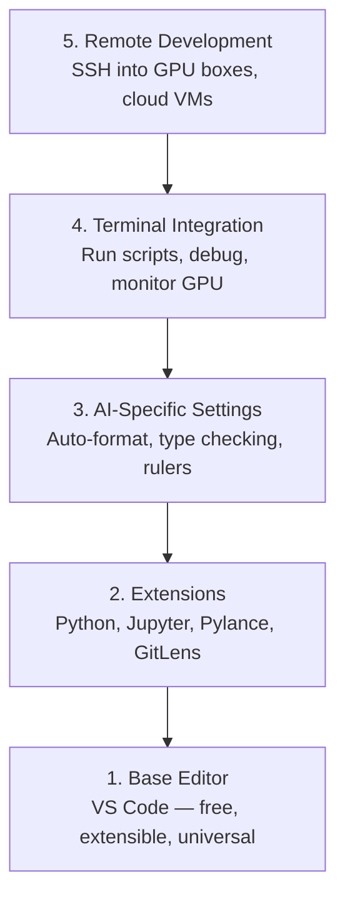

# Configuración del editor

> Su editor es su copiloto, configúralo una vez para que se quede fuera de su camino y comience a tirar de su peso.

**Type:** Build
**Languages:** --
**Prerequisites:** Phase 0, Lesson 01
**Time:** ~20 minutes

## Objetivos de aprendizaje

- Instalar VS Code con extensiones esenciales para Python, Jupyter, linting y SSH remoto
- Configurar el formato en la guía, la verificación de tipo y el desplazamiento de salida de la libreta para los flujos de trabajo de IA
- Configurar Remote SSH para editar y deshacer el código en máquinas remotas de GPU como si fueran locales
- Evaluar las alternativas de editor (Cursor, Windsurf, Neovim) y sus compensaciones para el trabajo de IA

## El problema

Pasará miles de horas dentro de su editor escribiendo Python, ejecutando cuadernos de notas, desactivando los bucles de entrenamiento y incorporando SSH en las cajas de GPU. Un editor mal configurado convierte cada sesión en fricción: no hay complemento automático, no hay sugerencias de tipografía, no hay errores de línea, formato manual y un flujo de trabajo terminal torpe.

La configuración correcta toma 20 minutos, pero saltarlo te cuesta 20 minutos al día.

## El concepto

Una configuración de editor de ingeniería de IA necesita cinco cosas:



```figure
s0-lsp-roundtrip
```

## Construye el mismo

### Paso 1: Instalar el código VS

VS Code es el editor recomendado. Es gratuito, se ejecuta en todos los sistemas operativos, tiene soporte de primera clase para portátiles Jupyter, y el ecosistema de extensión cubre todo lo que necesita para el trabajo de IA.

Descarga desde [code.visualstudio.com](https://code.visualstudio.com/)¿ Qué ?

Verifique desde el terminal:

```bash
code --version
```

Si ...`code`no se encuentra en macOS, abrir VS Code, presione `Cmd+Shift+P`, escriba "Comando de captura", y seleccione "Installar el comando 'código' en PATH".

### Paso 2: Instalar las extensiones esenciales

Abre la terminal integrada en el código VS (`` Ctrl+``` en todas las plataformas) e instalar las extensiones que importan para el trabajo de IA:

```bash
code --install-extension ms-python.python
code --install-extension ms-python.vscode-pylance
code --install-extension ms-toolsai.jupyter
code --install-extension eamodio.gitlens
code --install-extension ms-vscode-remote.remote-ssh
code --install-extension ms-python.debugpy
code --install-extension ms-python.black-formatter
code --install-extension charliermarsh.ruff
```

Lo que cada uno hace:

| Extension | Why |
|-----------|-----|
| Python | Language support, virtual env detection, run/debug |
| Pylance | Fast type checking, autocomplete, import resolution |
| Jupyter | Run notebooks inside VS Code, variable explorer |
| GitLens | See who changed what, inline git blame |
| Remote SSH | Open a folder on a remote GPU box as if it were local |
| Debugpy | Step-through debugging for Python |
| Black Formatter | Auto-format on save, consistent style |
| Ruff | Fast linting, catches common mistakes |

El archivo`code/.vscode/extensions.json`Cuando abras la carpeta de proyectos, VS Code te pedirá que las instales.

### Paso 3: Configurar las configuraciones

Copie las configuraciones de `code/.vscode/settings.json`En esta lección, o aplicarlos manualmente a través de `Settings > Open Settings (JSON)`¿ Qué ?

Las configuraciones clave para el trabajo de IA:

```jsonc
{
    "python.analysis.typeCheckingMode": "basic",
    "editor.formatOnSave": true,
    "editor.rulers": [88, 120],
    "notebook.output.scrolling": true,
    "files.autoSave": "afterDelay"
}
```

¿Por qué son importantes?

- **Type checking on basic**: Captura tipos de argumento incorrectos antes de ejecutar. Ahorra tiempo de depuración en las incompatibilidades de forma del tensor y los parámetros de API incorrectos.
- **Format on save**Nunca más pienses en el formato.
- **Rulers at 88 and 120**El marcador 120 muestra cuando las cadenas de documentos y comentarios se están haciendo demasiado largos.
- **Notebook output scrolling**Los bucles de entrenamiento imprimen miles de líneas.
- **Auto-save**Se olvidará de guardar. Su guión de entrenamiento ejecutará código obsoleto.

### Paso 4: Integración de la terminal

El terminal integrado de VS Code es donde ejecutas scripts de entrenamiento, monitoreas GPUs y gestionas entornos.

Configúralo correctamente:

```jsonc
{
    "terminal.integrated.defaultProfile.osx": "zsh",
    "terminal.integrated.defaultProfile.linux": "bash",
    "terminal.integrated.fontSize": 13,
    "terminal.integrated.scrollback": 10000
}
```

Acortajes útiles:

| Action | macOS | Linux/Windows |
|--------|-------|---------------|
| Toggle terminal | `` Ctrl+` `` | `` Ctrl+` `` |
| New terminal | `` Ctrl+Shift+` `` | `` Ctrl+Shift+` `` |
| Split terminal | `Cmd+\` | `Ctrl+Shift+5` |

Los terminales divididos son útiles: uno para ejecutar tu script, otro para monitorear la GPU con `nvidia-smi -l 1`o `watch -n 1 nvidia-smi`¿ Qué ?

### Paso 5: Desarrollo remoto (SSH en GPU Boxes)

Esta es la extensión más importante para el trabajo de IA. Se ejecutará el entrenamiento en máquinas remotas (VM en la nube, servidores de laboratorio, Lambda, Vast.ai).

Configuración:

1. Instale la extensión remota SSH (hecho en el paso 2).
2. Prensa `Ctrl+Shift+P`(o `Cmd+Shift+P`), el tipo "Remote-SSH: Conectarse a Host".
3. Entrar .`user@your-gpu-box-ip`¿ Qué ?
4. VS Code instala su componente de servidor en la máquina remota automáticamente.

Para acceder sin contraseña, configure las claves SSH:

```bash
ssh-keygen -t ed25519 -C "your-email@example.com"
ssh-copy-id user@your-gpu-box-ip
```

Añadir al host a `~/.ssh/config`para su conveniencia:

```
Host gpu-box
    HostName 203.0.113.50
    User ubuntu
    IdentityFile ~/.ssh/id_ed25519
    ForwardAgent yes
```

Ahora .`Remote-SSH: Connect to Host > gpu-box`se conecta instantáneamente.

## Las alternativas

### El cursor

[cursor.com](https://cursor.com)es un fork VS Code con generación de código de IA incorporada. Utiliza el mismo ecosistema de extensiones y formato de configuración. Si usa Cursor, todo en esta lección todavía se aplica. Importa lo mismo `settings.json`y `extensions.json`¿ Qué ?

### El windsurf

[windsurf.com](https://windsurf.com)Es otro fork de VS Code de IA. La misma historia: las mismas extensiones, el mismo formato de configuración, el mismo soporte de SSH remoto.

### Vim/Neovim

Si ya utilizas Vim o Neovim y eres productivo en ello, quédate allí. La configuración mínima para el trabajo de Python de IA:

- **pyright**o **pylsp**para la verificación de tipo (a través de la instalación manual o de la máquina de maquillaje)
- **nvim-lspconfig**para la integración de servidores de idiomas
- **jupyter-vim**o **molten-nvim**para ejecución similar a un cuaderno
- **telescope.nvim**para la búsqueda de archivos/símbolos
- **none-ls.nvim**con negro y ruff para el formato/linting

Si no utilizas Vim, no empieces ahora. La curva de aprendizaje competirá con el aprendizaje de ingeniería de IA.

## Usalo

Con esta configuración, tu flujo de trabajo diario se ve como:

1. Abre la carpeta del proyecto en VS Code (o conecte a través de Remote SSH a una caja de GPU).
2. Escriba Python en el editor con autocompletado, sugerencias de tipografía y errores de línea.
3. Ejecutar los cuadernos de Jupyter en línea con la extensión de Jupyter.
4. Utilice la terminal integrada para los scripts de formación, `uv pip install`, y la supervisión de GPU.
5. Revise los cambios con GitLens antes de comprometerse.

## Los ejercicios

1. Instalar el código VS y todas las extensiones enumeradas en el paso 2
2. Copie el `settings.json`de esta lección en su VS código de configuración
3. Abre un archivo Python y comprueba que Pylance muestra sugerencias de tipo y formatos negros en guardar
4. Si tiene acceso a una máquina remota, configure Remote SSH y abra una carpeta en ella

## Términos clave

| Term | What people say | What it actually means |
|------|----------------|----------------------|
| LSP | "Autocomplete engine" | Language Server Protocol: a standard for editors to get type info, completions, and diagnostics from a language-specific server |
| Pylance | "The Python plugin" | Microsoft's Python language server using Pyright for type checking and IntelliSense |
| Remote SSH | "Working on the server" | VS Code extension that runs a lightweight server on a remote machine and streams the UI to your local editor |
| Format on save | "Auto-prettier" | The editor runs a formatter (Black, Ruff) every time you save, so code style is always consistent |
