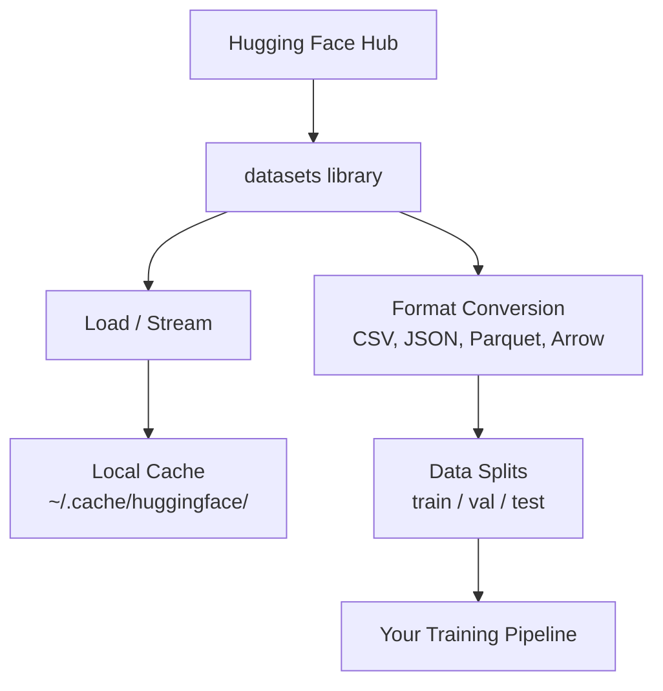

# Gestión de datos

> Los datos son el combustible, y la forma en que los manejas determina la velocidad.

**Type:** Build
**Language:**Python
**Prerequisites:** Phase 0, Lesson 01
**Time:** ~45 minutes

## Objetivos de aprendizaje

- Cargar, transmitir y almacenar en caché conjuntos de datos utilizando el Face Hugging `datasets`biblioteca
- Convertir entre los formatos CSV, JSON, Parquet y Arrow y explicar sus compensaciones
- Crear divisiones reproducibles de tren/validación/pruebas con semillas aleatorias fijas
- Gestionar archivos de modelos y conjuntos de datos grandes utilizando `.gitignore`, Git LFS o DVC

## El problema

Cada proyecto de IA comienza con datos. Necesitas encontrar conjuntos de datos, descargarlos, convertirlos entre formatos, dividirlos para entrenamiento y evaluación, y versionarlos para que los experimentos sean reproducibles. Hacer esto manualmente cada vez es lento y propenso a errores. Necesitas un flujo de trabajo repetible.

## El concepto



El rostro abrazado`datasets`La biblioteca es la forma estándar de cargar datos para el trabajo de IA. Se encarga de descargar, almacenar en caché, convertir formato y transmitir fuera de la caja.

```figure
s0-data-pipeline
```

## Construye el mismo

### Paso 1: Instalar la biblioteca de conjuntos de datos

```bash
pip install datasets huggingface_hub
```

### Paso 2: Cargar un conjunto de datos

```python
from datasets import load_dataset

dataset = load_dataset("stanfordnlp/imdb")
print(dataset)
print(dataset["train"][0])
```

Esto descarga el conjunto de datos de revisión de películas de IMDB. Después de la primera descarga, se carga desde la caché en `~/.cache/huggingface/datasets/`¿ Qué ?

### Paso 3: Transmite grandes conjuntos de datos

Algunos conjuntos de datos son demasiado grandes para caber en el disco.

```python
dataset = load_dataset("wikimedia/wikipedia", "20220301.en", split="train", streaming=True)

for i, example in enumerate(dataset):
    print(example["title"])
    if i >= 4:
        break
```

El streaming te da una oportunidad .`IterableDataset`El uso de memoria se mantiene constante independientemente del tamaño del conjunto de datos.

### Paso 4: Formatos de conjunto de datos

El `datasets`La biblioteca utiliza Apache Arrow bajo el capó. Puedes convertirlo a otros formatos dependiendo de lo que tu tubería necesite.

```python
dataset = load_dataset("stanfordnlp/imdb", split="train")

dataset.to_csv("imdb_train.csv")
dataset.to_json("imdb_train.json")
dataset.to_parquet("imdb_train.parquet")
```

Comparación de formato:

| Format | Size | Read Speed | Best For |
|--------|------|-----------|----------|
| CSV | Large | Slow | Human readability, spreadsheets |
| JSON | Large | Slow | APIs, nested data |
| Parquet | Small | Fast | Analytics, columnar queries |
| Arrow | Small | Fastest | In-memory processing (what `datasets` uses internally) |

Para el trabajo de IA, Parquet es el mejor formato de almacenamiento. Arrow es lo que se trabaja en la memoria. CSV y JSON son para el intercambio.

### Paso 5: División de datos

Cada proyecto de ML necesita tres divisiones:

- **Train**El modelo aprende de esto (normalmente el 80%)
- **Validation**: Verifica el progreso durante la formación (normalmente 10%)
- **Test**: Evaluación final después de la formación (normalmente 10%)

Algunos conjuntos de datos vienen pre-divididos. Cuando no lo hacen, dividielos tú mismo:

```python
dataset = load_dataset("stanfordnlp/imdb", split="train")

split = dataset.train_test_split(test_size=0.2, seed=42)
train_val = split["train"].train_test_split(test_size=0.125, seed=42)

train_ds = train_val["train"]
val_ds = train_val["test"]
test_ds = split["test"]

print(f"Train: {len(train_ds)}, Val: {len(val_ds)}, Test: {len(test_ds)}")
```

Siempre fije una semilla para la reproducibilidad.

### Paso 6: Descargar y almacenar modelos en caché

Los modelos son archivos grandes.`huggingface_hub`librería maneja descarga y almacenamiento en caché.

```python
from huggingface_hub import hf_hub_download, snapshot_download

model_path = hf_hub_download(
    repo_id="sentence-transformers/all-MiniLM-L6-v2",
    filename="config.json"
)
print(f"Cached at: {model_path}")

model_dir = snapshot_download("sentence-transformers/all-MiniLM-L6-v2")
print(f"Full model at: {model_dir}")
```

Modelos en caché para `~/.cache/huggingface/hub/`Una vez descargados, se cargan instantáneamente en las siguientes carreras.

### Paso 7: Manejar archivos grandes

Los pesos de modelo y los grandes conjuntos de datos no deben entrar en git.

**Option A: .gitignore (simplest)**

```
*.bin
*.safetensors
*.pt
*.onnx
data/*.parquet
data/*.csv
models/
```

**Option B: Git LFS (track large files in git)**

```bash
git lfs install
git lfs track "*.bin"
git lfs track "*.safetensors"
git add .gitattributes
```

Git LFS almacena los punteros en su repo y los archivos reales en un servidor separado. GitHub le da 1 GB gratis.

**Option C: DVC (data version control)**

```bash
pip install dvc
dvc init
dvc add data/training_set.parquet
git add data/training_set.parquet.dvc data/.gitignore
git commit -m "Track training data with DVC"
```

DVC crea pequeñas .`.dvc`Los datos en sí viven en S3, GCS, o otro backend de almacenamiento remoto.

| Approach | Complexity | Best For |
|----------|-----------|----------|
| .gitignore | Low | Personal projects, downloaded data you can re-fetch |
| Git LFS | Medium | Teams sharing model weights via git |
| DVC | High | Reproducible experiments, large datasets, teams |

Para este curso,`.gitignore`Utilice DVC cuando necesite reproducir experimentos exactos en máquinas.

### Paso 8: Modelos de almacenamiento

**Local storage**funciona para conjuntos de datos de menos de ~ 10 GB. El caché HF maneja esto automáticamente.

**Cloud storage**es para cualquier cosa más grande o compartida entre máquinas:

```python
import os

local_path = os.path.expanduser("~/.cache/huggingface/datasets/")

# s3_path = "s3://my-bucket/datasets/"
# gcs_path = "gs://my-bucket/datasets/"
```

DVC se integra directamente con S3 y GCS:

```bash
dvc remote add -d myremote s3://my-bucket/dvc-store
dvc push
```

El almacenamiento en la nube se vuelve relevante cuando se ajusta a las instancias remotas de la GPU.

## Datos utilizados en este curso

| Dataset | Lessons | Size | What It Teaches |
|---------|---------|------|----------------|
| IMDB | Tokenization, classification | 84 MB | Text classification basics |
| WikiText | Language modeling | 181 MB | Next-token prediction |
| SQuAD | QA systems | 35 MB | Question answering, spans |
| Common Crawl (subset) | Embeddings | Varies | Large-scale text processing |
| MNIST | Vision basics | 21 MB | Image classification fundamentals |
| COCO (subset) | Multimodal | Varies | Image-text pairs |

No es necesario descargar todas estas cosas ahora, cada lección especifica lo que necesita.

## Usalo

Ejecutar el script de utilidad para verificar todo funciona:

```bash
python code/data_utils.py
```

Esto descarga un pequeño conjunto de datos, lo convierte, lo divide y imprime un resumen.

## Envío

Esta lección produce:
- `code/data_utils.py`- utilidad de carga y almacenamiento en caché de datos reutilizables
- `outputs/prompt-data-helper.md`- de manera rápida para encontrar el conjunto de datos adecuado para una tarea

## Los ejercicios

1. Carga el `glue`conjunto de datos con el `mrpc`Configurar e inspeccionar los primeros 5 ejemplos
2. Envía el `c4`conjunto de datos y contar cuántos ejemplos puede procesar en 10 segundos
3. Convierta un conjunto de datos a Parquet y compara el tamaño del archivo a CSV
4. Crear una división de tren/val/prueba 70/15/15 con semilla fija y verificar los tamaños

## Términos clave

| Term | What people say | What it actually means |
|------|----------------|----------------------|
| Dataset split | "Training data" | A named subset (train/val/test) used at different stages of the ML lifecycle |
| Streaming | "Load it lazily" | Processing data row by row from a remote source without downloading the full dataset |
| Parquet | "Compressed CSV" | A columnar file format optimized for analytical queries and storage efficiency |
| Arrow | "Fast dataframe" | An in-memory columnar format used internally by the datasets library for zero-copy reads |
| Git LFS | "Git for big files" | An extension that stores large files outside the git repo while keeping pointers in version control |
| DVC | "Git for data" | A version control system for datasets and models that integrates with cloud storage |
| Cache | "Already downloaded" | A local copy of previously fetched data, stored at ~/.cache/huggingface/ by default |
