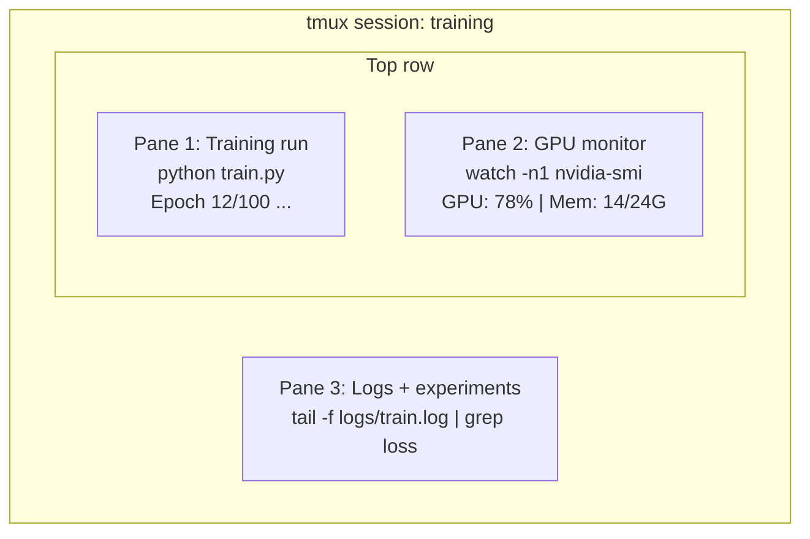

# Terminal y Shell

> La terminal es donde viven los ingenieros de IA.

**Type:** Learn
**Languages:** --
**Prerequisites:** Phase 0, Lesson 01
**Time:** ~35 minutes

## Objetivos de aprendizaje

- Usar tuberías, redirecciones y `grep`filtrar y procesar los registros de entrenamiento desde la línea de comandos
- Crear sesiones de tmux persistentes con múltiples paneles para entrenamiento simultáneo y monitoreo de GPU
- Monitorear los recursos del sistema y de la GPU con `htop`¿ Qué ?`nvtop`, y `nvidia-smi`
- Transferencia de archivos entre máquinas locales y remotas utilizando SSH, `scp`, y `rsync`

## El problema

Pasará más tiempo en el terminal que en cualquier editor. Entrenamiento, monitoreo de GPU, registro de secuencias, sesiones remotas de SSH, gestión ambiental. Cada flujo de trabajo de IA toca la cáscara. Si eres lento aquí, eres lento en todas partes.

Esta lección cubre las habilidades terminales que son importantes para el trabajo de la IA. No hay historia de Unix. No hay inmersión profunda en el scripting Bash.

## El concepto



Tres cosas funcionan a la vez, una terminal, puedes desprenderte, ir a casa, volver a la SSH y volver a conectarte.

```figure
s0-shell-pipeline
```

## Construye el mismo

### Paso 1: Conozca su cáscara

Compruebe qué proyectil está ejecutando:

```bash
echo $SHELL
```

La mayoría de los sistemas utilizan `bash`o `zsh`Ambos funcionan bien, los comandos de este curso funcionan en ambos.

Cosas clave que hay que saber:

```bash
# Move around
cd ~/projects/ai-engineering-from-scratch
pwd
ls -la

# History search (most useful shortcut you'll learn)
# Ctrl+R then type part of a previous command
# Press Ctrl+R again to cycle through matches

# Clear terminal
clear   # or Ctrl+L

# Cancel a running command
# Ctrl+C

# Suspend a running command (resume with fg)
# Ctrl+Z
```

### Paso 2: Piping y redirecciones

El tubo conecta los comandos entre sí. Así es como procesas registros, filtros de salida y herramientas de cadena.

```bash
# Count how many times "loss" appears in a log
cat train.log | grep "loss" | wc -l

# Extract just the loss values from training output
grep "loss:" train.log | awk '{print $NF}' > losses.txt

# Watch a log file update in real time, filtering for errors
tail -f train.log | grep --line-buffered "ERROR"

# Sort experiments by final accuracy
grep "final_accuracy" results/*.log | sort -t= -k2 -n -r

# Redirect stdout and stderr to separate files
python train.py > output.log 2> errors.log

# Redirect both to the same file
python train.py > train_full.log 2>&1
```

Los tres redirecciones que necesitas:

| Symbol | What it does |
|--------|-------------|
| `>` | Write stdout to file (overwrite) |
| `>>` | Append stdout to file |
| `2>` | Write stderr to file |
| `2>&1` | Send stderr to same place as stdout |
| `\|` | Send stdout of one command as stdin to the next |

### Paso 3: Procesos de fondo

Las carreras de entrenamiento tardan horas, no quieres mantener abierto el terminal todo el tiempo.

```bash
# Run in background (output still goes to terminal)
python train.py &

# Run in background, immune to hangup (closing terminal won't kill it)
nohup python train.py > train.log 2>&1 &

# Check what's running in background
jobs
ps aux | grep train.py

# Bring a background job to foreground
fg %1

# Kill a background process
kill %1
# or find its PID and kill that
kill $(pgrep -f "train.py")
```

La diferencia entre `&`¿ Qué ?`nohup`, y `screen`- ¿ Qué ?`tmux`¿Qué es esto ?

| Method | Survives terminal close? | Can reattach? |
|--------|-------------------------|---------------|
| `command &` | No | No |
| `nohup command &` | Yes | No (check log file) |
| `screen` / `tmux` | Yes | Yes |

Para cualquier cosa que dure más de unos minutos, use tmux.

### Paso 4: Tmux

tmux permite crear sesiones terminales persistentes con múltiples paneles. Esta es la herramienta única más útil para gestionar las carreras de entrenamiento.

```bash
# Install
# macOS
brew install tmux
# Ubuntu
sudo apt install tmux

# Start a named session
tmux new -s training

# Split horizontally
# Ctrl+B then "

# Split vertically
# Ctrl+B then %

# Navigate between panes
# Ctrl+B then arrow keys

# Detach (session keeps running)
# Ctrl+B then d

# Reattach
tmux attach -t training

# List sessions
tmux ls

# Kill a session
tmux kill-session -t training
```

Una sesión típica de flujo de trabajo de IA:

```bash
tmux new -s train

# Pane 1: start training
python train.py --epochs 100 --lr 1e-4

# Ctrl+B, " to split, then run GPU monitor
watch -n1 nvidia-smi

# Ctrl+B, % to split vertically, tail the logs
tail -f logs/experiment.log

# Now detach with Ctrl+B, d
# SSH out, go get coffee, come back
# tmux attach -t train
```

### Paso 5: Monitoreo con htop y nvtop

```bash
# System processes (better than top)
htop

# GPU processes (if you have NVIDIA GPU)
# Install: sudo apt install nvtop (Ubuntu) or brew install nvtop (macOS)
nvtop

# Quick GPU check without nvtop
nvidia-smi

# Watch GPU usage update every second
watch -n1 nvidia-smi

# See which processes are using the GPU
nvidia-smi --query-compute-apps=pid,name,used_memory --format=csv
```

`htop`las llaves que utilizará:
- `F6`o `>`para ordenar por columna (ordenar por memoria para encontrar fugas de memoria)
- `F5`para cambiar la vista de árbol (ver procesos infantiles)
- `F9`para matar un proceso
- `/`para buscar un nombre de proceso

### Paso 6: SSH para cajas de GPU remotas

Cuando alquila una GPU en la nube (Lambda, RunPod, Vast.ai), se conecta a través de SSH.

```bash
# Basic connection
ssh user@gpu-box-ip

# With a specific key
ssh -i ~/.ssh/my_gpu_key user@gpu-box-ip

# Copy files to remote
scp model.pt user@gpu-box-ip:~/models/

# Copy files from remote
scp user@gpu-box-ip:~/results/metrics.json ./

# Sync a whole directory (faster for many files)
rsync -avz ./data/ user@gpu-box-ip:~/data/

# Port forward (access remote Jupyter/TensorBoard locally)
ssh -L 8888:localhost:8888 user@gpu-box-ip
# Now open localhost:8888 in your browser

# SSH config for convenience
# Add to ~/.ssh/config:
# Host gpu
#     HostName 192.168.1.100
#     User ubuntu
#     IdentityFile ~/.ssh/gpu_key
#
# Then just:
# ssh gpu
```

### Paso 7: Alias útiles para el trabajo de IA

Añade esto a su `~/.bashrc`o `~/.zshrc`¿Qué es esto ?

```bash
source phases/00-setup-and-tooling/10-terminal-and-shell/code/shell_aliases.sh
```

O copiar las que quieras.

```bash
# GPU status at a glance
alias gpu='nvidia-smi --query-gpu=index,name,utilization.gpu,memory.used,memory.total,temperature.gpu --format=csv,noheader'

# Kill all Python training processes
alias killtraining='pkill -f "python.*train"'

# Quick virtual environment activate
alias ae='source .venv/bin/activate'

# Watch training loss
alias watchloss='tail -f logs/*.log | grep --line-buffered "loss"'
```

¿ Qué ?`code/shell_aliases.sh`para el conjunto completo.

### Paso 8: patrones de terminales comunes de IA

Estos se presentan repetidamente en la práctica:

```bash
# Run training, log everything, notify when done
python train.py 2>&1 | tee train.log; echo "DONE" | mail -s "Training complete" you@email.com

# Compare two experiment logs side by side
diff <(grep "accuracy" exp1.log) <(grep "accuracy" exp2.log)

# Find the largest model files (clean up disk space)
find . -name "*.pt" -o -name "*.safetensors" | xargs du -h | sort -rh | head -20

# Download a model from Hugging Face
wget https://huggingface.co/model/resolve/main/model.safetensors

# Untar a dataset
tar xzf dataset.tar.gz -C ./data/

# Count lines in all Python files (see how big your project is)
find . -name "*.py" | xargs wc -l | tail -1

# Check disk space (training data fills disks fast)
df -h
du -sh ./data/*

# Environment variable check before training
env | grep -i cuda
env | grep -i torch
```

## Usalo

Aquí está cuando cada herramienta entra en juego durante este curso:

| Tool | When you use it |
|------|----------------|
| tmux | Every training run (Phases 3+) |
| `tail -f` + `grep` | Monitoring training logs |
| `nohup` / `&` | Quick background tasks |
| `htop` / `nvtop` | Debugging slow training, OOM errors |
| SSH + `rsync` | Working on cloud GPUs |
| Piping + redirects | Processing experiment results |
| Aliases | Saving time on repetitive commands |

## Los ejercicios

1. Instale tmux, cree una sesión con tres paneles y ejecuta `htop`en uno,`watch -n1 date`En otro, y un script Python en el tercero.
2. Añadir los alias de `code/shell_aliases.sh`Configurar y recargar con su carcasa`source ~/.zshrc`(o `~/.bashrc`¿Qué es lo que se hace?
3. Crear un registro de entrenamiento falso con `for i in $(seq 1 100); do echo "epoch $i loss: $(echo "scale=4; 1/$i" | bc)"; sleep 0.1; done > fake_train.log`y luego usar `grep`¿ Qué ?`tail`, y `awk`para extraer sólo los valores de pérdida.
4. Configurar una entrada de configuración SSH para un servidor al que tiene acceso (o utiliza `localhost`para practicar la sintaxis).

## Términos clave

| Term | What people say | What it actually means |
|------|----------------|----------------------|
| Shell | "The terminal" | The program that interprets your commands (bash, zsh, fish) |
| tmux | "Terminal multiplexer" | A program that lets you run multiple terminal sessions inside one window, and detach/reattach |
| Pipe | "The bar thing" | The `\|` operator that sends one command's output as input to another |
| PID | "Process ID" | A unique number assigned to every running process, used to monitor or kill it |
| nohup | "No hangup" | Runs a command immune to the hangup signal, so closing the terminal won't kill it |
| SSH | "Connecting to the server" | Secure Shell, an encrypted protocol for running commands on a remote machine |
