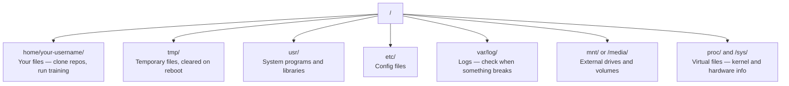

# Linux para IA

> La mayoría de la IA funciona en Linux. Necesitas saber lo suficiente para no quedar atascado.

**Type:** Learn
**Languages:** --
**Prerequisites:** Phase 0, Lesson 01
**Time:** ~30 minutes

## Objetivos de aprendizaje

- Navega el sistema de archivos Linux y realiza operaciones de archivos esenciales desde la línea de comandos
- Gestionar los permisos de archivos con `chmod`y `chown`para resolver los errores de "Permiso negado"
- Instalar paquetes de sistema con `apt`y configurar una caja de GPU fresca para el trabajo de IA
- Identificar las diferencias entre macOS y Linux que generalmente causan problemas a los desarrolladores que trabajan en máquinas remotas

## El problema

Se desarrolla en macOS o Windows. Pero en el momento en que se pone en una caja de GPU en la nube, alquilar una instancia Lambda, o girar una máquina EC2, se aterriza en Ubuntu. La terminal es tu única interfaz. No hay Finder, no hay Explorer, no hay interfaz gráfica. Si no puedes navegar por el sistema de archivos, instalar paquetes y administrar procesos desde la línea de comandos, estás atrapado pagando horas de GPU inactivas mientras buscas en Google "cómo deszipar un archivo en Linux".

Esta es una guía de supervivencia. Cubre exactamente lo que necesitas para operar en una máquina Linux remota para el trabajo de la IA. Nada más.

## Diseño del sistema de archivos

Linux organiza todo bajo una sola raíz .`/`No hay ninguna .`C:\`o `/Volumes`Los directorios que realmente tocarás:



Su directorio de hogar es`~`o `/home/your-username`Casi todo lo que haces sucede aquí.

## Mandamientos esenciales

Estos son los 15 comandos que cubren el 95% de lo que harás en una caja de GPU remota.

### De moverse

```bash
pwd                         # Where am I?
ls                          # What's here?
ls -la                      # What's here, including hidden files with details?
cd /path/to/dir             # Go there
cd ~                        # Go home
cd ..                       # Go up one level
```

### Archivos y directorios

```bash
mkdir my-project            # Create a directory
mkdir -p a/b/c              # Create nested directories in one shot

cp file.txt backup.txt      # Copy a file
cp -r src/ src-backup/      # Copy a directory (recursive)

mv old.txt new.txt          # Rename a file
mv file.txt /tmp/           # Move a file

rm file.txt                 # Delete a file (no trash, it's gone)
rm -rf my-dir/              # Delete a directory and everything inside
```

`rm -rf`No hay nada que deshacer, revisa el camino antes de entrar.

### Leer archivos

```bash
cat file.txt                # Print entire file
head -20 file.txt           # First 20 lines
tail -20 file.txt           # Last 20 lines
tail -f log.txt             # Follow a log file in real time (Ctrl+C to stop)
less file.txt               # Scroll through a file (q to quit)
```

### Buscando

```bash
grep "error" training.log           # Find lines containing "error"
grep -r "learning_rate" .           # Search all files in current directory
grep -i "cuda" config.yaml          # Case-insensitive search

find . -name "*.py"                 # Find all Python files under current dir
find . -name "*.ckpt" -size +1G     # Find checkpoint files larger than 1GB
```

## Permisos

Cada archivo en Linux tiene un propietario y bits de permisos. Te encontrarás con esto cuando los scripts no se ejecutan o no puedes escribir a un directorio.

```bash
ls -l train.py
# -rwxr-xr-- 1 user group 2048 Mar 19 10:00 train.py
#  ^^^             owner permissions: read, write, execute
#     ^^^          group permissions: read, execute
#        ^^        everyone else: read only
```

Correcciones comunes:

```bash
chmod +x train.sh           # Make a script executable
chmod 755 deploy.sh         # Owner: full, others: read+execute
chmod 644 config.yaml       # Owner: read+write, others: read only

chown user:group file.txt   # Change who owns a file (needs sudo)
```

Cuando algo dice "Permisón negada", casi siempre es un problema de permisos. `chmod +x`o `sudo`arreglará la mayoría de los casos.

## Gestión de paquetes (apto)

Utiliza Ubuntu `apt`Así es como se instala software a nivel de sistema.

```bash
sudo apt update             # Refresh the package list (always do this first)
sudo apt install -y htop    # Install a package (-y skips confirmation)
sudo apt install -y build-essential  # C compiler, make, etc. Needed by many Python packages
sudo apt install -y tmux    # Terminal multiplexer (keep sessions alive after disconnect)

apt list --installed        # What's installed?
sudo apt remove htop        # Uninstall
```

Paquetes comunes que instalarás en una caja de GPU nueva:

```bash
sudo apt update && sudo apt install -y \
    build-essential \
    git \
    curl \
    wget \
    tmux \
    htop \
    unzip \
    python3-venv
```

## Usuarios y sudo

Normalmente estás conectado como usuario regular. Algunas operaciones necesitan acceso root (admin).

```bash
whoami                      # What user am I?
sudo command                # Run a single command as root
sudo su                     # Become root (exit to go back, use sparingly)
```

En las instancias de GPU en la nube, normalmente eres el único usuario y ya tienes acceso a sudo. No ejecutes todo como root.

## Procesos y sistemas

Cuando tu entrenamiento está suspendido, o necesitas comprobar lo que está funcionando:

```bash
htop                        # Interactive process viewer (q to quit)
ps aux | grep python        # Find running Python processes
kill 12345                  # Gracefully stop process with PID 12345
kill -9 12345               # Force kill (use when graceful doesn't work)
nvidia-smi                  # GPU processes and memory usage
```

sistemad administra servicios (daemones de fondo). lo utilizará si ejecuta servidores de inferencia:

```bash
sudo systemctl start nginx          # Start a service
sudo systemctl stop nginx           # Stop it
sudo systemctl restart nginx        # Restart it
sudo systemctl status nginx         # Check if it's running
sudo systemctl enable nginx         # Start automatically on boot
```

## Espacio en disco

Las cajas de GPU a menudo tienen espacio limitado en el disco. Los modelos y conjuntos de datos lo llenan rápidamente.

```bash
df -h                       # Disk usage for all mounted drives
df -h /home                 # Disk usage for /home specifically

du -sh *                    # Size of each item in current directory
du -sh ~/.cache             # Size of your cache (pip, huggingface models land here)
du -sh /data/checkpoints/   # Check how big your checkpoints are

# Find the biggest space hogs
du -h --max-depth=1 / 2>/dev/null | sort -hr | head -20
```

Los ahorros de espacio comunes:

```bash
# Clear pip cache
pip cache purge

# Clear apt cache
sudo apt clean

# Remove old checkpoints you don't need
rm -rf checkpoints/epoch_01/ checkpoints/epoch_02/
```

## Las redes

Se descargarán modelos, transferir archivos, y golpear API desde la línea de comandos.

```bash
# Download files
wget https://example.com/model.bin                   # Download a file
curl -O https://example.com/data.tar.gz              # Same thing with curl
curl -s https://api.example.com/health | python3 -m json.tool  # Hit an API, pretty-print JSON

# Transfer files between machines
scp model.bin user@remote:/data/                     # Copy file to remote machine
scp user@remote:/data/results.csv .                  # Copy file from remote to local
scp -r user@remote:/data/checkpoints/ ./local-dir/   # Copy directory

# Sync directories (faster than scp for large transfers, resumes on failure)
rsync -avz --progress ./data/ user@remote:/data/
rsync -avz --progress user@remote:/results/ ./results/
```

Usar`rsync`- ¿ Qué ?`scp`Sólo transfiere cambios de bytes y maneja conexiones interrumpidas.

## Mantenga las sesiones vivas

Cuando se pone en una caja remota, cerrar su computadora portátil mata su entrenamiento.

```bash
tmux new -s train           # Start a new session named "train"
# ... start your training, then:
# Ctrl+B, then D            # Detach (training keeps running)

tmux ls                     # List sessions
tmux attach -t train        # Reattach to session

# Inside tmux:
# Ctrl+B, then %            # Split pane vertically
# Ctrl+B, then "            # Split pane horizontally
# Ctrl+B, then arrow keys   # Switch between panes
```

Siempre se ejecuta un largo entrenamiento dentro de la casa.

## WSL2 para usuarios de Windows

Si estás en Windows, WSL2 te da un ambiente Linux real sin doble arranque.

```bash
# In PowerShell (admin)
wsl --install -d Ubuntu-24.04

# After restart, open Ubuntu from Start menu
sudo apt update && sudo apt upgrade -y
```

WSL2 ejecuta un kernel Linux real. Todo en esta lección funciona dentro de él. Sus archivos de Windows están en`/mnt/c/Users/YourName/`desde dentro de WSL.

La GPU de paso funciona con los controladores NVIDIA instalados en el lado de Windows. Instale el controlador NVIDIA de Windows (no el de Linux), y CUDA estará disponible dentro de WSL2.

## Gotchas: macOS a Linux

Cosas que te echarán de trampa si vienes de macOS:

| macOS | Linux | Notes |
|-------|-------|-------|
| `brew install` | `sudo apt install` | Different package names sometimes. `brew install htop` vs `sudo apt install htop` works the same, but `brew install readline` vs `sudo apt install libreadline-dev` does not. |
| `open file.txt` | `xdg-open file.txt` | But you won't have a GUI on a remote box. Use `cat` or `less`. |
| `pbcopy` / `pbpaste` | Not available | Pipe to/from clipboard doesn't exist over SSH. |
| `~/.zshrc` | `~/.bashrc` | macOS defaults to zsh. Most Linux servers use bash. |
| `/opt/homebrew/` | `/usr/bin/`, `/usr/local/bin/` | Binaries live in different places. |
| `sed -i '' 's/a/b/' file` | `sed -i 's/a/b/' file` | macOS sed needs an empty string after `-i`. Linux does not. |
| Case-insensitive filesystem | Case-sensitive filesystem | `Model.py` and `model.py` are two different files on Linux. |
| Line endings `\n` | Line endings `\n` | Same. But Windows uses `\r\n`, which breaks bash scripts. Run `dos2unix` to fix. |

## Tarjeta de referencia rápida

```
Navigation:     pwd, ls, cd, find
Files:          cp, mv, rm, mkdir, cat, head, tail, less
Search:         grep, find
Permissions:    chmod, chown, sudo
Packages:       apt update, apt install
Processes:      htop, ps, kill, nvidia-smi
Services:       systemctl start/stop/restart/status
Disk:           df -h, du -sh
Network:        curl, wget, scp, rsync
Sessions:       tmux new/attach/detach
```

```figure
s0-process-fork
```

## Los ejercicios

1. SSH en cualquier máquina Linux (o abrir WSL2) y navegar a su directorio de origen. Crea una carpeta de proyecto, crea tres archivos vacíos dentro de ella con `touch`, luego los enumeran con `ls -la`¿ Qué ?
2. Instalar`htop`con apt, ejecutarlo, y identificar qué proceso está utilizando más memoria.
3. Comience una sesión de tmux, ejecuta`sleep 300`dentro de ella, desprenderse, hacer una lista de sesiones y volver a unir.
4. Usar`df -h`para comprobar el espacio disponible en el disco, luego utilizar `du -sh ~/.cache/*`para encontrar lo que está ocupando espacio en su caché.
5. Transfiere un archivo de su máquina local a una remota usando `scp`, entonces haga la misma transferencia con `rsync`y comparar la experiencia.
