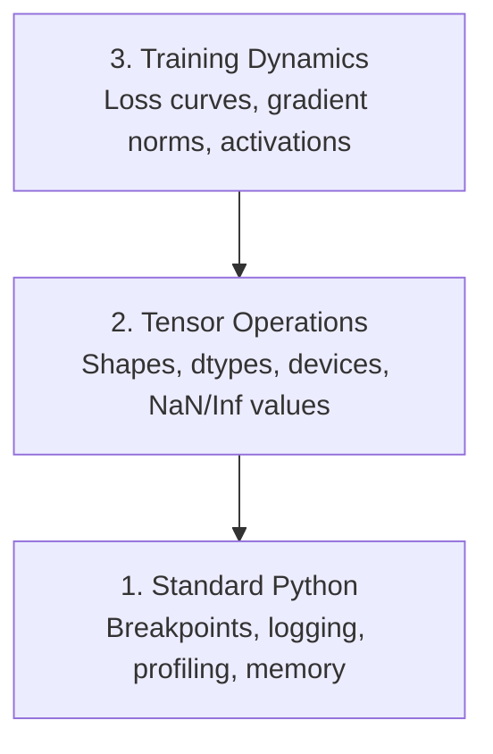

# Desarreglo y perfil

> Los peores insectos de IA no se estrellan, sino que se entrenan en silencio en la basura y reportan una hermosa curva de pérdidas.

**Type:** Build
**Language:**Python
**Prerequisites:** Lesson 1 (Dev Environment), basic PyTorch familiarity
**Time:** ~60 minutes

## Objetivos de aprendizaje

- Utilice condicional `breakpoint()`y `debug_print`para inspeccionar las formas, los tipos y los valores de tensor en medio del entrenamiento
- Perfil de los bucles de entrenamiento con `cProfile`¿ Qué ?`line_profiler`, y `tracemalloc`para encontrar cuellos de botella
- Detectar errores comunes de IA: desajustes de forma, pérdida de NaN, fuga de datos y tensores de dispositivo equivocado
- Configure TensorBoard para visualizar curvas de pérdida, histogramas de peso y distribuciones de gradientes

## El problema

El código de IA falla de manera diferente al código normal. Una aplicación web se estrella con un rastro de pila. Un bucle de entrenamiento mal configurado se ejecuta durante 8 horas, quema $ 200 en tiempo de GPU, y produce un modelo que predice la media de cada entrada. El código nunca cometió error. El error fue un tensor en el dispositivo equivocado, un olvidado.`.detach()`, o etiquetas que se filtran en las características.

Necesitas herramientas de depuración que capten estos fallos silenciosos antes de que pierdan tu tiempo y computación.

## El concepto

La debugging de IA funciona en tres niveles:



La mayoría de la gente salta directamente al nivel 3 (mirando TensorBoard). Pero el 80% de los errores de IA viven en los niveles 1 y 2.

```figure
s0-flame-hot
```

## Construye el mismo

### Parte 1: Descargar los errores de impresión (sí, funciona)

Para el código tensor, una declaración de impresión dirigida es mejor que pasar por un depurador porque necesitas ver formas, tipos y rangos de valores a la vez.

```python
def debug_print(name, tensor):
    print(f"{name}: shape={tensor.shape}, dtype={tensor.dtype}, "
          f"device={tensor.device}, "
          f"min={tensor.min().item():.4f}, max={tensor.max().item():.4f}, "
          f"mean={tensor.mean().item():.4f}, "
          f"has_nan={tensor.isnan().any().item()}")
```

Llame esto después de cada operación sospechosa.

### Parte 2: Descomposición de Python (pdb y punto de ruptura)

El depurador incorporado está subestimado por el trabajo de IA.`breakpoint()`En su bucle de entrenamiento e inspeccionar los tensores de forma interactiva.

```python
def training_step(model, batch, criterion, optimizer):
    inputs, labels = batch
    outputs = model(inputs)
    loss = criterion(outputs, labels)

    if loss.item() > 100 or torch.isnan(loss):
        breakpoint()

    loss.backward()
    optimizer.step()
```

Cuando el desembolso te deja entrar, comandos útiles:

- `p outputs.shape`para comprobar las formas
- `p loss.item()`para ver el valor de pérdida
- `p torch.isnan(outputs).sum()`para contar las NaN
- `p model.fc1.weight.grad`para comprobar los gradientes
- `c`para continuar,`q`dejar de fumar

Esto es depuración condicional, sólo se detiene cuando algo parece mal para una carrera de entrenamiento de 10.000 pasos, eso importa.

### Parte 3: registro de Python

Sustituye las declaraciones de impresión con registro cuando el depuración va más allá de una verificación rápida.

```python
import logging

logging.basicConfig(
    level=logging.INFO,
    format="%(asctime)s [%(levelname)s] %(message)s",
    handlers=[
        logging.FileHandler("training.log"),
        logging.StreamHandler()
    ]
)
logger = logging.getLogger(__name__)

logger.info("Starting training: lr=%.4f, batch_size=%d", lr, batch_size)
logger.warning("Loss spike detected: %.4f at step %d", loss.item(), step)
logger.error("NaN loss at step %d, stopping", step)
```

Cuando una carrera de entrenamiento falla a las 3 AM, se quiere un archivo de registro, no una salida terminal que se desplace fuera de la pantalla.

### Parte 4: Secciones de código de tiempo

Saber dónde va el tiempo es el primer paso para la optimización.

```python
import time

class Timer:
    def __init__(self, name=""):
        self.name = name

    def __enter__(self):
        self.start = time.perf_counter()
        return self

    def __exit__(self, *args):
        elapsed = time.perf_counter() - self.start
        print(f"[{self.name}] {elapsed:.4f}s")

with Timer("data loading"):
    batch = next(dataloader_iter)

with Timer("forward pass"):
    outputs = model(batch)

with Timer("backward pass"):
    loss.backward()
```

El resultado común es que la carga de datos toma el 60% del tiempo de formación.`num_workers > 0`en su DataLoader, no una GPU más rápida.

### Parte 5: cProfil y line_profiiler

Cuando necesite más que temporizadores manuales:

```bash
python -m cProfile -s cumtime train.py
```

Esto muestra cada llamada de función ordenada por tiempo acumulado.

```bash
pip install line_profiler
```

```python
@profile
def train_step(model, data, target):
    output = model(data)
    loss = F.cross_entropy(output, target)
    loss.backward()
    return loss

# Run with: kernprof -l -v train.py
```

### Parte 6: Profiles de memoria

#### Memoria de CPU con tracemalloc

```python
import tracemalloc

tracemalloc.start()

# your code here
model = build_model()
data = load_dataset()

snapshot = tracemalloc.take_snapshot()
top_stats = snapshot.statistics("lineno")
for stat in top_stats[:10]:
    print(stat)
```

#### CPU memoria con memoria_profiler

```bash
pip install memory_profiler
```

```python
from memory_profiler import profile

@profile
def load_data():
    raw = read_csv("data.csv")       # watch memory jump here
    processed = preprocess(raw)       # and here
    return processed
```

Corra con`python -m memory_profiler your_script.py`para ver el uso de memoria línea por línea.

#### Memoria de GPU con PyTorch

```python
import torch

if torch.cuda.is_available():
    print(torch.cuda.memory_summary())

    print(f"Allocated: {torch.cuda.memory_allocated() / 1e9:.2f} GB")
    print(f"Cached: {torch.cuda.memory_reserved() / 1e9:.2f} GB")
```

Cuando pulsamos OOM (Desde memoria):

1. Reducir el tamaño del lote (lo primero que se intenta, siempre)
2. Usar`torch.cuda.empty_cache()`para liberar la memoria almacenada en caché
3. Usar`del tensor`seguido por `torch.cuda.empty_cache()`para grandes intermediarios
4. Utilice una precisión mixta (`torch.cuda.amp`) para reducir a la mitad el uso de memoria
5. Utilice el control de gradientes para modelos muy profundos

### Parte 7: Los insectos comunes de IA y cómo atraparlos

#### Desajuste de forma

El problema más frecuente es que el tensor tiene forma.`[batch, features]`cuando el modelo espera `[batch, channels, height, width]`¿ Qué ?

```python
def check_shapes(model, sample_input):
    print(f"Input: {sample_input.shape}")
    hooks = []

    def make_hook(name):
        def hook(module, inp, out):
            in_shape = inp[0].shape if isinstance(inp, tuple) else inp.shape
            out_shape = out.shape if hasattr(out, "shape") else type(out)
            print(f"  {name}: {in_shape} -> {out_shape}")
        return hook

    for name, module in model.named_modules():
        hooks.append(module.register_forward_hook(make_hook(name)))

    with torch.no_grad():
        model(sample_input)

    for h in hooks:
        h.remove()
```

Ejecutar esto una vez con un lote de muestras.

#### Pérdida de

La pérdida de NaN significa algo explotado.

- Taxa de aprendizaje demasiado alta
- División por cero en pérdidas de aduana
- Registro de cero o número negativo
- Gradientes explosivos en las RNN

```python
def detect_nan(model, loss, step):
    if torch.isnan(loss):
        print(f"NaN loss at step {step}")
        for name, param in model.named_parameters():
            if param.grad is not None:
                if torch.isnan(param.grad).any():
                    print(f"  NaN gradient in {name}")
                if torch.isinf(param.grad).any():
                    print(f"  Inf gradient in {name}")
        return True
    return False
```

#### Fugas de datos

Su modelo tiene una precisión del 99% en el set de pruebas.

```python
def check_data_leakage(train_set, test_set, id_column="id"):
    train_ids = set(train_set[id_column].tolist())
    test_ids = set(test_set[id_column].tolist())
    overlap = train_ids & test_ids
    if overlap:
        print(f"DATA LEAKAGE: {len(overlap)} samples in both train and test")
        return True
    return False
```

También compruebe la fuga temporal: usando datos futuros para predecir el pasado.

#### Dispositivo equivocado

Los tensores en diferentes dispositivos (CPU vs GPU) causan errores de tiempo de ejecución. Pero a veces un tensor permanece silenciosamente en la CPU mientras todo lo demás está en la GPU, y el entrenamiento solo se ejecuta lentamente.

```python
def check_devices(model, *tensors):
    model_device = next(model.parameters()).device
    print(f"Model device: {model_device}")
    for i, t in enumerate(tensors):
        if t.device != model_device:
            print(f"  WARNING: tensor {i} on {t.device}, model on {model_device}")
```

### Parte 8: Fundamentos de la tabla de tensores

TensorBoard te muestra lo que está sucediendo dentro del entrenamiento con el tiempo.

```bash
pip install tensorboard
```

```python
from torch.utils.tensorboard import SummaryWriter

writer = SummaryWriter("runs/experiment_1")

for step in range(num_steps):
    loss = train_step(model, batch)

    writer.add_scalar("loss/train", loss.item(), step)
    writer.add_scalar("lr", optimizer.param_groups[0]["lr"], step)

    if step % 100 == 0:
        for name, param in model.named_parameters():
            writer.add_histogram(f"weights/{name}", param, step)
            if param.grad is not None:
                writer.add_histogram(f"grads/{name}", param.grad, step)

writer.close()
```

Lanza el juego:

```bash
tensorboard --logdir=runs
```

Qué buscar:

- **Loss not decreasing**: Taxa de aprendizaje demasiado baja o problema de arquitectura de modelo
- **Loss oscillating wildly**: Taxa de aprendizaje demasiado alta
- **Loss goes to NaN**: Inestabilidad numérica (véase la sección NaN anterior)
- **Train loss decreasing, val loss increasing**: Superajuste
- **Weight histograms collapsing to zero**: Gradientes que se desvanecen
- **Gradient histograms exploding**: Necesita recorte de gradiente

### Parte 9: Descargador de código VS

Para el depuración interactiva, configure el código VS con un `launch.json`¿Qué es esto ?

```json
{
    "version": "0.2.0",
    "configurations": [
        {
            "name": "Debug Training",
            "type": "debugpy",
            "request": "launch",
            "program": "${file}",
            "console": "integratedTerminal",
            "justMyCode": false
        }
    ]
}
```

Establezca puntos de ruptura haciendo clic en la barranca. Utilice el panel de variables para inspeccionar las propiedades del tensor. La consola de descomposición le permite ejecutar expresiones de Python arbitrarias en medio de la ejecución.

Útil para pasar por las líneas de procesamiento previo de datos donde quieres ver cada transformación.

## Usalo

Aquí está el flujo de trabajo de depuración que capta la mayoría de los errores de IA:

1. **Before training**- ¿ Qué ?`check_shapes`Con un lote de muestra, comprobar que las dimensiones de entrada y salida coinciden con las expectativas.
2. **First 10 steps**Uso:`debug_print`Confirmar que nada es NaN y los valores están en rangos razonables.
3. **During training**: pérdida de registro, tasa de aprendizaje y normas de gradiente. Utilice TensorBoard para la visualización.
4. **When something breaks**- ¡ No !`breakpoint()`Inspeccionar los tensores de forma interactiva.
5. **For performance**Tiempo de carga de datos frente a paso hacia adelante frente a paso hacia atrás. memoria de perfil si estás cerca de OOM.

## Envío

Ejecutar el guión de depuración del kit de herramientas:

```bash
python phases/00-setup-and-tooling/12-debugging-and-profiling/code/debug_tools.py
```

¿ Qué ?`outputs/prompt-debug-ai-code.md`para una llamada que ayuda a diagnosticar errores específicos de IA.

## Los ejercicios

1. - ¿ Qué ?`debug_tools.py`Modifique el modelo de maniobra para introducir un NaN (sentido: dividir por cero en el pase hacia adelante) y vea que el detector lo capte.
2. Perfila un ciclo de entrenamiento con `cProfile`y identificar la función más lenta.
3. Usar`tracemalloc`para encontrar qué línea en su línea de carga de datos asigna la mayor cantidad de memoria.
4. Configure TensorBoard para una simple carrera de entrenamiento y identifique si el modelo está sobreajustado.
5. Usar`breakpoint()`En el interior de un bucle de entrenamiento.
