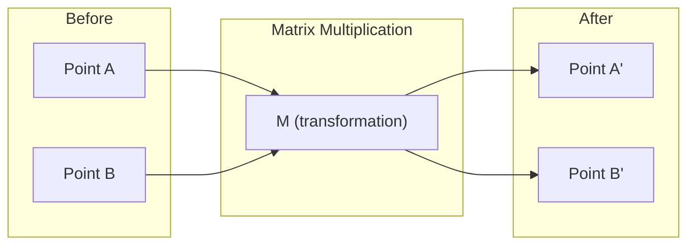
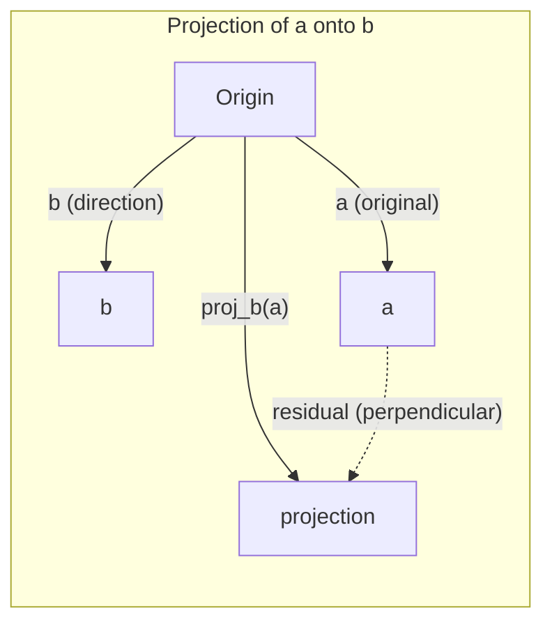

# Intuición de álgebra lineal

> Cada modelo de IA es sólo matemáticas de matriz con un sombrero elegante.

**Type:** Learn
**Languages:** Python, Julia
**Prerequisites:** Phase 0
**Time:** ~60 minutes

## Objetivos de aprendizaje

- Implementar operaciones de vectores y matrices (addición, producto de puntos, multiplicación de matrices) desde cero en Python
- Explicar geométricamente lo que hacen el producto de puntos, la proyección y el proceso de Gram-Schmidt
- Determine la independencia lineal, la clasificación y la base de un conjunto de vectores utilizando la reducción de filas
- Conectar conceptos de álgebra lineal a sus aplicaciones de IA: embebedidos, puntuaciones de atención y LoRA

## El problema

Abre cualquier documento de ML. En la primera página, verás vectores, matrices, productos de puntos y transformaciones. Sin la intuición de álgebra lineal, estos son solo símbolos. Con él, puedes ver lo que una red neuronal está haciendo realmente - moviendo puntos en el espacio.

No necesitas ser matemático, tienes que ver lo que estas operaciones significan geométricamente, y luego codificarlas tú mismo.

## El concepto

### Los vectores son puntos (y direcciones)

Un vector es sólo una lista de números. Pero esos números significan algo - son coordenadas en el espacio.

**2D vector [3, 2]:**

| x | y | Point |
|---|---|-------|
| 3 | 2 | The vector points from origin (0,0) to (3, 2) on the plane |

El vector tiene magnitud cuadrados ((3^2 + 2^2) = cuadrados ((13) y apunta hacia arriba y a la derecha.

En IA, los vectores representan todo:
- Una palabra → un vector de 768 números (su "significado" en el espacio de incorporación)
- Una imagen → un vector de millones de valores de píxeles
- Un usuario → un vector de preferencias

### Las matrices son transformaciones

Una matriz transforma un vector en otro. Puede girar, escalar, estirar o proyectar.



En IA, las matrices son el modelo:
- Pesos de la red neuronal → matrices que transforman la entrada en salida
- Las puntuaciones de atención → matrices que deciden en qué enfocarse
- Embedings → matrices que trazan palabras a vectores

### Similaridad de las medidas del producto

El producto de puntos de dos vectores le dice lo similares que son.

```
a · b = a₁×b₁ + a₂×b₂ + ... + aₙ×bₙ

Same direction:      a · b > 0  (similar)
Perpendicular:       a · b = 0  (unrelated)
Opposite direction:  a · b < 0  (dissimilar)
```

Así es literalmente como funcionan los motores de búsqueda, los sistemas de recomendación y RAG: encontrar vectores con productos de puntos altos.

### Independencia lineal

Los vectores son linealmente independientes si ningún vector en el conjunto puede ser escrito como una combinación de los otros. Si v1, v2, v3 son independientes, abarcan un espacio 3D. Si uno es una combinación de los otros, sólo abarcan un plano.

Por qué es importante para la IA: su matriz de características debe tener columnas linealmente independientes. Si dos características están perfectamente correlacionadas (dependientes linealmente), el modelo no puede distinguir sus efectos. Esto causa multicolinariedad en regresión - la matriz de peso se vuelve inestable, y pequeños cambios de entrada producen cambios salvajes de salida.

**Concrete example:**

```
v1 = [1, 0, 0]
v2 = [0, 1, 0]
v3 = [2, 1, 0]   # v3 = 2*v1 + v2
```

v1 y v2 son independientes, ni es un múltiplo escalar ni una combinación de los otros. Pero v3 = 2*v1 + v2, así que {v1, v2, v3} es un conjunto dependiente. Estos tres vectores están todos en el plano xy. No importa cómo los combines, no puedes alcanzar [0, 0, 1]. Tienes tres vectores pero sólo dos dimensiones de libertad.

En un conjunto de datos: si feature_3 = 2*feature_1 + feature_2, añadir feature_3 da al modelo cero información nueva. Peor aún, hace que las ecuaciones normales sean singulares - no hay una solución única para los pesos.

### Base y rango

Una base es un conjunto mínimo de vectores linealmente independientes que abarcan todo el espacio.

La base estándar para el espacio 3D es {[1,0,0], [0,1,0], [0,0,1]}. Pero cualquier tres vectores independientes en 3D forman una base válida.

Rango de una matriz = número de columnas linealmente independientes = número de filas linealmente independientes. Si el rango < min(ramas, collas), la matriz es deficiente en rango. Esto significa:
- El sistema tiene infinitas soluciones (o ninguna)
- La información se pierde en la transformación
- La matriz no puede ser invertida

| Situation | Rank | What it means for ML |
|-----------|------|---------------------|
| Full rank (rank = min(m, n)) | Maximum possible | Unique least-squares solution exists. Model is well-conditioned. |
| Rank deficient (rank < min(m, n)) | Below maximum | Features are redundant. Infinitely many weight solutions. Regularization needed. |
| Rank 1 | 1 | Every column is a scaled copy of one vector. All data lies on a line. |
| Near rank-deficient (small singular values) | Numerically low | Matrix is ill-conditioned. Tiny input noise causes large output changes. Use SVD truncation or ridge regression. |

### Proyección

Vektor de proyección **a**en el vector **b**da el componente de **a**en la dirección de **b**¿Qué es esto ?

```
proj_b(a) = (a dot b / b dot b) * b
```

El residual (a - proj_b(a)) es perpendicular a b. Esta descomposición ortogonal es la base de la instalación de cuadrados mínimos.

La proyección está en todas partes en ML:
- Regresión lineal minimiza la distancia de las observaciones al espacio columnar - la solución es una proyección
- PCA proyecta datos en las direcciones de la varianza máxima
- La atención en transformadores calcula las proyecciones de las consultas en las teclas



**Example:**a = [3, 4], b = [1, 0]

Proj_b(a) = (3*1 + 4*0) / (1*1 + 0*0) * [1, 0] = 3 * [1, 0] = [3, 0]

La proyección deja caer el componente y. Esto es la reducción de dimensiones en su forma más simple - tirar las direcciones que no te importan.

### Proceso de Gram-Schmidt

Convertir cualquier conjunto de vectores independientes en una base ortónorma.

El algoritmo:
1. Tomar el primer vector, normalizarlo
2. Tomar el segundo vector, restar su proyección en el primero, normalizar
3. Tomar el tercer vector, restar sus proyecciones en todos los vectores anteriores, normalizar
4. Repite para los vectores restantes

```
Input:  v1, v2, v3, ... (linearly independent)

u1 = v1 / |v1|

w2 = v2 - (v2 dot u1) * u1
u2 = w2 / |w2|

w3 = v3 - (v3 dot u1) * u1 - (v3 dot u2) * u2
u3 = w3 / |w3|

Output: u1, u2, u3, ... (orthonormal basis)
```

Así es como funciona la descomposición QR internamente. Q es la base ortónormal, R capta los coeficientes de proyección.
- Solución de sistemas lineales (más estables que la eliminación gaussiana)
- Calculación de valores propios (algoritmo de RQ)
- Regresión de cuadrados mínimos (método numérico estándar)

```figure
eigen-directions
```

## Construye el mismo

### Paso 1: VECTORES desde cero (Python)

```python
class Vector:
    def __init__(self, components):
        self.components = list(components)
        self.dim = len(self.components)

    def __add__(self, other):
        return Vector([a + b for a, b in zip(self.components, other.components)])

    def __sub__(self, other):
        return Vector([a - b for a, b in zip(self.components, other.components)])

    def dot(self, other):
        return sum(a * b for a, b in zip(self.components, other.components))

    def magnitude(self):
        return sum(x**2 for x in self.components) ** 0.5

    def normalize(self):
        mag = self.magnitude()
        return Vector([x / mag for x in self.components])

    def cosine_similarity(self, other):
        return self.dot(other) / (self.magnitude() * other.magnitude())

    def __repr__(self):
        return f"Vector({self.components})"


a = Vector([1, 2, 3])
b = Vector([4, 5, 6])

print(f"a + b = {a + b}")
print(f"a · b = {a.dot(b)}")
print(f"|a| = {a.magnitude():.4f}")
print(f"cosine similarity = {a.cosine_similarity(b):.4f}")
```

### Paso 2: Matrices desde cero (Python)

```python
class Matrix:
    def __init__(self, rows):
        self.rows = [list(row) for row in rows]
        self.shape = (len(self.rows), len(self.rows[0]))

    def __matmul__(self, other):
        if isinstance(other, Vector):
            return Vector([
                sum(self.rows[i][j] * other.components[j] for j in range(self.shape[1]))
                for i in range(self.shape[0])
            ])
        rows = []
        for i in range(self.shape[0]):
            row = []
            for j in range(other.shape[1]):
                row.append(sum(
                    self.rows[i][k] * other.rows[k][j]
                    for k in range(self.shape[1])
                ))
            rows.append(row)
        return Matrix(rows)

    def transpose(self):
        return Matrix([
            [self.rows[j][i] for j in range(self.shape[0])]
            for i in range(self.shape[1])
        ])

    def __repr__(self):
        return f"Matrix({self.rows})"


rotation_90 = Matrix([[0, -1], [1, 0]])
point = Vector([3, 1])

rotated = rotation_90 @ point
print(f"Original: {point}")
print(f"Rotated 90°: {rotated}")
```

### Paso 3: Por qué esto importa para la IA

```python
import random

random.seed(42)
weights = Matrix([[random.gauss(0, 0.1) for _ in range(3)] for _ in range(2)])
input_vector = Vector([1.0, 0.5, -0.3])

output = weights @ input_vector
print(f"Input (3D): {input_vector}")
print(f"Output (2D): {output}")
print("This is what a neural network layer does -- matrix multiplication.")
```

### Paso 4: versión de Julia

```julia
a = [1.0, 2.0, 3.0]
b = [4.0, 5.0, 6.0]

println("a + b = ", a + b)
println("a · b = ", a ⋅ b)       # Julia supports unicode operators
println("|a| = ", √(a ⋅ a))
println("cosine = ", (a ⋅ b) / (√(a ⋅ a) * √(b ⋅ b)))

# Matrix-vector multiplication
W = [0.1 -0.2 0.3; 0.4 0.5 -0.1]
x = [1.0, 0.5, -0.3]
println("Wx = ", W * x)
println("This is a neural network layer.")
```

### Paso 5: Independencia lineal y proyección desde cero (Python)

```python
def is_linearly_independent(vectors):
    n = len(vectors)
    dim = len(vectors[0].components)
    mat = Matrix([v.components[:] for v in vectors])
    rows = [row[:] for row in mat.rows]
    rank = 0
    for col in range(dim):
        pivot = None
        for row in range(rank, len(rows)):
            if abs(rows[row][col]) > 1e-10:
                pivot = row
                break
        if pivot is None:
            continue
        rows[rank], rows[pivot] = rows[pivot], rows[rank]
        scale = rows[rank][col]
        rows[rank] = [x / scale for x in rows[rank]]
        for row in range(len(rows)):
            if row != rank and abs(rows[row][col]) > 1e-10:
                factor = rows[row][col]
                rows[row] = [rows[row][j] - factor * rows[rank][j] for j in range(dim)]
        rank += 1
    return rank == n


def project(a, b):
    scalar = a.dot(b) / b.dot(b)
    return Vector([scalar * x for x in b.components])


def gram_schmidt(vectors):
    orthonormal = []
    for v in vectors:
        w = v
        for u in orthonormal:
            proj = project(w, u)
            w = w - proj
        if w.magnitude() < 1e-10:
            continue
        orthonormal.append(w.normalize())
    return orthonormal


v1 = Vector([1, 0, 0])
v2 = Vector([1, 1, 0])
v3 = Vector([1, 1, 1])
basis = gram_schmidt([v1, v2, v3])
for i, u in enumerate(basis):
    print(f"u{i+1} = {u}")
    print(f"  |u{i+1}| = {u.magnitude():.6f}")

print(f"u1 · u2 = {basis[0].dot(basis[1]):.6f}")
print(f"u1 · u3 = {basis[0].dot(basis[2]):.6f}")
print(f"u2 · u3 = {basis[1].dot(basis[2]):.6f}")
```

## Usalo

Ahora lo mismo con NumPy -- lo que realmente usará en la práctica:

```python
import numpy as np

a = np.array([1, 2, 3], dtype=float)
b = np.array([4, 5, 6], dtype=float)

print(f"a + b = {a + b}")
print(f"a · b = {np.dot(a, b)}")
print(f"|a| = {np.linalg.norm(a):.4f}")
print(f"cosine = {np.dot(a, b) / (np.linalg.norm(a) * np.linalg.norm(b)):.4f}")

W = np.random.randn(2, 3) * 0.1
x = np.array([1.0, 0.5, -0.3])
print(f"Wx = {W @ x}")
```

### Rango, proyección y QR con NumPy

```python
import numpy as np

A = np.array([[1, 2], [2, 4]])
print(f"Rank: {np.linalg.matrix_rank(A)}")

a = np.array([3, 4])
b = np.array([1, 0])
proj = (np.dot(a, b) / np.dot(b, b)) * b
print(f"Projection of {a} onto {b}: {proj}")

Q, R = np.linalg.qr(np.random.randn(3, 3))
print(f"Q is orthogonal: {np.allclose(Q @ Q.T, np.eye(3))}")
print(f"R is upper triangular: {np.allclose(R, np.triu(R))}")
```

### PyTorch - Tensores son vectores con Autodiff

```python
import torch

x = torch.randn(3, requires_grad=True)
y = torch.tensor([1.0, 0.0, 0.0])

similarity = torch.dot(x, y)
similarity.backward()

print(f"x = {x.data}")
print(f"y = {y.data}")
print(f"dot product = {similarity.item():.4f}")
print(f"d(dot)/dx = {x.grad}")
```

El gradiente del producto de puntos con respecto a x es sólo y PyTorch calcula esto automáticamente. Cada operación en una red neuronal se construye de operaciones como esta - multiplicadores de matriz, productos de puntos, proyecciones - y auto-difiguración de las vías de gradientes a través de todos ellos.

Acabas de construir desde cero lo que NumPy hace en una línea.

## Envío

Esta lección produce:
- `outputs/prompt-linear-algebra-tutor.md`-- un aviso para que los asistentes de IA enseñen álgebra lineal a través de la intuición geométrica

## Las conexiones

Todo en esta lección se conecta con partes específicas de la IA moderna:

| Concept | Where it shows up |
|---------|------------------|
| Dot product | Attention scores in transformers, cosine similarity in RAG |
| Matrix multiply | Every neural network layer, every linear transformation |
| Linear independence | Feature selection, avoiding multicollinearity |
| Rank | Determining if a system is solvable, LoRA (low-rank adaptation) |
| Projection | Linear regression (projecting onto column space), PCA |
| Gram-Schmidt / QR | Numerical solvers, eigenvalue computation |
| Orthonormal basis | Stable numerical computation, whitening transforms |

LoRA merece una mención especial. Al ajustar los modelos de lenguaje grandes descomponendo las actualizaciones de peso en matrices de bajo rango. En lugar de actualizar una matriz de peso 4096x4096 (16M parámetros), LoRA actualiza dos matrices de tamaño 4096x16 y 16x4096 (131K parámetros). La restricción de rango 16 significa que LoRA asume que la actualización de peso se encuentra en un subespacio 16 dimensiones del espacio completo de 4096 dimensiones. Eso es álgebra lineal haciendo trabajo real.

## Los ejercicios

1. Implementación `Vector.angle_between(other)`que devuelve el ángulo en grados entre dos vectores
2. Crear una matriz de escala 2D que dobla la coordenada x y triplica la coordenada y, luego aplicar a la vector [1, 1]
3. Dados 5 vectores aleatorios similares a palabras (dimensión 50), encuentre los dos más similares usando la similitud cosina
4. Verifique si la salida de Gram-Schmidt es realmente ortónormal: compruebe que cada par tiene producto de punto 0 y cada vector tiene magnitud 1
5. Crear una matriz 3x3 con rango 2. Verificar usando el `rank()`Luego explica qué objeto geométrico las columnas abarcan.
6. Proyectad el vector [1, 2, 3] hacia [1, 1, 1]. ¿Qué representa el resultado geométricamente?

## Términos clave

| Term | What people say | What it actually means |
|------|----------------|----------------------|
| Vector | "An arrow" | A list of numbers representing a point or direction in n-dimensional space |
| Matrix | "A table of numbers" | A transformation that maps vectors from one space to another |
| Dot product | "Multiply and sum" | A measure of how aligned two vectors are -- the core of similarity search |
| Embedding | "Some AI magic" | A vector that represents the meaning of something (word, image, user) |
| Linear independence | "They don't overlap" | No vector in the set can be written as a combination of the others |
| Rank | "How many dimensions" | The number of linearly independent columns (or rows) in a matrix |
| Projection | "The shadow" | The component of one vector in the direction of another |
| Basis | "The coordinate axes" | A minimal set of independent vectors that span the space |
| Orthonormal | "Perpendicular unit vectors" | Vectors that are mutually perpendicular and each have length 1 |
