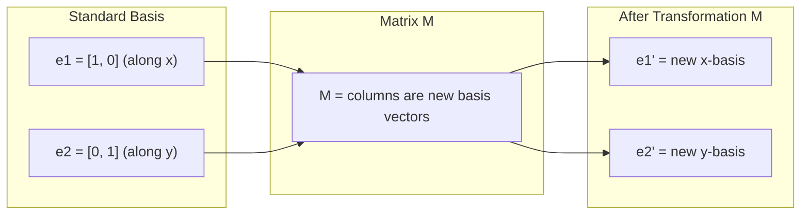
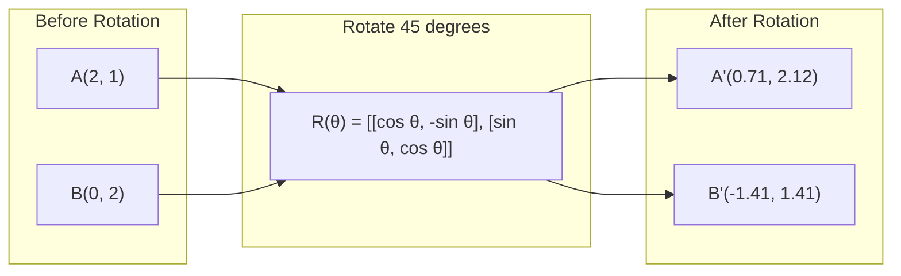
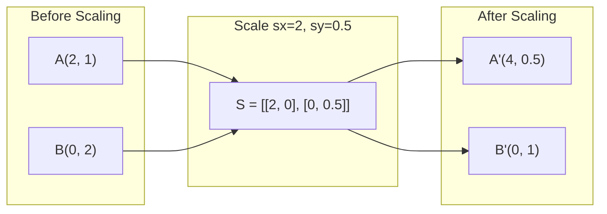
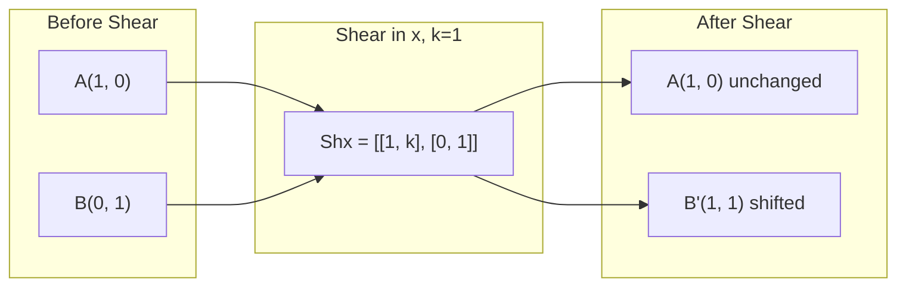
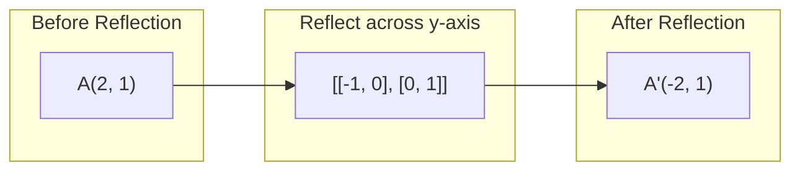
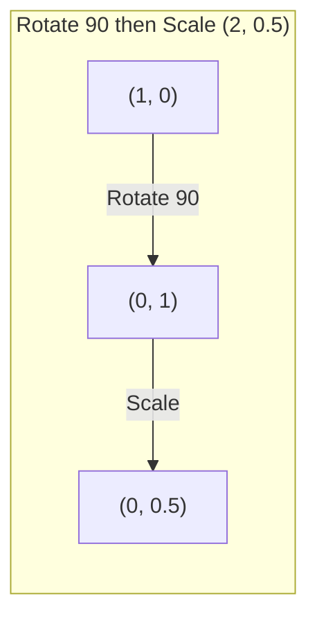
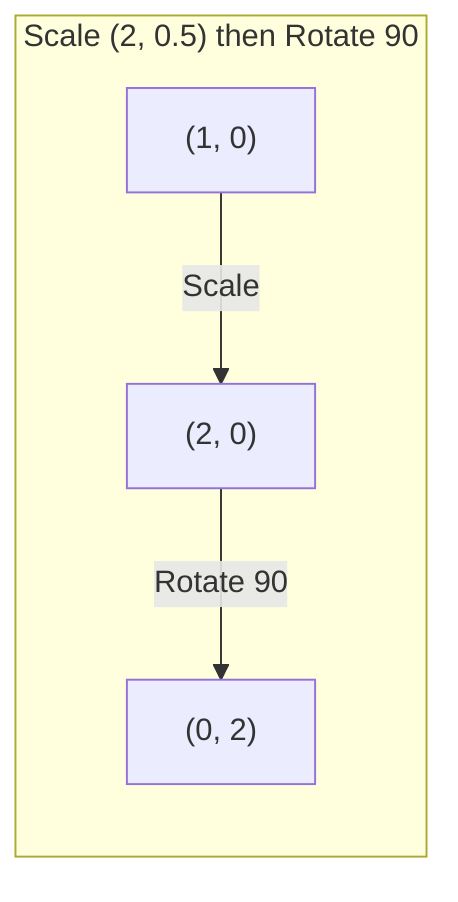

# Transformaciones de matriz

> Una matriz es una máquina que remodela el espacio. Aprenda lo que hace a cada punto, y usted entiende toda la transformación.

**Type:** Build
**Languages:** Python, Julia
**Prerequisites:** Phase 1, Lessons 01-02 (Linear Algebra Intuition, Vectors & Matrices Operations)
**Time:** ~75 minutes

## Objetivos de aprendizaje

- Construir matrices de rotación, escala, corte y reflexión y aplicarlas a puntos 2D y 3D
- Compone múltiples transformaciones por multiplicación de matriz y verifique que el orden importa
- Computa valores propios y vectores propios de matrices 2x2 a partir de la ecuación característica
- Explicar por qué los valores propios determinan las direcciones de PCA, la estabilidad de RNN y el comportamiento de agrupamiento espectral

## El problema

Se lee sobre PCA y se ve "encuentra los propios vectores de la matriz de covarianza". Se lee sobre la estabilidad del modelo y se lee "verifique si todos los valores propios tienen magnitud menor a 1." Se lee sobre el aumento de datos y se ve "aplicar una rotación aleatoria". Nada de esto tiene sentido hasta que se entienda lo que las matrices hacen al espacio geométricamente.

Las matrices no son sólo redes de números. Son máquinas espaciales. Una matriz de rotación gira puntos. Una matriz de escalación las estira. Una matriz de corte las inclina. Cada transformación que una red neuronal aplica a los datos es una de estas operaciones o una composición de ellas. Esta lección hace que esas operaciones sean concretas.

## El concepto

### Transformaciones como matrices

Cada transformación lineal en 2D puede ser escrita como una matriz 2x2. La matriz le dice exactamente dónde terminan los vectores base [1, 0] y [0, 1]. Todo lo demás sigue.



### Rotación

Una rotación 2D por ángulo theta mantiene intactos las distancias y los ángulos.



En 3D, giras alrededor de un eje. Cada eje tiene su propia matriz de rotación:

```
Rz(theta) = | cos  -sin  0 |     Rotate around z-axis
            | sin   cos  0 |     (x-y plane spins, z stays)
            |  0     0   1 |

Rx(theta) = | 1   0     0    |   Rotate around x-axis
            | 0  cos  -sin   |   (y-z plane spins, x stays)
            | 0  sin   cos   |

Ry(theta) = |  cos  0  sin |     Rotate around y-axis
            |   0   1   0  |     (x-z plane spins, y stays)
            | -sin  0  cos |
```

### Escalado

El estiramiento de escala se extiende o se comprime a lo largo de cada eje de forma independiente.



### El corte de piezas

El corte inclina un eje mientras mantiene fijo el otro.



Matrices de corte:
- `Shx = [[1, k], [0, 1]]`cambios x por k * y
- `Shy = [[1, 0], [k, 1]]`cambios y por k * x

### Reflexión

El reflejo refleja puntos a través de un eje o una línea.



Matrices de reflexión:
- Reflexión a través del eje y: `[[-1, 0], [0, 1]]`
- Reflejo a través del eje x: `[[1, 0], [0, -1]]`

### Compuesto: transformaciones de cadenas

Aplicar la transformación A y luego B es lo mismo que multiplicar sus matrices: `result = B @ A @ point`La orden es importante. girar luego la escala da resultados diferentes a la escala luego girar.



Compuesto por: `S @ R = [[0, -2], [0.5, 0]]`



Compuesto por: `R @ S = [[0, -0.5], [2, 0]]`

Diferentes resultados. La multiplicación de matrices no es commutativa.

### Valores propios y vectores propios

La mayoría de los vectores cambian de dirección cuando una matriz los alcanza. Los vectores propios son especiales: la matriz solo los escala, nunca los gira. El factor de escala es el valor propio.

```
A @ v = lambda * v

v is the eigenvector (direction that survives)
lambda is the eigenvalue (how much it stretches)

Example: A = | 2  1 |
             | 1  2 |

Eigenvector [1, 1] with eigenvalue 3:
  A @ [1,1] = [3, 3] = 3 * [1, 1]     (same direction, scaled by 3)

Eigenvector [1, -1] with eigenvalue 1:
  A @ [1,-1] = [1, -1] = 1 * [1, -1]  (same direction, unchanged)
```

La matriz se extiende el espacio por 3x a lo largo de [1, 1] y mantiene [1, -1] sin cambios.

### Composición propia

Si una matriz tiene n vectores propios linealmente independientes, se puede descomponer:

```
A = V @ D @ V^(-1)

V = matrix whose columns are eigenvectors
D = diagonal matrix of eigenvalues
V^(-1) = inverse of V

This says: rotate into eigenvector coordinates, scale along each axis, rotate back.
```

### Por qué importan los valores propios

**PCA.**Los vectores propios de la matriz de covarianza son los componentes principales. Los valores propios le dicen cuánto variación capta cada componente.

**Stability.**En redes y sistemas dinámicos recurrentes, los valores propios con magnitud > 1 causan que las salidas exploten.

**Spectral methods.**Las redes neuronales de gráficos utilizan valores propios de la matriz adyacente.

### Determinante como factor de escala de volumen

El determinante de una matriz de transformación le dice cuánto escala el área (2D) o volumen (3D).

```
det = 1:   area preserved (rotation)
det = 2:   area doubled
det = 0:   space crushed to lower dimension (singular)
det = -1:  area preserved but orientation flipped (reflection)

| det(Rotation) | = 1        (always)
| det(Scale sx, sy) | = sx * sy
| det(Shear) | = 1           (area preserved)
| det(Reflection) | = -1     (orientation flipped)
```

```figure
matrix-transform
```

## Construye el mismo

### Paso 1: Matrices de transformación desde cero (Python)

```python
import math

def rotation_2d(theta):
    c, s = math.cos(theta), math.sin(theta)
    return [[c, -s], [s, c]]

def scaling_2d(sx, sy):
    return [[sx, 0], [0, sy]]

def shearing_2d(kx, ky):
    return [[1, kx], [ky, 1]]

def reflection_x():
    return [[1, 0], [0, -1]]

def reflection_y():
    return [[-1, 0], [0, 1]]

def mat_vec_mul(matrix, vector):
    return [
        sum(matrix[i][j] * vector[j] for j in range(len(vector)))
        for i in range(len(matrix))
    ]

def mat_mul(a, b):
    rows_a, cols_b = len(a), len(b[0])
    cols_a = len(a[0])
    return [
        [sum(a[i][k] * b[k][j] for k in range(cols_a)) for j in range(cols_b)]
        for i in range(rows_a)
    ]

point = [1.0, 0.0]
angle = math.pi / 4

rotated = mat_vec_mul(rotation_2d(angle), point)
print(f"Rotate (1,0) by 45 deg: ({rotated[0]:.4f}, {rotated[1]:.4f})")

scaled = mat_vec_mul(scaling_2d(2, 3), [1.0, 1.0])
print(f"Scale (1,1) by (2,3): ({scaled[0]:.1f}, {scaled[1]:.1f})")

sheared = mat_vec_mul(shearing_2d(1, 0), [1.0, 1.0])
print(f"Shear (1,1) kx=1: ({sheared[0]:.1f}, {sheared[1]:.1f})")

reflected = mat_vec_mul(reflection_y(), [2.0, 1.0])
print(f"Reflect (2,1) across y: ({reflected[0]:.1f}, {reflected[1]:.1f})")
```

### Paso 2: Composición de las transformaciones

```python
R = rotation_2d(math.pi / 2)
S = scaling_2d(2, 0.5)

rotate_then_scale = mat_mul(S, R)
scale_then_rotate = mat_mul(R, S)

point = [1.0, 0.0]
result1 = mat_vec_mul(rotate_then_scale, point)
result2 = mat_vec_mul(scale_then_rotate, point)

print(f"Rotate 90 then scale: ({result1[0]:.2f}, {result1[1]:.2f})")
print(f"Scale then rotate 90: ({result2[0]:.2f}, {result2[1]:.2f})")
print(f"Same? {result1 == result2}")
```

### Paso 3: Valores propios desde cero (2x2)

Para una matriz 2x2 `[[a, b], [c, d]]`, los valores propios resuelven la ecuación característica: `lambda^2 - (a+d)*lambda + (ad - bc) = 0`¿ Qué ?

```python
def eigenvalues_2x2(matrix):
    a, b = matrix[0]
    c, d = matrix[1]
    trace = a + d
    det = a * d - b * c
    discriminant = trace ** 2 - 4 * det
    if discriminant < 0:
        real = trace / 2
        imag = (-discriminant) ** 0.5 / 2
        return (complex(real, imag), complex(real, -imag))
    sqrt_disc = discriminant ** 0.5
    return ((trace + sqrt_disc) / 2, (trace - sqrt_disc) / 2)

def eigenvector_2x2(matrix, eigenvalue):
    a, b = matrix[0]
    c, d = matrix[1]
    if abs(b) > 1e-10:
        v = [b, eigenvalue - a]
    elif abs(c) > 1e-10:
        v = [eigenvalue - d, c]
    else:
        if abs(a - eigenvalue) < 1e-10:
            v = [1, 0]
        else:
            v = [0, 1]
    mag = (v[0] ** 2 + v[1] ** 2) ** 0.5
    return [v[0] / mag, v[1] / mag]

A = [[2, 1], [1, 2]]
vals = eigenvalues_2x2(A)
print(f"Matrix: {A}")
print(f"Eigenvalues: {vals[0]:.4f}, {vals[1]:.4f}")

for val in vals:
    vec = eigenvector_2x2(A, val)
    result = mat_vec_mul(A, vec)
    scaled = [val * vec[0], val * vec[1]]
    print(f"  lambda={val:.1f}, v={[round(x,4) for x in vec]}")
    print(f"    A@v = {[round(x,4) for x in result]}")
    print(f"    l*v = {[round(x,4) for x in scaled]}")
```

### Paso 4: Determinante como factor de escala de volumen

```python
def det_2x2(matrix):
    return matrix[0][0] * matrix[1][1] - matrix[0][1] * matrix[1][0]

print(f"det(rotation 45) = {det_2x2(rotation_2d(math.pi/4)):.4f}")
print(f"det(scale 2,3)   = {det_2x2(scaling_2d(2, 3)):.1f}")
print(f"det(shear kx=1)  = {det_2x2(shearing_2d(1, 0)):.1f}")
print(f"det(reflect y)   = {det_2x2(reflection_y()):.1f}")

singular = [[1, 2], [2, 4]]
print(f"det(singular)     = {det_2x2(singular):.1f}")
print("Singular: columns are proportional, space collapses to a line.")
```

## Usalo

NumPy maneja todo esto con rutinas optimizadas.

```python
import numpy as np

theta = np.pi / 4
R = np.array([[np.cos(theta), -np.sin(theta)],
              [np.sin(theta),  np.cos(theta)]])

point = np.array([1.0, 0.0])
print(f"Rotate (1,0) by 45 deg: {R @ point}")

S = np.diag([2.0, 3.0])
composed = S @ R
print(f"Scale(2,3) after Rotate(45): {composed @ point}")

A = np.array([[2, 1], [1, 2]], dtype=float)
eigenvalues, eigenvectors = np.linalg.eig(A)
print(f"\nEigenvalues: {eigenvalues}")
print(f"Eigenvectors (columns):\n{eigenvectors}")

for i in range(len(eigenvalues)):
    v = eigenvectors[:, i]
    lam = eigenvalues[i]
    print(f"  A @ v{i} = {A @ v}, lambda * v{i} = {lam * v}")

print(f"\ndet(R) = {np.linalg.det(R):.4f}")
print(f"det(S) = {np.linalg.det(S):.1f}")

B = np.array([[3, 1], [0, 2]], dtype=float)
vals, vecs = np.linalg.eig(B)
D = np.diag(vals)
V = vecs
reconstructed = V @ D @ np.linalg.inv(V)
print(f"\nEigendecomposition A = V @ D @ V^-1:")
print(f"Original:\n{B}")
print(f"Reconstructed:\n{reconstructed}")
```

### Rotación 3D con NumPy

```python
def rotation_3d_z(theta):
    c, s = np.cos(theta), np.sin(theta)
    return np.array([[c, -s, 0], [s, c, 0], [0, 0, 1]])

def rotation_3d_x(theta):
    c, s = np.cos(theta), np.sin(theta)
    return np.array([[1, 0, 0], [0, c, -s], [0, s, c]])

point_3d = np.array([1.0, 0.0, 0.0])
rotated_z = rotation_3d_z(np.pi / 2) @ point_3d
rotated_x = rotation_3d_x(np.pi / 2) @ point_3d

print(f"\n3D point: {point_3d}")
print(f"Rotate 90 around z: {np.round(rotated_z, 4)}")
print(f"Rotate 90 around x: {np.round(rotated_x, 4)}")
```

## Envío

Esta lección construye las bases geométricas para el análisis de peso de PCA (fase 2) y la red neuronal. El código de valor propio/eigenvector construido aquí es el mismo algoritmo que impulsa la reducción de dimensionalidad, el agrupamiento espectral y el análisis de estabilidad en los sistemas ML de producción.

## Los ejercicios

1. Aplique la rotación, la escala y el corte a un cuadrado unitario (corneras en [0,0], [1,0], [1,1], [0,1]). Imprima las esquinas transformadas para cada una. Verifique que la rotación preserva las distancias entre las esquinas.

2. Encuentra los valores propios de la matriz [[4, 2], [1, 3]] a mano utilizando la ecuación característica. Luego verifica con tu función desde cero y con NumPy.

3. Crea una composición de tres transformaciones (rota 30 grados, escala por [1,5, 0,8], corte con kx=0,3) y apliquela a 8 puntos dispuestos en un círculo. Imprima antes y después de las coordenadas. Computa el determinante de la matriz compuesta y verifica que es igual al producto de los determinantes individuales.

## Términos clave

| Term | What people say | What it actually means |
|------|----------------|----------------------|
| Rotation matrix | "Spins things" | An orthogonal matrix that moves points along circular arcs while preserving distances and angles. Determinant is always 1. |
| Scaling matrix | "Makes things bigger" | A diagonal matrix that stretches or compresses independently along each axis. Determinant is the product of scale factors. |
| Shearing matrix | "Slants things" | A matrix that shifts one coordinate proportionally to another, turning rectangles into parallelograms. Determinant is 1. |
| Reflection | "Mirrors things" | A matrix that flips space across an axis or plane. Determinant is -1. |
| Composition | "Do two things" | Multiplying transformation matrices to chain operations. Order matters: B @ A means apply A first, then B. |
| Eigenvector | "Special direction" | A direction that the matrix only scales, never rotates. The transformation's fingerprint. |
| Eigenvalue | "How much it stretches" | The scalar factor by which the matrix scales its eigenvector. Can be negative (flip) or complex (rotation). |
| Eigendecomposition | "Break the matrix apart" | Writing a matrix as V @ D @ V^(-1), separating it into its fundamental scaling directions and magnitudes. |
| Determinant | "A single number from a matrix" | The factor by which the transformation scales area (2D) or volume (3D). Zero means the transformation is irreversible. |
| Characteristic equation | "Where eigenvalues come from" | det(A - lambda * I) = 0. The polynomial whose roots are the eigenvalues. |

## Leer más

- [3Blue1Brown: Linear Transformations](https://www.3blue1brown.com/lessons/linear-transformations)-- intuición visual para cómo las matrices remodelar el espacio
- [3Blue1Brown: Eigenvectors and Eigenvalues](https://www.3blue1brown.com/lessons/eigenvalues)-- la mejor explicación visual de lo que los propios vectores significan geométricamente
- [MIT 18.06 Lecture 21: Eigenvalues and Eigenvectors](https://ocw.mit.edu/courses/18-06-linear-algebra-spring-2010/)- El tratamiento clásico de Gilbert Strang
