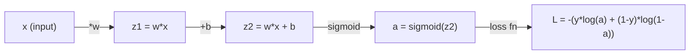
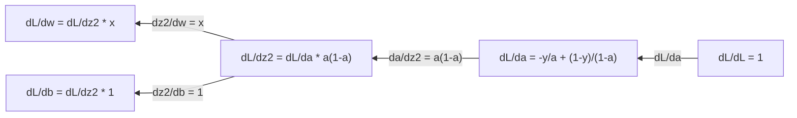
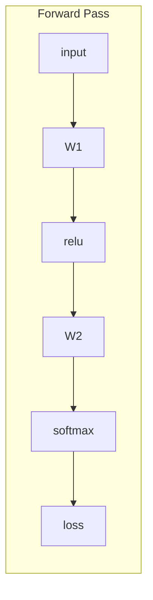
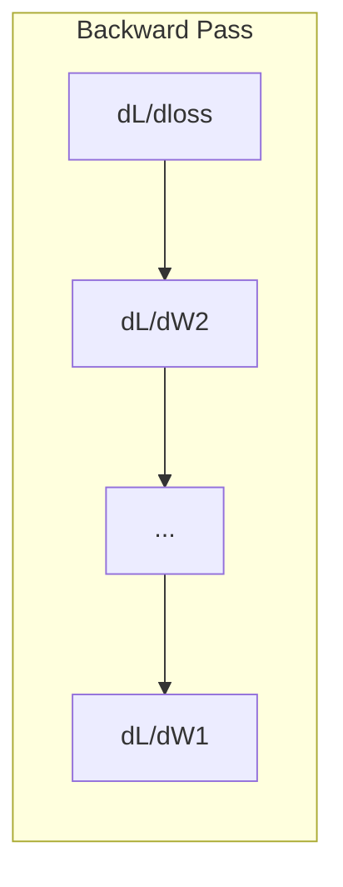

# Calculo para el aprendizaje automático

> Los derivados te dicen hacia abajo, eso es todo lo que una red neuronal necesita aprender.

**Type:** Learn
**Language:**Python
**Prerequisites:** Phase 1, Lessons 01-03
**Time:** ~60 minutes

## Objetivos de aprendizaje

- Computación de derivados numéricos y analíticos para las funciones ML comunes (x^2, sigmoide, entropía cruzada)
- Implementar la descenso de gradiente desde cero para minimizar una función de pérdida en 1D y 2D
- Derivar el gradiente de un modelo de regresión lineal y entrenarlo mediante actualizaciones manuales de peso
- Explicar la matriz hessiana, las aproximaciones de la serie Taylor y su conexión con los métodos de optimización

## El problema

Tienes una red neuronal con millones de pesos, cada peso es un botón, tienes que averiguar en qué dirección girar cada botón para que el modelo sea un poco menos equivocado.

Sin cálculo, entrenar una red neuronal significaría probar cambios aleatorios y esperar lo mejor. con derivados, sabes exactamente cómo cada peso afecta el error.

## El concepto

### ¿Qué es una derivada?

Una derivada mide la velocidad de cambio. para una función y = f(x), la derivada f'(x) le dice: si empujas x por una cantidad pequeña, ¿cuánto cambia y?

Geométricamente, la derivada es la pendiente de la línea tangente en un punto.

**f(x) = x^2:**

| x | f(x) | f'(x) (slope) |
|---|------|---------------|
| 0 | 0    | 0 (flat, at the bottom) |
| 1 | 1    | 2 |
| 2 | 4    | 4 (tangent line slope at this point) |
| 3 | 9    | 6 |

Cuando x es igual a 2, la pendiente es 4. Si se mueve x un poco a la derecha, y aumenta aproximadamente 4 veces esa cantidad.

La definición formal:

```
f'(x) = lim   f(x + h) - f(x)
        h->0  -----------------
                     h
```

En el código, saltamos el límite y sólo usamos una h muy pequeña. Esa es la derivada numérica.

### Derivados parciales: una variable a la vez

Las funciones reales tienen muchas entradas. Una pérdida de red neuronal depende de miles de pesas. Una derivada parcial mantiene constantes todas las variables excepto una, luego toma la derivada con respecto a esa.

```
f(x, y) = x^2 + 3xy + y^2

df/dx = 2x + 3y     (treat y as a constant)
df/dy = 3x + 2y     (treat x as a constant)
```

Cada derivada parcial responde: si empujo sólo este peso, ¿cómo cambia la pérdida?

### El gradiente: vector de todas las derivadas parciales

El gradiente reúne todas las derivadas parciales en un vector. Para una función f ((x, y, z), el gradiente es:

```
grad f = [ df/dx, df/dy, df/dz ]
```

El gradiente apunta en la dirección de la ascensión más empinada.

**Contour plot of f(x,y) = x^2 + y^2:**

La función forma una forma de cuenco con círculos concéntricos como líneas de contorno.

| Point | grad f | -grad f (descent direction) |
|-------|--------|----------------------------|
| (1, 1) | [2, 2] (points uphill, away from minimum) | [-2, -2] (points downhill, toward minimum) |
| (0, 0) | [0, 0] (flat, at the minimum) | [0, 0] |

Esto es un descenso de gradiente en una imagen.

### La conexión con la optimización

Entrenando una red neuronal es optimización. Tienes una función de pérdida L ((w1, w2, ..., wn) que mide lo mal que está el modelo.

```
Gradient descent update rule:

  w_new = w_old - learning_rate * dL/dw

For every weight:
  1. Compute the partial derivative of loss with respect to that weight
  2. Subtract a small multiple of it from the weight
  3. Repeat
```

La velocidad de aprendizaje controla el tamaño del paso.

**Loss landscape (1D slice):**

La función de pérdida L ((w) forma una curva con picos y valles a medida que el peso w varía.

| Feature | Description |
|---------|-------------|
| Global minimum | The lowest point on the entire curve -- the best solution |
| Local minimum | A valley that is lower than its neighbors but not the lowest overall |
| Slope | Gradient descent follows the slope downhill from any starting point |

La descenso gradual sigue la pendiente hacia abajo. Puede quedar atrapado en mínimos locales, pero en espacios de alta dimensión (millones de pesos) esto rara vez es un problema práctico.

### Derivados numéricos frente a derivados analíticos

Hay dos formas de calcular una derivada.

Para f  x = x^2, la derivada es f  x = 2x. Exactamente. Rápido.

Numérico: aproximar usando la definición. Calcule f ((x+h) y f ((x-h) para una pequeña h, luego use la diferencia.

```
Numerical (central difference):

f'(x) ~= f(x + h) - f(x - h)
          -----------------------
                  2h

h = 0.0001 works well in practice
```

Las derivadas numéricas son más lentas pero funcionan para cualquier función. Las derivadas analíticas son rápidas pero requieren que se derive la fórmula.

### Derivados a mano para funciones simples

Estas son las derivadas que verás una y otra vez en ML.

```
Function        Derivative       Used in
--------        ----------       -------
f(x) = x^2     f'(x) = 2x      Loss functions (MSE)
f(x) = wx + b  f'(w) = x        Linear layer (gradient w.r.t. weight)
                f'(b) = 1        Linear layer (gradient w.r.t. bias)
                f'(x) = w        Linear layer (gradient w.r.t. input)
f(x) = e^x     f'(x) = e^x     Softmax, attention
f(x) = ln(x)   f'(x) = 1/x     Cross-entropy loss
f(x) = 1/(1+e^-x)  f'(x) = f(x)(1-f(x))   Sigmoid activation
```

Para f ((x) = x^2:

```
f(x) = x^2    f'(x) = 2x

  x    f(x)   f'(x)   meaning
  -2    4      -4      slope tilts left (decreasing)
  -1    1      -2      slope tilts left (decreasing)
   0    0       0      flat (minimum!)
   1    1       2      slope tilts right (increasing)
   2    4       4      slope tilts right (increasing)
```

Para f(w) = wx + b con x=3, b=1:

```
f(w) = 3w + 1    f'(w) = 3

The derivative with respect to w is just x.
If x is big, a small change in w causes a big change in output.
```

### La regla de la cadena

Cuando las funciones se componen, la regla de la cadena le dice cómo diferenciar.

```
If y = f(g(x)), then dy/dx = f'(g(x)) * g'(x)

Example: y = (3x + 1)^2
  outer: f(u) = u^2       f'(u) = 2u
  inner: g(x) = 3x + 1    g'(x) = 3
  dy/dx = 2(3x + 1) * 3 = 6(3x + 1)
```

Las redes neuronales son cadenas de funciones: entrada -> lineal -> activación -> lineal -> activación -> pérdida. La retropropagación es la regla de cadena aplicada repetidamente desde la salida a la entrada. Es el algoritmo entero.

### La Matriz Hesiana

El gradiente le dice la pendiente, el hessiano le dice la curvatura.

El hessiano es la matriz de derivadas parciales de segundo orden. Para una función f ((x1, x2, ..., xn), la entrada (i, j) del hessiano es:

```
H[i][j] = d^2f / (dx_i * dx_j)
```

Para una función de 2 variables f ((x, y):

```
H = | d^2f/dx^2    d^2f/dxdy |
    | d^2f/dydx    d^2f/dy^2 |
```

**What the Hessian tells you at a critical point (where gradient = 0):**

| Hessian property | Meaning | Example surface |
|-----------------|---------|-----------------|
| Positive definite (all eigenvalues > 0) | Local minimum | Bowl pointing up |
| Negative definite (all eigenvalues < 0) | Local maximum | Bowl pointing down |
| Indefinite (mixed eigenvalues) | Saddle point | Horse saddle shape |

**Example:**f(x, y) = x^2 - y^2 (función de silla)

```
df/dx = 2x       df/dy = -2y
d^2f/dx^2 = 2    d^2f/dy^2 = -2    d^2f/dxdy = 0

H = | 2   0 |
    | 0  -2 |

Eigenvalues: 2 and -2 (one positive, one negative)
--> Saddle point at (0, 0)
```

Compare con f ((x, y) = x^2 + y^2 (un tazón):

```
H = | 2  0 |
    | 0  2 |

Eigenvalues: 2 and 2 (both positive)
--> Local minimum at (0, 0)
```

**Why the Hessian matters in ML:**

El método de Newton utiliza el Hessian para tomar mejores pasos de optimización que el descenso de gradiente.

```
Newton's update:    w_new = w_old - H^(-1) * gradient
Gradient descent:   w_new = w_old - lr * gradient
```

El método de Newton converge más rápido porque el Hessian "rescales" el gradiente - direcciones empinadas consiguen pasos más pequeños, direcciones planas consiguen pasos más grandes.

El problema: para una red neuronal con N parámetros, el Hessian es N x N. Un modelo con 1 millón de parámetros necesitaría una matriz de 1 billón de entradas.

| Method | What it uses | Cost | Convergence |
|--------|-------------|------|-------------|
| Gradient descent | First derivatives only | O(N) per step | Slow (linear) |
| Newton's method | Full Hessian | O(N^3) per step | Fast (quadratic) |
| L-BFGS | Approximate Hessian from gradient history | O(N) per step | Medium (superlinear) |
| Adam | Per-parameter adaptive rates (diagonal Hessian approx) | O(N) per step | Medium |
| Natural gradient | Fisher information matrix (statistical Hessian) | O(N^2) per step | Fast |

En la práctica, Adam es el optimizador predeterminado para el aprendizaje profundo. Aproxima información de segundo orden a bajo costo mediante el seguimiento de la media corriente y la variación de gradientes por parámetro.

### Aproximación de la serie Taylor

Cualquier función lisa puede ser aproximada localmente por un polinomio:

```
f(x + h) = f(x) + f'(x)*h + (1/2)*f''(x)*h^2 + (1/6)*f'''(x)*h^3 + ...
```

Cuanto más términos incluya, mejor la aproximación, pero sólo cerca del punto x.

**Why Taylor series matter for ML:**

- **First-order Taylor = gradient descent.**Cuando se usa f(x + h) ~ f(x) + f'(x) *h, se está haciendo una aproximación lineal.

- **Second-order Taylor = Newton's method.**Usando f(x + h) ~ f(x) + f'(x) *h + (1/2) *f'(x) *h^2, obtienes un modelo cuadrático. Minimizándolo se da h = -f'(x) / f'(x) --el paso de Newton.

- **Loss function design.**El MSE y la entropía cruzada son suaves, lo que significa que sus expansiones Taylor están bien conducidas. Esto no es un accidente.

```
Approximation order    What it captures    Optimization method
-------------------    -----------------   -------------------
0th order (constant)   Just the value      Random search
1st order (linear)     Slope               Gradient descent
2nd order (quadratic)  Curvature           Newton's method
Higher orders          Finer structure     Rarely used in ML
```

La idea clave: toda optimización basada en gradientes es realmente acerca de aproximar la función de pérdida localmente y avanzar al mínimo de esa aproximación.

### Integral en ML

Las derivadas le dicen las tasas de cambio. Los integrales calculan acumulaciones - área bajo una curva.

En ML, rara vez se computa integrals a mano, pero el concepto está en todas partes:

**Probability.**Para una variable aleatoria continua con densidad p ((x):
```
P(a < X < b) = integral from a to b of p(x) dx
```
El área bajo la curva de densidad de probabilidad entre a y b es la probabilidad de aterrizaje en ese rango.

**Expected value.**El resultado medio ponderado por probabilidad:
```
E[f(X)] = integral of f(x) * p(x) dx
```
La pérdida esperada sobre una distribución de datos es una parte integral.

**KL divergence.**Medirá la diferencia entre dos distribuciones:
```
KL(p || q) = integral of p(x) * log(p(x) / q(x)) dx
```
Se utiliza en VAEs, destilación del conocimiento y inferencia bayesiana.

**Normalization constants.**En la inferencia bayesiana:
```
p(w | data) = p(data | w) * p(w) / integral of p(data | w) * p(w) dw
```
El denominador es una integral sobre todos los posibles valores de parámetros. a menudo es intratable, por lo que usamos aproximaciones como MCMC y inferencia variativa.

| Integral concept | Where it appears in ML |
|-----------------|----------------------|
| Area under curve | Probability from density functions |
| Expected value | Loss functions, risk minimization |
| KL divergence | VAEs, policy optimization, distillation |
| Normalization | Bayesian posteriors, softmax denominator |
| Marginal likelihood | Model comparison, evidence lower bound (ELBO) |

### Regla de cadena multivariable en un gráfico de cálculo

La regla de la cadena no se aplica solo a las funciones escalares en una línea. En una red neuronal, las variables se expandieron y se fusionaron.



El paso hacia atrás calcula los gradientes de derecha a izquierda:



Cada flecha se multiplica por la derivada local. El gradiente de cualquier parámetro es el producto de todas las derivadas locales a lo largo del camino desde la pérdida hasta ese parámetro. Cuando los caminos se ramifican y se fusionan, se suman las contribuciones (regla de cadena multivariada).

Esto es todo la retropropagación es: la regla de cadena aplicada sistemáticamente a través de un gráfico de cálculo, de salida a entradas.

### La matriz jacobiana

Cuando una función mapea un vector a un vector (como una capa de red neuronal), su derivada es una matriz. El Jacobian contiene cada derivada parcial de cada salida con respecto a cada entrada.

Para f: R^n -> R^m, el Jacobiano J es una matriz m x n:

| | x1 | x2 | ... | xn |
|---|---|---|---|---|
| f1 | df1/dx1 | df1/dx2 | ... | df1/dxn |
| f2 | df2/dx1 | df2/dx2 | ... | df2/dxn |
| ... | ... | ... | ... | ... |
| fm | dfm/dx1 | dfm/dx2 | ... | dfm/dxn |

No se calcularán Jacobians a mano para redes neuronales. PyTorch lo maneja. Pero saber que existe le ayuda a entender formas en la retropropagación: si una capa mapea R^n a R^m, su Jacobian es m x n. El gradiente fluye hacia atrás a través de la transposición de esta matriz.

### Por qué esto es importante para las redes neuronales

Cada peso en una red neuronal obtiene un gradiente. El gradiente le dice cómo ajustar ese peso para reducir la pérdida.





Cada actualización de peso:
- `W1 = W1 - lr * dL/dW1`
- `W2 = W2 - lr * dL/dW2`

El pase hacia adelante calcula la predicción y la pérdida. El pase hacia atrás calcula el gradiente de la pérdida con respecto a cada peso. Luego cada peso toma un pequeño paso hacia abajo. Repita por millones de pasos. Eso es aprendizaje profundo.

```figure
derivative-tangent
```

## Construye el mismo

### Paso 1: Derivada numérica desde cero

```python
def numerical_derivative(f, x, h=1e-7):
    return (f(x + h) - f(x - h)) / (2 * h)

def f(x):
    return x ** 2

for x in [-2, -1, 0, 1, 2]:
    numerical = numerical_derivative(f, x)
    analytical = 2 * x
    print(f"x={x:2d}  f'(x) numerical={numerical:.6f}  analytical={analytical:.1f}")
```

La derivada numérica coincide con la analítica de uno a muchos decimales.

### Paso 2: Derivados y gradientes parciales

```python
def numerical_gradient(f, point, h=1e-7):
    gradient = []
    for i in range(len(point)):
        point_plus = list(point)
        point_minus = list(point)
        point_plus[i] += h
        point_minus[i] -= h
        partial = (f(point_plus) - f(point_minus)) / (2 * h)
        gradient.append(partial)
    return gradient

def f_multi(point):
    x, y = point
    return x**2 + 3*x*y + y**2

grad = numerical_gradient(f_multi, [1.0, 2.0])
print(f"Numerical gradient at (1,2): {[f'{g:.4f}' for g in grad]}")
print(f"Analytical gradient at (1,2): [2*1+3*2, 3*1+2*2] = [{2*1+3*2}, {3*1+2*2}]")
```

### Paso 3: Descenso gradual para encontrar el mínimo de f ((x) = x^2

```python
x = 5.0
lr = 0.1
for step in range(20):
    grad = 2 * x
    x = x - lr * grad
    print(f"step {step:2d}  x={x:8.4f}  f(x)={x**2:10.6f}")
```

Comenzando en x=5, cada paso se acerca a x=0 (el mínimo).

### Paso 4: Descenso gradual en una función 2D

```python
def f_2d(point):
    x, y = point
    return x**2 + y**2

point = [4.0, 3.0]
lr = 0.1
for step in range(30):
    grad = numerical_gradient(f_2d, point)
    point = [p - lr * g for p, g in zip(point, grad)]
    loss = f_2d(point)
    if step % 5 == 0 or step == 29:
        print(f"step {step:2d}  point=({point[0]:7.4f}, {point[1]:7.4f})  f={loss:.6f}")
```

### Paso 5: Comparación de derivados numéricos y analíticos

```python
import math

test_functions = [
    ("x^2",      lambda x: x**2,          lambda x: 2*x),
    ("x^3",      lambda x: x**3,          lambda x: 3*x**2),
    ("sin(x)",   lambda x: math.sin(x),   lambda x: math.cos(x)),
    ("e^x",      lambda x: math.exp(x),   lambda x: math.exp(x)),
    ("1/x",      lambda x: 1/x,           lambda x: -1/x**2),
]

x = 2.0
print(f"{'Function':<12} {'Numerical':>12} {'Analytical':>12} {'Error':>12}")
print("-" * 50)
for name, f, df in test_functions:
    num = numerical_derivative(f, x)
    ana = df(x)
    err = abs(num - ana)
    print(f"{name:<12} {num:12.6f} {ana:12.6f} {err:12.2e}")
```

### Paso 6: Calcular el hessiano numéricamente

```python
def hessian_2d(f, x, y, h=1e-5):
    fxx = (f(x + h, y) - 2 * f(x, y) + f(x - h, y)) / (h ** 2)
    fyy = (f(x, y + h) - 2 * f(x, y) + f(x, y - h)) / (h ** 2)
    fxy = (f(x + h, y + h) - f(x + h, y - h) - f(x - h, y + h) + f(x - h, y - h)) / (4 * h ** 2)
    return [[fxx, fxy], [fxy, fyy]]

def saddle(x, y):
    return x ** 2 - y ** 2

def bowl(x, y):
    return x ** 2 + y ** 2

H_saddle = hessian_2d(saddle, 0.0, 0.0)
H_bowl = hessian_2d(bowl, 0.0, 0.0)
print(f"Saddle Hessian: {H_saddle}")  # [[2, 0], [0, -2]] -- mixed signs
print(f"Bowl Hessian:   {H_bowl}")    # [[2, 0], [0, 2]]  -- both positive
```

El Hessian de la función de sillón tiene valores propios 2 y -2 (signos mixtos, confirmando un punto de sillón).

### Paso 7: Aproximación de Taylor en acción

```python
import math

def taylor_approx(f, f_prime, f_double_prime, x0, h, order=2):
    result = f(x0)
    if order >= 1:
        result += f_prime(x0) * h
    if order >= 2:
        result += 0.5 * f_double_prime(x0) * h ** 2
    return result

x0 = 0.0
for h in [0.1, 0.5, 1.0, 2.0]:
    true_val = math.sin(h)
    t1 = taylor_approx(math.sin, math.cos, lambda x: -math.sin(x), x0, h, order=1)
    t2 = taylor_approx(math.sin, math.cos, lambda x: -math.sin(x), x0, h, order=2)
    print(f"h={h:.1f}  sin(h)={true_val:.4f}  order1={t1:.4f}  order2={t2:.4f}")
```

Cerca de x0=0, sin(x) ~ x (de primer orden Taylor). La aproximación es excelente para pequeñas h pero se descompone para grandes h. Esta es la razón por la que el descenso de gradiente funciona mejor con pequeñas tasas de aprendizaje - cada paso asume que la aproximación lineal es precisa.

### Paso 8: Por qué esto es importante para una red neuronal

```python
import random

random.seed(42)

w = random.gauss(0, 1)
b = random.gauss(0, 1)
lr = 0.01

xs = [1.0, 2.0, 3.0, 4.0, 5.0]
ys = [3.0, 5.0, 7.0, 9.0, 11.0]

for epoch in range(200):
    total_loss = 0
    dw = 0
    db = 0
    for x, y in zip(xs, ys):
        pred = w * x + b
        error = pred - y
        total_loss += error ** 2
        dw += 2 * error * x
        db += 2 * error
    dw /= len(xs)
    db /= len(xs)
    total_loss /= len(xs)
    w -= lr * dw
    b -= lr * db
    if epoch % 40 == 0 or epoch == 199:
        print(f"epoch {epoch:3d}  w={w:.4f}  b={b:.4f}  loss={total_loss:.6f}")

print(f"\nLearned: y = {w:.2f}x + {b:.2f}")
print(f"Actual:  y = 2x + 1")
```

Cada ciclo de entrenamiento basado en gradientes sigue este patrón: predicción, pérdida de cálculo, gradientes de cálculo, pesos de actualización.

## Usalo

Con NumPy, las mismas operaciones son más rápidas y más concisas:

```python
import numpy as np

x = np.array([1, 2, 3, 4, 5], dtype=float)
y = np.array([3, 5, 7, 9, 11], dtype=float)

w, b = np.random.randn(), np.random.randn()
lr = 0.01

for epoch in range(200):
    pred = w * x + b
    error = pred - y
    loss = np.mean(error ** 2)
    dw = np.mean(2 * error * x)
    db = np.mean(2 * error)
    w -= lr * dw
    b -= lr * db

print(f"Learned: y = {w:.2f}x + {b:.2f}")
```

PyTorch automatiza el cálculo de gradientes, pero el bucle de actualización es idéntico.

## Los ejercicios

1. Implementación `numerical_second_derivative(f, x)`el uso de`numerical_derivative`Se llama dos veces. Verifique que la segunda derivada de x^3 en x=2 es 12.
2. Utilice la descenda de gradiente para encontrar el mínimo de f ((x, y) = (x - 3) ^ 2 + (y + 1) ^ 2. Comience desde (0, 0). La respuesta debe converger a (3, -1).
3. Añadir impulso al bucle de descenso de gradiente: mantener un vector de velocidad que se acumula en los gradientes anteriores.

## Términos clave

| Term | What people say | What it actually means |
|------|----------------|----------------------|
| Derivative | "The slope" | The rate of change of a function at a point. Tells you how much the output changes per unit change in input. |
| Partial derivative | "Derivative of one variable" | The derivative with respect to one variable while all others are held constant. |
| Gradient | "Direction of steepest ascent" | A vector of all partial derivatives. Points in the direction that increases the function fastest. |
| Gradient descent | "Go downhill" | Subtract the gradient (times a learning rate) from the parameters to reduce the loss. The core of neural network training. |
| Learning rate | "Step size" | A scalar that controls how big each gradient descent step is. Too large: diverge. Too small: converge slowly. |
| Chain rule | "Multiply the derivatives" | The rule for differentiating composed functions: df/dx = df/dg * dg/dx. The mathematical basis of backpropagation. |
| Jacobian | "Matrix of derivatives" | When a function maps vectors to vectors, the Jacobian is the matrix of all partial derivatives of outputs with respect to inputs. |
| Numerical derivative | "Finite differences" | Approximating a derivative by evaluating the function at two nearby points and computing the slope between them. |
| Backpropagation | "Reverse-mode autodiff" | Computing gradients layer by layer from output to input using the chain rule. How neural networks learn. |
| Hessian | "Matrix of second derivatives" | The matrix of all second-order partial derivatives. Describes the curvature of a function. Positive definite Hessian at a critical point means local minimum. |
| Taylor series | "Polynomial approximation" | Approximating a function near a point using its derivatives: f(x+h) ~ f(x) + f'(x)h + (1/2)f''(x)h^2 + ... The basis for understanding why gradient descent and Newton's method work. |
| Integral | "Area under the curve" | The accumulation of a quantity over a range. In ML, integrals define probabilities, expected values, and KL divergence. |

## Leer más

- [3Blue1Brown: Essence of Calculus](https://www.3blue1brown.com/topics/calculus)- Intuición visual para derivados, integrales y la regla de la cadena
- [Stanford CS231n: Backpropagation](https://cs231n.github.io/optimization-2/)- cómo fluyen los gradientes a través de las capas de la red neuronal
