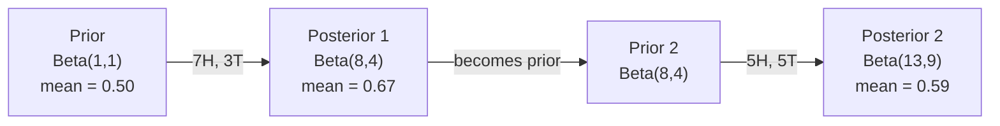

# Teorema de Bayes

> La probabilidad es lo que esperas y el teorema de Bayes es lo que aprendes.

**Type:** Build
**Language:**Python
**Prerequisites:** Phase 1, Lesson 06 (Probability Fundamentals)
**Time:** ~75 minutes

## Objetivos de aprendizaje

- Aplicar el teorema de Bayes para calcular probabilidades posteriores a partir de antecedentes, probabilidades y evidencia
- Construir un clasificador de texto Bayes Ingenuo desde cero con Laplace suavización y cálculo de espacio log
- Comparar la estimación de MLE y MAP y explicar cómo el MAP corresponde a la regularización de L2
- Implementar actualizaciones bayesianas secuenciales utilizando los antecedentes conjugados beta-binomial para las pruebas A/B

## El problema

Una prueba médica es un 99% exacta. ¿Cuál es la probabilidad de que tengas la enfermedad?

La mayoría de la gente dice que el 99% de la respuesta real depende de lo rara que es la enfermedad. Si 1 de cada 10.000 personas la tienen, un resultado positivo sólo le da un 1% de probabilidad de enfermarse. El otro 99% de los resultados positivos son falsas alarmas de personas sanas.

Esta no es una pregunta de truco. Es el teorema de Bayes. Cada filtro de spam, cada diagnóstico médico, cada modelo de aprendizaje automático que cuantifica la incertidumbre utiliza este razonamiento exacto. Comienzas con una creencia. Ves evidencia. Actualizas.

Si construyes sistemas de inteligencia artificial sin entender esto, interpretarás mal las salidas del modelo, establecerás malos umbrales y enviarás predicciones demasiado confiadas.

## El concepto

### De probabilidad conjunta a Bayes

Ya sabes por la lección 06 que la probabilidad condicional es:

```
P(A|B) = P(A and B) / P(B)
```

Y simétricamente:

```
P(B|A) = P(A and B) / P(A)
```

Ambas expresiones comparten el mismo numerador: P(A y B.

```
P(A and B) = P(A|B) * P(B) = P(B|A) * P(A)

Therefore:

P(A|B) = P(B|A) * P(A) / P(B)
```

Eso es el teorema de Bayes. Cuatro cantidades, una ecuación.

### Las cuatro partes

| Part | Name | What it means |
|------|------|---------------|
| P(A\|B) | Posterior | Your updated belief about A after seeing evidence B |
| P(B\|A) | Likelihood | How probable the evidence B is if A is true |
| P(A) | Prior | Your belief about A before seeing any evidence |
| P(B) | Evidence | Total probability of seeing B under all possibilities |

El término prueba P(B) actúa como normalizador.

```
P(B) = P(B|A) * P(A) + P(B|not A) * P(not A)
```

### Ejemplo de prueba médica

Una enfermedad afecta a 1 de cada 10.000 personas. La prueba es 99% exacta (captura al 99% de las personas enfermas, da falsos resultados en el 1% de las veces).

```
P(sick)          = 0.0001     (prior: disease is rare)
P(positive|sick) = 0.99       (likelihood: test catches it)
P(positive|healthy) = 0.01    (false positive rate)

P(positive) = P(positive|sick) * P(sick) + P(positive|healthy) * P(healthy)
            = 0.99 * 0.0001 + 0.01 * 0.9999
            = 0.000099 + 0.009999
            = 0.010098

P(sick|positive) = P(positive|sick) * P(sick) / P(positive)
                 = 0.99 * 0.0001 / 0.010098
                 = 0.0098
                 = 0.98%
```

Cuando una afección es rara, incluso las pruebas precisas producen en su mayoría falsos resultados positivos.

### Ejemplo de filtro de spam

Recibes un correo electrónico que contiene la palabra "lotería". ¿Es spam?

```
P(spam)                = 0.3      (30% of email is spam)
P("lottery"|spam)      = 0.05     (5% of spam emails contain "lottery")
P("lottery"|not spam)  = 0.001    (0.1% of legitimate emails contain "lottery")

P("lottery") = 0.05 * 0.3 + 0.001 * 0.7
             = 0.015 + 0.0007
             = 0.0157

P(spam|"lottery") = 0.05 * 0.3 / 0.0157
                  = 0.955
                  = 95.5%
```

Una palabra cambia la probabilidad del 30% al 95.5%. Un verdadero filtro de spam aplica Bayes a cientos de palabras simultáneamente.

### Bayes ingenuo: suposición de independencia

Naive Bayes extiende esto a múltiples características asumiendo que todas las características son condicionalmente independientes dadas las clases:

```
P(class | feature_1, feature_2, ..., feature_n)
  = P(class) * P(feature_1|class) * P(feature_2|class) * ... * P(feature_n|class)
    / P(feature_1, feature_2, ..., feature_n)
```

La parte "ingenuo" es la suposición de independencia. En el texto, las ocurrencias de palabras no son independientes ("Nuevo" y "York" están correlacionados). Pero la suposición funciona sorprendentemente bien en la práctica porque el clasificador solo necesita clasificar clases, no producir probabilidades calibradas.

Dado que el denominador es el mismo para todas las clases, se puede saltar y simplemente comparar numeradores:

```
score(class) = P(class) * product of P(feature_i | class)
```

Elige la clase con la puntuación más alta.

### Estimación máxima de probabilidad (MLE)

¿Cómo obtienes P "feature" de los datos de entrenamiento?

```
P("free"|spam) = (number of spam emails containing "free") / (total spam emails)
```

Esto es MLE: elija los valores de parámetros que hacen que los datos observados sean más probables. Estás maximizando la función de probabilidad, que para los recuentos discretos se reduce a la frecuencia relativa.

Problema: si una palabra nunca aparece en el spam durante el entrenamiento, MLE le da probabilidad cero. Una palabra no vista mata todo el producto.

```
P(word|class) = (count(word, class) + 1) / (total_words_in_class + vocabulary_size)
```

Añadir 1 a cada cuenta asegura que ninguna probabilidad es cero.

### El importe máximo a posteriori (MAP)

MLE pregunta: ¿qué parámetros maximizan los parámetros de datos P?

MAP pregunta: ¿qué parámetros maximizan los parámetros P  en los datos?

Por el teorema de Bayes:

```
P(parameters|data) proportional to P(data|parameters) * P(parameters)
```

MAP agrega un prior sobre los parámetros mismos. Si crees que los parámetros deben ser pequeños, codificas eso como un prior que penaliza valores grandes. Esto es idéntico a la regularización de L2 en ML. La penalización de "arido" en la regresión de la cresta es literalmente un prior gaussiano en los pesos.

| Estimation | Optimizes | ML equivalent |
|------------|-----------|---------------|
| MLE | P(data\|params) | Unregularized training |
| MAP | P(data\|params) * P(params) | L2 / L1 regularization |

### Bayesiano vs frecuentista: la diferencia práctica

Los frecuentistas consideran que los parámetros son algo desconocido y preguntan: "Si repito este experimento muchas veces, ¿qué pasaría?"

Los bayesianos tratan los parámetros como distribuciones. "¿Qué creo de los parámetros, dada la observación que he hecho?"

Para la construcción de sistemas ML, la diferencia práctica:

| Aspect | Frequentist | Bayesian |
|--------|-------------|----------|
| Output | Point estimate | Distribution over values |
| Uncertainty | Confidence intervals (about procedure) | Credible intervals (about parameter) |
| Small data | Can overfit | Prior acts as regularization |
| Computation | Usually faster | Often requires sampling (MCMC) |

La mayoría de los métodos de producción de ML son frecuentistas (SGD, estimaciones de puntos). Los métodos bayesianos brillan cuando se necesita incertidumbre calibrada (decisiones médicas, sistemas críticos para la seguridad) o cuando los datos son escasos (aprendizaje a pocos disparos, arranque en frío).

### Por qué el pensamiento bayesiano es importante para la ML

La conexión es más profunda que la analogía:

**Priors are regularization.**Un previo gaussiano en pesas es la regularización L2. Un previo de Laplace es L1. Cada vez que añades un término de regularización, estás haciendo una declaración bayesiana sobre qué valores de parámetros esperas.

**Posteriors are uncertainty.**Una sola probabilidad prevista no le dice nada sobre lo seguro que es el modelo en esa estimación. Los métodos bayesianos le dan una distribución: "Creo que P(spam) es entre 0,8 y 0,95. "

**Bayes updates are online learning.**El posterior de hoy se convierte en el anterior de mañana. Cuando tu modelo ve nuevos datos, actualiza sus creencias incrementalmente en lugar de reentrenarse desde cero.

**Model comparison is Bayesian.**El criterio de información bayesiano (BIC), la probabilidad marginal y los factores de Bayes utilizan el razonamiento bayesiano para elegir entre modelos sin sobreajuste.

```figure
bayes-update
```

## Construye el mismo

### Paso 1: Función del teorema de Bayes

```python
def bayes(prior, likelihood, false_positive_rate):
    evidence = likelihood * prior + false_positive_rate * (1 - prior)
    posterior = likelihood * prior / evidence
    return posterior

result = bayes(prior=0.0001, likelihood=0.99, false_positive_rate=0.01)
print(f"P(sick|positive) = {result:.4f}")
```

### Paso 2: Clasificador Bayes Ingenuo

```python
import math
from collections import defaultdict

class NaiveBayes:
    def __init__(self, smoothing=1.0):
        self.smoothing = smoothing
        self.class_counts = defaultdict(int)
        self.word_counts = defaultdict(lambda: defaultdict(int))
        self.class_word_totals = defaultdict(int)
        self.vocab = set()

    def train(self, documents, labels):
        for doc, label in zip(documents, labels):
            self.class_counts[label] += 1
            words = doc.lower().split()
            for word in words:
                self.word_counts[label][word] += 1
                self.class_word_totals[label] += 1
                self.vocab.add(word)

    def predict(self, document):
        words = document.lower().split()
        total_docs = sum(self.class_counts.values())
        vocab_size = len(self.vocab)
        best_class = None
        best_score = float("-inf")
        for cls in self.class_counts:
            score = math.log(self.class_counts[cls] / total_docs)
            for word in words:
                count = self.word_counts[cls].get(word, 0)
                total = self.class_word_totals[cls]
                score += math.log((count + self.smoothing) / (total + self.smoothing * vocab_size))
            if score > best_score:
                best_score = score
                best_class = cls
        return best_class
```

Las probabilidades de registro evitan el flujo inferior. Multiplicar muchas probabilidades pequeñas produce números demasiado pequeños para un punto flotante. Sumar las probabilidades de registro es numéricamente estable y matemáticamente equivalente.

### Paso 3: Entrenamiento en datos de spam

```python
train_docs = [
    "win free money now",
    "free lottery ticket winner",
    "claim your prize today free",
    "urgent offer free cash",
    "congratulations you won free",
    "meeting tomorrow at noon",
    "project update attached",
    "can we schedule a call",
    "quarterly report review",
    "lunch on thursday sounds good",
    "team standup notes attached",
    "please review the pull request",
]

train_labels = [
    "spam", "spam", "spam", "spam", "spam",
    "ham", "ham", "ham", "ham", "ham", "ham", "ham",
]

classifier = NaiveBayes()
classifier.train(train_docs, train_labels)

test_messages = [
    "free money waiting for you",
    "meeting rescheduled to friday",
    "you won a free prize",
    "please review the attached report",
]

for msg in test_messages:
    print(f"  '{msg}' -> {classifier.predict(msg)}")
```

### Paso 4: Inspeccionar las probabilidades aprendidas

```python
def show_top_words(classifier, cls, n=5):
    vocab_size = len(classifier.vocab)
    total = classifier.class_word_totals[cls]
    probs = {}
    for word in classifier.vocab:
        count = classifier.word_counts[cls].get(word, 0)
        probs[word] = (count + classifier.smoothing) / (total + classifier.smoothing * vocab_size)
    sorted_words = sorted(probs.items(), key=lambda x: x[1], reverse=True)
    for word, prob in sorted_words[:n]:
        print(f"    {word}: {prob:.4f}")

print("\nTop spam words:")
show_top_words(classifier, "spam")
print("\nTop ham words:")
show_top_words(classifier, "ham")
```

## Usalo

Navios barcos de aprendizaje de la producción implementaciones Bayes:

```python
from sklearn.feature_extraction.text import CountVectorizer
from sklearn.naive_bayes import MultinomialNB
from sklearn.metrics import classification_report

vectorizer = CountVectorizer()
X_train = vectorizer.fit_transform(train_docs)
clf = MultinomialNB()
clf.fit(X_train, train_labels)

X_test = vectorizer.transform(test_messages)
predictions = clf.predict(X_test)
for msg, pred in zip(test_messages, predictions):
    print(f"  '{msg}' -> {pred}")
```

El algoritmo es el mismo. CountVectorizer maneja la tokenización y la construcción de vocabulario. MultinomialNB maneja la suavización y las probabilidades de registro internamente. Su versión desde cero hace lo mismo en 40 líneas.

## Envío

La clase NaiveBayes construida aquí demuestra la línea completa: tokenización, estimación de probabilidad con suavizamiento de Laplace, predicción del espacio log.`code/bayes.py`se ejecuta de extremo a extremo sin dependencias más allá de la biblioteca estándar de Python.

### Los antecesores conjuntos

Cuando el anterior y posterior pertenecen a la misma familia de distribuciones, el anterior se llama "conjugado". Esto hace que la actualización bayesiana sea algebraicamente limpia - obtienes un posterior de forma cerrada sin integración numérica.

| Likelihood | Conjugate Prior | Posterior | Example |
|-----------|----------------|-----------|---------|
| Bernoulli | Beta(a, b) | Beta(a + successes, b + failures) | Coin flip bias estimation |
| Normal (known variance) | Normal(mu_0, sigma_0) | Normal(weighted mean, smaller variance) | Sensor calibration |
| Poisson | Gamma(a, b) | Gamma(a + sum of counts, b + n) | Modeling arrival rates |
| Multinomial | Dirichlet(alpha) | Dirichlet(alpha + counts) | Topic modeling, language models |

Por qué esto importa: sin antecedentes conjugados, se necesita muestreo de Monte Carlo o inferencia variativa para aproximar el posterior.

La distribución Beta es el conjugado anterior más común en la práctica. Beta(a, b) representa su creencia sobre un parámetro de probabilidad. La media es a/(a+b).

Casos especiales del Beta anterior:
- Beta(1, 1) = uniforme. No tienes opinión sobre el parámetro.
- Beta(10, 10) = alcanzó el máximo de 0.5.
- Beta(1, 10) = sesgado hacia 0. Crees que el parámetro es pequeño.

La regla de actualización es muy simple:

```
Prior:     Beta(a, b)
Data:      s successes, f failures
Posterior: Beta(a + s, b + f)
```

No hay integrales, no muestreo, sólo suma.

### Actualización Bayesiana secuencial

La inferencia bayesiana es naturalmente secuencial. El posterior de hoy se convierte en el anterior de mañana. Así es como los sistemas reales aprenden incrementalmente sin volver a procesar todos los datos históricos.

Ejemplo concreto: estimar si una moneda es justa.

**Day 1: No data yet.**
Comience con Beta ((1, 1) -- un prior uniforme. No tienes opinión.
- Mediano anterior: 0,5
- El Prior es plano en el [0, 1]

**Day 2: Observe 7 heads, 3 tails.**
Posterior = Beta(1 + 7, 1 + 3) = Beta(8, 4)
- Media posterior: 8/12 = 0,667
- La evidencia sugiere que la moneda está sesgada hacia las cabezas

**Day 3: Observe 5 more heads, 5 more tails.**
Usa el posterior de ayer como el anterior de hoy.
Posterior = Beta(8 + 5, 4 + 5) = Beta(13, 9)
- Mediano posterior: 13/22 = 0,591
- Los nuevos datos equilibrados retrasaron la estimación hacia 0,5



El orden de las observaciones no importa. Beta(1,1) actualizado con las 12 cabezas y 8 colas a la vez da Beta(13, 9) - el mismo resultado. Actualización secuencial y actualización de lote son matemáticamente equivalentes. Pero la actualización secuencial le permite tomar decisiones en cada paso sin almacenar datos brutos.

Esta es la base del aprendizaje en línea en los sistemas ML de producción.

### Conexión a las pruebas A/B

Las pruebas A/B son inferencias bayesianas disfrazadas.

Configuración: está probando dos colores de botones: variante A (azul) y variante B (verde).

El ensayo Bayesiano A/B:

1. **Prior.**Comience con Beta(1, 1) para ambas variantes.
2. **Data.**La variante A: 50 clics de 1000 vistas. La variante B: 65 clics de 1000 vistas.
3. **Posteriors.**
   - A: Beta(1 + 50, 1 + 950) = Beta(51, 951).
   - B: Beta(1 + 65, 1 + 935) = Beta(66, 936). media = 0,066
4. **Decision.**Computa P ((B > A) -- la probabilidad de que la tasa de conversión verdadera de B es mayor que la de A.

Computación P ((B > A) analíticamente es difícil. Pero Monte Carlo lo hace trivial:

```
1. Draw 100,000 samples from Beta(51, 951)  -> samples_A
2. Draw 100,000 samples from Beta(66, 936)  -> samples_B
3. P(B > A) = fraction of samples where B > A
```

Si P(B > A) > 0,95, envías la variante B. Si está entre 0,05 y 0,95, sigues recopilando datos. Si P(B > A) < 0,05, envías la variante A.

Ventajas sobre las pruebas A/B frecuentes:
- Obtienes una declaración de probabilidad directa: "hay un 97% de probabilidad de que B sea mejor"
- No hay confusión de valor p, no hay cobertura de "no rechazar la hipótesis nula".
- Puede comprobar los resultados en cualquier momento sin inflar tasas falsas positivas (sin "problema de búsqueda")
- Puede incorporar conocimientos previos (por ejemplo, pruebas anteriores sugieren que las tasas de conversión son generalmente de 3-8%)

| Aspect | Frequentist A/B | Bayesian A/B |
|--------|----------------|--------------|
| Output | p-value | P(B > A) |
| Interpretation | "How surprising is this data if A=B?" | "How likely is B better than A?" |
| Early stopping | Inflates false positives | Safe at any point (given a well-chosen prior and correctly specified model) |
| Prior knowledge | Not used | Encoded as Beta prior |
| Decision rule | p < 0.05 | P(B > A) > threshold |

## Los ejercicios

1. **Multiple tests.**Un paciente prueba positivo dos veces en pruebas independientes (ambas son 99% precisas, la prevalencia de la enfermedad es de 1 en 10.000). ¿Qué es P(enfermo) después de ambas pruebas?

2. **Smoothing impact.**¿Cómo cambian las probabilidades de la palabra superior? ¿Qué sucede con la palabra que aparece sólo en jamón?

3. **Add features.**Extenda la clase NaiveBayes para que también utilice la longitud del mensaje (corto/largo) como una característica junto con el conteo de palabras. Estima P(short dizerspam) y P(short dizerham) a partir de los datos de entrenamiento y dobla en la puntuación de predicción.

4. **MAP by hand.**Dados los datos observados (7 cabezas en 10 lanzamientos de moneda), calcular la estimación de MAP del sesgo utilizando un Beta(2,2) anterior.

## Términos clave

| Term | What people say | What it actually means |
|------|----------------|----------------------|
| Prior | "My initial guess" | P(hypothesis) before observing evidence. In ML: the regularization term. |
| Likelihood | "How well the data fits" | P(evidence\|hypothesis). How probable the observed data is under a specific hypothesis. |
| Posterior | "My updated belief" | P(hypothesis\|evidence). The prior multiplied by the likelihood, then normalized. |
| Evidence | "The normalizing constant" | P(data) across all hypotheses. Ensures the posterior sums to 1. |
| Naive Bayes | "That simple text classifier" | A classifier that assumes features are independent given the class. Works well despite the false assumption. |
| Laplace smoothing | "Add-one smoothing" | Adding a small count to every feature to prevent zero probabilities from unseen data. |
| MLE | "Just use the frequencies" | Choose parameters that maximize P(data\|parameters). No prior. Can overfit with small data. |
| MAP | "MLE with a prior" | Choose parameters that maximize P(data\|parameters) * P(parameters). Equivalent to regularized MLE. |
| Log-probability | "Work in log space" | Using log(P) instead of P to avoid floating-point underflow when multiplying many small numbers. |
| False positive | "A wrong alarm" | The test says positive, but the true state is negative. Drives the base rate fallacy. |

## Leer más

- [3Blue1Brown: Bayes' theorem](https://www.youtube.com/watch?v=HZGCoVF3YvM)- explicación visual con el ejemplo del examen médico
- [Stanford CS229: Generative Learning Algorithms](https://cs229.stanford.edu/notes2022fall/cs229-notes2.pdf)- Bayes ingenuo y su conexión con modelos discriminatorios
- [Think Bayes](https://greenteapress.com/wp/think-bayes/)- libro gratuito, estadísticas bayesianas con código Python
- [scikit-learn Naive Bayes](https://scikit-learn.org/stable/modules/naive_bayes.html)- las implementaciones de la producción y cuándo utilizar cada variante
