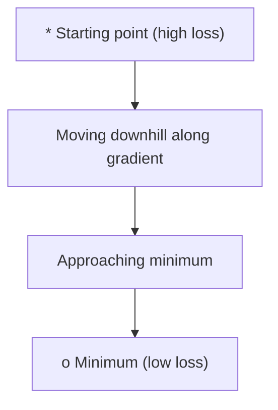
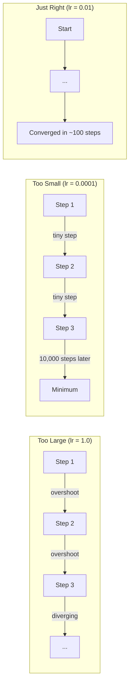
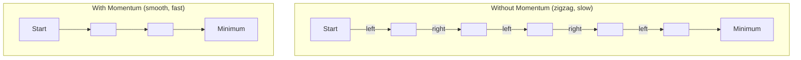
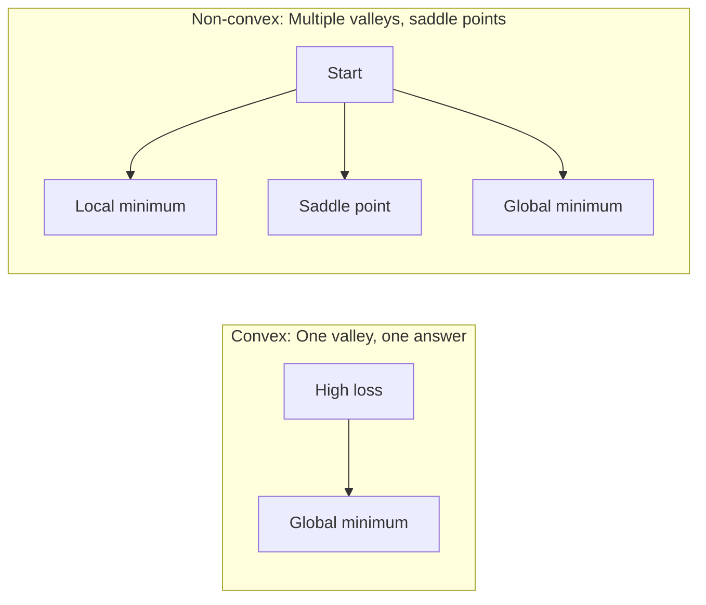
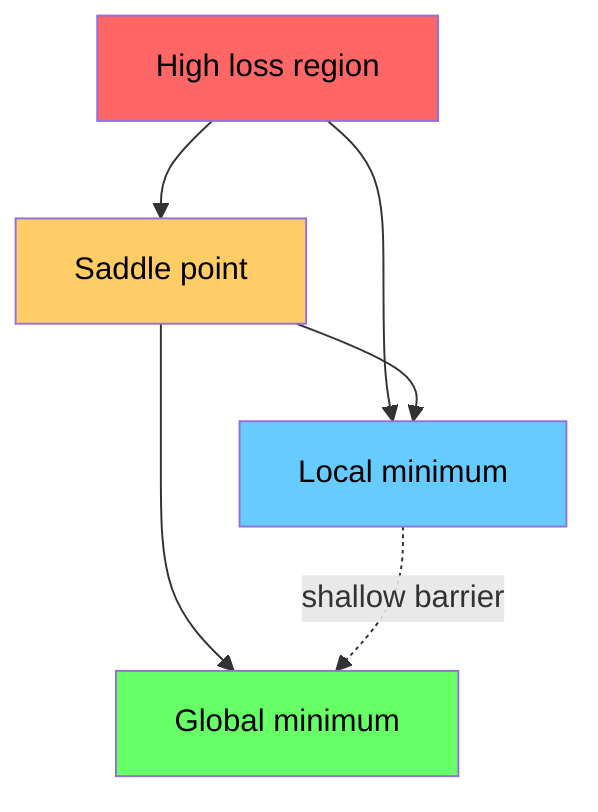

# Optimización

> Entrenar una red neuronal no es más que encontrar el fondo de un valle.

**Type:** Build
**Language:**Python
**Prerequisites:** Phase 1, Lessons 04-05 (Derivatives, Gradients)
**Time:** ~75 minutes

## Objetivos de aprendizaje

- Implemente el descenso de la gradiente de vainilla, SGD con impulso, y Adam desde cero
- Comparar la convergencia de optimizador en la función Rosenbrock y explicar por qué Adam adapta las tasas de aprendizaje por peso
- Distinguir entre los paisajes convexos y los paisajes de pérdidas no convexos y explicar el papel de los puntos de silla en dimensiones altas
- Configurar los horarios de la tasa de aprendizaje (desintegración en etapas, anulación cosina, calentamiento) para la estabilidad del entrenamiento

## El problema

Tienes una función de pérdida que te dice lo mal que es tu modelo tienes gradientes que te dicen en qué dirección empeora la pérdida ahora necesitas una estrategia para caminar bajando la colina

El enfoque ingenuo es simple: moverse en contra del gradiente. Escala el paso por algún número llamado la tasa de aprendizaje. Repito, ¿qué quieres? Esto es un descenso de gradiente, y funciona. Pero "trabajos" tiene advertencias. Una tasa de aprendizaje demasiado alta y se sobrepasa el valle por completo, saltando entre paredes. Demasiado pequeño y te arrastras hacia la respuesta a través de miles de pasos innecesarios. Golpea un punto de silla y deja de moverse aunque no haya encontrado un mínimo.

Cada optimizador en el aprendizaje profundo es una respuesta a la misma pregunta: ¿cómo llegar al fondo del valle más rápido y confiable?

## El concepto

### Qué significa la optimización

La optimización es encontrar los valores de entrada que minimizan (o maximizan) una función. En el aprendizaje automático, la función es la pérdida. Las entradas son los pesos del modelo.

```
minimize L(w) where:
  L = loss function
  w = model weights (could be millions of parameters)
```

### Descenso gradual (vanilla)

El optimizador más simple: calcular el gradiente de la pérdida con respecto a cada peso. mover cada peso en la dirección opuesta a su gradiente. Escala el paso por la tasa de aprendizaje.

```
w = w - lr * gradient
```

Es todo el algoritmo.



### Rate de aprendizaje: el hiperparámetro más importante

La tasa de aprendizaje controla el tamaño de los pasos. Determina todo acerca de la convergencia.



No hay una fórmula para la tasa de aprendizaje correcta. Lo encontramos por experimento. puntos de partida comunes: 0,001 para Adam, 0,01 para SGD con impulso.

### SGD vs lote vs mini lote

La descenda del gradiente de vainilla calcula el gradiente de todo el conjunto de datos antes de dar un paso. Esto se llama descenda del gradiente de lote. Es estable pero lento.

El descenso de gradiente estocástico (SGD) calcula el gradiente en una sola muestra aleatoria y pasa inmediatamente.

El descenso de gradiente de mini lote divide la diferencia. Calcule el gradiente en un lote pequeño (32, 64, 128, 256 muestras), luego paso. Esto es lo que todos utilizan realmente.

| Variant | Batch size | Gradient quality | Speed per step | Noise |
|---------|-----------|-----------------|---------------|-------|
| Batch GD | Entire dataset | Exact | Slow | None |
| SGD | 1 sample | Very noisy | Fast | High |
| Mini-batch | 32-256 | Good estimate | Balanced | Moderate |

El ruido en SGD y mini-batch no es un error, ayuda a escapar de mínimos locales superficiales y puntos de silla.

### Momentum: la bola rodando hacia abajo

El descenso del gradiente de vainilla sólo mira el gradiente actual. Si el gradiente zigzag (común en valles estrechos), el progreso es lento.

```
v = beta * v + gradient
w = w - lr * v
```

La analogía: una bola rodando hacia abajo. No se detiene y reinicia en cada golpe.



`beta`La beta más alta significa más impulso, caminos más suaves, pero una respuesta más lenta a los cambios de dirección.

### Adam: tasas de aprendizaje adaptativas

Los diferentes pesos necesitan diferentes tasas de aprendizaje. Un peso que rara vez tiene grandes gradientes debe dar pasos más grandes cuando finalmente lo haga. Un peso que recibe grandes gradientes constantemente debe dar pasos más pequeños.

Adam (estimación de momento adaptativo) rastrea dos cosas por peso:

1. Primero momento (m): promedio corriente de los gradientes (como el momento)
2. Segundo momento (v): promedio corriente de los gradientes al cuadrado (magnitud de gradiente)

```
m = beta1 * m + (1 - beta1) * gradient
v = beta2 * v + (1 - beta2) * gradient^2

m_hat = m / (1 - beta1^t)    bias correction
v_hat = v / (1 - beta2^t)    bias correction

w = w - lr * m_hat / (sqrt(v_hat) + epsilon)
```

La división por `sqrt(v_hat)`Los pesos con grandes gradientes se dividen por un número grande (pequeño paso efectivo). los pesos con pequeños gradientes se dividen por un número pequeño (pequeño paso efectivo). cada peso obtiene su propia tasa de aprendizaje adaptativa.

Hiperparámetros por defecto: `lr=0.001, beta1=0.9, beta2=0.999, epsilon=1e-8`Estos valores defectuosos funcionan bien para la mayoría de los problemas.

### Horarios de tasa de aprendizaje

Una tasa de aprendizaje fija es un compromiso. Al principio del entrenamiento, se quieren grandes pasos para progresar rápidamente.

Horarios comunes:

| Schedule | Formula | Use case |
|----------|---------|----------|
| Step decay | lr = lr * factor every N epochs | Simple, manual control |
| Exponential decay | lr = lr_0 * decay^t | Smooth reduction |
| Cosine annealing | lr = lr_min + 0.5 * (lr_max - lr_min) * (1 + cos(pi * t / T)) | Transformers, modern training |
| Warmup + decay | Linear ramp up, then decay | Large models, prevents early instability |

### Conveja vs no conveja

Una función convexa tiene un mínimo.`f(x) = x^2`es convexa.

Las funciones de pérdida de la red neuronal no son convexas. Tienen muchos mínimos locales, puntos de silla y regiones planas.



En la práctica, los mínimos locales en redes neuronales de alta dimensión rara vez son un problema. La mayoría de los mínimos locales tienen valores de pérdida cercanos al mínimo global. Los puntos de sedal (planos en algunas direcciones, curvos en otras) son el verdadero obstáculo.

### Visualización de paisajes perdidos

La pérdida es una función de todos los pesos. Para un modelo con 1 millón de pesos, el paisaje de pérdida vive en un espacio de 1.000,001 dimensiones. Lo visualizamos escogiendo dos direcciones aleatorias en el espacio de peso y trazando la pérdida a lo largo de esas direcciones, produciendo una superficie 2D.



Los mínimos nítidos se generalizan mal. Los mínimos planos se generalizan bien. Esta es una de las razones por las que SGD con impulso a menudo supera a Adam en la precisión de la prueba final: su ruido evita que se establezca en mínimos nítidos.

```figure
gradient-descent
```

## Construye el mismo

### Paso 1: Define una función de ensayo

La función Rosenbrock es un estándar clásico de optimización. Su mínimo es (1, 1) dentro de un estrecho valle curvo que es fácil de encontrar pero difícil de seguir.

```
f(x, y) = (1 - x)^2 + 100 * (y - x^2)^2
```

```python
def rosenbrock(params):
    x, y = params
    return (1 - x) ** 2 + 100 * (y - x ** 2) ** 2

def rosenbrock_gradient(params):
    x, y = params
    df_dx = -2 * (1 - x) + 200 * (y - x ** 2) * (-2 * x)
    df_dy = 200 * (y - x ** 2)
    return [df_dx, df_dy]
```

### Paso 2: Descenso de la gradiente de vainilla

```python
class GradientDescent:
    def __init__(self, lr=0.001):
        self.lr = lr

    def step(self, params, grads):
        return [p - self.lr * g for p, g in zip(params, grads)]
```

### Paso 3: SGD con impulso

```python
class SGDMomentum:
    def __init__(self, lr=0.001, momentum=0.9):
        self.lr = lr
        self.momentum = momentum
        self.velocity = None

    def step(self, params, grads):
        if self.velocity is None:
            self.velocity = [0.0] * len(params)
        self.velocity = [
            self.momentum * v + g
            for v, g in zip(self.velocity, grads)
        ]
        return [p - self.lr * v for p, v in zip(params, self.velocity)]
```

### Paso 4: Adán

```python
class Adam:
    def __init__(self, lr=0.001, beta1=0.9, beta2=0.999, epsilon=1e-8):
        self.lr = lr
        self.beta1 = beta1
        self.beta2 = beta2
        self.epsilon = epsilon
        self.m = None
        self.v = None
        self.t = 0

    def step(self, params, grads):
        if self.m is None:
            self.m = [0.0] * len(params)
            self.v = [0.0] * len(params)

        self.t += 1

        self.m = [
            self.beta1 * m + (1 - self.beta1) * g
            for m, g in zip(self.m, grads)
        ]
        self.v = [
            self.beta2 * v + (1 - self.beta2) * g ** 2
            for v, g in zip(self.v, grads)
        ]

        m_hat = [m / (1 - self.beta1 ** self.t) for m in self.m]
        v_hat = [v / (1 - self.beta2 ** self.t) for v in self.v]

        return [
            p - self.lr * mh / (vh ** 0.5 + self.epsilon)
            for p, mh, vh in zip(params, m_hat, v_hat)
        ]
```

### Paso 5: Compare y ejecuta

```python
def optimize(optimizer, func, grad_func, start, steps=5000):
    params = list(start)
    history = [params[:]]
    for _ in range(steps):
        grads = grad_func(params)
        params = optimizer.step(params, grads)
        history.append(params[:])
    return history

start = [-1.0, 1.0]

gd_history = optimize(GradientDescent(lr=0.0005), rosenbrock, rosenbrock_gradient, start)
sgd_history = optimize(SGDMomentum(lr=0.0001, momentum=0.9), rosenbrock, rosenbrock_gradient, start)
adam_history = optimize(Adam(lr=0.01), rosenbrock, rosenbrock_gradient, start)

for name, history in [("GD", gd_history), ("SGD+M", sgd_history), ("Adam", adam_history)]:
    final = history[-1]
    loss = rosenbrock(final)
    print(f"{name:6s} -> x={final[0]:.6f}, y={final[1]:.6f}, loss={loss:.8f}")
```

Producción esperada: Adam converge más rápido. SGD con impulso sigue un camino más suave. Vanilla GD progresa lentamente a lo largo del valle estrecho.

## Usalo

En la práctica, utilice PyTorch o JAX optimizadores. manejan grupos de parámetros, desintegración de peso, recorte de gradientes y aceleración de GPU.

```python
import torch

model = torch.nn.Linear(784, 10)

sgd = torch.optim.SGD(model.parameters(), lr=0.01, momentum=0.9)
adam = torch.optim.Adam(model.parameters(), lr=0.001)
adamw = torch.optim.AdamW(model.parameters(), lr=0.001, weight_decay=0.01)

scheduler = torch.optim.lr_scheduler.CosineAnnealingLR(adam, T_max=100)
```

Reglas de los pulgares:

- Comienza con Adam (lr=0.001). Funciona para la mayoría de los problemas sin ajuste.
- Cambiar a SGD con impulso (lr=0.01, impulso=0.9) cuando necesite la mejor precisión final y puede permitirse más sintonización.
- Utilice AdamW (Adam con desacoplado de desintegración de peso) para transformadores.
- Siempre utilice un horario de tasa de aprendizaje para entrenamientos que duran más de unas pocas épocas.
- Si la formación es inestable, reduzca la tasa de aprendizaje.

## Envío

Esta lección produce una invitación para elegir el optimizador adecuado.`outputs/prompt-optimizer-guide.md`¿ Qué ?

Las clases de optimizadores construidas aquí reaparecen en la Fase 3 cuando entrenamos una red neuronal desde cero.

## Los ejercicios

1. **Learning rate sweep.**Ejecutar la descensos de gradiente de vainilla en la función Rosenbrock con tasas de aprendizaje [0.0001, 0.0005, 0.001, 0.005, 0.01].

2. **Momentum comparison.**ejecuta SGD con valores de impulso [0,0, 0,5, 0,9, 0,99] en la función Rosenbrock.

3. **Saddle point escape.**Define la función `f(x, y) = x^2 - y^2`Comparar cómo vanilla GD, SGD con el impulso, y Adam se comportan. ¿Cuál escapa del punto de la silla?

4. **Implement learning rate decay.**Añadir un calendario de desintegración exponencial a la clase GradientDescent: `lr = lr_0 * 0.999^step`Comparar la convergencia con y sin descomposición en la función Rosenbrock.

## Términos clave

| Term | What people say | What it actually means |
|------|----------------|----------------------|
| Gradient descent | "Go downhill" | Update weights by subtracting the gradient scaled by the learning rate. The most basic optimizer. |
| Learning rate | "Step size" | A scalar that controls how far each update moves the weights. Too large causes divergence. Too small wastes compute. |
| Momentum | "Keep rolling" | Accumulate past gradients into a velocity vector. Dampens oscillations and accelerates movement through consistent directions. |
| SGD | "Random sampling" | Stochastic gradient descent. Compute gradient on a random subset instead of the full dataset. Almost always means mini-batch SGD in practice. |
| Mini-batch | "A chunk of data" | A small subset of training data (32-256 samples) used to estimate the gradient. Balances speed and gradient accuracy. |
| Adam | "The default optimizer" | Adaptive Moment Estimation. Tracks per-weight running averages of gradients and squared gradients to give each weight its own learning rate. |
| Bias correction | "Fix the cold start" | Adam's first and second moments are initialized to zero. Bias correction divides by (1 - beta^t) to compensate during early steps. |
| Learning rate schedule | "Change lr over time" | A function that adjusts the learning rate during training. Large steps early, small steps late. |
| Convex function | "One valley" | A function where any local minimum is the global minimum. Gradient descent always finds it. Neural network losses are not convex. |
| Saddle point | "Flat but not a minimum" | A point where the gradient is zero but it is a minimum in some directions and a maximum in others. Common in high dimensions. |
| Loss landscape | "The terrain" | The loss function plotted over weight space. Visualized by slicing along two random directions. |
| Convergence | "Getting there" | The optimizer has reached a point where further steps do not meaningfully reduce the loss. |

## Leer más

- [Sebastian Ruder: An overview of gradient descent optimization algorithms](https://ruder.io/optimizing-gradient-descent/)- encuesta exhaustiva de todos los principales optimizadores
- [Why Momentum Really Works (Distill)](https://distill.pub/2017/momentum/)- visualización interactiva de la dinámica de impulso
- [Adam: A Method for Stochastic Optimization (Kingma & Ba, 2014)](https://arxiv.org/abs/1412.6980)- el papel original de Adam, legible y corto
- [Visualizing the Loss Landscape of Neural Nets (Li et al., 2018)](https://arxiv.org/abs/1712.09913)- el papel que mostró mínimos nítidos vs. planos
