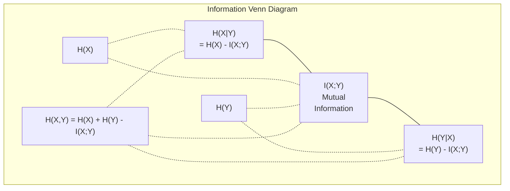

# Teoría de la información

> La teoría de la información mide la sorpresa y las funciones de pérdida se basan en ella.

**Type:** Learn
**Language:**Python
**Prerequisites:** Phase 1, Lesson 06 (Probability)
**Time:** ~60 minutes

## Objetivos de aprendizaje

- Computa la entropía, la entropía cruzada y la divergencia KL desde cero y explica su relación
- Derivar por qué minimizar la pérdida de entropía cruzada es equivalente a maximizar la probabilidad de registro
- Calcular la información mutua entre las características y un objetivo para clasificar la importancia de las características
- Explica la perplejidad como el tamaño efectivo del vocabulario que un modelo de lenguaje elige de

## El problema

Tú llamas .`CrossEntropyLoss()`En cada modelo de clasificación que entrenas, ves "perplejidad" en cada modelo de lenguaje. Lees sobre la divergencia KL en VAEs, destilación y RLHF. Estos no son conceptos desconectados. Son todas la misma idea usando sombreros diferentes.

La teoría de la información le da el lenguaje para razonar sobre la incertidumbre, la compresión y la predicción. Claude Shannon lo inventó en 1948 para resolver problemas de comunicación. Resulta que entrenar una red neuronal es un problema de comunicación: el modelo está tratando de transmitir la etiqueta correcta a través de un canal ruidoso de pesos aprendidos.

Esta lección construye todas las fórmulas desde cero para que veas de dónde vienen y por qué funcionan.

## El concepto

### Contenido de información (sorpresa)

Cuando algo improbable sucede, lleva más información. ¿Una moneda aterriza cabeza? No es sorprendente. Una lotería gana?

El contenido de información de un evento con probabilidad p es:

```
I(x) = -log(p(x))
```

Usando la base de registro 2 se obtienen bits. Usando registro natural se obtienen nats.

```
Event              Probability    Surprise (bits)
Fair coin heads    0.5            1.0
Rolling a 6        0.167          2.58
1-in-1000 event    0.001          9.97
Certain event      1.0            0.0
```

Ciertos eventos tienen información cero.

### Entropia (sorpresa promedio)

Entropia es la sorpresa esperada en todos los posibles resultados de una distribución.

```
H(P) = -sum( p(x) * log(p(x)) )  for all x
```

Una moneda justa tiene entropía máxima para una variable binaria: 1 bit. Una moneda sesgada (99% de cabeza) tiene una baja entropía: 0.08 bits. Ya sabes lo que va a pasar, así que cada giro no te dice casi nada.

```
Fair coin:    H = -(0.5 * log2(0.5) + 0.5 * log2(0.5)) = 1.0 bit
Biased coin:  H = -(0.99 * log2(0.99) + 0.01 * log2(0.01)) = 0.08 bits
```

La entropía mide la incertidumbre irreductible de una distribución.

### La entropía cruzada (la función de pérdida que utilizas todos los días)

La entropía cruzada mide la sorpresa promedio cuando se utiliza la distribución Q para codificar eventos que realmente provienen de la distribución P.

```
H(P, Q) = -sum( p(x) * log(q(x)) )  for all x
```

P es la distribución verdadera (las etiquetas). Q es la predicción de su modelo. Si Q coincide perfectamente con P, la entropía cruzada es igual a la entropía. Cualquier desajuste lo hace más grande.

En la clasificación, P es un vector de una sola calidez (la clase verdadera tiene probabilidad 1, todo lo demás 0). Esto simplifica la entropía cruzada a:

```
H(P, Q) = -log(q(true_class))
```

Esa es toda la fórmula de pérdida de entropía cruzada para la clasificación. Maximizar la probabilidad prevista de la clase correcta.

### KL Divergencia (Distancia entre las distribuciones)

La divergencia KL mide cuánto sorpresa extra obtienes al usar Q en lugar de P.

```
D_KL(P || Q) = sum( p(x) * log(p(x) / q(x)) )  for all x
             = H(P, Q) - H(P)
```

La entropía cruzada es entropía más la divergencia KL. Dado que la entropía de la distribución verdadera es constante durante el entrenamiento, minimizar la entropía cruzada es lo mismo que minimizar la divergencia KL. Estás empujando la distribución de tu modelo hacia la distribución verdadera.

La divergencia KL no es simétrica: D_KL(P ∫ Q) != D_KL(Q ∫ P). No es una métrica de distancia verdadera.

### Información mutua

La información mutua mide cuánto saber una variable le dice sobre otra.

```
I(X; Y) = H(X) - H(X|Y)
        = H(X) + H(Y) - H(X, Y)
```

Si X y Y son independientes, la información mutua es cero. Conocer uno no le dice nada sobre el otro. Si están perfectamente correlacionados, la información mutua es igual a la entropía de cualquiera de las variables.

En la selección de características, una alta información mutua entre una característica y el objetivo significa que la característica es útil.

### Entropia condicional

H(Y del X) mide cuánto incertidumbre queda sobre Y después de observar X.

```
H(Y|X) = H(X,Y) - H(X)
```

Dos extremos:
- Si X determina completamente Y, entonces H(Y deX) = 0. Conocer X elimina toda incertidumbre sobre Y. Ejemplo: X = temperatura en Celsius, Y = temperatura en Fahrenheit.
- Si X no te dice nada sobre Y, entonces H(YX)) = H(Y). Saber X no reduce tu incertidumbre en absoluto. Ejemplo: X = cambio de moneda, Y = el clima de mañana.

La entropía condicional es siempre no negativa y nunca excede H(Y):

```
0 <= H(Y|X) <= H(Y)
```

En el aprendizaje automático, la entropía condicional aparece en los árboles de decisión. En cada división, el algoritmo selecciona la característica X que minimiza H(Y) = la característica que elimina la mayor incertidumbre sobre la etiqueta Y.

### Entropia conjunta

H(X,Y) es la entropía de la distribución conjunta de X y Y juntos.

```
H(X,Y) = -sum sum p(x,y) * log(p(x,y))   for all x, y
```

Propiedad clave:

```
H(X,Y) <= H(X) + H(Y)
```

La igualdad se mantiene cuando X y Y son independientes. Si comparten información, la entropía conjunta es menor que la suma de entropias individuales. La entropía "falta" es exactamente la información mutua.



Las relaciones:
- H(X,Y) = H(X) + H(Y que sea X) = H(Y) + H(X que sea)
- El valor de la cantidad de residuos de la producción de la planta de producción de la planta de producción de la planta de producción de la planta de producción de la planta de producción de la planta de producción de la planta de producción de la planta de producción de la planta de producción de la planta de producción de la planta de producción de la planta de producción de la planta de producción de la planta de producción de la planta de producción de la planta de producción de la planta de producción de la planta de producción de la planta de producción de la planta de producción de la planta de producción de la planta de producción de la planta de producción de la planta de producción de la planta de la planta de producción de la planta de la planta de producción de la planta de la planta de la planta de producción de la planta de la planta de la planta de la planta de la planta de la planta de la planta de la planta de la planta de la planta de la planta de la planta de la planta de la planta de la planta de la planta de la planta de la planta de la planta de la planta de la planta de la planta de la planta de la planta de la planta de la planta de la planta de la planta de la planta de la planta de la planta de la planta de la planta de la planta de la planta de la planta de la planta de la planta de la planta de la planta de la planta de la planta de la planta de la planta de la planta de la planta de la planta de la planta de la planta de la planta de la planta de la planta de la planta de la planta de la planta de la planta de la planta de la planta de la planta de la planta de la planta de la planta de la planta de la planta de la planta de la planta de la planta de la planta de la planta de la planta de la planta de la planta de la planta de la planta de la planta de la planta de la planta de la planta de la planta de la planta de la planta de la planta de la planta de la planta de la planta de la planta de la planta de la planta de la planta de la planta de la planta de la planta de la planta de la planta de la planta de la planta de la planta de la planta de la planta de la planta de la planta de la planta de la planta de la planta de la planta de la planta de la planta de la planta de la planta de la planta de la planta de la planta de la planta de la planta de la planta de la planta de la planta de
- H(X,Y) = H(X) + H(Y) - I(X;Y)

### Información mutua (mergullo profundo)

Información mutua I(X;Y) cuantifica cuánto conocer una variable reduce la incertidumbre sobre la otra.

```
I(X;Y) = H(X) - H(X|Y)
       = H(Y) - H(Y|X)
       = H(X) + H(Y) - H(X,Y)
       = sum sum p(x,y) * log(p(x,y) / (p(x) * p(y)))
```

Propiedades:
- I ((X;Y) >= 0 siempre. Nunca pierdes información al observar algo.
- I(X;Y) = 0 si y sólo si X y Y son independientes.
- I(X;Y) = I(Y;X). Es simétrico, a diferencia de la divergencia KL.
- I  X) = H  X) Una variable comparte toda su información consigo misma.

**Mutual information for feature selection.**En ML, se quieren características que sean informativas sobre el objetivo.

1. Para cada característica X_i, computa I(X_i; Y) donde Y es la variable objetivo.
2. Las características de clasificación por puntaje MI.
3. Mantenga las características de k superior.

Esto funciona para cualquier relación entre la característica y el objetivo, lineal, no lineal, monótono o no. La correlación sólo capta las relaciones lineares. MI capta todo.

| Method | Detects | Computational cost | Handles categorical? |
|--------|---------|-------------------|---------------------|
| Pearson correlation | Linear relationships | O(n) | No |
| Spearman correlation | Monotonic relationships | O(n log n) | No |
| Mutual information | Any statistical dependency | O(n log n) with binning | Yes |

### Limpiación de etiquetas y entropía cruzada

La clasificación estándar utiliza objetivos duros: [0, 0, 1, 0]. La clase verdadera obtiene probabilidad 1, todo lo demás obtiene 0.

```
soft_target = (1 - epsilon) * hard_target + epsilon / num_classes
```

Con epsilon = 0,1 y 4 clases:
- Objetivo duro: [0, 0, 1, 0]
- Objetivo suave: [0,025, 0,025, 0,925, 0,025]

Desde la perspectiva de la teoría de la información, el suavización de etiquetas aumenta la entropía de la distribución de objetivos. Los objetivos duros de una sola calidez tienen entropía 0 - no hay incertidumbre. Los objetivos blandos tienen entropía positiva.

Por qué esto ayuda:
- Impide que el modelo conduzca los logits a valores extremos (se necesitarían logits infinitos para que coincida perfectamente con un objetivo de una sola caliente bajo entropía cruzada)
- Actúa como regularización: el modelo no puede ser 100% seguro
- Mejora la calibración: las probabilidades previstas reflejan mejor la verdadera incertidumbre
- Reduce la brecha entre el entrenamiento y el comportamiento de inferencia

La pérdida de entropía cruzada con el suavización de la etiqueta se convierte en:

```
L = (1 - epsilon) * CE(hard_target, prediction) + epsilon * H_uniform(prediction)
```

El segundo término penaliza predicciones que están lejos de ser uniformes -- una regularización directa de la confianza.

### Por qué la entropía cruzada es la pérdida de clasificación

Tres perspectivas, la misma conclusión.

**Information theory view.**La entropía cruzada mide cuántos bits se desperdician utilizando la distribución de su modelo en lugar de la distribución real. Minimizándola hace que su modelo sea el codificador más eficiente de la realidad.

**Maximum likelihood view.**Para muestras de formación N con clases y_i reales:

```
Likelihood     = product( q(y_i) )
Log-likelihood = sum( log(q(y_i)) )
Negative log-likelihood = -sum( log(q(y_i)) )
```

La última línea es la pérdida de entropía cruzada. Minimizar la entropía cruzada = maximizar la probabilidad de los datos de entrenamiento bajo su modelo.

**Gradient view.**El gradiente de entropía cruzada con respecto a los logits es sencillo (predecible - verdadero). limpio, estable y rápido de calcular.

### Los bits vs los nats

La única diferencia es la base de registro.

```
log base 2   -> bits      (information theory tradition)
log base e   -> nats      (machine learning convention)
log base 10  -> hartleys  (rarely used)
```

1 nat = 1/ln(2) bits = 1,4427 bits. PyTorch y TensorFlow utilizan log natural (nats) por defecto.

### Perplejidad

La perplejidad es el exponencial de entropía cruzada. Te dice el número efectivo de opciones igualmente probables entre el modelo es incierto.

```
Perplexity = 2^H(P,Q)   (if using bits)
Perplexity = e^H(P,Q)   (if using nats)
```

Un modelo de lenguaje con complejidad 50 es, en promedio, tan confuso como si tuviera que elegir uniformemente de 50 posibles fichas siguientes.

GPT-2 logró una perplejidad de ~30 en los puntos de referencia comunes.

```figure
entropy-kl
```

## Construye el mismo

### Paso 1: Contenido de la información y entropía

```python
import math

def information_content(p, base=2):
    if p <= 0 or p > 1:
        return float('inf') if p <= 0 else 0.0
    return -math.log(p) / math.log(base)

def entropy(probs, base=2):
    return sum(
        p * information_content(p, base)
        for p in probs if p > 0
    )

fair_coin = [0.5, 0.5]
biased_coin = [0.99, 0.01]
fair_die = [1/6] * 6

print(f"Fair coin entropy:   {entropy(fair_coin):.4f} bits")
print(f"Biased coin entropy: {entropy(biased_coin):.4f} bits")
print(f"Fair die entropy:    {entropy(fair_die):.4f} bits")
```

### Paso 2: Entropia cruzada y divergencia KL

```python
def cross_entropy(p, q, base=2):
    total = 0.0
    for pi, qi in zip(p, q):
        if pi > 0:
            if qi <= 0:
                return float('inf')
            total += pi * (-math.log(qi) / math.log(base))
    return total

def kl_divergence(p, q, base=2):
    return cross_entropy(p, q, base) - entropy(p, base)

true_dist = [0.7, 0.2, 0.1]
good_model = [0.6, 0.25, 0.15]
bad_model = [0.1, 0.1, 0.8]

print(f"Entropy of true dist:     {entropy(true_dist):.4f} bits")
print(f"CE (good model):          {cross_entropy(true_dist, good_model):.4f} bits")
print(f"CE (bad model):           {cross_entropy(true_dist, bad_model):.4f} bits")
print(f"KL divergence (good):     {kl_divergence(true_dist, good_model):.4f} bits")
print(f"KL divergence (bad):      {kl_divergence(true_dist, bad_model):.4f} bits")
```

### Paso 3: Entropia cruzada como pérdida de clasificación

```python
def softmax(logits):
    max_logit = max(logits)
    exps = [math.exp(z - max_logit) for z in logits]
    total = sum(exps)
    return [e / total for e in exps]

def cross_entropy_loss(true_class, logits):
    probs = softmax(logits)
    return -math.log(probs[true_class])

logits = [2.0, 1.0, 0.1]
true_class = 0

probs = softmax(logits)
loss = cross_entropy_loss(true_class, logits)

print(f"Logits:      {logits}")
print(f"Softmax:     {[f'{p:.4f}' for p in probs]}")
print(f"True class:  {true_class}")
print(f"Loss:        {loss:.4f} nats")
print(f"Perplexity:  {math.exp(loss):.2f}")
```

### Paso 4: La entropía cruzada es igual a la probabilidad de registro negativo

```python
import random

random.seed(42)

n_samples = 1000
n_classes = 3
true_labels = [random.randint(0, n_classes - 1) for _ in range(n_samples)]
model_logits = [[random.gauss(0, 1) for _ in range(n_classes)] for _ in range(n_samples)]

ce_loss = sum(
    cross_entropy_loss(label, logits)
    for label, logits in zip(true_labels, model_logits)
) / n_samples

nll = -sum(
    math.log(softmax(logits)[label])
    for label, logits in zip(true_labels, model_logits)
) / n_samples

print(f"Cross-entropy loss:      {ce_loss:.6f}")
print(f"Negative log-likelihood: {nll:.6f}")
print(f"Difference:              {abs(ce_loss - nll):.2e}")
```

### Paso 5: Información mutua

```python
def mutual_information(joint_probs, base=2):
    rows = len(joint_probs)
    cols = len(joint_probs[0])

    margin_x = [sum(joint_probs[i][j] for j in range(cols)) for i in range(rows)]
    margin_y = [sum(joint_probs[i][j] for i in range(rows)) for j in range(cols)]

    mi = 0.0
    for i in range(rows):
        for j in range(cols):
            pxy = joint_probs[i][j]
            if pxy > 0:
                mi += pxy * math.log(pxy / (margin_x[i] * margin_y[j])) / math.log(base)
    return mi

independent = [[0.25, 0.25], [0.25, 0.25]]
dependent = [[0.45, 0.05], [0.05, 0.45]]

print(f"MI (independent): {mutual_information(independent):.4f} bits")
print(f"MI (dependent):   {mutual_information(dependent):.4f} bits")
```

## Usalo

Los mismos conceptos que utilizan NumPy, la forma en que los utilizará en la práctica:

```python
import numpy as np

def np_entropy(p):
    p = np.asarray(p, dtype=float)
    mask = p > 0
    result = np.zeros_like(p)
    result[mask] = p[mask] * np.log(p[mask])
    return -result.sum()

def np_cross_entropy(p, q):
    p, q = np.asarray(p, dtype=float), np.asarray(q, dtype=float)
    mask = p > 0
    return -(p[mask] * np.log(q[mask])).sum()

def np_kl_divergence(p, q):
    return np_cross_entropy(p, q) - np_entropy(p)

true = np.array([0.7, 0.2, 0.1])
pred = np.array([0.6, 0.25, 0.15])
print(f"Entropy:    {np_entropy(true):.4f} nats")
print(f"Cross-ent:  {np_cross_entropy(true, pred):.4f} nats")
print(f"KL div:     {np_kl_divergence(true, pred):.4f} nats")
```

¿ Qué construiste desde cero ?`torch.nn.CrossEntropyLoss()`Ahora ya sabes por qué la pérdida disminuye durante el entrenamiento: la distribución prevista de tu modelo se está acercando a la distribución real, medida en nats de información desperdiciada.

## Los ejercicios

1. Calcule la entropía del alfabeto inglés asumiendo una distribución uniforme (26 letras). Luego, estima usando frecuencias de letras reales. ¿Cuál es mayor y por qué?

2. Un modelo saca logits [5.0, 2.0, 0.5] para una muestra con clase verdadera 1. Calcula la pérdida de entropía cruzada a mano, luego verifique con su `cross_entropy_loss`¿Qué logitos darían cero pérdida?

3. Muestre que la divergencia KL no es simétrica. escoge dos distribuciones P y Q y computa D_KL_P_K Ђ Q) y DL Q Ђ P). Explique por qué difieren.

4. Construir una función que compute la perplejidad de una secuencia de predicciones de tokens. Dado una lista de pares (true_token_index, predicted_logits), devuelva la perplejidad de la secuencia.

## Términos clave

| Term | What people say | What it actually means |
|------|----------------|----------------------|
| Information content | "Surprise" | The number of bits (or nats) needed to encode an event: -log(p) |
| Entropy | "Randomness" | The average surprise across all outcomes of a distribution. Measures irreducible uncertainty. |
| Cross-entropy | "The loss function" | Average surprise when using model distribution Q to encode events from true distribution P. |
| KL divergence | "Distance between distributions" | Extra bits wasted by using Q instead of P. Equals cross-entropy minus entropy. Not symmetric. |
| Mutual information | "How related are X and Y" | Reduction in uncertainty about X from knowing Y. Zero means independent. |
| Softmax | "Turn logits into probabilities" | Exponentiate and normalize. Maps any real-valued vector to a valid probability distribution. |
| Perplexity | "How confused the model is" | Exponential of cross-entropy. The effective vocabulary size the model is choosing from at each step. |
| Bits | "Shannon's unit" | Information measured with log base 2. One bit resolves one fair coin flip. |
| Nats | "ML's unit" | Information measured with natural log. Used by PyTorch and TensorFlow by default. |
| Negative log-likelihood | "NLL loss" | Identical to cross-entropy loss for one-hot labels. Minimizing it maximizes the probability of correct predictions. |

## Leer más

- [Shannon 1948: A Mathematical Theory of Communication](https://people.math.harvard.edu/~ctm/home/text/others/shannon/entropy/entropy.pdf)- el papel original, todavía legible
- [Visual Information Theory (Chris Olah)](https://colah.github.io/posts/2015-09-Visual-Information/)- mejor explicación visual de la entropía y la divergencia KL
- [PyTorch CrossEntropyLoss docs](https://pytorch.org/docs/stable/generated/torch.nn.CrossEntropyLoss.html)- cómo el marco implementa lo que acabas de construir
