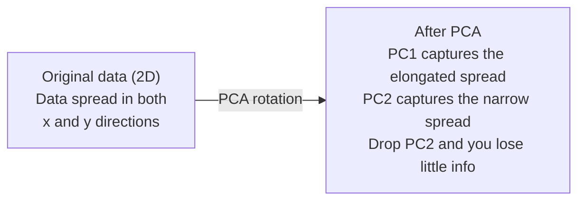

# Reducción de la dimensionalidad

> Los datos de alta dimensión tienen estructura. Se encuentran mirando desde el ángulo correcto.

**Type:** Build
**Language:**Python
**Prerequisites:** Phase 1, Lessons 01 (Linear Algebra Intuition), 02 (Vectors, Matrices & Operations), 03 (Eigenvalues & Eigenvectors), 06 (Probability & Distributions)
**Time:** ~90 minutes

## Objetivos de aprendizaje

- Implementar PCA desde cero: datos centrales, calcular la matriz de covarianza, componer el propio y el proyecto
- Utilice el ratio de varianza explicado y el método del codo para elegir el número de componentes principales
- Comparar PCA, t-SNE y UMAP para visualizar los dígitos MNIST en 2D y explicar sus compensaciones
- Aplicar el PCA del núcleo con un núcleo RBF para separar estructuras de datos no lineales que el PCA estándar no puede manejar

## El problema

Hay un conjunto de datos con 784 características por muestra. Tal vez son valores de píxeles de dígitos escritos a mano. Tal vez son niveles de expresión génica. Tal vez son señales de comportamiento del usuario. No se pueden visualizar 784 dimensiones. No se pueden trazar. Ni siquiera se puede pensar en ellos.

Pero la mayoría de esas características del 784 son redundantes. La información real vive en una superficie mucho más pequeña. Una "7" escrita a mano no necesita 784 números independientes para describirla. Necesita algunos: el ángulo del golpe, la longitud de la barra cruzada, cuánto se inclina. El resto es ruido.

La reducción de dimensiones encuentra esa superficie más pequeña toma sus datos 784 dimensiones y los comprime a 2, 10 o 50 dimensiones manteniendo la estructura que importa.

## El concepto

### La maldición de la dimensionalidad

Los espacios de alta dimensión no son intuitivos. Tres cosas se rompen a medida que las dimensiones crecen.

**Distance becomes meaningless.**En dimensiones altas, la distancia entre cualquier dos puntos aleatorios converge al mismo valor. Si cada punto es aproximadamente la misma distancia de cada otro punto, la búsqueda del vecino más cercano deja de funcionar.

```
Dimension    Avg distance ratio (max/min between random points)
2            ~5.0
10           ~1.8
100          ~1.2
1000         ~1.02
```

**Volume concentrates in corners.**En 100 dimensiones, casi todo el volumen está en las esquinas, lejos del centro.

**You need exponentially more data.**Para mantener la misma densidad de muestras en un espacio, pasar de 2D a 20D significa que necesitas 10 veces 18 veces más datos. Nunca tienes suficiente. Reducir las dimensiones trae la densidad de datos de vuelta a algo viable.

### PCA: encontrar las direcciones que importan

El análisis de componentes principales (PCA) encuentra los ejes a lo largo de los cuales sus datos varían más.

El algoritmo:

```
1. Center the data        (subtract the mean from each feature)
2. Compute covariance     (how features move together)
3. Eigendecomposition     (find the principal directions)
4. Sort by eigenvalue     (biggest variance first)
5. Project               (keep top k eigenvectors, drop the rest)
```

La matriz de covarianza es simétrica y semi-definida positiva. Sus propios vectores son direcciones ortogonales en el espacio de características. Los valores propios le dicen cuánto variación capta cada dirección. El propio vector con los puntos de valor propio más grandes a lo largo de la dirección de la variación máxima.



- **Before PCA:**Nube de datos se distribuye diagonalmente a través de los ejes x y y
- **After PCA:**El sistema de coordenadas se rota para que el PC1 se alinee con la dirección de la varianza máxima (esparcimiento prolongado) y el PC2 con la dirección de la varianza mínima (esparcimiento estrecho).
- **Dimensionality reduction:**Al dejar caer PC2 proyecta los datos en PC1, perdiendo muy poca información

### Ratio de variación explicado

Cada componente principal capta una fracción de la varianza total.

```
Component    Eigenvalue    Explained ratio    Cumulative
PC1          4.73          0.473              0.473
PC2          2.51          0.251              0.724
PC3          1.12          0.112              0.836
PC4          0.89          0.089              0.925
...
```

Cuando la varianza explicada acumulativa alcanza 0,95, se sabe que muchos componentes capturan el 95% de la información.

### Elegir el número de componentes

Tres estrategias:

1. **Threshold.**Mantenga suficientes componentes para explicar el 90-95% de la variación.
2. **Elbow method.**La trama explicó la variación por componente.
3. **Downstream performance.**Utilice PCA como preprocesamiento.

### T-SNE: preservar los barrios

t-Distributed Stochastic Neighbor Embedding (t-SNE) está diseñado para la visualización. Mapea datos de alta dimensión en 2D (o 3D) mientras conserva qué puntos están cerca uno del otro.

La intuición: en el espacio original, calcular una distribución de probabilidad sobre pares de puntos basados en sus distancias. Los puntos cercanos obtienen una probabilidad alta. Los puntos lejanos obtienen una probabilidad baja. Luego encontrar un arreglo 2D donde la misma distribución de probabilidad se mantiene. Los puntos que eran vecinos en 784 dimensiones permanecen vecinos en 2D.

Propiedades clave de t-SNE:
- No lineal, puede desarrollar variedades complejas que PCA no puede.
- Las diferentes carreras producen diferentes diseños.
- El parámetro de perplejidad controla cuántos vecinos debe considerar (rango típico: 5-50).
- Las distancias entre los grupos en la salida no son significativas.
- Lento en conjuntos de datos grandes.

### UMAP: una estructura global más rápida y mejor

La aproximación y proyección de manifiesto uniforme (UMAP) funciona de manera similar a t-SNE pero con dos ventajas:
- Utiliza gráficos aproximados de vecino más cercano en lugar de calcular todas las distancias en pares.
- Mejor estructura global: las posiciones relativas de los grupos en la producción tienden a ser más significativas que en el T-SNE.

UMAP construye un gráfico ponderado en el espacio de alta dimensión (la "representación topológica confusa") y luego encuentra un diseño de baja dimensión que preserva este gráfico lo mejor posible.

Parámetros clave:
- `n_neighbors`En el caso de los países vecinos, la mayor parte de los países vecinos tienen una estructura global más elevada.
- `min_dist`Los valores más bajos crean grupos más densos.

### Cuándo utilizar cuál

| Method | Use case | Preserves | Speed |
|--------|----------|-----------|-------|
| PCA | Preprocessing before training | Global variance | Fast (exact), works on millions of samples |
| PCA | Quick exploratory visualization | Linear structure | Fast |
| t-SNE | Publication-quality 2D plots | Local neighborhoods | Slow (< 10k samples ideal) |
| UMAP | 2D visualization at scale | Local + some global structure | Medium (handles millions) |
| PCA | Feature reduction for models | Variance-ranked features | Fast |
| t-SNE / UMAP | Understanding cluster structure | Cluster separation | Medium to slow |

Regla de oro: utilizar PCA para el preprocesamiento y compresión de datos. utilizar t-SNE o UMAP cuando se necesita visualizar la estructura en 2D.

### PCA del núcleo

El PCA estándar encuentra subespacios lineales. Rota su sistema de coordenadas y deja caer los ejes. Pero ¿qué pasa si los datos se encuentran en un colector no lineal? Un círculo en 2D no puede ser separado por ninguna línea.

El núcleo PCA aplica PCA en un espacio de características de alta dimensión inducido por una función del núcleo, sin calcular explícitamente las coordenadas en ese espacio. Este es el truco del núcleo - la misma idea detrás de SVMs.

El algoritmo:
1. Computa la matriz del núcleo K donde K_ij = k(x_i, x_j)
2. Centrar la matriz del núcleo en el espacio de características
3. Eigendecompose la matriz del núcleo centrado
4. Los vectores propios superiores (escalados por 1/sqrt(valor propio)) son las proyecciones

Funciones comunes del núcleo:

| Kernel | Formula | Good for |
|--------|---------|----------|
| RBF (Gaussian) | exp(-gamma * \|\|x - y\|\|^2) | Most nonlinear data, smooth manifolds |
| Polynomial | (x . y + c)^d | Polynomial relationships |
| Sigmoid | tanh(alpha * x . y + c) | Neural network-like mappings |

Cuando utilizar el PCA del núcleo frente al PCA estándar:

| Criterion | Standard PCA | Kernel PCA |
|-----------|-------------|------------|
| Data structure | Linear subspace | Nonlinear manifold |
| Speed | O(min(n^2 d, d^2 n)) | O(n^2 d + n^3) |
| Interpretability | Components are linear combinations of features | Components lack direct feature interpretation |
| Scalability | Works on millions of samples | Kernel matrix is n x n, memory-limited |
| Reconstruction | Direct inverse transform | Requires pre-image approximation |

El ejemplo clásico: círculos concéntricos en 2D. Dos anillos de puntos, uno dentro del otro. PCA estándar proyecta ambos en la misma línea - inútil para la clasificación. PCA del núcleo con un núcleo RBF mapea el círculo interno y el círculo externo a diferentes regiones, haciéndolos linealmente separables.

### Erro de reconstrucción

¿Qué tan buena es tu reducción de dimensiones?

Mide el error de reconstrucción:
1. Datos del proyecto a dimensiones k: X_reducido = X @ W_k
2. Reconstruir: X_hat = X_reducido @ W_k^T
3. MSE de cálculo: media (X - X_hat) ^2)

Para PCA, el error de reconstrucción tiene una relación clara con la variación explicada:

```
Reconstruction error = sum of eigenvalues NOT included
Total variance = sum of ALL eigenvalues
Fraction lost = (sum of dropped eigenvalues) / (sum of all eigenvalues)
```

La relación de variación explicada para cada componente es:

```
explained_ratio_k = eigenvalue_k / sum(all eigenvalues)
```

El trazado de la varianza acumulada explicada contra el número de componentes le da la curva "codo".
- La curva se aplanará (reducción de los rendimientos)
- La varianza acumulada cruza el umbral (generalmente 0,90 o 0,95)
- Planas de rendimiento de tareas a la baja

El error de reconstrucción es útil más allá de la elección de k. Se puede utilizar para la detección de anomalías: las muestras con alto error de reconstrucción son excepcionales que no encajan en el subspacio aprendido. Esta es la base de la detección de anomalías basada en PCA en los sistemas de producción.

```figure
pca-axes
```

## Construye el mismo

### Paso 1: PCA desde cero

```python
import numpy as np

class PCA:
    def __init__(self, n_components):
        self.n_components = n_components
        self.components = None
        self.mean = None
        self.eigenvalues = None
        self.explained_variance_ratio_ = None

    def fit(self, X):
        self.mean = np.mean(X, axis=0)
        X_centered = X - self.mean

        cov_matrix = np.cov(X_centered, rowvar=False)

        eigenvalues, eigenvectors = np.linalg.eigh(cov_matrix)

        sorted_idx = np.argsort(eigenvalues)[::-1]
        eigenvalues = eigenvalues[sorted_idx]
        eigenvectors = eigenvectors[:, sorted_idx]

        self.components = eigenvectors[:, :self.n_components].T
        self.eigenvalues = eigenvalues[:self.n_components]
        total_var = np.sum(eigenvalues)
        self.explained_variance_ratio_ = self.eigenvalues / total_var

        return self

    def transform(self, X):
        X_centered = X - self.mean
        return X_centered @ self.components.T

    def fit_transform(self, X):
        self.fit(X)
        return self.transform(X)
```

### Paso 2: Prueba de datos sintéticos

```python
np.random.seed(42)
n_samples = 500

t = np.random.uniform(0, 2 * np.pi, n_samples)
x1 = 3 * np.cos(t) + np.random.normal(0, 0.2, n_samples)
x2 = 3 * np.sin(t) + np.random.normal(0, 0.2, n_samples)
x3 = 0.5 * x1 + 0.3 * x2 + np.random.normal(0, 0.1, n_samples)

X_synthetic = np.column_stack([x1, x2, x3])

pca = PCA(n_components=2)
X_reduced = pca.fit_transform(X_synthetic)

print(f"Original shape: {X_synthetic.shape}")
print(f"Reduced shape:  {X_reduced.shape}")
print(f"Explained variance ratios: {pca.explained_variance_ratio_}")
print(f"Total variance captured: {sum(pca.explained_variance_ratio_):.4f}")
```

### Paso 3: Los dígitos MNIST en 2D

```python
from sklearn.datasets import fetch_openml

mnist = fetch_openml("mnist_784", version=1, as_frame=False, parser="auto")
X_mnist = mnist.data[:5000].astype(float)
y_mnist = mnist.target[:5000].astype(int)

pca_mnist = PCA(n_components=50)
X_pca50 = pca_mnist.fit_transform(X_mnist)
print(f"50 components capture {sum(pca_mnist.explained_variance_ratio_):.2%} of variance")

pca_2d = PCA(n_components=2)
X_pca2d = pca_2d.fit_transform(X_mnist)
print(f"2 components capture {sum(pca_2d.explained_variance_ratio_):.2%} of variance")
```

### Paso 4: Compare con sklearn

```python
from sklearn.decomposition import PCA as SklearnPCA
from sklearn.manifold import TSNE

sklearn_pca = SklearnPCA(n_components=2)
X_sklearn_pca = sklearn_pca.fit_transform(X_mnist)

print(f"\nOur PCA explained variance:     {pca_2d.explained_variance_ratio_}")
print(f"Sklearn PCA explained variance: {sklearn_pca.explained_variance_ratio_}")

diff = np.abs(np.abs(X_pca2d) - np.abs(X_sklearn_pca))
print(f"Max absolute difference: {diff.max():.10f}")

tsne = TSNE(n_components=2, perplexity=30, random_state=42)
X_tsne = tsne.fit_transform(X_mnist)
print(f"\nt-SNE output shape: {X_tsne.shape}")
```

### Paso 5: Comparación de UMAP

```python
try:
    from umap import UMAP

    reducer = UMAP(n_components=2, n_neighbors=15, min_dist=0.1, random_state=42)
    X_umap = reducer.fit_transform(X_mnist)
    print(f"UMAP output shape: {X_umap.shape}")
except ImportError:
    print("Install umap-learn: pip install umap-learn")
```

## Usalo

PCA como preprocesamiento antes de un clasificador:

```python
from sklearn.decomposition import PCA as SklearnPCA
from sklearn.linear_model import LogisticRegression
from sklearn.model_selection import train_test_split
from sklearn.metrics import accuracy_score

X_train, X_test, y_train, y_test = train_test_split(
    X_mnist, y_mnist, test_size=0.2, random_state=42
)

results = {}
for k in [10, 30, 50, 100, 200]:
    pca_k = SklearnPCA(n_components=k)
    X_tr = pca_k.fit_transform(X_train)
    X_te = pca_k.transform(X_test)

    clf = LogisticRegression(max_iter=1000, random_state=42)
    clf.fit(X_tr, y_train)
    acc = accuracy_score(y_test, clf.predict(X_te))
    var_captured = sum(pca_k.explained_variance_ratio_)
    results[k] = (acc, var_captured)
    print(f"k={k:>3d}  accuracy={acc:.4f}  variance={var_captured:.4f}")
```

El nivel de rendimiento antes de las 784 dimensiones.

## Envío

Esta lección produce:
- `outputs/skill-dimensionality-reduction.md`- la habilidad para elegir la técnica adecuada de reducción de dimensiones para una tarea determinada

## Los ejercicios

1. Modificar la clase de PCA para soportar `inverse_transform`. Reconstruir los dígitos MNIST de 10, 50 y 200 componentes. Imprimir el error de reconstrucción (diferencia media al cuadrado del original) para cada uno.

2. Exercir t-SNE en el mismo subconjunto MNIST con valores de perplejidad de 5, 30 y 100. Describir cómo cambia la salida. ¿Por qué la perplejidad afecta la tensión del grupo?

3. Tome un conjunto de datos con 50 características donde sólo 5 son informativas (generar uno con `sklearn.datasets.make_classification`Se aplicará el PCA y se comprobará si la curva de variación explicada identifica correctamente que los datos son efectivamente 5 dimensiones.

## Términos clave

| Term | What people say | What it actually means |
|------|----------------|----------------------|
| Curse of dimensionality | "Too many features" | Distances, volumes, and data density all behave counterintuitively as dimensions grow. Models need exponentially more data to compensate. |
| PCA | "Reduce dimensions" | Rotate your coordinate system so the axes align with the directions of maximum variance, then drop the low-variance axes. |
| Principal component | "An important direction" | An eigenvector of the covariance matrix. The direction in feature space along which the data varies most. |
| Explained variance ratio | "How much info this component has" | The fraction of total variance captured by one principal component. Sum the top k ratios to see how much k components preserve. |
| Covariance matrix | "How features correlate" | A symmetric matrix where entry (i,j) measures how feature i and feature j move together. Diagonal entries are individual variances. |
| t-SNE | "That cluster plot" | A nonlinear method that maps high-dimensional data to 2D by preserving pairwise neighborhood probabilities. Good for visualization, not for preprocessing. |
| UMAP | "Faster t-SNE" | A nonlinear method based on topological data analysis. Preserves both local and some global structure. Scales better than t-SNE. |
| Perplexity | "A t-SNE knob" | Controls the effective number of neighbors each point considers. Low perplexity focuses on very local structure. High perplexity captures broader patterns. |
| Manifold | "The surface the data lives on" | A lower-dimensional surface embedded in a higher-dimensional space. A sheet of paper crumpled in 3D is a 2D manifold. |

## Leer más

- [A Tutorial on Principal Component Analysis](https://arxiv.org/abs/1404.1100)(Shlens) - derivación clara de la PCA desde cero
- [How to Use t-SNE Effectively](https://distill.pub/2016/misread-tsne/)(Wattenberg et al.) - Guía interactiva de los problemas y opciones de parámetros de las ENT
- [UMAP documentation](https://umap-learn.readthedocs.io/)- la teoría y la orientación práctica de los autores de UMAP
