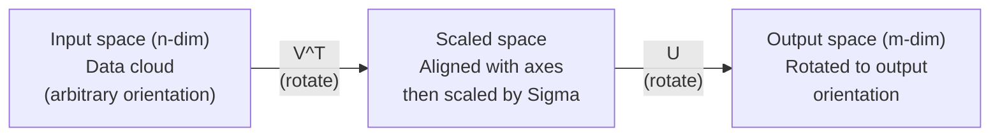
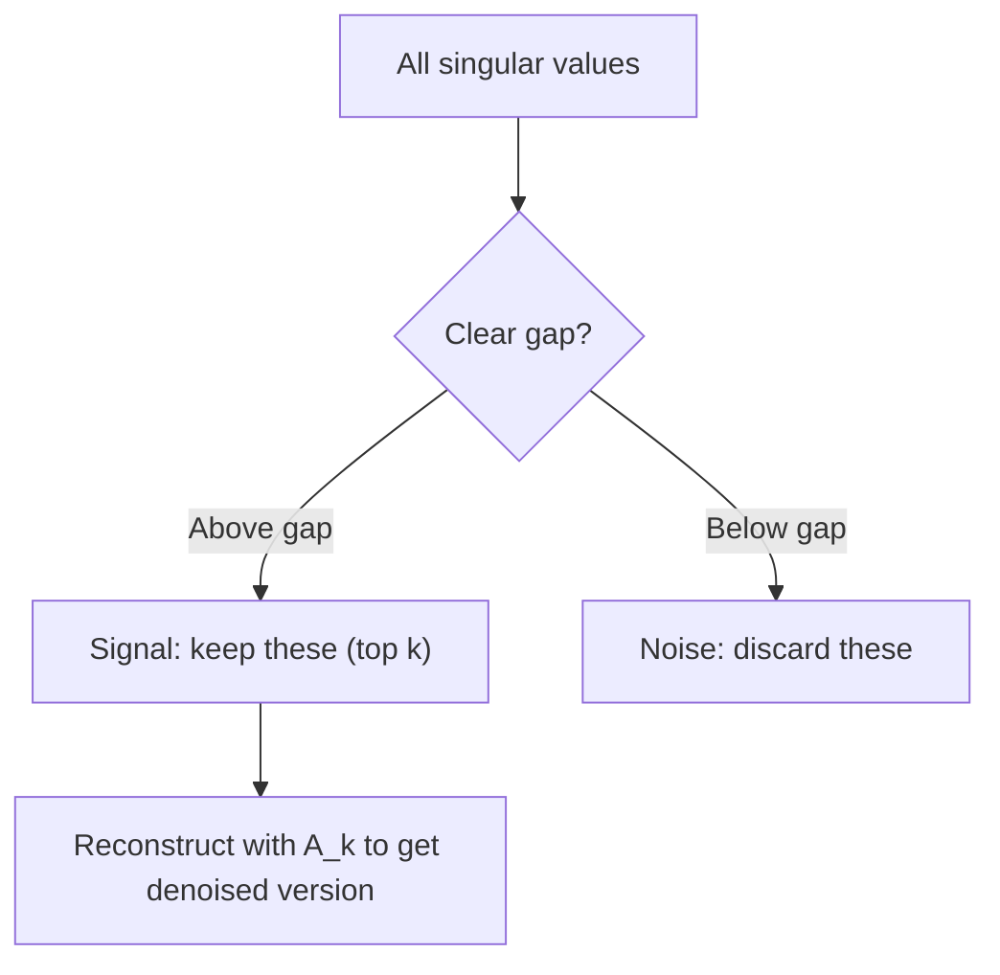

# Descomposición de valores singulares

> El SVD es el cuchillo del ejército suizo de álgebra lineal.

**Type:** Build
**Languages:** Python, Julia
**Prerequisites:** Phase 1, Lessons 01 (Linear Algebra Intuition), 02 (Vectors & Matrices Operations), 03 (Matrix Transformations)
**Time:** ~120 minutes

## Objetivos de aprendizaje

- Implemente SVD a través de la iteración de potencia y explique el significado geométrico de U, Sigma y V^T
- Aplicar SVD truncado para comprimir la imagen y medir la relación de compresión vs error de reconstrucción
- Computa el pseudoinverso Moore-Penrose a través de SVD para resolver sistemas de cuadrados mínimos sobredeterminados
- Conectar SVD a PCA, sistemas de recomendación (factores latente) y análisis semántico latente en PNL

## El problema

Es posible que sea una tabla de frecuencia a término de documento, es posible que sea el valor de píxeles de una imagen, es necesario comprimirla, denosarla, encontrar una estructura oculta en ella o resolver un sistema de mínimos cuadrados con ella.

El SVD funciona en cualquier matriz, cualquier forma, cualquier rango, sin condiciones, descompone la matriz en tres factores que revelan la geometría de lo que la matriz hace al espacio. Es la factorization más general y más útil en todo el álgebra lineal.

## El concepto

### Lo que hace el SVD geométricamente

Cada matriz, independientemente de su forma, realiza tres operaciones en secuencia: girar, escalar, girar.

```
A = U * Sigma * V^T

      m x n     m x m    m x n    n x n
     (any)    (rotate)  (scale)  (rotate)
```

Dado cualquier matriz A, el SVD la calcula en:
- V^T gira vectores en el espacio de entrada (n-dimensional)
- Escales sigma a lo largo de cada eje (estiramientos o compresiones)
- U gira el resultado en el espacio de salida (m-dimensional)



Piensa en esto de esta manera. Le das a SVD una matriz. Te dice: "Esta matriz toma una esfera de entradas, primero la gira por V^T, luego la estira en un elipsoide por Sigma, luego gira el elipsoide por U". Los valores singulares son las longitudes de los ejes del elipsoide.

### La completa descomposición

Para una matriz A de forma m x n:

```
A = U * Sigma * V^T

where:
  U     is m x m, orthogonal (U^T U = I)
  Sigma is m x n, diagonal (singular values on the diagonal)
  V     is n x n, orthogonal (V^T V = I)

The singular values sigma_1 >= sigma_2 >= ... >= sigma_r > 0
where r = rank(A)
```

Las columnas de U se llaman vectores singulares izquierdas. Las columnas de V se llaman vectores singulares rectos. Las entradas diagonales de Sigma se llaman valores singulares. Siempre son no negativos y se ordenan convencionalmente en orden decreciente.

### Véctores singulares izquierdas, valores singulares, vectores singulares derecho

Cada componente del SVD tiene un significado geométrico distinto.

**Right singular vectors (columns of V):**Estas forman una base ortónormal para el espacio de entrada (R^n). Son las direcciones en el espacio de entrada que la matriz mapea a direcciones ortogonales en el espacio de salida.

**Singular values (diagonal of Sigma):**Estos son los factores de escala. el i-o valor singular le dice cuánto la matriz se extiende a lo largo del i-o derecho vector singular. un valor singular de cero significa que la matriz aplasta esa dirección por completo.

**Left singular vectors (columns of U):**Estos forman una base ortónormal para el espacio de salida (R^m). El i-o vector singular izquierdo es la dirección en el espacio de salida donde el i-o vector singular derecho aterriza (después de escalar).

La relación entre ellos:

```
A * v_i = sigma_i * u_i

The matrix A takes the i-th right singular vector v_i,
scales it by sigma_i, and maps it to the i-th left singular vector u_i.
```

Esto le da una imagen de coordenadas por coordenadas de lo que cualquier matriz hace.

### Forma de producto exterior

El SVD se puede escribir como una suma de matrices de rango 1:

```
A = sigma_1 * u_1 * v_1^T + sigma_2 * u_2 * v_2^T + ... + sigma_r * u_r * v_r^T

Each term sigma_i * u_i * v_i^T is a rank-1 matrix (an outer product).
The full matrix is the sum of r such matrices, where r is the rank.
```

Esta forma es la base de la aproximación de rango bajo. Cada término añade una capa de estructura. El primer término capta el patrón más importante. El segundo capta el siguiente más importante. Y así sucesivamente. Truncando esta suma le da la mejor aproximación posible en cualquier rango dado.

```
Rank-1 approx:    A_1 = sigma_1 * u_1 * v_1^T
                  (captures the dominant pattern)

Rank-2 approx:    A_2 = sigma_1 * u_1 * v_1^T + sigma_2 * u_2 * v_2^T
                  (captures the two most important patterns)

Rank-k approx:    A_k = sum of top k terms
                  (optimal by the Eckart-Young theorem)
```

### Relación con la propia composición

Los valores singulares y los vectores de A provienen directamente de los valores propios y los vectores propios de A^T A y A^T.

```
A^T A = V * Sigma^T * U^T * U * Sigma * V^T
      = V * Sigma^T * Sigma * V^T
      = V * D * V^T

where D = Sigma^T * Sigma is a diagonal matrix with sigma_i^2 on the diagonal.

So:
- The right singular vectors (V) are eigenvectors of A^T A
- The singular values squared (sigma_i^2) are eigenvalues of A^T A

Similarly:
A A^T = U * Sigma * V^T * V * Sigma^T * U^T
      = U * Sigma * Sigma^T * U^T

So:
- The left singular vectors (U) are eigenvectors of A A^T
- The eigenvalues of A A^T are also sigma_i^2
```

Esta conexión le dice tres cosas:
1. Los valores singulares son siempre reales y no negativos (son raíces cuadradas de valores propios de una matriz semidefinida positiva).
2. Se puede calcular SVD a través de la propia composición de A^T A, pero esto cuadra el número de condición y pierde la precisión numérica.
3. Cuando A es cuadrado y semi-definido positivo simétrico, SVD y la composición propia son lo mismo.

### VVD truncado: aproximación de bajo rango

El teorema de Eckart-Young-Mirsky establece que la mejor aproximación de rango k a A (tanto en la norma de Frobenius como en la espectral) se obtiene manteniendo solo los valores singulares superiores k y sus vectores correspondientes:

```
A_k = U_k * Sigma_k * V_k^T

where:
  U_k     is m x k  (first k columns of U)
  Sigma_k is k x k  (top-left k x k block of Sigma)
  V_k     is n x k  (first k columns of V)

Approximation error = sigma_{k+1}  (in spectral norm)
                    = sqrt(sigma_{k+1}^2 + ... + sigma_r^2)  (in Frobenius norm)
```

Esta no es sólo una aproximación "buena". Es probadamente la mejor aproximación posible de rango k. Ninguna otra matriz de rango k está más cerca de A.

| Component | Relative magnitude | Kept in rank-3 approx? |
|-----------|-------------------|------------------------|
| sigma_1 | Largest | Yes |
| sigma_2 | Large | Yes |
| sigma_3 | Medium-large | Yes |
| sigma_4 | Medium | No (error) |
| sigma_5 | Medium-small | No (error) |
| sigma_6 | Small | No (error) |
| sigma_7 | Very small | No (error) |
| sigma_8 | Tiny | No (error) |

Mantenga arriba 3: A_3 captura los tres valores singulares más grandes. Error = valores restantes (sigma_4 a sigma_8).

Si los valores singulares se descomponen rápidamente, una pequeña k captura la mayor parte de la matriz.

### Compresión de imagen con SVD

Una imagen a escala de gris es una matriz de intensidades de píxeles. Una imagen de 800x600 tiene 480.000 valores.

```
Original image: 800 x 600 = 480,000 values

SVD with rank k:
  U_k:      800 x k values
  Sigma_k:  k values
  V_k:      600 x k values
  Total:    k * (800 + 600 + 1) = k * 1401 values

  k=10:   14,010 values   (2.9% of original)
  k=50:   70,050 values  (14.6% of original)
  k=100: 140,100 values  (29.2% of original)

  The compression ratio improves as k gets smaller,
  but visual quality degrades.
```

La clave: las imágenes naturales tienen valores singulares que se descompone rápidamente. Los primeros valores singulares capturan la estructura amplia (formas, gradientes). Los últimos capturan detalles finos y ruido.

### SVD para los sistemas de recomendación

El Premio Netflix hizo esto famoso. Tienes una matriz de calificaciones de películas de usuarios donde la mayoría de las entradas faltan.

```
             Movie1  Movie2  Movie3  Movie4  Movie5
  User1      [  5      ?       3       ?       1  ]
  User2      [  ?      4       ?       2       ?  ]
  User3      [  3      ?       5       ?       ?  ]
  User4      [  ?      ?       ?       4       3  ]

  ? = unknown rating
```

La idea: esta matriz de calificaciones tiene un bajo rango. Los usuarios no tienen gustos completamente independientes. Hay un puñado de factores latentes (acción vs drama, viejo vs nuevo, cerebral vs visceral) que explican la mayoría de las preferencias.

El SVD de la matriz de calificaciones (completa) la descomponen en:
- U: perfiles de usuarios en el espacio de factores latente
- Sigma: importancia de cada factor latente
- V^T: perfiles de películas en el espacio de factores latente

La calificación prevista de un usuario para una película es el producto de puntos de su perfil de usuario con el perfil de la película (pondurado por valores singulares).

En la práctica, se utilizan variantes como el SVD incremental de Simon Funk o ALS (alternando los cuadrados mínimos) que manejan directamente los datos faltantes. Pero la idea principal es la misma: la descomposición de factores latentes a través del SVD.

### SVD en PNL: Análisis semántico latente

El análisis semántico latente (LSA), también llamado indexación semántica latente (LSI), aplica SVD a una matriz de documento término.

```
             Doc1   Doc2   Doc3   Doc4
  "cat"      [  3      0      1      0  ]
  "dog"      [  2      0      0      1  ]
  "fish"     [  0      4      1      0  ]
  "pet"      [  1      1      1      1  ]
  "ocean"    [  0      3      0      0  ]

After SVD with rank k=2:

  Each document becomes a point in 2D "concept space."
  Each term becomes a point in the same 2D space.
  Documents about similar topics cluster together.
  Terms with similar meanings cluster together.

  "cat" and "dog" end up near each other (land pets).
  "fish" and "ocean" end up near each other (water concepts).
  Doc1 and Doc3 cluster if they share similar topics.
```

El LSA fue uno de los primeros métodos exitosos para capturar la similitud semántica de texto crudo. Funciona porque los términos sinónimos tienden a aparecer en documentos similares, por lo que SVD los agrupa en las mismas dimensiones latentes.

### SVD para la reducción del ruido

Los datos ruidosos tienen la señal concentrada en los valores singulares superiores y el ruido distribuido a través de todos los valores singulares.

**Clean signal singular values:**

| Component | Magnitude | Type |
|-----------|-----------|------|
| sigma_1 | Very large | Signal |
| sigma_2 | Large | Signal |
| sigma_3 | Medium | Signal |
| sigma_4 | Near zero | Negligible |
| sigma_5 | Near zero | Negligible |

**Noisy signal singular values (noise adds to all):**

| Component | Magnitude | Type |
|-----------|-----------|------|
| sigma_1 | Very large | Signal |
| sigma_2 | Large | Signal |
| sigma_3 | Medium | Signal |
| sigma_4 | Small | Noise |
| sigma_5 | Small | Noise |
| sigma_6 | Small | Noise |
| sigma_7 | Small | Noise |



Esta técnica se utiliza en el procesamiento de señales, medición científica y limpieza de datos.

### Pseudoinversión a través de SVD

El pseudoinverso de Moore-Penrose A+ generaliza la inversión de matrices a matrices no cuadradas y singulares.

```
If A = U * Sigma * V^T, then:

A+ = V * Sigma+ * U^T

where Sigma+ is formed by:
  1. Transpose Sigma (swap rows and columns)
  2. Replace each non-zero diagonal entry sigma_i with 1/sigma_i
  3. Leave zeros as zeros

For A (m x n):      A+ is (n x m)
For Sigma (m x n):  Sigma+ is (n x m)
```

Si Ax = b no tiene solución exacta (sistema sobredeterminado), entonces x = A + b es la solución de menor cuadrados (minimiza la AX - b).

```
Overdetermined system (more equations than unknowns):

  [1  1]         [3]
  [2  1] x   =   [5]       No exact solution exists.
  [3  1]         [6]

  x_ls = A+ b = V * Sigma+ * U^T * b

  This gives the x that minimizes the sum of squared residuals.
  Same result as the normal equations (A^T A)^(-1) A^T b,
  but numerically more stable.
```

### Ventajas de estabilidad numérica

Computación de la propia composición de A^T A cuadrados de los valores singulares (valores propios de A^T A son sigma_i^2). Esto cuadrados del número de condición, amplificando errores numéricos.

```
Example:
  A has singular values [1000, 1, 0.001]
  Condition number of A: 1000 / 0.001 = 10^6

  A^T A has eigenvalues [10^6, 1, 10^{-6}]
  Condition number of A^T A: 10^6 / 10^{-6} = 10^{12}

  Computing SVD directly: works with condition number 10^6
  Computing via A^T A:     works with condition number 10^{12}
                           (6 extra digits of precision lost)
```

Los algoritmos modernos de SVD (biodiagnonalización Golub-Kahan) trabajan directamente en A, nunca formando A^T A. Por eso siempre debe preferirse `np.linalg.svd(A)`- ¿ Qué ?`np.linalg.eig(A.T @ A)`¿ Qué ?

### Conexión a PCA

PCA es SVD en datos centrados. Esto no es una analogía. Es literalmente el mismo cálculo.

```
Given data matrix X (n_samples x n_features), centered (mean subtracted):

Covariance matrix: C = (1/(n-1)) * X^T X

PCA finds eigenvectors of C. But:

  X = U * Sigma * V^T    (SVD of X)

  X^T X = V * Sigma^2 * V^T

  C = (1/(n-1)) * V * Sigma^2 * V^T

So the principal components are exactly the right singular vectors V.
The explained variance for each component is sigma_i^2 / (n-1).

In sklearn, PCA is implemented using SVD, not eigendecomposition.
It is faster and more numerically stable.
```

Esto significa que todo lo que aprendiste sobre la reducción de dimensiones en la Lección 10 es SVD bajo el capó.

```figure
svd-rank-reconstruction
```

## Construye el mismo

### Paso 1: SVD desde cero utilizando la iteración de potencia

La idea: para encontrar el mayor valor singular y sus vectores, utilizar la iteración de potencia en A^T A (o A A^T). Luego desinflar la matriz y repetir para el siguiente valor singular.

```python
import numpy as np

def power_iteration(M, num_iters=100):
    n = M.shape[1]
    v = np.random.randn(n)
    v = v / np.linalg.norm(v)

    for _ in range(num_iters):
        Mv = M @ v
        v = Mv / np.linalg.norm(Mv)

    eigenvalue = v @ M @ v
    return eigenvalue, v

def svd_from_scratch(A, k=None):
    m, n = A.shape
    if k is None:
        k = min(m, n)

    sigmas = []
    us = []
    vs = []

    A_residual = A.copy().astype(float)

    for _ in range(k):
        AtA = A_residual.T @ A_residual
        eigenvalue, v = power_iteration(AtA, num_iters=200)

        if eigenvalue < 1e-10:
            break

        sigma = np.sqrt(eigenvalue)
        u = A_residual @ v / sigma

        sigmas.append(sigma)
        us.append(u)
        vs.append(v)

        A_residual = A_residual - sigma * np.outer(u, v)

    U = np.column_stack(us) if us else np.empty((m, 0))
    S = np.array(sigmas)
    V = np.column_stack(vs) if vs else np.empty((n, 0))

    return U, S, V
```

### Paso 2: Prueba y comparación con NumPy

```python
np.random.seed(42)
A = np.random.randn(5, 4)

U_ours, S_ours, V_ours = svd_from_scratch(A)
U_np, S_np, Vt_np = np.linalg.svd(A, full_matrices=False)

print("Our singular values:", np.round(S_ours, 4))
print("NumPy singular values:", np.round(S_np, 4))

A_reconstructed = U_ours @ np.diag(S_ours) @ V_ours.T
print(f"Reconstruction error: {np.linalg.norm(A - A_reconstructed):.8f}")
```

### Paso 3: Demo de compresión de imagen

```python
def compress_image_svd(image_matrix, k):
    U, S, Vt = np.linalg.svd(image_matrix, full_matrices=False)
    compressed = U[:, :k] @ np.diag(S[:k]) @ Vt[:k, :]
    return compressed

image = np.random.seed(42)
rows, cols = 200, 300
image = np.random.randn(rows, cols)

for k in [1, 5, 10, 20, 50]:
    compressed = compress_image_svd(image, k)
    error = np.linalg.norm(image - compressed) / np.linalg.norm(image)
    original_size = rows * cols
    compressed_size = k * (rows + cols + 1)
    ratio = compressed_size / original_size
    print(f"k={k:>3d}  error={error:.4f}  storage={ratio:.1%}")
```

### Paso 4: Reducción del ruido

```python
np.random.seed(42)
clean = np.outer(np.sin(np.linspace(0, 4*np.pi, 100)),
                 np.cos(np.linspace(0, 2*np.pi, 80)))
noise = 0.3 * np.random.randn(100, 80)
noisy = clean + noise

U, S, Vt = np.linalg.svd(noisy, full_matrices=False)
denoised = U[:, :5] @ np.diag(S[:5]) @ Vt[:5, :]

print(f"Noisy error:    {np.linalg.norm(noisy - clean):.4f}")
print(f"Denoised error: {np.linalg.norm(denoised - clean):.4f}")
print(f"Improvement:    {(1 - np.linalg.norm(denoised - clean) / np.linalg.norm(noisy - clean)):.1%}")
```

### Paso 5: Pseudoinversión

```python
A = np.array([[1, 1], [2, 1], [3, 1]], dtype=float)
b = np.array([3, 5, 6], dtype=float)

U, S, Vt = np.linalg.svd(A, full_matrices=False)
S_inv = np.diag(1.0 / S)
A_pinv = Vt.T @ S_inv @ U.T

x_svd = A_pinv @ b
x_lstsq = np.linalg.lstsq(A, b, rcond=None)[0]
x_pinv = np.linalg.pinv(A) @ b

print(f"SVD pseudoinverse solution:  {x_svd}")
print(f"np.linalg.lstsq solution:   {x_lstsq}")
print(f"np.linalg.pinv solution:    {x_pinv}")
```

## Usalo

Las demostraciones de trabajo completas están en `code/svd.py`. Ejecutarlo para ver SVD aplicado a la compresión de imágenes, sistemas de recomendación, análisis semántico latente y reducción del ruido.

```bash
python svd.py
```

La versión de Julia en `code/svd.jl`demuestra los mismos conceptos usando la lengua nativa de Julia `svd()`función y `LinearAlgebra`el paquete.

```bash
julia svd.jl
```

## Envío

Esta lección produce:
- `outputs/skill-svd.md`- una habilidad para saber cuándo y cómo aplicar la SVD en proyectos reales

## Los ejercicios

1. Implemente el SVD completo desde cero sin usar la iteración de potencia. En su lugar, computa la propia composición de A^T A para obtener V y los valores singulares, luego computa U = A V Sigma^{-1}. Compara la precisión numérica con tu versión de iteración de potencia y con NumPy.

2. Cargue una imagen real en escala gris (o convierta en escala gris). Comprimela en las filas 1, 5, 10, 25, 50, 100. Para cada fila, calcula la relación de compresión y el error relativo. Encuentra la fila en la que la imagen se vuelve visualmente aceptable.

3. Construir un pequeño sistema de recomendaciones. Crear una matriz de calificaciones de películas de usuarios 10x8 con algunas entradas conocidas. Rellenar entradas faltantes con medios de fila. Compute SVD y reconstruir una aproximación de rango-3. Utilice la matriz reconstruida para predecir las calificaciones faltantes. Verifique que las predicciones son razonables.

4. Crea una matriz de 100x50 documentos con 3 temas sintéticos. Cada tema tiene 5 términos asociados. Agregue ruido. Aplique SVD y verifique que los tres valores singulares superiores son mucho más grandes que los demás. Proyecte documentos en el espacio latente 3D y compruebe que los documentos del mismo grupo de temas juntos.

5. Generar una matriz de bajo rango limpia (rango 3, tamaño 50x40) y agregar el ruido gaussiano en diferentes niveles (sigma = 0.1, 0.5, 1.0, 2.0). Para cada nivel de ruido, encontrar el rango de truncamiento óptimo barriendo k de 1 a 40 y midiendo el error de reconstrucción en relación con la matriz limpia.

## Términos clave

| Term | What people say | What it actually means |
|------|----------------|----------------------|
| SVD | "Factor any matrix" | Decompose A into U Sigma V^T where U and V are orthogonal and Sigma is diagonal with non-negative entries. Works for any matrix of any shape. |
| Singular value | "How important this component is" | The i-th diagonal entry of Sigma. Measures how much the matrix stretches along the i-th principal direction. Always non-negative, sorted in decreasing order. |
| Left singular vector | "Output direction" | A column of U. The direction in output space that the i-th right singular vector maps to (after scaling by sigma_i). |
| Right singular vector | "Input direction" | A column of V. The direction in input space that the matrix maps to the i-th left singular vector (after scaling by sigma_i). |
| Truncated SVD | "Low-rank approximation" | Keep only the top k singular values and their vectors. Produces the provably best rank-k approximation to the original matrix (Eckart-Young theorem). |
| Rank | "True dimensionality" | The number of non-zero singular values. Tells you how many independent directions the matrix actually uses. |
| Pseudoinverse | "Generalized inverse" | V Sigma+ U^T. Inverts non-zero singular values, leaves zeros as zeros. Solves least-squares problems for non-square or singular matrices. |
| Condition number | "How sensitive to errors" | sigma_max / sigma_min. A large condition number means small input changes cause large output changes. SVD reveals this directly. |
| Latent factor | "Hidden variable" | A dimension in the low-rank space discovered by SVD. In recommendations, a latent factor might correspond to genre preference. In NLP, it might correspond to a topic. |
| Frobenius norm | "Total matrix size" | Square root of the sum of squared entries. Equals the square root of the sum of squared singular values. Used to measure approximation error. |
| Eckart-Young theorem | "SVD gives the best compression" | For any target rank k, the truncated SVD minimizes the approximation error over all possible rank-k matrices. |
| Power iteration | "Find the biggest eigenvector" | Repeatedly multiply a random vector by the matrix and normalize. Converges to the eigenvector with the largest eigenvalue. The building block of many SVD algorithms. |

## Leer más

- [Gilbert Strang: Linear Algebra and Its Applications, Chapter 7](https://math.mit.edu/~gs/linearalgebra/)- tratamiento exhaustivo de la VVD con aplicaciones
- [3Blue1Brown: But what is the SVD?](https://www.youtube.com/watch?v=vSczTbgc8Rc)- Intuición geométrica para el SVD
- [We Recommend a Singular Value Decomposition](https://www.ams.org/publicoutreach/feature-column/fcarc-svd)- una visión general accesible de la Sociedad Americana de Matemáticas
- [Netflix Prize and Matrix Factorization](https://sifter.org/~simon/journal/20061211.html)- La publicación original de Simon Funk en el blog de SVD para recomendaciones
- [Latent Semantic Analysis](https://en.wikipedia.org/wiki/Latent_semantic_analysis)- la aplicación original de la PNL de la SVD
- [Numerical Linear Algebra by Trefethen and Bau](https://people.maths.ox.ac.uk/trefethen/text.html)- el estándar de oro para comprender los algoritmos de SVD y sus propiedades numéricas
