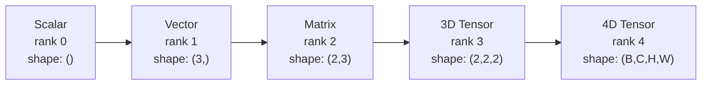
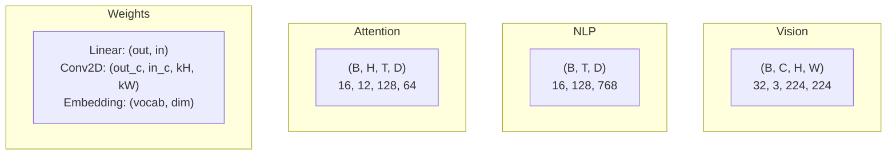
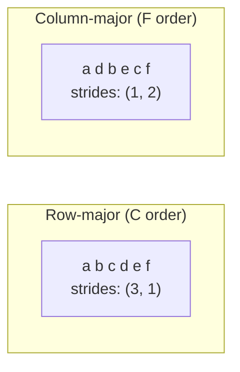
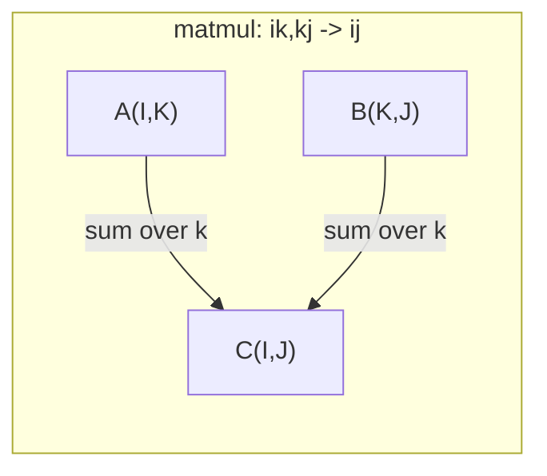

# Operaciones de tensión

> Los tensores son el lenguaje común entre los datos y el aprendizaje profundo. Cada imagen, cada frase, cada gradiente fluye a través de ellos.

**Type:** Build
**Language:**Python
**Prerequisites:** Phase 1, Lessons 01 (Linear Algebra Intuition), 02 (Vectors, Matrices & Operations)
**Time:** ~90 minutes

## Objetivos de aprendizaje

- Implementar una clase de tensores con operaciones de forma, pasos, remodelación, transposición y elementos desde cero
- Aplicar las reglas de radiodifusión para operar en tensores de diferentes formas sin copiar datos
- Escriba expresiones de unenum para productos de puntos, multiplicidades de matriz, productos externos y operaciones en lote
- Trazar las formas exactas del tensor a través de cada paso de la atención multi-cabeza

## El problema

Construye un transformador, el pase delantero se ve limpio, lo ejecuta y obtiene:`RuntimeError: mat1 and mat2 shapes cannot be multiplied (32x768 and 512x768)`Miras las formas, intentas una transposición, ahora dice:`Expected 4D input (got 3D input)`Si se agrega un unclamp, se rompe otra cosa.

Los errores de forma son el error más común en el código de aprendizaje profundo. No son difíciles conceptualmente, cada operación tiene un contrato de forma, pero se multiplican rápidamente. Un transformador tiene docenas de remodelaciones, transpuestas y transmisiones encadenadas. Un eje equivocado y las cascadas de error. Peor aún, algunos errores de forma no arrojan errores en absoluto. Producen basura silenciosamente transmitiendo a lo largo de la dimensión equivocada o sumando sobre el eje equivocado.

Las matrices manejan relaciones en pareja entre dos conjuntos de cosas. Los datos reales no encajan en dos dimensiones. Un lote de 32 imágenes RGB en 224x224 es un tensor 4D: `(32, 3, 224, 224)`La autoatención con 12 cabezas es también 4D:`(batch, heads, seq_len, head_dim)`Necesitas una estructura de datos que se generalice a un número de dimensiones, con operaciones que compongan limpio a través de todos ellos. Esa estructura es el tensor.

## El concepto

### Qué es un tensor

Un tensor es una matriz multidimensional de números con un tipo de datos uniforme.**rank**(o **order**Cada dimensión es una**axis**- El .**shape**es un tuple que enumera el tamaño a lo largo de cada eje.



El total de elementos = producto de todos los tamaños.`(2, 3, 4)`Tiene`2 * 3 * 4 = 24`elementos.

### Las formas de tensor en el aprendizaje profundo

Diferentes tipos de datos se mapean a formas tensoras específicas por convención.



PyTorch utiliza NCHW (canal-first). TensorFlow se configura por defecto en NHWC (canal-last).

### Cómo funciona el diseño de memoria

Una matriz 2D en la memoria es una secuencia 1D de bytes. **Strides**te dicen cuántos elementos saltar para mover un paso a lo largo de cada eje.



Transpose no mueve datos. Es intercambiar los pasos, haciendo el tensor **non-contiguous**-- los elementos de una fila ya no son adyacentes en la memoria.

### Reglas de radiodifusión

La transmisión permite operar en tensores de diferentes formas sin copiar datos. Alinear formas desde la derecha. Dos dimensiones son compatibles cuando son iguales o una es 1.

```
Tensor A:     (8, 1, 6, 1)
Tensor B:        (7, 1, 5)
Padded B:     (1, 7, 1, 5)
Result:       (8, 7, 6, 5)
```

### Einsum: la operación universal del tensor

La suma de Einstein etiqueta cada eje con una letra. Los ejes en la entrada pero no la salida se suman. Los ejes en ambos se mantienen.



Modelos clave: `i,i->`(producto punto), `i,j->ij`(producto externo), `ii->`(traza), `ij->ji`(transponer), `bij,bjk->bik`(batch matmul), `bhtd,bhsd->bhts`(puntuaciones de atención).

```figure
tensor-broadcast
```

## Construye el mismo

El código vive en`code/tensors.py`Cada paso hace referencia a la aplicación de la misma.

### Paso 1: almacenamiento de tensión y pasos

Un tensor almacena una lista plana de números más metadatos de forma.

```python
class Tensor:
    def __init__(self, data, shape=None):
        if isinstance(data, (list, tuple)):
            self._data, self._shape = self._flatten_nested(data)
        elif isinstance(data, np.ndarray):
            self._data = data.flatten().tolist()
            self._shape = tuple(data.shape)
        else:
            self._data = [data]
            self._shape = ()

        if shape is not None:
            total = reduce(lambda a, b: a * b, shape, 1)
            if total != len(self._data):
                raise ValueError(
                    f"Cannot reshape {len(self._data)} elements into shape {shape}"
                )
            self._shape = tuple(shape)

        self._strides = self._compute_strides(self._shape)

    @staticmethod
    def _compute_strides(shape):
        if len(shape) == 0:
            return ()
        strides = [1] * len(shape)
        for i in range(len(shape) - 2, -1, -1):
            strides[i] = strides[i + 1] * shape[i + 1]
        return tuple(strides)
```

Para la forma`(3, 4)`, los pasos son`(4, 1)`-- saltar 4 elementos para avanzar una fila, saltar 1 elemento para avanzar una columna.

### Paso 2: Reaprovechar, apretar, desprender

Reshape cambia la forma sin cambiar el orden de los elementos. El número total de elementos debe permanecer igual.`-1`para una dimensión para inferir su tamaño.

```python
t = Tensor(list(range(12)), shape=(2, 6))
r = t.reshape((3, 4))
r = t.reshape((-1, 3))
```

El compresión elimina ejes de tamaño 1. el despresión inserta uno. el despresión es fundamental para la transmisión - un vector de sesgo`(D,)`añadido a un lote `(B, T, D)`Necesitas de no apretar a `(1, 1, D)`¿ Qué ?

```python
t = Tensor(list(range(6)), shape=(1, 3, 1, 2))
s = t.squeeze()
v = Tensor([1, 2, 3])
u = v.unsqueeze(0)
```

### Paso 3: Transponer y permutear

Transponer swaps dos ejes. Permute reordena todos los ejes. Así es como se convierte entre NCHW y NHWC.

```python
mat = Tensor(list(range(6)), shape=(2, 3))
tr = mat.transpose(0, 1)

t4d = Tensor(list(range(24)), shape=(1, 2, 3, 4))
perm = t4d.permute((0, 2, 3, 1))
```

Después de transponer o permutear, el tensor no es contiguo en la memoria.`view`fallas en los tensores no contiguos -- uso `reshape`o llamar`.contiguous()`- ¿Qué?

### Paso 4: Operaciones y reducciones según elementos

Las operaciones de elemento-sabio (agrega, multiplica, restar) se aplican de forma independiente a cada elemento y conservan la forma.

```python
a = Tensor([[1, 2], [3, 4]])
b = Tensor([[10, 20], [30, 40]])
c = a + b
d = a * 2
s = a.sum(axis=0)
```

El promedio mundial de la agrupación en una CNN: `(B, C, H, W).mean(axis=[2, 3])`produce `(B, C)`. Secuencia media de la agrupación en PNL: `(B, T, D).mean(axis=1)`produce `(B, D)`¿ Qué ?

### Paso 5: Radiodifusión con NumPy

El `demo_broadcasting_numpy()`función en `tensors.py`muestra los patrones del núcleo.

```python
activations = np.random.randn(4, 3)
bias = np.array([0.1, 0.2, 0.3])
result = activations + bias

images = np.random.randn(2, 3, 4, 4)
scale = np.array([0.5, 1.0, 1.5]).reshape(1, 3, 1, 1)
result = images * scale

a = np.array([1, 2, 3]).reshape(-1, 1)
b = np.array([10, 20, 30, 40]).reshape(1, -1)
outer = a * b
```

Distancia en pareja a través de la radiodifusión: remodelación `(M, 2)`¿ Qué ?`(M, 1, 2)`y `(N, 2)`¿ Qué ?`(1, N, 2)`, restar, cuadrado, sumar a lo largo del último eje, tomar raíz cuadrada. Resultado: `(M, N)`¿ Qué ?

### Paso 6: Operaciones de Einsum

El `demo_einsum()`y `demo_einsum_gallery()`Las funciones pasan por todos los patrones comunes.

```python
a = np.array([1.0, 2.0, 3.0])
b = np.array([4.0, 5.0, 6.0])
dot = np.einsum("i,i->", a, b)

A = np.array([[1, 2], [3, 4], [5, 6]], dtype=float)
B = np.array([[7, 8, 9], [10, 11, 12]], dtype=float)
matmul = np.einsum("ik,kj->ij", A, B)

batch_A = np.random.randn(4, 3, 5)
batch_B = np.random.randn(4, 5, 2)
batch_mm = np.einsum("bij,bjk->bik", batch_A, batch_B)
```

El coste computacional de una contracción es el producto de todos los tamaños de índices (contidos y sumados).`bij,bjk->bik`con B=32, I=128, J=64, K=128: `32 * 128 * 64 * 128 = 33,554,432`el número de veces adicionales.

### Paso 7: Mecanismo de atención a través del einsum

El `demo_attention_einsum()`La función implementa atención de múltiples cabezas de extremo a extremo.

```python
B, H, T, D = 2, 4, 8, 16
E = H * D

X = np.random.randn(B, T, E)
W_q = np.random.randn(E, E) * 0.02

Q = np.einsum("bte,ek->btk", X, W_q)
Q = Q.reshape(B, T, H, D).transpose(0, 2, 1, 3)

scores = np.einsum("bhtd,bhsd->bhts", Q, K) / np.sqrt(D)
weights = softmax(scores, axis=-1)
attn_output = np.einsum("bhts,bhsd->bhtd", weights, V)

concat = attn_output.transpose(0, 2, 1, 3).reshape(B, T, E)
output = np.einsum("bte,ek->btk", concat, W_o)
```

Cada paso es una operación tensora: proyección (matmul a través de einsum), división de cabeza (reforma + transposición), puntajes de atención (batch matmul a través de einsum), suma ponderada (batch matmul a través de einsum), fusión de cabeza (transposición + reforma), proyección de salida (matmul a través de einsum).

## Usalo

### Scratch vs NumPy

| Operation | Scratch (Tensor class) | NumPy |
|---|---|---|
| Create | `Tensor([[1,2],[3,4]])` | `np.array([[1,2],[3,4]])` |
| Reshape | `t.reshape((3,4))` | `a.reshape(3,4)` |
| Transpose | `t.transpose(0,1)` | `a.T` or `a.transpose(0,1)` |
| Squeeze | `t.squeeze(0)` | `np.squeeze(a, 0)` |
| Sum | `t.sum(axis=0)` | `a.sum(axis=0)` |
| Einsum | N/A | `np.einsum("ij,jk->ik", a, b)` |

### Scratch vs PyTorch

```python
import torch

t = torch.tensor([[1, 2, 3], [4, 5, 6]], dtype=torch.float32)
t.shape
t.stride()
t.is_contiguous()

t.reshape(3, 2)
t.unsqueeze(0)
t.transpose(0, 1)
t.transpose(0, 1).contiguous()

torch.einsum("ik,kj->ij", A, B)
```

PyTorch añade autograd, soporte de GPU y kernels BLAS optimizados. La semántica de forma es idéntica. Si entiendes la versión de rasguño, los errores de forma PyTorch se vuelven legibles.

### Cada capa de red neuronal como una operación tensora

| Operation | Tensor Form | Einsum |
|---|---|---|
| Linear layer | `Y = X @ W.T + b` | `"bd,od->bo"` + bias |
| Attention QKV | `Q = X @ W_q` | `"btd,dh->bth"` |
| Attention scores | `Q @ K.T / sqrt(d)` | `"bhtd,bhsd->bhts"` |
| Attention output | `softmax(scores) @ V` | `"bhts,bhsd->bhtd"` |
| Batch norm | `(X - mu) / sigma * gamma` | element-wise + broadcast |
| Softmax | `exp(x) / sum(exp(x))` | element-wise + reduction |

## Envío

Esta lección produce dos instrucciones reutilizables:

1. **`outputs/prompt-tensor-shapes.md`**-- Una instrucción sistemática para deshacerse de las incompatibilidades de forma del tensor. Incluye tablas de decisión para cada operación común (matmul, transmisión, cat, lineal, Conv2d, BatchNorm, softmax) y una tabla de búsqueda de corrección.

2. **`outputs/prompt-tensor-debugger.md`**-- Una instrucción de depuración paso a paso que pegas en cualquier asistente de IA cuando un error de forma te bloquea.

## Los ejercicios

1. **Easy -- Reshape round-trip.**Tome un tensor de forma`(2, 3, 4)`- Reconfigúralo para que sea ...`(6, 4)`, luego a`(24,)`, luego regreso a `(2, 3, 4)`. El orden de los elementos de verificación se conserva en cada paso mediante la impresión de los datos planos.

2. **Medium -- Implement broadcasting.**Extender el `Tensor`clase con un `broadcast_to(shape)`método que expande las dimensiones de tamaño 1 para que coincidan con una forma objetivo.`_elementwise_op`para transmitir automáticamente antes de operar.`(3, 1)`y `(1, 4)`producido `(3, 4)`¿ Qué ?

3. **Hard -- Build einsum from scratch.**Implementar una base `einsum(subscripts, *tensors)`Función que maneje al menos: producto punto (`i,i->`), multiplicar la matriz (`ij,jk->ik`), producto exterior (`i,j->ij`), y trasponer (`ij->ji`Repasar la cadena de subcritos, identificar índices contratados y recorrer todas las combinaciones de índices.`np.einsum`¿ Qué ?

4. **Hard -- Attention shape tracker.**Escriba una función que toma `batch_size`¿ Qué ?`seq_len`¿ Qué ?`embed_dim`, y `num_heads`como entradas e imprime la forma exacta en cada paso de la atención multi-cabeza: entrada, proyección Q/K/V, división de cabeza, puntuaciones de atención, pesos de softmax, suma ponderada, cabeza fusionada, proyección de salida.`demo_attention_einsum()`de salida.

## Términos clave

| Term | What people say | What it actually means |
|---|---|---|
| Tensor | "A matrix but more dimensions" | A multi-dimensional array with uniform type and defined shape, strides, and operations |
| Rank | "The number of dimensions" | The number of axes. A matrix has rank 2, not rank equal to its matrix rank |
| Shape | "The size of the tensor" | A tuple listing the size along each axis. `(2, 3)` means 2 rows, 3 columns |
| Stride | "How memory is laid out" | The number of elements to skip to advance one position along each axis |
| Broadcasting | "It just works when shapes differ" | A strict set of rules: align from right, dimensions must be equal or one must be 1 |
| Contiguous | "The tensor is normal" | Elements stored sequentially in memory with no gaps or reordering from the logical layout |
| Einsum | "A fancy way to write matmul" | A general notation that expresses any tensor contraction, outer product, trace, or transpose in one line |
| View | "Same as reshape" | A tensor sharing the same memory buffer but with different shape/stride metadata. Fails on non-contiguous data |
| Contraction | "Summing over an index" | The general operation where a shared index between tensors is multiplied and summed, producing a lower-rank result |
| NCHW / NHWC | "PyTorch vs TensorFlow format" | Memory layout conventions for image tensors. NCHW puts channels before spatial dims, NHWC puts them after |

## Leer más

- [NumPy Broadcasting](https://numpy.org/doc/stable/user/basics.broadcasting.html)-- Las reglas canónicas con ejemplos visuales
- [PyTorch Tensor Views](https://pytorch.org/docs/stable/tensor_view.html)-- Cuando las vistas funcionan y cuando copian
- [einops](https://github.com/arogozhnikov/einops)-- Una biblioteca que hace que el remodelado del tensor sea legible y seguro
- [The Illustrated Transformer](https://jalammar.github.io/illustrated-transformer/)-- Visualiza las formas de tensor fluyendo a través de la atención
- [Einstein Summation in NumPy](https://numpy.org/doc/stable/reference/generated/numpy.einsum.html)-- Documentación completa de un sumo con ejemplos
