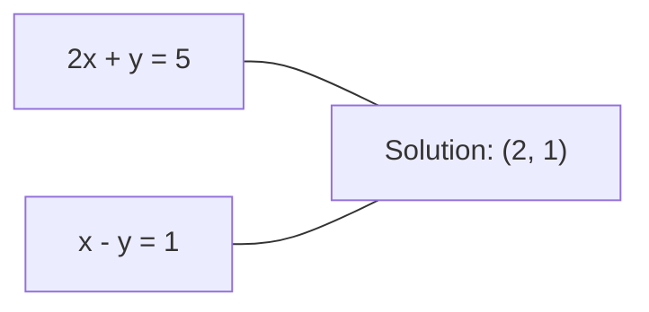
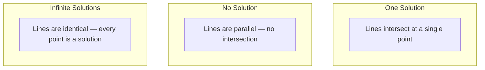

# Sistemas lineales

> Resolver Ax = b es el problema más antiguo en matemáticas que aún maneja tu red neuronal.

**Type:** Build
**Language:**Python
**Prerequisites:** Phase 1, Lessons 01 (Linear Algebra Intuition), 02 (Vectors & Matrices), 03 (Matrix Transformations)
**Time:** ~120 minutes

## Objetivos de aprendizaje

- Resolver Ax = b utilizando la eliminación de Gaussian con la sustitución parcial y la sustitución de atrás
- Matrices de factores con descomposiciones LU, QR y Cholesky y explicar cuándo cada una es apropiada
- Derivar las ecuaciones normales para los cuadrados mínimos y conectarlos a regresión lineal y de cresta
- Diagnóstico de sistemas mal condicionados utilizando el número de condición y aplicar regularización para estabilizarlos

## El problema

Cada vez que entrenas una regresión lineal, resuelves un sistema lineal. Cada vez que computes un ajuste de mínimos cuadrados, resuelves un sistema lineal. Cada vez que una capa de red neuronal computa.`y = Wx + b`Cuando se añade regularización, se modifica el sistema. Cuando se utiliza procesos de Gaussian, se hace una matriz. Cuando se invierte una matriz de covarianza para la distancia de Mahalanobis, se resuelve un sistema lineal.

La ecuación Ax = b aparece en todas partes. A es una matriz de coeficientes conocidos. b es un vector de resultados conocidos. x es el vector de los desconocidos que desea encontrar. En regresión lineal, A es su matriz de datos, b es su vector objetivo y x es el vector de peso. Todo el modelo se reduce a: encontrar x de tal manera que Ax esté lo más cerca posible de b.

Esta lección construye todos los métodos principales para resolver esa ecuación desde cero. Comprenderá por qué algunos métodos son rápidos y otros estables, por qué algunos funcionan solo para sistemas cuadrados y otros manejan los excesivamente determinados, y por qué el número de condición de su matriz determina si su respuesta significa algo en absoluto.

## El concepto

### Lo que Ax = b significa geométricamente

Un sistema de ecuaciones lineales tiene una interpretación geométrica. Cada ecuación define un hiperplano. La solución es el punto (o conjunto de puntos) donde todos los hiperplanos se cruzan.

```
2x + y = 5          Two lines in 2D.
x - y  = 1          They intersect at x=2, y=1.
```



Tres cosas pueden suceder:



En forma de matriz, "una solución" significa que A es invertible. "Ninguna solución" significa que el sistema es inconsistente. "Soluciones infinitas" significa que A tiene un espacio nulo. La mayoría de los problemas de ML caen en la categoría "no solución exacta" porque tienes más ecuaciones (puntos de datos) que desconocidos (parámetros). Es ahí donde entra el menor número de cuadrados.

### Imagen de columna vs imagen de fila

Hay dos maneras de leer Ax = b.

**Row picture.**Cada fila de A define una ecuación. Cada ecuación es un hiperplano. La solución es donde se cruzan todas.

**Column picture.**Cada columna de A es un vector. La pregunta es: ¿qué combinación lineal de las columnas de A produce b?

```
A = | 2  1 |    b = | 5 |
    | 1 -1 |        | 1 |

Row picture: solve 2x + y = 5 and x - y = 1 simultaneously.

Column picture: find x1, x2 such that:
  x1 * [2, 1] + x2 * [1, -1] = [5, 1]
  2 * [2, 1] + 1 * [1, -1] = [4+1, 2-1] = [5, 1]   check.
```

Si b se encuentra en el espacio de columna de A, el sistema tiene una solución. Si b no lo hace, se encuentra el punto más cercano en el espacio de columna. Ese punto más cercano es la solución de cuadrados mínimos.

### Eliminación gaussiana

La eliminación de Gaussian transforma Ax = b en un sistema triangular superior Ux = c que se resuelve mediante la sustitución posterior. Es el método más directo.

El algoritmo:

```
1. For each column k (the pivot column):
   a. Find the largest entry in column k at or below row k (partial pivoting).
   b. Swap that row with row k.
   c. For each row i below k:
      - Compute multiplier m = A[i][k] / A[k][k]
      - Subtract m times row k from row i.
2. Back substitute: solve from the last equation upward.
```

Ejemplo:

```
Original:
| 2  1  1 | 8 |       R2 = R2 - (2)R1     | 2  1   1 |  8 |
| 4  3  3 |20 |  -->  R3 = R3 - (1)R1 --> | 0  1   1 |  4 |
| 2  3  1 |12 |                            | 0  2   0 |  4 |

                       R3 = R3 - (2)R2     | 2  1   1 |  8 |
                                       --> | 0  1   1 |  4 |
                                           | 0  0  -2 | -4 |

Back substitute:
  -2 * x3 = -4    -->  x3 = 2
  x2 + 2  = 4     -->  x2 = 2
  2*x1 + 2 + 2 = 8 --> x1 = 2
```

La eliminación de Gaussian cuesta operaciones O ((n^3). para un sistema 1000x1000, eso es aproximadamente mil millones de operaciones de puntos flotantes.

### La rotación parcial: por qué importa

Sin pivotar, la eliminación gaussiana puede fallar o producir basura. Si un elemento pivot es cero, se divide por cero. Si es pequeño, se amplifican los errores de redondeo.

```
Bad pivot:                       With partial pivoting:
| 0.001  1 | 1.001 |            Swap rows first:
| 1      1 | 2     |            | 1      1 | 2     |
                                 | 0.001  1 | 1.001 |
m = 1/0.001 = 1000              m = 0.001/1 = 0.001
R2 = R2 - 1000*R1               R2 = R2 - 0.001*R1
| 0.001  1     | 1.001   |      | 1      1     | 2     |
| 0     -999   | -999.0  |      | 0      0.999 | 0.999 |

x2 = 1.000 (correct)            x2 = 1.000 (correct)
x1 = (1.001 - 1)/0.001          x1 = (2 - 1)/1 = 1.000 (correct)
   = 0.001/0.001 = 1.000        Stable because the multiplier is small.
```

En la aritmética de puntos flotantes con precisión limitada, la versión sin pivot puede perder cifras significativas.

### Descomposición de las LU

La matriz de descomposición de LU A en una matriz triangular inferior L y una matriz triangular superior U: A = LU. La matriz L almacena los multiplicadores de la eliminación de Gaussian.

```
A = L @ U

| 2  1  1 |   | 1  0  0 |   | 2  1   1 |
| 4  3  3 | = | 2  1  0 | @ | 0  1   1 |
| 2  3  1 |   | 1  2  1 |   | 0  0  -2 |
```

¿Por qué factor en lugar de simplemente eliminar? Porque una vez que tienes L y U, resolver Ax = b para cualquier nueva b cuesta sólo O ((n^2):

```
Ax = b
LUx = b
Let y = Ux:
  Ly = b    (forward substitution, O(n^2))
  Ux = y    (back substitution, O(n^2))
```

El costo de O ((n^3) se paga una vez durante la factorization. cada solución posterior es O ((n^2). Si necesitas resolver 1000 sistemas con los mismos A pero diferentes b vectores, LU ahorra un factor de 1000/3 en el trabajo total.

Con la pivoting parcial, obtienes PA = LU donde P es una matriz de permutación que registra los swaps de fila.

### Descomposición de las QR

Los factores de descomposición QR A en una matriz ortogonal Q y una matriz triangular superior R: A = QR.

Una matriz ortogonal tiene la propiedad Q^T Q = I. Sus columnas son vectores ortónormales.

```
A = Q @ R

Q has orthonormal columns: Q^T Q = I
R is upper triangular

To solve Ax = b:
  QRx = b
  Rx = Q^T b    (just multiply by Q^T, no inversion needed)
  Back substitute to get x.
```

QR es numéricamente más estable que LU para resolver problemas de mínimos cuadrados.

```
Given columns a1, a2, ... of A:

q1 = a1 / ||a1||

q2 = a2 - (a2 . q1) * q1        (subtract projection onto q1)
q2 = q2 / ||q2||                (normalize)

q3 = a3 - (a3 . q1) * q1 - (a3 . q2) * q2
q3 = q3 / ||q3||

R[i][j] = qi . aj    for i <= j
```

Cada paso elimina el componente a lo largo de todos los vectores q anteriores, dejando sólo la nueva dirección ortogonala.

### Descomposición de Cholesky

Cuando A es simétrico (A = A^T) y positivo definido (todos los valores propios positivos), se puede factorizar como A = L L^T donde L es triangular inferior. Esta es la descomposición de Cholesky.

```
A = L @ L^T

| 4  2 |   | 2  0 |   | 2  1 |
| 2  5 | = | 1  2 | @ | 0  2 |

L[i][i] = sqrt(A[i][i] - sum(L[i][k]^2 for k < i))
L[i][j] = (A[i][j] - sum(L[i][k]*L[j][k] for k < j)) / L[j][j]    for i > j
```

Cholesky es dos veces más rápido que LU y requiere la mitad del almacenamiento.

- Las matrices de covarianza son semidefinidas positivas simétricas (definidas positivas con regularización).
- La matriz del núcleo en los procesos de Gaussian es simétrica positiva definida.
- El Hessiano de una función convexa en un mínimo es simétrico positivo definido.
- A^T A es siempre semidefinido positivo simétrico.

En los procesos de Gaussian, se hace la matriz del núcleo K con Cholesky, luego se resuelve K alfa = y para obtener la media predictiva. El factor Cholesky también le da el determinante de registro para la probabilidad marginal: log det(K) = 2 * suma(log(diag(L))).

### Cuadrados mínimos: cuando Ax = b no tiene solución exacta

Si A es m x n con m > n (más ecuaciones que desconocidas), el sistema está sobredeterminado. No hay solución exacta.

```
minimize ||Ax - b||^2

This is the sum of squared residuals:
  sum((A[i,:] @ x - b[i])^2 for i in range(m))
```

El minimizador satisface las ecuaciones normales:

```
A^T A x = A^T b
```

Derivación: expandirex - b b b b b b b b 2 = (Ax - b) ^ T (Ax - b) = x^T A^T A x - 2 x^T A^T b + b^T b. Tomar el gradiente con respecto a x, establecerlo a cero: 2 A^T A x - 2 A^T b = 0.

```
Original system (overdetermined, 4 equations, 2 unknowns):
| 1  1 |         | 3 |
| 1  2 | x     = | 5 |       No exact x satisfies all 4 equations.
| 1  3 |         | 6 |
| 1  4 |         | 8 |

Normal equations:
A^T A = | 4  10 |    A^T b = | 22 |
        | 10 30 |            | 63 |

Solve: x = [1.5, 1.7]

This is linear regression. x[0] is the intercept, x[1] is the slope.
```

### Equaciones normales = regresión lineal

La conexión es exacta. En regresión lineal, su matriz de datos X tiene una fila por muestra y una columna por característica. Su vector objetivo y tiene una entrada por muestra. El vector de peso w satisface:

```
X^T X w = X^T y
w = (X^T X)^(-1) X^T y
```

Esta es la solución de forma cerrada a la regresión lineal.`sklearn.linear_model.LinearRegression.fit()`calcula esto (o un equivalente a través de QR o SVD).

Agregue un término de regularización lambda * I a la matriz y obtendrá regresión de cresta:

```
(X^T X + lambda * I) w = X^T y
w = (X^T X + lambda * I)^(-1) X^T y
```

La regularización hace que la matriz esté mejor condicionada (más fácil de invertir con precisión) y evita el sobreajuste reduciendo los pesos hacia cero. La matriz X^T X + lambda * I es siempre positiva simétrica definida cuando lambda > 0, por lo que se puede usar Cholesky para resolverla.

### Pseudoinverso (Moore-Penrose)

El pseudoinverso A+ generaliza la inversión de la matriz a matrices no cuadradas y singulares.

```
x = A+ b

where A+ = V Sigma+ U^T    (computed via SVD)
```

Sigma+ se forma tomando la recíproca de cada valor singular no cero y transponendo el resultado.

```
A = U Sigma V^T        (SVD)

Sigma = | 5  0 |       Sigma+ = | 1/5  0  0 |
        | 0  2 |                | 0  1/2  0 |
        | 0  0 |

A+ = V Sigma+ U^T
```

El pseudoinverso da la solución de mínimos mínimos cuadrados normales.
- Una solución: A + b lo da.
- Ninguna solución: A + b da la solución de cuadrados mínimos.
- Soluciones infinitas: A+ b da a la que tiene el menor número de puntos.

NumPy's `np.linalg.lstsq`y `np.linalg.pinv`ambos utilizan el SVD internamente.

### Número de condición

El número de condición mide la sensibilidad de la solución a pequeños cambios en la entrada.

```
kappa(A) = ||A|| * ||A^(-1)|| = sigma_max / sigma_min
```

donde sigma_max y sigma_min son los valores singulares más grandes y más pequeños.

```
Well-conditioned (kappa ~ 1):        Ill-conditioned (kappa ~ 10^15):
Small change in b -->                Small change in b -->
small change in x                    huge change in x

| 2  0 |   kappa = 2/1 = 2          | 1   1          |   kappa ~ 10^15
| 0  1 |   safe to solve            | 1   1+10^(-15) |   solution is garbage
```

Reglas de los pulgares:
- Kappa < 100: seguro, la solución es precisa.
- Kappa ~ 10 k: se pierde aproximadamente k dígitos de precisión de su aritmética de puntos flotantes.
- Kappa ~ 10^16 (para float64): la solución no tiene sentido.

En ML, la mala condición ocurre cuando las características son casi colinearias. La regularización (agregando lambda * I) mejora el número de condición de sigma_max / sigma_min a (sigma_max + lambda) / (sigma_min + lambda).

### Métodos iterativos: gradiente conjugado

Para sistemas muy grandes y escasos (millones de desconocidos), los métodos directos como LU o Cholesky son demasiado caros. Los métodos iterativos se acercan a la solución mejorando una suposición en muchas iteraciones.

El gradiente conjugado (CG) resuelve Ax = b cuando A es simétrico positivo definido. Encuentra la solución exacta en al menos n iteraciones (en aritmética exacta), pero normalmente converge mucho más rápido si los valores propios de A se agrupan.

```
Algorithm sketch:
  x0 = initial guess (often zero)
  r0 = b - A x0           (residual)
  p0 = r0                 (search direction)

  For k = 0, 1, 2, ...:
    alpha = (rk . rk) / (pk . A pk)
    x_{k+1} = xk + alpha * pk
    r_{k+1} = rk - alpha * A pk
    beta = (r_{k+1} . r_{k+1}) / (rk . rk)
    p_{k+1} = r_{k+1} + beta * pk
    if ||r_{k+1}|| < tolerance: stop
```

CG se utiliza en:
- Optimización a gran escala (método Newton-CG)
- Resolución de las discretizas de la EIP
- Métodos del núcleo donde la matriz del núcleo es demasiado grande para factorizar
- Precondicionamiento para otros solventes iterativos

La tasa de convergencia depende del número de condiciones. Los sistemas mejor condicionados convergen más rápido, lo que es otra razón por la que la regularización ayuda.

### El cuadro completo: qué método cuando

| Method | Requirements | Cost | Use case |
|--------|-------------|------|----------|
| Gaussian elimination | Square, nonsingular A | O(n^3) | One-off solve of a square system |
| LU decomposition | Square, nonsingular A | O(n^3) factor + O(n^2) solve | Multiple solves with the same A |
| QR decomposition | Any A (m >= n) | O(mn^2) | Least squares, numerically stable |
| Cholesky | Symmetric positive definite A | O(n^3/3) | Covariance matrices, Gaussian processes, ridge regression |
| Normal equations | Overdetermined (m > n) | O(mn^2 + n^3) | Linear regression (small n) |
| SVD / pseudoinverse | Any A | O(mn^2) | Rank-deficient systems, minimum-norm solutions |
| Conjugate gradient | Symmetric positive definite, sparse A | O(n * k * nnz) | Large sparse systems, k = iterations |

### Conexión a ML

Cada método de esta lección aparece en ML de producción:

**Linear regression.**La solución de forma cerrada resuelve las ecuaciones normales X^T X w = X^T y. Esto se hace a través de Cholesky (si n es pequeño) o QR (si la estabilidad numérica importa) o SVD (si la matriz podría ser deficiente en rango).

**Ridge regression.**Añade lambda * I a X^T X. El sistema regularizado (X^T X + lambda * I) w = X^T y es siempre soluble a través de Cholesky porque X^T X + lambda * I es simétrico positivo definido para lambda > 0.

**Gaussian processes.**La media predictiva requiere resolver K alfa = y donde K es la matriz del núcleo. La factorization de Cholesky de K es el enfoque estándar. La probabilidad marginal de registro utiliza log det(K) = 2 suma(log(diag(L))).

**Neural network initialization.**La inicialización ortogonal utiliza la descomposición QR para crear matrices de peso cuyas columnas son ortónormales. Esto evita el colapso de la señal en redes profundas.

**Preconditioning.**Los optimizadores a gran escala utilizan Cholesky incompleto o LU incompleto como precondiciones para los solventes de gradientes conjugados.

**Feature engineering.**El número de condición de X^T X le dice si sus características son colinearias. Si kappa es grande, deje de caracteres o añada regularización.

```figure
linear-system-conditioning
```

## Construye el mismo

### Paso 1: Eliminación gaussiana con giro parcial

```python
import numpy as np

def gaussian_elimination(A, b):
    n = len(b)
    Ab = np.hstack([A.astype(float), b.reshape(-1, 1).astype(float)])

    for k in range(n):
        max_row = k + np.argmax(np.abs(Ab[k:, k]))
        Ab[[k, max_row]] = Ab[[max_row, k]]

        if abs(Ab[k, k]) < 1e-12:
            raise ValueError(f"Matrix is singular or nearly singular at pivot {k}")

        for i in range(k + 1, n):
            m = Ab[i, k] / Ab[k, k]
            Ab[i, k:] -= m * Ab[k, k:]

    x = np.zeros(n)
    for i in range(n - 1, -1, -1):
        x[i] = (Ab[i, -1] - Ab[i, i+1:n] @ x[i+1:n]) / Ab[i, i]

    return x
```

### Paso 2: Descomposición de la LU

```python
def lu_decompose(A):
    n = A.shape[0]
    L = np.eye(n)
    U = A.astype(float).copy()
    P = np.eye(n)

    for k in range(n):
        max_row = k + np.argmax(np.abs(U[k:, k]))
        if max_row != k:
            U[[k, max_row]] = U[[max_row, k]]
            P[[k, max_row]] = P[[max_row, k]]
            if k > 0:
                L[[k, max_row], :k] = L[[max_row, k], :k]

        for i in range(k + 1, n):
            L[i, k] = U[i, k] / U[k, k]
            U[i, k:] -= L[i, k] * U[k, k:]

    return P, L, U

def lu_solve(P, L, U, b):
    n = len(b)
    Pb = P @ b.astype(float)

    y = np.zeros(n)
    for i in range(n):
        y[i] = Pb[i] - L[i, :i] @ y[:i]

    x = np.zeros(n)
    for i in range(n - 1, -1, -1):
        x[i] = (y[i] - U[i, i+1:] @ x[i+1:]) / U[i, i]

    return x
```

### Paso 3: Descomposición de Cholesky

```python
def cholesky(A):
    n = A.shape[0]
    L = np.zeros_like(A, dtype=float)

    for i in range(n):
        for j in range(i + 1):
            s = A[i, j] - L[i, :j] @ L[j, :j]
            if i == j:
                if s <= 0:
                    raise ValueError("Matrix is not positive definite")
                L[i, j] = np.sqrt(s)
            else:
                L[i, j] = s / L[j, j]

    return L
```

### Paso 4: Cuadrados mínimos a través de ecuaciones normales

```python
def least_squares_normal(A, b):
    AtA = A.T @ A
    Atb = A.T @ b
    return gaussian_elimination(AtA, Atb)

def ridge_regression(A, b, lam):
    n = A.shape[1]
    AtA = A.T @ A + lam * np.eye(n)
    Atb = A.T @ b
    L = cholesky(AtA)
    y = np.zeros(n)
    for i in range(n):
        y[i] = (Atb[i] - L[i, :i] @ y[:i]) / L[i, i]
    x = np.zeros(n)
    for i in range(n - 1, -1, -1):
        x[i] = (y[i] - L.T[i, i+1:] @ x[i+1:]) / L.T[i, i]
    return x
```

### Paso 5: Número de condición

```python
def condition_number(A):
    U, S, Vt = np.linalg.svd(A)
    return S[0] / S[-1]
```

## Usalo

Colocando las piezas juntas para la regresión lineal y la regresión de la cresta en datos reales:

```python
np.random.seed(42)
X_raw = np.random.randn(100, 3)
w_true = np.array([2.0, -1.0, 0.5])
y = X_raw @ w_true + np.random.randn(100) * 0.1

X = np.column_stack([np.ones(100), X_raw])

w_ols = least_squares_normal(X, y)
print(f"OLS weights (ours):    {w_ols}")

w_np = np.linalg.lstsq(X, y, rcond=None)[0]
print(f"OLS weights (numpy):   {w_np}")
print(f"Max difference: {np.max(np.abs(w_ols - w_np)):.2e}")

w_ridge = ridge_regression(X, y, lam=1.0)
print(f"Ridge weights (ours):  {w_ridge}")

from sklearn.linear_model import Ridge
ridge_sk = Ridge(alpha=1.0, fit_intercept=False)
ridge_sk.fit(X, y)
print(f"Ridge weights (sklearn): {ridge_sk.coef_}")
```

## Envío

Esta lección produce:
- `code/linear_systems.py`que contiene implementaciones desde cero de la eliminación de Gaussian, la descomposición de LU, la descomposición de Cholesky, los mínimos cuadrados y la regresión de la cresta
- Una demostración de trabajo de que las ecuaciones normales y la Regressión Lineal de sklearn producen los mismos pesos

## Los ejercicios

1. Resolver el sistema `[[1,2,3],[4,5,6],[7,8,10]] x = [6, 15, 27]`usando su eliminación Gaussian, su solvente de LU, y `np.linalg.solve`Verifique que los tres dan la misma respuesta dentro de la tolerancia de puntos flotantes.

2. Generar una matriz aleatoria 50x5 X y objetivo y = X @ w_true + ruido. Resolver para w utilizando ecuaciones normales, QR (via `np.linalg.qr`), SVD (a través de `np.linalg.svd`), y `np.linalg.lstsq`Comparar las cuatro soluciones. Medir el número de condición de X^T X y explicar cómo afecta a qué método confía.

3. Crea una matriz casi singular haciendo que dos columnas sean casi idénticas (por ejemplo, columna 2 = columna 1 + 1e-10 * ruido).

4. Implemente el algoritmo de gradiente conjugado para una matriz definida positiva simétrica aleatoria 100x100. Cuente cuántas iteraciones se necesitan para converger a la tolerancia 1e-8.

5. Tiempo de su solvente Cholesky vs su solvente LU vs `np.linalg.solve`En las matrices definidas positivas simétricas de tamaño 10, 50, 200, 500.

## Términos clave

| Term | What people say | What it actually means |
|------|----------------|----------------------|
| Linear system | "Solve for x" | A set of linear equations Ax = b. Finding x means finding the input that produces output b under transformation A. |
| Gaussian elimination | "Row reduce" | Systematically zero out entries below the diagonal using row operations, producing an upper triangular system solvable by back substitution. O(n^3). |
| Partial pivoting | "Swap rows for stability" | Before eliminating in column k, swap the row with the largest absolute value in that column to the pivot position. Prevents division by small numbers. |
| LU decomposition | "Factor into triangles" | Write A = LU where L is lower triangular (stores multipliers) and U is upper triangular (the eliminated matrix). Amortizes the O(n^3) cost over multiple solves. |
| QR decomposition | "Orthogonal factorization" | Write A = QR where Q has orthonormal columns and R is upper triangular. More stable than LU for least squares. |
| Cholesky decomposition | "Square root of a matrix" | For symmetric positive definite A, write A = LL^T. Half the cost of LU. Used for covariance matrices, kernel matrices, and ridge regression. |
| Least squares | "Best fit when exact is impossible" | Minimize the sum of squared residuals ||Ax - b||^2 when the system is overdetermined (more equations than unknowns). |
| Normal equations | "The calculus shortcut" | A^T A x = A^T b. Setting the gradient of ||Ax - b||^2 to zero. This IS the closed-form solution to linear regression. |
| Pseudoinverse | "Inversion for non-square matrices" | A+ = V Sigma+ U^T via SVD. Gives the minimum-norm least-squares solution for any matrix, square or rectangular, singular or not. |
| Condition number | "How trustworthy is this answer" | kappa = sigma_max / sigma_min. Measures sensitivity to input perturbations. Lose about log10(kappa) digits of precision. |
| Ridge regression | "Regularized least squares" | Solve (X^T X + lambda I) w = X^T y. Adding lambda I improves conditioning and shrinks weights toward zero. Prevents overfitting. |
| Conjugate gradient | "Iterative Ax=b for big matrices" | An iterative solver for symmetric positive definite systems. Converges in at most n steps. Practical for large sparse systems where factorization is too expensive. |
| Overdetermined system | "More data than parameters" | m > n in an m-by-n system. No exact solution exists. Least squares finds the best approximation. This is every regression problem. |
| Back substitution | "Solve from the bottom up" | Given an upper triangular system, solve the last equation first, then substitute backward. O(n^2). |
| Forward substitution | "Solve from the top down" | Given a lower triangular system, solve the first equation first, then substitute forward. O(n^2). Used in the L step of LU solves. |

## Leer más

- [MIT 18.06: Linear Algebra](https://ocw.mit.edu/courses/18-06-linear-algebra-spring-2010/)(Gilbert Strang) -- el curso definitivo sobre sistemas lineales y factorizations de matriz
- [Numerical Linear Algebra](https://people.maths.ox.ac.uk/trefethen/text.html)(Trefethen & Bau) -- la referencia estándar para entender la estabilidad numérica, el condicionamiento, y por qué los algoritmos fallan
- [Matrix Computations](https://www.cs.cornell.edu/cv/GolubVanLoan4/golubandvanloan.htm)(Golub & Van Loan) -- la referencia enciclopédica para cada algoritmo de matriz
- [3Blue1Brown: Inverse Matrices](https://www.3blue1brown.com/lessons/inverse-matrices)-- intuición visual para lo que resolver Ax = b significa geométricamente
