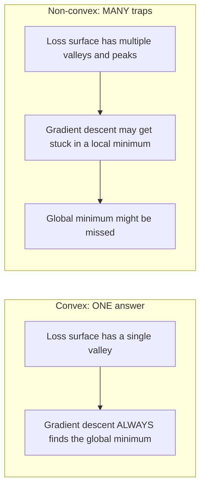
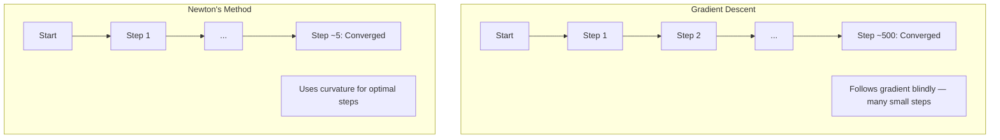
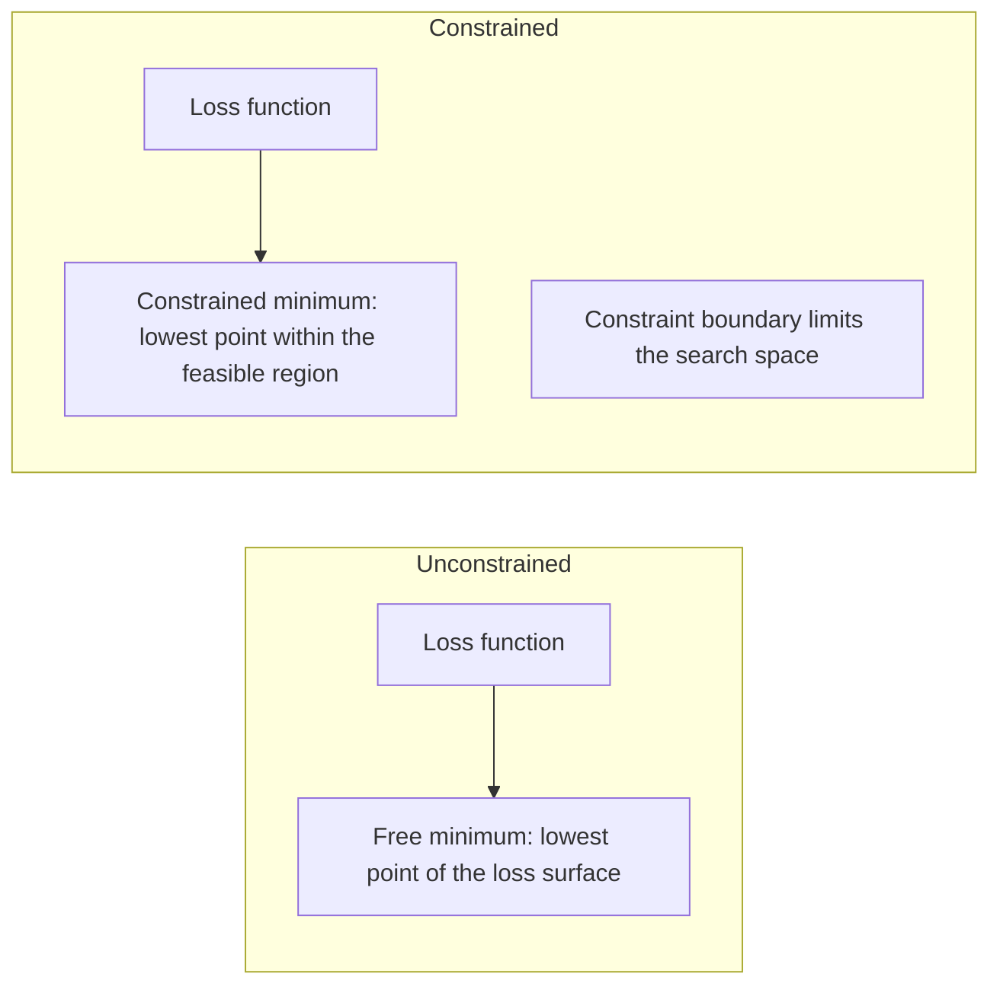
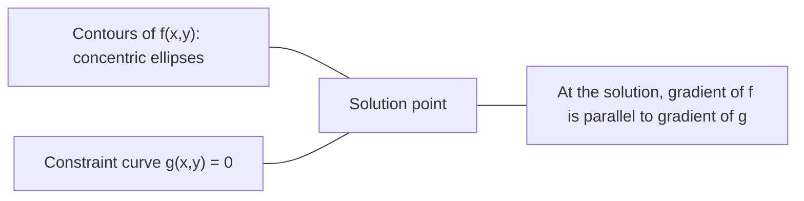

# Optimización convexa

> Los problemas convexos tienen un valle, las redes neuronales tienen millones, saber la diferencia importa.

**Type:** Build
**Language:**Python
**Prerequisites:** Phase 1, Lessons 04 (Calculus for ML), 08 (Optimization)
**Time:** ~90 minutes

## Objetivos de aprendizaje

- Prueba si una función es convexa utilizando la definición, la segunda derivada y los criterios de Hessian
- Implemente el método de Newton y compare su convergencia cuadrática con el descenso de gradiente
- Resolver problemas de optimización restringidos utilizando multiplicadores de Lagrange e interpretar las condiciones de KKT
- Explica por qué los paisajes de pérdida de redes neuronales no son convexos pero SGD todavía encuentra buenas soluciones

## El problema

La lección 08 te enseñó la descenda de gradiente, el impulso y Adam. Esos optimizadores caminan por la ladera en cualquier superficie. Pero no tienen garantías. La descenda de gradiente en un paisaje no convexo puede aterrizar en un mínimo local malo, quedarse atascado en un punto de silla o oscilar para siempre. Lo usaste de todos modos porque las redes neuronales no son convexas y no hay alternativa.

Pero muchos problemas en el aprendizaje automático son convexos. Regresión lineal, regresión logística, SVMs, LASSO, regresión de cresta. Para estos, existe algo más fuerte: optimización con garantías matemáticas. Un problema convexo tiene exactamente un valle. Cualquier algoritmo que camine descendente alcanzará el mínimo global. No se necesita reinicio. No hay horarios de tasa de aprendizaje. No hay oración.

Comprender la convexidad hace tres cosas. Primero, le dice cuándo su problema es fácil (convexa) versus duro (no convexa). Segundo, le da herramientas más rápidas como el método de Newton para problemas convexos. Tercero, explica conceptos que aparecen en todo ML: regularización como una restricción, dualidad en SVMs, y por qué el aprendizaje profundo funciona a pesar de violar cada propiedad agradable que le da la convexidad.

## El concepto

### conjuntos convexos

Un conjunto S es convexo si para cualquier dos puntos en S, el segmento de línea entre ellos también se encuentra enteramente en S.

| Convex sets | Not convex |
|---|---|
| **Rectangle**: any two points inside can be connected by a line segment that stays inside | **Star/crescent shape**: a line between two interior points can pass outside the set |
| **Triangle**: same property holds for all interior points | **Donut/annulus**: the hole means some line segments leave the set |
| The line segment between any two points stays within the set | The line segment between some pairs of points exits the set |

Prueba formal: para cualquier punto x, y en S y cualquier t en [0, 1], el punto tx + (1-t) y también está en S.

Ejemplos de conjuntos convexos:
- Una línea, un plano, todo R^n
- Una bola (círculo, esfera, hiperesfera)
- Un medio espacio: {x: a^T x <= b}
- La intersección de cualquier número de conjuntos convexos

Ejemplos de conjuntos no convexos:
- Un donut (annulo)
- La unión de dos círculos desarticulados
- Cualquier conjunto con un "dent" o "agujero"

### Funciones convexas

Una función f es convexa si su dominio es un conjunto convexo y para cualquier dos puntos x, y en su dominio y cualquier t en [0, 1]:

```
f(tx + (1-t)y) <= t*f(x) + (1-t)*f(y)
```

Geométricamente: el segmento de línea entre cualquier dos puntos del gráfico se encuentra por encima o en el gráfico.

| Property | Convex function | Non-convex function |
|---|---|---|
| **Line segment test** | The line between any two points on the graph lies **above or on** the curve | The line between some points on the graph dips **below** the curve |
| **Shape** | Single bowl/valley curving upward | Multiple peaks and valleys with mixed curvature |
| **Local minima** | Every local minimum is the global minimum | Multiple local minima may exist at different heights |

Funciones convexas comunes:
- f(x) = x^2 (parabola)
- f(x) = ↓ x (valor absoluto)
- f(x) = e^x (exponencial)
- f(x) = max(0, x) (ReLU, aunque lineal en forma de pieza)
- f(x) = -log(x) para x > 0 (log negativo)
- Cualquier función lineal f ((x) = a^T x + b (tanto convexa como cóncava)

### Pruebas de convexidad

Tres pruebas prácticas, desde las más fáciles hasta las más rigurosas.

**Test 1: Second derivative test (1D).**Si f'(x) >= 0 para todos los x, entonces f es convexa.

- f''(x) = x^2: f''(x) = 2 >= 0.
- f''(x) = x^3: f''(x) = 6x. negativo para x < 0. No es convexa.
- F''(x) = e^x: f''(x) = e^x > 0.

**Test 2: Hessian test (multivariate).**Si la matriz hessiana H(x) es semidefinita positiva para todas las x, entonces f es convexa.

**Test 3: Definition test.**Verifique la desigualdad f(tx + (1-t) y) <= t*f(x) + (1-t) *f(y) directamente.

### Por qué es importante la convexidad

El teorema central de la optimización convexa:

**For a convex function, every local minimum is a global minimum.**

Esto significa que el descenso de gradiente no puede quedar atrapado. Cualquier camino descendente conduce a la misma respuesta. El algoritmo está garantizado para converger a la solución óptima.



Consecuencias:
- No hay necesidad de reiniciar al azar
- No se necesitan programas de aprendizaje sofisticados
- Las pruebas de convergencia son posibles (la tasa depende de las propiedades de la función)
- La solución es única (hasta regiones planas)

### Conveja vs no conveja en ML

| Problem | Convex? | Why |
|---------|---------|-----|
| Linear regression (MSE) | Yes | Loss is quadratic in weights |
| Logistic regression | Yes | Log-loss is convex in weights |
| SVM (hinge loss) | Yes | Maximum of linear functions |
| LASSO (L1 regression) | Yes | Sum of convex functions is convex |
| Ridge regression (L2) | Yes | Quadratic + quadratic = convex |
| Neural network (any loss) | No | Nonlinear activations create non-convex landscape |
| k-means clustering | No | Discrete assignment step |
| Matrix factorization | No | Product of unknowns |

Los modelos lineales con pérdidas convexas son convexas. En el momento en que se añaden capas ocultas con activaciones no lineales, se rompe la convexidad.

### La matriz hesiana

La Hesiana de una función f: R^n -> R es la matriz n x n de derivados parciales segundos.

```
H[i][j] = d^2 f / (dx_i dx_j)
```

Para f ((x, y) = x^2 + 3xy + y^2:

```
df/dx = 2x + 3y       d^2f/dx^2 = 2      d^2f/dxdy = 3
df/dy = 3x + 2y       d^2f/dydx = 3      d^2f/dy^2 = 2

H = [ 2  3 ]
    [ 3  2 ]
```

El Hessiano te dice acerca de la curvatura:
- Valores propios todos positivos: la función se curva hacia arriba en todas las direcciones (convexa en ese punto)
- Valores propios todos negativos: curvas hacia abajo en todas las direcciones (concavo, una máxima local)
- Signos mixtos: punto de silla (curvas hacia arriba en algunas direcciones, hacia abajo en otras)
- Valor propio cero: plano en esa dirección (degenerado)

Para la convexidad, el hesiano debe ser semidefinido positivo (todos los valores propios >= 0) en todas partes, no solo en un punto.

### El método de Newton

El descenso de gradiente utiliza información de primer orden (el gradiente). El método de Newton utiliza información de segundo orden (el Hessiano).

```
Update rule:
  x_new = x - H^(-1) * gradient

Compare to gradient descent:
  x_new = x - lr * gradient
```

El método de Newton reemplaza la tasa de aprendizaje escalar por el Hessiano inverso. Esto ajusta automáticamente el tamaño y la dirección del paso en función de la curvatura local.



Las ventajas:
- Convergencia cuadrática cerca del mínimo (cuadrados de errores en cada paso)
- No hay ritmo de aprendizaje para sintonizar
- Invariante de escala (funciona independientemente de cómo parametrice el problema)

Desventajas:
- El cálculo de los costes de Hessian O  n ^ 2) memoria y O  n ^ 3) para invertir
- Para una red neuronal con 1 millón de pesos, es decir, 10^12 entradas y 10^18 operaciones
- No es práctico para el aprendizaje profundo

### Optimización limitada

Optimización sin restricciones: minimizar f ((x) sobre todos los x.
Optimización limitada: minimizar f ((x) sujeto a restricciones.

Los problemas reales tienen limitaciones. Quiere reducir el costo pero su presupuesto es limitado. Quiere reducir al mínimo el error pero su complejidad del modelo es limitada.



### Multiplicadores de laranja

El método de los multiplicadores de Lagrange convierte un problema limitado en uno sin restricciones.

Problema: minimizar f(x) sujeto a g(x) = 0.

Solución: introducir una nueva variable (la lambda del multiplicador de Lagrange) y resolver el problema sin restricciones:

```
L(x, lambda) = f(x) + lambda * g(x)
```

En la solución, el gradiente de L es cero:

```
dL/dx = df/dx + lambda * dg/dx = 0
dL/dlambda = g(x) = 0
```

Intuición geométrica: en el mínimo restringido, el gradiente de f debe ser paralelo al gradiente de la restricción g. Si no eran paralelas, se podría mover a lo largo de la superficie de la restricción y reducir f más.



Ejemplo: minimizar f ((x,y) = x^2 + y^2 sujeto a x + y = 1.

```
L = x^2 + y^2 + lambda(x + y - 1)

dL/dx = 2x + lambda = 0  =>  x = -lambda/2
dL/dy = 2y + lambda = 0  =>  y = -lambda/2
dL/dlambda = x + y - 1 = 0

From first two: x = y
Substituting: 2x = 1, so x = y = 0.5, lambda = -1
```

El punto más cercano de la línea x + y = 1 al origen es (0,5, 0,5).

### Condiciones de la TCC

Las condiciones de Karush-Kuhn-Tucker amplían los multiplicadores de Lagrange a las restricciones de desigualdad.

El problema: minimizar f  x) sujeto a g  i  x) <= 0 para i = 1, ..., m.

Las condiciones de KKT (necesarias para la óptimalidad):

```
1. Stationarity:    df/dx + sum(lambda_i * dg_i/dx) = 0
2. Primal feasibility:  g_i(x) <= 0  for all i
3. Dual feasibility:    lambda_i >= 0  for all i
4. Complementary slackness:  lambda_i * g_i(x) = 0  for all i
```

La flexibilidad complementaria es la clave: o bien la restricción es activa (g_i = 0, la solución se encuentra en el límite) o el multiplicador es cero (la restricción no importa).

Las condiciones de KKT son centrales para los SVM. Los vectores de apoyo son los puntos de datos en los que la restricción está activa (lambda > 0).

### Regularización como optimización limitada

La regularización de L1 y L2 no son trucos arbitrarios, son problemas de optimización limitada disfrazados.

**L2 regularization (Ridge):**

```
minimize  Loss(w)  subject to  ||w||^2 <= t

Equivalent unconstrained form:
minimize  Loss(w) + lambda * ||w||^2
```

La restricción de la pérdida en la pérdida de la pérdida de la pérdida de la pérdida de la pérdida de la pérdida de la pérdida de la pérdida de la pérdida de la pérdida de la pérdida de la pérdida de la pérdida de la pérdida de la pérdida de la pérdida de la pérdida de la pérdida de la pérdida de la pérdida de la pérdida de la pérdida de la pérdida de la pérdida de la pérdida de la pérdida de la pérdida de la pérdida de la pérdida de la pérdida de la pérdida de la pérdida de la pérdida de la pérdida de la pérdida de la pérdida de la pérdida de la pérdida de la pérdida de la pérdida de la pérdida de la pérdida de la pérdida de la pérdida de la pérdida de la pérdida de la pérdida de la pérdida de la pérdida de la pérdida de la pérdida de la pérdida de la pérdida de la pérdida de la pérdida de la pérdida de la pérdida de la pérdida de la pérdida de la pérdida de la pérdida de la pérdida de la pérdida de la pérdida de la pérdida de la pérdida de la pérdida de la pérdida de la pérdida de la pérdida de la pérdida de la pérdida de la pérdida de la pérdida de la pérdida de la pérdida de la pérdida de la pérdida de la pérdida de la pérdida de la pérdida de la pérdida de la pérdida de la pérdida de la pérdida de la pérdida de la pérdida de la pérdida de la pérdida de la pérdida de la pérdida de la pérdida de la pérdida de la pérdida de la pérdida de la pérdida de la pérdida de la pérdida de la pérdida de la pérdida de la pérdida de la pérdida de la pérdida de la pérdida de la pérdida de la pérdida de la pérdida de la pérdida de la pérdida de la pérdida.

**L1 regularization (LASSO):**

```
minimize  Loss(w)  subject to  ||w||_1 <= t

Equivalent unconstrained form:
minimize  Loss(w) + lambda * ||w||_1
```

La restricción de la cantidad de diamantes definida en 2D (cuadrado rotado).

| Property | L2 constraint (circle) | L1 constraint (diamond) |
|---|---|---|
| **Constraint shape** | Circle (sphere in higher dims) | Diamond (rotated square in 2D) |
| **Where loss contour touches** | Smooth boundary — any point on the circle | Corner — aligned with an axis |
| **Solution behavior** | Weights are small but nonzero | Some weights are exactly zero (sparse) |
| **Result** | Weight shrinkage | Feature selection |

Esto explica por qué L1 produce modelos escasos (selección de características) mientras que L2 solo reduce los pesos. El diamante tiene esquinas alineadas con ejes.

### La dualidad

Cada problema de optimización limitada (el primario) tiene un problema compañero (el dual). Para los problemas convexos, el primario y el dual tienen el mismo valor óptimo. Esta es una fuerte dualidad.

La función dual de Lagrangian:

```
Primal: minimize f(x) subject to g(x) <= 0
Lagrangian: L(x, lambda) = f(x) + lambda * g(x)
Dual function: d(lambda) = min_x L(x, lambda)
Dual problem: maximize d(lambda) subject to lambda >= 0
```

Por qué la dualidad es importante:
- El problema dual es a veces más fácil de resolver que el primordial
- Los SVM se resuelven en su forma dual, donde el problema depende de productos de puntos entre los puntos de datos (habilitando el truco del núcleo)
- El doble proporciona un límite inferior en el óptimo primario, útil para comprobar la calidad de la solución

Para los SVM específicamente:

```
Primal: find w, b that maximize the margin 2/||w|| subject to
        y_i(w^T x_i + b) >= 1 for all i

Dual:   maximize sum(alpha_i) - 0.5 * sum_ij(alpha_i * alpha_j * y_i * y_j * x_i^T x_j)
        subject to alpha_i >= 0 and sum(alpha_i * y_i) = 0

The dual only involves dot products x_i^T x_j.
Replace x_i^T x_j with K(x_i, x_j) to get the kernel trick.
```

### Por qué el aprendizaje profundo funciona a pesar de la no convexidad

Las funciones de pérdida de red neuronal son muy no convexas. Por todas las medidas clásicas, la optimización de ellas debería fallar. Sin embargo, el descenso de gradiente estocástico encuentra buenas soluciones confiablemente. Varios factores explican esto.

**Most local minima are good enough.**En los espacios de alta dimensión, los puntos críticos aleatorios (donde el gradiente es cero) son en su mayoría puntos de sella, no mínimos locales. Los pocos mínimos locales que existen tienden a tener valores de pérdida cercanos al mínimo global.

**Saddle points, not local minima, are the real obstacle.**En una función con n parámetros, un punto de sillón tiene una mezcla de direcciones de curvatura positiva y negativa. Para un punto crítico aleatorio en dimensiones altas, la probabilidad de que todos los n valores propios sean positivos (mínimo local) es aproximadamente 2 ^ - n. Casi todos los puntos críticos son puntos de sillón.

**Overparameterization smooths the landscape.**Las redes con más parámetros que los ejemplos de entrenamiento tienen superficies de pérdida más suaves y conectadas. Las redes más amplias tienen menos mínimos locales negativos. Esto es contrario a la intuición pero empíricamente consistente.

**Loss landscape structure:**

| Property | Low-dimensional space | High-dimensional space |
|---|---|---|
| **Landscape** | Many isolated peaks and valleys | Smoothly connected valleys |
| **Minima** | Many isolated local minima | Few bad local minima; most are near-optimal |
| **Navigation** | Hard to find global minimum | Many paths lead to good solutions |
| **Critical points** | Mix of local minima and saddle points | Overwhelmingly saddle points, not local minima |

**Stochastic noise acts as implicit regularization.**El SGD de mini lote añade ruido que evita que se establezca en mínimos nítidos. mínimos nítidos se sobreajustan; mínimos planos se generalizan. El ruido favorece la optimización hacia regiones planas del paisaje de pérdidas.

### Métodos de segundo orden en la práctica

El método de Newton puro es poco práctico para modelos grandes. Varias aproximaciones hacen que la información de segundo orden sea utilizable.

**L-BFGS (Limited-memory BFGS):**Se aproxima al Hessiano inverso utilizando las últimas diferencias de gradiente m. Requiere memoria O(mn en lugar de O(n^2). Funciona bien para problemas con hasta ~ 10.000 parámetros. Se utiliza en ML clásico (regressión logística, CRFs) pero no en aprendizaje profundo.

**Natural gradient:**Utiliza la matriz de información de Fisher (Hessian esperado de la probabilidad de registro) en lugar del Hessian estándar. Esto explica la geometría de las distribuciones de probabilidad. K-FAC (Curvatura aproximada con factores de Cronécker) se aproxima a la matriz de Fisher como un producto de Cronécker, lo que la hace práctica para las redes neuronales.

**Hessian-free optimization:**Utiliza gradiente conjugado para resolver Hx = g sin formar nunca H. Solo requiere productos de vector hessiano, que se pueden calcular en tiempo O ((n) a través de diferenciación automática.

**Diagonal approximations:**El segundo momento de Adam es una aproximación diagonal de la diagonal de Hessian. AdaHessian lo extiende utilizando elementos diagonales de Hessian reales a través del estimador de Hutchinson.

| Method | Memory | Per-step cost | When to use |
|--------|--------|--------------|-------------|
| Gradient descent | O(n) | O(n) | Baseline, large models |
| Newton's method | O(n^2) | O(n^3) | Small convex problems |
| L-BFGS | O(mn) | O(mn) | Medium convex problems |
| Adam | O(n) | O(n) | Deep learning default |
| K-FAC | O(n) | O(n) per layer | Research, large-batch training |

```figure
convex-vs-nonconvex
```

## Construye el mismo

### Paso 1: Verificación de convexidad

Construir una función que prueba la convexidad empíricamente mediante muestreo de puntos y comprobar la definición.

```python
import random
import math

def check_convexity(f, dim, bounds=(-5, 5), samples=1000):
    violations = 0
    for _ in range(samples):
        x = [random.uniform(*bounds) for _ in range(dim)]
        y = [random.uniform(*bounds) for _ in range(dim)]
        t = random.uniform(0, 1)
        mid = [t * xi + (1 - t) * yi for xi, yi in zip(x, y)]
        lhs = f(mid)
        rhs = t * f(x) + (1 - t) * f(y)
        if lhs > rhs + 1e-10:
            violations += 1
    return violations == 0, violations
```

### Paso 2: El método de Newton para 2D

Implemente el método de Newton usando un Hessiano explícito. Compara la velocidad de convergencia con el descenso de gradiente.

```python
def newtons_method(f, grad_f, hessian_f, x0, steps=50, tol=1e-12):
    x = list(x0)
    history = [x[:]]
    for _ in range(steps):
        g = grad_f(x)
        H = hessian_f(x)
        det = H[0][0] * H[1][1] - H[0][1] * H[1][0]
        if abs(det) < 1e-15:
            break
        H_inv = [
            [H[1][1] / det, -H[0][1] / det],
            [-H[1][0] / det, H[0][0] / det],
        ]
        dx = [
            H_inv[0][0] * g[0] + H_inv[0][1] * g[1],
            H_inv[1][0] * g[0] + H_inv[1][1] * g[1],
        ]
        x = [x[0] - dx[0], x[1] - dx[1]]
        history.append(x[:])
        if sum(gi ** 2 for gi in g) < tol:
            break
    return history
```

### Paso 3: Solvente del multiplicador de laranja

Resolver la optimización limitada utilizando el descenso de gradiente en el Lagrangiano.

```python
def lagrange_solve(f_grad, g_val, g_grad, x0, lr=0.01,
                   lr_lambda=0.01, steps=5000):
    x = list(x0)
    lam = 0.0
    history = []
    for _ in range(steps):
        fg = f_grad(x)
        gv = g_val(x)
        gg = g_grad(x)
        x = [
            xi - lr * (fgi + lam * ggi)
            for xi, fgi, ggi in zip(x, fg, gg)
        ]
        lam = lam + lr_lambda * gv
        history.append((x[:], lam, gv))
    return history
```

### Paso 4: Comparar el primer orden con el segundo orden

Ejecutar la descenda de gradiente y el método de Newton en la misma función cuadrática.

```python
def quadratic(x):
    return 5 * x[0] ** 2 + x[1] ** 2

def quadratic_grad(x):
    return [10 * x[0], 2 * x[1]]

def quadratic_hessian(x):
    return [[10, 0], [0, 2]]
```

El método de Newton convergerá en 1 paso (es exacto para la cuadrática).

## Usalo

El análisis de convexidad se aplica directamente a la hora de elegir modelos y solventes ML.

Para los problemas convexos (regressión logística, SVM, LASSO):
- Utilice solventes dedicados (liblinear, CVXPY, scipy.optimize.minimize con método='L-BFGS-B')
- Esperar una solución global única
- Los métodos de segundo orden son prácticos y rápidos

Para los problemas no convexos (redes neuronales):
- Utilice métodos de primer orden (SGD, Adam)
- Aceptar que la solución depende de la inicialización y la aleatoriedad
- Utilice los horarios de sobreparametrización, ruido y tasa de aprendizaje como regularización implícita
- No pierdas tiempo buscando el mínimo global.

```python
from scipy.optimize import minimize

result = minimize(
    fun=lambda w: sum((y - X @ w) ** 2) + 0.1 * sum(w ** 2),
    x0=np.zeros(d),
    method='L-BFGS-B',
    jac=lambda w: -2 * X.T @ (y - X @ w) + 0.2 * w,
)
```

Para los SVM, la fórmula dual permite usar el truco del núcleo:

```python
from sklearn.svm import SVC

svm = SVC(kernel='rbf', C=1.0)
svm.fit(X_train, y_train)
print(f"Support vectors: {svm.n_support_}")
```

## Los ejercicios

1. **Convexity gallery.**Prueba estas funciones para la convexidad utilizando el comprobador: f(x) = x^4, f(x) = sin(x), f(x,y) = x^2 + y^2, f(x,y) = x*y, f(x) = max(x, 0). Explique por qué cada resultado tiene sentido.

2. **Newton vs gradient descent race.**¿Cuántos pasos necesita cada uno para alcanzar la pérdida < 1e-10? ¿Qué sucede con el descenso de gradiente cuando el número de condición (ratio de mayor a menor valor propio hessiano) aumenta?

3. **Lagrange multiplier geometry.**Minimizar f ((x,y) = (x-3) ^ 2 + (y-3) ^ 2 sujeto a x + 2y = 4. Verificar la solución comprobando que el gradiente de f es paralelo al gradiente de g en la solución.

4. **Regularization constraint.**Implemente la optimización con restricción L1: minimizar (x-3) ^ 2 + (y-2) ^ 2 sujeto a ∙x                                                                                                                                                                                                                                                

5. **Hessian eigenvalue analysis.**Compute el Hessian de la función Rosenbrock en (1,1) y en (-1,1). Compute los valores propios en ambos puntos. ¿Qué le dicen los valores propios sobre la curvatura en el mínimo versus lejos de él?

## Términos clave

| Term | What it means |
|------|---------------|
| Convex set | A set where the line segment between any two points in the set stays inside the set |
| Convex function | A function where the line between any two points on its graph lies above or on the graph. Equivalently, Hessian is positive semidefinite everywhere |
| Local minimum | A point lower than all nearby points. For convex functions, every local minimum is the global minimum |
| Global minimum | The lowest point of a function over its entire domain |
| Hessian matrix | The matrix of all second partial derivatives. Encodes curvature information |
| Positive semidefinite | A matrix whose eigenvalues are all non-negative. The multidimensional analogue of "second derivative >= 0" |
| Condition number | Ratio of largest to smallest eigenvalue of the Hessian. High condition number means elongated valleys and slow gradient descent |
| Newton's method | Second-order optimizer that uses the inverse Hessian to determine step direction and size. Quadratic convergence near the minimum |
| Lagrange multiplier | A variable introduced to convert a constrained optimization problem into an unconstrained one |
| KKT conditions | Necessary conditions for optimality with inequality constraints. Generalize Lagrange multipliers |
| Complementary slackness | At the solution, either a constraint is active or its multiplier is zero. Never both nonzero |
| Duality | Every constrained problem has a companion dual problem. For convex problems, both have the same optimal value |
| Strong duality | Primal and dual optimal values are equal. Holds for convex problems satisfying Slater's condition |
| L-BFGS | Approximate second-order method that stores the last m gradient differences instead of the full Hessian |
| Saddle point | A point where the gradient is zero but it is a minimum in some directions and a maximum in others |
| Overparameterization | Using more parameters than training examples. Smooths the loss landscape and reduces bad local minima |

## Leer más

- [Boyd & Vandenberghe: Convex Optimization](https://web.stanford.edu/~boyd/cvxbook/)- el libro de texto estándar, disponible gratuitamente en línea
- [Bottou, Curtis, Nocedal: Optimization Methods for Large-Scale Machine Learning (2018)](https://arxiv.org/abs/1606.04838)- puentes de teoría de la optimización convexa y práctica de aprendizaje profundo
- [Choromanska et al.: The Loss Surfaces of Multilayer Networks (2015)](https://arxiv.org/abs/1412.0233)- por qué los paisajes de las redes neuronales no convexas no son tan malos como parecen
- [Nocedal & Wright: Numerical Optimization](https://link.springer.com/book/10.1007/978-0-387-40065-5)- referencia completa del método de Newton, L-BFGS, y optimización limitada
