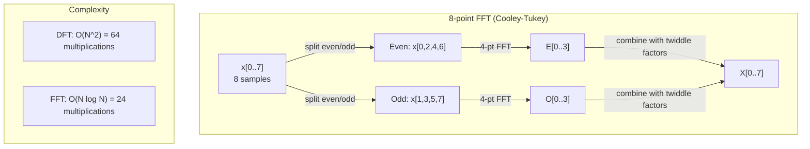
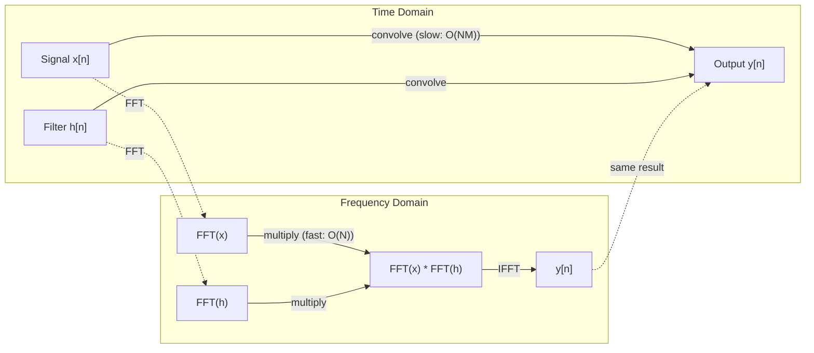

# La transformación de Fourier

> Cada señal es una suma de ondas senoides. La transformación de Fourier le dice cuáles son.

**Type:** Build
**Language:**Python
**Prerequisites:** Phase 1, Lessons 01-04, 19 (complex numbers)
**Time:** ~90 minutes

## Objetivos de aprendizaje

- Implementar el DFT desde cero y verificarlo con respecto al O(N registro N) Cooley-Tukey FFT
- Interpreta los coeficientes de frecuencia: extrae amplitud, fase y espectro de potencia de una señal
- Aplicar el teorema de la convolución para realizar la convolución a través de la multiplicación FFT
- Conectar la descomposición de frecuencia de Fourier a las codificaciones posicionales de transformador y las capas de convolución de CNN

## El problema

Una grabación de audio es una secuencia de mediciones de presión a lo largo del tiempo. Un precio de acciones es una secuencia de valores a lo largo de días. Una imagen es una cuadrícula de intensidades de píxeles sobre el espacio. Todos estos son datos en el dominio del tiempo (o dominio del espacio).

Pero muchos patrones son invisibles en el dominio del tiempo. ¿Es este señal de audio un tono puro o un acorde? ¿Tiene este precio de las acciones un ciclo semanal? ¿Tiene esta imagen una textura repetitiva? Estas preguntas son sobre el contenido de frecuencia, y el dominio del tiempo lo oculta.

La transformación de Fourier convierte datos del dominio del tiempo al dominio de la frecuencia. Toma una señal y la descompone en ondas senoides de diferentes frecuencias. Cada onda senoide tiene una amplitud (qué tan fuerte es) y una fase (donde comienza).

Esto es importante para ML porque el pensamiento del dominio de frecuencia aparece en todas partes. Las redes neuronales convolucionales realizan la convolución, que es la multiplicación en el dominio de frecuencia. Los codificadores de posición de transformadores utilizan la descomposición de frecuencia para representar la posición. Los modelos de audio (reconocimiento de voz, generación de música) operan en espectrogramas - representaciones de frecuencia del sonido. Los modelos de series temporales buscan patrones periódicos. Comprender la transformación de Fourier le da el vocabulario para trabajar con todos estos.

## El concepto

### La definición de DFT

Dadas N muestras x[0], x[1], ..., x[N-1], la Transforma de Fourier Discreta produce N coeficientes de frecuencia X[0], X[1], ..., X[N-1]:

```
X[k] = sum_{n=0}^{N-1} x[n] * e^(-2*pi*i*k*n/N)

for k = 0, 1, ..., N-1
```

Cada X[k] es un número complejo. Su magnitud. X[k] destiene la amplitud de la frecuencia k. Su ángulo de fase ((X[k]) le dice la compensación de fase de esa frecuencia.

La clave de la información:`e^(-2*pi*i*k*n/N)`es un faseor rotativo en la frecuencia k. El DFT calcula la correlación entre la señal y cada una de las frecuencias de N espaciadas igualmente. Si la señal contiene energía en la frecuencia k, la correlación es grande.

### Lo que significa cada coeficiente

**X[0]: the DC component.**Esta es la suma de todas las muestras, proporcional a la media. Representa la constante (de frecuencia cero) de la señal.

```
X[0] = sum_{n=0}^{N-1} x[n] * e^0 = sum of all samples
```

**X[k] for 1 <= k <= N/2: positive frequencies.**X[k] representa los ciclos de frecuencia k por muestras N. Un k más alto significa una frecuencia más alta (oscillación más rápida).

**X[N/2]: the Nyquist frequency.**La frecuencia más alta que se puede representar con muestras N. Por encima de esto, se obtiene alias -- frecuencias altas disfrazadas de bajas.

**X[k] for N/2 < k < N: negative frequencies.**Para señales de valor real, X[N-k] = conj(X[k]). Las frecuencias negativas son imágenes especulares de las positivas.

### DFT inverso

El DFT inverso reconstruye la señal original a partir de sus coeficientes de frecuencia:

```
x[n] = (1/N) * sum_{k=0}^{N-1} X[k] * e^(2*pi*i*k*n/N)

for n = 0, 1, ..., N-1
```

Las únicas diferencias con respecto al DFT delantero: el signo en el exponente es positivo (no negativo), y hay un factor de normalización 1/N.

La DFT inversa es una reconstrucción perfecta. No se pierde información. Puedes pasar de dominio de tiempo a dominio de frecuencia y de vuelta sin ningún error. La DFT es un cambio de base - reexpresa la misma información en un sistema de coordenadas diferente.

### El FFT: hacerlo rápido

El DFT definido anteriormente es O(N^2): para cada uno de los coeficientes de salida N, sumamos sobre muestras de entrada N. Para N = 1 millón, es 10^12 operaciones.

La transformación de Fourier rápida (FFT) calcula el mismo resultado en O  N log N. Para N = 1 millón, eso es aproximadamente 20 millones de operaciones en lugar de un billón. Esto es lo que hace que el análisis de frecuencia sea práctico.

El algoritmo Cooley-Tukey (el FFT más común) funciona dividido y conquistado:

1. Dividir la señal en muestras de índice par y impar.
2. Calcule el DFT de cada mitad de forma recursiva.
3. Combine las dos DFT de medio tamaño utilizando "factores de doble" e^(-2*pi*i*k/N).

```
X[k] = E[k] + e^(-2*pi*i*k/N) * O[k]          for k = 0, ..., N/2 - 1
X[k + N/2] = E[k] - e^(-2*pi*i*k/N) * O[k]    for k = 0, ..., N/2 - 1

where E = DFT of even-indexed samples
      O = DFT of odd-indexed samples
```

La simetría significa que cada nivel de recursión funciona O(N), y hay niveles log2(N. Total: O(N log N).



El FFT requiere que la longitud de la señal sea de 2 potencia. En la práctica, las señales se empalan a cero a la siguiente potencia de 2.

### Análisis espectral

El **power spectrum**Es X [k] cuadrado - la magnitud cuadrada de cada coeficiente de frecuencia.

El **phase spectrum**es ángulo ((X[k]) -- la fase de compensación de cada frecuencia. Para la mayoría de las tareas de análisis, se preocupa por el espectro de potencia e ignora la fase.

```
Power at frequency k:  P[k] = |X[k]|^2 = X[k].real^2 + X[k].imag^2
Phase at frequency k:  phi[k] = atan2(X[k].imag, X[k].real)
```

### Resolución de frecuencia

La resolución de frecuencia del DFT depende del número de muestras N y de la tasa de muestreo fs.

```
Frequency of bin k:      f_k = k * fs / N
Frequency resolution:    delta_f = fs / N
Maximum frequency:       f_max = fs / 2  (Nyquist)
```

Para resolver dos frecuencias que están cerca de uno a otro, se necesitan más muestras. Para capturar frecuencias altas, se necesita una tasa de muestreo más alta.

### El teorema de la convolución

Este es uno de los resultados más importantes en el procesamiento de señales y directamente relevante para las CNN.

**Convolution in the time domain equals pointwise multiplication in the frequency domain.**

```
x * h = IFFT(FFT(x) . FFT(h))

where * is convolution and . is element-wise multiplication
```

Por qué esto es importante:

- La convolución directa de dos señales de longitud N y M realiza operaciones O(N*M).
- La convolución basada en FFT toma O(N log N): transforma ambos, multiplica, transforma de nuevo.
- Para núcleos grandes, la convolución FFT es dramáticamente más rápida.
- Esto es exactamente lo que sucede en las capas convolutivas con grandes campos receptivos.

Nota: el DFT calcula la convolución circular (la señal se envuelve). Para la convolución lineal (sin envoltura), cero-pad ambas señales a longitud N + M - 1 antes de la computación.



### Las ventanas

El DFT asume que la señal es periódica - trata las muestras N como un período de una señal infinitamente repetida. Si la señal no comienza y termina en el mismo valor, esto crea una discontinuidad en el límite, que aparece como contenido de alta frecuencia falso. Esto se llama fuga espectral.

La ventana reduce la fuga reduciendo la señal a cero en ambos extremos antes de calcular el DFT.

Ventanas comunes:

| Window | Shape | Main lobe width | Side lobe level | Use case |
|--------|-------|----------------|-----------------|----------|
| Rectangular | Flat (no window) | Narrowest | Highest (-13 dB) | When signal is exactly periodic in N samples |
| Hann | Raised cosine | Moderate | Low (-31 dB) | General purpose spectral analysis |
| Hamming | Modified cosine | Moderate | Lower (-42 dB) | Audio processing, speech analysis |
| Blackman | Triple cosine | Wide | Very low (-58 dB) | When side lobe suppression is critical |

```
Hann window:    w[n] = 0.5 * (1 - cos(2*pi*n / (N-1)))
Hamming window: w[n] = 0.54 - 0.46 * cos(2*pi*n / (N-1))
```

Aplique la ventana multiplicándola por elemento con la señal anterior al DFT: `X = DFT(x * w)`¿ Qué ?

### Propiedades de DFT

| Property | Time Domain | Frequency Domain |
|----------|-------------|-----------------|
| Linearity | a*x + b*y | a*X + b*Y |
| Time shift | x[n - k] | X[f] * e^(-2*pi*i*f*k/N) |
| Frequency shift | x[n] * e^(2*pi*i*f0*n/N) | X[f - f0] |
| Convolution | x * h | X * H (pointwise) |
| Multiplication | x * h (pointwise) | X * H (circular convolution, scaled by 1/N) |
| Parseval's theorem | sum \|x[n]\|^2 | (1/N) * sum \|X[k]\|^2 |
| Conjugate symmetry (real input) | x[n] real | X[k] = conj(X[N-k]) |

El teorema de Parseval dice que la energía total es la misma en ambos dominios.

### Conexión a codificaciones posicionales

El Transformer original utiliza codificaciones posicionales sinusoidales:

```
PE(pos, 2i)   = sin(pos / 10000^(2i/d_model))
PE(pos, 2i+1) = cos(pos / 10000^(2i/d_model))
```

Cada par de dimensiones (2i, 2i+1) oscila a una frecuencia diferente. Las frecuencias están espaciadas geométricamente desde las altas (dimensión 0,1) hasta las bajas (última dimensión). Esto da a cada posición un patrón único en todas las bandas de frecuencia, similar a cómo los coeficientes de Fourier identifican de forma única una señal.

Las propiedades clave que proporciona:

- **Uniqueness:**No hay dos posiciones que tengan la misma codificación.
- **Bounded values:**El pecado y el cos están siempre en [-1, 1].
- **Relative position:**La codificación de la posición p+k se puede expresar como una función lineal de la codificación en la posición p. El modelo puede aprender a atender a posiciones relativas.

### Conexión con las CNN

Una capa de convolución aplica un filtro aprendido (núcleo) a la entrada deslizándolo a través de la señal o la imagen.

Por el teorema de la convolución, esto es equivalente a:
1. FFT la entrada
2. FFT el núcleo
3. Multiplicar en el dominio de frecuencia
4. Si el resultado es

Las implementaciones estándar de CNN utilizan la convolución directa (más rápida para pequeños núcleos 3x3). Pero para núcleos grandes o convolución global, los enfoques basados en FFT son significativamente más rápidos. Algunas arquitecturas (como FNet) reemplazan la atención por completo con FFT, logrando precisión competitiva con O(N log N) en lugar de complejidad O(N^2).

### Espectogramas y la transformación de Fourier de corto plazo

Una sola FFT le da el contenido de frecuencia de toda la señal, pero no le dice nada sobre cuándo ocurren esas frecuencias.

La Transforma de Fourier de Tiempo Corto (STFT) resuelve esto calculando FFTs en ventanas superpuestas de la señal. El resultado es un espectrograma: una representación 2D con tiempo en un eje y frecuencia en el otro. La intensidad en cada punto muestra la energía en esa frecuencia en ese momento.

```
STFT procedure:
1. Choose a window size (e.g., 1024 samples)
2. Choose a hop size (e.g., 256 samples -- 75% overlap)
3. For each window position:
   a. Extract the windowed segment
   b. Apply a Hann/Hamming window
   c. Compute FFT
   d. Store the magnitude spectrum as one column of the spectrogram
```

Los espectrogramas son la representación de entrada estándar para los modelos de audio ML. Los modelos de reconocimiento de voz (Whisper, DeepSpeech) operan en espectrogramas mel - espectrogramas con frecuencias mapeadas a la escala mel, que se ajusta mejor a la percepción de tono humano.

### Alfabetización

Si una señal contiene frecuencias superiores a fs/2 (la frecuencia de Nyquist), la muestreo a la frecuencia fs creará copias alias. Una señal de 90 Hz muestrada a 100 Hz se ve idéntica a una señal de 10 Hz. No hay manera de distinguirlos de las muestras por sí solas.

```
Example:
  True signal: 90 Hz sine wave
  Sampling rate: 100 Hz
  Apparent frequency: 100 - 90 = 10 Hz

  The samples from the 90 Hz signal at 100 Hz sampling rate
  are identical to the samples from a 10 Hz signal.
  No amount of math can recover the original 90 Hz.
```

Es por eso que los convertidores analógicos a digitales incluyen filtros antialiasing que eliminan las frecuencias por encima de Nyquist antes de la muestreo. En ML, el aliasing aparece cuando se muestran los mapas de características sin filtración de bajo paso adecuada.

### El empolvimiento cero no aumenta la resolución

Un error común: empolvar cero una señal antes de que FFT mejore la resolución de frecuencia. No lo hace. empolvar cero interpola entre los contenedores de frecuencia existentes, lo que le da un espectro más liso. Pero no puede revelar detalles de frecuencia que no estaban presentes en las muestras originales.

La resolución de frecuencia verdadera depende sólo del tiempo de observación T = N / fs. Para resolver dos frecuencias separadas por delta_f, se necesita al menos T = 1 / delta_f segundos de datos. Ninguna cantidad de empate cero cambia este límite fundamental.

```figure
fourier-synthesis
```

## Construye el mismo

### Paso 1: DFT desde cero

La DFT O ((N^2) se sigue directamente de la definición.

```python
import math

class Complex:
    ...

def dft(x):
    N = len(x)
    result = []
    for k in range(N):
        total = Complex(0, 0)
        for n in range(N):
            angle = -2 * math.pi * k * n / N
            w = Complex(math.cos(angle), math.sin(angle))
            xn = x[n] if isinstance(x[n], Complex) else Complex(x[n])
            total = total + xn * w
        result.append(total)
    return result
```

### Paso 2: DFT inverso

La misma estructura, exponente positivo, dividido por N.

```python
def idft(X):
    N = len(X)
    result = []
    for n in range(N):
        total = Complex(0, 0)
        for k in range(N):
            angle = 2 * math.pi * k * n / N
            w = Complex(math.cos(angle), math.sin(angle))
            total = total + X[k] * w
        result.append(Complex(total.real / N, total.imag / N))
    return result
```

### Paso 3: FFT (Cooley-Tukey)

El FFT recursivo requiere un poder de 2 de longitud. Dividido en par y impar, recursivo, combinado con factores de tortuga.

```python
def fft(x):
    N = len(x)
    if N <= 1:
        return [x[0] if isinstance(x[0], Complex) else Complex(x[0])]
    if N % 2 != 0:
        return dft(x)

    even = fft([x[i] for i in range(0, N, 2)])
    odd = fft([x[i] for i in range(1, N, 2)])

    result = [Complex(0)] * N
    for k in range(N // 2):
        angle = -2 * math.pi * k / N
        twiddle = Complex(math.cos(angle), math.sin(angle))
        t = twiddle * odd[k]
        result[k] = even[k] + t
        result[k + N // 2] = even[k] - t
    return result
```

### Paso 4: Auxiliares de análisis espectral

```python
def power_spectrum(X):
    return [xk.real ** 2 + xk.imag ** 2 for xk in X]

def convolve_fft(x, h):
    N = len(x) + len(h) - 1
    padded_N = 1
    while padded_N < N:
        padded_N *= 2

    x_padded = x + [0.0] * (padded_N - len(x))
    h_padded = h + [0.0] * (padded_N - len(h))

    X = fft(x_padded)
    H = fft(h_padded)

    Y = [xk * hk for xk, hk in zip(X, H)]

    y = idft(Y)
    return [y[n].real for n in range(N)]
```

## Usalo

Para el trabajo real, utilice la FFT de numpy que está respaldada por bibliotecas C altamente optimizadas.

```python
import numpy as np

signal = np.sin(2 * np.pi * 5 * np.arange(256) / 256)
spectrum = np.fft.fft(signal)
freqs = np.fft.fftfreq(256, d=1/256)

power = np.abs(spectrum) ** 2

positive_freqs = freqs[:len(freqs)//2]
positive_power = power[:len(power)//2]
```

Para el análisis espectral de ventanas y más avanzado:

```python
from scipy.signal import windows, stft

window = windows.hann(256)
windowed = signal * window
spectrum = np.fft.fft(windowed)
```

Para la convolución:

```python
from scipy.signal import fftconvolve

result = fftconvolve(signal, kernel, mode='full')
```

Para los espectrogramas:

```python
from scipy.signal import stft

frequencies, times, Zxx = stft(signal, fs=sample_rate, nperseg=256)
spectrogram = np.abs(Zxx) ** 2
```

La matriz de espectrograma tiene forma (n_frecuencias, n_time_frames). Cada columna es el espectro de potencia en una ventana de tiempo. Esto es lo que los modelos de audio ML consumen como entrada.

## Envío

- ¿ Qué ?`code/fourier.py`para generar `outputs/prompt-spectral-analyzer.md`¿ Qué ?

## Los ejercicios

1. **Pure tone identification.**Crear una señal con una sola onda senoidal a una frecuencia desconocida (entre 1 y 50 Hz), muestreado a 128 Hz durante 1 segundo. Utilice su DFT para identificar la frecuencia. Verifique las coincidencias de las respuestas. Ahora añada el ruido gaussiano con desviación estándar 0.5 y repita. ¿Cómo afecta el ruido al espectro?

2. **FFT vs DFT verification.**Generar una señal aleatoria de longitud 64. Compute tanto DFT (O(N^2)) como FFT. Verifique si todos los coeficientes coinciden con dentro de 1e-10. El tiempo funciona en señales de longitud 256, 512, 1024, y 2048.

3. **Convolution theorem proof by example.**Crea la señal x = [1, 2, 3, 4, 0, 0, 0, 0] y filtra h = [1, 1, 1, 0, 0, 0, 0, 0]. Computa su convolución circular directamente (bucle anidado). Luego computa a través de FFT (transformación, multiplicación, transformación inversa). Verifique la coincidencia de los resultados. Ahora realiza la convolución lineal mediante empadejamiento cero adecuadamente.

4. **Windowing effects.**Crear una señal que sea la suma de dos ondas senolares a 10 Hz y 12 Hz (muy cerca). Muestrear a 128 Hz durante 1 segundo. Compute el espectro de potencia sin ventana, ventana Hann y ventana Hamming. ¿Qué ventana hace que sea más fácil distinguir los dos picos? ¿Por qué?

5. **Positional encoding analysis.**Generar las codificaciones posicionales sinusoidales para d_model = 128 y max_pos = 512. Para cada par de posiciones (p1, p2), calcular el producto de puntos de sus codificaciones. Muestre que el producto de puntos depende solo de p1 - p2 y no de las posiciones absolutas. ¿Qué sucede con el producto de puntos a medida que aumenta la distancia?

## Términos clave

| Term | What it means |
|------|---------------|
| DFT (Discrete Fourier Transform) | Converts N time-domain samples into N frequency-domain coefficients. Each coefficient is the correlation with a complex sinusoid at that frequency |
| FFT (Fast Fourier Transform) | An O(N log N) algorithm to compute the DFT. The Cooley-Tukey algorithm splits even/odd indices recursively |
| Inverse DFT | Reconstructs the time-domain signal from frequency coefficients. Same formula as DFT with flipped exponent sign and 1/N scaling |
| Frequency bin | Each index k in the DFT output represents frequency k*fs/N Hz. The "bin" is the discrete frequency slot |
| DC component | X[0], the zero-frequency coefficient. Proportional to the signal mean |
| Nyquist frequency | fs/2, the maximum frequency representable at sampling rate fs. Frequencies above this alias |
| Power spectrum | \|X[k]\|^2, the squared magnitude of each frequency coefficient. Shows energy distribution across frequencies |
| Phase spectrum | angle(X[k]), the phase offset of each frequency component. Often ignored in analysis |
| Spectral leakage | Spurious frequency content caused by treating a non-periodic signal as periodic. Reduced by windowing |
| Window function | A tapering function (Hann, Hamming, Blackman) applied before DFT to reduce spectral leakage |
| Twiddle factor | The complex exponential e^(-2*pi*i*k/N) used to combine sub-DFTs in the FFT butterfly computation |
| Convolution theorem | Convolution in time domain equals pointwise multiplication in frequency domain. Fundamental to signal processing and CNNs |
| Circular convolution | Convolution where the signal wraps around. This is what the DFT naturally computes |
| Linear convolution | Standard convolution without wraparound. Achieved by zero-padding before DFT |
| Parseval's theorem | Total energy is preserved through the Fourier transform. sum \|x[n]\|^2 = (1/N) sum \|X[k]\|^2 |
| Aliasing | When frequencies above Nyquist appear as lower frequencies due to insufficient sampling rate |

## Leer más

- [Cooley & Tukey: An Algorithm for the Machine Calculation of Complex Fourier Series (1965)](https://www.ams.org/journals/mcom/1965-19-090/S0025-5718-1965-0178586-1/)- el papel original de FFT que cambió la informática
- [3Blue1Brown: But what is the Fourier Transform?](https://www.youtube.com/watch?v=spUNpyF58BY)- la mejor introducción visual a las transformaciones de Fourier
- [Lee-Thorp et al.: FNet: Mixing Tokens with Fourier Transforms (2021)](https://arxiv.org/abs/2105.03824)- sustituye la autoatención por FFT en transformadores
- [Smith: The Scientist and Engineer's Guide to Digital Signal Processing](http://www.dspguide.com/)- libro de texto en línea gratuito que cubre en profundidad la FFT, la ventana y el análisis espectral
- [Vaswani et al.: Attention Is All You Need (2017)](https://arxiv.org/abs/1706.03762)- codificaciones sinusoidales de posición derivadas de la descomposición de la frecuencia de Fourier
- [Radford et al.: Whisper (2022)](https://arxiv.org/abs/2212.04356)- reconocimiento del habla mediante el uso de espectrogramas mel como representación de entrada
