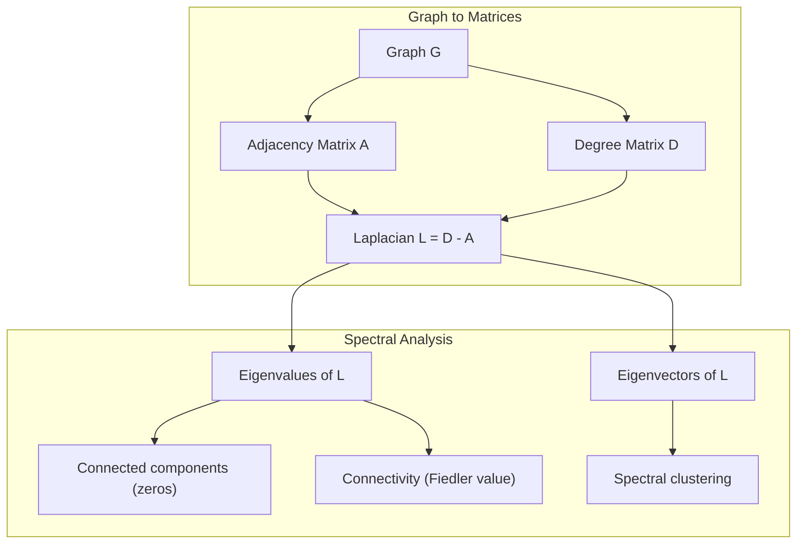
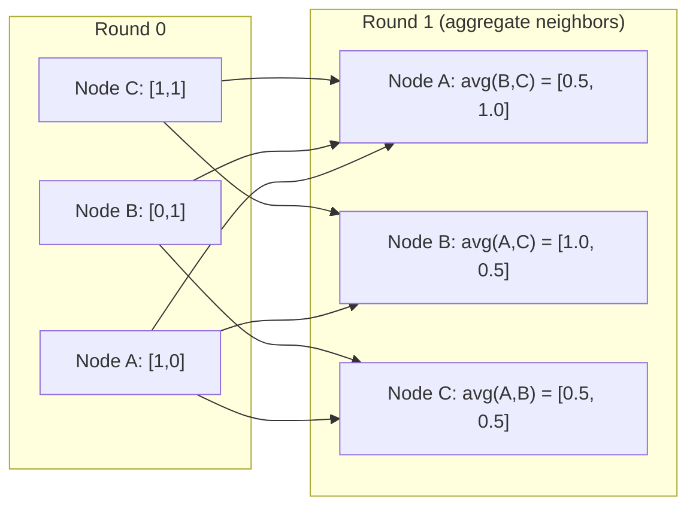

# Teoría de gráficos para el aprendizaje automático

> Los gráficos son la estructura de datos de las relaciones. Si sus datos tienen conexiones, necesitas teoría de gráficos.

**Type:** Build
**Language:**Python
**Prerequisites:** Phase 1, Lessons 01-03 (linear algebra, matrices)
**Time:** ~90 minutes

## Objetivos de aprendizaje

- Construir una clase de gráfico con representaciones de matriz/lista adyacentes e implementar BFS y DFS.
- Computa el gráfico Laplacian y utiliza sus valores propios para detectar componentes conectados y nodos de grupo
- Implementar una ronda de mensaje de estilo GNN que pasa como una matriz de adyacencia multiplicada normalizada
- Aplicar agrupamiento espectral para particionar un gráfico utilizando el vector Fiedler

## El problema

Las redes sociales, las moléculas, las bases de conocimiento, las redes de citas, los mapas de carreteras, todo son gráficos. La ML tradicional trata los datos como tablas planas. Cada fila es independiente. Cada característica es una columna. Pero cuando la estructura de las conexiones importa, las tablas fallan.

Consideremos una red social. Quieres predecir qué producto comprará un usuario. Su historial de compras importa. Pero el historial de compras de sus amigos importa más. Las conexiones llevan señal.

O considerar una molécula. Quieres predecir si se une a una proteína. Los átomos son importantes, pero lo que realmente importa es cómo los átomos se unen entre sí. La estructura es los datos.

Las redes neuronales gráficas (GNN) son el área de aprendizaje profundo que más rápido crece. impulsan el descubrimiento de drogas, la recomendación social, la detección de fraude y el razonamiento gráfico del conocimiento.

Necesitas cuatro cosas:
1. Una forma de representar gráficos como matrices (para que pueda multiplicarlos)
2. Algorithms de travesía para explorar la estructura del gráfico
3. El Laplacio - la matriz más importante en la teoría de gráficos espectrales
4. Transmisiones de mensajes - la operación que hace que GNNs funcionen

## El concepto

### Gráficos: nodos y bordes

Un gráfico G = (V, E) consiste en vértices (nodos) V y bordes E. Cada borde conecta dos nodos.

**Directed vs undirected.**En un gráfico no dirigido, el borde (u, v) significa que u se conecta a v Y v se conecta a u. En un gráfico dirigido (digrafo), el borde (u, v) significa que u apunta a v, pero no necesariamente al revés.

**Weighted vs unweighted.**En un gráfico sin peso, los bordes o bien existen o no. En un gráfico ponderado, cada borde tiene un peso numérico: una distancia, un costo, una fuerza.

| Graph type | Example |
|-----------|---------|
| Undirected, unweighted | Facebook friendship network |
| Directed, unweighted | Twitter follow network |
| Undirected, weighted | Road map (distances) |
| Directed, weighted | Web page links (PageRank scores) |

### La matriz de la proximidad

La matriz de adyacencia A es la representación del núcleo. Para un gráfico con n nodos:

```
A[i][j] = 1    if there is an edge from node i to node j
A[i][j] = 0    otherwise
```

Para los gráficos no dirigidos, A es simétrico: A[i][j] = A[j][i]. Para los gráficos ponderados, A[i][j] = peso del borde (i, j).

**Example -- a triangle:**

```
Nodes: 0, 1, 2
Edges: (0,1), (1,2), (0,2)

A = [[0, 1, 1],
     [1, 0, 1],
     [1, 1, 0]]
```

La matriz de adyacencia es la entrada de cada GNN. Las operaciones de la matriz en A corresponden a las operaciones en el gráfico.

### Grado

El grado de un nodo es el número de bordes conectados a él. Para los gráficos dirigidos, tienes en grado (edges entering) y en grado (edges going out).

La matriz de grados D es diagonal:

```
D[i][i] = degree of node i
D[i][j] = 0    for i != j
```

Para el ejemplo del triángulo: D = diag(2, 2, 2) porque cada nodo se conecta a otros dos.

El grado le dice sobre la importancia de los nodos. El grado alto = nodo de centro. La distribución de grado de una red revela su estructura. Las redes sociales siguen las leyes de potencia (pocos centros, muchos nodos de hoja).

### BFS y DFS

Los dos algoritmos fundamentales de travesía de gráficos.

**Breadth-First Search (BFS):**Explora primero todos los vecinos, luego los vecinos de los vecinos.

```
BFS from node 0:
  Visit 0
  Queue: [1, 2]        (neighbors of 0)
  Visit 1
  Queue: [2, 3]        (add neighbors of 1)
  Visit 2
  Queue: [3]           (neighbors of 2 already visited)
  Visit 3
  Queue: []            (done)
```

BFS encuentra los caminos más cortos en gráficos sin ponderación. La distancia desde el inicio hasta cualquier nodo es igual al nivel BFS en el que ese nodo es descubierto por primera vez. Esta es la razón por la que BFS se utiliza para las distancias de recuento de espera en las redes sociales.

**Depth-First Search (DFS):**Ir lo más profundo posible antes de retroceder.

```
DFS from node 0:
  Visit 0
  Stack: [1, 2]        (neighbors of 0)
  Visit 2               (pop from stack)
  Stack: [1, 3]         (add neighbors of 2)
  Visit 3               (pop from stack)
  Stack: [1]
  Visit 1               (pop from stack)
  Stack: []             (done)
```

DFS es útil para:
- Encontrar componentes conectados (ejecutar DFS desde nodos no visitados)
- Detección de ciclos (borda trasera en árbol DFS)
- Sortado topológico (orden de finalización inverso de DFS)

| Algorithm | Data structure | Finds | Use case |
|-----------|---------------|-------|----------|
| BFS | Queue | Shortest paths | Social network distance, knowledge graph traversal |
| DFS | Stack | Components, cycles | Connectivity, topological sort |

### El gráfico laplaciano

L = D - A. La matriz más importante en la teoría de gráficos espectrales.

Para el triángulo:

```
D = [[2, 0, 0],    A = [[0, 1, 1],    L = [[2, -1, -1],
     [0, 2, 0],         [1, 0, 1],         [-1, 2, -1],
     [0, 0, 2]]         [1, 1, 0]]         [-1, -1,  2]]
```

El laplacio tiene propiedades notables:

1. **L is positive semi-definite.**Todos los valores propios son >= 0.

2. **The number of zero eigenvalues equals the number of connected components.**Un gráfico conectado tiene exactamente un valor propio cero. Un gráfico con 3 componentes desconectados tiene tres valores propios cero.

3. **The smallest non-zero eigenvalue (Fiedler value) measures connectivity.**Un gran valor Fiedler significa que el gráfico está bien conectado. Un pequeño valor Fiedler significa que el gráfico tiene un punto débil - un cuello de botella.

4. **The eigenvector of the Fiedler value (Fiedler vector) reveals the best split.**Los nodos con valores positivos van en un grupo, los nodos con valores negativos van en el otro.



### Propiedades espectral

Los valores propios de la matriz adyacente y el laplaciano revelan propiedades estructurales sin ningún cruce.

**Spectral clustering**funciona así:
1. Cuenta el Laplacio L
2. Encuentra los k vectores propios más pequeños de L (salta el primero, que es todos-ones para los gráficos conectados)
3. Utilice esos propios vectores como nuevas coordenadas para cada nodo
4. Ejecutar k-medias en esas coordenadas

Los propios vectores de L codifican las funciones "más suaves" en el gráfico. Los nodos que están bien conectados obtienen valores propios similares. Los nodos separados por un cuello de botella obtienen valores diferentes. Los propios vectores naturalmente separan grupos.

**Random walk connection.**El laplaciano normalizado se relaciona con caminatas aleatorias en el gráfico. La distribución estacionaria de un paseo aleatorio es proporcional al grado de nodo. El tiempo de mezcla (cuán rápido converge el paseo) depende de la brecha espectral.

### El mensaje se pasa

El núcleo de operaciones de las redes neuronales gráficas. Cada nodo recoge mensajes de sus vecinos, los agrega y actualiza su propio estado.

```
h_v^(k+1) = UPDATE(h_v^(k), AGGREGATE({h_u^(k) : u in neighbors(v)}))
```

En la forma más simple, AGGREGATE = media y UPDATE = transformación lineal + activación:

```
h_v^(k+1) = sigma(W * mean({h_u^(k) : u in neighbors(v)}))
```

Esto es la multiplicación de matriz disfrazada. Si H es la matriz de todas las características del nodo y A es la matriz de adyacencia:

```
H^(k+1) = sigma(A_norm * H^(k) * W)
```

donde A_norm es la matriz de adyacencia normalizada (cada fila suma a 1).

Una ronda de mensajes que pasa permite a cada nodo "ver" a sus vecinos inmediatos. Dos rondas le permiten ver vecinos de vecinos.



### Conceptos y aplicaciones de ML

| Concept | ML Application |
|---------|---------------|
| Adjacency matrix | GNN input representation |
| Graph Laplacian | Spectral clustering, community detection |
| BFS/DFS | Knowledge graph traversal, path finding |
| Degree distribution | Node importance, feature engineering |
| Message passing | GNN layers (GCN, GAT, GraphSAGE) |
| Eigenvalues of L | Community detection, graph partitioning |
| Spectral clustering | Unsupervised node grouping |
| PageRank | Node importance, web search |

```figure
graph-degree-distribution
```

## Construye el mismo

### Paso 1: Clase de gráfico desde cero

```python
class Graph:
    def __init__(self, n_nodes, directed=False):
        self.n = n_nodes
        self.directed = directed
        self.adj = {i: {} for i in range(n_nodes)}

    def add_edge(self, u, v, weight=1.0):
        self.adj[u][v] = weight
        if not self.directed:
            self.adj[v][u] = weight

    def neighbors(self, node):
        return list(self.adj[node].keys())

    def degree(self, node):
        return len(self.adj[node])

    def adjacency_matrix(self):
        import numpy as np
        A = np.zeros((self.n, self.n))
        for u in range(self.n):
            for v, w in self.adj[u].items():
                A[u][v] = w
        return A

    def degree_matrix(self):
        import numpy as np
        D = np.zeros((self.n, self.n))
        for i in range(self.n):
            D[i][i] = self.degree(i)
        return D

    def laplacian(self):
        return self.degree_matrix() - self.adjacency_matrix()
```

La lista de adyacentes (`self.adj`La conversión de matriz de adyacencia utiliza numpy porque todas las operaciones espectral lo necesitan.

### Paso 2: BFS y DFS

```python
from collections import deque

def bfs(graph, start):
    visited = set()
    order = []
    distances = {}
    queue = deque([(start, 0)])
    visited.add(start)
    while queue:
        node, dist = queue.popleft()
        order.append(node)
        distances[node] = dist
        for neighbor in graph.neighbors(node):
            if neighbor not in visited:
                visited.add(neighbor)
                queue.append((neighbor, dist + 1))
    return order, distances


def dfs(graph, start):
    visited = set()
    order = []
    stack = [start]
    while stack:
        node = stack.pop()
        if node in visited:
            continue
        visited.add(node)
        order.append(node)
        for neighbor in reversed(graph.neighbors(node)):
            if neighbor not in visited:
                stack.append(neighbor)
    return order
```

BFS utiliza un deque (cuadra doble) para O(1) popleft. DFS utiliza una lista como una pila. Ambos visitan cada nodo exactamente una vez - O(V + E) tiempo.

### Paso 3: Componentes conectados y valores propios laplacios

```python
def connected_components(graph):
    visited = set()
    components = []
    for node in range(graph.n):
        if node not in visited:
            order, _ = bfs(graph, node)
            visited.update(order)
            components.append(order)
    return components


def laplacian_eigenvalues(graph):
    import numpy as np
    L = graph.laplacian()
    eigenvalues = np.linalg.eigvalsh(L)
    return eigenvalues
```

`eigvalsh`Es para matrices simétricas - el Laplacian es siempre simétrico para gráficos no dirigidos. devuelve valores propios en orden ascendente. Cuenta los ceros para encontrar el número de componentes conectados.

### Paso 4: Clustering espectral

```python
def spectral_clustering(graph, k=2):
    import numpy as np
    L = graph.laplacian()
    eigenvalues, eigenvectors = np.linalg.eigh(L)
    features = eigenvectors[:, 1:k+1]

    labels = np.zeros(graph.n, dtype=int)
    for i in range(graph.n):
        if features[i, 0] >= 0:
            labels[i] = 0
        else:
            labels[i] = 1
    return labels
```

Para k=2, el signo del vector de Fiedler divide el gráfico en dos grupos. para k>2, ejecutarías k-medias en los primeros k vectores propios (excluyendo el trivial vector propio de todos los únicos).

### Paso 5: Transmisión del mensaje

```python
def message_passing(graph, features, weight_matrix):
    import numpy as np
    A = graph.adjacency_matrix()
    row_sums = A.sum(axis=1, keepdims=True)
    row_sums[row_sums == 0] = 1
    A_norm = A / row_sums
    aggregated = A_norm @ features
    output = aggregated @ weight_matrix
    return output
```

Esta es una ronda de transmisión de mensajes GNN. Las nuevas características de cada nodo son el promedio ponderado de las características de sus vecinos, transformado por la matriz de peso.

## Usalo

Con networkx y numpy, las mismas operaciones son de una línea:

```python
import networkx as nx
import numpy as np

G = nx.karate_club_graph()

A = nx.adjacency_matrix(G).toarray()
L = nx.laplacian_matrix(G).toarray()

eigenvalues = np.linalg.eigvalsh(L.astype(float))
print(f"Smallest eigenvalues: {eigenvalues[:5]}")
print(f"Connected components: {nx.number_connected_components(G)}")

communities = nx.community.greedy_modularity_communities(G)
print(f"Communities found: {len(communities)}")

pr = nx.pagerank(G)
top_nodes = sorted(pr.items(), key=lambda x: x[1], reverse=True)[:5]
print(f"Top 5 PageRank nodes: {top_nodes}")
```

networkx maneja gráficos de cualquier tamaño con backends optimizados en C. Utilice en la producción. Utilice su implementación desde cero para entender lo que hace.

### análisis espectral de la nudidad

```python
import numpy as np

A = np.array([
    [0, 1, 1, 0, 0],
    [1, 0, 1, 0, 0],
    [1, 1, 0, 1, 0],
    [0, 0, 1, 0, 1],
    [0, 0, 0, 1, 0]
])

D = np.diag(A.sum(axis=1))
L = D - A

eigenvalues, eigenvectors = np.linalg.eigh(L)
print(f"Eigenvalues: {np.round(eigenvalues, 4)}")
print(f"Fiedler value: {eigenvalues[1]:.4f}")
print(f"Fiedler vector: {np.round(eigenvectors[:, 1], 4)}")

fiedler = eigenvectors[:, 1]
group_a = np.where(fiedler >= 0)[0]
group_b = np.where(fiedler < 0)[0]
print(f"Cluster A: {group_a}")
print(f"Cluster B: {group_b}")
```

El vector Fiedler hace la tarea pesada. entradas positivas en un grupo, negativas en el otro. No se necesita optimización iterativa, sólo una propia composición.

## Envío

Esta lección produce:
- `outputs/skill-graph-analysis.md`-- una referencia de habilidades para analizar datos estructurados en gráficos

## Las conexiones

| Concept | Where it shows up |
|---------|------------------|
| Adjacency matrix | GCN, GAT, GraphSAGE input |
| Laplacian | Spectral clustering, ChebNet filters |
| BFS | Knowledge graph traversal, shortest path queries |
| Message passing | Every GNN layer, neural message passing |
| Spectral gap | Graph connectivity, mixing time of random walks |
| Degree distribution | Power-law networks, node feature engineering |
| Connected components | Preprocessing, handling disconnected graphs |
| PageRank | Node importance ranking, attention initialization |

Las GNN merecen mención especial. La operación de convolución de gráfico en GCN (Kipf & Welling, 2017) utiliza la matriz de adyacencia con los bucles automáticos añadidos, A_hat = A + I:

```text
H^(l+1) = sigma(D_hat^(-1/2) * A_hat * D_hat^(-1/2) * H^(l) * W^(l))
```

donde A_hat = A + I (adyacencia más auto-bucles) y D_hat es la matriz de grados de A_hat. Los circuitos automáticos aseguran que cada nodo incluya sus propias características durante la agregación. Este es exactamente el mensaje que pasa con normalización simétrica. D_hat^(-1/2) * A_hat * D_hat^(-1/2) es la matriz de adyacencia normalizada. El Laplaciano aparece porque esta normalización está relacionada con L_sym = I - D^(-1/2) * A * D^(-1/2). Comprender el Laplacio significa entender por qué funcionan las GCN.

## Los ejercicios

1. **Implement PageRank from scratch.**Comience con puntuaciones uniformes. En cada paso: puntuación(v) = (1-d) /n + d * suma(puntuación(u) /out_degree(u)) para todos los u que apuntan a v. Utilice d=0.85.

2. **Find communities using spectral clustering.**Crear un gráfico con dos grupos claramente separados (por ejemplo, dos cliques conectados por un solo borde). ejecutar el agrupamiento espectral y verificar que encuentra la división correcta. ¿Qué sucede cuando se añaden más bordes cruzados de grupo?

3. **Implement Dijkstra's algorithm**Comparar los resultados con BFS en el mismo gráfico con pesos uniformes.

4. **Build a 2-layer message passing network.**Aplicar el mensaje que pasa dos veces con diferentes matrices de peso. Muestre que después de 2 rondas, cada nodo tiene información de su vecindario de 2 pasos.

5. **Analyze a real-world graph.**Utilice el gráfico del Club de Karate (34 nodos, 78 bordes). Computa la distribución de grados, los valores propios de Laplacia y el agrupamiento espectral. Compara el resultado del agrupamiento espectral con la división de verdad de tierra conocida.

## Términos clave

| Term | What people say | What it actually means |
|------|----------------|----------------------|
| Graph | "Nodes and edges" | A mathematical structure G=(V,E) encoding pairwise relationships |
| Adjacency matrix | "The connection table" | An n x n matrix where A[i][j] = 1 if nodes i and j are connected |
| Degree | "How connected a node is" | The number of edges touching a node |
| Laplacian | "D minus A" | L = D - A, the matrix whose eigenvalues reveal graph structure |
| Fiedler value | "The algebraic connectivity" | The smallest non-zero eigenvalue of L, measuring how well-connected the graph is |
| BFS | "Level-by-level search" | Traversal that visits all neighbors before going deeper, finds shortest paths |
| DFS | "Go deep first" | Traversal that follows one path to its end before backtracking |
| Message passing | "Nodes talk to neighbors" | Each node aggregates information from its neighbors, the core of GNNs |
| Spectral clustering | "Cluster by eigenvectors" | Partition a graph using eigenvectors of its Laplacian |
| Connected component | "A separate piece" | A maximal subgraph where every node can reach every other node |

## Leer más

- **Kipf & Welling (2017)**-- "Clasificación semisupervisada con redes convolutivas de gráficos". El documento que lanzó las GNNs modernas. Muestra que las convoluciones de gráficos espectrales simplifican el pasaje de mensajes.
- **Spielman (2012)**-- "Teoría del gráfico espectral" notas de conferencia. La introducción definitiva a los laplacios, las lagunas espectral, y la partición del gráfico.
- **Hamilton (2020)**-- "Aprendizaje de representación gráfica". Libro que abarca las GNN desde los fundamentos hasta las aplicaciones.
- **Bronstein et al. (2021)**-- "Depth Learning Geometric: Grids, Groups, Graphs, Geodesics, and Gauges". El documento marco unificador.
- **Veličković et al. (2018)**-- "Graph Attention Networks". Ampliará el mensaje que pasa con mecanismos de atención.
