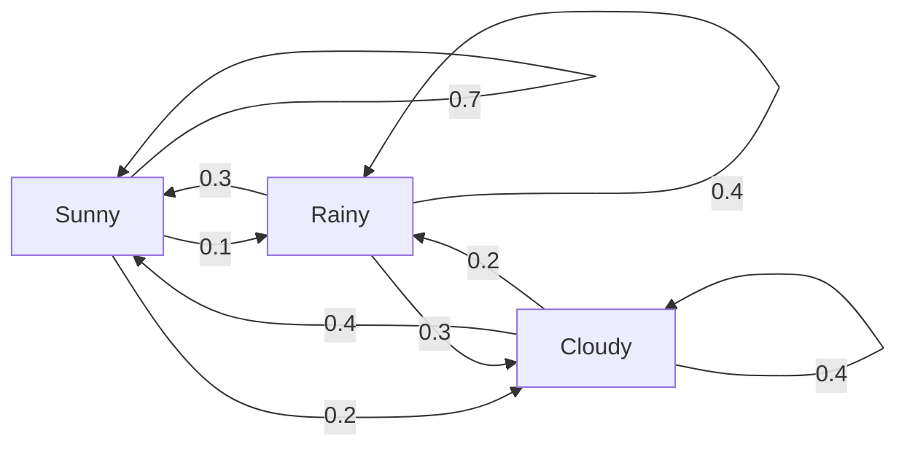
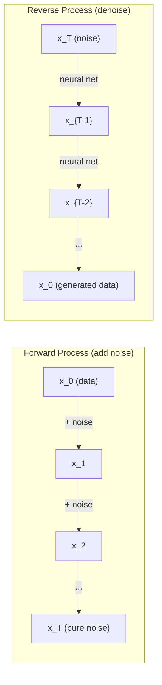

# Procesos estocásticos

> La matemática detrás de los paseos aleatorios, las cadenas de Markov y los modelos de difusión.

**Type:** Learn
**Language:**Python
**Prerequisites:** Phase 1, Lessons 06-07 (probability, Bayes)
**Time:** ~75 minutes

## Objetivos de aprendizaje

- Simula las caminatas aleatorias 1D y 2D y verifica la escala de desplazamiento
- Construir un simulador de cadena de Markov y calcular su distribución estacionaria a través de la propia composición
- Implementar la dinámica MCMC y Langevin de Metropolis-Hastings para la toma de muestras de las distribuciones objetivo
- Conecte el proceso de difusión hacia adelante al movimiento de Brownian y explique cómo el proceso inverso genera datos

## El problema

Muchos sistemas de IA implican aleatoriedad que evoluciona con el tiempo, no aleatoriedad estática, aleatoriedad estructurada y secuencial donde cada paso depende de lo que pasó antes.

Los modelos de lenguaje generan tokens uno a la vez. Cada token depende del contexto anterior. El modelo saca una distribución de probabilidad, muestras de ella, y se mueve. Ese es un proceso estocástico.

Los modelos de difusión añaden ruido a una imagen paso a paso hasta que se convierte en pura estática. Luego revertir el proceso, denonizando paso a paso hasta que surja una nueva imagen. El proceso hacia adelante es una cadena de Markov. El proceso inverso es una cadena de Markov aprendida que corre hacia atrás.

Los agentes de aprendizaje de refuerzo toman acciones en un entorno. Cada acción conduce a un nuevo estado con cierta probabilidad. El agente sigue una política aleatoria en un mundo aleatorio. Todo es un proceso de decisión de Markov.

El muestreo MCMC - la columna vertebral de la inferencia bayesiana - construye una cadena de Markov cuya distribución estacionaria es la posterior de la que quieres tomar muestras.

Todo esto se basa en cuatro ideas fundamentales:
1. Paseos aleatorios - el proceso estocástico más simple
2. Cadenas de Markov -- aleatoriedad estructurada con una matriz de transición
3. Dinámica de Langevin - Descenso de gradiente con ruido
4. Metropolis-Hastings -- muestreo de cualquier distribución

## El concepto

### Paseos aleatorios

Comience en la posición 0. En cada paso, lanza una moneda justa. cabezas: mueve a la derecha (+1).

Después de n pasos, su posición es la suma de n valores aleatorios +/-1. La posición esperada es 0 (el paseo es imparcial). Pero la distancia esperada del origen crece como sqrt(n).

Esto es contrario a la intuición. La caminata es justa - no se deriva en ninguna dirección. Pero con el tiempo, vaga más y más lejos de donde comenzó. La desviación estándar después de n pasos es sqrt(n).

```
Step 0:  Position = 0
Step 1:  Position = +1 or -1
Step 2:  Position = +2, 0, or -2
...
Step 100: Expected distance from origin ~ 10 (sqrt(100))
Step 10000: Expected distance from origin ~ 100 (sqrt(10000))
```

**In 2D**La misma escala de cuadrados se aplica a la distancia desde el origen. La ruta rastrea un patrón similar a un fractal.

**Why sqrt(n)?**Cada paso es +1 o -1 con igual probabilidad. Después de n pasos, la posición S_n = X_1 + X_2 + ... + X_n donde cada X_i es +/-1. La varianza de cada paso es 1, y los pasos son independientes, por lo que Var(S_n) = n. Desviación estándar = sqrt(n).

Esta escala de cuadrados se muestra en todas partes en ML. SGD escala el ruido como 1/sqrt(batch_size).

**Connection to Brownian motion.**Tomar un paseo aleatorio con el tamaño del paso 1/sqrt(n) y n pasos por unidad de tiempo. A medida que n va al infinito, el paseo converge al movimiento browniano B(t) - un proceso continuo en el tiempo donde B(t) se distribuye normalmente con la media 0 y la varianza t.

El movimiento browniano es la base matemática de la difusión. Modela el sacudimiento aleatorio de partículas en un fluido, las fluctuaciones de los precios de las acciones y, lo que es crucial, el proceso de ruido en los modelos de difusión.

**Gambler's ruin.**Un caminante aleatorio que comienza en la posición k, con barreras de absorción en 0 y N. ¿Cuál es la probabilidad de llegar a N antes de 0? Para un paseo justo: P(llegar a N) = k/N. Esto es sorprendentemente simple y elegante. Se conecta con la teoría de los martingales - el paseo aleatorio justo es un martingale (valor futuro esperado = valor actual).

### Las cadenas de Markov

Una cadena de Markov es un sistema que transiciona entre estados de acuerdo a probabilidades fijas. La propiedad clave: el siguiente estado depende sólo del estado actual, no de la historia.

```
P(X_{t+1} = j | X_t = i, X_{t-1} = ...) = P(X_{t+1} = j | X_t = i)
```

Esto es la propiedad de Markov. Significa que se puede describir toda la dinámica con una matriz de transición P:

```
P[i][j] = probability of going from state i to state j
```

Cada fila de P suma a 1 (debes ir a algún lado).

**Example -- Weather:**

```
States: Sunny (0), Rainy (1), Cloudy (2)

P = [[0.7, 0.1, 0.2],    (if sunny: 70% sunny, 10% rainy, 20% cloudy)
     [0.3, 0.4, 0.3],    (if rainy: 30% sunny, 40% rainy, 30% cloudy)
     [0.4, 0.2, 0.4]]    (if cloudy: 40% sunny, 20% rainy, 40% cloudy)
```

Comienza en cualquier estado. Después de muchas transiciones, la distribución de estados converge a la distribución estacionaria pi, donde pi * P = pi. Este es el vector propio izquierdo de P con valor propio 1.

Para la cadena meteorológica, la distribución estacionaria es [0,55, 0,18, 0,27] -- a largo plazo, es soleado el 55% del tiempo independientemente del estado de inicio.



**Computing the stationary distribution.**Hay dos enfoques:

1. **Power method**: multiplicar cualquier distribución inicial por P repetidamente. Después de suficientes iteraciones, converge.
2. **Eigenvalue method**: encontrar el vector propio izquierdo de P con valor propio 1. Este es el vector propio de P^T con valor propio 1.

Ambos enfoques requieren que la cadena cumpla con las condiciones de convergencia.

**Convergence conditions.**Una cadena de Markov converge a una distribución estacionaria única si es:
- **Irreducible**: cada estado es accesible desde cualquier otro estado
- **Aperiodic**: la cadena no se ejecuta con un período fijo

La mayoría de las cadenas que encuentras en ML cumplen ambas condiciones.

**Absorbing states.**Un estado es absorbente si una vez que lo ingresas, nunca sales (P[i][i] = 1). Absorber cadenas de Markov modelos de procesos con estados terminales - un juego que termina, un cliente que se agita, una secuencia de tokens que golpea el token final del texto.

**Mixing time.**¿Cuántos pasos hasta que la cadena esté "cerca" de la distribución estacionaria? formalmente, el número de pasos hasta que la distancia total de variación de la estacionariedad caiga por debajo de algún umbral. mezcla rápida = pocos pasos necesarios. La brecha espectral de P (1 menos el segundo valor propio más grande) controla el tiempo de mezcla.

### Conexión con modelos de idiomas

La generación de tokens en un modelo de lenguaje es aproximadamente un proceso de Markov. Dado el contexto actual, el modelo produce una distribución sobre el siguiente token.

```
P(token_i) = exp(logit_i / temperature) / sum(exp(logit_j / temperature))
```

- Temperatura = 1,0: distribución estándar
- Temperatura < 1,0: más nítida (más determinista)
- Temperatura > 1,0: más plana (más aleatoria)
- Temperatura -> 0: argmax (compulsivo)

El muestreo de top-k se reduce a los tokens de mayor probabilidad k. El muestreo de top-p (núcleo) se reduce al conjunto más pequeño de tokens cuya probabilidad acumulada excede p. Ambos modifican las probabilidades de transición de Markov.

### Movimiento browniano

El límite de tiempo continuo de la marcha aleatoria. La posición B(t) tiene tres propiedades:
1. B(0) = 0
2. B(t) - B(s) se distribuye normalmente con la media 0 y la varianza t - s (para t > s)
3. Los incrementos en los intervalos no superpuestos son independientes

El movimiento browniano es continuo pero en ninguna parte diferenciable, se tambalea en todas las escalas.

En simulación discreta, se aproxima el movimiento browniano por:

```
B(t + dt) = B(t) + sqrt(dt) * z,    where z ~ N(0, 1)
```

La escala de sqrt(dt) es importante. proviene del teorema de límite central aplicado a los paseos aleatorios.

### Dinámica de Langevin

La dinámica de Langevin encuentra la distribución de probabilidades proporcional a exp(-U(x) /T), donde U es una función de energía y T es temperatura.

```
x_{t+1} = x_t - dt * gradient(U(x_t)) + sqrt(2 * T * dt) * z_t
```

Dos fuerzas actúan sobre la partícula:
1. **Gradient force**(-dt * gradiente(U)): empuja hacia la baja energía (como la descensía de gradiente)
2. **Random force**(sqrt(2*T*dt) * z): empuja en direcciones aleatorias (exploración)

A temperatura T = 0, esto es un descenso de gradiente puro. A temperatura alta, es casi un paseo aleatorio. A la temperatura adecuada, la partícula explora el paisaje energético y pasa más tiempo en regiones de baja energía.

**Connection to diffusion models.**El proceso avanzado de un modelo de difusión es:

```
x_t = sqrt(alpha_t) * x_{t-1} + sqrt(1 - alpha_t) * noise
```

Esta es una cadena de Markov que mezcla gradualmente los datos con el ruido.

El proceso inverso, pasar del ruido de vuelta a los datos, es también una cadena de Markov, pero sus probabilidades de transición son aprendidas por una red neuronal. La red aprende a predecir el ruido que se agregó en cada paso, y luego lo restará.



### MCMC: Cadena de Markov Monte Carlo

A veces se necesita tomar una muestra de una distribución p ((x) que se puede evaluar (hasta una constante) pero no puede tomar una muestra directamente. los posteriores bayesianos son el ejemplo clásico - usted sabe la probabilidad veces el anterior, pero la constante normalizadora es intratable.

**Metropolis-Hastings**construye una cadena de Markov cuya distribución estacionaria es p(x):

1. Comience en alguna posición x
2. Proponer una nueva posición x' de una distribución de propuesta Q(x'
3. Ratio de aceptación de cálculo: a(x') * Q(x (x) = (x) = (x) * (x) * (x)
4. Acepta x' con probabilidad min ((1, a). de lo contrario permanezca en x.
5. Repito, ¿qué quieres?

Si Q es simétrico, por ejemplo, Q(x' ( ( ( ( () ), = Q(x (x) ), la relación se simplifica a a = p(x') / p(x. Solo se necesita la relación de probabilidades - las constantes normalizadoras se cancelan.

La cadena está garantizada para converger a px en condiciones suaves. Pero la convergencia puede ser lenta si la propuesta es demasiado pequeña (caminar al azar) o demasiado grande (alto rechazo).

**Why it works.**El coeficiente de aceptación garantiza el equilibrio detallado: la probabilidad de estar en x y moverse a x' es igual a la probabilidad de estar en x' y moverse a x. El equilibrio detallado implica que p(x) es la distribución estacionaria de la cadena.

**Practical considerations:**
- **Burn-in**La cadena necesita tiempo para llegar a la distribución estacionaria desde su punto de partida.
- **Thinning**: mantener cada k-ta muestra para reducir la autocorrelación.
- **Multiple chains**Si convergen en la misma distribución, se tiene evidencia de convergencia.
- **Acceptance rate**En el caso de las propuestas gaussianas en dimensiones d, la tasa óptima de aceptación es de alrededor del 23% (Roberts & Rosenthal, 2001).

### Procesos estocásticos en IA

| Process | AI Application |
|---------|---------------|
| Random walk | Exploration in RL, Node2Vec embeddings |
| Markov chain | Text generation, MCMC sampling |
| Brownian motion | Diffusion models (forward process) |
| Langevin dynamics | Score-based generative models, SGLD |
| Markov decision process | Reinforcement learning |
| Metropolis-Hastings | Bayesian inference, posterior sampling |

```figure
random-walk-diffusion
```

## Construye el mismo

### Paso 1: Simulador de caminar aleatorio

```python
import numpy as np

def random_walk_1d(n_steps, seed=None):
    rng = np.random.RandomState(seed)
    steps = rng.choice([-1, 1], size=n_steps)
    positions = np.concatenate([[0], np.cumsum(steps)])
    return positions


def random_walk_2d(n_steps, seed=None):
    rng = np.random.RandomState(seed)
    directions = rng.choice(4, size=n_steps)
    dx = np.zeros(n_steps)
    dy = np.zeros(n_steps)
    dx[directions == 0] = 1   # right
    dx[directions == 1] = -1  # left
    dy[directions == 2] = 1   # up
    dy[directions == 3] = -1  # down
    x = np.concatenate([[0], np.cumsum(dx)])
    y = np.concatenate([[0], np.cumsum(dy)])
    return x, y
```

El paseo 1D almacena sumas acumuladas. Cada paso es +1 o -1. Después de n pasos, la posición es la suma. La varianza crece linealmente con n, por lo que la desviación estándar crece como sqrt(n).

### Paso 2: cadena de Markov

```python
class MarkovChain:
    def __init__(self, transition_matrix, state_names=None):
        self.P = np.array(transition_matrix, dtype=float)
        self.n_states = len(self.P)
        self.state_names = state_names or [str(i) for i in range(self.n_states)]

    def step(self, current_state, rng=None):
        if rng is None:
            rng = np.random.RandomState()
        probs = self.P[current_state]
        return rng.choice(self.n_states, p=probs)

    def simulate(self, start_state, n_steps, seed=None):
        rng = np.random.RandomState(seed)
        states = [start_state]
        current = start_state
        for _ in range(n_steps):
            current = self.step(current, rng)
            states.append(current)
        return states

    def stationary_distribution(self):
        eigenvalues, eigenvectors = np.linalg.eig(self.P.T)
        idx = np.argmin(np.abs(eigenvalues - 1.0))
        stationary = np.real(eigenvectors[:, idx])
        stationary = stationary / stationary.sum()
        return np.abs(stationary)
```

La distribución estacionaria es el propio vector izquierdo de P con valor propio 1. Lo encontramos mediante el cálculo de los propios vectores de P^T (transponer los propios vectores izquierdo en propios vectores derechosos).

### Paso 3: Dinámica de Langevin

```python
def langevin_dynamics(grad_U, x0, dt, temperature, n_steps, seed=None):
    rng = np.random.RandomState(seed)
    x = np.array(x0, dtype=float)
    trajectory = [x.copy()]
    for _ in range(n_steps):
        noise = rng.randn(*x.shape)
        x = x - dt * grad_U(x) + np.sqrt(2 * temperature * dt) * noise
        trajectory.append(x.copy())
    return np.array(trajectory)
```

El gradiente empuja x hacia la energía baja. El ruido evita que se atasque. En equilibrio, la distribución de las muestras es proporcional a exp(-U(x) / temperatura).

### Paso 4: Metrópolis-Hastings

```python
def metropolis_hastings(target_log_prob, proposal_std, x0, n_samples, seed=None):
    rng = np.random.RandomState(seed)
    x = np.array(x0, dtype=float)
    samples = [x.copy()]
    accepted = 0
    for _ in range(n_samples - 1):
        x_proposed = x + rng.randn(*x.shape) * proposal_std
        log_ratio = target_log_prob(x_proposed) - target_log_prob(x)
        if np.log(rng.rand()) < log_ratio:
            x = x_proposed
            accepted += 1
        samples.append(x.copy())
    acceptance_rate = accepted / (n_samples - 1)
    return np.array(samples), acceptance_rate
```

El algoritmo propone un nuevo punto, verifica si tiene una probabilidad mayor (o acepta con probabilidad proporcional a la proporción) y repite.

## Usalo

En la práctica, se utilizan bibliotecas establecidas para estos algoritmos, pero entender la mecánica es importante para el depuración y sintonización.

```python
import numpy as np

rng = np.random.RandomState(42)
walk = np.cumsum(rng.choice([-1, 1], size=10000))
print(f"Final position: {walk[-1]}")
print(f"Expected distance: {np.sqrt(10000):.1f}")
print(f"Actual distance: {abs(walk[-1])}")
```

### Numpy para matrices de transición

```python
import numpy as np

P = np.array([[0.7, 0.1, 0.2],
              [0.3, 0.4, 0.3],
              [0.4, 0.2, 0.4]])

distribution = np.array([1.0, 0.0, 0.0])
for _ in range(100):
    distribution = distribution @ P

print(f"Stationary distribution: {np.round(distribution, 4)}")
```

Multiplicar la distribución inicial por P repetidamente. Después de suficientes iteraciones, converge a la distribución estacionaria independientemente de dónde comenzó. Este es el método de potencia para encontrar el vector propio izquierdo dominante.

### Conexiones con marcos reales

- **PyTorch diffusion:**El `DDPMScheduler`En el rostro abrazado`diffusers`Implementa las cadenas Markov hacia adelante y hacia atrás
- **NumPyro / PyMC:**Utilice MCMC (muestreo NUTS, que mejora en Metropolis-Hastings) para la inferencia bayesiana
- **Gymnasium (RL):**La función de paso medio ambiente define un proceso de decisión de Markov

### Verificación de la convergencia de la cadena de Markov

```python
import numpy as np

P = np.array([[0.9, 0.1], [0.3, 0.7]])

eigenvalues = np.linalg.eigvals(P)
spectral_gap = 1 - sorted(np.abs(eigenvalues))[-2]
print(f"Eigenvalues: {eigenvalues}")
print(f"Spectral gap: {spectral_gap:.4f}")
print(f"Approximate mixing time: {1/spectral_gap:.1f} steps")
```

La brecha espectral le dice a qué tan rápido la cadena olvida su estado inicial. Una brecha de 0.2 significa aproximadamente 5 pasos para mezclar. Una brecha de 0.01 significa aproximadamente 100 pasos. Siempre compruebe esto antes de ejecutar simulaciones largas - un cálculo de residuos de cadena mezclar lentamente.

## Envío

Esta lección produce:
- `outputs/prompt-stochastic-process-advisor.md`-- un prompt que ayuda a identificar qué marco de proceso estocástico se aplica a un problema dado

## Las conexiones

| Concept | Where it shows up |
|---------|------------------|
| Random walk | Node2Vec graph embeddings, exploration in RL |
| Markov chain | Token generation in LLMs, MCMC sampling |
| Brownian motion | Forward diffusion process in DDPM, SDE-based models |
| Langevin dynamics | Score-based generative models, stochastic gradient Langevin dynamics (SGLD) |
| Stationary distribution | MCMC convergence target, PageRank |
| Metropolis-Hastings | Bayesian posterior sampling, simulated annealing |
| Temperature | LLM sampling, Boltzmann exploration in RL, simulated annealing |
| Mixing time | Convergence speed of MCMC, spectral gap analysis |
| Absorbing state | End-of-sequence token, terminal states in RL |
| Detailed balance | Correctness guarantee for MCMC samplers |

Los modelos de difusión merecen una atención especial.

```
q(x_t | x_{t-1}) = N(x_t; sqrt(1-beta_t) * x_{t-1}, beta_t * I)
```

donde beta_t es un cronograma de ruido. Después de T pasos, x_T es aproximadamente N(0, I). El proceso inverso es parametrizado por una red neuronal que predice el ruido:

```
p_theta(x_{t-1} | x_t) = N(x_{t-1}; mu_theta(x_t, t), sigma_t^2 * I)
```

Cada paso de generación es un paso en una cadena de Markov aprendida.

SGLD (Dynamics de Langevin de Gradiente Stocástico) combina la baja de gradiente de mini lote con el ruido de Langevin. En lugar de calcular el gradiente completo, se usa una estimación estocástica y se añade ruido calibrado. A medida que la tasa de aprendizaje disminuye, SGLD pasa de la optimización a la muestreo -- obtienes muestras posteriores bayesianas aproximadas de forma gratuita. Esta es una de las formas más simples de obtener estimaciones de incertidumbre de una red neuronal.

La clave de todas estas conexiones: los procesos estocásticos no son solo herramientas teóricas. Son los mecanismos computacionales dentro de los sistemas modernos de IA. Cuando ajustes la temperatura de un LLM, estás ajustando una cadena de Markov. Cuando entrenas un modelo de difusión, estás aprendiendo a revertir un proceso similar al movimiento browniano. Cuando ejecutas la inferencia bayesiana, estás construyendo una cadena que converge a la posterior.

## Los ejercicios

1. **Simulate 1000 random walks of 10000 steps.**Traza la distribución de las posiciones finales. Verifique que es aproximadamente gaussiano con media 0 y desviación estándar sqrt(10000) = 100.

2. **Build a text generator using a Markov chain.**Entrenamiento en un corpus pequeño: para cada palabra, contar las transiciones a la siguiente palabra. Construir la matriz de transición. Generar nuevas frases mediante muestreo de la cadena.

3. **Implement simulated annealing**El método de cálculo de la función de un mínimo de función con muchos mínimos locales es el método de cálculo de la función de una función de un mínimo de función con una función de una función de mayor temperatura.

4. **Compare Langevin dynamics at different temperatures.**Muestra de un potencial de pozo doble U(x) = (x^2 - 1)^2. a baja temperatura, las muestras se agrupan en un pozo. a alta temperatura, se propagan a través de ambos.

5. **Implement the forward diffusion process.**Comience con una señal 1D (por ejemplo, una onda seno). Agregue el ruido progresivamente más de 100 pasos con un cronograma de ruido lineal. Muestre cómo la señal se degrada a ruido puro. Luego implemente un simple denoizador que invierte el proceso (incluso uno ingenuo que solo restará el ruido estimado).

## Términos clave

| Term | What people say | What it actually means |
|------|----------------|----------------------|
| Random walk | "Coin-flip movement" | A process where position changes by random increments at each step |
| Markov property | "Memoryless" | The future depends only on the present state, not on the history |
| Transition matrix | "The probability table" | P[i][j] = probability of moving from state i to state j |
| Stationary distribution | "The long-run average" | The distribution pi where pi*P = pi -- the chain's equilibrium |
| Brownian motion | "Random jiggling" | The continuous-time limit of a random walk, B(t) ~ N(0, t) |
| Langevin dynamics | "Gradient descent with noise" | Update rule that combines deterministic gradient and random perturbation |
| MCMC | "Walking toward the target" | Constructing a Markov chain whose stationary distribution is the one you want |
| Metropolis-Hastings | "Propose and accept/reject" | MCMC algorithm that uses acceptance ratios to ensure convergence |
| Temperature | "The randomness knob" | Parameter controlling the tradeoff between exploration and exploitation |
| Diffusion process | "Noise in, noise out" | Forward: gradually add noise. Reverse: gradually remove it. Generates data. |

## Leer más

- **Ho, Jain, Abbeel (2020)**-- "Deniendo los modelos probabilísticos de difusión". El documento del DDPM que lanzó la revolución del modelo de difusión.
- **Song & Ermon (2019)**-- "Modelado generacional mediante la estimación de gradientes de la distribución de datos". Un enfoque basado en puntajes utilizando dinámica Langevin para muestreo.
- **Roberts & Rosenthal (2004)**"Cadenas generales de estado espacial Markov y algoritmos MCMC". La teoría detrás de cuándo y por qué funciona MCMC.
- **Norris (1997)**- "Cadenas de Markov". El libro de texto estándar.
- **Welling & Teh (2011)**-- "Aprendizaje bayesiano a través de la Dinámica de Langevin Gradiente Estocástico". Combina SGD con la Dinámica de Langevin para la inferencia bayesiana escalable.
