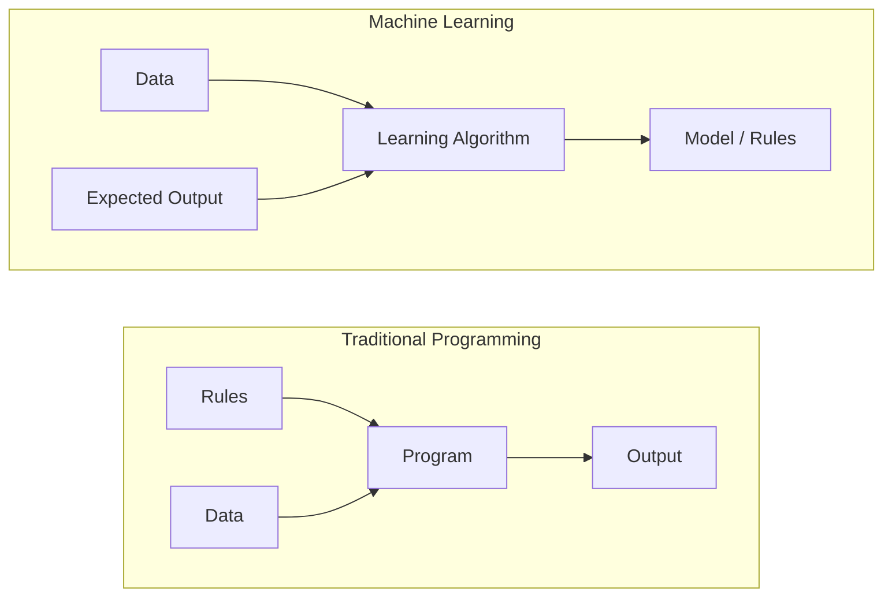
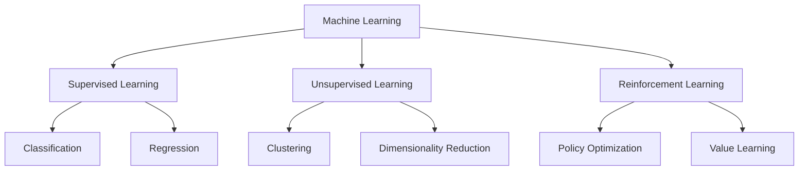
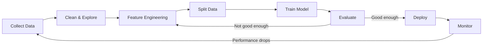
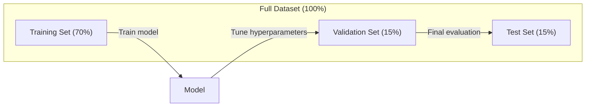
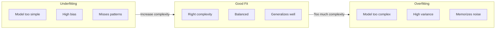
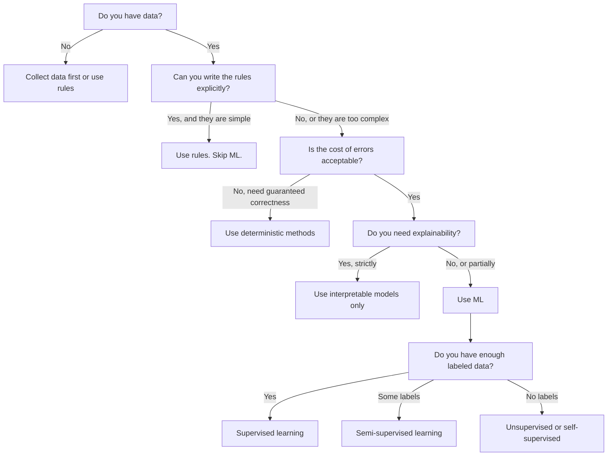

# ¿Qué es el aprendizaje automático?

> El aprendizaje automático enseña a las computadoras a encontrar patrones en los datos en lugar de escribir reglas a mano.

**Type:** Learn
**Languages:** Python
**Prerequisites:** Phase 1 (Math Foundations)
**Time:** ~45 minutes

## Objetivos de aprendizaje

- Explica la diferencia entre el aprendizaje supervisado, no supervisado y el refuerzo y identifique qué tipo se aplica a un problema dado
- Implementar un clasificador de centróides más cercano desde cero y evaluarlo en comparación con una línea de base aleatoria
- Distinguir entre las tareas de clasificación y regresión y seleccionar la función de pérdida apropiada para cada una
- Evaluar si un problema empresarial dado es adecuado para ML o mejor resuelto con reglas deterministas

## El problema

Si quieres construir un filtro de spam. El enfoque tradicional: sentarte y escribir cientos de reglas. "Si el correo electrónico contiene 'dinero GRATUITO', marca spam. Si tiene más de 3 marcas de exclamación, marca spam". Pasas semanas escribiendo reglas. Luego los spammers cambian su redacción. Tus reglas rompen. Escribas más reglas. El ciclo nunca termina.

El aprendizaje automático cambia esto. En lugar de escribir reglas, le das a la computadora miles de correos electrónicos etiquetados ("spam" o "no spam") y le dejas que descubra las reglas por sí mismo. La computadora encuentra patrones que nunca habrías pensado. Cuando los spammers cambian de táctica, se retrain en nuevos datos en lugar de reescribir código.

Este cambio de "reglas de programación" a "aprendizaje a partir de datos" es el núcleo del aprendizaje automático.

## El concepto

### Aprender de los datos, no de las reglas

La programación tradicional y el aprendizaje automático resuelven problemas en direcciones opuestas.



Programación tradicional: usted escribe las reglas. El programa las aplica a los datos para producir salida.

Aprendizaje automático: usted proporciona datos y resultados esperados. El algoritmo descubre las reglas.

El "modelo" que se obtiene de la formación es las reglas, codificadas como números (pesos, parámetros).

### Los tres tipos de aprendizaje automático



**Supervised Learning**El modelo aprende a mapear las entradas a las salidas.
- "Aquí hay 10.000 fotos etiquetadas como gato o perro. Aprende a distinguirlas".
- "Aquí están las características y precios de la casa. Aprende a predecir el precio".

**Unsupervised Learning**El modelo encuentra estructura por sí mismo.
- "Aquí hay 10.000 historias de compras de clientes.
- "Aquí hay 1.000 puntos de datos dimensionados. Reducir a 2 dimensiones mientras mantiene la estructura".

**Reinforcement Learning**Un agente toma medidas en un entorno y recibe recompensas o sanciones. Aprende una estrategia (política) para maximizar la recompensa total.
- "Juega este juego. +1 para ganar, -1 para perder.
- "Controlo este brazo robótico. +1 para recoger el objeto, -0.01 por cada segundo desperdiciado".

La mayoría de lo que construirás en la práctica utiliza aprendizaje supervisado. El aprendizaje no supervisado es común para el preprocesamiento y la exploración. El aprendizaje de refuerzo potencia la IA del juego, la robótica y RLHF para modelos de lenguaje.

### Más allá de los Tres Grandes

Las tres categorías anteriores son limpias, pero el ML del mundo real a menudo borra las líneas.

**Semi-supervised learning**El método de diagnóstico de la enfermedad de la piel es el de la piel, el de la piel, el de la piel, el de la piel, el de la piel, el de la piel, el de la piel, el de la piel, el de la piel, el de la piel, el de la piel, el de la piel, el de la piel, el de la piel, el de la piel, el de la piel, el de la piel, el de la piel, el de la piel, el de la piel, el de la piel, el de la piel, el de la piel, el de la piel, el de la piel, el de la piel, el de la piel, el de la piel, el de la piel, el de la piel, el de la piel, el de la piel, el de la piel, el de la piel, el de la piel, el de la piel, el de la piel, el de la piel, y el de la piel, el de la piel, de la piel, y el de la piel, de la piel, de la piel, de la piel, de la piel, y el de la piel, de la piel, de la piel, de la piel, de la piel, de la piel, de la piel, y el de la piel, de la piel, de la piel, de la piel, de la piel, y el de la piel, de la piel, de la piel, de la piel, de la piel, de la piel, y de la piel, de la piel, de la piel, de la piel, y de la piel, de la piel, de la piel, y de la piel, de la piel, de la piel, de la piel, de la piel, de la piel, y de la piel, de la piel, de la piel, de la piel, y de la piel, de la piel, de la piel, y de la piel, de la piel, de la piel, y de la piel, y de la piel, de la piel, y de la piel, de la piel, de la piel, de la piel, de la piel, y de la piel, de la piel, de la piel, por el cual se abrasi, por el cual es.

- **Label propagation:**Construir un gráfico que conecte puntos de datos similares. Las etiquetas se extienden de nodos etiquetados a vecinos sin etiquetado a través del gráfico.
- **Pseudo-labeling:**Entrenando un modelo en los datos etiquetados, usándolo para predecir las etiquetas de los datos sin etiquetar, luego retrenando en todo. El modelo inicia su propio conjunto de entrenamiento.
- **Consistency regularization:**El modelo debe dar la misma predicción para una entrada y una versión ligeramente perturbada de esa entrada.

**Self-supervised learning**El modelo crea su propia tarea de predicción a partir de la estructura de los datos.

- **Masked language modeling (BERT):**Escondir el 15% de las palabras en una oración, entrenar al modelo para predecir las palabras que faltan.
- **Contrastive learning (SimCLR):**Toma una imagen, crea dos versiones aumentadas. Entrena al modelo para reconocer que provienen de la misma imagen mientras las distingue de las versiones aumentadas de otras imágenes.
- **Next-token prediction (GPT):**Prevé la siguiente palabra dada toda la palabra anterior. Cada documento de texto se convierte en un ejemplo de entrenamiento.

Estas no son categorías separadas de las tres grandes. Son estrategias que combinan ideas supervisadas y no supervisadas. El aprendizaje auto supervisado es técnicamente supervisado (el modelo predice algo), pero las etiquetas se generan automáticamente, no por humanos.

### Clasificación frente a regresión

Estas son las dos principales tareas de aprendizaje supervisado.

| Aspect | Classification | Regression |
|--------|---------------|------------|
| Output | Discrete categories | Continuous numbers |
| Example | "Is this email spam?" | "What will the house price be?" |
| Output space | {cat, dog, bird} | Any real number |
| Loss function | Cross-entropy, accuracy | Mean squared error, MAE |
| Decision | Boundaries between classes | A curve that fits the data |

La clasificación responde a "¿qué categoría?" la regresión responde a "¿cuánto?"

Algunos problemas pueden ser enmarcados de cualquier manera. Predicir si una acción sube o baja es clasificación. Predicir el precio exacto es regresión.

### El flujo de trabajo de ML

Cada proyecto de aprendizaje automático sigue la misma línea de conducta, independientemente del algoritmo.



**Collect Data**La información de base es más importante que la cantidad.

**Clean & Explore**: Manejar los valores faltantes, eliminar los duplicados, visualizar las distribuciones, detectar anomalías.

**Feature Engineering**Conversión de datos en función de los datos en función de los datos en función de los datos en el modelo.

**Split Data**El modelo se forma en datos de formación, se ajustan los hiperparámetros a los datos de validación y se informa del rendimiento final en los datos de prueba.

**Train Model**El algoritmo ajusta los parámetros internos para minimizar una función de pérdida.

**Evaluate**Si el rendimiento no es aceptable, vuelva a probar diferentes características, algoritmos o hiperparámetros.

**Deploy**: Poner el modelo en producción donde haga predicciones sobre nuevos datos.

**Monitor**El sistema de datos de la empresa de gestión de datos (SMS) se ha convertido en un sistema de gestión de datos de datos de datos de datos de datos de datos de datos de datos de datos de datos de datos de datos de datos de datos de datos de datos de datos de datos de datos de datos de datos de datos de datos de datos de datos de datos de datos de datos de datos de datos de datos de datos de datos de datos de datos de datos de datos de datos de datos de datos de datos de datos de datos de datos de datos de datos de datos de datos de datos de datos de datos de datos de datos de datos de datos de datos de datos de datos de datos de datos de datos de datos de datos de datos de datos de datos de datos de datos de datos de datos de datos de datos de datos de datos de datos de datos de datos de datos de datos de datos de datos de datos de datos de datos de datos de datos de datos de datos de datos de datos de datos de datos de datos de datos de datos de datos de datos de datos de datos de datos de datos de datos de datos de datos de datos de datos de datos de datos de datos de datos de datos de datos de datos de datos de datos de datos de datos de datos de datos de datos de datos de datos de datos de datos de datos de datos de datos de datos de datos de datos de datos de datos de datos de datos de datos de datos de datos de datos de datos de datos de datos de datos de datos de datos de datos de datos de datos de datos de datos de datos de datos de datos de datos de datos de datos de datos de datos de datos de datos de datos de datos de datos de datos de datos de datos de datos de datos de datos de datos de datos de datos de datos de datos de datos de datos de datos de datos de datos de datos de datos de datos de datos de datos de datos de datos de datos de datos de datos de datos de datos de datos de datos de datos de datos de datos de datos de datos de datos de datos de datos de datos de datos de datos de datos de datos de datos de datos de datos de datos de datos de datos de datos de datos de datos de datos de datos de datos de datos de datos de datos de datos de datos de datos de datos de datos de datos de datos de datos de datos de datos de datos de datos de datos de datos de datos de datos de datos de datos de datos de datos de datos de datos de datos

### Entrenamiento, validación y pruebas

Este es el concepto más importante que los principiantes se equivocan. Debes evaluar tu modelo en datos que nunca ha visto durante el entrenamiento. De lo contrario estás midiendo la memorización, no el aprendizaje.



| Split | Purpose | When used | Typical size |
|-------|---------|-----------|-------------|
| Training | Model learns from this data | During training | 60-80% |
| Validation | Tune hyperparameters, compare models | After each training run | 10-20% |
| Test | Final unbiased performance estimate | Once, at the very end | 10-20% |

El conjunto de pruebas es sagrado. Lo miras exactamente una vez. Si sigues ajustando tu modelo basado en el rendimiento de la prueba, estás entrenando efectivamente en el conjunto de pruebas y tus números reportados no tienen sentido.

Para conjuntos de datos pequeños, utilice la validación cruzada k-fold: dividir los datos en k partes, entrenar en k-1 partes, validar en la parte restante, girar y resultados promedio.

### El exceso de ajuste vs el exceso de ajuste



**Underfitting**El modelo es demasiado simple para capturar los patrones en los datos. Una línea recta tratando de encajar en una relación curva. El error de entrenamiento es alto. El error de prueba es alto.

**Overfitting**El modelo es demasiado complejo y memoriza los datos de entrenamiento, incluido su ruido. Una curva de movimiento que pasa a través de cada punto de entrenamiento pero falla en nuevos datos. El error de entrenamiento es bajo. El error de prueba es alto.

**Good fit**El modelo capta patrones reales sin memorizar ruido.

Signos de sobreajuste:
- La precisión de la formación es mucho mayor que la de la validación
- El modelo se desempeña bien en los datos de formación pero mal en los nuevos datos
- La adición de más datos de formación mejora el rendimiento (el modelo era memorizar, no aprender)

Las fijas para sobreequipamiento:
- Obtenga más datos de entrenamiento
- Reducir la complejidad del modelo (menos parámetros, arquitectura más simple)
- Regularización (agrega una penalización para pesos grandes)
- Descanso (descanso aleatorio de neuronas durante el entrenamiento)
- Detenerse temprano (detener la formación cuando el error de validación comienza a aumentar)

Los equipos de montaje:
- Utilice un modelo más complejo
- Añadir más características
- Reducir la regularización
- El tren más largo

### El desafío de las variaciones

Este es el marco matemático detrás de la sobremesa y la falta de ajuste.

**Bias**Un modelo lineal tiene un alto sesgo cuando la relación verdadera no es lineal.

**Variance**El modelo de formación con alta variación proporciona predicciones muy diferentes cuando se entrenan en diferentes subconjuntos de datos.

| Model complexity | Bias | Variance | Result |
|-----------------|------|----------|--------|
| Too low (linear model for curved data) | High | Low | Underfitting |
| Just right | Medium | Medium | Good generalization |
| Too high (degree-20 polynomial for 10 points) | Low | High | Overfitting |

Erro total = Bias^2 + Varianza + ruido irreducible

No se puede reducir el ruido irreducible (es aleatoriedad en los datos mismos).

### No hay teorema del almuerzo gratis

No hay un solo algoritmo que funcione mejor para cada problema. Un algoritmo que funciona bien en una clase de problemas funcionará mal en otra. Esta es la razón por la cual los científicos de datos prueban múltiples algoritmos y comparan resultados.

En la práctica, la elección depende de:
- ¿Cuántos datos tienes?
- ¿Cuántas características hay?
- Si la relación es lineal o no lineal
- Si necesita interpretación
- ¿Cuánto computación puedes permitirte?

### Cuando NO utilizar el aprendizaje automático

El ML es poderoso pero no siempre es la herramienta adecuada.

**Do not use ML when:**

- **Rules are simple and well-defined.**Calculo fiscal, algoritmos de clasificación, conversiones de unidades. Si puedes escribir la lógica en unos cuantos si-declaraciones, un modelo añade complejidad sin ningún beneficio.
- **You have no data or very little data.**El ML necesita ejemplos para aprender. Con 10 puntos de datos, no puedes entrenar nada significativo.
- **The cost of being wrong is catastrophic and you need guaranteed correctness.**El cálculo de la dosis médica, el control del reactor nuclear, la verificación criptográfica. Los modelos ML son probabilísticos. A veces estarán equivocados. Si "a veces equivocado" es inaceptable, utilice métodos deterministas.
- **A lookup table or heuristic solves the problem.**Si un umbral o una tabla simple cubren el 99% de los casos, agregar ML aumenta el coste de mantenimiento sin mejoras significativas.
- **You cannot explain the decision and explainability is required.**Las industrias reguladas (préstamos, seguros, justicia penal) a veces requieren que cada decisión sea completamente explicable.
- **The problem changes faster than you can retrain.**Si las reglas cambian diariamente y la reentrenamiento dura una semana, el modelo siempre está obsoleto.

Utilice este diagrama de flujo de decisiones:



```figure
f3-learning-boundary
```

## Construye el mismo

El código en `code/ml_intro.py`Implementa un clasificador de centroides más cercano desde cero, el algoritmo de ML más simple posible.

### Paso 1: Clasificador de centróides más cercano desde cero

El clasificador de centroides más cercano calcula el centro (medio) de cada clase en los datos de entrenamiento. Para predecir, asigna cada nuevo punto a la clase cuyo centro está más cerca.

```python
class NearestCentroid:
    def fit(self, X, y):
        self.classes = np.unique(y)
        self.centroids = np.array([
            X[y == c].mean(axis=0) for c in self.classes
        ])

    def predict(self, X):
        distances = np.array([
            np.sqrt(((X - c) ** 2).sum(axis=1))
            for c in self.centroids
        ])
        return self.classes[distances.argmin(axis=0)]
```

Eso es todo el algoritmo. Fit calcula dos medios. Predict calcula distancias. No hay descenso de gradiente, no hay iteración, no hay hiperparámetros.

### Paso 2: Entrenamiento en datos sintéticos

Generamos un conjunto de datos de clasificación 2D con dos clases que se superponen ligeramente. El clasificador de centroides traza un límite de decisión lineal entre los centros de clase.

```python
rng = np.random.RandomState(42)
X_class0 = rng.randn(100, 2) + np.array([1.0, 1.0])
X_class1 = rng.randn(100, 2) + np.array([-1.0, -1.0])
X = np.vstack([X_class0, X_class1])
y = np.array([0] * 100 + [1] * 100)
```

### Paso 3: Compare con el punto de partida

Cada modelo de ML debe compararse con un baseline trivial. Aquí, el baseline predice una clase aleatoria. Si su modelo de ML no supera la adivinación aleatoria, algo está mal.

```python
baseline_preds = rng.choice([0, 1], size=len(y_test))
baseline_acc = np.mean(baseline_preds == y_test)
```

El clasificador de centróides debe tener una precisión de más del 90% en este conjunto de datos limpio.

### Por qué esto es importante

El clasificador de centróides más cercano es trivialmente simple. No tiene hiperparámetros, no tiene iteración, no tiene descendencia de gradiente.

1. **Learn**una representación de los datos de formación (los centros)
2. **Predict**sobre nuevos datos utilizando esa representación (distancia más cercana)
3. **Evaluate**con respecto a un punto de partida (adivinación aleatoria)

Cada algoritmo de ML, desde la regresión logística hasta los transformadores, sigue este mismo patrón de tres pasos. La representación se vuelve más compleja, pero el flujo de trabajo sigue siendo el mismo.

### Paso 4: Lo que el clasificador de centróides no puede hacer

El clasificador centróide más cercano asume que cada clase forma una sola mancha.

- Las clases tienen múltiples grupos (por ejemplo, el dígito "1" se puede escribir de varias maneras diferentes)
- El límite de decisión no es lineal (por ejemplo, una clase se envuelve alrededor de otra)
- Las características tienen escalas muy diferentes (la distancia está dominada por la característica de mayor escala)

Estas limitaciones motivan todos los otros algoritmos que aprenderás. Los vecinos más cercanos a K manejan múltiples grupos. Los árboles de decisión manejan límites no lineales. La escala de características corrige el problema de escala. Cada lección se basa en las limitaciones de la anterior.

## Usalo

sklearn proporciona `NearestCentroid`y generadores de datos sintéticos:

```python
from sklearn.neighbors import NearestCentroid
from sklearn.datasets import make_classification
from sklearn.model_selection import train_test_split

X, y = make_classification(
    n_samples=500, n_features=2, n_redundant=0,
    n_clusters_per_class=1, random_state=42
)
X_train, X_test, y_train, y_test = train_test_split(X, y, test_size=0.3)

clf = NearestCentroid()
clf.fit(X_train, y_train)
print(f"Accuracy: {clf.score(X_test, y_test):.3f}")
```

## Envío

Esta lección produce`outputs/prompt-ml-problem-framer.md`-- un mensaje que convierte los problemas comerciales vagos en tareas de ML concretas. Dale una descripción del problema ("queremos reducir el cambio" o "prevé la demanda para el próximo trimestre") y identifica el tipo de aprendizaje, define el objetivo de predicción, enumera las características de los candidatos, elige una métrica de éxito, establece una línea de base y señala trampas como fugas de datos o desequilibrio de clases. Usalo al comienzo de cualquier proyecto de ML para evitar construir lo equivocado.

## Términos clave

| Term | What people say | What it actually means |
|------|----------------|----------------------|
| Model | "The AI" | A mathematical function with learnable parameters that maps inputs to outputs |
| Training | "Teaching the AI" | Running an optimization algorithm to adjust model parameters so predictions match known outputs |
| Feature | "An input column" | A measurable property of the data that the model uses to make predictions |
| Label | "The answer" | The known output for a training example, used to compute the error signal |
| Hyperparameter | "A setting you tweak" | A parameter set before training that controls the learning process (learning rate, number of layers) |
| Loss function | "How wrong the model is" | A function that measures the gap between predicted and actual outputs, which training tries to minimize |
| Overfitting | "It memorized the test" | The model learned training-specific noise instead of general patterns, so it fails on new data |
| Underfitting | "It didn't learn anything" | The model is too simple to capture the real patterns in the data |
| Generalization | "It works on new data" | The model's ability to make accurate predictions on data it was not trained on |
| Cross-validation | "Testing on different chunks" | Repeatedly splitting data into train/test folds and averaging results, giving a more robust performance estimate |
| Regularization | "Keeping weights small" | Adding a penalty term to the loss function that discourages overly complex models |
| Data drift | "The world changed" | The statistical distribution of incoming data shifts over time, degrading model performance |

## Los ejercicios

1. Tomar cualquier conjunto de datos (por ejemplo, Iris, Titanic) y dividirlo 70/15/15 en tren/validación/testa. Explique por qué no debe ajustar los hiperparámetros en el conjunto de pruebas.
2. En el caso de cada uno de ellos, identifique si se trata de una clasificación, regresión o agrupación, y si se supervisa o no.
3. Un modelo obtiene un 99% de precisión en los datos de entrenamiento pero un 60% en los datos de prueba.

## Leer más

- [An Introduction to Statistical Learning](https://www.statlearning.com/)- libro de texto gratuito que cubra todos los métodos clásicos de ML con ejemplos prácticos
- [Google's Machine Learning Crash Course](https://developers.google.com/machine-learning/crash-course)- introducción visual concisa de los conceptos de ML
- [Scikit-learn User Guide](https://scikit-learn.org/stable/user_guide.html)- la referencia práctica para la implementación de ML en Python
