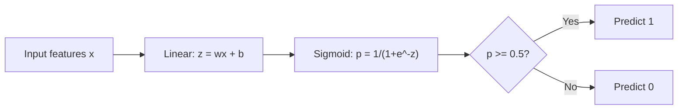
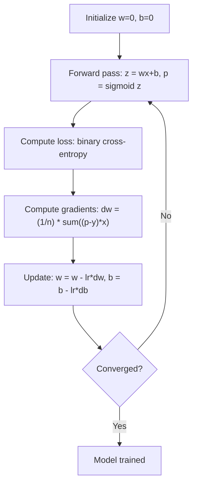

# Regresión logística

> La regresión logística dobla una línea recta en una curva S para responder preguntas de sí o no con probabilidades.

**Type:** Build
**Languages:** Python
**Prerequisites:** Phase 2 Lesson 1-2 (What Is ML, Linear Regression)
**Time:** ~90 minutes

## Objetivos de aprendizaje

- Implementar la regresión logística desde cero utilizando la función sigmoide y la pérdida binaria de entropía cruzada
- Computación e interpretación de la precisión, el recuerdo, la puntuación F1 y la matriz de confusión para la clasificación binaria
- Explicar por qué el MSE no puede clasificarse y por qué la entropía binaria cruzada produce una superficie de costes convexa
- Construir un modelo de regresión de softmax para la clasificación de múltiples clases y evaluar las compensaciones de ajuste de umbral

## El problema

Si quieres predecir si un tumor es maligno o benigno dada su tamaño, intenta una regresión lineal. Da resultados como 0.3 o 1.7 o -0.5. ¿Qué significan? ¿Es 1.7 "muy maligno"? ¿Es -0.5 "muy benigno"? La regresión lineal da resultados sin límites. La clasificación necesita probabilidades limitadas entre 0 y 1, y una decisión clara: sí o no.

La regresión logística resuelve esto. Toma la misma combinación lineal (wx + b) y la pasa a través de la función sigmoide, que aplasta cualquier número en el rango (0, 1). La salida es una probabilidad. Establece un umbral (generalmente 0,5) y toma una decisión.

Este es uno de los algoritmos más utilizados en la práctica. A pesar de su nombre, la regresión logística es un algoritmo de clasificación, no un algoritmo de regresión. El nombre proviene de la función logística (sigmoide) que utiliza.

## El concepto

### Por qué la regresión lineal no puede clasificarse

Imagina predecir el paso/fallo (1/0) basado en las horas de estudio.

```
hours:  1   2   3   4   5   6   7   8   9   10
actual: 0   0   0   0   1   1   1   1   1   1
```

Un ajuste lineal podría producir predicciones como -0,2 a la hora 1 y 1.3 a la hora 10. Estos valores no son probabilidades. Van por debajo de 0 y por encima de 1.

La clasificación necesita una función que:
- Valores de salida entre 0 y 1 (probabilidades)
- Crea una transición aguda (un límite de decisión)
- No se distorsiona por los valores extremos lejos del límite

### La función sigmóide

La función sigmoide hace exactamente esto:

```
sigmoid(z) = 1 / (1 + e^(-z))
```

Propiedades:
- Cuando z es grande y positivo, sigmoid(z) se acerca a 1
- Cuando z es grande y negativo, sigmoid(z) se acerca a 0
- Cuando z = 0, sigmoid(z) = 0,5
- La salida siempre está entre 0 y 1
- La función es suave y diferenciable en todas partes

La derivada tiene una forma conveniente: sigmoid'(z) = sigmoid(z) * (1 - sigmoid(z)). Esto hace que el cálculo de gradientes sea eficiente.

### Regresión logística = Modelo lineal + sigmoide

El modelo calcula z = wx + b (el mismo que la regresión lineal), luego aplica sigmoide:



La salida p se interpreta como P ((y=1\x), la probabilidad de que la entrada pertenece a la clase 1. El límite de decisión es donde wx + b = 0, lo que hace que la salida sigmoide sea exactamente 0.5.

### Perdida de entropía cruzada binaria

No se puede utilizar MSE para la regresión logística. MSE con sigmoide crea una superficie de costos no convexa con muchos mínimos locales.

```
Loss = -(1/n) * sum(y * log(p) + (1-y) * log(1-p))
```

Por qué funciona esto:
- Cuando y=1 y p es cerca de 1: log(1) = 0, por lo que la pérdida es cerca de 0 (correcto, bajo costo)
- Cuando y=1 y p está cerca de 0: log(0) se acerca al infinito negativo, por lo que la pérdida es enorme (erróneo, alto costo)
- Cuando y=0 y p está cerca de 0: log(1) = 0, por lo que la pérdida está cerca de 0 (correcto, bajo costo)
- Cuando y=0 y p está cerca de 1: log(0) se acerca al infinito negativo, por lo que la pérdida es enorme (erróneo, alto costo)

Esta función de pérdida es convexa para la regresión logística, garantizando un mínimo global único.

### Descenso gradual de la regresión logística

Los gradientes para la entropía binaria cruzada con sigmoides tienen una forma limpia:

```
dL/dw = (1/n) * sum((p - y) * x)
dL/db = (1/n) * sum(p - y)
```

Estos se ven idénticos a los gradientes de regresión lineal. La diferencia es que p = sigmoid(wx + b) en lugar de p = wx + b. El sigmoid introduce la no linealidad, pero la regla de actualización de gradientes permanece la misma.



### El límite de la decisión

Para una entrada 2D (dos características), el límite de decisión es la línea donde:

```
w1*x1 + w2*x2 + b = 0
```

Los puntos de un lado se clasifican como 1, los puntos del otro lado como 0. La regresión logística siempre produce un límite de decisión lineal. Si necesitas un límite curvo, añades características polinómicas o utilizas un modelo no lineal.

### Clasificación de clases múltiples con Softmax

La regresión logística binaria maneja dos clases. Para las clases k, utilice la función softmax:

```
softmax(z_i) = e^(z_i) / sum(e^(z_j) for all j)
```

Cada clase tiene su propio vector de peso. El modelo calcula una puntuación z_i para cada clase, luego softmax convierte las puntuaciones en probabilidades que suman a 1.

La función de pérdida se convierte en entropía cruzada categórica:

```
Loss = -(1/n) * sum(sum(y_k * log(p_k)))
```

donde y_k es 1 para la clase verdadera y 0 para todas las demás (codrando de una sola calidez).

### Metricas de evaluación

Para un conjunto de datos con 95% negativo y 5% positivo, un modelo que siempre predice negativo obtiene una precisión del 95% pero es inútil.

**Confusion Matrix**¿Qué es esto ?

| | Predicted Positive | Predicted Negative |
|---|---|---|
| Actually Positive | True Positive (TP) | False Negative (FN) |
| Actually Negative | False Positive (FP) | True Negative (TN) |

**Precision**De todos los positivos previstos, ¿cuántos son realmente positivos?
```
Precision = TP / (TP + FP)
```

**Recall**(Sensibilidad): De todos los positivos reales, ¿cuántos hemos capturado?
```
Recall = TP / (TP + FN)
```

**F1 Score**: Medios armónicos de precisión y recuerdo.
```
F1 = 2 * (Precision * Recall) / (Precision + Recall)
```

Cuándo priorizar:
- **Precision**: cuando los falsos positivos son costosos (filtro de spam, no quieres bloquear el correo electrónico legítimo)
- **Recall**: cuando los falsos negativos son costosos (señalización del cáncer, no se quiere perder un tumor)
- **F1**: cuando se necesita una única métrica equilibrada

```figure
logistic-sigmoid
```

## Construye el mismo

### Paso 1: Función Sigmoid y generación de datos

```python
import random
import math

def sigmoid(z):
    z = max(-500, min(500, z))
    return 1.0 / (1.0 + math.exp(-z))


random.seed(42)
N = 200
X = []
y = []

for _ in range(N // 2):
    X.append([random.gauss(2, 1), random.gauss(2, 1)])
    y.append(0)

for _ in range(N // 2):
    X.append([random.gauss(5, 1), random.gauss(5, 1)])
    y.append(1)

combined = list(zip(X, y))
random.shuffle(combined)
X, y = zip(*combined)
X = list(X)
y = list(y)

print(f"Generated {N} samples (2 classes, 2 features)")
print(f"Class 0 center: (2, 2), Class 1 center: (5, 5)")
print(f"First 5 samples:")
for i in range(5):
    print(f"  Features: [{X[i][0]:.2f}, {X[i][1]:.2f}], Label: {y[i]}")
```

### Paso 2: Regresión logística desde cero

```python
class LogisticRegression:
    def __init__(self, n_features, learning_rate=0.01):
        self.weights = [0.0] * n_features
        self.bias = 0.0
        self.lr = learning_rate
        self.loss_history = []

    def predict_proba(self, x):
        z = sum(w * xi for w, xi in zip(self.weights, x)) + self.bias
        return sigmoid(z)

    def predict(self, x, threshold=0.5):
        return 1 if self.predict_proba(x) >= threshold else 0

    def compute_loss(self, X, y):
        n = len(y)
        total = 0.0
        for i in range(n):
            p = self.predict_proba(X[i])
            p = max(1e-15, min(1 - 1e-15, p))
            total += y[i] * math.log(p) + (1 - y[i]) * math.log(1 - p)
        return -total / n

    def fit(self, X, y, epochs=1000, print_every=200):
        n = len(y)
        n_features = len(X[0])
        for epoch in range(epochs):
            dw = [0.0] * n_features
            db = 0.0
            for i in range(n):
                p = self.predict_proba(X[i])
                error = p - y[i]
                for j in range(n_features):
                    dw[j] += error * X[i][j]
                db += error
            for j in range(n_features):
                self.weights[j] -= self.lr * (dw[j] / n)
            self.bias -= self.lr * (db / n)
            loss = self.compute_loss(X, y)
            self.loss_history.append(loss)
            if epoch % print_every == 0:
                print(f"  Epoch {epoch:4d} | Loss: {loss:.4f} | w: [{self.weights[0]:.3f}, {self.weights[1]:.3f}] | b: {self.bias:.3f}")
        return self

    def accuracy(self, X, y):
        correct = sum(1 for i in range(len(y)) if self.predict(X[i]) == y[i])
        return correct / len(y)


split = int(0.8 * N)
X_train, X_test = X[:split], X[split:]
y_train, y_test = y[:split], y[split:]

print("\n=== Training Logistic Regression ===")
model = LogisticRegression(n_features=2, learning_rate=0.1)
model.fit(X_train, y_train, epochs=1000, print_every=200)

print(f"\nTrain accuracy: {model.accuracy(X_train, y_train):.4f}")
print(f"Test accuracy:  {model.accuracy(X_test, y_test):.4f}")
print(f"Weights: [{model.weights[0]:.4f}, {model.weights[1]:.4f}]")
print(f"Bias: {model.bias:.4f}")
```

### Paso 3: Matriz de confusión y métricas desde cero

```python
class ClassificationMetrics:
    def __init__(self, y_true, y_pred):
        self.tp = sum(1 for t, p in zip(y_true, y_pred) if t == 1 and p == 1)
        self.tn = sum(1 for t, p in zip(y_true, y_pred) if t == 0 and p == 0)
        self.fp = sum(1 for t, p in zip(y_true, y_pred) if t == 0 and p == 1)
        self.fn = sum(1 for t, p in zip(y_true, y_pred) if t == 1 and p == 0)

    def accuracy(self):
        total = self.tp + self.tn + self.fp + self.fn
        return (self.tp + self.tn) / total if total > 0 else 0

    def precision(self):
        denom = self.tp + self.fp
        return self.tp / denom if denom > 0 else 0

    def recall(self):
        denom = self.tp + self.fn
        return self.tp / denom if denom > 0 else 0

    def f1(self):
        p = self.precision()
        r = self.recall()
        return 2 * p * r / (p + r) if (p + r) > 0 else 0

    def print_confusion_matrix(self):
        print(f"\n  Confusion Matrix:")
        print(f"                  Predicted")
        print(f"                  Pos   Neg")
        print(f"  Actual Pos     {self.tp:4d}  {self.fn:4d}")
        print(f"  Actual Neg     {self.fp:4d}  {self.tn:4d}")

    def print_report(self):
        self.print_confusion_matrix()
        print(f"\n  Accuracy:  {self.accuracy():.4f}")
        print(f"  Precision: {self.precision():.4f}")
        print(f"  Recall:    {self.recall():.4f}")
        print(f"  F1 Score:  {self.f1():.4f}")


y_pred_test = [model.predict(x) for x in X_test]
print("\n=== Classification Report (Test Set) ===")
metrics = ClassificationMetrics(y_test, y_pred_test)
metrics.print_report()
```

### Paso 4: Análisis de los límites de la decisión

```python
print("\n=== Decision Boundary ===")
w1, w2 = model.weights
b = model.bias
print(f"Decision boundary: {w1:.4f}*x1 + {w2:.4f}*x2 + {b:.4f} = 0")
if abs(w2) > 1e-10:
    print(f"Solved for x2:     x2 = {-w1/w2:.4f}*x1 + {-b/w2:.4f}")

print("\nSample predictions near the boundary:")
test_points = [
    [3.0, 3.0],
    [3.5, 3.5],
    [4.0, 4.0],
    [2.5, 2.5],
    [5.0, 5.0],
]
for point in test_points:
    prob = model.predict_proba(point)
    pred = model.predict(point)
    print(f"  [{point[0]}, {point[1]}] -> prob={prob:.4f}, class={pred}")
```

### Paso 5: Multi-clase con softmax

```python
class SoftmaxRegression:
    def __init__(self, n_features, n_classes, learning_rate=0.01):
        self.n_features = n_features
        self.n_classes = n_classes
        self.lr = learning_rate
        self.weights = [[0.0] * n_features for _ in range(n_classes)]
        self.biases = [0.0] * n_classes

    def softmax(self, scores):
        max_score = max(scores)
        exp_scores = [math.exp(s - max_score) for s in scores]
        total = sum(exp_scores)
        return [e / total for e in exp_scores]

    def predict_proba(self, x):
        scores = [
            sum(self.weights[k][j] * x[j] for j in range(self.n_features)) + self.biases[k]
            for k in range(self.n_classes)
        ]
        return self.softmax(scores)

    def predict(self, x):
        probs = self.predict_proba(x)
        return probs.index(max(probs))

    def fit(self, X, y, epochs=1000, print_every=200):
        n = len(y)
        for epoch in range(epochs):
            grad_w = [[0.0] * self.n_features for _ in range(self.n_classes)]
            grad_b = [0.0] * self.n_classes
            total_loss = 0.0
            for i in range(n):
                probs = self.predict_proba(X[i])
                for k in range(self.n_classes):
                    target = 1.0 if y[i] == k else 0.0
                    error = probs[k] - target
                    for j in range(self.n_features):
                        grad_w[k][j] += error * X[i][j]
                    grad_b[k] += error
                true_prob = max(probs[y[i]], 1e-15)
                total_loss -= math.log(true_prob)
            for k in range(self.n_classes):
                for j in range(self.n_features):
                    self.weights[k][j] -= self.lr * (grad_w[k][j] / n)
                self.biases[k] -= self.lr * (grad_b[k] / n)
            if epoch % print_every == 0:
                print(f"  Epoch {epoch:4d} | Loss: {total_loss / n:.4f}")
        return self

    def accuracy(self, X, y):
        correct = sum(1 for i in range(len(y)) if self.predict(X[i]) == y[i])
        return correct / len(y)


random.seed(42)
X_3class = []
y_3class = []

centers = [(1, 1), (5, 1), (3, 5)]
for label, (cx, cy) in enumerate(centers):
    for _ in range(50):
        X_3class.append([random.gauss(cx, 0.8), random.gauss(cy, 0.8)])
        y_3class.append(label)

combined = list(zip(X_3class, y_3class))
random.shuffle(combined)
X_3class, y_3class = zip(*combined)
X_3class = list(X_3class)
y_3class = list(y_3class)

split_3 = int(0.8 * len(X_3class))
X_train_3 = X_3class[:split_3]
y_train_3 = y_3class[:split_3]
X_test_3 = X_3class[split_3:]
y_test_3 = y_3class[split_3:]

print("\n=== Multi-class Softmax Regression (3 classes) ===")
softmax_model = SoftmaxRegression(n_features=2, n_classes=3, learning_rate=0.1)
softmax_model.fit(X_train_3, y_train_3, epochs=1000, print_every=200)
print(f"\nTrain accuracy: {softmax_model.accuracy(X_train_3, y_train_3):.4f}")
print(f"Test accuracy:  {softmax_model.accuracy(X_test_3, y_test_3):.4f}")

print("\nSample predictions:")
for i in range(5):
    probs = softmax_model.predict_proba(X_test_3[i])
    pred = softmax_model.predict(X_test_3[i])
    print(f"  True: {y_test_3[i]}, Predicted: {pred}, Probs: [{', '.join(f'{p:.3f}' for p in probs)}]")
```

### Paso 6: Ajuste de umbral

```python
print("\n=== Threshold Tuning ===")
print("Default threshold: 0.5. Adjusting the threshold trades precision for recall.\n")

thresholds = [0.3, 0.4, 0.5, 0.6, 0.7]
print(f"{'Threshold':>10} {'Accuracy':>10} {'Precision':>10} {'Recall':>10} {'F1':>10}")
print("-" * 52)

for t in thresholds:
    y_pred_t = [1 if model.predict_proba(x) >= t else 0 for x in X_test]
    m = ClassificationMetrics(y_test, y_pred_t)
    print(f"{t:>10.1f} {m.accuracy():>10.4f} {m.precision():>10.4f} {m.recall():>10.4f} {m.f1():>10.4f}")
```

## Usalo

Ahora lo mismo con el aprendizaje de la escobilera.

```python
from sklearn.linear_model import LogisticRegression as SklearnLR
from sklearn.metrics import accuracy_score, precision_score, recall_score, f1_score
from sklearn.metrics import confusion_matrix, classification_report
from sklearn.model_selection import train_test_split
from sklearn.preprocessing import StandardScaler
import numpy as np

np.random.seed(42)
X_0 = np.random.randn(100, 2) + [2, 2]
X_1 = np.random.randn(100, 2) + [5, 5]
X_sk = np.vstack([X_0, X_1])
y_sk = np.array([0] * 100 + [1] * 100)

X_tr, X_te, y_tr, y_te = train_test_split(X_sk, y_sk, test_size=0.2, random_state=42)

scaler = StandardScaler()
X_tr_sc = scaler.fit_transform(X_tr)
X_te_sc = scaler.transform(X_te)

lr = SklearnLR()
lr.fit(X_tr_sc, y_tr)
y_pred = lr.predict(X_te_sc)

print("=== Scikit-learn Logistic Regression ===")
print(f"Accuracy:  {accuracy_score(y_te, y_pred):.4f}")
print(f"Precision: {precision_score(y_te, y_pred):.4f}")
print(f"Recall:    {recall_score(y_te, y_pred):.4f}")
print(f"F1:        {f1_score(y_te, y_pred):.4f}")
print(f"\nConfusion Matrix:\n{confusion_matrix(y_te, y_pred)}")
print(f"\nClassification Report:\n{classification_report(y_te, y_pred)}")
```

Su implementación desde cero produce el mismo límite de decisión y métricas. Scikit-learn agrega opciones de solver (liblinear, lbfgs, saga), regularización automática, estrategias de múltiples clases (uno contra otro, multinomía) y optimizaciones de estabilidad numérica.

## Envío

Esta lección produce:
- `code/logistic_regression.py`- Regresión logística desde cero con métricas

## Los ejercicios

1. Generar un conjunto de datos que no sea linealmente separable (por ejemplo, dos círculos concéntricos). Entrenar la regresión logística y observar su falla. Luego añadir características polinómicas (x1^2, x2^2, x1*x2) y entrenar de nuevo. Muestre que la precisión mejora.
2. Implemente una matriz de confusión de varias clases para el modelo softmax de 3 clases. Computa precisión por clase y recuerda. ¿Cuál clase es más difícil de clasificar?
3. Construir una curva ROC desde cero. Para 100 valores de umbral de 0 a 1, calcular la tasa positiva verdadera y la tasa positiva falsa. Calcular la AUC (zona debajo de la curva) utilizando la regla trapezoidal.

## Términos clave

| Term | What people say | What it actually means |
|------|----------------|----------------------|
| Logistic regression | "Regression for classification" | A linear model followed by a sigmoid function that outputs class probabilities |
| Sigmoid function | "The S-curve" | The function 1/(1+e^(-z)) that maps any real number to the range (0, 1) |
| Binary cross-entropy | "Log loss" | The loss function -[y*log(p) + (1-y)*log(1-p)] that penalizes confident wrong predictions severely |
| Decision boundary | "The dividing line" | The surface where the model's output probability equals 0.5, separating predicted classes |
| Softmax | "Multi-class sigmoid" | A function that converts a vector of scores into probabilities that sum to 1 |
| Precision | "How many selected are relevant" | TP / (TP + FP), the fraction of positive predictions that are actually positive |
| Recall | "How many relevant are selected" | TP / (TP + FN), the fraction of actual positives that the model correctly identifies |
| F1 score | "Balanced accuracy" | The harmonic mean of precision and recall: 2*P*R / (P+R) |
| Confusion matrix | "The error breakdown" | A table showing TP, TN, FP, FN counts for each class pair |
| Threshold | "The cutoff" | The probability value above which the model predicts class 1 (default 0.5, tunable) |
| One-hot encoding | "Binary columns for categories" | Representing class k as a vector of zeros with a 1 at position k |
| Categorical cross-entropy | "Multi-class log loss" | The extension of binary cross-entropy to k classes using one-hot encoded labels |
