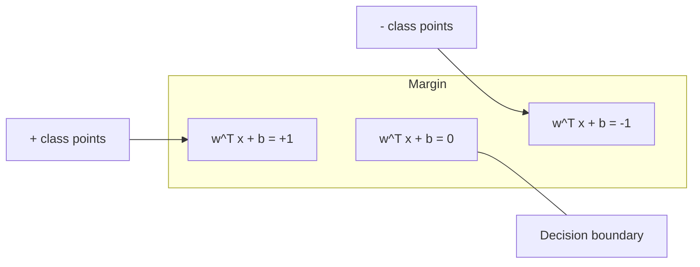
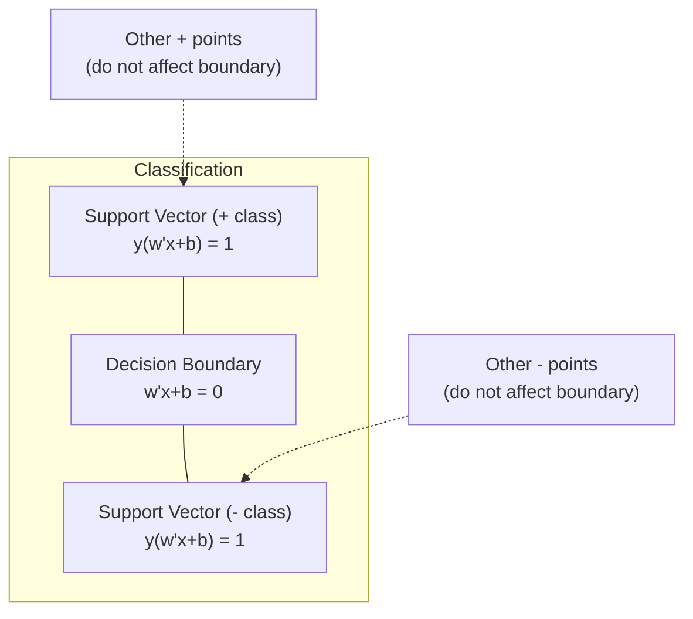
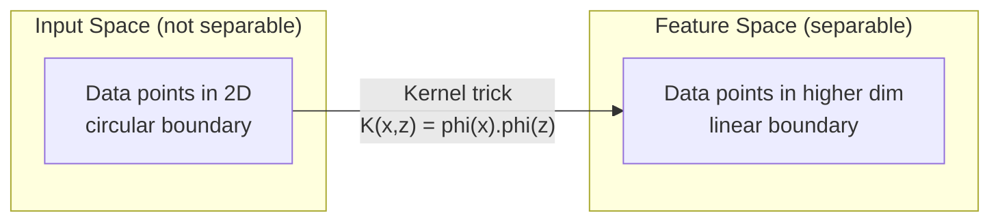

# Máquinas de apoyo de vectores

> Encuentra la calle más ancha entre dos clases.

**Type:** Build
**Language:**Python
**Prerequisites:** Phase 1 (Lessons 08 Optimization, 14 Norms and Distances, 18 Convex Optimization)
**Time:** ~90 minutes

## Objetivos de aprendizaje

- Implementar un SVM lineal desde cero utilizando pérdida de bisagra y descenso de gradiente en la formulación primaria
- Explicar el principio de margen máximo e identificar vectores de apoyo de un modelo entrenado
- Comparar los núcleos lineal, polinómico y RBF y explicar cómo el truco del núcleo evita el mapeo explícito de alta dimensión
- Evaluar la compensación controlada por el parámetro C entre el ancho del margen y los errores de clasificación

## El problema

Hay dos clases de puntos de datos y hay que dibujar una línea (o hiperplano) que los separe.

El margen es la distancia entre el límite de decisión y los puntos de datos más cercanos en cada lado.

Esta intuición conduce a las Máquinas de Vector de Apoyo, uno de los algoritmos matemáticamente más elegantes en ML. Los SVM fueron el método de clasificación dominante antes del aprendizaje profundo y siguen siendo la mejor opción para pequeños conjuntos de datos, datos de alta dimensión y problemas donde se necesita un modelo de principios, bien entendido con garantías teóricas.

Los SVM se conectan directamente a la Fase 1: la optimización es convexa (lección 18), el margen se mide con normas (lección 14), y el truco del núcleo explota productos de puntos para manejar límites no lineales sin tener que computación en el espacio de alta dimensión.

## El concepto

### El clasificador de margen máximo

Dados datos linealmente separables con etiquetas y_i en {-1, +1} y vectores de características x_i, queremos un hiperplano w^T x + b = 0 que separe las clases.

La distancia de un punto x_i al hiperplano es:

```
distance = |w^T x_i + b| / ||w||
```

Para un punto correctamente clasificado: y_i * (w^T x_i + b) > 0. El margen es el doble de la distancia del hiperplano al punto más cercano en ambos lados.



El problema de optimización:

```
maximize    2 / ||w||     (the margin width)
subject to  y_i * (w^T x_i + b) >= 1  for all i
```

Igualmente (minimizar las condiciones de la producción es más fácil de optimizar):

```
minimize    (1/2) ||w||^2
subject to  y_i * (w^T x_i + b) >= 1  for all i
```

Este es un programa cuadrático convexo. Tiene una solución global única. Los puntos de datos que se encuentran exactamente en los límites del margen (donde y_i * (w^T x_i + b) = 1) son los vectores de soporte. Son los únicos puntos que determinan el límite de decisión. Mueve o elimine cualquier punto de vector no de soporte, y el límite no cambia.

### Vectores de apoyo: los pocos críticos



La mayoría de los puntos de entrenamiento son irrelevantes. Sólo importan los vectores de apoyo. Es por eso que los SVM son eficientes en la memoria en el tiempo de predicción: solo se necesitan almacenar los vectores de apoyo, no todo el conjunto de entrenamiento.

El número de vectores de soporte también da un límite en el error de generalización.

### Margen suave: ruido de manejo con el parámetro C

Los datos reales rara vez son perfectamente separables. Algunos puntos pueden estar en el lado equivocado del límite, o dentro del margen.

```
minimize    (1/2) ||w||^2 + C * sum(xi_i)
subject to  y_i * (w^T x_i + b) >= 1 - xi_i
            xi_i >= 0  for all i
```

La variable de flexibilidad xi_i mide la cantidad de puntos i que violan el margen.

| C value | Behavior |
|---------|----------|
| Large C | Penalizes violations heavily. Narrow margin, fewer misclassifications. Overfits |
| Small C | Allows more violations. Wide margin, more misclassifications. Underfits |

C es la fuerza de regularización, invertida. C mayor = menos regularización. C menor = más regularización.

### Perdida de colmillos: función de pérdida de SVM

El SVM de margen blando se puede reescribir como una optimización sin restricciones:

```
minimize    (1/2) ||w||^2 + C * sum(max(0, 1 - y_i * (w^T x_i + b)))
```

El término max(0, 1 - y_i * f(x_i)) es la pérdida de bisagra. Es cero cuando el punto está clasificado correctamente y más allá del margen. Es lineal cuando el punto está dentro del margen o está mal clasificado.

```
Hinge loss for a single point:

loss
  |
  | \
  |  \
  |   \
  |    \
  |     \_______________
  |
  +-----|-----|-------->  y * f(x)
       0     1

Zero loss when y*f(x) >= 1 (correctly classified, outside margin).
Linear penalty when y*f(x) < 1.
```

Comparar con pérdida logística (regresón logística):

```
Hinge:     max(0, 1 - y*f(x))          Hard cutoff at margin
Logistic:  log(1 + exp(-y*f(x)))        Smooth, never exactly zero
```

La pérdida de colchones produce soluciones escasas (solo los vectores de soporte tienen una contribución no cero). La pérdida logística utiliza todos los puntos de datos. Esto hace que los SVM sean más eficientes en la memoria en el tiempo de predicción.

### Entrenamiento de un SVM lineal con descenso de gradiente

Puede entrenar un SVM lineal utilizando la descenda de gradiente en la pérdida de bisagra más la regularización L2, sin resolver el QP restringido:

```
L(w, b) = (lambda/2) * ||w||^2 + (1/n) * sum(max(0, 1 - y_i * (w^T x_i + b)))

Gradient with respect to w:
  If y_i * (w^T x_i + b) >= 1:  dL/dw = lambda * w
  If y_i * (w^T x_i + b) < 1:   dL/dw = lambda * w - y_i * x_i

Gradient with respect to b:
  If y_i * (w^T x_i + b) >= 1:  dL/db = 0
  If y_i * (w^T x_i + b) < 1:   dL/db = -y_i
```

Esto se llama la formulación primaria. Se ejecuta en O(n * d) por época, donde n es el número de muestras y d es el número de características. Para datos grandes, escasos y de alta dimensión (clasificación de texto), esto es rápido.

### La doble formulación y el truco del núcleo

El dual Lagrangiano del problema de SVM (de la lección de la fase 1, condiciones de KKT) es:

```
maximize    sum(alpha_i) - (1/2) * sum_ij(alpha_i * alpha_j * y_i * y_j * (x_i . x_j))
subject to  0 <= alpha_i <= C
            sum(alpha_i * y_i) = 0
```

El dual solo implica productos de puntos x_i. x_j entre los puntos de datos. Esta es la clave. reemplaza cada producto de puntos con una función del núcleo K(x_i, x_j) y el SVM puede aprender límites no lineales sin calcular nunca la transformación explícitamente.

```
Linear kernel:      K(x, z) = x . z
Polynomial kernel:  K(x, z) = (x . z + c)^d
RBF (Gaussian):     K(x, z) = exp(-gamma * ||x - z||^2)
```

El núcleo RBF mapea los datos en un espacio de dimensiones infinitas. Los puntos que están cerca en el espacio de entrada tienen un valor del núcleo cerca de 1.



El truco del núcleo calcula el producto de puntos en el espacio de alta dimensión sin llegar allí. Para el núcleo polinómico de grado d en dimensiones D, el espacio de características explícito tiene dimensiones O(D^d). Pero K(x, z) se calcula en tiempo O(D).

### MPS para regresión (MPS)

El vector de apoyo regresión se ajusta a un tubo de ancho epsilon alrededor de los datos. los puntos dentro del tubo tienen pérdida cero. los puntos fuera del tubo se penalizan linealmente.

```
minimize    (1/2) ||w||^2 + C * sum(xi_i + xi_i*)
subject to  y_i - (w^T x_i + b) <= epsilon + xi_i
            (w^T x_i + b) - y_i <= epsilon + xi_i*
            xi_i, xi_i* >= 0
```

El parámetro epsilon controla el ancho del tubo. tubo más ancho = menos vectores de soporte = ajuste más suave. tubo más estrecho = más vectores de soporte = ajuste más estrecho.

### Por qué los SVM perdieron al aprendizaje profundo (y cuando todavía ganan)

Los SVM dominaron el aprendizaje de aprendizaje desde finales de la década de 1990 hasta principios de la década de 2010.

| Factor | SVMs | Deep learning |
|--------|------|---------------|
| Feature engineering | Requires it | Learns features |
| Scalability | O(n^2) to O(n^3) for kernel | O(n) per epoch with SGD |
| Image/text/audio | Needs handcrafted features | Learns from raw data |
| Large datasets (>100k) | Slow | Scales well |
| GPU acceleration | Limited benefit | Massive speedup |

Los SVM siguen ganando en estas situaciones:
- Los conjuntos de datos pequeños (de cientos a miles de muestras)
- Datos escasos de alta dimensión (texto con características TF-IDF)
- Cuando se necesiten garantías matemáticas (límites de margen)
- Cuando el tiempo de entrenamiento debe ser mínimo (la SVM lineal es muy rápida)
- Clasificación binaria con estructura de margen clara
- Detección de anomalías (MV de una clase)

```figure
svm-margin
```

## Construye el mismo

### Paso 1: pérdida de la barandilla y la gradiente

Calcula la pérdida de bisagra de un lote y su gradiente.

```python
def hinge_loss(X, y, w, b):
    n = len(X)
    total_loss = 0.0
    for i in range(n):
        margin = y[i] * (dot(w, X[i]) + b)
        total_loss += max(0.0, 1.0 - margin)
    return total_loss / n
```

### Paso 2: SVM lineal a través de la descenso de gradiente

Entrenamiento minimizando la pérdida de bisagra regularizada.

```python
class LinearSVM:
    def __init__(self, lr=0.001, lambda_param=0.01, n_epochs=1000):
        self.lr = lr
        self.lambda_param = lambda_param
        self.n_epochs = n_epochs
        self.w = None
        self.b = 0.0

    def fit(self, X, y):
        n_features = len(X[0])
        self.w = [0.0] * n_features
        self.b = 0.0

        for epoch in range(self.n_epochs):
            for i in range(len(X)):
                margin = y[i] * (dot(self.w, X[i]) + self.b)
                if margin >= 1:
                    self.w = [wj - self.lr * self.lambda_param * wj
                              for wj in self.w]
                else:
                    self.w = [wj - self.lr * (self.lambda_param * wj - y[i] * X[i][j])
                              for j, wj in enumerate(self.w)]
                    self.b -= self.lr * (-y[i])

    def predict(self, X):
        return [1 if dot(self.w, x) + self.b >= 0 else -1 for x in X]
```

### Paso 3: Funciones del núcleo

Implemente núcleos lineales, polinómicos y RBF.

```python
def linear_kernel(x, z):
    return dot(x, z)

def polynomial_kernel(x, z, degree=3, c=1.0):
    return (dot(x, z) + c) ** degree

def rbf_kernel(x, z, gamma=0.5):
    diff = [xi - zi for xi, zi in zip(x, z)]
    return math.exp(-gamma * dot(diff, diff))
```

### Paso 4: Identificación de márgenes y vectores de soporte

Después del entrenamiento, identifique qué puntos son vectores de apoyo y compute el ancho del margen.

```python
def find_support_vectors(X, y, w, b, tol=1e-3):
    support_vectors = []
    for i in range(len(X)):
        margin = y[i] * (dot(w, X[i]) + b)
        if abs(margin - 1.0) < tol:
            support_vectors.append(i)
    return support_vectors
```

¿ Qué ?`code/svm.py`para la implementación completa con todas las demostraciones.

## Usalo

Con el aprendizaje de la escikit:

```python
from sklearn.svm import SVC, LinearSVC, SVR
from sklearn.preprocessing import StandardScaler
from sklearn.pipeline import Pipeline

clf = Pipeline([
    ("scaler", StandardScaler()),
    ("svm", SVC(kernel="rbf", C=1.0, gamma="scale")),
])
clf.fit(X_train, y_train)
print(f"Accuracy: {clf.score(X_test, y_test):.4f}")
print(f"Support vectors: {clf['svm'].n_support_}")
```

Importante: siempre escalar sus características antes de entrenar a un SVM. Los SVM son sensibles a las magnitudes de las características porque el margen depende de las características no escaladas, y distorsionan la geometría.

Para conjuntos de datos grandes, utilice `LinearSVC`(formulación primaria, O(n) por época) en lugar de `SVC`(formación doble, O(n^2) a O ((n^3)):

```python
from sklearn.svm import LinearSVC

clf = Pipeline([
    ("scaler", StandardScaler()),
    ("svm", LinearSVC(C=1.0, max_iter=10000)),
])
```

## Los ejercicios

1. Generar un conjunto de datos linealmente separable en 2D. Entrenar su LinearSVM e identificar los vectores de soporte. Verificar que los vectores de soporte son los puntos más cercanos al límite de decisión.

2. Varia C de 0,001 a 1000 en un conjunto de datos ruidosos. Trazar el límite de decisión para cada valor C. Observe la transición de margen amplio (incorrección) a margen estrecho (overfitting).

3. Crear un conjunto de datos donde los límites de las clases son circulares (no lineales). Mostrar que un SVM lineal falla. Compute la matriz del núcleo RBF y mostrar que las clases se vuelven separables en el espacio de características inducido por el núcleo.

4. Compare pérdida de bisagra con pérdida logística en el mismo conjunto de datos. Entrenar un SVM lineal y regresión logística. Cuente cuántos puntos de entrenamiento contribuyen al límite de decisión de cada modelo (vectores de apoyo con todos los puntos).

5. Implemente SVR (pérdida insensitiva a la epsilon). Ajuste a y = sin(x) + ruido. Traza el tubo de epsilon alrededor de las predicciones y resalte los vectores de soporte (puntos fuera del tubo).

## Términos clave

| Term | What it actually means |
|------|----------------------|
| Support vectors | The training points closest to the decision boundary. The only points that determine the hyperplane |
| Margin | The distance between the decision boundary and the nearest support vectors. SVMs maximize this |
| Hinge loss | max(0, 1 - y*f(x)). Zero when correctly classified and outside the margin. Linear penalty otherwise |
| C parameter | Trade-off between margin width and classification errors. Large C = narrow margin, small C = wide margin |
| Soft margin | SVM formulation that allows margin violations via slack variables. Handles non-separable data |
| Kernel trick | Computing dot products in a high-dimensional feature space without explicitly mapping to that space |
| Linear kernel | K(x, z) = x . z. Equivalent to standard dot product. For linearly separable data |
| RBF kernel | K(x, z) = exp(-gamma * \|\|x-z\|\|^2). Maps to infinite dimensions. Learns any smooth boundary |
| Polynomial kernel | K(x, z) = (x . z + c)^d. Maps to a feature space of polynomial combinations |
| Dual formulation | Reformulation of the SVM problem that depends only on dot products between data points. Enables kernels |
| SVR | Support Vector Regression. Fits an epsilon-tube around the data. Points inside the tube have zero loss |
| Slack variables | xi_i: measures how much a point violates the margin. Zero for correctly classified points outside margin |
| Maximum margin | The principle of choosing the hyperplane that maximizes the distance to the nearest points of each class |

## Leer más

- [Vapnik: The Nature of Statistical Learning Theory (1995)](https://link.springer.com/book/10.1007/978-1-4757-3264-1)- el texto fundamental sobre los MSS y el aprendizaje estadístico
- [Cortes & Vapnik: Support-vector networks (1995)](https://link.springer.com/article/10.1007/BF00994018)- el papel original de SVM
- [Platt: Sequential Minimal Optimization (1998)](https://www.microsoft.com/en-us/research/publication/sequential-minimal-optimization-a-fast-algorithm-for-training-support-vector-machines/)- el algoritmo de gestión de la gestión de la actividad que hizo práctica la formación de la gestión de la actividad de la empresa
- [scikit-learn SVM documentation](https://scikit-learn.org/stable/modules/svm.html)- Guía práctica con detalles de aplicación
- [LIBSVM: A Library for Support Vector Machines](https://www.csie.ntu.edu.tw/~cjlin/libsvm/)- la biblioteca C++ detrás de la mayoría de las implementaciones de SVM
