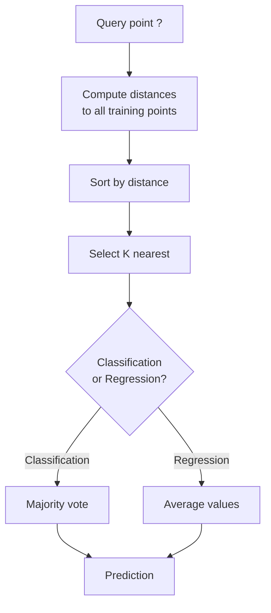
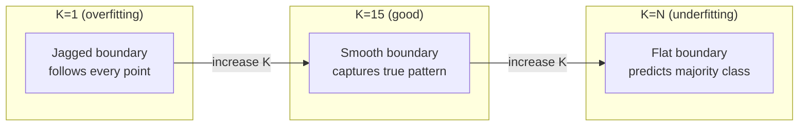
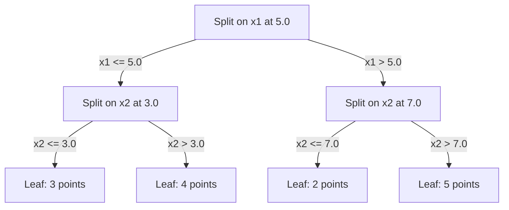

# K- Vecinos y distancias más cercanos

> Almacenar todo, predecir mirando a sus vecinos, el algoritmo más simple que realmente funciona.

**Type:** Build
**Language:**Python
**Prerequisites:** Phase 1 (Lesson 14 Norms and Distances)
**Time:** ~90 minutes

## Objetivos de aprendizaje

- Implementar la clasificación KNN y la regresión desde cero con K configurable y votación ponderada por distancia
- Comparar las métricas de distancia L1, L2, cosino y Minkowski y seleccionar la adecuada para un tipo de datos dado
- Explicar la maldición de la dimensionalidad y demostrar por qué KNN se degrada en espacios de alta dimensión
- Construir un árbol KD para buscar eficiente vecino más cercano y analizar cuando superen la fuerza bruta

## El problema

Hay un conjunto de datos. Un nuevo punto de datos llega. Necesitas clasificarlo o predecir su valor. En lugar de aprender parámetros de los datos (como regresión lineal o SVM), simplemente encuentra los puntos de entrenamiento K más cercanos al nuevo punto y deja que voten.

Esto es K-vicinos más cercanos. No hay fase de entrenamiento. No hay parámetros para aprender. No hay función de pérdida para minimizar. Almacenas todo el conjunto de entrenamiento y calcular distancias en el tiempo de predicción.

Parece demasiado simple para trabajar. Pero KNN es sorprendentemente competitivo para muchos problemas, especialmente con conjuntos de datos pequeños y medianos, y comprenderlo revela profundamente conceptos fundamentales: la elección de la métrica de distancia (conectándose a la lección 14 de la fase 1), la maldición de la dimensionalidad y la diferencia entre el aprendizaje perezoso y ansioso.

KNN también aparece en todas partes en la IA moderna, bajo diferentes nombres. Las bases de datos vectoriales buscan KNN sobre los embebidos. La generación aumentada de recuperación (RAG) encuentra los trozos de documento K más cercanos. Los sistemas de recomendación encuentran usuarios o elementos similares. El algoritmo es el mismo. La escala y las estructuras de datos son diferentes.

## El concepto

### Cómo funciona KNN

Dado un conjunto de datos de puntos etiquetados y un nuevo punto de consulta:

1. Calcule la distancia de la consulta a cada punto del conjunto de datos
2. Sortado por distancia
3. Tome los puntos más cercanos a K
4. Para la clasificación: voto mayoritario entre los vecinos K
5. Para la regresión: promedio (o promedio ponderado) de los valores de los vecinos K



No hay ajuste, no hay descenso de gradiente, no hay épocas.

### Elegir K

K es el único hiperparámetro.

| K | Behavior |
|---|----------|
| K = 1 | Decision boundary follows every point. Zero training error. High variance. Overfits |
| Small K (3-5) | Sensitive to local structure. Can capture complex boundaries |
| Large K | Smoother boundaries. More robust to noise. May underfit |
| K = N | Predicts the majority class for every point. Maximum bias |

Un punto de partida común es K = sqrt(N) para un conjunto de datos de N puntos.



### Metricas de distancia

La función de distancia define lo que significa "cerca". Diferentes métricas producen vecinos diferentes, predicciones diferentes.

**L2 (Euclidean)**es el estándar.

```
d(a, b) = sqrt(sum((a_i - b_i)^2))
```

Sensitivo a la escala de características. Siempre estandarice las características antes de usar L2 con KNN.

**L1 (Manhattan)**La diferencia de la diferencia de la diferencia de la diferencia de la diferencia de la diferencia de la diferencia de la diferencia de la diferencia de la diferencia de la diferencia de la diferencia de la diferencia de la diferencia de la diferencia de la diferencia de la diferencia de la diferencia de la diferencia de la diferencia de la diferencia de la diferencia de la diferencia de la diferencia de la diferencia de la diferencia de la diferencia de la diferencia de la diferencia de la diferencia de la diferencia de la diferencia de la diferencia de la diferencia de la diferencia de la diferencia de la diferencia de la diferencia de la diferencia de la diferencia de la diferencia de la diferencia de la diferencia de la diferencia de la diferencia de la diferencia de la diferencia de la diferencia de la diferencia de la diferencia de la diferencia de la diferencia de la diferencia de la diferencia de la diferencia de la diferencia de la diferencia de la diferencia de la diferencia de la diferencia de la diferencia de la diferencia de la diferencia de la diferencia de la diferencia de la diferencia de la diferencia de la diferencia de la diferencia de la diferencia de la diferencia de la diferencia de la diferencia de la diferencia de la diferencia de la diferencia de la diferencia de la diferencia de la diferencia de la diferencia de la diferencia de la diferencia de la diferencia de la diferencia de la diferencia de la diferencia de la diferencia de la diferencia de la diferencia de la diferencia de la diferencia de la diferencia de la diferencia de la diferencia de la diferencia de la diferencia de la diferencia de la diferencia de la diferencia de la diferencia de la diferencia de la diferencia de la diferencia de la diferencia de la diferencia de la diferencia de la diferencia de la diferencia de la diferencia de la diferencia de la diferencia de la diferencia de la diferencia de la diferencia de la diferencia de la diferencia de la diferencia de la diferencia de la diferencia de la diferencia de la diferencia de la diferencia de la diferencia de la diferencia de la diferencia de la diferencia de la diferencia de la diferencia de la diferencia de la diferencia de la diferencia de la diferencia de la diferencia de la diferencia de la diferencia de la diferencia de la diferencia de la diferencia de la diferencia de la diferencia de la diferencia de la diferencia de la diferencia de la diferencia de la diferencia de la diferencia de la diferencia de la diferencia de la diferencia de la diferencia de la diferencia de la diferencia de la diferencia de la diferencia de la diferencia de la diferencia de la diferencia de la diferencia de la diferencia de la diferencia de la diferencia de la diferencia de la diferencia de la diferencia de la diferencia de la diferencia de la diferencia de la diferencia de la diferencia de la diferencia de

```
d(a, b) = sum(|a_i - b_i|)
```

**Cosine distance**El tamaño de la imagen es esencial para el texto y la incorporación de datos.

```
d(a, b) = 1 - (a . b) / (||a|| * ||b||)
```

**Minkowski**generaliza L1 y L2 con el parámetro p.

```
d(a, b) = (sum(|a_i - b_i|^p))^(1/p)

p=1: Manhattan
p=2: Euclidean
p->inf: Chebyshev (max absolute difference)
```

La métrica que se utilice depende de los datos:

| Data type | Best metric | Why |
|-----------|------------|-----|
| Numeric features, similar scale | L2 (Euclidean) | Default, works for spatial data |
| Numeric features, outliers | L1 (Manhattan) | Robust, does not amplify large differences |
| Text embeddings | Cosine | Magnitude is noise, direction is meaning |
| High-dimensional sparse | Cosine or L1 | L2 suffers from curse of dimensionality |
| Mixed types | Custom distance | Combine metrics per feature type |

### KNN ponderada

El KNN estándar da el mismo peso a todos los vecinos de K. Pero un vecino a distancia 0.1 debería importar más que uno a distancia 5.0.

**Distance-weighted KNN**Pese a cada vecino inversamente por distancia:

```
weight_i = 1 / (distance_i + epsilon)

For classification: weighted vote
For regression:     weighted average = sum(w_i * y_i) / sum(w_i)
```

El epsilon evita la división por cero cuando un punto de consulta coincide exactamente con un punto de entrenamiento.

El KNN ponderado es menos sensible a la elección de K porque los vecinos distantes contribuyen muy poco independientemente.

### La maldición de la dimensionalidad

El rendimiento del KNN se degrada en grandes dimensiones.

**Problem 1: distances converge.**A medida que aumenta la dimensionalidad, la relación entre la distancia máxima y la distancia mínima se acerca a 1. Todos los puntos se vuelven igualmente "lejos" de la consulta.

```
In d dimensions, for random uniform points:

d=2:    max_dist / min_dist = varies widely
d=100:  max_dist / min_dist ~ 1.01
d=1000: max_dist / min_dist ~ 1.001

When all distances are nearly equal, "nearest" is meaningless.
```

**Problem 2: volume explodes.**Para capturar los vecinos K dentro de una fracción fija de los datos, es necesario ampliar el radio de búsqueda para cubrir una fracción mucho mayor del espacio de características.

**Problem 3: corners dominate.**En un unidad de hipercubo en dimensiones d, la mayor parte del volumen se concentra cerca de las esquinas, no en el centro.

Consecuencia práctica: KNN funciona bien hasta unas 20 a 50 características. Más allá de eso, necesita reducción de dimensionalidad (PCA, UMAP, t-SNE) antes de aplicar KNN, o necesita utilizar estructuras de búsqueda basadas en árboles que exploten la dimensionalidad inferior intrínseca de los datos.

### Árboles KD: búsqueda rápida del vecino más cercano

La fuerza bruta KNN calcula la distancia de la consulta a cada punto de entrenamiento.

Un árbol KD particiona recursivamente el espacio a lo largo de los ejes de características.



Para encontrar al vecino más cercano, cruza el árbol hasta la hoja que contiene la consulta, luego retrocede y compruebe las particiones vecinas sólo si pueden contener puntos más cercanos.

Tiempo medio de consulta: O(log n) para dimensiones bajas. Pero los árboles KD se degradan a O(n) en dimensiones altas (d > 20) porque el retroceso elimina cada vez menos ramas.

### Árboles de bolas: mejor para dimensiones moderadas

Los árboles de bolas dividen los datos en hipersferas anidadas en lugar de cajas alineadas con el eje. Cada nodo define una bola (centro + radio) que contiene todos los puntos en ese subárbol.

Ventajas sobre los árboles KD:
- Trabajar mejor en dimensiones moderadas (hasta ~50)
- Manos de estructura no alineada con el eje
- Los volúmenes más estrechos de los límites significan que se podan más ramas durante la búsqueda

Los árboles KD y los árboles de bolas son algoritmos exactos. Para la búsqueda a gran escala (millones de puntos, cientos de dimensiones), se utilizan métodos aproximados de vecino más cercanos (HNSW, IVF, cuantización de productos).

### Aprendizaje perezoso vs aprendizaje ansioso

KNN es un aprendiz perezoso: no funciona en el tiempo de entrenamiento y todo funciona en el tiempo de predicción. La mayoría de los otros algoritmos (regressión lineal, SVM, redes neuronales) son aprendices ansiosos: hacen grandes cálculos en el tiempo de entrenamiento para construir un modelo compacto, luego las predicciones son rápidas.

| Aspect | Lazy (KNN) | Eager (SVM, neural net) |
|--------|------------|------------------------|
| Training time | O(1) just store data | O(n * epochs) |
| Prediction time | O(n * d) per query | O(d) or O(parameters) |
| Memory at prediction | Store entire training set | Store model parameters only |
| Adapts to new data | Add points instantly | Retrain the model |
| Decision boundary | Implicit, computed on the fly | Explicit, fixed after training |

El aprendizaje perezoso es ideal cuando:
- El conjunto de datos cambia con frecuencia (agrega/retira puntos sin reentrenamiento)
- Necesitas predicciones para muy pocas consultas
- Quieres cero tiempo de entrenamiento
- El conjunto de datos es lo suficientemente pequeño como para que la búsqueda de fuerza bruta sea rápida

### KNN para regresión

En lugar de votar por mayoría, KNN para la regresión promedia los valores objetivo de los vecinos K.

```
prediction = (1/K) * sum(y_i for i in K nearest neighbors)

Or with distance weighting:
prediction = sum(w_i * y_i) / sum(w_i)
where w_i = 1 / distance_i
```

La regresión KNN produce predicciones de pieza constante (o pieza suave con ponderación). No puede extrapolar más allá del rango de los datos de entrenamiento.

```figure
knn-smoothness
```

## Construye el mismo

### Paso 1: Funciones de distancia

Implemente las distancias L1, L2, cosino y Minkowski.

```python
import math

def l2_distance(a, b):
    return math.sqrt(sum((ai - bi) ** 2 for ai, bi in zip(a, b)))

def l1_distance(a, b):
    return sum(abs(ai - bi) for ai, bi in zip(a, b))

def cosine_distance(a, b):
    dot_val = sum(ai * bi for ai, bi in zip(a, b))
    norm_a = math.sqrt(sum(ai ** 2 for ai in a))
    norm_b = math.sqrt(sum(bi ** 2 for bi in b))
    if norm_a == 0 or norm_b == 0:
        return 1.0
    return 1.0 - dot_val / (norm_a * norm_b)

def minkowski_distance(a, b, p=2):
    if p == float('inf'):
        return max(abs(ai - bi) for ai, bi in zip(a, b))
    return sum(abs(ai - bi) ** p for ai, bi in zip(a, b)) ** (1 / p)
```

### Paso 2: clasificador KNN y regresivo

Construye el KNN completo con K configurable, métrica de distancia y ponderación opcional de distancia.

```python
class KNN:
    def __init__(self, k=5, distance_fn=l2_distance, weighted=False,
                 task="classification"):
        self.k = k
        self.distance_fn = distance_fn
        self.weighted = weighted
        self.task = task
        self.X_train = None
        self.y_train = None

    def fit(self, X, y):
        self.X_train = X
        self.y_train = y

    def predict(self, X):
        return [self._predict_one(x) for x in X]
```

### Paso 3: árbol KD para una búsqueda eficiente

Construye un árbol KD desde cero que se divide recursivamente en la mediana de cada dimensión.

```python
class KDTree:
    def __init__(self, X, indices=None, depth=0):
        # Recursively partition the data
        self.axis = depth % len(X[0])
        # Split on median of the current axis
        ...

    def query(self, point, k=1):
        # Traverse to leaf, then backtrack
        ...
```

¿ Qué ?`code/knn.py`para la implementación completa con todos los métodos auxiliares y demos.

### Paso 4: Escalado de características

KNN requiere escala de características porque las distancias son sensibles a las magnitudes de las características.

```python
def standardize(X):
    n = len(X)
    d = len(X[0])
    means = [sum(X[i][j] for i in range(n)) / n for j in range(d)]
    stds = [
        max(1e-10, (sum((X[i][j] - means[j]) ** 2 for i in range(n)) / n) ** 0.5)
        for j in range(d)
    ]
    return [[((X[i][j] - means[j]) / stds[j]) for j in range(d)] for i in range(n)], means, stds
```

## Usalo

Con el aprendizaje de la escikit:

```python
from sklearn.neighbors import KNeighborsClassifier
from sklearn.preprocessing import StandardScaler
from sklearn.pipeline import Pipeline

clf = Pipeline([
    ("scaler", StandardScaler()),
    ("knn", KNeighborsClassifier(n_neighbors=5, metric="euclidean")),
])
clf.fit(X_train, y_train)
print(f"Accuracy: {clf.score(X_test, y_test):.4f}")
```

Scikit-learn utiliza automáticamente árboles KD o árboles de bolas cuando el conjunto de datos es lo suficientemente grande y la dimensionalidad es lo suficientemente baja.`algorithm`Parámetro.

Para la búsqueda de vecino más cercano a gran escala (millones de vectores), utilice FAISS, Annoy o una base de datos de vectores:

```python
import faiss

index = faiss.IndexFlatL2(dimension)
index.add(embeddings)
distances, indices = index.search(query_vectors, k=5)
```

## Los ejercicios

1. Implemente la clasificación KNN en un conjunto de datos 2D con 3 clases. Traza el límite de decisión para K=1, K=5, K=15, y K=N. Observe la transición de sobreajuste a insuficiencia.

2. Generar 1000 puntos aleatorios en 2, 5, 10, 50, 100, y 500 dimensiones. Para cada dimensión, calcular la relación de la distancia paritaria máxima a la distancia paritaria mínima.

3. Comparar L1, L2 y distancia cosino para KNN en un problema de clasificación de texto (utilizar vectores TF-IDF). ¿Cuál métrica da la mejor precisión? ¿Por qué el cosino tiende a ganar para el texto?

4. Implemente un árbol KD y mide el tiempo de consulta frente a la fuerza bruta para conjuntos de datos de 1k, 10k y 100k puntos en 2D, 10D y 50D. ¿En qué dimensión el árbol KD deja de ser más rápido que la fuerza bruta?

5. Construir un regresor KNN ponderado para y = sin(x) + ruido. Compararlo con KNN sin peso para K=3, 10, 30. Muestre que la ponderación produce predicciones más suaves, especialmente para grandes K.

## Términos clave

| Term | What it actually means |
|------|----------------------|
| K-nearest neighbors | Non-parametric algorithm that predicts by finding the K closest training points to a query |
| Lazy learning | No computation at training time. All work happens at prediction time. KNN is the canonical example |
| Eager learning | Heavy computation at training time to build a compact model. Most ML algorithms are eager |
| Curse of dimensionality | In high dimensions, distances converge and neighborhoods expand to cover most of the space, making KNN ineffective |
| KD-tree | Binary tree that recursively partitions space along feature axes. O(log n) queries in low dimensions |
| Ball tree | Tree of nested hyperspheres. Works better than KD-trees in moderate dimensions (up to ~50) |
| Weighted KNN | Neighbors weighted inversely by distance. Closer neighbors have more influence on the prediction |
| Feature scaling | Normalizing features to comparable ranges. Required for distance-based methods like KNN |
| Majority vote | Classification by counting which class is most common among K neighbors |
| Brute force search | Computing distance to every training point. O(n*d) per query. Exact but slow for large n |
| Approximate nearest neighbor | Algorithms (HNSW, LSH, IVF) that find approximately nearest points much faster than exact search |
| Voronoi diagram | The partition of space where each region contains all points closer to one training point than any other. K=1 KNN produces Voronoi boundaries |

## Leer más

- [Cover & Hart: Nearest Neighbor Pattern Classification (1967)](https://ieeexplore.ieee.org/document/1053964)- el documento KNN de base que demuestre que tiene una tasa de error no superior al doble de la óptima de Bayes
- [Friedman, Bentley, Finkel: An Algorithm for Finding Best Matches in Logarithmic Expected Time (1977)](https://dl.acm.org/doi/10.1145/355744.355745)- el papel original de KD-tree
- [Beyer et al.: When Is "Nearest Neighbor" Meaningful? (1999)](https://link.springer.com/chapter/10.1007/3-540-49257-7_15)- análisis formal de la maldición de la dimensionalidad para el vecino más cercano
- [scikit-learn Nearest Neighbors documentation](https://scikit-learn.org/stable/modules/neighbors.html)- Guía práctica con selección de algoritmos
- [FAISS: A Library for Efficient Similarity Search](https://github.com/facebookresearch/faiss)- La biblioteca de Meta para la búsqueda aproximada de vecino más cercano a escala de mil millones
