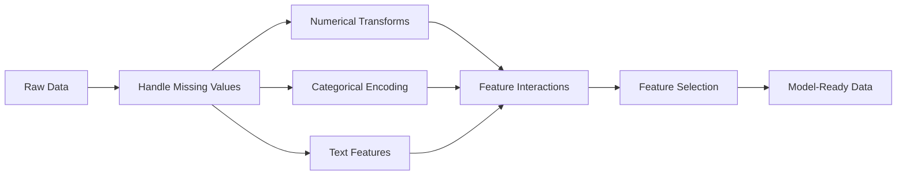

# Ingeniería y selección

> Una buena característica vale mil puntos de datos.

**Type:** Build
**Languages:** Python
**Prerequisites:** Phase 1 (Statistics for ML, Linear Algebra), Phase 2 Lessons 1-7
**Time:** ~90 minutes

## Objetivos de aprendizaje

- Implementar transformaciones numéricas (estandarización, escalación mínima máxima, transformación de registro, enlaces) y explicar cuándo cada una es apropiada
- Construir una codificación de un solo punto, etiqueta y objetivo para características categoricas e identificar el riesgo de fuga de datos en la codificación de destino
- Construir un vectorizador TF-IDF desde cero y explicar por qué supera el conteo de palabras en bruto para la clasificación de texto
- Aplicar la selección de características basada en filtros (umbral de variación, correlación, información mutua) para reducir la dimensionalidad

## El problema

Tienes un conjunto de datos, eliges un algoritmo, lo entrenas, los resultados son mediocres, intentas un algoritmo más sofisticado, todavía mediocre, pasas una semana sintonizando los hiperparámetros, mejora marginal.

Entonces alguien transforma los datos en bruto en mejores características y una simple regresión logística supera tu conjunto ajustado con gradiente aumentado.

Esto sucede constantemente. En el ML clásico, la representación de los datos importa más que la elección del algoritmo. Un modelo de precio de la casa con "escena cuadrada" y "número de habitaciones" vencerá a un modelo con "dirección como una cadena cruda" sin importar cuán sofisticado sea el aprendiz. El algoritmo solo puede funcionar con lo que le das.

La ingeniería de características es el proceso de transformar datos en bruto en representaciones que hacen que los patrones sean más fáciles de encontrar para los modelos. La selección de características es el proceso de tirar las características que añaden ruido sin agregar señal. Juntos, son la actividad de mayor apalancamiento en el ML clásico.

## El concepto

### El gasoducto de características



### Características numéricas

Los números en bruto rara vez están listos para el modelo.

**Scaling:**Colocar características en el mismo rango para que los algoritmos basados en la distancia (K-Means, KNN, SVM) traten todas las características de manera igual. mapas de escalación min-max a [0, 1]. mapas de estandarización (z-score) a media=0, std=1.

**Log transform:**Comprime las distribuciones a la derecha (ingresos, población, recuento de palabras).

**Binning:**Conversión de valores continuos en categorías. Útil cuando la relación entre característica y objetivo no es lineal, pero es gradual (por ejemplo, grupos de edad).

**Polynomial features:**Crea términos x^2, x^3, x1*x2. permite que los modelos lineales capturen relaciones no lineales a costa de más características.

### Características de la categoría

Los modelos necesitan números, las categorías necesitan codificación.

**One-hot encoding:**Crea una columna binaria para cada categoría. "color = red/blue/green" se convierte en tres columnas: is_red, is_blue, is_green. Funciona bien para características de baja cardinalidad pero explota con muchas categorías.

**Label encoding:**Mapea cada categoría a un número entero: rojo=0, azul=1, verde=2. Introduce un ordenamiento falso (el modelo podría pensar verde > azul > rojo). Sólo apropiado para modelos basados en árboles que se dividen en valores individuales.

**Target encoding:**Reemplaza cada categoría por la media de la variable objetivo para esa categoría. Poderosa pero peligrosa: alto riesgo de fuga de datos. Debe calcularse únicamente sobre datos de formación y aplicarse a los datos de ensayo.

### Características del texto

**Count vectorizer:**Cuenta cuántas veces aparece cada palabra en un documento. "el gato se sentó en la alfombra" se convierte en {el: 2, el gato: 1, sat: 1, en: 1, la alfombra: 1}.

**TF-IDF:**El término frecuencia inversa frecuencia de documento. Pese las palabras por lo únicas que son en los documentos. palabras comunes como "el" tienen un peso bajo.

```
TF(word, doc) = count(word in doc) / total words in doc
IDF(word) = log(total docs / docs containing word)
TF-IDF = TF * IDF
```

### Los valores que faltan

Los datos reales tienen agujeros.

- **Drop rows:**Sólo cuando los datos faltantes son raros y aleatorios
- **Mean/median imputation:**Simple, conserva la forma de distribución (mediana es más robusta a los valores extremos)
- **Mode imputation:**Para características categoricas
- **Indicator column:**Añadir una columna binaria "era_este_falta" antes de imputar. El hecho de que los datos faltan puede ser informativo
- **Forward/backward fill:**Para datos de series temporales

### Interacción de las características

A veces la relación está en la combinación. "Alteza" y "peso" por sí solos son menos predictivos que "BMI = peso / altura^2". Las interacciones de características multiplican el espacio de características, por lo que utilice el conocimiento del dominio para elegir los adecuados.

### Selección de características

Las características irrelevantes aumentan el ruido, aumentan el tiempo de entrenamiento y pueden causar sobreadaptación.

**Filter methods (pre-model):**
- Correlación: elimina las características altamente correlacionadas entre sí (redundante)
- Información mutua: mide en qué medida conocer una característica reduce la incertidumbre sobre el objetivo
- Umbral de variación: eliminar características que apenas varían

**Wrapper methods (model-based):**
- Regularización L1 (Lasso): conduce los pesos de las características irrelevantes a cero exactamente
- Eliminación de las características recurrentes: tren, eliminación de las características menos importantes, repetición

**Why selection matters:**Un modelo con 10 buenas características generalmente superará a un modelo con 10 buenas características y 90 ruidosos.

```figure
feature-scaling
```

## Construye el mismo

### Paso 1: Transformaciones numéricas desde cero

```python
import math


def min_max_scale(values):
    min_val = min(values)
    max_val = max(values)
    if max_val == min_val:
        return [0.0] * len(values)
    return [(v - min_val) / (max_val - min_val) for v in values]


def standardize(values):
    n = len(values)
    mean = sum(values) / n
    variance = sum((v - mean) ** 2 for v in values) / n
    std = math.sqrt(variance) if variance > 0 else 1.0
    return [(v - mean) / std for v in values]


def log_transform(values):
    return [math.log(v + 1) for v in values]


def bin_values(values, n_bins=5):
    min_val = min(values)
    max_val = max(values)
    bin_width = (max_val - min_val) / n_bins
    if bin_width == 0:
        return [0] * len(values)
    result = []
    for v in values:
        bin_idx = int((v - min_val) / bin_width)
        bin_idx = min(bin_idx, n_bins - 1)
        result.append(bin_idx)
    return result


def polynomial_features(row, degree=2):
    n = len(row)
    result = list(row)
    if degree >= 2:
        for i in range(n):
            result.append(row[i] ** 2)
        for i in range(n):
            for j in range(i + 1, n):
                result.append(row[i] * row[j])
    return result
```

### Paso 2: codificación categórica desde cero

```python
def one_hot_encode(values):
    categories = sorted(set(values))
    cat_to_idx = {cat: i for i, cat in enumerate(categories)}
    n_cats = len(categories)

    encoded = []
    for v in values:
        row = [0] * n_cats
        row[cat_to_idx[v]] = 1
        encoded.append(row)

    return encoded, categories


def label_encode(values):
    categories = sorted(set(values))
    cat_to_int = {cat: i for i, cat in enumerate(categories)}
    return [cat_to_int[v] for v in values], cat_to_int


def target_encode(feature_values, target_values, smoothing=10):
    global_mean = sum(target_values) / len(target_values)

    category_stats = {}
    for feat, target in zip(feature_values, target_values):
        if feat not in category_stats:
            category_stats[feat] = {"sum": 0.0, "count": 0}
        category_stats[feat]["sum"] += target
        category_stats[feat]["count"] += 1

    encoding = {}
    for cat, stats in category_stats.items():
        cat_mean = stats["sum"] / stats["count"]
        weight = stats["count"] / (stats["count"] + smoothing)
        encoding[cat] = weight * cat_mean + (1 - weight) * global_mean

    return [encoding[v] for v in feature_values], encoding
```

### Paso 3: Características del texto desde cero

```python
def count_vectorize(documents):
    vocab = {}
    idx = 0
    for doc in documents:
        for word in doc.lower().split():
            if word not in vocab:
                vocab[word] = idx
                idx += 1

    vectors = []
    for doc in documents:
        vec = [0] * len(vocab)
        for word in doc.lower().split():
            vec[vocab[word]] += 1
        vectors.append(vec)

    return vectors, vocab


def tfidf(documents):
    n_docs = len(documents)

    vocab = {}
    idx = 0
    for doc in documents:
        for word in doc.lower().split():
            if word not in vocab:
                vocab[word] = idx
                idx += 1

    doc_freq = {}
    for doc in documents:
        seen = set()
        for word in doc.lower().split():
            if word not in seen:
                doc_freq[word] = doc_freq.get(word, 0) + 1
                seen.add(word)

    vectors = []
    for doc in documents:
        words = doc.lower().split()
        word_count = len(words)
        tf_map = {}
        for word in words:
            tf_map[word] = tf_map.get(word, 0) + 1

        vec = [0.0] * len(vocab)
        for word, count in tf_map.items():
            tf = count / word_count
            idf = math.log(n_docs / doc_freq[word])
            vec[vocab[word]] = tf * idf
        vectors.append(vec)

    return vectors, vocab
```

### Paso 4: Imputación de valor ausente desde cero

```python
def impute_mean(values):
    present = [v for v in values if v is not None]
    if not present:
        return [0.0] * len(values), 0.0
    mean = sum(present) / len(present)
    return [v if v is not None else mean for v in values], mean


def impute_median(values):
    present = sorted(v for v in values if v is not None)
    if not present:
        return [0.0] * len(values), 0.0
    n = len(present)
    if n % 2 == 0:
        median = (present[n // 2 - 1] + present[n // 2]) / 2
    else:
        median = present[n // 2]
    return [v if v is not None else median for v in values], median


def impute_mode(values):
    present = [v for v in values if v is not None]
    if not present:
        return values, None
    counts = {}
    for v in present:
        counts[v] = counts.get(v, 0) + 1
    mode = max(counts, key=counts.get)
    return [v if v is not None else mode for v in values], mode


def add_missing_indicator(values):
    return [0 if v is not None else 1 for v in values]
```

### Paso 5: Selección de características desde cero

```python
def correlation(x, y):
    n = len(x)
    mean_x = sum(x) / n
    mean_y = sum(y) / n
    cov = sum((xi - mean_x) * (yi - mean_y) for xi, yi in zip(x, y)) / n
    std_x = math.sqrt(sum((xi - mean_x) ** 2 for xi in x) / n)
    std_y = math.sqrt(sum((yi - mean_y) ** 2 for yi in y) / n)
    if std_x == 0 or std_y == 0:
        return 0.0
    return cov / (std_x * std_y)


def mutual_information(feature, target, n_bins=10):
    feat_min = min(feature)
    feat_max = max(feature)
    bin_width = (feat_max - feat_min) / n_bins if feat_max != feat_min else 1.0
    feat_binned = [
        min(int((f - feat_min) / bin_width), n_bins - 1) for f in feature
    ]

    n = len(feature)
    target_classes = sorted(set(target))

    feat_bins = sorted(set(feat_binned))
    p_feat = {}
    for b in feat_bins:
        p_feat[b] = feat_binned.count(b) / n

    p_target = {}
    for t in target_classes:
        p_target[t] = target.count(t) / n

    mi = 0.0
    for b in feat_bins:
        for t in target_classes:
            joint_count = sum(
                1 for fb, tv in zip(feat_binned, target) if fb == b and tv == t
            )
            p_joint = joint_count / n
            if p_joint > 0:
                mi += p_joint * math.log(p_joint / (p_feat[b] * p_target[t]))

    return mi


def variance_threshold(features, threshold=0.01):
    n_features = len(features[0])
    n_samples = len(features)
    selected = []

    for j in range(n_features):
        col = [features[i][j] for i in range(n_samples)]
        mean = sum(col) / n_samples
        var = sum((v - mean) ** 2 for v in col) / n_samples
        if var >= threshold:
            selected.append(j)

    return selected


def remove_correlated(features, threshold=0.9):
    n_features = len(features[0])
    n_samples = len(features)

    to_remove = set()
    for i in range(n_features):
        if i in to_remove:
            continue
        col_i = [features[r][i] for r in range(n_samples)]
        for j in range(i + 1, n_features):
            if j in to_remove:
                continue
            col_j = [features[r][j] for r in range(n_samples)]
            corr = abs(correlation(col_i, col_j))
            if corr >= threshold:
                to_remove.add(j)

    return [i for i in range(n_features) if i not in to_remove]
```

### Paso 6: Líneas completas y demostración

```python
import random


def make_housing_data(n=200, seed=42):
    random.seed(seed)
    data = []
    for _ in range(n):
        sqft = random.uniform(500, 5000)
        bedrooms = random.choice([1, 2, 3, 4, 5])
        age = random.uniform(0, 50)
        neighborhood = random.choice(["downtown", "suburbs", "rural"])
        has_pool = random.choice([True, False])

        sqft_with_missing = sqft if random.random() > 0.05 else None
        age_with_missing = age if random.random() > 0.08 else None

        price = (
            50 * sqft
            + 20000 * bedrooms
            - 1000 * age
            + (50000 if neighborhood == "downtown" else 10000 if neighborhood == "suburbs" else 0)
            + (15000 if has_pool else 0)
            + random.gauss(0, 20000)
        )

        data.append({
            "sqft": sqft_with_missing,
            "bedrooms": bedrooms,
            "age": age_with_missing,
            "neighborhood": neighborhood,
            "has_pool": has_pool,
            "price": price,
        })
    return data


if __name__ == "__main__":
    data = make_housing_data(200)

    print("=== Raw Data Sample ===")
    for row in data[:3]:
        print(f"  {row}")

    sqft_raw = [d["sqft"] for d in data]
    age_raw = [d["age"] for d in data]
    prices = [d["price"] for d in data]

    print("\n=== Missing Value Handling ===")
    sqft_missing = sum(1 for v in sqft_raw if v is None)
    age_missing = sum(1 for v in age_raw if v is None)
    print(f"  sqft missing: {sqft_missing}/{len(sqft_raw)}")
    print(f"  age missing: {age_missing}/{len(age_raw)}")

    sqft_indicator = add_missing_indicator(sqft_raw)
    age_indicator = add_missing_indicator(age_raw)
    sqft_imputed, sqft_fill = impute_median(sqft_raw)
    age_imputed, age_fill = impute_mean(age_raw)
    print(f"  sqft filled with median: {sqft_fill:.0f}")
    print(f"  age filled with mean: {age_fill:.1f}")

    print("\n=== Numerical Transforms ===")
    sqft_scaled = standardize(sqft_imputed)
    age_scaled = min_max_scale(age_imputed)
    sqft_log = log_transform(sqft_imputed)
    age_binned = bin_values(age_imputed, n_bins=5)
    print(f"  sqft standardized: mean={sum(sqft_scaled)/len(sqft_scaled):.4f}, std={math.sqrt(sum(v**2 for v in sqft_scaled)/len(sqft_scaled)):.4f}")
    print(f"  age min-max: [{min(age_scaled):.2f}, {max(age_scaled):.2f}]")
    print(f"  age bins: {sorted(set(age_binned))}")

    print("\n=== Categorical Encoding ===")
    neighborhoods = [d["neighborhood"] for d in data]

    ohe, ohe_cats = one_hot_encode(neighborhoods)
    print(f"  One-hot categories: {ohe_cats}")
    print(f"  Sample encoding: {neighborhoods[0]} -> {ohe[0]}")

    le, le_map = label_encode(neighborhoods)
    print(f"  Label encoding map: {le_map}")

    te, te_map = target_encode(neighborhoods, prices, smoothing=10)
    print(f"  Target encoding: {({k: round(v) for k, v in te_map.items()})}")

    print("\n=== Text Features ===")
    descriptions = [
        "large modern house with pool",
        "small cozy cottage near downtown",
        "spacious family home with large yard",
        "modern apartment downtown with view",
        "rustic cabin in rural area",
    ]
    cv, cv_vocab = count_vectorize(descriptions)
    print(f"  Vocabulary size: {len(cv_vocab)}")
    print(f"  Doc 0 non-zero features: {sum(1 for v in cv[0] if v > 0)}")

    tf, tf_vocab = tfidf(descriptions)
    print(f"  TF-IDF vocabulary size: {len(tf_vocab)}")
    top_words = sorted(tf_vocab.keys(), key=lambda w: tf[0][tf_vocab[w]], reverse=True)[:3]
    print(f"  Doc 0 top TF-IDF words: {top_words}")

    print("\n=== Polynomial Features ===")
    sample_row = [sqft_scaled[0], age_scaled[0]]
    poly = polynomial_features(sample_row, degree=2)
    print(f"  Input: {[round(v, 4) for v in sample_row]}")
    print(f"  Polynomial: {[round(v, 4) for v in poly]}")
    print(f"  Features: [x1, x2, x1^2, x2^2, x1*x2]")

    print("\n=== Feature Selection ===")
    feature_matrix = [
        [sqft_scaled[i], age_scaled[i], float(sqft_indicator[i]), float(age_indicator[i])]
        + ohe[i]
        for i in range(len(data))
    ]

    print(f"  Total features: {len(feature_matrix[0])}")

    surviving_var = variance_threshold(feature_matrix, threshold=0.01)
    print(f"  After variance threshold (0.01): {len(surviving_var)} features kept")

    surviving_corr = remove_correlated(feature_matrix, threshold=0.9)
    print(f"  After correlation filter (0.9): {len(surviving_corr)} features kept")

    binary_prices = [1 if p > sum(prices) / len(prices) else 0 for p in prices]
    print("\n  Mutual information with target:")
    feature_names = ["sqft", "age", "sqft_missing", "age_missing"] + [f"neigh_{c}" for c in ohe_cats]
    for j in range(len(feature_matrix[0])):
        col = [feature_matrix[i][j] for i in range(len(feature_matrix))]
        mi = mutual_information(col, binary_prices, n_bins=10)
        print(f"    {feature_names[j]}: MI={mi:.4f}")

    print("\n  Correlation with price:")
    for j in range(len(feature_matrix[0])):
        col = [feature_matrix[i][j] for i in range(len(feature_matrix))]
        corr = correlation(col, prices)
        print(f"    {feature_names[j]}: r={corr:.4f}")
```

## Usalo

Con scikit-learn, estas transformaciones son tuberías composibles:

```python
from sklearn.preprocessing import StandardScaler, OneHotEncoder, PolynomialFeatures
from sklearn.impute import SimpleImputer
from sklearn.feature_extraction.text import TfidfVectorizer
from sklearn.feature_selection import mutual_info_classif, VarianceThreshold
from sklearn.compose import ColumnTransformer
from sklearn.pipeline import Pipeline

numeric_pipe = Pipeline([
    ("imputer", SimpleImputer(strategy="median")),
    ("scaler", StandardScaler()),
])

categorical_pipe = Pipeline([
    ("encoder", OneHotEncoder(sparse_output=False)),
])

preprocessor = ColumnTransformer([
    ("num", numeric_pipe, ["sqft", "age"]),
    ("cat", categorical_pipe, ["neighborhood"]),
])
```

Las versiones de la biblioteca añaden manejo de borde, apoyo de matriz escasa y composición de tubería, pero las matemáticas son las mismas.

## Envío

Esta lección produce:
- `outputs/prompt-feature-engineer.md`- una solicitud para la ingeniería sistemática de características a partir de datos en bruto

## Los ejercicios

1. Añadir una escala robusta (utilizando el rango mediano e intercuartilar en lugar de la media y la desviación estándar) a las transformaciones numéricas.
2. Implementar una codificación de objetivo exclusivo: para cada fila, calcular el promedio de objetivo excluyendo el valor de objetivo de esa fila. Muestre cómo esto reduce el sobreajuste en comparación con la codificación de objetivos ingenuos.
3. Construir una línea de selección de características automática que combine el umbral de variación, el filtro de correlación y el ranking de información mutua. Aplicarlo al conjunto de datos de la vivienda y comparar el rendimiento del modelo (utilice una regresión lineal simple) con todas las características frente a las características seleccionadas.

## Términos clave

| Term | What people say | What it actually means |
|------|----------------|----------------------|
| Feature engineering | "Making new columns" | Transforming raw data into representations that expose patterns to the model |
| Standardization | "Making it normal" | Subtracting the mean and dividing by standard deviation so the feature has mean=0 and std=1 |
| One-hot encoding | "Making dummy variables" | Creating one binary column per category, where exactly one column is 1 for each row |
| Target encoding | "Using the answer to encode" | Replacing each category with the average target value for that category, with smoothing to prevent overfitting |
| TF-IDF | "Fancy word counts" | Term Frequency times Inverse Document Frequency: words weighted by how distinctive they are across the corpus |
| Imputation | "Filling in blanks" | Replacing missing values with estimated values (mean, median, mode, or model-predicted) |
| Feature selection | "Throwing out bad columns" | Removing features that add noise or redundancy, keeping only those with signal about the target |
| Mutual information | "How much one thing tells you about another" | A measure of the reduction in uncertainty about variable Y gained by observing variable X |
| Data leakage | "Accidentally cheating" | Using information during training that would not be available at prediction time, giving falsely optimistic results |

## Leer más

- [Feature Engineering and Selection (Max Kuhn & Kjell Johnson)](http://www.feat.engineering/)- libro en línea gratuito que cubre todo el panorama de la ingeniería de características
- [scikit-learn Preprocessing Guide](https://scikit-learn.org/stable/modules/preprocessing.html)- referencia práctica para todas las transformaciones estándar
- [Target Encoding Done Right (Micci-Barreca, 2001)](https://dl.acm.org/doi/10.1145/507533.507538)- el documento original sobre codificación de objetivos con suavizamiento
