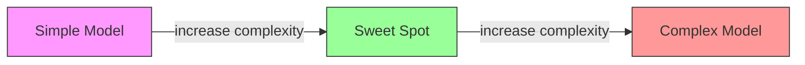
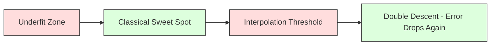
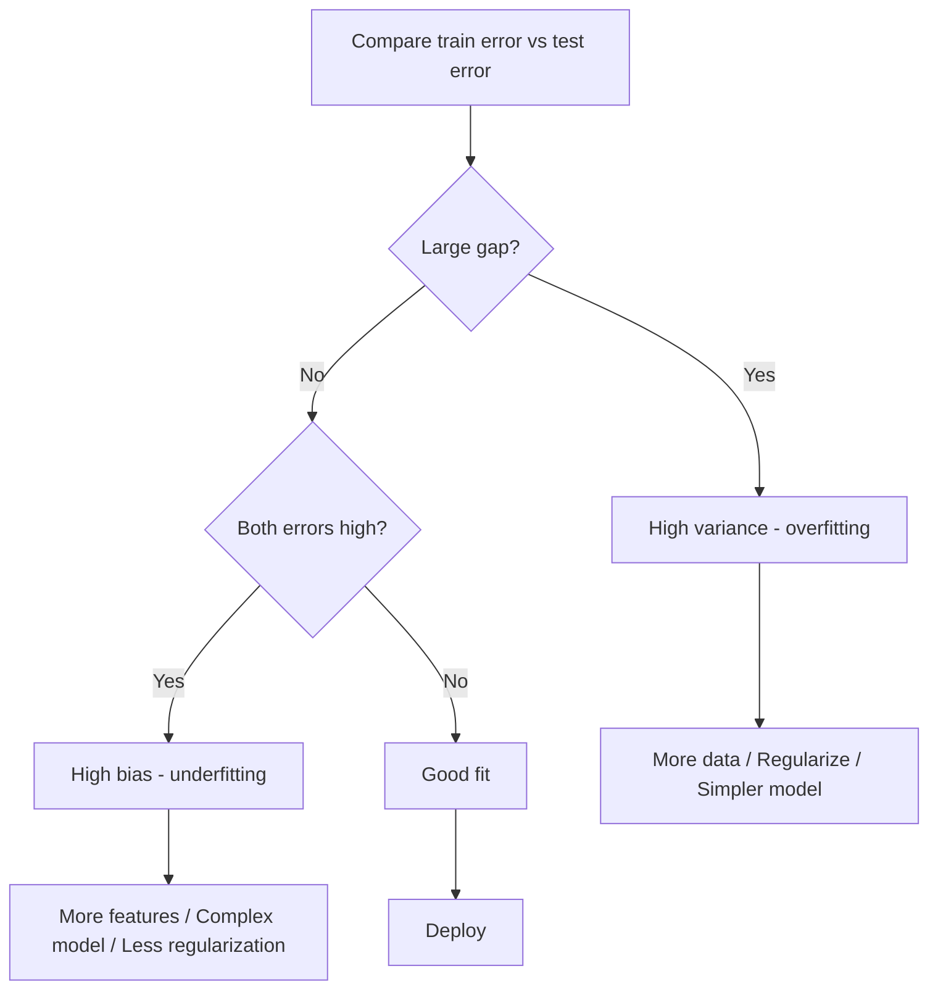
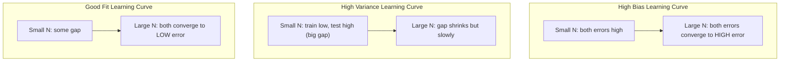
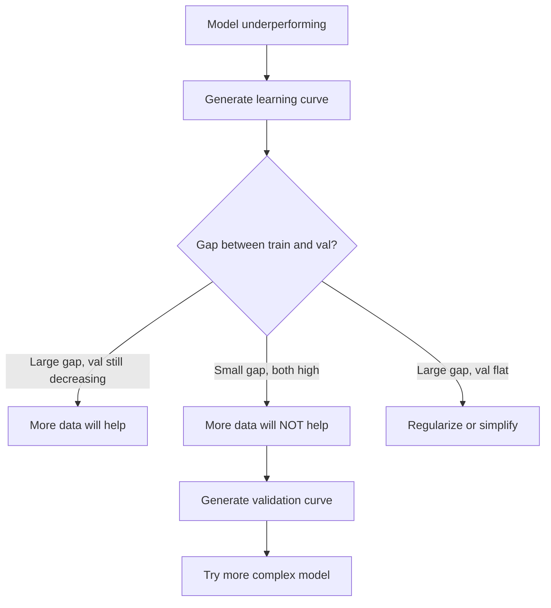

# Compartición de variaciones

> Cada error del modelo proviene de una de tres fuentes: sesgo, variación o ruido. Solo se pueden controlar las dos primeras.

**Type:** Learn
**Language:**Python
**Prerequisites:** Phase 2, Lessons 01-09 (ML basics, regression, classification, evaluation)
**Time:** ~75 minutes

## Objetivos de aprendizaje

- Derivar la descomposición de variación de sesgo del error de predicción esperado y explicar el papel del ruido irreducible
- Diagnosticar si un modelo sufre de alto sesgo o alta variación utilizando patrones de error de entrenamiento y prueba
- Explicar cómo las técnicas de regularización (L1, L2, abandono, parada temprana) negocian sesgo para la variación
- Implementar experimentos que visualicen el compromiso de variaciones de sesgo en modelos de creciente complejidad

## El problema

Entrenó a un modelo, tiene algún error en los datos de prueba. ¿De dónde viene ese error?

Si su modelo es demasiado simple (regressión lineal en un conjunto de datos curvo), se perderá consistentemente el patrón verdadero. Eso es sesgo. Si su modelo es demasiado complejo (polinomio de 20 grados en 15 puntos de datos), encajará perfectamente en los datos de entrenamiento, pero dará predicciones muy diferentes sobre los nuevos datos. Eso es la varianza.

No se puede minimizar ambos al mismo tiempo para una capacidad de modelo fija. Empujar el sesgo hacia abajo y la varianza aumenta. Empujar la varianza hacia abajo y el sesgo aumenta. Comprender este compromiso es la habilidad de diagnóstico más útil en el aprendizaje automático. Te dice si hacer tu modelo más complejo o menos complejo, si obtener más datos o ingeniería de mejores características, si regular más o menos.

## El concepto

### Prejuicios: error sistemático

Si entrenaste el mismo modelo en muchos conjuntos de entrenamiento diferentes extraídos de la misma distribución y promediaste las predicciones, el sesgo es la brecha entre ese promedio y la verdad.

El sesgo alto significa que el modelo es demasiado rígido para capturar el patrón real. Una línea recta que encaja en una parábola siempre perderá la curva, sin importar cuántos datos le proporciones. Esto es insuficiente.

```
High bias (underfitting):
  Model always predicts roughly the same wrong thing.
  Training error: HIGH
  Test error: HIGH
  Gap between them: SMALL
```

### Variante: sensibilidad a los datos de formación

La variación mide cuánto cambian sus predicciones cuando se entrenan en diferentes subconjuntos de datos.

Una varianza alta significa que el modelo encaja el ruido en los datos de entrenamiento, no la señal subyacente. Un polinomio de grado-20 se filtra a través de cada punto de entrenamiento pero oscila salvajemente entre ellos. Esto es sobreajustado.

```
High variance (overfitting):
  Model fits training data perfectly but fails on new data.
  Training error: LOW
  Test error: HIGH
  Gap between them: LARGE
```

### La descomposición

Para cualquier punto x, el error de predicción esperado bajo pérdida cuadrada se descompone exactamente:

```
Expected Error = Bias^2 + Variance + Irreducible Noise

where:
  Bias^2   = (E[f_hat(x)] - f(x))^2
  Variance = E[(f_hat(x) - E[f_hat(x)])^2]
  Noise    = E[(y - f(x))^2]             (sigma^2)
```

- `f(x)`es la función verdadera
- `f_hat(x)`es la predicción de su modelo
- `E[...]`es la expectativa sobre diferentes conjuntos de formación
- `y`es la etiqueta observada (función real más ruido)

El término ruido es irreducible. Ningún modelo puede hacer mejor que sigma^2 en datos ruidosos. Su trabajo es encontrar el equilibrio correcto entre el sesgo^2 y la varianza.

### Complejidad del modelo frente a error



La clásica curva en forma de U:

| Complexity | Bias | Variance | Total Error |
|-----------|------|----------|-------------|
| Too low | HIGH | LOW | HIGH (underfitting) |
| Just right | MODERATE | MODERATE | LOWEST |
| Too high | LOW | HIGH | HIGH (overfitting) |

### La regularización como control de variaciones prejuiciosas

La regularización aumenta deliberadamente el sesgo para reducir la varianza.

- **L2 (Ridge):**Reducir todos los pesos hacia cero, mantener todas las características pero reducir su influencia.
- **L1 (Lasso):**Empuja algunos pesos exactamente a cero.
- **Dropout:**Desactiva las neuronas al azar durante el entrenamiento.
- **Early stopping:**Se detiene el entrenamiento antes de que el modelo se adapte plenamente a los datos de entrenamiento.

La fuerza de regularización (lambda, tasa de abandono, número de épocas) controla directamente dónde se sienta en la curva de variación de sesgo.

### Descenso doble: la perspectiva moderna

La teoría clásica dice: después del punto dulce, más complejidad siempre duele. Pero la investigación desde 2019 ha demostrado algo inesperado. Si sigues aumentando la capacidad del modelo mucho más allá del umbral de interpolación (donde el modelo tiene parámetros suficientes para encajar perfectamente los datos de entrenamiento), el error de prueba puede disminuir nuevamente.



Este fenómeno de "doble descenso" explica por qué las redes neuronales masivamente sobreparametrizadas (con mucho más parámetros que los ejemplos de entrenamiento) todavía se generalizan bien.

Observaciones clave sobre el doble descenso:
- Sucede en modelos lineales, árboles de decisión y redes neuronales
- Más datos pueden realmente perjudicar en la región de interpolación (descenso doble por muestreo)
- También puede ser causada por más épocas de entrenamiento (descenso doble en sentido de época)
- La regularización suaviza el pico pero no lo elimina

¿Por qué sucede esto? En el umbral de interpolación, el modelo tiene la capacidad suficiente para adaptarse a todos los puntos de entrenamiento. Se forza a una solución muy específica que se extiende a través de cada punto, y pequeñas perturbaciones en los datos causan grandes cambios en el ajuste. Aquí es donde la varianza alcanza su punto máximo. Más allá del umbral, el modelo tiene muchas soluciones posibles que se ajustan perfectamente a los datos. El algoritmo de aprendizaje (por ejemplo, la descendencia de gradientes con regularización implícita) tiende a elegir el más simple entre ellos. Este sesgo implícito hacia soluciones simples es por qué los modelos sobreparametrizados se generalizan.

| Regime | Parameters vs Samples | Behavior |
|--------|----------------------|----------|
| Underparameterized | p << n | Classical tradeoff applies |
| Interpolation threshold | p ~ n | Variance peaks, test error spikes |
| Overparameterized | p >> n | Implicit regularization kicks in, test error drops |

Para fines prácticos: si está utilizando redes neuronales o grandes conjuntos de árboles, no se detenga en el umbral de interpolación. O permanezca muy por debajo de él (con regularización explícita) o pase mucho más allá de él.

### Diagnosticando su modelo



| Symptom | Diagnosis | Fix |
|---------|-----------|-----|
| High train error, high test error | Bias | More features, complex model, less regularization |
| Low train error, high test error | Variance | More data, regularization, simpler model, dropout |
| Low train error, low test error | Good fit | Ship it |
| Train error decreasing, test error increasing | Overfitting in progress | Early stopping |

### Estrategias prácticas

**When bias is the problem:**
- Añadir características de polinomio o interacción
- Utilice un modelo más flexible (ensemble de árboles en lugar de lineal)
- Reducir la fuerza de regularización
- Trenes más largos (si no se han convergido)

**When variance is the problem:**
- Obtenga más datos de entrenamiento
- Utilice el embalaje (bosques aleatorios)
- Aumento de la regularización (más alto lambda, más abandono)
- Selección de características (eliminar las características ruidosas)
- Utilice la validación cruzada para detectarlo temprano

### Métodos conjuntos y reducción de las variaciones

Los métodos conjuntos son la herramienta más práctica para combatir la varianza.

**Bagging (Bootstrap Aggregating)**El modelo de formación de la formación de los equipos de entrenamiento de la formación de los equipos de entrenamiento de la formación de los equipos de entrenamiento de los equipos de entrenamiento de los equipos de entrenamiento de los equipos de entrenamiento de los equipos de entrenamiento de los equipos de entrenamiento de los equipos de entrenamiento de los equipos de entrenamiento de los equipos de entrenamiento de los equipos de entrenamiento de los equipos de entrenamiento de los equipos de entrenamiento de los equipos de entrenamiento de entrenamiento de los equipos de entrenamiento de entrenamiento de los equipos de entrenamiento de entrenamiento de los equipos de entrenamiento de entrenamiento de los equipos de entrenamiento de entrenamiento de los equipos de entrenamiento de entrenamiento de los equipos de entrenamiento de entrenamiento de los equipos de entrenamiento de entrenamiento de los equipos de entrenamiento de entrenamiento de los equipos de entrenamiento de entrenamiento de los equipos de entrenamiento de entrenamiento de los equipos de entrenamiento de entrenamiento de los equipos de entrenamiento de entrenamiento de los equipos de entrenamiento de entrenamiento de entrenamiento de los equipos de entrenamiento de entrenamiento de entrenamiento de entrenamiento de entrenamiento de entrenamiento de entrenamiento de entrenamiento de entrenamiento de entrenamiento de entrenamiento de entrenamiento de entrenamiento de entrenamiento de entrenamiento de entrenamiento de entrenamiento de entrenamiento de entrenamiento de entrenamiento de entrenamiento de entrenamiento de entrenamiento de entrenamiento de entrenamiento de entrenamiento de entrenamiento de entrenamiento de entrenamiento de entrenamiento de entrenamiento de entrenamiento de entrenamiento de entrenamiento de entrenamiento de entrenamiento de entrenamiento de entrenamiento de entrenamiento de entrenamiento de entrenamiento de entrenamiento de entrenamiento de entrenamiento de entrenamiento de entrenamiento de entrenamiento de entrenamiento de entrenamiento de entrenamiento de entrenamiento de entrenamiento de entrenamiento de entrenamiento de entrenamiento de entren en entrenamiento de entrenamiento de entrenamiento de entrenamiento de entren en entrenamiento de entrenamiento de entrenamiento de entren en entren en entrenamiento de entren en entrenamiento de entrenamiento de entren en entrenamiento de entren en entren en entrenamiento de entren en entren en entren en entren en entren en entrenamiento de entren en entren en entren en entren en entren en entren en entren en entren en entren en entren en entren en entren en entren en entren en entren en entren en entren en entren en entren en entren en entren en entren en entren en entren en entren en

Por qué funciona matemáticamente: si promedias N predicciones independientes, cada una con varianza sigma^2, la varianza de la media es sigma^2 / N. Los modelos no son verdaderamente independientes (todos ven datos similares), por lo que la reducción es menor que 1/N, pero sigue siendo sustancial.

**Boosting**El sistema de impulso de los modelos se centra en los errores del conjunto hasta el momento. El impulso de los gradientes y AdaBoost son los principales ejemplos.

| Method | Primary Effect | Bias Change | Variance Change |
|--------|---------------|-------------|-----------------|
| Bagging | Reduces variance | No change | Decreases |
| Boosting | Reduces bias | Decreases | Can increase |
| Stacking | Reduces both | Depends on meta-learner | Depends on base models |
| Dropout | Implicit bagging | Slight increase | Decreases |

**Practical rule:**Si el modelo base tiene una alta varianza (árboles profundos, polinomios de alto grado), use embalaje.

### Curvas de aprendizaje

Las curvas de aprendizaje trazan el entrenamiento y el error de validación en función del tamaño del conjunto de entrenamiento. Son la herramienta de diagnóstico más práctica que usted tiene. A diferencia de una comparación de tren/teste, las curvas de aprendizaje le muestran la trayectoria de su modelo y le dicen si más datos le ayudarán.



Cómo leerlas:

| Scenario | Training Error | Validation Error | Gap | What It Means | What to Do |
|----------|---------------|-----------------|-----|---------------|------------|
| High bias | High | High | Small | Model cannot capture the pattern | More features, complex model, less regularization |
| High variance | Low | High | Large | Model memorizes training data | More data, regularization, simpler model |
| Good fit | Moderate | Moderate | Small | Model generalizes well | Ship it |
| High variance, improving | Low | Decreasing with more data | Shrinking | Variance problem that data can fix | Collect more data |
| High bias, flat | High | High and flat | Small and flat | More data will NOT help | Change model architecture |

La idea crítica: si ambas curvas se han aplastado y la brecha es pequeña pero ambos errores son altos, más datos son inútiles. Necesitas un modelo mejor. Si la brecha es grande y todavía se reduce, más datos ayudarán.

### Cómo generar curvas de aprendizaje

Hay dos enfoques:

**Approach 1: Vary training set size, fixed model.**Mantenga el modelo y los hiperparámetros constantes. Entrenad en subconjuntos cada vez más grandes de los datos de entrenamiento. Mide el error de entrenamiento y el error de validación en cada tamaño. Esta es la curva de aprendizaje estándar.

**Approach 2: Vary model complexity, fixed data.**Mantenga la constante de datos. Busque un parámetro de complejidad (grado polinómico, profundidad del árbol, número de capas). Mide el error de entrenamiento y el error de validación en cada complejidad. Esta es una curva de validación y muestra directamente el tradeoff de variación de sesgo.

Los dos enfoques se complementan entre sí. El primero le dice si más datos ayudarán. El segundo le dice si un modelo diferente ayudará.



```figure
bias-variance
```

## Construye el mismo

El código en `code/bias_variance.py`Esto es el enfoque, paso a paso.

### Paso 1: Generar datos sintéticos a partir de una función conocida

Usamos`f(x) = sin(1.5x) + 0.5x`Conocer la función verdadera nos permite calcular el sesgo exacto y la variación.

```python
def true_function(x):
    return np.sin(1.5 * x) + 0.5 * x

def generate_data(n_samples=30, noise_std=0.5, x_range=(-3, 3), seed=None):
    rng = np.random.RandomState(seed)
    x = rng.uniform(x_range[0], x_range[1], n_samples)
    y = true_function(x) + rng.normal(0, noise_std, n_samples)
    return x, y
```

### Paso 2: Muestreo de bootstrap y ajuste polinómico

Para cada grado polinómico, dibujamos muchos conjuntos de entrenamiento de arranque, encajamos en el polinomio y registramos predicciones en una cuadrícula de prueba fija. Esto nos da una distribución de predicciones en cada punto de prueba.

```python
def fit_polynomial(x_train, y_train, degree, lam=0.0):
    X = np.column_stack([x_train ** d for d in range(degree + 1)])
    if lam > 0:
        penalty = lam * np.eye(X.shape[1])
        penalty[0, 0] = 0
        w = np.linalg.solve(X.T @ X + penalty, X.T @ y_train)
    else:
        w = np.linalg.lstsq(X, y_train, rcond=None)[0]
    return w
```

Cada muestra de arranque se extrae de la misma distribución subyacente pero contiene puntos diferentes.

### Paso 3: Computación de la descomposición de las variaciones

Con 200 conjuntos de predicciones en cada punto de prueba, podemos calcular la descomposición directamente a partir de la definición:

```python
mean_pred = predictions.mean(axis=0)
bias_sq = np.mean((mean_pred - y_true) ** 2)
variance = np.mean(predictions.var(axis=0))
total_error = np.mean(np.mean((predictions - y_true) ** 2, axis=1))
```

- `mean_pred`es E[f_hat(x)] estimado a partir de muestras de arranque
- `bias_sq`es la diferencia cuadrada entre la predicción promedio y la verdad
- `variance`es la propagación promedio de las predicciones en las muestras de arranque
- `total_error`debe ser aproximadamente igual a la variación^2 + variación + ruido

### Paso 4: Curvas de aprendizaje

Las curvas de aprendizaje varían el tamaño del conjunto de entrenamiento manteniendo fija la complejidad del modelo.

```python
def demo_learning_curves():
    sizes = [10, 15, 20, 30, 50, 75, 100, 150, 200, 300]
    degree = 5

    for n in sizes:
        train_errors = []
        test_errors = []
        for seed in range(50):
            x_train, y_train = generate_data(n_samples=n, seed=seed * 100)
            w = fit_polynomial(x_train, y_train, degree)
            train_pred = predict_polynomial(x_train, w)
            train_mse = np.mean((train_pred - y_train) ** 2)
            test_pred = predict_polynomial(x_test, w)
            test_mse = np.mean((test_pred - y_test) ** 2)
            train_errors.append(train_mse)
            test_errors.append(test_mse)
        # Average over runs gives the learning curve point
```

Para un modelo de alta variación (grado 5 con pequeños datos), se ve:
- El error de entrenamiento comienza bajo y aumenta a medida que más datos hacen que la memorización sea más difícil
- El error de prueba comienza alto y disminuye a medida que el modelo recibe más señal
- La brecha se reduce con más datos

Para un modelo de alto sesgo (grado 1), ambos errores convergen rápidamente al mismo valor alto y más datos no ayudan.

### Paso 5: Control de regularización

El código también incluye `demo_regularization_sweep()`, que fija un polinomio de alto grado (grado 15) y varía la fuerza de regularización de Ridge de 0.001 a 100. Esto muestra el tradeoff de variación de sesgo desde un ángulo diferente: en lugar de variar la complejidad del modelo, variamos la fuerza de restricción.

```python
def demo_regularization_sweep():
    alphas = [0.001, 0.005, 0.01, 0.05, 0.1, 0.5, 1.0, 5.0, 10.0, 50.0, 100.0]
    for alpha in alphas:
        results = bias_variance_decomposition([15], lam=alpha)
        r = results[15]
        print(f"alpha={alpha:.3f}  bias={r['bias_sq']:.4f}  var={r['variance']:.4f}")
```

En el nivel bajo de alfa, el polinomio de grado 15 es casi sin restricciones. La variación domina porque el modelo persigue el ruido en cada muestra de arranque. En el nivel alto de alfa, la penalidad es tan fuerte que el modelo se convierte efectivamente en una función casi constante.

Esta es la misma curva U de diferentes grados polinómicos, pero controlada por un botón continuo en lugar de uno discreto.

## Usalo

sklearn proporciona `learning_curve`y `validation_curve`para automatizar estos diagnósticos sin escribir bucles de arranque.

### Curva de validación: complejidad del modelo de barrido

```python
from sklearn.model_selection import validation_curve
from sklearn.pipeline import make_pipeline
from sklearn.preprocessing import PolynomialFeatures
from sklearn.linear_model import Ridge

degrees = list(range(1, 16))
train_scores_all = []
val_scores_all = []

for d in degrees:
    pipe = make_pipeline(PolynomialFeatures(d), Ridge(alpha=0.01))
    train_scores, val_scores = validation_curve(
        pipe, X, y, param_name="polynomialfeatures__degree",
        param_range=[d], cv=5, scoring="neg_mean_squared_error"
    )
    train_scores_all.append(-train_scores.mean())
    val_scores_all.append(-val_scores.mean())
```

Esto le da la curva de compensación de variación-prejuicio directamente. donde el puntaje de validación es peor en relación con el puntaje del entrenamiento, la variación domina. donde ambos son malos, el prejuicio domina.

### Curva de aprendizaje: tamaño del conjunto de entrenamiento de barrido

```python
from sklearn.model_selection import learning_curve

pipe = make_pipeline(PolynomialFeatures(5), Ridge(alpha=0.01))
train_sizes, train_scores, val_scores = learning_curve(
    pipe, X, y, train_sizes=np.linspace(0.1, 1.0, 10),
    cv=5, scoring="neg_mean_squared_error"
)
train_mse = -train_scores.mean(axis=1)
val_mse = -val_scores.mean(axis=1)
```

El argumento`train_mse`y `val_mse`contra`train_sizes`La forma te dice todo sobre tu modelo.

### Validación cruzada con barrido de regularización

```python
from sklearn.model_selection import cross_val_score

alphas = [0.001, 0.01, 0.1, 1.0, 10.0, 100.0]
for alpha in alphas:
    pipe = make_pipeline(PolynomialFeatures(10), Ridge(alpha=alpha))
    scores = cross_val_score(pipe, X, y, cv=5, scoring="neg_mean_squared_error")
    print(f"alpha={alpha:>7.3f}  MSE={-scores.mean():.4f} +/- {scores.std():.4f}")
```

Esto varía la fuerza de regularización para una complejidad de modelo fija. Verá el mismo tradeoff de variación de sesgo: baja alfa significa alta variación, alta alfa significa alto sesgo.

### La combinación de todo: un flujo de trabajo completo para el diagnóstico

En la práctica, se ejecutan estos diagnósticos en secuencia:

1. Entrenad a su modelo, compute el tren y prueba el error.
2. Si ambos son altos, tienes un problema de sesgo.
3. Si el tren es bajo pero la prueba es alta: tienes un problema de variación.
4. Generar una curva de validación que varíe su parámetro de complejidad principal.
5. En el punto ideal, genera una curva de aprendizaje. Si la brecha es todavía grande, necesitas más datos o regularización.
6. Prueba Ridge/Lasso con diferentes valores alfa usando `cross_val_score`Seleccione el alfa donde el error de validación cruzada sea menor.

Esto toma 10-15 minutos de cálculo para la mayoría de los conjuntos de datos tablales y ahorra horas de adivinación.

## Envío

Esta lección produce: `outputs/prompt-model-diagnostics.md`

## Los ejercicios

1. ejecuta la descomposición con `noise_std=0`¿Qué pasa con el término de error irreducible? ¿Cambia la complejidad óptima?

2. ¿Aumentar el tamaño del conjunto de entrenamiento de 30 a 300? ¿Cómo afecta esto al componente de varianza? ¿El grado polinómico óptimo cambia?

3. Añadir regularización L2 (regresión de Ridge) al experimento. Para un polinomio de alto grado fijo (grado 15), barrida lambda de 0 a 100.

4. Modificar la función verdadera de un polinomio a `sin(x)`¿Cómo cambia la descomposición de la variación de sesgo? ¿Existe todavía un grado óptimo claro?

5. Implementar un simple envase de agregación de bootstrap (bagging): entrenar 10 modelos en muestras de bootstrap y predicciones promedio. Muestre que esto reduce la varianza sin aumentar mucho el sesgo.

## Términos clave

| Term | What people say | What it actually means |
|------|----------------|----------------------|
| Bias | "The model is too simple" | Systematic error from wrong assumptions. The gap between the average model prediction and truth. |
| Variance | "The model is overfitting" | Error from sensitivity to training data. How much predictions change across different training sets. |
| Irreducible error | "Noise in the data" | Error from randomness in the true data-generating process. No model can eliminate it. |
| Underfitting | "Not learning enough" | Model has high bias. It misses the real pattern even on training data. |
| Overfitting | "Memorizing the data" | Model has high variance. It fits noise in training data that does not generalize. |
| Regularization | "Constraining the model" | Adding a penalty to reduce model complexity, trading bias for lower variance. |
| Double descent | "More parameters can help" | Test error decreases again when model capacity far exceeds the interpolation threshold. |
| Model complexity | "How flexible the model is" | The capacity of a model to fit arbitrary patterns. Controlled by architecture, features, or regularization. |

## Leer más

- [Hastie, Tibshirani, Friedman: Elements of Statistical Learning, Ch. 7](https://hastie.su.domains/ElemStatLearn/)-- el tratamiento definitivo de la descomposición de variaciones de sesgo
- [Belkin et al., Reconciling modern machine learning practice and the bias-variance trade-off (2019)](https://arxiv.org/abs/1812.11118)-- el papel de doble descenso
- [Nakkiran et al., Deep Double Descent (2019)](https://arxiv.org/abs/1912.02292)-- Descenso doble según la época y la muestra
- [Scott Fortmann-Roe: Understanding the Bias-Variance Tradeoff](http://scott.fortmann-roe.com/docs/BiasVariance.html)-- explicación visual clara
