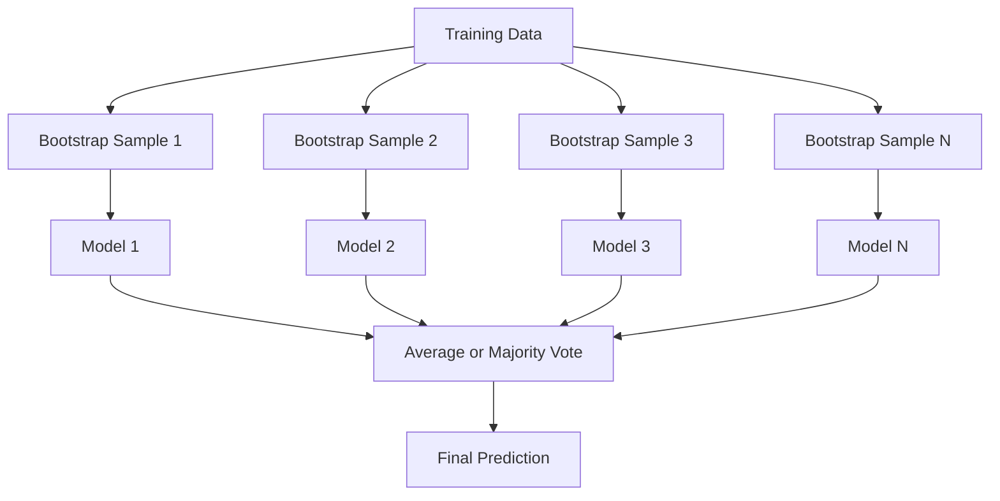
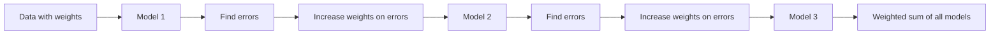
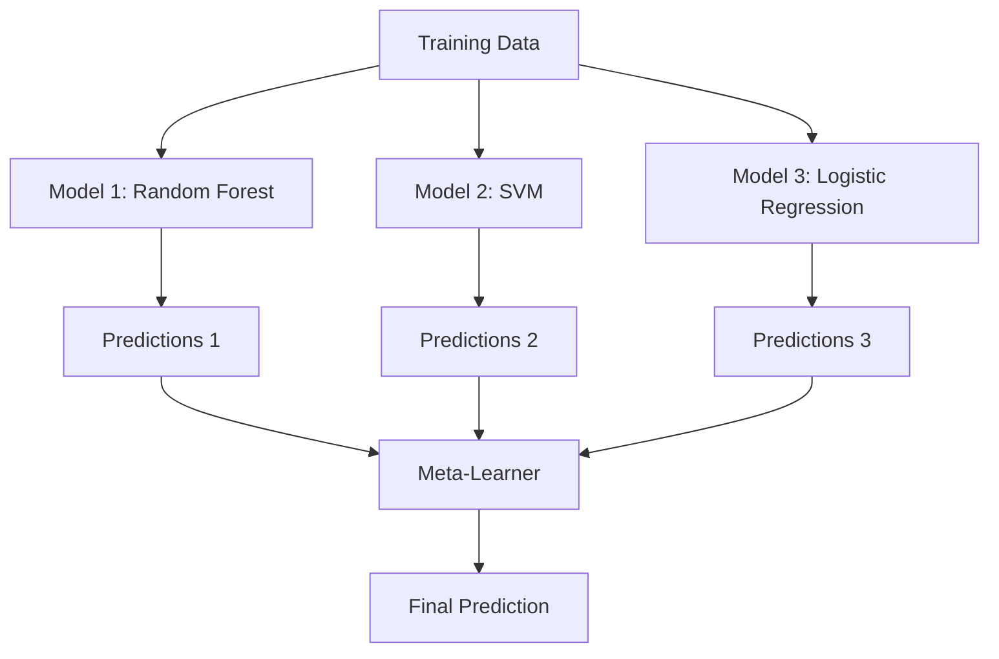

# Métodos de ensamblaje

> Un grupo de estudiantes débiles, combinados correctamente, se convierten en un aprendiz fuerte.

**Type:** Build
**Language:**Python
**Prerequisites:** Phase 2, Lesson 10 (Bias-Variance Tradeoff)
**Time:** ~120 minutes

## Objetivos de aprendizaje

- Implemente AdaBoost y gradiente de impulso desde cero y explique cómo el impulso secuencialmente reduce el sesgo
- Construir un conjunto de embalaje y demostrar cómo la media de modelos descorrelados reduce la varianza sin aumentar el sesgo
- Comparar el embalaje, el refuerzo y la embalaje en términos de qué componente de error se destina cada método
- Evaluar la diversidad del conjunto y explicar por qué la precisión de la votación en la mayoría mejora con estudiantes débiles más independientes

## El problema

Un árbol de decisión es rápido de entrenar y fácil de interpretar, pero se sobrepasa. Un modelo lineal único se adapta a límites complejos. Podrías pasar días diseñando la arquitectura de modelo perfecta. O podrías combinar un montón de modelos imperfectos y obtener algo mejor que cualquiera de ellos individualmente.

Los métodos de ensamblaje hacen exactamente esto. Son la técnica más confiable para ganar competencias Kaggle en datos tablales, impulsan la mayoría de los sistemas de producción ML, e ilustran el compromiso de variación de sesgo en acción.

## El concepto

### Por qué trabajan los grupos

Supongamos que usted tiene N clasificadores independientes, cada uno con precisión p > 0.5.

```
P(majority correct) = sum over k > N/2 of C(N,k) * p^k * (1-p)^(N-k)
```

Para 21 clasificadores, cada uno con una precisión del 60%, la precisión de la mayoría de votos es de aproximadamente 74%. Con 101 clasificadores, aumenta a 84%.

El requisito clave es **diversity**Si todos los modelos cometen los mismos errores, la combinación de ellos no ayuda nada.

- Diferentes subconjuntos de formación (de retardo)
- Subconjuntos de características diferentes (bosques aleatorios)
- Corrección de errores secuenciales (impulso)
- Familias de modelos diferentes (estaclamiento)

### El producto se utiliza para la fabricación de productos de la industria de la industria de la industria de la industria de la industria de la industria de la industria de la industria de la industria de la industria de la industria de la industria de la industria de la industria de la industria de la industria de la industria de la industria de la industria de la industria de la industria de la industria de la industria de la industria de la industria de la industria de la industria de la industria de la industria de la industria de la industria de la industria de la industria de la industria de la industria de la industria de la industria de la industria de la industria de la industria de la industria de la industria de la industria de la industria de la industria de la industria de la industria de la industria de la industria de la Unión.

La embalaje crea diversidad mediante la formación de cada modelo en una muestra diferente de los datos de formación.



Se extrae una muestra de arranque con reemplazo de los datos originales, del mismo tamaño que el original. Aproximadamente el 63.2% de las muestras únicas aparecen en cada arranque. El 36.8% restante (muestras fuera de bolsa) proporcionan un conjunto de validación gratuito.

El embalaje reduce la varianza sin aumentar mucho el sesgo. Cada árbol individual se sobrepone a su muestra de banda de arranque, pero el sobrepone es diferente para cada árbol, por lo que la media anula el ruido.

**Random Forests**Los árboles que se encuentran en el área de la planta de árboles se encuentran en el área de la planta de árboles que se encuentran en el área de árboles que se encuentran en el área de árboles.`sqrt(n_features)`para la clasificación y `n_features / 3`para la regresión.

### El aumento de la capacidad de corrección de errores secuenciales

Cada nuevo modelo se centra en los ejemplos que los modelos anteriores se equivocaron.



El aumento reduce el sesgo. Cada nuevo modelo corrige los errores sistemáticos del conjunto hasta ahora. La predicción final es una suma ponderada de todos los modelos, donde los modelos mejores obtienen mayores pesos.

La compensación: el impulso puede sobresalir si ejecutas demasiadas rondas, porque sigue ajustando ejemplos más duros, algunos de los cuales pueden ser ruidosos.

### AdaBoost

AdaBoost (Aducción Adaptativa) fue el primer algoritmo de impulso práctico. Trabaja con cualquier estudiante base, típicamente los troncos de decisión (árboles de profundidad-1).

El algoritmo:

```
1. Initialize sample weights: w_i = 1/N for all i

2. For t = 1 to T:
   a. Train weak learner h_t on weighted data
   b. Compute weighted error:
      err_t = sum(w_i * I(h_t(x_i) != y_i)) / sum(w_i)
   c. Compute model weight:
      alpha_t = 0.5 * ln((1 - err_t) / err_t)
   d. Update sample weights:
      w_i = w_i * exp(-alpha_t * y_i * h_t(x_i))
   e. Normalize weights to sum to 1

3. Final prediction: H(x) = sign(sum(alpha_t * h_t(x)))
```

Los modelos con menos errores obtienen más alto alfa. las muestras mal clasificadas obtienen mayores pesos para que el siguiente modelo se concentre en ellos.

### Un aumento gradual

El aumento de gradiente generaliza el aumento a funciones de pérdida arbitrarias. En lugar de volver a ponderar las muestras, se ajusta cada nuevo modelo a los residuos (gradiente negativo de la pérdida) del conjunto actual.

```
1. Initialize: F_0(x) = argmin_c sum(L(y_i, c))

2. For t = 1 to T:
   a. Compute pseudo-residuals:
      r_i = -dL(y_i, F_{t-1}(x_i)) / dF_{t-1}(x_i)
   b. Fit a tree h_t to the residuals r_i
   c. Find optimal step size:
      gamma_t = argmin_gamma sum(L(y_i, F_{t-1}(x_i) + gamma * h_t(x_i)))
   d. Update:
      F_t(x) = F_{t-1}(x) + learning_rate * gamma_t * h_t(x)

3. Final prediction: F_T(x)
```

Para la pérdida cuadrada de error, los pseudo-residuos son sólo los residuos reales: `r_i = y_i - F_{t-1}(x_i)`Cada árbol se ajusta a los errores del conjunto anterior.

La tasa de aprendizaje (crescimiento) controla cuánto contribuye cada árbol.

### XGBoost: Por qué domina los datos tabulares

XGBoost (eXtreme Gradient Boosting) es un aumento de gradiente con optimizaciones de ingeniería que lo hacen rápido, preciso y resistente a la sobremesa:

- **Regularized objective:**Las sanciones L1 y L2 sobre los pesos de las hojas impiden que los árboles individuales se sientan demasiado seguros
- **Second-order approximation:**Utiliza tanto la primera como la segunda derivada de la pérdida, dando mejores decisiones divididas
- **Sparsity-aware splits:**Maneja valores faltantes de forma nativa aprendiendo la mejor dirección para los datos faltantes en cada división
- **Column subsampling:**Como los bosques aleatorios, las muestras se caracterizan en cada división para la diversidad
- **Weighted quantile sketch:**Encuentra de manera eficiente puntos de división para características continuas en datos distribuidos
- **Cache-aware block structure:**Disposiciones de memoria optimizadas para líneas de caché de CPU

Para los datos tablales, XGBoost (y su sucesor LightGBM) superan consistentemente a las redes neuronales. Esto no cambiará en ningún momento pronto. Si sus datos se ajustan a una tabla con filas y columnas, comience con el aumento de gradiente.

### La acumulación (Meta-Learning)

La acumulación utiliza las predicciones de múltiples modelos base como características para un metaaprendizaje.



El metaaprendizaje aprende qué modelo base confiar para qué entradas. Si el bosque aleatorio es mejor en ciertas regiones y el SVM en otras, el metaaprendizaje aprenderá a recorrer en consecuencia.

Para evitar la fuga de datos, las predicciones del modelo base deben generarse a través de la validación cruzada en el conjunto de entrenamiento.

### Votación

El conjunto más simple. Combina las predicciones directamente.

- **Hard voting:**La mayoría vota en las etiquetas de clase.
- **Soft voting:**Las probabilidades promedio previstas, elige la clase con la probabilidad promedio más alta.

```figure
f3-ensemble-average
```

## Construye el mismo

### Paso 1: Tómpulo de decisión (aprendizaje básico)

El código en `code/ensembles.py`Comenzamos con un tronco de decisión: un árbol con una sola división.

```python
class DecisionStump:
    def __init__(self):
        self.feature_idx = None
        self.threshold = None
        self.polarity = 1
        self.alpha = None

    def fit(self, X, y, weights):
        n_samples, n_features = X.shape
        best_error = float("inf")

        for f in range(n_features):
            thresholds = np.unique(X[:, f])
            for thresh in thresholds:
                for polarity in [1, -1]:
                    pred = np.ones(n_samples)
                    pred[polarity * X[:, f] < polarity * thresh] = -1
                    error = np.sum(weights[pred != y])
                    if error < best_error:
                        best_error = error
                        self.feature_idx = f
                        self.threshold = thresh
                        self.polarity = polarity

    def predict(self, X):
        n = X.shape[0]
        pred = np.ones(n)
        idx = self.polarity * X[:, self.feature_idx] < self.polarity * self.threshold
        pred[idx] = -1
        return pred
```

### Paso 2: AdaBoost desde cero

```python
class AdaBoostScratch:
    def __init__(self, n_estimators=50):
        self.n_estimators = n_estimators
        self.stumps = []
        self.alphas = []

    def fit(self, X, y):
        n = X.shape[0]
        weights = np.full(n, 1 / n)

        for _ in range(self.n_estimators):
            stump = DecisionStump()
            stump.fit(X, y, weights)
            pred = stump.predict(X)

            err = np.sum(weights[pred != y])
            err = np.clip(err, 1e-10, 1 - 1e-10)

            alpha = 0.5 * np.log((1 - err) / err)
            weights *= np.exp(-alpha * y * pred)
            weights /= weights.sum()

            stump.alpha = alpha
            self.stumps.append(stump)
            self.alphas.append(alpha)

    def predict(self, X):
        total = sum(a * s.predict(X) for a, s in zip(self.alphas, self.stumps))
        return np.sign(total)
```

### Paso 3: Aumentar gradualmente desde cero

```python
class GradientBoostingScratch:
    def __init__(self, n_estimators=100, learning_rate=0.1, max_depth=3):
        self.n_estimators = n_estimators
        self.lr = learning_rate
        self.max_depth = max_depth
        self.trees = []
        self.initial_pred = None

    def fit(self, X, y):
        self.initial_pred = np.mean(y)
        current_pred = np.full(len(y), self.initial_pred)

        for _ in range(self.n_estimators):
            residuals = y - current_pred
            tree = SimpleRegressionTree(max_depth=self.max_depth)
            tree.fit(X, residuals)
            update = tree.predict(X)
            current_pred += self.lr * update
            self.trees.append(tree)

    def predict(self, X):
        pred = np.full(X.shape[0], self.initial_pred)
        for tree in self.trees:
            pred += self.lr * tree.predict(X)
        return pred
```

### Paso 4: Compare con sklearn

El código verifica que nuestras implementaciones desde cero producen una precisión similar a la de sklearn `AdaBoostClassifier`y `GradientBoostingClassifier`, y compara todos los métodos uno al lado del otro.

## Usalo

### Cuándo usar cada método

| Method | Reduces | Best for | Watch out for |
|--------|---------|----------|---------------|
| Bagging / Random Forest | Variance | Noisy data, many features | Does not help with bias |
| AdaBoost | Bias | Clean data, simple base learners | Sensitive to outliers and noise |
| Gradient Boosting | Bias | Tabular data, competitions | Slow to train, easy to overfit without tuning |
| XGBoost / LightGBM | Both | Production tabular ML | Many hyperparameters |
| Stacking | Both | Getting last 1-2% accuracy | Complex, risk of overfitting meta-learner |
| Voting | Variance | Quick combination of diverse models | Only helps if models are diverse |

### La pila de producción de datos tablales

Para la mayoría de los problemas de predicción tabular, este es el orden para intentar:

1. **LightGBM or XGBoost**con parámetros predeterminados
2. Tune n_estimatores, tasa de aprendizaje, profundidad máxima, peso min_child_
3. Si necesitas el último 0,5%, construye un conjunto de apilamiento con 3-5 modelos diversos
4. Utilice la validación cruzada en todo el proceso

Las redes neuronales en datos tablales son casi siempre peores que el aumento de gradientes, a pesar de los intentos continuos de investigación. TabNet, NODE y arquitecturas similares coinciden ocasionalmente, pero rara vez superan un XGBoost bien sintonizado.

## Envío

Esta lección produce`outputs/prompt-ensemble-selector.md`- una solicitud que le ayuda a elegir el método conjunto adecuado para un conjunto de datos dado. Describa sus datos (tamaño, tipos de características, nivel de ruido, equilibrio de clases) y el problema que está resolviendo. La solicitud recorre una lista de verificación de decisiones, recomienda un método, sugiere iniciar hiperparámetros y advierte de errores comunes para ese método. También produce `outputs/skill-ensemble-builder.md`con la guía completa de selección.

## Los ejercicios

1. Modificar la implementación de AdaBoost para rastrear la precisión del entrenamiento después de cada ronda.

2. Implemente un bosque aleatorio desde cero agregando una característica de submuestreo aleatorio al árbol de regresión.`max_features=sqrt(n_features)`Comparar la reducción de variación con un solo árbol.

3. En la implementación de incrementos de gradiente, añadir parada temprana: rastrear la pérdida de validación después de cada ronda y detenerse cuando no ha mejorado durante 10 rondas consecutivas. ¿Cuántos árboles necesita realmente?

4. Construir un conjunto de apilamiento con tres modelos básicos (regresión logística, árbol de decisión, k-vizinos más cercanos) y un meta-aprendizaje de regresión logística. Utilice la validación cruzada de 5 veces para generar meta-funciones. Comparar con cada modelo base solo.

5. ejecuta XGBoost en el mismo conjunto de datos con parámetros predeterminados. compara su precisión con tu aumento de gradiente desde cero. tiempo ambos. ¿Cuán grande es la diferencia de velocidad?

## Términos clave

| Term | What people say | What it actually means |
|------|----------------|----------------------|
| Bagging | "Train on random subsets" | Bootstrap aggregating: train models on bootstrap samples, average predictions to reduce variance |
| Boosting | "Focus on hard examples" | Train models sequentially, each correcting errors of the ensemble so far, to reduce bias |
| AdaBoost | "Reweight the data" | Boosting via sample weight updates; misclassified points get higher weight for the next learner |
| Gradient boosting | "Fit the residuals" | Boosting via fitting each new model to the negative gradient of the loss function |
| XGBoost | "The Kaggle weapon" | Gradient boosting with regularization, second-order optimization, and systems-level speed tricks |
| Stacking | "Models on top of models" | Use predictions of base models as input features for a meta-learner |
| Random forest | "Many randomized trees" | Bagging with decision trees, adding random feature subsampling at each split for diversity |
| Ensemble diversity | "Make different mistakes" | Models must be uncorrelated in their errors for the ensemble to improve over individuals |
| Out-of-bag error | "Free validation" | Samples not in a bootstrap draw (~36.8%) serve as a validation set without needing a holdout |

## Leer más

- [Schapire & Freund: Boosting: Foundations and Algorithms](https://mitpress.mit.edu/9780262526036/)-- el libro de los creadores de AdaBoost
- [Friedman: Greedy Function Approximation: A Gradient Boosting Machine (2001)](https://statweb.stanford.edu/~jhf/ftp/trebst.pdf)-- el papel de aumento de gradiente original
- [Chen & Guestrin: XGBoost (2016)](https://arxiv.org/abs/1603.02754)-- el papel XGBoost
- [Wolpert: Stacked Generalization (1992)](https://www.sciencedirect.com/science/article/abs/pii/S0893608005800231)-- el papel de empilación original
- [scikit-learn Ensemble Methods](https://scikit-learn.org/stable/modules/ensemble.html)-- referencia práctica
