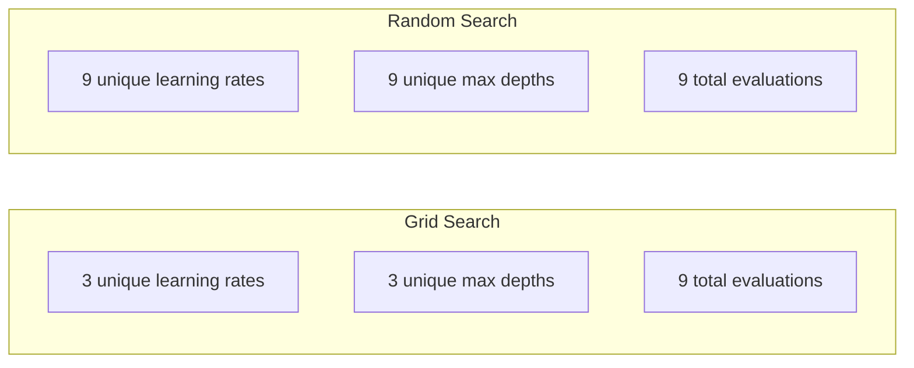
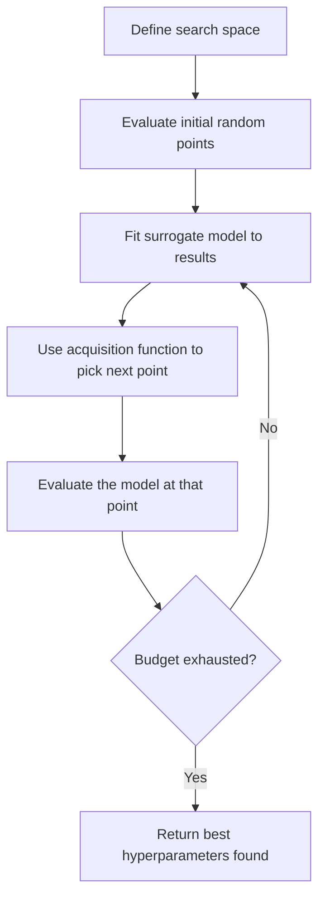
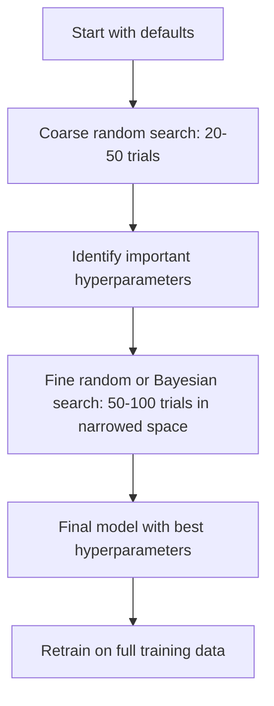
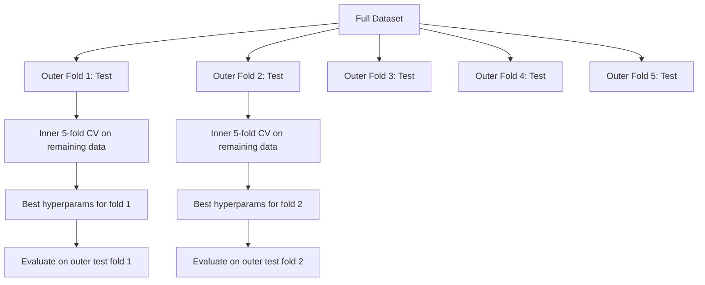

# El ajuste de los hiperparámetros

> Los hiperparámetros son los botones que se giran antes de comenzar el entrenamiento.

**Type:** Build
**Language:**Python
**Prerequisites:** Phase 2, Lesson 11 (Ensemble Methods)
**Time:** ~90 minutes

## Objetivos de aprendizaje

- Implemente la búsqueda en cuadrícula, la búsqueda aleatoria y la optimización bayesiana desde cero y compare su eficiencia de muestra
- Explica por qué la búsqueda aleatoria supera la búsqueda en cuadrícula cuando la mayoría de los hiperparámetros tienen una dimensionalidad efectiva baja
- Construir un bucle de optimización bayesiana utilizando un modelo sustituto y la función de adquisición para guiar la búsqueda
- Diseñar una estrategia de ajuste de hiperparámetros que evite el sobreajuste del conjunto de validación mediante una validación cruzada adecuada

## El problema

El modelo de aumento de gradiente tiene una tasa de aprendizaje, número de árboles, profundidad máxima, muestras min por hoja, ratio de submuestras y proporción de muestras de columnas. Eso es seis hiperparámetros. Si cada uno tiene 5 valores razonables, la cuadrícula tiene 5^6 = 15.625 combinaciones.

La búsqueda de red es el enfoque obvio y el peor a escala. La búsqueda aleatoria funciona mejor con menos computación. La optimización bayesiana funciona aún mejor aprendiendo de evaluaciones pasadas. Saber qué estrategia usar y qué hiperparámetros realmente importan, ahorra días de tiempo de GPU desperdiciado.

## El concepto

### Parámetros frente a hiperparámetros

Los parámetros se aprenden durante el entrenamiento (pesos, sesgos, umbrales divididos).

| Hyperparameter | What it controls | Typical range |
|---------------|-----------------|---------------|
| Learning rate | Step size per update | 0.001 to 1.0 |
| Number of trees/epochs | How long to train | 10 to 10,000 |
| Max depth | Model complexity | 1 to 30 |
| Regularization (lambda) | Overfitting prevention | 0.0001 to 100 |
| Batch size | Gradient estimation noise | 16 to 512 |
| Dropout rate | Fraction of neurons dropped | 0.0 to 0.5 |

### Buscar en la red

La búsqueda de red evalúa cada combinación de valores especificados. Es exhaustivo y fácil de entender, pero se escala exponencialmente con el número de hiperparámetros.

```
Grid for 2 hyperparameters:

  learning_rate: [0.01, 0.1, 1.0]
  max_depth:     [3, 5, 7]

  Evaluations: 3 x 3 = 9 combinations

  (0.01, 3)  (0.01, 5)  (0.01, 7)
  (0.1,  3)  (0.1,  5)  (0.1,  7)
  (1.0,  3)  (1.0,  5)  (1.0,  7)
```

La búsqueda de red tiene un defecto fundamental: si un hiperparámetro importa y el otro no, la mayoría de las evaluaciones se desperdician. Obtienes solo 3 valores únicos del parámetro importante de 9 evaluaciones.

### Buscar al azar

En la búsqueda aleatoria de muestras de hiperparámetros de distribuciones en lugar de una cuadrícula. con el mismo presupuesto de 9 evaluaciones, obtienes 9 valores únicos de cada hiperparámetro.



Por qué la red de la ventaja aleatoria (Bergstra & Bengio, 2012):

- La mayoría de los hiperparámetros tienen una dimensionalidad efectiva baja. Solo 1-2 de los 6 hiperparámetros suelen importar para un problema dado.
- Evaluación de residuos de búsqueda en red en dimensiones no importantes.
- La búsqueda aleatoria cubre las dimensiones importantes más densamente para el mismo presupuesto.
- En 60 ensayos aleatorios, tienes un 95% de posibilidades de encontrar un punto dentro del 5% del óptimo (si existe uno en el espacio de búsqueda).

### Optimización bayesiana

La búsqueda aleatoria ignora los resultados. No aprende que las altas tasas de aprendizaje causan divergencia o que la profundidad 3 supera consistentemente la profundidad 10. La optimización bayesiana utiliza evaluaciones pasadas para decidir dónde buscar a continuación.



Los dos componentes clave:

**Surrogate model:**Un modelo barato para evaluar (generalmente un proceso gaussiano) que se aproxima a la función objetiva costosa. Da tanto una predicción como una estimación de incertidumbre en cualquier punto del espacio de búsqueda.

**Acquisition function:**Decide dónde evaluar a continuación, equilibrando la explotación (buscar cerca de los puntos buenos conocidos) y la exploración (buscar donde la incertidumbre es alta).

- **Expected Improvement (EI):**¿Cuánta mejora en comparación con la mejor actual esperamos en este punto?
- **Upper Confidence Bound (UCB):**Una predicción más un múltiplo de incertidumbre.
- **Probability of Improvement (PI):**¿Cuál es la probabilidad de que este punto sea mejor que el actual?

La optimización bayesiana suele encontrar mejores hiperparámetros que la búsqueda aleatoria con 2-5 veces menos evaluaciones.

### Pararse temprano

No todas las carreras de entrenamiento necesitan terminar. Si una configuración es claramente mala después de 10 épocas, detenerlo y seguir adelante. Esto es detenerse temprano en el contexto de la búsqueda de hiperparámetros.

Estrategias:
- **Patience-based:**Detenerse si la pérdida de validación no ha mejorado durante N épocas consecutivas
- **Median pruning:**Detenerse si el resultado intermedio del ensayo es peor que la media de los ensayos completados en el mismo paso
- **Hyperband:**Asignar pequeños presupuestos a muchas configuraciones, luego aumentar progresivamente el presupuesto para los mejores

La hipervínculo es particularmente eficaz. Inicia 81 configuraciones con 1 época cada una, mantiene el tercio superior, les da 3 épocas, mantiene el tercio superior, etc. Esto encuentra buenas configuraciones 10-50 veces más rápido que evaluar todas las configuraciones para el presupuesto completo.

### Programadores de tasas de aprendizaje

La velocidad de aprendizaje es casi siempre el hiperparámetro más importante.

| Scheduler | Formula | When to use |
|-----------|---------|-------------|
| Step decay | Multiply by 0.1 every N epochs | Classic CNN training |
| Cosine annealing | lr * 0.5 * (1 + cos(pi * t / T)) | Modern default |
| Warmup + decay | Linear increase then cosine decay | Transformers |
| One-cycle | Increase then decrease over one cycle | Fast convergence |
| Reduce on plateau | Reduce by factor when metric stalls | Safe default |

### Importancia de los hiperparámetros

La investigación sobre bosques aleatorios (Probst et al., 2019) y el aumento de gradientes muestra patrones consistentes:

**High importance:**
- Rate de aprendizaje (siempre sintonizar primero)
- Número de estimadores/epopenas (utilice el detener temprano en lugar de ajustar)
- Fuerza de regularización

**Medium importance:**
- Profundidad máxima / número de capas
- Minimas muestras por hoja / desintegración de peso
- Proporción de submuestras

**Low importance:**
- Max características (para bosques aleatorios)
- Selección de la función de activación específica
- Tamaño del lote (dentro de un rango razonable)

Primero sintonice las importantes, deja el resto por defecto.

### Estrategia práctica



El flujo de trabajo concreto:

1. **Start with library defaults.**Son elegidos por profesionales experimentados y a menudo son el 80% del camino.
2. **Coarse random search.**Largos rangos, pruebas de 20 a 50 minutos, para matar a los malos, es rápido.
3. **Analyze results.**¿Qué hiperparámetros se correlacionan con el rendimiento?
4. **Fine search.**Optimización bayesiana o búsqueda aleatoria enfocada en el espacio estrecho. 50-100 ensayos.
5. **Retrain on all training data**con los mejores hiperparámetros encontrados.

### Integrar la validación cruzada

El ajuste de los hiperparámetros en una sola división de validación es arriesgado. Los mejores hiperparámetros pueden encajar en el pliegue de validación específico. La validación cruzada en cuclillas resuelve esto mediante el uso de dos bucles:

- **Outer loop**(evaluación): divide los datos en tren+val y prueba.
- **Inner loop**(ajuste): divide tren+val en tren y val. Encuentra los mejores hiperparámetros.



Cada pliegue exterior encuentra sus propios mejores hiperparámetros de forma independiente.

Con sklearn:

```python
from sklearn.model_selection import cross_val_score, GridSearchCV
from sklearn.ensemble import GradientBoostingRegressor

inner_cv = GridSearchCV(
    GradientBoostingRegressor(),
    param_grid={
        "learning_rate": [0.01, 0.05, 0.1],
        "max_depth": [2, 3, 5],
        "n_estimators": [50, 100, 200],
    },
    cv=5,
    scoring="neg_mean_squared_error",
)

outer_scores = cross_val_score(
    inner_cv, X, y, cv=5, scoring="neg_mean_squared_error"
)

print(f"Nested CV MSE: {-outer_scores.mean():.4f} +/- {outer_scores.std():.4f}")
```

Esto es caro (5 plegas exteriores x 5 plegas internas x 27 puntos de cuadrícula = 675 puntos de cuadrícula se ajusta al modelo), pero le da una estimación de rendimiento confiable.

### Consejos prácticos

**Start with the learning rate.**Es siempre el hiperparámetro más importante para los métodos basados en gradientes. Una mala tasa de aprendizaje hace que todo lo demás sea irrelevante.

**Use log-uniform distributions for learning rate and regularization.**La diferencia entre 0.001 y 0.01 es tan importante como la diferencia entre 0.1 y 1.0.

**Use early stopping instead of tuning n_estimators.**Para impulsar y redes neuronales, fije n_estimatores o épocas en alto y deje que la parada temprana decida cuándo parar.

**Budget allocation.**Gasta el 60% de tu presupuesto de sintonización en los dos hiperparámetros más importantes. Gasta el 40% restante en todo lo demás. Los dos primeros representan la mayor parte de la variación de rendimiento.

**Scale matters.**Nunca busque el tamaño del lote en una escala de registro (16, 32, 64 son buenas).

| Model Type | Top Hyperparameters | Recommended Search | Budget |
|-----------|--------------------|--------------------|--------|
| Random Forest | n_estimators, max_depth, min_samples_leaf | Random search, 50 trials | Low (fast training) |
| Gradient Boosting | learning_rate, n_estimators, max_depth | Bayesian, 100 trials + early stopping | Medium |
| Neural Network | learning_rate, weight_decay, batch_size | Bayesian or random, 100+ trials | High (slow training) |
| SVM | C, gamma (RBF kernel) | Grid on log scale, 25-50 trials | Low (2 params) |
| Lasso/Ridge | alpha | 1D search on log scale, 20 trials | Very low |
| XGBoost | learning_rate, max_depth, subsample, colsample | Bayesian, 100-200 trials + early stopping | Medium |

**When in doubt:**Buscar al azar con 2 veces el número de hiperparámetros como ensayos (por ejemplo, 6 hiperparámetros = 12 ensayos más mínimo).

```figure
k-fold-cv
```

## Construye el mismo

### Paso 1: Buscar desde cero

El código en `code/tuning.py`Implementa búsqueda en cuadrícula, búsqueda aleatoria y un simple optimizador bayesiano desde cero.

```python
def grid_search(model_fn, param_grid, X_train, y_train, X_val, y_val):
    keys = list(param_grid.keys())
    values = list(param_grid.values())
    best_score = -float("inf")
    best_params = None
    n_evals = 0

    for combo in itertools.product(*values):
        params = dict(zip(keys, combo))
        model = model_fn(**params)
        model.fit(X_train, y_train)
        score = evaluate(model, X_val, y_val)
        n_evals += 1

        if score > best_score:
            best_score = score
            best_params = params

    return best_params, best_score, n_evals
```

### Paso 2: Buscar al azar desde cero

```python
def random_search(model_fn, param_distributions, X_train, y_train,
                  X_val, y_val, n_iter=50, seed=42):
    rng = np.random.RandomState(seed)
    best_score = -float("inf")
    best_params = None

    for _ in range(n_iter):
        params = {k: sample(v, rng) for k, v in param_distributions.items()}
        model = model_fn(**params)
        model.fit(X_train, y_train)
        score = evaluate(model, X_val, y_val)

        if score > best_score:
            best_score = score
            best_params = params

    return best_params, best_score, n_iter
```

### Paso 3: Optimización bayesiana (simplificada)

La idea principal: ajustar un proceso gaussiano a pares observados (hiperparámetro, puntaje), luego usar una función de adquisición para decidir dónde buscar a continuación.

```python
class SimpleBayesianOptimizer:
    def __init__(self, search_space, n_initial=5):
        self.search_space = search_space
        self.n_initial = n_initial
        self.X_observed = []
        self.y_observed = []

    def _kernel(self, x1, x2, length_scale=1.0):
        dists = np.sum((x1[:, None, :] - x2[None, :, :]) ** 2, axis=2)
        return np.exp(-0.5 * dists / length_scale ** 2)

    def _fit_gp(self, X_new):
        X_obs = np.array(self.X_observed)
        y_obs = np.array(self.y_observed)
        y_mean = y_obs.mean()
        y_centered = y_obs - y_mean

        K = self._kernel(X_obs, X_obs) + 1e-4 * np.eye(len(X_obs))
        K_star = self._kernel(X_new, X_obs)

        L = np.linalg.cholesky(K)
        alpha = np.linalg.solve(L.T, np.linalg.solve(L, y_centered))
        mu = K_star @ alpha + y_mean

        v = np.linalg.solve(L, K_star.T)
        var = 1.0 - np.sum(v ** 2, axis=0)
        var = np.maximum(var, 1e-6)

        return mu, var

    def _expected_improvement(self, mu, var, best_y):
        sigma = np.sqrt(var)
        z = (mu - best_y) / (sigma + 1e-10)
        ei = sigma * (z * norm_cdf(z) + norm_pdf(z))
        return ei

    def suggest(self):
        if len(self.X_observed) < self.n_initial:
            return sample_random(self.search_space)

        candidates = [sample_random(self.search_space) for _ in range(500)]
        X_cand = np.array([to_vector(c) for c in candidates])
        mu, var = self._fit_gp(X_cand)
        ei = self._expected_improvement(mu, var, max(self.y_observed))
        return candidates[np.argmax(ei)]

    def observe(self, params, score):
        self.X_observed.append(to_vector(params))
        self.y_observed.append(score)
```

El GP sustitutivo da dos cosas en cada punto candidato: una puntuación prevista (mu) y una incertidumbre (var).

### Paso 4: Compara todos los métodos

Ejecutar los tres métodos en el mismo objetivo sintético y comparar. Esta comparación utiliza un envoltorio simplificado que llama a cada optimizador con una función objetivo directa (sin entrenamiento de modelo), por lo que la API difiere de las implementaciones basadas en modelos anteriores:

```python
def synthetic_objective(params):
    lr = params["learning_rate"]
    depth = params["max_depth"]
    return -(np.log10(lr) + 2) ** 2 - (depth - 4) ** 2 + 10

param_grid = {
    "learning_rate": [0.001, 0.01, 0.1, 1.0],
    "max_depth": [2, 3, 4, 5, 6, 7, 8],
}

grid_best = None
grid_score = -float("inf")
grid_history = []
for combo in itertools.product(*param_grid.values()):
    params = dict(zip(param_grid.keys(), combo))
    score = synthetic_objective(params)
    grid_history.append((params, score))
    if score > grid_score:
        grid_score = score
        grid_best = params

param_dist = {
    "learning_rate": ("log_float", 0.001, 1.0),
    "max_depth": ("int", 2, 8),
}

rand_best = None
rand_score = -float("inf")
rand_history = []
rng = np.random.RandomState(42)
for _ in range(28):
    params = {k: sample(v, rng) for k, v in param_dist.items()}
    score = synthetic_objective(params)
    rand_history.append((params, score))
    if score > rand_score:
        rand_score = score
        rand_best = params

optimizer = SimpleBayesianOptimizer(param_dist, n_initial=5)
bayes_history = []
for _ in range(28):
    params = optimizer.suggest()
    score = synthetic_objective(params)
    optimizer.observe(params, score)
    bayes_history.append((params, score))
bayes_score = max(s for _, s in bayes_history)

print(f"{'Method':<20} {'Best Score':>12} {'Evaluations':>12}")
print("-" * 50)
print(f"{'Grid Search':<20} {grid_score:>12.4f} {len(grid_history):>12}")
print(f"{'Random Search':<20} {rand_score:>12.4f} {len(rand_history):>12}")
print(f"{'Bayesian Opt':<20} {bayes_score:>12.4f} {len(bayes_history):>12}")
```

Con el mismo presupuesto, la optimización bayesiana suele encontrar la mejor puntuación más rápido porque no desperdicia evaluaciones en regiones claramente malas. La búsqueda aleatoria cubre más terreno que la búsqueda en la cuadrícula. La búsqueda en la cuadrícula solo gana cuando tienes muy pocos hiperparámetros y puedes permitirte ser exhaustivo.

## Usalo

### Optuna en práctica

Optuna es la biblioteca recomendada para el ajuste serio de hiperparámetros.

```python
import optuna

def objective(trial):
    lr = trial.suggest_float("learning_rate", 1e-4, 1e-1, log=True)
    n_est = trial.suggest_int("n_estimators", 50, 500)
    max_depth = trial.suggest_int("max_depth", 2, 10)

    model = GradientBoostingRegressor(
        learning_rate=lr,
        n_estimators=n_est,
        max_depth=max_depth,
    )
    model.fit(X_train, y_train)
    return mean_squared_error(y_val, model.predict(X_val))

study = optuna.create_study(direction="minimize")
study.optimize(objective, n_trials=100)

print(f"Best params: {study.best_params}")
print(f"Best MSE: {study.best_value:.4f}")
```

Las características clave de Optuna:
- `suggest_float(..., log=True)`para los parámetros mejor buscados en la escala de registro (tiempo de aprendizaje, regularización)
- `suggest_int`para parámetros de números enteros
- `suggest_categorical`para opciones discretas
- MedianPruner incorporado para detener temprano los malos ensayos
- `study.trials_dataframe()`para análisis

### Optuna con poda

La poda detiene los ensayos poco prometedores temprano, ahorrando un cálculo masivo.

```python
import optuna
from sklearn.model_selection import cross_val_score

def objective(trial):
    params = {
        "learning_rate": trial.suggest_float("lr", 1e-4, 0.5, log=True),
        "max_depth": trial.suggest_int("max_depth", 2, 10),
        "n_estimators": trial.suggest_int("n_estimators", 50, 500),
        "subsample": trial.suggest_float("subsample", 0.5, 1.0),
    }

    model = GradientBoostingRegressor(**params)
    scores = cross_val_score(model, X_train, y_train, cv=3,
                             scoring="neg_mean_squared_error")
    mean_score = -scores.mean()

    trial.report(mean_score, step=0)
    if trial.should_prune():
        raise optuna.TrialPruned()

    return mean_score

pruner = optuna.pruners.MedianPruner(n_startup_trials=10, n_warmup_steps=5)
study = optuna.create_study(direction="minimize", pruner=pruner)
study.optimize(objective, n_trials=200)
```

El `MedianPruner`El método de corte de la prueba de corte de la prueba de corte de corte de corte de corte de corte de corte de corte de corte de corte de corte de corte de corte de corte de corte de corte de corte de corte de corte de corte de corte de corte de corte de corte de corte de corte de corte de corte de corte de corte de corte de corte de corte de corte de corte de corte de corte de corte de corte de corte de corte de corte de corte de corte de corte de corte de corte de corte de corte de corte de corte de corte de corte de corte de corte de corte de corte de corte de corte de corte de corte de corte de corte de corte de corte de corte de corte de corte de corte de corte de corte de corte de corte de corte de corte de corte de corte de corte de corte de corte de corte de corte de corte de corte de corte de corte de corte de corte de corte de corte de corte de corte de corte de corte de corte de corte de corte de corte de corte de corte de corte de corte de corte de corte de corte de corte de corte de corte de corte de corte de corte de corte de corte de corte de corte de corte de corte de corte de corte de corte de corte de corte de corte de corte de corte de corte de corte de corte de corte de corte de corte de corte de corte de corte de corte de corte de corte de corte de corte de corte de corte de corte de corte de corte de corte de corte de corte de corte de corte de corte de corte de corte de corte de corte de corte de corte de corte de corte de corte de corte de corte de corte de corte de corte de corte de corte de corte de corte de corte de corte de corte de corte de corte de corte de corte de corte de corte de corte de corte de corte de corte de corte de corte de corte de corte de corte de corte de corte de corte de corte de corte de corte de corte de corte de corte de corte de corte de corte de corte de corte de corte de corte de corte de corte de corte de corte de corte de corte de corte de corte de corte de corte de corte de corte de corte de corte de corte de corte de corte de corte de corte de corte de corte de corte de corte de corte de corte de corte de corte de corte de corte de corte de corte de corte de corte de corte de corte de corte de corte de corte de corte de corte de corte de corte de corte de corte de corte de corte de corte de corte`trial.report()`para informar de las métricas intermedias y `trial.should_prune()`El Consejo de Ministros de la Unión Europea ha aprobado la resolución de la Comisión de`n_startup_trials=10`El sistema de recarga de la carga de la máquina de recarga de la máquina de recarga de la máquina de recarga de la máquina de recarga de la máquina de recarga de la máquina de recarga de la máquina de recarga de la máquina de recarga de la máquina de recarga de la máquina de recarga de la máquina de recarga de la máquina de recarga de la máquina de recarga de la máquina de recarga de la máquina de recarga de la máquina de recarga de la máquina de recarga de la máquina de recarga de la máquina de recarga de la máquina de recarga de la máquina de recarga de la máquina de recarga de la máquina de recarga de recarga de la máquina de recarga de recarga de la máquina de recarga de recarga de la máquina de recarga de recarga de la máquina de recarga de recarga de la máquina de recarga de recarga de la máquina de recarga de recarga de recarga de la máquina de recarga de recarga de recarga de la máquina de recarga de recarga de recarga de recarga de la máquina de recarga de recarga de recarga de recarga de la máquina de recarga de recarga de recarga de recarga de recarga de la máquina de recarga de recarga de recarga de recarga de recarga de recarga de la máquina de recarga de recarga de recarga de recarga de recarga de recarga de la máquina de recarga de recarga de recarga de correación de correación de correación de correación de correación de correación de correación de 40 a correación de 40 a 40 a 40 por cuento de 40 por un mínimo de 40 por un mínimo de 40 por un tiempo.

### Los Tuners incorporados de sklearn

Para experimentos rápidos, sklearn proporciona `GridSearchCV`¿ Qué ?`RandomizedSearchCV`, y `HalvingRandomSearchCV`¿Qué es esto ?

```python
from sklearn.model_selection import RandomizedSearchCV
from scipy.stats import loguniform, randint

param_dist = {
    "learning_rate": loguniform(1e-4, 0.5),
    "max_depth": randint(2, 10),
    "n_estimators": randint(50, 500),
}

search = RandomizedSearchCV(
    GradientBoostingRegressor(),
    param_dist,
    n_iter=100,
    cv=5,
    scoring="neg_mean_squared_error",
    random_state=42,
    n_jobs=-1,
)
search.fit(X_train, y_train)
print(f"Best params: {search.best_params_}")
print(f"Best CV MSE: {-search.best_score_:.4f}")
```

Usar`loguniform`La formación de los estudiantes en el aprendizaje y la regularización.`randint`para los hiperparámetros de números enteros.`n_jobs=-1`bandera se paralela a través de todos los núcleos de CPU.

### Errores comunes en el ajuste de hiperparámetros

**Data leakage through preprocessing.**Si se instala un escalador en el conjunto completo de datos antes de la validación cruzada, la información del pliegue de validación se filtra en el entrenamiento.`Pipeline`Así que sólo se adapta al pliegue de entrenamiento.

**Overfitting to the validation set.**El ejecutar miles de pruebas se entrena efectivamente en el conjunto de validación.

**Searching too narrow a range.**Si su mejor valor está en el límite de su espacio de búsqueda, no ha buscado lo suficiente. El valor óptimo puede estar fuera de su rango.

**Ignoring interaction effects.**La tasa de aprendizaje y el número de estimadores interactúan fuertemente en el impulso.

**Not using early stopping for iterative models.**Para aumentar el gradiente y las redes neuronales, ajuste n_estimatores o épocas a un valor alto y use detener temprano. Esto es estrictamente mejor que sintonizar el número de iteraciones como un hiperparámetro.

## Los ejercicios

1. Realice búsqueda en cuadrícula y búsqueda aleatoria con el mismo presupuesto total (por ejemplo, 50 evaluaciones). Compara las mejores puntuaciones encontradas. Realice el experimento 10 veces con diferentes semillas. ¿Con qué frecuencia gana la búsqueda aleatoria?

2. Implemente Hyperband desde cero. Comience con 81 configuraciones, cada una entrenada durante 1 época. Mantenga el 1/3 superior en cada ronda y triplica su presupuesto. Compara la computación total (suma de todas las épocas en todas las configuraciones) con la ejecución de 81 configuraciones para el presupuesto completo.

3. Añadir un cronómetro de la tasa de aprendizaje (anulación de cosinas) a la aplicación de los gradientes de la Lección 11. ¿Es útil en comparación con una tasa de aprendizaje fija?

4. Utilice Optuna para sintonizar un clasificador RandomForest en un conjunto de datos real (por ejemplo, el conjunto de datos sobre cáncer de mama de sklearn).`optuna.visualization.plot_param_importances(study)`¿Es igual al ranking de importancia de esta lección?

5. Implementar una función de adquisición simple (Mejora esperada) y demostrar exploración frente a explotación. Trazar la media e incertidumbre del modelo sustituto, y mostrar dónde EI elige evaluar a continuación.

## Términos clave

| Term | What people say | What it actually means |
|------|----------------|----------------------|
| Hyperparameter | "A setting you choose" | A value set before training that controls the learning process, not learned from data |
| Grid search | "Try every combination" | Exhaustive search over a specified parameter grid. Exponential cost. |
| Random search | "Just sample randomly" | Sample hyperparameters from distributions. Covers important dimensions better than grid search. |
| Bayesian optimization | "Smart search" | Uses a surrogate model of the objective to decide where to evaluate next, balancing exploration and exploitation |
| Surrogate model | "A cheap approximation" | A model (usually Gaussian process) that approximates the expensive objective function from observed evaluations |
| Acquisition function | "Where to look next" | Scores candidate points by balancing expected improvement with uncertainty. EI and UCB are common choices. |
| Early stopping | "Stop wasting time" | Terminate training early when validation performance stops improving |
| Hyperband | "Tournament bracket for configs" | Adaptive resource allocation: start many configs with small budgets, keep the best and increase their budgets |
| Learning rate scheduler | "Change lr during training" | A function that adjusts the learning rate over the course of training for better convergence |

## Leer más

- [Bergstra & Bengio: Random Search for Hyper-Parameter Optimization (2012)](https://jmlr.org/papers/v13/bergstra12a.html)-- el periódico que mostró la cuadrícula de latidos aleatorios
- [Snoek et al., Practical Bayesian Optimization of Machine Learning Algorithms (2012)](https://arxiv.org/abs/1206.2944)-- Optimización bayesiana para ML
- [Li et al., Hyperband: A Novel Bandit-Based Approach (2018)](https://jmlr.org/papers/v18/16-558.html)-- el papel de banda hiper
- [Optuna: A Next-generation Hyperparameter Optimization Framework](https://arxiv.org/abs/1907.10902)- el periódico Optuna
- [Probst et al., Tunability: Importance of Hyperparameters (2019)](https://jmlr.org/papers/v20/18-444.html)-- cuáles son los hiperparámetros que importan
