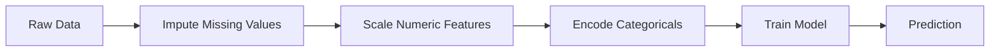
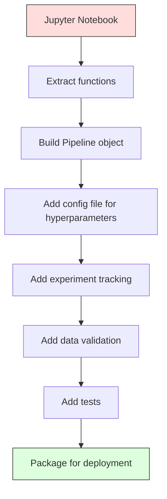

# Líneas de tuberías ML

> Un modelo no es un producto, un pipeline es. El pipeline es todo, desde datos en bruto hasta predicción desplegada, y cada paso debe ser reproducible.

**Type:** Build
**Language:**Python
**Prerequisites:** Phase 2, Lesson 12 (Hyperparameter Tuning)
**Time:** ~120 minutes

## Objetivos de aprendizaje

- Construir una tubería de ML desde cero que enlace la imputación, la escala, la codificación y el entrenamiento de modelos en un solo objeto reproducible
- Identificar escenarios de fuga de datos y explicar cómo las tuberías los evitan mediante la instalación de transformadores únicamente en datos de formación
- Construir un ColumnTransformer que aplique diferentes preprocesamiento a las características numéricas y categoricas
- Implementar la serialización de la tubería y demostrar que la misma tubería instalada produce resultados idénticos en formación y producción

## El problema

Tienes un cuaderno que carga datos, llena los valores faltantes con la media, escasa las características, prepara un modelo y imprime la precisión. Funciona. Lo envías.

Un mes después, alguien reentrenó el modelo y obtuvo resultados diferentes. La mediana se calculó en el conjunto completo de datos, incluidos los datos de ensayo (fuente de datos). Los parámetros de escala no se guardaron, por lo que la inferencia utiliza estadísticas diferentes. El código de ingeniería de características fue copiado y pegado entre la formación y el servicio, y las copias divergieron. Una columna categórica ganó un nuevo valor en producción que el codificador nunca ha visto.

Las tuberías las resuelven envasando cada paso de transformación en un único objeto ordenado y reproducible.

## El concepto

### Qué es un oleoducto

Una tubería es una secuencia ordenada de transformaciones de datos seguidas de un modelo. Cada paso toma la salida de la etapa anterior como entrada. Toda la tubería se instala una vez en los datos de entrenamiento. En el momento de la inferencia, la misma tubería equipada transforma nuevos datos y produce predicciones.



El gasoducto garantiza:
- Las transformaciones se instalarán únicamente sobre datos de formación (sin fugas)
- Las mismas transformaciones se aplican en el momento de la inferencia
- Todo el objeto puede ser serializado y desplegado como un artefacto
- La validación cruzada aplica el oleoducto por pliegue, evitando fugas sutiles

### Fugas de datos: El asesino silencioso

Las filtraciones de datos ocurren cuando la información del conjunto de pruebas o los datos futuros contaminan el entrenamiento.

**Leaky (wrong):**
```python
X = df.drop("target", axis=1)
y = df["target"]

scaler = StandardScaler()
X_scaled = scaler.fit_transform(X)

X_train, X_test = X_scaled[:800], X_scaled[800:]
y_train, y_test = y[:800], y[800:]
```

El escalador vio los datos de prueba. La media y la desviación estándar incluyen muestras de prueba. Esto infla las estimaciones de precisión.

**Correct:**
```python
X_train, X_test = X[:800], X[800:]

scaler = StandardScaler()
X_train_scaled = scaler.fit_transform(X_train)
X_test_scaled = scaler.transform(X_test)
```

Con un oleoducto, no hay que pensar en esto.

### Especialización de la producción de gas

El de sklearn `Pipeline`La tecnología de la cadena de transformación y un estimador.`.fit()`¿ Qué ?`.predict()`, y `.score()`que aplican todos los pasos en orden.

```python
from sklearn.pipeline import Pipeline
from sklearn.preprocessing import StandardScaler
from sklearn.linear_model import LogisticRegression

pipe = Pipeline([
    ("scaler", StandardScaler()),
    ("model", LogisticRegression()),
])

pipe.fit(X_train, y_train)
predictions = pipe.predict(X_test)
```

Cuando llames .`pipe.fit(X_train, y_train)`¿Qué es esto ?
1. Las llamadas de escalado .`fit_transform`En el tren X
2. Modelo de llamadas `fit`en el tren X_escalado

Cuando llames .`pipe.predict(X_test)`¿Qué es esto ?
1. Las llamadas de escalado .`transform`(no se adapta_transform) en X_test
2. Modelo de llamadas `predict`en el test X_test a escala

El escalador nunca ve los datos de prueba durante el montaje.

### ColumnaTransformer: diferentes tuberías para diferentes columnas

Los conjuntos de datos reales tienen columnas numéricas y categoricas que requieren un procesamiento previo diferente. `ColumnTransformer`maneja esto.

```python
from sklearn.compose import ColumnTransformer
from sklearn.preprocessing import StandardScaler, OneHotEncoder
from sklearn.impute import SimpleImputer

numeric_pipe = Pipeline([
    ("impute", SimpleImputer(strategy="median")),
    ("scale", StandardScaler()),
])

categorical_pipe = Pipeline([
    ("impute", SimpleImputer(strategy="most_frequent")),
    ("encode", OneHotEncoder(handle_unknown="ignore")),
])

preprocessor = ColumnTransformer([
    ("num", numeric_pipe, ["age", "income", "score"]),
    ("cat", categorical_pipe, ["city", "gender", "plan"]),
])

full_pipeline = Pipeline([
    ("preprocess", preprocessor),
    ("model", GradientBoostingClassifier()),
])
```

El `handle_unknown="ignore"`En OneHotEncoder es crítico para la producción. Cuando aparece una nueva categoría (una ciudad que el modelo nunca ha visto), produce un vector cero en lugar de estrellarse.

### El seguimiento de los experimentos

Una línea de tuberías hace que el entrenamiento sea reproducible, pero también necesitas rastrear lo que sucedió en los experimentos: qué hiperparámetros se utilizaron, qué versión del conjunto de datos, cuáles fueron las métricas, qué código se ejecutaba.

**MLflow**es la solución de código abierto más común:

```python
import mlflow

with mlflow.start_run():
    mlflow.log_param("max_depth", 5)
    mlflow.log_param("n_estimators", 100)
    mlflow.log_param("learning_rate", 0.1)

    pipe.fit(X_train, y_train)
    accuracy = pipe.score(X_test, y_test)

    mlflow.log_metric("accuracy", accuracy)
    mlflow.sklearn.log_model(pipe, "model")
```

Cada ejecución se registra con parámetros, métricas, artefactos y el modelo completo.

**Weights & Biases (wandb)**proporciona la misma funcionalidad con un panel de control alojado:

```python
import wandb

wandb.init(project="my-pipeline")
wandb.config.update({"max_depth": 5, "n_estimators": 100})

pipe.fit(X_train, y_train)
accuracy = pipe.score(X_test, y_test)

wandb.log({"accuracy": accuracy})
```

### Modelo de versión

Después de realizar el seguimiento de los experimentos, se necesita gestionar las versiones del modelo. ¿Qué modelo está en producción? ¿Cuál está en escena? ¿Cuál fue la semana pasada?

El Registro Modelo de MLflow proporciona:
- **Version tracking:**Cada modelo guardado obtiene un número de versión
- **Stage transitions:**"Enscenamiento", "Produción", "Archivo"
- **Approval workflow:**Los modelos deben ser explícitamente promovidos a la producción
- **Rollback:**Vuelve a una versión anterior al instante

### Versión de datos con DVC

El código se versionó con git. Los datos también deben ser versionados, pero git no puede manejar archivos grandes.

```
dvc init
dvc add data/training.csv
git add data/training.csv.dvc data/.gitignore
git commit -m "Track training data"
dvc push
```

DVC almacena los datos reales en almacenamiento remoto (S3, GCS, Azure) y mantiene un pequeño `.dvc`Cuando comprobas un comit de git,`dvc checkout`restaura los datos exactos que se usaron.

Esto significa que cada git comite pines tanto el código como los datos.

### Experimentos reproducibles

Un experimento reproducible requiere cuatro cosas:

1. **Fixed random seeds:**Se establece semillas para la numpy, aleatoria y el marco (torcha, sklearn)
2. **Pinned dependencies:**requisites.txt o poetry.lock con versiones exactas
3. **Versioned data:**DVC o similares
4. **Config files:**Todos los hiperparámetros en una configuración, no codificados en formato duro

```python
import numpy as np
import random

def set_seed(seed=42):
    random.seed(seed)
    np.random.seed(seed)
    try:
        import torch
        torch.manual_seed(seed)
        torch.cuda.manual_seed_all(seed)
        torch.backends.cudnn.deterministic = True
    except ImportError:
        pass
```

### De la libreta a la producción



La progresión típica:

1. **Notebook exploration:**Experimentos rápidos, visualizaciones, ideas de características
2. **Extract functions:**Mover el preprocesamiento, la ingeniería de características, la evaluación en módulos
3. **Build Pipeline:**Transformaciones de la cadena en una clase de tuberías de sklearn o de tipo personalizado
4. **Config management:**Mover todos los hiperparámetros en una configuración YAML/JSON
5. **Experiment tracking:**Añadir el registro de MLflow o de la vara
6. **Data validation:**Compruebe esquemas, distribuciones y patrones de valores faltantes antes de entrenar
7. **Tests:**Pruebas de unidad para transformadores, pruebas de integración para toda la tubería
8. **Deployment:**Serializa la tubería, envuelve en una API (FastAPI, Flask), conteneriza

### Errores comunes en el oleoducto

| Mistake | Why it is bad | Fix |
|---------|-------------|-----|
| Fitting on full data before splitting | Data leakage | Use Pipeline with cross_val_score |
| Feature engineering outside pipeline | Different transforms at train vs serve | Put all transforms in the Pipeline |
| Not handling unknown categories | Production crash on new values | OneHotEncoder(handle_unknown="ignore") |
| Hardcoded column names | Breaks when schema changes | Use column name lists from config |
| No data validation | Silently wrong predictions on bad data | Add schema checks before prediction |
| Training/serving skew | Model sees different features in prod | One Pipeline object for both |

```figure
f3-pipeline-flow
```

## Construye el mismo

El código en `code/pipeline.py`construye una tubería ML completa desde cero:

### Paso 1: Transformador personalizado

```python
class CustomTransformer:
    def __init__(self):
        self.means = None
        self.stds = None

    def fit(self, X):
        self.means = np.mean(X, axis=0)
        self.stds = np.std(X, axis=0)
        self.stds[self.stds == 0] = 1.0
        return self

    def transform(self, X):
        return (X - self.means) / self.stds

    def fit_transform(self, X):
        return self.fit(X).transform(X)
```

### Paso 2: Pipeline desde cero

```python
class PipelineFromScratch:
    def __init__(self, steps):
        self.steps = steps

    def fit(self, X, y=None):
        X_current = X.copy()
        for name, step in self.steps[:-1]:
            X_current = step.fit_transform(X_current)
        name, model = self.steps[-1]
        model.fit(X_current, y)
        return self

    def predict(self, X):
        X_current = X.copy()
        for name, step in self.steps[:-1]:
            X_current = step.transform(X_current)
        name, model = self.steps[-1]
        return model.predict(X_current)
```

### Paso 3: Validación cruzada con tubería

El código demuestra cómo la validación cruzada con una tubería evita la fuga de datos: el escalador se instala por separado en los datos de entrenamiento de cada pliegue.

### Paso 4: Pipeline de producción completa con sklearn

Un gasoducto completo con `ColumnTransformer`, múltiples caminos de preprocesamiento, y un modelo, entrenado con la validación cruzada adecuada y la registro de experimentos.

## Envío

Esta lección produce:
- `outputs/prompt-ml-pipeline.md`-- habilidad para construir y deshacer las tuberías de ML
- `code/pipeline.py`-- un oleoducto completo desde cero a través de sklearn

## Los ejercicios

1. Construir una línea de tubería que maneje un conjunto de datos con 3 columnas numéricas y 2 columnas categoricas.`ColumnTransformer`Para aplicar la imputación mediana + escalación a las numéricas y la imputación más frecuente + codificación de un solo calor a las categorías.

2. Introducir deliberadamente una fuga de datos: ajustar el escalador en el conjunto completo de datos antes de dividir. Comparar el puntaje de validación cruzada (que se filtró) con el puntaje de validación cruzada de la tubería (limpio). ¿Cuál es la diferencia?

3. Serializa tu oleoducto con `joblib.dump`Lo cargue en un guión separado y ejecute predicciones.

4. Añadir un transformador personalizado a la tubería que crea características polinómicas (grado 2) para las dos columnas numéricas más importantes. ¿Dónde debe ir en la tubería?

5. Configurar el seguimiento de flujo de ML para la tubería. ejecutar 5 experimentos con diferentes hiperparámetros.`mlflow ui`) para comparar las carreras y elegir el mejor modelo.

## Términos clave

| Term | What people say | What it actually means |
|------|----------------|----------------------|
| Pipeline | "Chain of transforms + model" | An ordered sequence of fitted transformers and a model, applied as one unit to prevent leakage |
| Data leakage | "Test info leaked into training" | Using information from outside the training set to build the model, inflating performance estimates |
| ColumnTransformer | "Different preprocessing per column" | Applies different pipelines to different subsets of columns, combining results |
| Experiment tracking | "Logging your runs" | Recording parameters, metrics, artifacts, and code versions for every training run |
| MLflow | "Track and deploy models" | Open-source platform for experiment tracking, model registry, and deployment |
| DVC | "Git for data" | Version control system for large data files, storing hashes in git and data in remote storage |
| Model registry | "Model version catalog" | A system that tracks model versions with stage labels (staging, production, archived) |
| Training/serving skew | "It worked in the notebook" | Differences between how data is processed during training versus inference, causing silent errors |
| Reproducibility | "Same code, same result" | The ability to get identical results from the same code, data, and configuration |

## Leer más

- [scikit-learn Pipeline docs](https://scikit-learn.org/stable/modules/compose.html)-- la referencia oficial de la tubería
- [MLflow documentation](https://mlflow.org/docs/latest/index.html)-- seguimiento de experimentos y registro de modelos
- [DVC documentation](https://dvc.org/doc)-- versión de datos
- [Sculley et al., Hidden Technical Debt in Machine Learning Systems (2015)](https://papers.nips.cc/paper/2015/hash/86df7dcfd896fcaf2674f757a2463eba-Abstract.html)-- el documento de referencia sobre la complejidad de los sistemas ML
- [Google ML Best Practices: Rules of ML](https://developers.google.com/machine-learning/guides/rules-of-ml)-- asesoramiento práctico en materia de producción de ML
