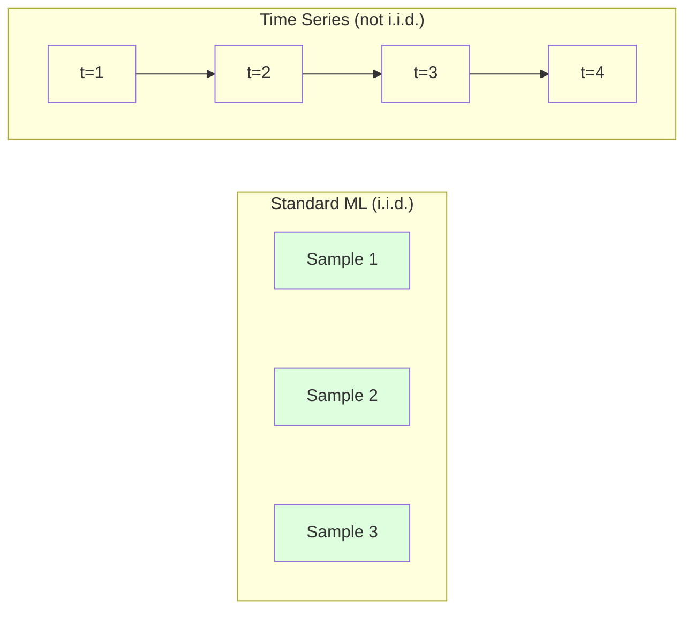
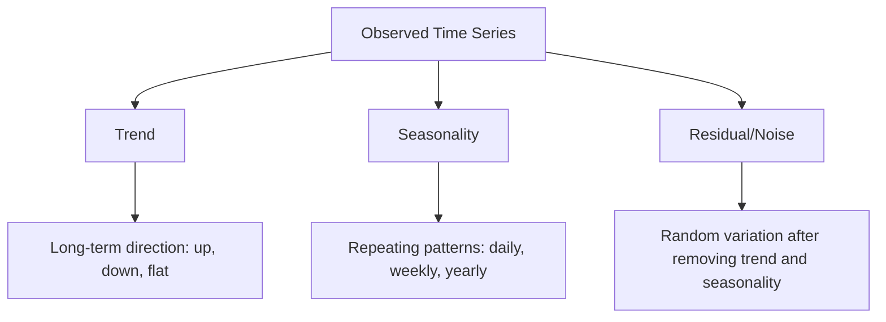
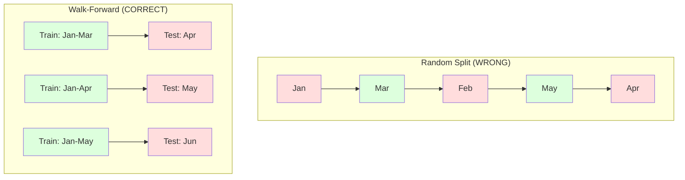

# Fundamentos de la serie temporal

> El rendimiento pasado predice resultados futuros si primero comprueba la estacionalidad.

**Type:** Build
**Language:**Python
**Prerequisites:** Phase 2, Lessons 01-09
**Time:** ~90 minutes

## Objetivos de aprendizaje

- Descompone una serie de tiempos en componentes de tendencia, estacionalidad y residuos y prueba de estacionalidad
- Implementar características de retraso y estadísticas de rodaje para convertir una serie temporal en un problema de aprendizaje supervisado
- Construir un marco de validación avanzada que impida que los datos futuros se filtren en la formación
- Explicar por qué las divisiones aleatorias de tren/prueba son inválidas para las series temporales y demostrar la brecha de rendimiento frente a las divisiones temporales adecuadas

## El problema

Tienes datos ordenados por tiempo, ventas diarias, temperatura por hora, uso de CPU por minuto, precios semanales de las acciones.

Busca tu conjunto de herramientas estándar de ML: tren aleatorio/dividir la prueba, validación cruzada, matriz de características, predicción. Cada paso es incorrecto.

La serie temporal rompe las suposiciones de que se basa el ML estándar. Las muestras no son independientes - la temperatura de hoy depende de la de ayer. Las particiones aleatorias filtran información futura al pasado. Las características que se ven bien en las pruebas posteriores fallan en la producción porque dependen de patrones que cambian con el tiempo.

Un modelo que obtiene una precisión del 95% con validación cruzada aleatoria puede obtener un 55% con una evaluación adecuada basada en el tiempo. La diferencia no es una tecnicismo. Es la diferencia entre un modelo que funciona en papel y uno que funciona en producción.

Esta lección cubre los fundamentos: lo que hace que los datos de tiempo sean diferentes, cómo evaluar los modelos honestamente y cómo convertir una serie de tiempos en características que los modelos estándar de ML pueden consumir.

## El concepto

### ¿Qué hace que la serie de tiempo sea diferente?

El ML estándar asume i.i.d. - independiente e idénticamente distribuido. Cada muestra se extrae de la misma distribución, independientemente de otras muestras.

- **Not independent.**El precio de las acciones de hoy depende de los de ayer. Las ventas de esta semana se correlacionan con las de la semana pasada.
- **Not identically distributed.**Las ventas en diciembre se ven diferentes de las ventas en marzo.

Estas violaciones no son menores, cambian la forma en que se construyen las características, cómo se evalúan los modelos y qué algoritmos funcionan.



En el ML estándar, las muestras son intercambiables. Mezclarlas no cambia nada. En la serie temporal, el orden es todo.

### Componentes de una serie temporal

Cada serie de tiempos es una combinación de:



- **Trend**La dirección a largo plazo: ingresos crecientes del 10% al año, temperatura global en aumento.
- **Seasonality**El consumo de aire acondicionado alcanza su punto máximo en julio.
- **Residual**Si el residuo parece ruido blanco, la descomposición captura la señal.

### Estacionariedad

Una serie temporal es estacionaria si sus propiedades estadísticas (mediana, varianza, autocorrelación) no cambian con el tiempo.

**Why it matters:**Una serie no estacionaria tiene un medio que deriva. Un modelo entrenado en datos de enero ha aprendido un medio diferente a lo que mostrará febrero.

**How to check:**Calcule la media de rodamiento y la desviación estándar de rodamiento sobre las ventanas.

**How to fix:**Diferenciar. En lugar de modelar los valores en bruto, modelar el cambio entre los valores consecutivos:

```
diff[t] = value[t] - value[t-1]
```

Si una ronda de diferenciación no hace que la serie se quede estacionaria, aplicarla de nuevo (diferenciación de segundo orden).

**Example:**

Serie original: [100, 102, 106, 112, 120]
Primera diferencia: [2, 4, 6, 8] (todavía tendencia hacia arriba)
Segunda diferencia: [2, 2, 2] (constante -- estacionario)

La serie original tenía una tendencia cuadrática. la primera diferenciación la convirtió en una tendencia lineal. la segunda diferenciación la hizo plana. en la práctica, rara vez se necesitan más de dos rondas.

**Formal test:**El test de Dickey-Fuller (ADF) aumentado es la prueba estadística estándar para la estacionalidad. La hipótesis nula es "la serie no es estacionaria". Un valor p por debajo de 0.05 significa que se puede rechazar la nula y concluir la estacionalidad. No implementamos ADF desde cero (requiere tablas de distribución asimptoticas), pero el enfoque de estadística de rodadura en nuestro código da una verificación visual práctica.

### Autocorrelación

La autocorrelación mide cuánto un valor en el tiempo t se correlaciona con el valor en el tiempo t-k (pasos k en el pasado).

**ACF tells you:**
- Si el ACF cae a cero después del lag 5, los valores de hace más de 5 pasos son irrelevantes.
- Si el ACF aumenta en un atraso de 12 (datos mensuales), hay una estacionalidad anual.
- Cuántas características de retraso crear.

**PACF (Partial Autocorrelation Function)**Si hoy correlaciona con 3 días atrás sólo porque ambos correlacionan con ayer, el PACF en el lag 3 será cero mientras que el ACF en el lag 3 no lo será.

### Las características de Lag: convertir la serie de tiempo en aprendizaje supervisado

Los modelos estándar de ML necesitan una matriz de características X y una matriz de objetivo y. La serie temporal le da una sola columna de valores.

Tomar la serie [10, 12, 14, 13, 15] y crear las características lag-1 y lag-2:

| lag_2 | lag_1 | target |
|-------|-------|--------|
| 10    | 12    | 14     |
| 12    | 14    | 13     |
| 14    | 13    | 15     |

Ahora tienes un problema de regresión estándar. Cualquier modelo de ML (regresión lineal, bosque aleatorio, aumento de gradiente) puede predecir el objetivo a partir de los retrasos.

Las características adicionales que puede diseñar:
- **Rolling statistics:**media, std, min, max sobre los últimos valores k
- **Calendar features:**día de la semana, mes, es_feria, es_fin de semana
- **Differenced values:**cambio respecto a la etapa anterior
- **Expanding statistics:**media acumulada, suma acumulada
- **Ratio features:**valor actual / media de movimiento (que distancia del promedio reciente)
- **Interaction features:**1 * día de la semana (efectos de los días de la semana en el impulso)

**How many lags?**Utilice la función de autocorrelación. Si el ACF es significativo hasta 10 lag, use al menos 10 lags. Si hay estacionalidad semanal, incluya 7 lags (y posiblemente 14).

**The target alignment trap.**Cuando se crean características de lag, el objetivo debe ser el valor en el tiempo t, y todas las características deben usar valores en el tiempo t-1 o antes. Si accidentalmente incluye el valor en el tiempo t como una característica, tiene un predictor perfecto y un modelo completamente inútil. Este es el error más común en la ingeniería de características de la serie temporal.

### Validación de la marcha hacia adelante

Esta es la idea más importante de esta lección. La validación cruzada estándar de k-fold asigna muestras al azar para entrenar y probar.



Validación previa:
1. Entraen en datos hasta el tiempo t
2. Prever en el tiempo t+1 (o t+1 a t+k para múltiples pasos)
3. Desliza la ventana hacia adelante
4. Repite

Cada pieza de prueba contiene sólo datos que vienen después de todos los datos de entrenamiento. No hay fugas futuras. Esto le da una estimación honesta de cómo funcionará el modelo cuando se despliegue.

**Expanding window**utiliza todos los datos históricos para la formación (crece la ventana). **Sliding window**Utiliza el deslizamiento cuando cree que los datos más antiguos siguen siendo relevantes. Utiliza el deslizamiento cuando el mundo cambia y los datos viejos hacen daño.

### Intuición de ARIMA

ARIMA es el modelo clásico de la serie de tiempo.

- **AR (Autoregressive):**Prevé a partir de valores anteriores. AR(p) utiliza los últimos valores p.
- **I (Integrated):**Diferenciación para lograr estacionalidad.
- **MA (Moving Average):**Previsión a partir de errores previos anteriores.

ARIMA ((p, d, q) combina las tres. Elige p, d, q basándose en el análisis ACF/PACF o en la búsqueda automática (ARIMA automática).

No vamos a implementar ARIMA desde cero, requiere optimización numérica que está más allá del alcance de esta lección. La clave es entender lo que hace cada componente para que pueda interpretar los resultados de ARIMA y saber cuándo usarlo.

### Cuándo usar qué

| Approach | Best For | Handles Seasonality | Handles External Features |
|----------|---------|-------------------|------------------------|
| Lag features + ML | Tabular with many external features | With calendar features | Yes |
| ARIMA | Single univariate series, short-term | SARIMA variant | No (ARIMAX for limited) |
| Exponential smoothing | Simple trend + seasonality | Yes (Holt-Winters) | No |
| Prophet | Business forecasting, holidays | Yes (Fourier terms) | Limited |
| Neural networks (LSTM, Transformer) | Long sequences, many series | Learned | Yes |

Para la mayoría de los problemas prácticos, las características de retraso + aumento de gradiente es el punto de partida más fuerte.

### Previsión de horizontes y estrategias

La predicción de un solo paso predice un paso adelante. La predicción de múltiples pasos predice múltiples pasos. Hay tres estrategias:

**Recursive (iterated):**Predicir un paso adelante, usar la predicción como entrada para el siguiente paso. Simple pero los errores se acumulan - cada predicción utiliza la predicción anterior, así que los errores compostos.

**Direct:**Entrenar un modelo separado para cada horizonte. El modelo 1 predice t+1, el modelo 5 predice t+5. No hay acumulación de errores, pero cada modelo tiene menos muestras de entrenamiento y no comparten información.

**Multi-output:**Entrenar un modelo que emita todos los horizontes simultáneamente. Comparte información a través de horizontes pero requiere un modelo que admita múltiples salidas (o una función de pérdida personalizada).

Para la mayoría de los problemas prácticos, comience con recursiva para horizontes cortos (1-5 pasos) y directo para horizontes más largos.

### Errores comunes en la serie de tiempos

| Mistake | Why it happens | How to fix |
|---------|---------------|-----------|
| Random train/test split | Habit from standard ML | Use walk-forward or temporal split |
| Using future features | Feature at time t included by mistake | Audit every feature for temporal alignment |
| Overfitting to seasonality | Model memorizes calendar patterns | Hold out a full seasonal cycle in the test set |
| Ignoring scale changes | Revenue doubles but patterns stay | Model percentage change instead of absolute |
| Too many lag features | "More history is better" | Use ACF to determine relevant lags |
| Not differencing | "The model will figure it out" | Tree models handle trends; linear models need stationarity |

```figure
f3-series-decompose
```

## Construye el mismo

El código en `code/time_series.py`Implementa los bloques de construcción del núcleo desde cero.

### Creador de características de Lag

```python
def make_lag_features(series, n_lags):
    n = len(series)
    X = np.full((n, n_lags), np.nan)
    for lag in range(1, n_lags + 1):
        X[lag:, lag - 1] = series[:-lag]
    valid = ~np.isnan(X).any(axis=1)
    return X[valid], series[valid]
```

Esto convierte una serie 1D en una matriz de características donde cada fila tiene la última `n_lags`los valores como características y el valor actual como objetivo.

### Validación cruzada de la marcha hacia adelante

```python
def walk_forward_split(n_samples, n_splits=5, min_train=50):
    assert min_train < n_samples, "min_train must be less than n_samples"
    step = max(1, (n_samples - min_train) // n_splits)
    for i in range(n_splits):
        train_end = min_train + i * step
        test_end = min(train_end + step, n_samples)
        if train_end >= n_samples:
            break
        yield slice(0, train_end), slice(train_end, test_end)
```

Cada división asegura que los datos de entrenamiento lleguen estrictamente antes de los datos de prueba.

### Modelo autoregresor simple

Un modelo de AR puro es sólo regresión lineal en las características de retraso:

```python
class SimpleAR:
    def __init__(self, n_lags=5):
        self.n_lags = n_lags
        self.weights = None
        self.bias = None

    def fit(self, series):
        X, y = make_lag_features(series, self.n_lags)
        # Solve via normal equations
        X_b = np.column_stack([np.ones(len(X)), X])
        theta = np.linalg.lstsq(X_b, y, rcond=None)[0]
        self.bias = theta[0]
        self.weights = theta[1:]
        return self
```

Esto es conceptualmente idéntico a la regresión lineal de la Lección 02, pero se aplica a versiones atrasadas en el tiempo de la misma variable.

### Verificación de estacionalidad

El código calcula las estadísticas de rodamiento para evaluar visualmente y numéricamente la estacionalidad:

```python
def check_stationarity(series, window=50):
    rolling_mean = np.array([
        series[max(0, i - window):i].mean()
        for i in range(1, len(series) + 1)
    ])
    rolling_std = np.array([
        series[max(0, i - window):i].std()
        for i in range(1, len(series) + 1)
    ])
    return rolling_mean, rolling_std
```

Si la media de rodaje se altera o el std de rodaje cambia, la serie no es estacionaria.

El código también verifica la estacionalidad comparando la primera mitad y la segunda mitad de la serie.Si los medios difieren en más de la mitad de una desviación estándar o la relación de variación excede 2x, la serie se marca como no estacionaria.

### Autocorrelación

```python
def autocorrelation(series, max_lag=20):
    n = len(series)
    mean = series.mean()
    var = series.var()
    acf = np.zeros(max_lag + 1)
    for k in range(max_lag + 1):
        cov = np.mean((series[:n-k] - mean) * (series[k:] - mean))
        acf[k] = cov / var if var > 0 else 0
    return acf
```

## Usalo

Con sklearn, se utilizan las características de lag directamente con cualquier regresor:

```python
from sklearn.linear_model import Ridge
from sklearn.ensemble import GradientBoostingRegressor

X, y = make_lag_features(series, n_lags=10)

for train_idx, test_idx in walk_forward_split(len(X)):
    model = Ridge(alpha=1.0)
    model.fit(X[train_idx], y[train_idx])
    predictions = model.predict(X[test_idx])
```

Para ARIMA, utilice modelos de estadísticas:

```python
from statsmodels.tsa.arima.model import ARIMA

model = ARIMA(train_series, order=(5, 1, 2))
fitted = model.fit()
forecast = fitted.forecast(steps=30)
```

El código en `time_series.py`demuestra ambos enfoques y los compara utilizando la validación avanzada.

### sklearn TimeSeriesSplit

sklearn proporciona `TimeSeriesSplit`que implemente la validación de marcha hacia adelante:

```python
from sklearn.model_selection import TimeSeriesSplit

tscv = TimeSeriesSplit(n_splits=5)
for train_index, test_index in tscv.split(X):
    X_train, X_test = X[train_index], X[test_index]
    y_train, y_test = y[train_index], y[test_index]
    model.fit(X_train, y_train)
    score = model.score(X_test, y_test)
```

Esto es equivalente a nuestro de cero .`walk_forward_split`El sistema de validación cruzada de sklearn se puede utilizar con`cross_val_score`¿Qué es esto ?

```python
from sklearn.model_selection import cross_val_score

scores = cross_val_score(model, X, y, cv=TimeSeriesSplit(n_splits=5))
print(f"Mean score: {scores.mean():.4f} +/- {scores.std():.4f}")
```

### Metricas de evaluación

La predicción de series temporales utiliza métricas de regresión, pero con contexto consciente del tiempo:

- **MAE (Mean Absolute Error):**"En promedio, las predicciones están fuera de 3,2 grados".
- **RMSE (Root Mean Squared Error):**La raíz cuadrada del error cuadrado medio. Penaliza errores grandes más que MAE. Utiliza cuando los errores grandes son peores que muchos errores pequeños.
- **MAPE (Mean Absolute Percentage Error):**promedio de errores / verdadero_valor = 100. Escala independiente, útil para comparar entre diferentes series. Pero no definido cuando los valores verdaderos son cero.
- **Naive baseline comparison:**Siempre compara con líneas de base simples. La línea de base de la temporada ingenuo predice el valor de un período anterior (ayer, la semana pasada). Si su modelo no puede vencer a la ingenuidad, algo está mal.

### Características de rodamiento

El código demuestra la adición de estadísticas de desplazamiento (mediano, std, min, max en ventanas de 7 y 14 días) para las características de retraso.

Por ejemplo, si la media de rodamiento está aumentando, sugiere una tendencia ascendente. Si la std de rodamiento está aumentando, sugiere una creciente volatilidad. Estos son los tipos de patrones de los que los modelos basados en árboles pueden aprender pero los modelos lineales no pueden.

## Envío

Esta lección produce:
- `outputs/prompt-time-series-advisor.md`-- una instrucción para enmarcar los problemas de las series temporales
- `code/time_series.py`-- características de retraso, validación avanzada, modelo de AR, controles de estacionalidad

### Líneas básicas que debe superar

Antes de construir cualquier modelo, establezca líneas de base:

1. **Last value (persistence).**Prevé que mañana será lo mismo que hoy. para muchas series, esto es sorprendentemente difícil de vencer.
2. **Seasonal naive.**Prevé que hoy será el mismo día que la semana pasada (o el año pasado).
3. **Moving average.**Prevé el promedio de los últimos valores k.

Si su modelo de ML se pierde a la línea de base de la temporada ingenua, usted tiene un error.

### Consejos prácticos

1. **Start with plotting.**Antes de cualquier modelado, trace la serie en bruto. Busque tendencias, estacionalidad, valores fuera de serie, interrupciones estructurales (cambios repentinos en el comportamiento). Una inspección visual de 30 segundos a menudo le dice más de una hora de análisis automatizado.

2. **Difference first, model second.**Si la serie tiene una tendencia clara, diferéntala antes de crear características de retraso. Los modelos basados en árboles pueden manejar las tendencias, pero los modelos lineales no pueden, y diferenciar nunca hace daño.

3. **Hold out at least one full seasonal cycle.**Si tiene una estacionalidad semanal, su conjunto de pruebas necesita al menos una semana completa. Si es mensual, al menos un mes completo. De lo contrario no puede evaluar si el modelo capturó el patrón estacional.

4. **Monitor in production.**Los modelos de serie temporal se degradan con el tiempo a medida que el mundo cambia.

5. **Beware of regime changes.**Un modelo entrenado en datos pre-pandémicos no predice el comportamiento post-pandémico. Incluye indicadores de cambios de régimen conocidos como características, o use una ventana corredera que olvide los datos antiguos.

6. **Log-transform skewed series.**Los ingresos, precios y recuentos a menudo se desvian a la derecha. Tomar el registro estabiliza la varianza y hace que los patrones multiplicativos sean adictivos, que los modelos lineales pueden manejar.

## Los ejercicios

1. **Stationarity experiment.**Generar una serie con una tendencia lineal. Compruebe la estacionalidad con estadísticas de rodamiento. Aplique la primera diferenciación. Compruebe otra vez. ¿Cuántas rondas de diferenciación se necesitan para una tendencia cuadrática?

2. **Lag selection.**Computa ACF en una serie estacional (periodo = 7). ¿Qué retrasos tienen la mayor autocorrelación? Crear características de retraso utilizando solo esos retrasos (no retrasos consecutivos). ¿La precisión mejora en comparación con el uso de retrasos 1 a 7?

3. **Walk-forward vs random split.**Entrenar una regresión de Ridge en las características de retraso. Evalúa con división aleatoria 80/20 y con validación avanzada. ¿Cuánto sobreestima el rendimiento la división aleatoria?

4. **Feature engineering.**Añadir media de rodamiento (ventana =7), rodamiento std (ventana = 7) y características del día de la semana a las características de lag. Comparar la precisión con y sin estos extras utilizando validación avanzada.

5. **Multi-step forecasting.**Modifique el modelo AR para predecir 5 pasos en lugar de 1. Comparar dos estrategias: (a) predecir un paso, usar la predicción como entrada para el siguiente paso (recursivo) y (b) entrenar modelos separados para cada horizonte (directo). ¿Cuál es más preciso?

## Términos clave

| Term | What people say | What it actually means |
|------|----------------|----------------------|
| Stationarity | "The stats don't change over time" | A series whose mean, variance, and autocorrelation structure are constant over time |
| Differencing | "Subtract consecutive values" | Computing y[t] - y[t-1] to remove trends and achieve stationarity |
| Autocorrelation (ACF) | "How a series correlates with itself" | The correlation between a time series and a lagged copy of itself, as a function of the lag |
| Partial autocorrelation (PACF) | "Direct correlation only" | Autocorrelation at lag k after removing the effect of all shorter lags |
| Lag features | "Past values as inputs" | Using y[t-1], y[t-2], ..., y[t-k] as features to predict y[t] |
| Walk-forward validation | "Time-respecting cross-validation" | Evaluation where training data always precedes test data chronologically |
| ARIMA | "The classic time series model" | AutoRegressive Integrated Moving Average: combines past values (AR), differencing (I), and past errors (MA) |
| Seasonality | "Repeating calendar patterns" | Regular, predictable cycles in a time series tied to calendar periods (daily, weekly, yearly) |
| Trend | "The long-term direction" | A persistent increase or decrease in the series level over time |
| Expanding window | "Use all history" | Walk-forward validation where the training set grows with each fold |
| Sliding window | "Fixed-size history" | Walk-forward validation where the training set is a fixed-length window that slides forward |

## Leer más

- [Hyndman and Athanasopoulos, Forecasting: Principles and Practice (3rd ed.)](https://otexts.com/fpp3/)-- el mejor libro de texto gratuito sobre la predicción de series temporales
- [scikit-learn Time Series Split](https://scikit-learn.org/stable/modules/generated/sklearn.model_selection.TimeSeriesSplit.html)-- el separador de sklearn para avanzar
- [statsmodels ARIMA docs](https://www.statsmodels.org/stable/generated/statsmodels.tsa.arima.model.ARIMA.html)-- Implementación de ARIMA con diagnóstico
- [Makridakis et al., The M5 Competition (2022)](https://www.sciencedirect.com/science/article/pii/S0169207021001874)-- competencia de pronóstico a gran escala que muestra métodos de ML frente a métodos estadísticos
