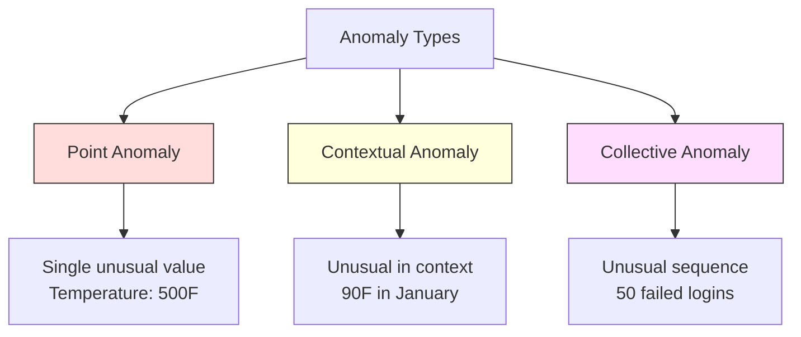
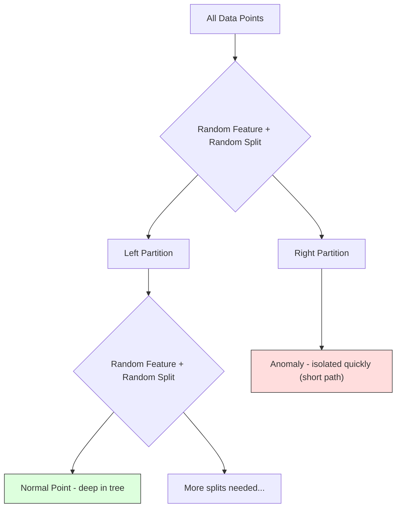
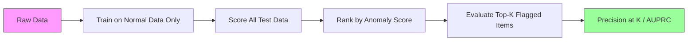

# Detección de anomalías

> Normal es fácil de definir, anormal es lo que no encaja.

**Type:** Build
**Language:**Python
**Prerequisites:** Phase 2, Lessons 01-09
**Time:** ~75 minutes

## Objetivos de aprendizaje

- Implementar desde cero los métodos de detección de anomalías forestales de Z-score, IQR y aislamiento
- Distinguir entre anomalías puntuales, contextuales y colectivas y seleccionar el método de detección adecuado para cada una de ellas
- Explicar por qué la detección de anomalías se enmarca como un modelo de datos normales en lugar de clasificar anomalías
- Comparar la detección de anomalías no supervisadas con la clasificación supervisada y evaluar la compensación entre la cobertura de anomalías nuevas y la precisión

## El problema

Una tarjeta de crédito se utiliza en Nueva York a las 2 pm, luego en Tokio a las 2:05 pm. Un sensor de fábrica lee 150 grados cuando el rango normal es 80-120. Un servidor envía 50.000 solicitudes por segundo cuando el promedio diario es 200.

Estas son anomalías, encontrarlas importa, el fraude cuesta miles de millones, las fallas de equipos cuestan tiempo de inactividad, las intrusiones de la red cuestan datos.

El reto: rara vez han etiquetado ejemplos de anomalías. El fraude representa el 0,1% de las transacciones. Las fallas de equipos ocurren unas cuantas veces al año. No se puede entrenar un clasificador estándar porque no hay casi nada en la clase de "anomalías" para aprender. Incluso si tienes algunas etiquetas, las anomalías que has visto no son los únicos tipos que encontrarás. El esquema de fraude de mañana se ve diferente del de hoy.

La detección de anomalías cambia el problema. En lugar de aprender lo que es anormal, aprenda lo que es normal. Cualquier cosa que se desvía de lo normal es sospechosa. Esto funciona sin etiquetas, se adapta a nuevos tipos de anomalías y se escala a conjuntos masivos de datos.

## El concepto

### Tipos de anomalías

No todas las anomalías son iguales:

- **Point anomalies.**Un único punto de datos que es inusual independientemente del contexto.$50,000 from an account that normally spends $- ¿Qué?
- **Contextual anomalies.**Un punto de datos que es inusual dado su contexto. Una temperatura de 90 grados es normal en verano, anormal en invierno.
- **Collective anomalies.**Una secuencia de puntos de datos que es inusual como grupo, aunque cada punto individual puede ser normal. Cinco fallas de inicio de sesión es normal. Cincuenta consecutivas es un ataque de fuerza bruta.

La mayoría de los métodos detectan anomalías de puntos. Las anomalías contextuales necesitan características de tiempo o ubicación.



### El enmarcado sin supervisión

En la clasificación estándar, tienes etiquetas para ambas clases.

1. **Fully unsupervised.**No hay etiquetas en absoluto. se encaja el detector en todos los datos y esperamos que las anomalías sean lo suficientemente raras como para no corromper el modelo "normal".
2. **Semi-supervised.**Tienes un conjunto de datos limpio de datos normales, encajas en este conjunto limpio y calificas todo lo demás. Esta es la configuración más fuerte cuando sea posible.
3. **Weakly supervised.**Tienes algunas anomalías etiquetadas. Usalas para la evaluación, no para el entrenamiento. Entrenamiento sin supervisión, luego mide la precisión/recall en el subconjunto etiquetado.

La clave: la detección de anomalías es fundamentalmente diferente de la clasificación.

### Supervisados vs. No Supervisados: el cambio

Si usted ha etiquetado anomalías, ¿debe utilizarlas para la formación (clasificación supervisada) o solo para la evaluación (detección sin supervisión)?

**Supervised (treat as classification):**
- Captura los tipos exactos de anomalías que has visto antes
- Precisión superior en tipos de anomalías conocidos
- Se pierden los tipos de anomalías novedosos por completo
- Requiere una nueva capacitación cuando surgen nuevos tipos de anomalías
- Necesita suficientes ejemplos de anomalías (a menudo muy pocos)

**Unsupervised (model normal, flag deviations):**
- Captura cualquier desviación de la normalidad, incluidos los tipos nuevos
- No requiere anomalías etiquetadas
- Alza de la tasa de falsos positivos (no todo lo inusual es malo)
- Más robusta para el cambio de distribución

En la práctica, los mejores sistemas combinan ambos: detección no supervisada para una amplia cobertura, modelos supervisados para tipos de anomalías conocidos de alta prioridad y revisión humana para casos ambigus.

### Método de puntuación Z

El enfoque más simple: calcular la media y la desviación estándar de cada característica. Marcar cualquier punto más de k desviaciones estándar de la media.

```text
z_score = (x - mean) / std
anomaly if |z_score| > threshold
```

El umbral predeterminado es de 3,0 (99,7% de los datos normales se encuentran dentro de 3 desviaciones estándar para una distribución gaussiana).

**Strengths:**Simple. Rápido. Interpretable ("este valor es 4,5 desviaciones estándar de lo normal").

**Weaknesses:**Supone que los datos se distribuyen normalmente. Sensibles a los valores de los datos de formación (los valores de los valores de los valores de los valores de los valores de los valores de los valores de los valores de los valores de los valores de los valores de los valores de los valores de los valores de los valores de los valores de los valores de los valores de los valores de los valores de los valores de los valores de los valores de los valores de los valores de los valores de los valores de los valores de los valores de los valores de los valores de los valores de los valores de los valores de los valores de los valores de los valores de los valores de los valores de los valores de los valores de los valores de los valores de los valores de los valores de los valores de los valores de los valores de los valores de los valores de los valores de los valores de los valores de los valores de los valores de los valores de los valores de los valores de los valores de los valores de los valores de los valores de los valores de los valores de los valores de los valores de los valores de los valores de los valores de los valores de los valores de los valores de los valores de los valores de los valores de los valores de los valores de los valores de los valores de los valores de los valores de los valores de los valores de los valores de los valores de los valores de los valores de los valores de los valores de los valores de los valores de los valores de los valores de los valores de los valores de los valores de los valores de los valores de los valores de los valores de los valores de los valores de los valores de los valores de los valores de los valores de los valores de los valores de los valores de los valores de los valores de los valores de los valores de los valores de los valores de los valores de los valores de los valores de los valores de los valores de los valores de los valores de los valores de los valores de los valores de los cuyo de los cuyo de los cuyo de los cuyo de los cuyo de los cuyo de los cuyo de los cuyo de los cuyo de la cuyo de la cuyo de la cuyo de la cuyo de la cuyo de la cuyo de la cuyo de la cuyo de la cuyo de la de la de la de la de la de la de la de la de la de la de la de la de la de la de la de la de la de la de la de la de la

**When it works well:**Monitoreo de una sola característica donde los datos son aproximadamente en forma de campana. Tiempos de respuesta del servidor, tolerancias de fabricación, lecturas de sensores con líneas de base estables.

**When it fails:**Datos de múltiples grupos (dos oficinas con diferentes temperaturas de referencia), datos sesgados (importos de transacciones en los que los 1000$ son raros pero no anómalos), datos con valores excepcionales en el conjunto de capacitación.

### Método de la RIC

Más robusto que la puntuación Z. Utiliza el rango intercuartilar en lugar de la media y la desviación estándar.

```
Q1 = 25th percentile
Q3 = 75th percentile
IQR = Q3 - Q1
lower_bound = Q1 - factor * IQR
upper_bound = Q3 + factor * IQR
anomaly if x < lower_bound or x > upper_bound
```

El factor predeterminado es 1.5.

**Strengths:**Robusto hasta extremo (los porcentajes no se ven afectados por valores extremos). Trabaja en distribuciones sesgadas.

**Weaknesses:**Solo Univariado (aplica por característica de forma independiente). No puede detectar anomalías que son inusuales sólo cuando se consideran las características juntas (un punto puede ser normal en cada característica individualmente pero anómalo en el espacio conjunto).

**Practical note:**El factor 1,5 en IQR corresponde a los bigotes en una gráfica de caja. Los puntos fuera de los bigotes son potenciales valores fuera de lo común. Usando 3.0 en lugar de 1.5 hace que el detector sea más conservador (menos banderas, menos falsos positivos). El factor correcto depende de su tolerancia a las falsas alarmas.

### Bosque aislado

La clave: las anomalías son pocas y diferentes. En una partición aleatoria de los datos, las anomalías son más fáciles de aislar, necesitan menos divisiones aleatorias para separarse del resto.



**How it works:**
1. Construir muchos árboles aleatorios (un bosque aislado)
2. En cada nodo, elija una característica aleatoria y un valor de división aleatoria entre min y max de la característica
3. Continúe dividiendo hasta que cada punto esté aislado (en su propia hoja)
4. Las anomalías tienen una longitud media más corta de trayectoria en todos los árboles

**Why it works:**Los puntos normales viven en regiones densas. Se necesitan muchas divisiones aleatorias para aislar uno de sus vecinos. Las anomalías viven en regiones escasas. Una o dos divisiones aleatorias son suficientes para aislarlos.

La puntuación de anomalía se basa en la longitud promedio de la ruta en todos los árboles, normalizada por la longitud esperada de la ruta de un árbol de búsqueda binaria aleatoria:

```
score(x) = 2^(-average_path_length(x) / c(n))
```

¿ Dónde ?`c(n)`Es la longitud de trayectoria esperada para n muestras. La puntuación cerca de 1 significa anomalía. La puntuación cerca de 0.5 significa normal. La puntuación cerca de 0 significa muy normal (en grupos densos).

**Strengths:**No hay hipótesis de distribución. Funciona en grandes dimensiones. Escales bien (sublinear en tamaño de muestra porque cada árbol utiliza una submuestra). Maneja tipos de características mixtas.

**Weaknesses:**Lucha contra las anomalías en regiones densas (efecto de enmascaramiento).

**Key hyperparameters:**
- `n_estimators`El número de árboles. 100 es generalmente suficiente. Más árboles dan puntuaciones más estables pero el cálculo más lento.
- `max_samples`El número de muestras por árbol. 256 es el valor predeterminado en el papel original. Los valores más pequeños hacen que los árboles individuales sean menos precisos pero aumentan la diversidad. La submuestreo es lo que hace que el bosque de aislamiento sea rápido - cada árbol ve una pequeña fracción de los datos.
- `contamination`: Fracción esperada de anomalías. Solo se utiliza para establecer el umbral. No afecta a las puntuaciones en sí.

### Factor local de extranjero (LOF)

LOF compara la densidad local alrededor de un punto con la densidad alrededor de sus vecinos.

**How it works:**
1. Para cada punto, encontrar su k vecinos más cercanos
2. Calcule la densidad de accesibilidad local (cuán densa es la vecindad)
3. Comparar la densidad de cada punto con la densidad de sus vecinos
4. Si un punto tiene una densidad mucho menor que sus vecinos, es un punto fuera de lugar

**LOF score:**
- LOF cerca de 1,0 significa densidad similar a la de los vecinos (normal)
- LOF mayor a 1,0 significa densidad menor que las de los vecinos (potencialmente anómalas)
- LOF mucho mayor que 1,0 (por ejemplo, 2,0+) significa una densidad significativamente menor (anomalía probable)

La parte "local" es crítica. Considere un conjunto de datos con dos cúmulos: un cúmulo denso de 1000 puntos y un cúmulo escaso de 50 puntos. Un punto en el borde del cúmulo escaso no es inusual globalmente - tiene 50 vecinos. Pero es inusual localmente si sus vecinos inmediatos son más densos de lo que es. LOF captura este matiz que los métodos globales pierden.

**Strengths:**Detecta anomalías locales (puntos que son inusuales en su vecindario, aunque no sean inusuales a nivel mundial).

**Weaknesses:**Lento en grandes conjuntos de datos (O(n^2) para implementación ingenua). Sensible a la elección de k. No funciona bien en dimensiones muy altas (la maldición de dimensionalidad afecta los cálculos de distancia).

### Comparación

| Method | Assumptions | Speed | Handles High Dims | Detects Local Anomalies |
|--------|------------|-------|-------------------|------------------------|
| Z-score | Normal distribution | Very fast | Yes (per feature) | No |
| IQR | None (per feature) | Very fast | Yes (per feature) | No |
| Isolation Forest | None | Fast | Yes | Partially |
| LOF | Distance is meaningful | Slow | Poorly | Yes |

### Desafíos en la evaluación

La evaluación de detectores de anomalías es más difícil que la evaluación de clasificadores:

- **Extreme class imbalance.**Con anomalías del 0,1%, predecir "normal" para todo da una precisión del 99,9%.
- **AUROC is misleading.**Con un fuerte desequilibrio, AUROC puede verse bien incluso cuando el modelo no tiene la mayoría de anomalías en los umbrales prácticos.
- **Better metrics:**Precision@k (de los elementos marcados en la parte superior de k, cuántas son anomalías reales), AUPRC (área bajo curva de recalco de precisión) y recalco a una tasa de falso positivo fija.



### El gasoducto de detección de anomalías

En la práctica, la detección de anomalías sigue este flujo de trabajo:

1. **Collect baseline data.**Lo ideal es un período en el que se sabe que no hay (o muy pocas) anomalías.
2. **Feature engineering.**Características primas más características derivadas (estadísticas de rodamiento, características temporales, relaciones).
3. **Train the detector.**El modelo aprende cómo es "normal".
4. **Score new data.**Cada nueva observación obtiene una puntuación de anomalía.
5. **Threshold selection.**Es una decisión de negocios: un umbral más alto significa menos falsas alarmas pero más anomalías perdidas.
6. **Alert and investigate.**Los puntos señalados se remiten a la revisión humana o a la respuesta automática.
7. **Feedback collection.**Registra si los elementos señalados fueron anomalías o falsas alarmas.

La tubería nunca está "hecha". Las distribuciones de datos cambian, surgen nuevos tipos de anomalías y los umbrales necesitan ajuste. Trata la detección de anomalías como un sistema vivo, no un modelo único.

```figure
f3-anomaly-fence
```

## Construye el mismo

El código en `code/anomaly_detection.py`Implementa la puntuación Z, el IQR y el bosque de aislamiento desde cero.

### Detector de puntaje Z

```python
def zscore_detect(X, threshold=3.0):
    mean = X.mean(axis=0)
    std = X.std(axis=0)
    std[std == 0] = 1.0
    z = np.abs((X - mean) / std)
    return z.max(axis=1) > threshold
```

Simple y vectorial. Envase un punto si alguna característica excede el umbral.

### Detector de RIC

```python
def iqr_detect(X, factor=1.5):
    q1 = np.percentile(X, 25, axis=0)
    q3 = np.percentile(X, 75, axis=0)
    iqr = q3 - q1
    iqr[iqr == 0] = 1.0
    lower = q1 - factor * iqr
    upper = q3 + factor * iqr
    outside = (X < lower) | (X > upper)
    return outside.any(axis=1)
```

### El bosque de aislamiento desde cero

La implementación desde cero construye árboles de aislamiento que particionan al azar el espacio de características:

```python
class IsolationTree:
    def __init__(self, max_depth):
        self.max_depth = max_depth

    def fit(self, X, depth=0):
        n, p = X.shape
        if depth >= self.max_depth or n <= 1:
            self.is_leaf = True
            self.size = n
            return self
        self.is_leaf = False
        self.feature = np.random.randint(p)
        x_min = X[:, self.feature].min()
        x_max = X[:, self.feature].max()
        if x_min == x_max:
            self.is_leaf = True
            self.size = n
            return self
        self.threshold = np.random.uniform(x_min, x_max)
        left_mask = X[:, self.feature] < self.threshold
        self.left = IsolationTree(self.max_depth).fit(X[left_mask], depth + 1)
        self.right = IsolationTree(self.max_depth).fit(X[~left_mask], depth + 1)
        return self
```

La longitud del camino para aislar un punto determina su puntaje de anomalía.

El `IsolationForest`clase envuelve varios árboles:

```python
class IsolationForest:
    def __init__(self, n_estimators=100, max_samples=256, seed=42):
        self.n_estimators = n_estimators
        self.max_samples = max_samples

    def fit(self, X):
        sample_size = min(self.max_samples, X.shape[0])
        max_depth = int(np.ceil(np.log2(sample_size)))
        for _ in range(self.n_estimators):
            idx = rng.choice(X.shape[0], size=sample_size, replace=False)
            tree = IsolationTree(max_depth=max_depth)
            tree.fit(X[idx])
            self.trees.append(tree)

    def anomaly_score(self, X):
        avg_path = average path length across all trees
        scores = 2.0 ** (-avg_path / c(max_samples))
        return scores
```

El factor de normalización `c(n)`es la longitud esperada de la trayectoria de una búsqueda fallida en un árbol de búsqueda binaria con n elementos.`2 * H(n-1) - 2*(n-1)/n`donde`H`Esta normalización garantiza que las puntuaciones sean comparables en conjuntos de datos de diferentes tamaños.

### Escenarios de demostración

El código genera múltiples escenarios de prueba:

1. **Single cluster with outliers.**Un cúmulo Gaussiano 2D con anomalías inyectadas lejos del centro.
2. **Multimodal data.**Tres grupos de diferentes tamaños y densidades. Los puntos entre grupos son anómalas.
3. **High-dimensional data.**50 características, pero las anomalías difieren en sólo 5 de ellas.

Cada demo compara todos los métodos utilizando precisión, recall, F1, y Precision@k.

## Usalo

Con sklearn (utilizando implementaciones de bibliotecas, no desde cero):

```python
from sklearn.ensemble import IsolationForest
from sklearn.neighbors import LocalOutlierFactor

iso = IsolationForest(n_estimators=100, contamination=0.05, random_state=42)
iso.fit(X_train)
predictions = iso.predict(X_test)

lof = LocalOutlierFactor(n_neighbors=20, contamination=0.05, novelty=True)
lof.fit(X_train)
predictions = lof.predict(X_test)
```

Nota `contamination`La configuración correcta importa, demasiado bajo pierde anomalías, demasiado alto crea falsas alarmas.

El código en `anomaly_detection.py`comparar las implementaciones desde cero con las de sklearn en los mismos datos.

### Parámetro de contaminación de sklearn

El `contamination`El parámetro en sklearn determina el umbral para convertir las puntuaciones de anomalía continua en predicciones binarias.

```python
iso_5 = IsolationForest(contamination=0.05)
iso_10 = IsolationForest(contamination=0.10)
```

Ambos producen los mismos resultados de anomalías.`iso_5`señala el 5% superior mientras que `iso_10`Si no conoce la verdadera tasa de anomalías (por lo general no lo hace), establece la contaminación en "automático" y trabaje directamente con los puntajes en bruto.

### M.S.V. de una clase

Otro detector de anomalías no supervisado que vale la pena conocer. Un SVM de una clase se ajusta a un límite alrededor de los datos normales en un espacio de características de alta dimensión (utilizando el truco del núcleo).

```python
from sklearn.svm import OneClassSVM

oc_svm = OneClassSVM(kernel="rbf", gamma="auto", nu=0.05)
oc_svm.fit(X_train)
predictions = oc_svm.predict(X_test)
```

El `nu`El sistema de SVM de una clase funciona bien en conjuntos de datos pequeños y medianos, pero no se escala a datos muy grandes (la matriz del núcleo crece cuadráticamente).

### Autoencoder enfoque (previsión)

Los autoencodadores son redes neuronales que aprenden a comprimir y reconstruir datos. Entrenamiento en datos normales. En el momento de la prueba, las anomalías tienen alto error de reconstrucción porque la red aprendió a reconstruir patrones normales sólo.

Esto se cubre en la Fase 3 (Aprendizaje Profundo), pero el principio es el mismo: modelo lo que es normal, marca lo que se desvía.

### Ensemble Detección de Anomalias

Así como los métodos de conjunto mejoran la clasificación (lección 11), combinar múltiples detectores de anomalías mejora la detección.

1. Ejecutar detectores múltiples (punto Z, IQR, bosque de aislamiento, LOF)
2. Normaliza las puntuaciones de cada detector a [0, 1]
3. Promedio de las puntuaciones normalizadas
4. Puntos de bandera por encima del umbral de la puntuación media

Esto reduce los falsos positivos porque diferentes métodos tienen diferentes modos de falla. Un punto marcado por los cuatro métodos es casi ciertamente anómalo. Un punto marcado por sólo uno podría ser una peculiaridad de ese método.

Los ensambles más sofisticados ponderan cada detector por su fiabilidad estimada (medida en un conjunto de validación con anomalías conocidas, si está disponible).

### Considerancias de producción

1. **Threshold drift.**A medida que la distribución de datos cambia, un umbral fijo se vuelve anticuado.
2. **Alert fatigue.**Las alarmas falsas y los operadores de Internet dejan de prestar atención a las alarmas falsas, comienzan con un umbral más alto (menos alertas confiables) y bajenlo a medida que crece la confianza.
3. **Ensemble approach.**En la producción, combine múltiples detectores. Marque un punto sólo si varios métodos coinciden en que es anómalo. Esto reduce significativamente los falsos positivos.
4. **Feature engineering.**Las características primas son raramente suficientes. Añadir estadísticas de rodamiento, proporciones, tiempo desde el último evento y características específicas de dominio. Una buena característica define más que la elección del detector.
5. **Feedback loop.**Cuando los operadores investiguen los elementos señalados y los confirman o descartan, los devuelven al sistema.

## Envío

Esta lección produce:
- `outputs/skill-anomaly-detector.md`-- una habilidad de decisión para elegir el detector adecuado
- `code/anomaly_detection.py`-- Z-score, IQR, y el bosque de aislamiento desde cero, con comparación sklearn

### Elegir un umbral

La puntuación de anomalías es continua, necesitas un umbral para tomar decisiones binarias, es una decisión de negocios, no técnica.

Considere dos escenarios:
- **Fraud detection.**El fraude que falta es caro (reembolsos, confianza del cliente). Los falsos alarmas cuestan a un analista humano 5 minutos para investigar.
- **Equipment maintenance.**Una falsa alarma significa un cierre innecesario que cuesta mucho .$50,000. A missed failure means a $Establezca el umbral para equilibrar estos costos.

En ambos casos, el umbral óptimo depende de la relación de costes entre falsos positivos y falsos negativos.

### Escalación a la producción

Para la detección de anomalías en tiempo real en la producción:

1. **Batch training, online scoring.**Entrenar el modelo periódicamente (diariamente, semanalmente) con datos normales recientes.
2. **Feature computation must match.**Si se ha entrenado con estadísticas de rodaje durante 30 días, se necesita 30 días de historia para calcular características para una nueva observación.
3. **Score distribution monitoring.**Si la media se desplaza hacia arriba, los datos están cambiando o el modelo está obsoleto.
4. **Explainability.**Cuando señala una anomalía, diga por qué. Z-score: "La característica X es 4.2 desviaciones estándar por encima de lo normal".

## Los ejercicios

1. **Threshold tuning.**ejecuta el detector de puntaje Z con umbrales de 1.0 a 5.0 en pasos de 0.5.

2. **Multivariate anomalies.**Crear datos 2D donde cada característica individual se ve normal, pero la combinación es anómala (por ejemplo, puntos lejos de la diagonal principal del grupo). Muestre que la puntuación Z por característica se pierde, pero el bosque de aislamiento las captura.

3. **LOF from scratch.**Implemente el Factor Local Outlier utilizando k-vizinos más cercanos. Comparar con el LocalOutlierFactor de sklearn en los mismos datos. Utilice k=10 y k=50 - ¿cómo afecta la elección de k a los resultados?

4. **Streaming anomaly detection.**Modificar el detector de Z-score para que funcione en un entorno de transmisión: actualizar el promedio y la varianza en ejecución a medida que llegan nuevos puntos (algorithmo en línea de Welford).

5. **Real-world evaluation.**Tomemos un conjunto de datos con anomalías conocidas (fraude de tarjetas de crédito de Kaggle, por ejemplo). Evaluar los cuatro métodos utilizando precision@100, precision@500 y AUPRC. ¿Cuál método funciona mejor? ¿Por qué?

## Términos clave

| Term | What people say | What it actually means |
|------|----------------|----------------------|
| Anomaly | "Outlier, unusual point" | A data point that deviates significantly from the expected pattern of normal data |
| Point anomaly | "A single weird value" | An individual observation that is unusual regardless of context |
| Contextual anomaly | "Normal value, wrong context" | An observation that is unusual given its context (time, location, etc.) but might be normal in another context |
| Isolation Forest | "Random splits to find outliers" | An ensemble of random trees that isolates anomalies with fewer splits than normal points |
| Local Outlier Factor | "Compare density to neighbors" | A method that flags points whose local density is much lower than their neighbors' density |
| Z-score | "Standard deviations from mean" | (x - mean) / std, measuring how far a point is from the center in units of standard deviation |
| IQR | "Interquartile range" | Q3 - Q1, measuring the spread of the middle 50% of data, used for robust outlier detection |
| Contamination | "Expected fraction of anomalies" | A hyperparameter telling the detector what proportion of the data it should flag as anomalous |
| Precision@k | "Of the top k flags, how many are real" | Precision computed on only the k most suspicious points, useful for imbalanced anomaly detection |
| AUPRC | "Area under precision-recall curve" | A metric that summarizes precision-recall performance across all thresholds, better than AUROC for imbalanced data |

## Leer más

- [Liu et al., Isolation Forest (2008)](https://cs.nju.edu.cn/zhouzh/zhouzh.files/publication/icdm08b.pdf)-- el papel original de la Selva de aislamiento
- [Breunig et al., LOF: Identifying Density-Based Local Outliers (2000)](https://dl.acm.org/doi/10.1145/342009.335388)-- el papel original de LOF
- [scikit-learn Outlier Detection docs](https://scikit-learn.org/stable/modules/outlier_detection.html)-- visión general de todos los detectores de anomalías de sklearn
- [Chandola et al., Anomaly Detection: A Survey (2009)](https://dl.acm.org/doi/10.1145/1541880.1541882)-- un estudio exhaustivo de los métodos de detección de anomalías
- [Goldstein and Uchida, A Comparative Evaluation of Unsupervised Anomaly Detection Algorithms (2016)](https://journals.plos.org/plosone/article?id=10.1371/journal.pone.0152173)-- comparación empírica de 10 métodos en conjuntos de datos reales
