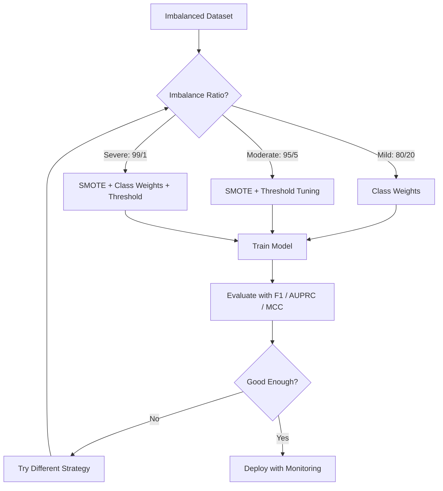
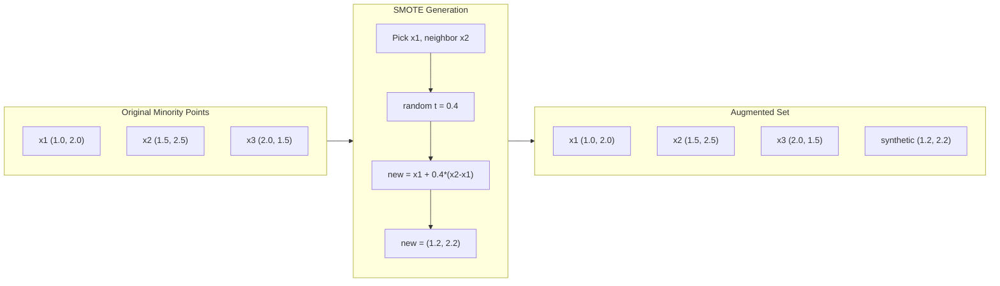
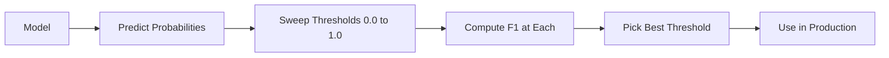
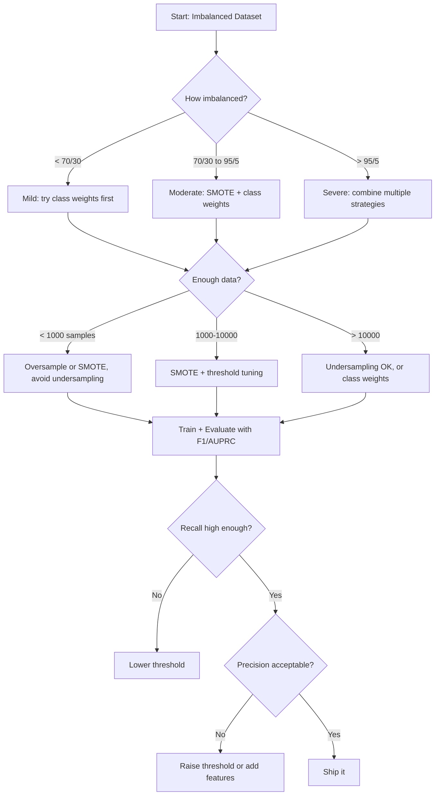

# Tratar datos desequilibrados

> Cuando el 99% de sus datos son "normales", la precisión es una mentira.

**Type:** Build
**Language:**Python
**Prerequisites:** Phase 2, Lessons 01-09 (especially evaluation metrics)
**Time:** ~90 minutes

## Objetivos de aprendizaje

- Implemente SMOTE desde cero y explique cómo la sobresampulación sintética difiere de la duplicación aleatoria
- Evaluar clasificadores desequilibrados utilizando el coeficiente de correlación de F1, AUPRC y Matthews en lugar de precisión
- Comparar las estrategias de ponderación de clases, ajuste de umbral y repetición de muestras y seleccionar el enfoque adecuado para una relación de desequilibrio dada
- Construir una línea de datos desequilibrada completa que combine SMOTE, pesos de clase y optimización de umbral

## El problema

Construye un modelo de detección de fraude, tiene una precisión del 99,9%, celebra y se da cuenta de que predice "no fraude" para cada transacción.

Esto no es un error. Es lo racional que se debe hacer cuando solo el 0,1% de las transacciones son fraudulentas. El modelo aprende que siempre adivinar a la clase mayoritaria minimiza el error general. Es técnicamente correcto y completamente inútil.

Esto sucede en todas partes en materia de clasificación real. Diagnóstico de enfermedad: 1% tasa positiva. Intrusión de red: 0.01% ataques. Defectos de fabricación: 0.5% defectuosos. Filtración de spam: 20% spam. Previsión de churn: 5% churners. Cuanto más consecuente sea la clase minoritaria, más rara tiende a ser.

La precisión falla porque trata todas las predicciones correctas de manera igual. Etiquetar correctamente una transacción legítima y detectar el fraude correctamente son ambos puntos de precisión. Pero detectar el fraude es la razón por la que existe el modelo. Necesitamos métricas, técnicas y estrategias de entrenamiento que obliguen al modelo a prestar atención a la clase rara pero importante.

## El concepto

### Por qué no es exacto

Considere un conjunto de datos con 1000 muestras: 990 negativas, 10 positivas. Un modelo que siempre predice negativo:

|  | Predicted Positive | Predicted Negative |
|--|---|---|
| Actually Positive | 0 (TP) | 10 (FN) |
| Actually Negative | 0 (FP) | 990 (TN) |

Precisión = (0 + 990) / 1000 = 99,0%

El modelo detecta cero fraude, cero enfermedad, cero defectos, pero la precisión dice 99%.

### Mejores métricas

**Precision**¿Cuántos son realmente de todo lo que se marca como positivo?

**Recall**¿Cuántos de todos los positivos que hemos capturado?

**F1 Score**= 2 * precisión * recall / (precisión + recall). La media armónica. Penaliza el desequilibrio extremo entre precisión y recall más que lo haría la media aritmética.

**F-beta Score**= (1 + beta^2) * precisión * recall / (beta^2 * precisión + recall). Cuando beta > 1, el recall es más importante. Cuando beta < 1, la precisión es más importante. F2 es común en la detección de fraude (falto fraude es peor que una falsa alarma).

**AUPRC**(Area bajo curva de recuerdo de precisión). Como AUC-ROC pero más informativo para los datos desequilibrados. Un clasificador aleatorio tiene AUPRC igual a la tasa de clase positiva (no 0.5 como ROC). Esto hace que las mejoras sean más fáciles de ver.

**Matthews Correlation Coefficient**= (TP * TN - FP * FN) / sqrt((TP+FP)(TP+FN)(TN+FP)(TN+FN)). Va desde -1 hasta +1. Sólo da una puntuación alta cuando el modelo lo hace bien en ambas clases. Equilibrado incluso cuando las clases son de tamaños muy diferentes.

Para el modelo "prevé siempre negativo" anterior: precisión = 0/0 (indefinido, a menudo fijado en 0), recuerdo = 0/10 = 0, F1 = 0, MCC = 0. Estas métricas identifican correctamente el modelo como sin valor.

### El flujo de datos desequilibrado



### SMOTE: Técnica de sobresamplificación de la minoría sintética

La extracción aleatoria duplica las muestras de minorías existentes, pero corre el riesgo de sobreajustarlas porque el modelo ve puntos idénticos repetidamente.

SMOTE crea nuevas muestras de minorías sintéticas que son plausibles pero no copias.

1. Para cada muestra minoritaria x, encuentre sus vecinos más cercanos k entre otras muestras minorarias
2. Escoge un vecino al azar
3. Crear una nueva muestra en el segmento de línea entre x y ese vecino

La fórmula: `new_sample = x + random(0, 1) * (neighbor - x)`

Esto interpola entre puntos de minoría reales, creando muestras en la misma región del espacio de características sin simplemente copiar los datos existentes.



### Estrategias de muestreo comparadas

**Random Oversampling**: duplicar las muestras de minorías para coincidir con el recuento de mayoría.
- Pros: sencillo, sin pérdida de información
- Los inconvenientes: duplicados exactos causan sobreajuste, aumenta el tiempo de entrenamiento

**Random Undersampling**: eliminar las muestras de mayoría para que coincidan con el número de minorías.
- Ventajas: entrenamiento rápido, sencillo
- Los inconvenientes: elimina los datos de mayoría potencialmente útiles, mayor variación

**SMOTE**: crear muestras de minorías sintéticas mediante interpolación.
- Pros: genera nuevos puntos de datos, reduce el sobreajuste en comparación con el sobreampliado aleatorio
- Los inconvenientes: pueden crear muestras ruidosas cerca del límite de decisión, no tiene en cuenta la distribución de clases mayoritarias

| Strategy | Data Changed | Risk | When to Use |
|----------|-------------|------|-------------|
| Oversample | Minority duplicated | Overfitting | Small datasets, moderate imbalance |
| Undersample | Majority removed | Information loss | Large datasets, want fast training |
| SMOTE | Synthetic minority added | Boundary noise | Moderate imbalance, enough minority samples for k-NN |

### Peso de clase

En lugar de cambiar los datos, cambie la forma en que el modelo trata los errores.

Para un problema binario con 950 muestras negativas y 50 positivas:
- Peso para clase negativa = n_muestras / (2 * n_negativo) = 1000 / (2 * 950) = 0.526
- Peso para la clase positiva = n_muestras / (2 * n_positivo) = 1000 / (2 * 50) = 10,0

La clase positiva obtiene 19 veces el peso. clasificar mal una muestra positiva cuesta tanto como clasificar mal 19 muestras negativas. El modelo se ve obligado a prestar atención a la clase minoritaria.

En la regresión logística, esto modifica la función de pérdida:

```
weighted_loss = -sum(w_i * [y_i * log(p_i) + (1-y_i) * log(1-p_i)])
```

donde w_i depende de la clase de muestra i.

Los pesos de clase son matemáticamente equivalentes a la sobresampulación en la expectativa, pero sin crear nuevos puntos de datos. Esto los hace más rápidos y evita el riesgo de sobresampulación de muestras duplicadas.

### La regulación del umbral

La mayoría de los clasificadores producen una probabilidad. El umbral predeterminado es 0.5: si P(positivo) >= 0.5, predice positivo. Pero 0.5 es arbitrario. Cuando las clases están desequilibradas, el umbral óptimo suele ser mucho menor.

El proceso:
1. Entrenamiento de un modelo
2. Obtenga probabilidades previstas en el conjunto de validación
3. Los límites de barrido de 0,0 a 1,0
4. Calcule F1 (o la métrica elegida) en cada umbral
5. Elige el umbral que maximiza tu métrica



Un modelo puede emitir P ((fraude) = 0.15 para una transacción fraudulenta. En el umbral 0.5, esto se clasifica como no fraude. En el umbral 0.10, se capta correctamente. La calibración de probabilidad importa menos que la clasificación - siempre y cuando el fraude obtenga probabilidades más altas que el no fraude, existe un umbral que los separa.

### Aprendizaje económico

Generalización de los pesos de las clases: en lugar de costos uniformes, asignen costos de clasificación errónea específicos:

| | Predict Positive | Predict Negative |
|--|---|---|
| Actually Positive | 0 (correct) | C_FN = 100 |
| Actually Negative | C_FP = 1 | 0 (correct) |

El error de falta de una transacción fraudulenta (FN) cuesta 100 veces más que una falsa alarma (FP).

Este es el enfoque más de principio cuando se pueden estimar los costos del mundo real. Un diagnóstico de cáncer omitido tiene un costo muy diferente a una falsa alarma que conduce a una biopsia adicional.

### Diagrama de flujo de decisiones



```figure
class-imbalance
```

## Construye el mismo

### Paso 1: Generar un conjunto de datos desequilibrado

```python
import numpy as np


def make_imbalanced_data(n_majority=950, n_minority=50, seed=42):
    rng = np.random.RandomState(seed)

    X_maj = rng.randn(n_majority, 2) * 1.0 + np.array([0.0, 0.0])
    X_min = rng.randn(n_minority, 2) * 0.8 + np.array([2.5, 2.5])

    X = np.vstack([X_maj, X_min])
    y = np.concatenate([np.zeros(n_majority), np.ones(n_minority)])

    shuffle_idx = rng.permutation(len(y))
    return X[shuffle_idx], y[shuffle_idx]
```

### Paso 2: SMOTE desde cero

```python
def euclidean_distance(a, b):
    return np.sqrt(np.sum((a - b) ** 2))


def find_k_neighbors(X, idx, k):
    distances = []
    for i in range(len(X)):
        if i == idx:
            continue
        d = euclidean_distance(X[idx], X[i])
        distances.append((i, d))
    distances.sort(key=lambda x: x[1])
    return [d[0] for d in distances[:k]]


def smote(X_minority, k=5, n_synthetic=100, seed=42):
    rng = np.random.RandomState(seed)
    n_samples = len(X_minority)
    k = min(k, n_samples - 1)
    synthetic = []

    for _ in range(n_synthetic):
        idx = rng.randint(0, n_samples)
        neighbors = find_k_neighbors(X_minority, idx, k)
        neighbor_idx = neighbors[rng.randint(0, len(neighbors))]
        t = rng.random()
        new_point = X_minority[idx] + t * (X_minority[neighbor_idx] - X_minority[idx])
        synthetic.append(new_point)

    return np.array(synthetic)
```

### Paso 3: Muestreo aleatorio y muestreo aleatorio

```python
def random_oversample(X, y, seed=42):
    rng = np.random.RandomState(seed)
    classes, counts = np.unique(y, return_counts=True)
    max_count = counts.max()

    X_resampled = list(X)
    y_resampled = list(y)

    for cls, count in zip(classes, counts):
        if count < max_count:
            cls_indices = np.where(y == cls)[0]
            n_needed = max_count - count
            chosen = rng.choice(cls_indices, size=n_needed, replace=True)
            X_resampled.extend(X[chosen])
            y_resampled.extend(y[chosen])

    X_out = np.array(X_resampled)
    y_out = np.array(y_resampled)
    shuffle = rng.permutation(len(y_out))
    return X_out[shuffle], y_out[shuffle]


def random_undersample(X, y, seed=42):
    rng = np.random.RandomState(seed)
    classes, counts = np.unique(y, return_counts=True)
    min_count = counts.min()

    X_resampled = []
    y_resampled = []

    for cls in classes:
        cls_indices = np.where(y == cls)[0]
        chosen = rng.choice(cls_indices, size=min_count, replace=False)
        X_resampled.extend(X[chosen])
        y_resampled.extend(y[chosen])

    X_out = np.array(X_resampled)
    y_out = np.array(y_resampled)
    shuffle = rng.permutation(len(y_out))
    return X_out[shuffle], y_out[shuffle]
```

### Paso 4: Regresión logística con pesos de clase

```python
def sigmoid(z):
    return 1.0 / (1.0 + np.exp(-np.clip(z, -500, 500)))


def logistic_regression_weighted(X, y, weights, lr=0.01, epochs=200):
    n_samples, n_features = X.shape
    w = np.zeros(n_features)
    b = 0.0

    for _ in range(epochs):
        z = X @ w + b
        pred = sigmoid(z)
        error = pred - y
        weighted_error = error * weights

        gradient_w = (X.T @ weighted_error) / n_samples
        gradient_b = np.mean(weighted_error)

        w -= lr * gradient_w
        b -= lr * gradient_b

    return w, b


def compute_class_weights(y):
    classes, counts = np.unique(y, return_counts=True)
    n_samples = len(y)
    n_classes = len(classes)
    weight_map = {}
    for cls, count in zip(classes, counts):
        weight_map[cls] = n_samples / (n_classes * count)
    return np.array([weight_map[yi] for yi in y])
```

### Paso 5: Ajuste de umbral

```python
def find_optimal_threshold(y_true, y_probs, metric="f1"):
    best_threshold = 0.5
    best_score = -1.0

    for threshold in np.arange(0.05, 0.96, 0.01):
        y_pred = (y_probs >= threshold).astype(int)
        tp = np.sum((y_pred == 1) & (y_true == 1))
        fp = np.sum((y_pred == 1) & (y_true == 0))
        fn = np.sum((y_pred == 0) & (y_true == 1))

        if metric == "f1":
            precision = tp / (tp + fp) if (tp + fp) > 0 else 0.0
            recall = tp / (tp + fn) if (tp + fn) > 0 else 0.0
            score = 2 * precision * recall / (precision + recall) if (precision + recall) > 0 else 0.0
        elif metric == "recall":
            score = tp / (tp + fn) if (tp + fn) > 0 else 0.0
        elif metric == "precision":
            score = tp / (tp + fp) if (tp + fp) > 0 else 0.0

        if score > best_score:
            best_score = score
            best_threshold = threshold

    return best_threshold, best_score
```

### Paso 6: Funciones de evaluación

```python
def confusion_matrix_values(y_true, y_pred):
    tp = np.sum((y_pred == 1) & (y_true == 1))
    tn = np.sum((y_pred == 0) & (y_true == 0))
    fp = np.sum((y_pred == 1) & (y_true == 0))
    fn = np.sum((y_pred == 0) & (y_true == 1))
    return tp, tn, fp, fn


def compute_metrics(y_true, y_pred):
    tp, tn, fp, fn = confusion_matrix_values(y_true, y_pred)
    accuracy = (tp + tn) / (tp + tn + fp + fn)
    precision = tp / (tp + fp) if (tp + fp) > 0 else 0.0
    recall = tp / (tp + fn) if (tp + fn) > 0 else 0.0
    f1 = 2 * precision * recall / (precision + recall) if (precision + recall) > 0 else 0.0

    denom = np.sqrt(float((tp + fp) * (tp + fn) * (tn + fp) * (tn + fn)))
    mcc = (tp * tn - fp * fn) / denom if denom > 0 else 0.0

    return {
        "accuracy": accuracy,
        "precision": precision,
        "recall": recall,
        "f1": f1,
        "mcc": mcc,
    }
```

### Paso 7: Comparar todos los enfoques

```python
X, y = make_imbalanced_data(950, 50, seed=42)
split = int(0.8 * len(y))
X_train, X_test = X[:split], X[split:]
y_train, y_test = y[:split], y[split:]

# Baseline: no treatment
w_base, b_base = logistic_regression_weighted(
    X_train, y_train, np.ones(len(y_train)), lr=0.1, epochs=300
)
probs_base = sigmoid(X_test @ w_base + b_base)
preds_base = (probs_base >= 0.5).astype(int)

# Oversampled
X_over, y_over = random_oversample(X_train, y_train)
w_over, b_over = logistic_regression_weighted(
    X_over, y_over, np.ones(len(y_over)), lr=0.1, epochs=300
)
preds_over = (sigmoid(X_test @ w_over + b_over) >= 0.5).astype(int)

# SMOTE
minority_mask = y_train == 1
X_minority = X_train[minority_mask]
synthetic = smote(X_minority, k=5, n_synthetic=len(y_train) - 2 * int(minority_mask.sum()))
X_smote = np.vstack([X_train, synthetic])
y_smote = np.concatenate([y_train, np.ones(len(synthetic))])
w_sm, b_sm = logistic_regression_weighted(
    X_smote, y_smote, np.ones(len(y_smote)), lr=0.1, epochs=300
)
preds_smote = (sigmoid(X_test @ w_sm + b_sm) >= 0.5).astype(int)

# Class weights
sample_weights = compute_class_weights(y_train)
w_cw, b_cw = logistic_regression_weighted(
    X_train, y_train, sample_weights, lr=0.1, epochs=300
)
probs_cw = sigmoid(X_test @ w_cw + b_cw)
preds_cw = (probs_cw >= 0.5).astype(int)

# Threshold tuning (tune on held-out validation set, not test set)
probs_val = sigmoid(X_val @ w_cw + b_cw)
best_thresh, best_f1 = find_optimal_threshold(y_val, probs_val, metric="f1")
preds_thresh = (probs_cw >= best_thresh).astype(int)
```

El archivo de código ejecuta todo esto en un solo guión e imprime los resultados.

## Usalo

Con el aprendizaje escit y el aprendizaje desequilibrado, estas técnicas son de una línea:

```python
from sklearn.linear_model import LogisticRegression
from sklearn.metrics import classification_report, f1_score
from sklearn.model_selection import train_test_split
from imblearn.over_sampling import SMOTE
from imblearn.under_sampling import RandomUnderSampler
from imblearn.pipeline import Pipeline

X_train, X_test, y_train, y_test = train_test_split(X, y, stratify=y)

model_weighted = LogisticRegression(class_weight="balanced")
model_weighted.fit(X_train, y_train)
print(classification_report(y_test, model_weighted.predict(X_test)))

smote = SMOTE(random_state=42)
X_resampled, y_resampled = smote.fit_resample(X_train, y_train)
model_smote = LogisticRegression()
model_smote.fit(X_resampled, y_resampled)
print(classification_report(y_test, model_smote.predict(X_test)))

pipeline = Pipeline([
    ("smote", SMOTE()),
    ("model", LogisticRegression(class_weight="balanced")),
])
pipeline.fit(X_train, y_train)
print(classification_report(y_test, pipeline.predict(X_test)))
```

Las implementaciones desde cero muestran exactamente lo que cada técnica hace. SMOTE es sólo una interpolación k-NN en la clase minoritaria. Los pesos de clase multiplican la pérdida.

## Envío

Esta lección produce:
- `outputs/skill-imbalanced-data.md`-- una lista de control de decisiones para manejar problemas de clasificación desequilibrados

## Los ejercicios

1. **Borderline-SMOTE**: modificar la implementación de SMOTE para generar muestras sintéticas solo para puntos minoritarios que se encuentran cerca del límite de decisión (aquellos cuyos vecinos k más cercanos incluyen muestras de clases mayoritarias).

2. **Cost matrix optimization**• Implementar el aprendizaje sensible al costo donde la matriz de costos es un parámetro. Crea una función que tome una matriz de costos y devuelva predicciones óptimas que minimizan el costo esperado. Prueba con diferentes relaciones de costos (1:10, 1:100, 1:1000) y trace cómo cambia la compensación de recuperación de precisión.

3. **Threshold calibration**• Implementar la escalación de Platt (ajustar una regresión logística en las salidas primas del modelo para producir probabilidades calibradas). Comparar la curva de recuperación de precisión antes y después de la calibración. Muestre que la calibración no cambia el ranking (AUC permanece igual) pero hace que las probabilidades sean más significativas.

4. **Ensemble with balanced bagging**En el caso de los modelos de simulación de velocidad, el modelo de simulación de velocidad de simulación de velocidad de simulación de simulación de velocidad de simulación de simulación de velocidad de simulación de simulación de velocidad de simulación de simulación de velocidad de simulación de simulación de velocidad de simulación de simulación de velocidad de simulación de simulación de velocidad de simulación de simulación de velocidad de simulación de simulación de velocidad de simulación de simulación de velocidad de simulación de simulación de velocidad de simulación de simulación de velocidad de simulación de simulación de velocidad de simulación de simulación de velocidad de simulación de simulación de simulación de velocidad de simulación de simulación de simulación de simulación de velocidad de simulación de simulación de simulación de simulación de simulación de simulación de velocidad de simulación de simulación de simulación de simulación de simulación de velocidad de simulación de simulación de simulación de simulación de velocidad de simulación de simulación de velocidad de simulación de simulación de velocidad de simulación de velocidad de simulación de velocidad de simulación de simulación de velocidad de simulación de velocidad de simulación de velocidad de simulación de velocidad de simulación de velocidad de simulación de velocidad de simulación de velocidad de velocidad de velocidad de velocidad de simulación de velocidad de velocidad de velocidad de velocidad de velocidad de velocidad de velocidad de velocidad de velocidad de velocidad de velocidad de velocidad de velocidad de velocidad de velocidad de velocidad de velocidad de velocidad de velocidad de velocidad de velocidad de velocidad de velocidad de velocidad de velocidad de velocidad de velocidad de velocidad de velocidad de velocidad de velocidad de velocidad de velocidad de velocidad de velocidad de velocidad de velocidad de velocidad de velocidad de velocidad de velocidad de velocidad de velocidad de velocidad de velocidad de velocidad de velocidad de velocidad de velocidad de velocidad de velocidad de velocidad de velocidad de velocidad de velocidad de velocidad de velocidad de velocidad de velocidad de velocidad de velocidad de velocidad de velocidad

5. **Imbalance ratio experiment**En el caso de los sistemas de análisis de datos, el sistema de análisis de datos de la información de la información de la información de la información de la información de la información de la información de la información de la información de la información de la información de la información de la información de la información de la información de la información de la información de la información de la información de la información de la información de la información de la información de la información de la información de la información de la información de la información de la información de la información de la información de la información de la información de la información de la información de la información de la información de la información de la información de la información de la información de la información de la información de la información de la información de la información de la información de la información de la información de la información de la información de la información de la información de la información de la información de la información de la información de la información de la información de la información de la información de la información de la información de la información de la información de la información de la información de la información de la información de la información de la información de la información de la información de la información de la información de la información de la información de la información de la información de la información de la información de la información de la información de la información de la información de la información de la información de la información de la información de la información de la información de la información de la información de la información de la información de la información de la información de la información de la información de la información de la información de la información de la información de la información de la información de la información de la información de la información de la información de la información de la información de la información de la información de la información de la información de la información de la información de la información de la información de la información de la información de la información de la información de la información de la información de la información de la información de la información de la información de la información de la información de la información de la información de la información de la información de la información de la información de la información de la información de la información de la información de la información de la información de la información de la información de la información de la información de la información de la información de la información de la información de la información de la información de la información de la información de la información de la información de la información de la información de la información de la información de la información de la información de la información de

## Términos clave

| Term | What people say | What it actually means |
|------|----------------|----------------------|
| Class imbalance | "One class has way more samples" | The distribution of classes in the dataset is significantly skewed, causing models to favor the majority class |
| SMOTE | "Synthetic oversampling" | Creates new minority samples by interpolating between existing minority samples and their k-nearest minority neighbors |
| Class weights | "Making errors on rare classes more expensive" | Multiplying the loss function by class-specific weights so the model penalizes minority misclassification more heavily |
| Threshold tuning | "Moving the decision boundary" | Changing the probability cutoff for classification from the default 0.5 to a value that optimizes the desired metric |
| Precision-recall tradeoff | "You cannot have both" | Lowering the threshold catches more positives (higher recall) but also flags more false positives (lower precision), and vice versa |
| AUPRC | "Area under the PR curve" | Summarizes the precision-recall curve into a single number; more informative than AUC-ROC when classes are heavily imbalanced |
| Matthews Correlation Coefficient | "The balanced metric" | A correlation between predicted and actual labels that produces a high score only when the model performs well on both classes |
| Cost-sensitive learning | "Different mistakes cost different amounts" | Incorporating real-world misclassification costs into the training objective so the model optimizes for total cost, not error count |
| Random oversampling | "Duplicate the minority" | Repeating minority class samples to balance class counts; simple but risks overfitting to duplicated points |

## Leer más

- [SMOTE: Synthetic Minority Over-sampling Technique (Chawla et al., 2002)](https://arxiv.org/abs/1106.1813)-- el documento original de SMOTE, todavía el trabajo más citado sobre el aprendizaje desequilibrado
- [Learning from Imbalanced Data (He & Garcia, 2009)](https://ieeexplore.ieee.org/document/5128907)-- encuesta integral que cubra los enfoques de muestreo, de coste y de algoritmos
- [imbalanced-learn documentation](https://imbalanced-learn.org/stable/)-- Biblioteca de Python con variantes SMOTE, estrategias de submuestreo e integración de tuberías
- [The Precision-Recall Plot Is More Informative than the ROC Plot (Saito & Rehmsmeier, 2015)](https://journals.plos.org/plosone/article?id=10.1371/journal.pone.0118432)-- cuándo y por qué preferir las curvas de relaciones públicas a las curvas de ROC para problemas desequilibrados
