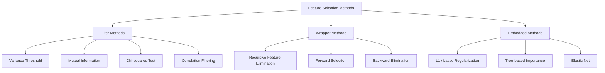
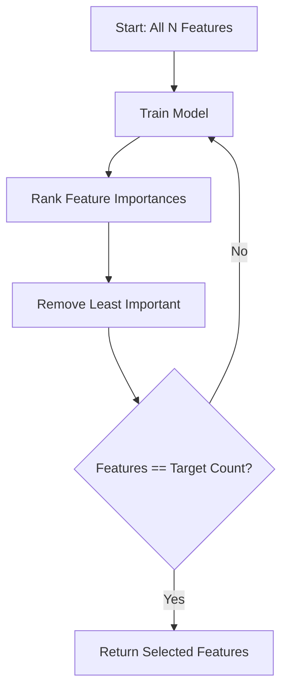
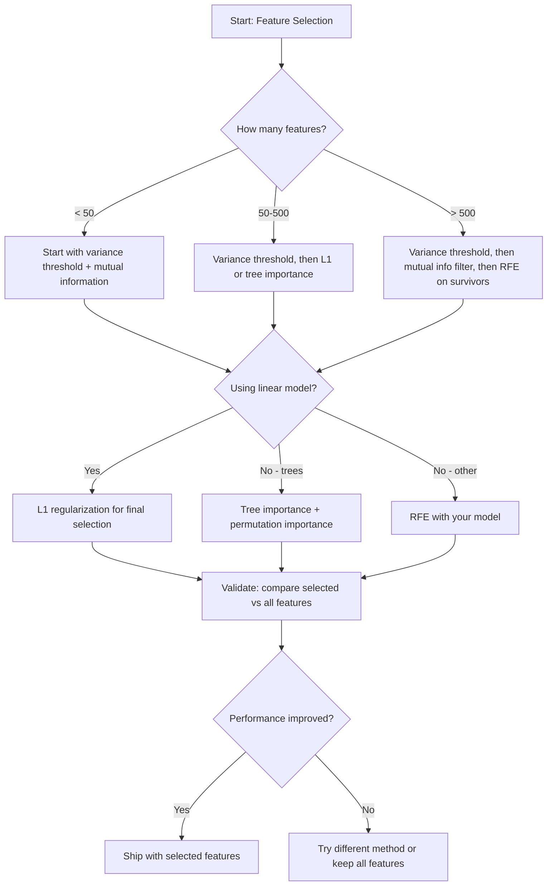

# Selección de características

> Más características no es mejor.

**Type:** Build
**Language:**Python
**Prerequisites:** Phase 2, Lessons 01-09, 08 (feature engineering)
**Time:** ~75 minutes

## Objetivos de aprendizaje

- Implementar desde cero los métodos de filtro (umbral de variación, información mutua, cuadrado de chi) y los métodos de envoltura (RFE, selección hacia adelante)
- Explica por qué la información mutua captura relaciones no lineales de características y objetivos que la correlación no tiene
- Comparar la regularización de L1 (selección integrada) con la RFE (selección de envoltura) y evaluar sus compensaciones computacionales
- Construir una línea de selección de características que combine múltiples métodos y demuestre una mejor generalización en los datos retenidos

## El problema

Tienes 500 características, tu modelo se entrena lentamente, se sobrecarga constantemente y nadie puede explicar lo que aprendió. Añadas más características con la esperanza de mejorar el rendimiento.

Esto es la maldición de la dimensionalidad en acción. A medida que aumenta el número de características, el volumen del espacio de características explota. Los puntos de datos se vuelven escasos. Las distancias entre los puntos convergen. El modelo necesita exponencialmente más datos para encontrar patrones reales. Las características de ruido ahogan las características de la señal.

La selección de características es el antídoto. Elimine el ruido. Elimine la redundancia. Guarde las características que llevan información real sobre el objetivo. El resultado: entrenamiento más rápido, una mejor generalización y modelos que realmente puede explicar.

El objetivo no es utilizar toda la información disponible, sino utilizar la información correcta.

## El concepto

### Tres categorías de selección de características

Cada método de selección de características se clasifica en una de las tres categorías:



**Filter methods**Los resultados de las pruebas de la prueba de la prueba de probabilidad de un resultado de un resultado de un resultado de un resultado de un resultado de un resultado de un resultado de un resultado de un resultado de un resultado de un resultado de un resultado de un resultado de un resultado de un resultado de un resultado de un resultado de un resultado de un resultado de un resultado de un resultado de un resultado de un resultado de un resultado de un resultado de un resultado de un resultado de un resultado de un resultado de un resultado de un resultado de un resultado de un resultado de un resultado de un resultado de un resultado de un resultado de un resultado de un resultado de un resultado de un resultado de un resultado de un resultado de un resultado de un resultado de un resultado de un resultado de un resultado de un resultado de un resultado de un resultado de un resultado de un resultado de un resultado de un resultado de un resultado de un resultado de un resultado de un resultado de un resultado de un resultado de un resultado de un resultado de un resultado de un resultado de un resultado de un resultado de un resultado de un resultado de un resultado de un resultado de un resultado de un resultado de un resultado de un resultado de un resultado de un resultado de un resultado de un resultado de un resultado de un resultado de un resultado de un resultado de un resultado de un resultado de un resultado de un resultado de un resultado de un resultado de un resultado de un resultado de un resultado de un resultado de un resultado de un resultado de un resultado de un resultado de un resultado de un resultado de un resultado de un resultado de un resultado de un resultado de un resultado de un resultado de un resultado de un resultado de un resultado de un resultado de un resultado de un resultado de un resultado de un resultado de un resultado de un resultado de un resultado de un resultado de un resultado de un resultado de un resultado de un resultado de un resultado de un resultado de un resultado de un resultado de un resultado de un resultado de un resultado de un resultado de un resultado de un resultado de un resultado de un resultado de un resultado de un resultado de un resultado de un resultado de un resultado de un resultado de un resultado de un resultado de un resultado de un resultado de un resultado de un resultado de un resultado de un resultado de un resultado de un resultado de un resultado de un resultado de un resultado de un resultado de un resultado de un resultado de un resultado de un resultado de un resultado de un resultado de un resultado de un resultado de un resultado de un resultado de un resultado de un resultado de

**Wrapper methods**El modelo de trabajo de la empresa es un modelo de trabajo que se utiliza para evaluar los subconjuntos de características.

**Embedded methods**La selección de los elementos se realiza durante el montaje, no como un paso separado.

### El umbral de variación

El filtro más simple. Si una característica apenas varía entre muestras, casi no lleva información.

Considere una característica que es 0.0 para 999 de 1000 muestras. Su varianza es cercana a cero. Ningún modelo puede usarlo para distinguir entre clases.

```
variance(x) = mean((x - mean(x))^2)
```

Establezca un umbral (por ejemplo, 0.01). Dejar cada característica con variación por debajo de ella. Esto elimina las características constantes o casi constantes sin mirar la variable objetivo en absoluto.

Cuando utilizarlo: como un paso de preprocesamiento antes que otros métodos. Obviamente capta características inútiles a un costo cercano a cero.

Limitación: una característica puede tener una alta variación y seguir siendo ruido puro.

### Información mutua

La información mutua mide hasta qué punto conocer el valor de la característica X reduce la incertidumbre sobre el objetivo Y.

```
I(X; Y) = sum_x sum_y p(x, y) * log(p(x, y) / (p(x) * p(y)))
```

Si X y Y son independientes, p(x, y) = p(x) * p(y), por lo que el término de registro es cero y I(X; Y) = 0.

Una característica puede tener una correlación cero con el objetivo, pero una información mutua alta porque la relación es cuadrática o periódica.

Para las características continuas, primero discrete en contenedores (estimación basada en histograma). El número de contenedores afecta la estimación - muy pocos contenedores pierden información, demasiados contenedores añaden ruido. Una opción común: cuadrados n) contenedores o regla de Sturges (1 + log2(n)).


### Eliminación de la característica recurrente (RFE)

RFE es un método de envoltura. Utiliza la propia importancia de las características de un modelo para poda iterativamente:

1. Entrenar el modelo con todas las características
2. Características de rango por importancia (coefficientes para modelos lineales, reducción de impurezas para árboles)
3. Eliminar la característica menos importante
4. Repita hasta que el número deseado de características permanezca



La RFE considera las interacciones de características porque el modelo ve todas las características restantes juntas.

El costo: entrenar el modelo N - tiempo objetivo. Con 500 características y un objetivo de 10, es 490 carreras de entrenamiento. Para modelos caros, esto es lento. Puedes acelerarlo eliminando múltiples características por paso (por ejemplo, eliminar el 10% inferior en cada ronda).

### L1 (Lasso) Regularización

La regularización L1 agrega el valor absoluto de los pesos a la función de pérdida:

```
loss = prediction_error + alpha * sum(|w_i|)
```

El parámetro alfa controla la agresividad con que se poda las características.

La penalización L1 crea una región de restricción en forma de diamante en el espacio de peso. La solución óptima tiende a aterrizar en una esquina de este diamante, donde uno o más pesos son cero. La regularización L2 (arido) crea una restricción circular donde los pesos se contraen pero rara vez alcanzan cero.

Se trata de una selección de características integradas: el modelo aprende durante el entrenamiento qué características ignorar.

Ventajas: una sola carrera de entrenamiento, maneja características correlacionadas (pickes uno y cero los otros), integradas en la mayoría de las implementaciones de modelos lineales.

Limitación: sólo funciona para modelos lineales. No puede capturar la importancia de las características no lineales.

### La importancia de la característica basada en el árbol

Los árboles de decisión y sus conjuntos (bosques aleatorios, aumento de gradientes) clasifican naturalmente las características.

Para un bosque aleatorio con árboles T:

```
importance(feature_j) = (1/T) * sum over all trees of
    sum over all nodes splitting on feature_j of
        (n_samples * impurity_decrease)
```

Esto da una puntuación de importancia normalizada para cada característica.

Atención: la importancia basada en árboles es sesgada hacia características con muchos valores únicos (alta cardinalidad). Una columna de ID aleatoria aparecerá importante porque divide perfectamente cada muestra.

### Importancia de la permutación

Un método modelo-agnóstico:

1. Entrenar el modelo y registrar el rendimiento de referencia en los datos de validación
2. Para cada característica: mezclar sus valores al azar, medir la caída en el rendimiento
3. Cuanto mayor sea la caída, más importante será la característica

Si la mezcla de una característica no daña el rendimiento, el modelo no depende de ella.

La importancia de la permutación evita el sesgo de cardinalidad de la importancia basada en el árbol. Pero es lenta: una evaluación completa por característica, repetida varias veces para la estabilidad.

### Tabla de comparación

| Method | Type | Speed | Nonlinear | Feature Interactions |
|--------|------|-------|-----------|---------------------|
| Variance threshold | Filter | Very fast | No | No |
| Mutual information | Filter | Fast | Yes | No |
| Correlation filter | Filter | Fast | No | No |
| RFE | Wrapper | Slow | Depends on model | Yes |
| L1 / Lasso | Embedded | Fast | No (linear) | No |
| Tree importance | Embedded | Medium | Yes | Yes |
| Permutation importance | Model-agnostic | Slow | Yes | Yes |

### Diagrama de flujo de decisiones



```figure
f3-feature-prune
```

## Construye el mismo

### Paso 1: Generar datos sintéticos con estructura de características conocida

```python
import numpy as np


def make_feature_selection_data(n_samples=500, seed=42):
    rng = np.random.RandomState(seed)

    x1 = rng.randn(n_samples)
    x2 = rng.randn(n_samples)
    x3 = rng.randn(n_samples)
    x4 = x1 + 0.1 * rng.randn(n_samples)
    x5 = x2 + 0.1 * rng.randn(n_samples)

    informative = np.column_stack([x1, x2, x3, x4, x5])

    correlated = np.column_stack([
        x1 * 0.9 + 0.1 * rng.randn(n_samples),
        x2 * 0.8 + 0.2 * rng.randn(n_samples),
        x3 * 0.7 + 0.3 * rng.randn(n_samples),
        x1 * 0.5 + x2 * 0.5 + 0.1 * rng.randn(n_samples),
        x2 * 0.6 + x3 * 0.4 + 0.1 * rng.randn(n_samples),
    ])

    noise = rng.randn(n_samples, 10) * 0.5

    X = np.hstack([informative, correlated, noise])
    y = (2 * x1 - 1.5 * x2 + x3 + 0.5 * rng.randn(n_samples) > 0).astype(int)

    feature_names = (
        [f"info_{i}" for i in range(5)]
        + [f"corr_{i}" for i in range(5)]
        + [f"noise_{i}" for i in range(10)]
    )

    return X, y, feature_names
```

Sabemos la verdad fundamental: las características 0-4 son informativas (más 3 y 4 son copias correlacionadas de 0 y 1), las características 5-9 están correlacionadas con las características informativas, las características 10-19 son ruido puro.

### Paso 2: Umbral de variación

```python
def variance_threshold(X, threshold=0.01):
    variances = np.var(X, axis=0)
    mask = variances > threshold
    return mask, variances
```

### Paso 3: Información mutua (discreta)

```python
def discretize(x, n_bins=10):
    min_val, max_val = x.min(), x.max()
    if max_val == min_val:
        return np.zeros_like(x, dtype=int)
    bin_edges = np.linspace(min_val, max_val, n_bins + 1)
    binned = np.digitize(x, bin_edges[1:-1])
    return binned


def mutual_information(X, y, n_bins=10):
    n_samples, n_features = X.shape
    mi_scores = np.zeros(n_features)

    y_vals, y_counts = np.unique(y, return_counts=True)
    p_y = y_counts / n_samples

    for f in range(n_features):
        x_binned = discretize(X[:, f], n_bins)
        x_vals, x_counts = np.unique(x_binned, return_counts=True)
        p_x = dict(zip(x_vals, x_counts / n_samples))

        mi = 0.0
        for xv in x_vals:
            for yi, yv in enumerate(y_vals):
                joint_mask = (x_binned == xv) & (y == yv)
                p_xy = np.sum(joint_mask) / n_samples
                if p_xy > 0:
                    mi += p_xy * np.log(p_xy / (p_x[xv] * p_y[yi]))
        mi_scores[f] = mi

    return mi_scores
```

### Paso 4: Eliminación de la característica recurrente

```python
def simple_logistic_importance(X, y, lr=0.1, epochs=100):
    n_samples, n_features = X.shape
    w = np.zeros(n_features)
    b = 0.0

    for _ in range(epochs):
        z = X @ w + b
        pred = 1.0 / (1.0 + np.exp(-np.clip(z, -500, 500)))
        error = pred - y
        w -= lr * (X.T @ error) / n_samples
        b -= lr * np.mean(error)

    return w, b


def rfe(X, y, n_features_to_select=5, lr=0.1, epochs=100):
    n_total = X.shape[1]
    remaining = list(range(n_total))
    rankings = np.ones(n_total, dtype=int)
    rank = n_total

    while len(remaining) > n_features_to_select:
        X_subset = X[:, remaining]
        w, _ = simple_logistic_importance(X_subset, y, lr, epochs)
        importances = np.abs(w)

        least_idx = np.argmin(importances)
        original_idx = remaining[least_idx]
        rankings[original_idx] = rank
        rank -= 1
        remaining.pop(least_idx)

    for idx in remaining:
        rankings[idx] = 1

    selected_mask = rankings == 1
    return selected_mask, rankings
```

### Paso 5: Selección de la función L1

```python
def soft_threshold(w, alpha):
    return np.sign(w) * np.maximum(np.abs(w) - alpha, 0)


def l1_feature_selection(X, y, alpha=0.1, lr=0.01, epochs=500):
    n_samples, n_features = X.shape
    w = np.zeros(n_features)
    b = 0.0

    for _ in range(epochs):
        z = X @ w + b
        pred = 1.0 / (1.0 + np.exp(-np.clip(z, -500, 500)))
        error = pred - y

        gradient_w = (X.T @ error) / n_samples
        gradient_b = np.mean(error)

        w -= lr * gradient_w
        w = soft_threshold(w, lr * alpha)
        b -= lr * gradient_b

    selected_mask = np.abs(w) > 1e-6
    return selected_mask, w
```

### Paso 6: Importancia basada en el árbol (árbol de decisión simple)

```python
def gini_impurity(y):
    if len(y) == 0:
        return 0.0
    classes, counts = np.unique(y, return_counts=True)
    probs = counts / len(y)
    return 1.0 - np.sum(probs ** 2)


def best_split(X, y, feature_idx):
    values = np.unique(X[:, feature_idx])
    if len(values) <= 1:
        return None, -1.0

    best_threshold = None
    best_gain = -1.0
    parent_gini = gini_impurity(y)
    n = len(y)

    for i in range(len(values) - 1):
        threshold = (values[i] + values[i + 1]) / 2.0
        left_mask = X[:, feature_idx] <= threshold
        right_mask = ~left_mask

        n_left = np.sum(left_mask)
        n_right = np.sum(right_mask)

        if n_left == 0 or n_right == 0:
            continue

        gain = parent_gini - (n_left / n) * gini_impurity(y[left_mask]) - (n_right / n) * gini_impurity(y[right_mask])

        if gain > best_gain:
            best_gain = gain
            best_threshold = threshold

    return best_threshold, best_gain


def tree_importance(X, y, n_trees=50, max_depth=5, seed=42):
    rng = np.random.RandomState(seed)
    n_samples, n_features = X.shape
    importances = np.zeros(n_features)

    for _ in range(n_trees):
        sample_idx = rng.choice(n_samples, size=n_samples, replace=True)
        feature_subset = rng.choice(n_features, size=max(1, int(np.sqrt(n_features))), replace=False)

        X_boot = X[sample_idx]
        y_boot = y[sample_idx]

        tree_imp = _build_tree_importance(X_boot, y_boot, feature_subset, max_depth)
        importances += tree_imp

    total = importances.sum()
    if total > 0:
        importances /= total

    return importances


def _build_tree_importance(X, y, feature_subset, max_depth, depth=0):
    n_features = X.shape[1]
    importances = np.zeros(n_features)

    if depth >= max_depth or len(np.unique(y)) <= 1 or len(y) < 4:
        return importances

    best_feature = None
    best_threshold = None
    best_gain = -1.0

    for f in feature_subset:
        threshold, gain = best_split(X, y, f)
        if gain > best_gain:
            best_gain = gain
            best_feature = f
            best_threshold = threshold

    if best_feature is None or best_gain <= 0:
        return importances

    importances[best_feature] += best_gain * len(y)

    left_mask = X[:, best_feature] <= best_threshold
    right_mask = ~left_mask

    importances += _build_tree_importance(X[left_mask], y[left_mask], feature_subset, max_depth, depth + 1)
    importances += _build_tree_importance(X[right_mask], y[right_mask], feature_subset, max_depth, depth + 1)

    return importances
```

### Paso 7: ejecutar todos los métodos y comparar

El archivo de código ejecuta los cinco métodos en el mismo conjunto de datos sintéticos e imprime una tabla de comparación que muestra qué características selecciona cada método.

## Usalo

Con scikit-learn, la selección de características se integra en la línea de producción:

```python
from sklearn.feature_selection import (
    VarianceThreshold,
    mutual_info_classif,
    RFE,
    SelectFromModel,
)
from sklearn.linear_model import Lasso, LogisticRegression
from sklearn.ensemble import RandomForestClassifier

vt = VarianceThreshold(threshold=0.01)
X_filtered = vt.fit_transform(X)

mi_scores = mutual_info_classif(X, y)
top_k = np.argsort(mi_scores)[-10:]

rfe_selector = RFE(LogisticRegression(), n_features_to_select=10)
rfe_selector.fit(X, y)
X_rfe = rfe_selector.transform(X)

lasso_selector = SelectFromModel(Lasso(alpha=0.01))
lasso_selector.fit(X, y)
X_lasso = lasso_selector.transform(X)

rf = RandomForestClassifier(n_estimators=100)
rf.fit(X, y)
importances = rf.feature_importances_
```

Las implementaciones desde cero muestran exactamente lo que sucede dentro de cada método.`var(X, axis=0)`La información mutua es contar las frecuencias articulares y marginales en una tabla de contingencias. RFE es un bucle que entrena, rango y prunas. L1 es un descenso de gradiente con un paso de umbral suave. La importancia del árbol acumula reducciones de impurezas a través de las particiones. No hay magia, sólo estadísticas y bucles.

Las versiones sklearn añaden robustez (por ejemplo, mutual_info_classif utiliza estimación de densidad k-NN en lugar de binning), velocidad (implementaciones C) e integración de tuberías.

## Envío

Esta lección produce:
- `outputs/skill-feature-selector.md`-- un árbol de decisión de referencia rápido para elegir el método de selección de características adecuado

## Los ejercicios

1. **Forward selection**En cada paso, añade la característica que mejorará el rendimiento del modelo más. Detenerse cuando agregue características ya no ayuda. Comparar las características seleccionadas con los resultados de RFE. ¿Cuál es más rápido? ¿Cuál da mejores resultados?

2. **Stability selection**: ejecuta la selección de características L1 50 veces, cada vez en una submuestra aleatoria del 80% de los datos, con valores alfa ligeramente diferentes. Cuente la frecuencia con la que se selecciona cada característica. Las características seleccionadas en > 80% de las carreras son "estables". Comparar características estables con la selección de L1 de una sola carrera. ¿Cuál es más confiable?

3. **Multicollinearity detection**La función de correlación de un par de datos de un par de datos de un par de datos de un par de datos de un par de datos de un par de datos de un par de datos de un par de datos de un par de datos de un par de datos de un par de datos de un par de datos de un par de datos de un par de datos de un par de datos de un par de datos de un par de datos de un par de datos de un par de datos de un par de datos de un par de datos de un par de datos de un par de datos de un par de datos de un par de datos de un par de datos de un par de datos de un par de datos de un par de datos de un par de datos de un par de par de datos de un par de par de datos de un par de par de datos de un par de par de datos de un par de par de datos de un par de par de datos de un par de par de par de datos de un par de par de par de par de par de par de par de par de par de par de par de par de par de par de par de par de par de par de par de par de par de par de par de par de par de par de par de par de par de par de par de par de par de par de par de par de par de par de par de par de par de par de par de par de par de par de par de par de par de par de par de par de par de par de par de par de par de par de par de par de par de par de par de par de par de par de par de par de par de par de par de par de par de par de par de par de par de par de par de par de par de par de par de par de par de par de par de par de par de par de par de par de par de par de par de par de par de par de par de par de par de par de par de par de par de par de par de par de par de par de par de par de par de par de par de par de par de par de par de par de par de par de par de par de par de par de par de par de par de par de par de par de par de par de par de par de par de par de par de par de par de par de par de par de par de par de par de par de par de par de par de

4. **Feature selection pipeline**El sistema de flujo de flujo de datos de la cadena, el filtro de información mutua y el RFE en una sola tubería. Primero, elimine las características de variación cercana a cero, luego mantenga el 50% superior por información mutua, y luego ejecute RFE en los supervivientes. Compara este tubo con el funcionamiento de RFE solo en todas las características. ¿Es el tubo más rápido? ¿Es igual de preciso?

5. **Permutation importance from scratch**Para cada característica, mezcle sus valores 10 veces, mide la caída promedio en la puntuación de F1. Compara la clasificación con la importancia basada en árboles. Encuentra casos en los que no estén de acuerdo y explique por qué (sugerencia: características correlacionadas).

## Términos clave

| Term | What people say | What it actually means |
|------|----------------|----------------------|
| Filter method | "Score features independently" | A feature selection approach that ranks features using a statistical measure without training a model, evaluating each feature in isolation |
| Wrapper method | "Use the model to pick features" | A feature selection approach that evaluates feature subsets by training a model and using its performance as the selection criterion |
| Embedded method | "The model selects features during training" | Feature selection that happens as part of model fitting, such as L1 regularization driving weights to zero |
| Mutual information | "How much one variable tells you about another" | A measure of the reduction in uncertainty about Y given knowledge of X, capturing both linear and nonlinear dependencies |
| Recursive Feature Elimination | "Train, rank, prune, repeat" | An iterative wrapper method that trains a model, removes the least important feature(s), and repeats until a target count is reached |
| L1 / Lasso regularization | "Penalty that kills features" | Adding the sum of absolute weight values to the loss function, which drives unimportant feature weights to exactly zero |
| Variance threshold | "Remove constant features" | Dropping features whose variance across samples falls below a specified threshold, filtering out features that carry no information |
| Feature importance | "Which features matter most" | A score indicating how much each feature contributes to model predictions, computed from split gains (trees) or coefficient magnitudes (linear) |
| Permutation importance | "Shuffle and measure the damage" | Evaluating feature importance by randomly shuffling each feature's values and measuring the resulting drop in model performance |
| Curse of dimensionality | "Too many features, not enough data" | The phenomenon where adding features increases the volume of the feature space exponentially, making data sparse and distances meaningless |

## Leer más

- [An Introduction to Variable and Feature Selection (Guyon & Elisseeff, 2003)](https://jmlr.org/papers/v3/guyon03a.html)- la encuesta fundamental sobre los métodos de selección de características, todavía ampliamente referenciada
- [scikit-learn Feature Selection Guide](https://scikit-learn.org/stable/modules/feature_selection.html)-- referencia práctica para los métodos de filtro, envoltura y embebedidos con ejemplos de código
- [Stability Selection (Meinshausen & Buhlmann, 2010)](https://arxiv.org/abs/0809.2932)-- combina la submuestreo con la selección de características para obtener resultados robustos y reproducibles
- [Beware Default Random Forest Importances (Strobl et al., 2007)](https://bmcbioinformatics.biomedcentral.com/articles/10.1186/1471-2105-8-25)-- demuestra el sesgo de cardinalidad en la importancia basada en los árboles y propone la importancia condicional como alternativa
