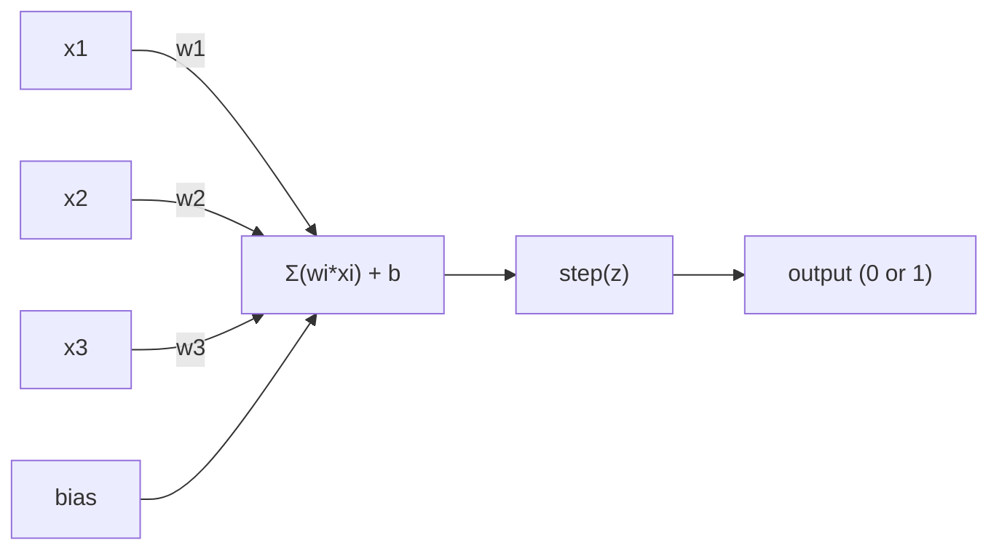
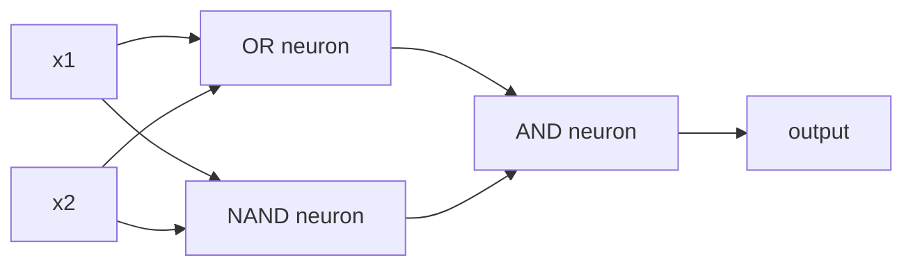

# El Perceptron

> El perceptron es el átomo de las redes neuronales.

**Type:** Build
**Languages:** Python
**Prerequisites:** Phase 1 (Linear Algebra Intuition)
**Time:** ~60 minutes

## Objetivos de aprendizaje

- Implementar un perceptron desde cero en Python, incluyendo la regla de actualización de peso y la función de activación de paso
- Explica por qué un solo perceptron sólo puede resolver problemas linealmente separables y demuestra el caso de fallo XOR
- Construir un perceptron de múltiples capas mediante la composición de puertas OR, NAND y AND para resolver XOR
- Entrenar una red de dos capas con activación sigmoide y retropropagación para aprender XOR automáticamente

## El problema

Conoces vectores y productos de puntos. Sabes que una matriz transforma entradas en salidas. Pero ¿cómo una máquina *aprende* qué transformación usar?

El perceptron responde a esto. Es la máquina de aprendizaje más simple posible: toma algunas entradas, multiplica por pesas, añada un sesgo y toma una decisión binaria. Luego ajusta. Eso es todo. Cada red neuronal construida es capas de esta idea apiladas juntas.

Comprender el perceptron significa entender lo que "aprender" realmente significa en código: ajustar números hasta que la salida coincida con la realidad.

## El concepto

### Una neurona, una decisión

Un perceptron toma n entradas, multiplica cada una por un peso, las suma, agrega un sesgo y pasa el resultado a través de una función de activación.



La función de paso es brutal: si la suma ponderada más el sesgo es >= 0, salida 1. De lo contrario, salida 0.

```
step(z) = 1  if z >= 0
           0  if z < 0
```

Este es un clasificador lineal. Los pesos y los sesgos definen una línea (o hiperplano en dimensiones más altas) que divide el espacio de entrada en dos regiones.

### El límite de la decisión

Para dos entradas, el perceptron traza una línea a través del espacio 2D:

```
  x2
  ┤
  │  Class 1        /
  │    (0)          /
  │                /
  │               / w1·x1 + w2·x2 + b = 0
  │              /
  │             /     Class 2
  │            /        (1)
  ┼───────────/──────────── x1
```

Todo en un lado de la línea da 0 a las clases.

### La regla de aprendizaje

La regla del aprendizaje perceptron es simple:

```
For each training example (x, y_true):
    y_pred = predict(x)
    error = y_true - y_pred

    For each weight:
        w_i = w_i + learning_rate * error * x_i
    bias = bias + learning_rate * error
```

Si la predicción es correcta, el error = 0, nada cambia. Si predice 0 pero debe ser 1, los pesos aumentan. Si predice 1 pero debe ser 0, los pesos disminuyen. La tasa de aprendizaje controla el tamaño de cada ajuste.

### El problema de la XOR

Mira estas puertas lógicas:

```
AND gate:           OR gate:            XOR gate:
x1  x2  out         x1  x2  out         x1  x2  out
0   0   0           0   0   0           0   0   0
0   1   0           0   1   1           0   1   1
1   0   0           1   0   1           1   0   1
1   1   1           1   1   1           1   1   0
```

Y y OR son linealmente separables: se puede dibujar una sola línea para separar los 0s de los 1s. XOR no lo es. Ninguna sola línea puede separar [0,1] y [1,0] de [0,0] y [1,1].

```
AND (separable):        XOR (not separable):

  x2                      x2
  1 ┤  0     1            1 ┤  1     0
    │     /                 │
  0 ┤  0 / 0              0 ┤  0     1
    ┼──/──────── x1         ┼──────────── x1
       line works!          no single line works!
```

Esto es un límite fundamental. Un perceptron único sólo puede resolver problemas linealmente separables. Minsky y Papert lo demostraron en 1969 y casi mató la investigación de redes neuronales durante una década.

La solución: apilar los perceptrones en capas. Un perceptrón de varias capas puede resolver XOR combinando dos decisiones lineales en una no lineal.

```figure
perceptron-boundary
```

## Construye el mismo

### Paso 1: La clase de Perceptron

```python
class Perceptron:
    def __init__(self, n_inputs, learning_rate=0.1):
        self.weights = [0.0] * n_inputs
        self.bias = 0.0
        self.lr = learning_rate

    def predict(self, inputs):
        total = sum(w * x for w, x in zip(self.weights, inputs))
        total += self.bias
        return 1 if total >= 0 else 0

    def train(self, training_data, epochs=100):
        for epoch in range(epochs):
            errors = 0
            for inputs, target in training_data:
                prediction = self.predict(inputs)
                error = target - prediction
                if error != 0:
                    errors += 1
                    for i in range(len(self.weights)):
                        self.weights[i] += self.lr * error * inputs[i]
                    self.bias += self.lr * error
            if errors == 0:
                print(f"Converged at epoch {epoch + 1}")
                return
        print(f"Did not converge after {epochs} epochs")
```

### Paso 2: Entrenamiento en puertas lógicas

```python
and_data = [
    ([0, 0], 0),
    ([0, 1], 0),
    ([1, 0], 0),
    ([1, 1], 1),
]

or_data = [
    ([0, 0], 0),
    ([0, 1], 1),
    ([1, 0], 1),
    ([1, 1], 1),
]

not_data = [
    ([0], 1),
    ([1], 0),
]

print("=== AND Gate ===")
p_and = Perceptron(2)
p_and.train(and_data)
for inputs, _ in and_data:
    print(f"  {inputs} -> {p_and.predict(inputs)}")

print("\n=== OR Gate ===")
p_or = Perceptron(2)
p_or.train(or_data)
for inputs, _ in or_data:
    print(f"  {inputs} -> {p_or.predict(inputs)}")

print("\n=== NOT Gate ===")
p_not = Perceptron(1)
p_not.train(not_data)
for inputs, _ in not_data:
    print(f"  {inputs} -> {p_not.predict(inputs)}")
```

### Paso 3: Observa el fracaso de XOR

```python
xor_data = [
    ([0, 0], 0),
    ([0, 1], 1),
    ([1, 0], 1),
    ([1, 1], 0),
]

print("\n=== XOR Gate (single perceptron) ===")
p_xor = Perceptron(2)
p_xor.train(xor_data, epochs=1000)
for inputs, expected in xor_data:
    result = p_xor.predict(inputs)
    status = "OK" if result == expected else "WRONG"
    print(f"  {inputs} -> {result} (expected {expected}) {status}")
```

Esto es la prueba de que un solo perceptrón no puede aprender XOR.

### Paso 4: Resolver XOR con dos capas

El truco: XOR = (x1 O x2) Y NO (x1 Y x2). Combine tres perceptrones:



```python
def xor_network(x1, x2):
    or_neuron = Perceptron(2)
    or_neuron.weights = [1.0, 1.0]
    or_neuron.bias = -0.5

    nand_neuron = Perceptron(2)
    nand_neuron.weights = [-1.0, -1.0]
    nand_neuron.bias = 1.5

    and_neuron = Perceptron(2)
    and_neuron.weights = [1.0, 1.0]
    and_neuron.bias = -1.5

    hidden1 = or_neuron.predict([x1, x2])
    hidden2 = nand_neuron.predict([x1, x2])
    output = and_neuron.predict([hidden1, hidden2])
    return output


print("\n=== XOR Gate (multi-layer network) ===")
for inputs, expected in xor_data:
    result = xor_network(inputs[0], inputs[1])
    print(f"  {inputs} -> {result} (expected {expected})")
```

La acumulación de perceptrones en capas crea límites de decisión que ningún perceptrón puede producir.

### Paso 5: Entrenar una red de dos capas

Paso 4 cableado a mano los pesos. Eso funciona para XOR, pero no para problemas reales donde no se sabe los pesos correctos de antemano. La solución: reemplazar la función de paso con sigmoid y aprender los pesos automáticamente a través de la retropropagación.

```python
class TwoLayerNetwork:
    def __init__(self, learning_rate=0.5):
        import random
        random.seed(0)
        self.w_hidden = [[random.uniform(-1, 1), random.uniform(-1, 1)] for _ in range(2)]
        self.b_hidden = [random.uniform(-1, 1), random.uniform(-1, 1)]
        self.w_output = [random.uniform(-1, 1), random.uniform(-1, 1)]
        self.b_output = random.uniform(-1, 1)
        self.lr = learning_rate

    def sigmoid(self, x):
        import math
        x = max(-500, min(500, x))
        return 1.0 / (1.0 + math.exp(-x))

    def forward(self, inputs):
        self.inputs = inputs
        self.hidden_outputs = []
        for i in range(2):
            z = sum(w * x for w, x in zip(self.w_hidden[i], inputs)) + self.b_hidden[i]
            self.hidden_outputs.append(self.sigmoid(z))
        z_out = sum(w * h for w, h in zip(self.w_output, self.hidden_outputs)) + self.b_output
        self.output = self.sigmoid(z_out)
        return self.output

    def train(self, training_data, epochs=10000):
        for epoch in range(epochs):
            total_error = 0
            for inputs, target in training_data:
                output = self.forward(inputs)
                error = target - output
                total_error += error ** 2

                d_output = error * output * (1 - output)

                saved_w_output = self.w_output[:]
                hidden_deltas = []
                for i in range(2):
                    h = self.hidden_outputs[i]
                    hd = d_output * saved_w_output[i] * h * (1 - h)
                    hidden_deltas.append(hd)

                for i in range(2):
                    self.w_output[i] += self.lr * d_output * self.hidden_outputs[i]
                self.b_output += self.lr * d_output

                for i in range(2):
                    for j in range(len(inputs)):
                        self.w_hidden[i][j] += self.lr * hidden_deltas[i] * inputs[j]
                    self.b_hidden[i] += self.lr * hidden_deltas[i]
```

```python
net = TwoLayerNetwork(learning_rate=2.0)
net.train(xor_data, epochs=10000)
for inputs, expected in xor_data:
    result = net.forward(inputs)
    predicted = 1 if result >= 0.5 else 0
    print(f"  {inputs} -> {result:.4f} (rounded: {predicted}, expected {expected})")
```

Dos diferencias clave del paso 4. Primero, sigmoide reemplaza la función de paso - es suave, por lo que los gradientes existen. segundo, el `train`El método propaga el error hacia atrás desde la salida a la capa oculta, ajustando cada peso en proporción a su contribución al error.

Este es el puente a la lección 03.`d_output`y `hidden_deltas`Es la regla de cadena aplicada al gráfico de red.

## Usalo

Todo lo que acabas de construir desde cero existe en una importación:

```python
from sklearn.linear_model import Perceptron as SkPerceptron
import numpy as np

X = np.array([[0,0],[0,1],[1,0],[1,1]])
y = np.array([0, 0, 0, 1])

clf = SkPerceptron(max_iter=100, tol=1e-3)
clf.fit(X, y)
print([clf.predict([x])[0] for x in X])
```

Cinco líneas.`Perceptron`La versión sklearn añade controles de convergencia, funciones de pérdida múltiple y soporte de entrada escaso, pero el bucle central es idéntico: suma ponderada, función de paso, actualización de peso en error.

La brecha real se muestra a escala.

- La función de paso se convierte en sigmoide, ReLU, u otras activaciones suaves
- Los pesos se aprenden automáticamente mediante la propagación hacia atrás (lección 03)
- Las capas se profundizan: 3, 10, 100+ capas
- El mismo principio es válido: cada capa crea nuevas características de las salidas de la capa anterior

Un solo perceptrón sólo puede dibujar líneas rectas.

## Envío

Esta lección produce:
- `outputs/skill-perceptron.md`- una habilidad que cubra cuando se necesitan arquitecturas de una sola capa frente a arquitecturas de varias capas

## Los ejercicios

1. Entrenar un perceptron en una puerta NAND (la puerta universal - cualquier circuito lógico se puede construir a partir de NAND).
2. Modifique la clase Perceptron para rastrear el límite de decisión (w1*x1 + w2*x2 + b = 0) en cada época. Imprime cómo se desplaza la línea durante el entrenamiento en la puerta AND.
3. Construir un perceptron de 3 entradas que salga 1 sólo cuando al menos 2 de las 3 entradas son 1 (una función de voto mayoritario). ¿Es esto linealmente separable? ¿Por qué?

## Términos clave

| Term | What people say | What it actually means |
|------|----------------|----------------------|
| Perceptron | "A fake neuron" | A linear classifier: dot product of inputs and weights, plus bias, through a step function |
| Weight | "How important an input is" | A multiplier that scales each input's contribution to the decision |
| Bias | "The threshold" | A constant that shifts the decision boundary, letting the perceptron fire even with zero inputs |
| Activation function | "The thing that squishes values" | A function applied after the weighted sum - step function for perceptrons, sigmoid/ReLU for modern networks |
| Linearly separable | "You can draw a line between them" | A dataset where a single hyperplane can perfectly separate the classes |
| XOR problem | "The thing perceptrons can't do" | Proof that single-layer networks cannot learn non-linearly-separable functions |
| Decision boundary | "Where the classifier switches" | The hyperplane w*x + b = 0 that divides input space into two classes |
| Multi-layer perceptron | "A real neural network" | Perceptrons stacked in layers, where each layer's output feeds the next layer's input |

## Leer más

- Frank Rosenblatt, "El Perceptron: un modelo probabilístico para el almacenamiento y organización de la información en el cerebro" (1958) -- el artículo original que comenzó todo
- Minsky & Papert, "Perceptrons" (1969) -- el libro que demostró que XOR era insoluble por redes de una sola capa y mató la investigación de perceptron durante una década
- Michael Nielsen, "Redes neuronales y aprendizaje profundo", Capítulo 1 (http://neuralnetworksanddeeplearning.com/) -- en línea gratuita, mejor explicación visual de cómo los perceptrones se componen en redes
