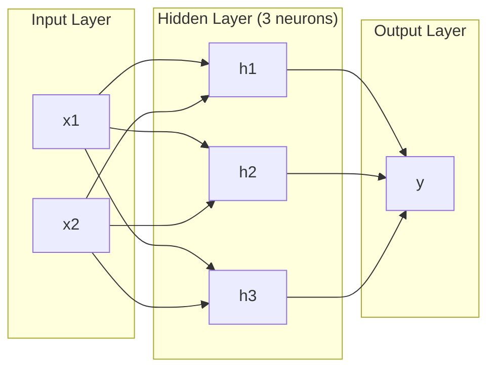
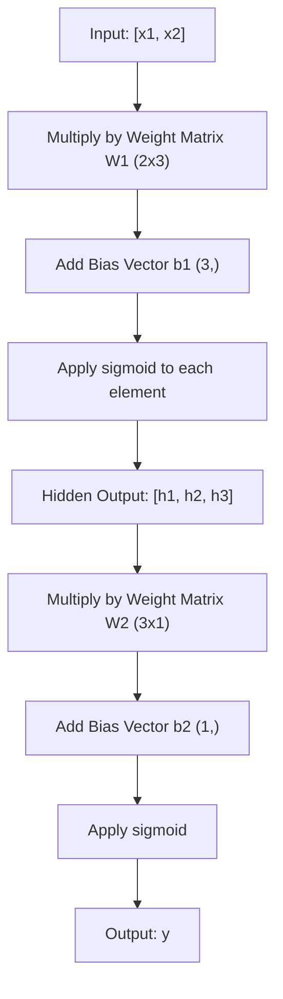
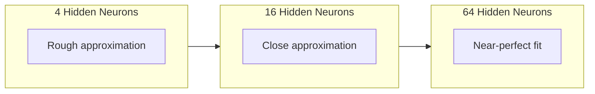

# Las redes de múltiples capas y el pase de adelanto

> Una neurona traza una línea, apilalas y puedes trazar cualquier cosa.

**Type:** Build
**Languages:** Python
**Prerequisites:** Phase 01 (Math Foundations), Lesson 03.01 (The Perceptron)
**Time:** ~90 minutes

## Objetivos de aprendizaje

- Construir una red de múltiples capas desde cero con clases de capas y redes que realicen un pase hacia adelante completo
- Detectar las dimensiones de la matriz a través de cada capa de una red e identificar las desajustes de forma
- Explicar cómo apilar las activaciones no lineales permite a una red aprender los límites de decisión curvos
- Resolver el problema XOR utilizando una arquitectura 2-2-1 con pesas sigmoides sintonizadas a mano

## El problema

Una sola neurona es un cajón de líneas. Eso es todo. Una línea recta a través de los datos. Cada verdadero problema en IA -- reconocimiento de imágenes, comprensión del lenguaje, juego de Go -- requiere curvas.

En 1969, Minsky y Papert demostraron que esta limitación era fatal: una red de una sola capa no puede aprender XOR. No "luchas para aprender" - matemáticamente no puede. La tabla de verdad XOR coloca [0,1] y [1,0] en un lado, [0,0] y [1,1] en el otro. Ninguna sola línea las separa.

Esto eliminó el financiamiento de las redes neuronales durante más de una década. La solución era obvia en retrospectiva: dejar de usar una capa. apilar las neuronas en capas. Deja que la primera capa talle el espacio de entrada en nuevas características, y deja que la segunda capa combine esas características en decisiones que ninguna línea podría tomar.

Esa pila es la red de múltiples capas. Es la base de todos los modelos de aprendizaje profundo en producción hoy en día. El pase hacia adelante - los datos fluyen de entrada a salida a través de capas ocultas - es lo primero que necesitas construir antes de que cualquier otra cosa funcione.

## El concepto

### Capas: entrada, oculta, salida

Una red de múltiples capas tiene tres tipos de capas:

**Input layer**- no es realmente una capa. contiene sus datos brutos. Dos características significa dos nodos de entrada. No se hace ningún cálculo aquí.

**Hidden layers**Cada neurona toma cada salida de la capa anterior, aplica pesos y sesgos, y luego pasa el resultado a través de una función de activación. "Escondido" porque nunca se ven estos valores directamente en los datos de entrenamiento.

**Output layer**Para la clasificación binaria, una neurona con sigmoide. para la clase múltiple, una neurona por clase.



Esta es una red de 2-3-1. Dos entradas, tres neuronas ocultas, una salida. Cada conexión lleva un peso. Cada neurona (excepto la entrada) lleva un sesgo.

Cada capa produce un vector de números llamado estado oculto. Para el texto, los estados ocultos aumentan la dimensionalidad, codificando una palabra como 768 números para capturar un significado semántico. Para las imágenes, reducen la dimensionalidad, comprimiendo millones de píxeles en una representación manejable. El estado oculto es donde vive el aprendizaje.

### Neuronas y activaciones

Cada neurona hace tres cosas:

1. Multiplicar cada entrada por su peso correspondiente
2. Sumar todos los productos y agregar un sesgo
3. Pasar la suma a través de una función de activación

Por ahora, la activación es sigmoide:

```
sigmoid(z) = 1 / (1 + e^(-z))
```

Sigmoid aplasta cualquier número en el rango (0, 1). Las grandes entradas positivas empujan hacia 1. Las grandes entradas negativas empujan hacia 0.

### Pases delante: Cómo fluyen los datos

El pase hacia adelante empuja los datos de entrada a través de la red, capa por capa, hasta que alcanza la salida. No se produce aprendizaje durante el pase hacia adelante. Es un cálculo puro: multiplicar, agregar, activar, repetir.



En cada capa, tres operaciones ocurren en secuencia:

```
z = W * input + b       (linear transformation)
a = sigmoid(z)           (activation)
```

La salida de una capa se convierte en la entrada de la siguiente.

### Dimensiones de la matriz

Las dimensiones de seguimiento son la habilidad de depuración más importante en el aprendizaje profundo.

| Step | Operation | Dimensions | Result Shape |
|------|-----------|------------|-------------|
| Input | x | -- | (2,) |
| Hidden linear | W1 * x + b1 | W1: (3, 2), b1: (3,) | (3,) |
| Hidden activation | sigmoid(z1) | -- | (3,) |
| Output linear | W2 * h + b2 | W2: (1, 3), b2: (1,) | (1,) |
| Output activation | sigmoid(z2) | -- | (1,) |

La regla: la matriz de peso W en la capa k tiene forma (neuronas_en_layer_k, neuronas_en_layer_k_minus_1). Las filas coinciden con la capa actual. Las columnas coinciden con la capa anterior. Si las formas no se alinean, tienes un error.

### Teorema de la aproximación universal

En 1989, George Cybenko demostró algo notable: una red neuronal con una sola capa oculta y suficientes neuronas puede aproximar cualquier función continua a cualquier precisión deseada.

Esto no significa que una capa oculta sea siempre mejor. Significa que la arquitectura es teóricamente capaz. En la práctica, las redes más profundas (más capas, menos neuronas por capa) aprenden las mismas funciones con mucho menos parámetros totales que las redes de ancho poco profundo. Es por eso que el aprendizaje profundo funciona.

La intuición: cada neurona en la capa oculta aprende un "bump" o característica. suficientes golpes colocados en las ubicaciones correctas pueden aproximarse a cualquier curva lisa. Más neuronas, más golpes, mejor aproximación.



### Composibilidad

Las redes neuronales son composibles. Se pueden apilar, encadenar y ejecutar en paralelo. Un modelo Whisper utiliza una red de codificador para procesar audio y una red de decodificador separada para generar texto. Los LLM modernos son solo decodificadores. BERT es solo codificador. T5 es codificador-decodificador. La elección de arquitectura define lo que el modelo puede hacer.

```figure
mlp-forward
```

## Construye el mismo

Todo operativo de matriz escrito desde cero.

### Paso 1: activación sigmóide

```python
import math

def sigmoid(x):
    x = max(-500.0, min(500.0, x))
    return 1.0 / (1.0 + math.exp(-x))
```

El sujetador a [500, 500] evita el desbordamiento. `math.exp(500)`es grande pero finito.`math.exp(1000)`es el infinito.

### Paso 2: Clase de capas

La operación más importante en todo el aprendizaje profundo es la multiplicación de matrices. Cada capa, cada cabeza de atención, cada paso hacia adelante, son matrices hasta abajo. Una capa lineal toma un vector de entrada, lo multiplica por una matriz de peso y añade un vector de sesgo: y = Wx + b. Esa sola ecuación es el 90% del cálculo en una red neuronal.

Una capa contiene una matriz de peso y un vector de sesgo. Su método de avance toma un vector de entrada y devuelve la salida activada.

```python
class Layer:
    def __init__(self, n_inputs, n_neurons, weights=None, biases=None):
        if weights is not None:
            self.weights = weights
        else:
            import random
            self.weights = [
                [random.uniform(-1, 1) for _ in range(n_inputs)]
                for _ in range(n_neurons)
            ]
        if biases is not None:
            self.biases = biases
        else:
            self.biases = [0.0] * n_neurons

    def forward(self, inputs):
        self.last_input = inputs
        self.last_output = []
        for neuron_idx in range(len(self.weights)):
            z = sum(
                w * x for w, x in zip(self.weights[neuron_idx], inputs)
            )
            z += self.biases[neuron_idx]
            self.last_output.append(sigmoid(z))
        return self.last_output
```

La matriz de peso tiene forma (n_neurones, n_input). Cada fila es el peso de una neurona en todas las entradas. El método avanzado se hace a través de las neuronas, calcula la suma ponderada más el sesgo, aplica sigmoide y recoge los resultados.

### Paso 3: Clasificación de red

Una red es una lista de capas. El pase hacia adelante las encadenan: la salida de la capa k alimenta a la capa k + 1.

```python
class Network:
    def __init__(self, layers):
        self.layers = layers

    def forward(self, inputs):
        current = inputs
        for layer in self.layers:
            current = layer.forward(current)
        return current
```

Es todo el paso hacia adelante. Cuatro líneas de lógica. Los datos entran, fluyen a través de cada capa, salen por el otro lado.

### Paso 4: XOR con pesas ajustadas a mano

En la lección 01, resolvimos XOR combinando perceptrones OR, NAND y AND. Ahora hacemos lo mismo con nuestras clases de capa y red. La arquitectura 2-2-1: dos entradas, dos neuronas ocultas, una salida.

```python
hidden = Layer(
    n_inputs=2,
    n_neurons=2,
    weights=[[20.0, 20.0], [-20.0, -20.0]],
    biases=[-10.0, 30.0],
)

output = Layer(
    n_inputs=2,
    n_neurons=1,
    weights=[[20.0, 20.0]],
    biases=[-30.0],
)

xor_net = Network([hidden, output])

xor_data = [
    ([0, 0], 0),
    ([0, 1], 1),
    ([1, 0], 1),
    ([1, 1], 0),
]

for inputs, expected in xor_data:
    result = xor_net.forward(inputs)
    predicted = 1 if result[0] >= 0.5 else 0
    print(f"  {inputs} -> {result[0]:.6f} (rounded: {predicted}, expected: {expected})")
```

Los grandes pesos (20, -20) hacen que la sigmoide actúe como una función de paso. La primera neurona oculta se aproxima a OR. La segunda se aproxima a NAND. La neurona de salida las combina en AND, que es XOR.

### Paso 5: Clasificación de círculos

Un problema más difícil: clasificar los puntos 2D como dentro o fuera de un círculo de radio 0,5 centrado en el origen. Esto requiere un límite de decisión curvo - imposible para un solo perceptron.

```python
import random
import math

random.seed(42)

data = []
for _ in range(200):
    x = random.uniform(-1, 1)
    y = random.uniform(-1, 1)
    label = 1 if (x * x + y * y) < 0.25 else 0
    data.append(([x, y], label))

circle_net = Network([
    Layer(n_inputs=2, n_neurons=8),
    Layer(n_inputs=8, n_neurons=1),
])
```

Con pesos aleatorios, la red no clasificará bien. Pero el pase hacia adelante sigue funcionando. Este es el punto - el pase hacia adelante es sólo el cálculo. Aprender los pesos correctos es la retropropagación, que viene en la lección 03.

```python
correct = 0
for inputs, expected in data:
    result = circle_net.forward(inputs)
    predicted = 1 if result[0] >= 0.5 else 0
    if predicted == expected:
        correct += 1

print(f"Accuracy with random weights: {correct}/{len(data)} ({100*correct/len(data):.1f}%)")
```

Los pesos aleatorios dan poca precisión, a menudo peor que adivinar la clase mayoritaria. Después del entrenamiento (lección 03), esta misma arquitectura con 8 neuronas ocultas trazará un límite curvo que separa el interior del exterior.

## Usalo

PyTorch hace todo lo anterior en cuatro líneas:

```python
import torch
import torch.nn as nn

model = nn.Sequential(
    nn.Linear(2, 8),
    nn.Sigmoid(),
    nn.Linear(8, 1),
    nn.Sigmoid(),
)

x = torch.tensor([[0.0, 0.0], [0.0, 1.0], [1.0, 0.0], [1.0, 1.0]])
output = model(x)
print(output)
```

`nn.Linear(2, 8)`es su clase de capa: matriz de peso de forma (8, 2), vector de sesgo de forma (8,). `nn.Sigmoid()`es su función sigmoide aplicada en el elemento. `nn.Sequential`es su clase de red: capas de cadena en orden.

La diferencia es la velocidad y la escala. PyTorch se ejecuta en GPUs, maneja lotes de millones de muestras, y calcula automáticamente los gradientes para la propagación hacia atrás. Pero la lógica de paso hacia adelante es idéntica a la que acabas de construir desde cero.

## Envío

Esta lección produce una solicitud reutilizable para diseñar arquitecturas de red:

- `outputs/prompt-network-architect.md`

Utilice cuando necesite decidir cuántas capas, cuántas neuronas por capa y qué funciones de activación utilizar para un problema determinado.

## Los ejercicios

1. Construye una red 2-4-2-1 (dos capas ocultas) y ejecute el pase hacia adelante en los datos XOR con pesos aleatorios. Imprime las salidas de la capa oculta intermedia para ver cómo se transforma la representación en cada capa.

2. Cambiar el tamaño de la capa oculta en el clasificador de círculo de 8 a 2, luego a 32. ejecuta el pase hacia adelante con pesos aleatorios cada vez. ¿El número de neuronas ocultas cambia el rango de salida o distribución? ¿Por qué?

3. Implementar una `count_parameters`El método de red de la clase que devuelve el número total de pesos y sesgos entrenables.

4. Construye un pase hacia adelante para una red 3-4-4-2. envía valores de color RGB (normalizado a 0-1) y observa las dos salidas. Esta es la arquitectura para un clasificador de colores simple con dos clases.

5. Reemplazar el sigmoide con una función de "paso filtrado": devuelve 0,01 * z si z < 0, entonces 1.0. ejecuta el pase hacia adelante en XOR con los mismos pesos sintonizados a mano del paso 4. ¿Todavía funciona? ¿Por qué se prefiere el sigmoide liso sobre los cortes duros?

## Términos clave

| Term | What people say | What it actually means |
|------|----------------|----------------------|
| Forward pass | "Running the model" | Pushing input through every layer -- multiply by weights, add bias, activate -- to produce an output |
| Hidden layer | "The middle part" | Any layer between input and output whose values are not directly observed in the data |
| Multi-layer network | "A deep neural network" | Layers of neurons stacked sequentially, where each layer's output feeds the next layer's input |
| Activation function | "The nonlinearity" | A function applied after the linear transformation that introduces curves into the decision boundary |
| Sigmoid | "The S-curve" | sigma(z) = 1/(1+e^(-z)), squashes any real number to (0,1), smooth and differentiable everywhere |
| Weight matrix | "The parameters" | A matrix W of shape (current_layer_neurons, previous_layer_neurons) containing learnable connection strengths |
| Bias vector | "The offset" | A vector added after the matrix multiply that lets neurons activate even when all inputs are zero |
| Universal approximation | "Neural nets can learn anything" | A single hidden layer with enough neurons can approximate any continuous function -- but "enough" can mean billions |
| Linear transformation | "The matrix multiply step" | z = W * x + b, the computation before activation, which maps inputs to a new space |
| Decision boundary | "Where the classifier switches" | The surface in input space where the network output crosses the classification threshold |

## Leer más

- Michael Nielsen, "Redes neuronales y aprendizaje profundo", Capítulo 1-2 (http://neuralnetworksanddeeplearning.com/) -- la explicación más clara y libre de los pasos hacia adelante y la estructura de la red, con visualizaciones interactivas
- Cybenko, "Aproximación por Superposiciones de una Función Sigmoidal" (1989) - el original documento de teorema de aproximación universal, sorprendentemente legible
- 3Blue1Brown, "Pero ¿qué es una red neuronal?"https://www.youtube.com/watch?v=aircAruvnKk) -- 20 minutos de paseo visual a través de capas, pesos y pases hacia adelante que construye el modelo mental correcto
- Bienvenido, Bengio, Courville, "Aprendizaje profundo", capítulo 6 (https://www.deeplearningbook.org/) -- la referencia estándar para las redes de múltiples capas, gratuita en línea
