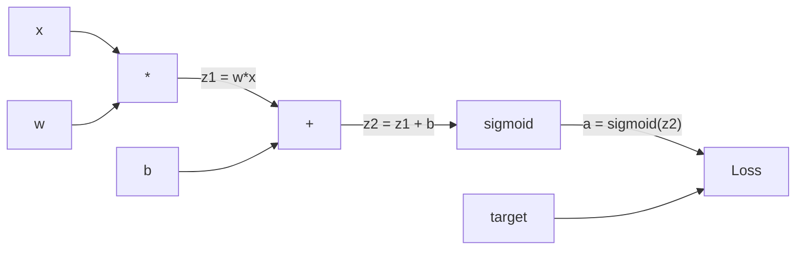
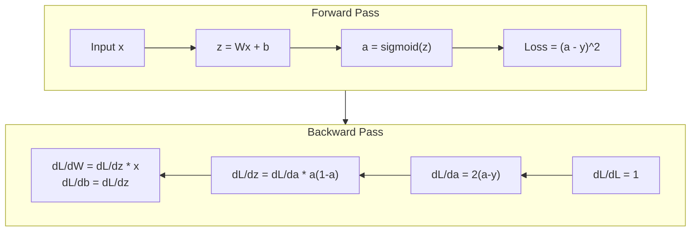
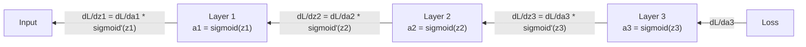

# Propagación hacia atrás desde cero

> La retropropagación es el algoritmo que hace posible el aprendizaje. Sin ella, las redes neuronales son sólo costosos generadores de números aleatorios.

**Type:** Build
**Languages:** Python
**Prerequisites:** Lesson 03.02 (Multi-Layer Networks)
**Time:** ~120 minutes

## Objetivos de aprendizaje

- Implementar un motor de autogrado basado en valores que construye un gráfico computacional y computa gradientes a través de clasificación topológica
- Derivar el pase hacia atrás para la adición, multiplicación y sigmoide usando la regla de la cadena
- Entrenar una red de múltiples capas en XOR y clasificación de círculos utilizando sólo su motor de retropropagación desde cero
- Identificar el problema de los gradientes desaparecientes en redes sigmoides profundas y explicar por qué los gradientes se reducen exponencialmente

## El problema

Su red tiene una sola capa oculta con 768 entradas y 3072 salidas. Eso es 2.359.296 pesos. hizo una predicción errónea. ¿Qué pesos causaron el error? probar cada peso individualmente significa 2.3 millones de pases hacia adelante.

El enfoque ingenuo: tomar un peso, empujarlo por una pequeña cantidad, correr el pase hacia adelante de nuevo, medir si la pérdida fue hacia arriba o hacia abajo. Eso le da el gradiente para ese peso. Ahora hazlo para cada peso en la red. Multiplica por miles de pasos de entrenamiento y millones de puntos de datos. Necesitarías tiempo geológico para entrenar algo útil.

La propagación hacia atrás resuelve esto. Un paso hacia adelante, un paso hacia atrás, todos los gradientes calculados. El truco es la regla de cadena del cálculo, aplicada sistemáticamente a un gráfico computacional. Este es el algoritmo que hizo que el aprendizaje profundo sea práctico. Sin él, todavía estaríamos atascados en problemas de juguete.

## El concepto

### La regla de la cadena, aplicada a las redes

Viste la regla de la cadena en la fase 01, lección 05. Resumen rápido: si y = f(g(x)), entonces dy/dx = f'(g(x)) * g'(x. Multiplicas derivadas a lo largo de la cadena.

En una red neuronal, la "cadena" es la secuencia de operaciones desde la entrada hasta la pérdida. Cada capa aplica pesos, agrega sesgos, pasa a través de una activación. La función de pérdida compara la salida final con el objetivo. La retropropagación rastrea esta cadena hacia atrás, calculando cómo cada operación contribuyó al error.

### Gráficos computacionales

Cada paso hacia adelante construye un gráfico. Cada nodo es una operación (multiplicar, agregar, sigmoide). Cada borde lleva un valor hacia adelante y un gradiente hacia atrás.



Pasar hacia adelante: los valores fluyen de izquierda a derecha. x y w producen z1 = w*x. Agregar b para obtener z2. Sigmoid da activación a. Comparar a a a y usando la función de pérdida.

Paso hacia atrás: los gradientes fluyen de derecha a izquierda. Comience con dL/da (cómo cambia la pérdida con la activación). Multiplicar por da/dz2 (derivada sigmoide). Eso da dL/dz2. Dividir en dL/dz2 (que es igual a dL/dz2, ya que z2 = z1 + b) y dL/dz1.

Cada nodo en el gráfico tiene una tarea durante el paso hacia atrás: tomar el gradiente que viene de arriba, multiplicar por su derivada local, y pasarlo hacia abajo.

### Avanti y hacia atrás



El pase hacia adelante almacena todos los valores intermedios: z, a, las entradas de cada capa. El pase hacia atrás necesita estos valores almacenados para calcular los gradientes. Este es el tradeoff de memoria-computación en el corazón del backprop.

### Flujo gradual a través de una red

Para una red de tres capas, cadenas de gradientes a través de cada capa:



En cada capa, el gradiente se multiplica por la derivada sigmoide. La derivada sigmoide es un * (1 - a), que se maximiza a 0.25 (cuando a = 0.5). Tres capas profundas, el gradiente se ha multiplicado por un máximo de 0.25^3 = 0.0156. Diez capas profundas: 0.25^10 = 0.000001.

### Los gradientes desaparecen

Este es el problema del gradiente desapareciente. Sigmoide aplasta su salida entre 0 y 1. Su derivado es siempre menor que 0.25.

```
sigmoid(z):     Output range [0, 1]
sigmoid'(z):    Max value 0.25 (at z = 0)

After 5 layers:   gradient * 0.25^5 = 0.001x original
After 10 layers:  gradient * 0.25^10 = 0.000001x original
```

Por eso las redes sigmoides profundas son casi imposibles de entrenar. La solución - ReLU y sus variantes - es el tema de la lección 04. Por ahora, entienda que el backprop funciona perfectamente. El problema es lo que está trabajando.

### Derivar Gradientes para una red de dos capas

Matemáticas concretas para una red con entrada x, capa oculta con sigmoid, capa de salida con sigmoid y pérdida de MSE.

Pases de entrada:
```
z1 = W1 * x + b1
a1 = sigmoid(z1)
z2 = W2 * a1 + b2
a2 = sigmoid(z2)
L = (a2 - y)^2
```

Pases hacia atrás (aplicación de la regla de la cadena paso a paso):
```
dL/da2 = 2(a2 - y)
da2/dz2 = a2 * (1 - a2)
dL/dz2 = dL/da2 * da2/dz2 = 2(a2 - y) * a2 * (1 - a2)

dL/dW2 = dL/dz2 * a1
dL/db2 = dL/dz2

dL/da1 = dL/dz2 * W2
da1/dz1 = a1 * (1 - a1)
dL/dz1 = dL/da1 * da1/dz1

dL/dW1 = dL/dz1 * x
dL/db1 = dL/dz1
```

Cada gradiente es un producto de derivados locales rastreados desde la pérdida.

```figure
backprop-vanishing
```

## Construye el mismo

### Paso 1: Nodo de valor

Cada número en nuestro cálculo se convierte en un valor. Almacena sus datos, su gradiente y cómo se creó (por lo que sabe cómo calcular los gradientes hacia atrás).

```python
class Value:
    def __init__(self, data, children=(), op=''):
        self.data = data
        self.grad = 0.0
        self._backward = lambda: None
        self._children = set(children)
        self._op = op

    def __repr__(self):
        return f"Value(data={self.data:.4f}, grad={self.grad:.4f})"
```

No hay ningún gradiente todavía (0.0).`_children`rastrear que los valores producido este, así que podemos ordenar topológicamente el gráfico más tarde.

### Paso 2: Operaciones con funciones retroactivas

Cada operación crea un nuevo valor y define cómo fluyen los gradientes hacia atrás a través de él.

```python
def __add__(self, other):
    other = other if isinstance(other, Value) else Value(other)
    out = Value(self.data + other.data, (self, other), '+')

    def _backward():
        self.grad += out.grad
        other.grad += out.grad

    out._backward = _backward
    return out

def __mul__(self, other):
    other = other if isinstance(other, Value) else Value(other)
    out = Value(self.data * other.data, (self, other), '*')

    def _backward():
        self.grad += other.data * out.grad
        other.grad += self.data * out.grad

    out._backward = _backward
    return out
```

Para adición: d(a+b)/da = 1, d(a+b)/db = 1. Así que ambas entradas obtienen el gradiente de la salida directamente.

Para la multiplicación: d(a*b)/da = b, d(a*b)/db = a. Cada entrada obtiene el valor del otro veces el gradiente de salida.

El `+=`Un valor puede ser utilizado en múltiples operaciones. su gradiente es la suma de los gradientes de todos los caminos.

### Paso 3: Sigmoide y pérdida

```python
import math

def sigmoid(self):
    x = self.data
    x = max(-500, min(500, x))
    s = 1.0 / (1.0 + math.exp(-x))
    out = Value(s, (self,), 'sigmoid')

    def _backward():
        self.grad += (s * (1 - s)) * out.grad

    out._backward = _backward
    return out
```

Sigmoid derivado: sigmoid(x) * (1 - sigmoid(x)). Hemos calculado sigmoid(x) = s durante el pase hacia adelante.

```python
def mse_loss(predicted, target):
    diff = predicted + Value(-target)
    return diff * diff
```

MSE para una salida única: (predecida - objetivo) ^ 2. Expresamos la restancia como suma con un valor negativo.

### Paso 4: Pasar hacia atrás

El orden topológico asegura que procesemos los nodos en el orden correcto - el gradiente de un nodo se acumula completamente antes de que nos propaguemos a través de él.

```python
def backward(self):
    topo = []
    visited = set()

    def build_topo(v):
        if v not in visited:
            visited.add(v)
            for child in v._children:
                build_topo(child)
            topo.append(v)

    build_topo(self)
    self.grad = 1.0
    for v in reversed(topo):
        v._backward()
```

Comience en la pérdida (gradiente = 1.0, ya que dL/dL = 1).`_backward`empuja los gradientes a sus hijos.

### Paso 5: capa y red

```python
import random

class Neuron:
    def __init__(self, n_inputs):
        scale = (2.0 / n_inputs) ** 0.5
        self.weights = [Value(random.uniform(-scale, scale)) for _ in range(n_inputs)]
        self.bias = Value(0.0)

    def __call__(self, x):
        act = sum((wi * xi for wi, xi in zip(self.weights, x)), self.bias)
        return act.sigmoid()

    def parameters(self):
        return self.weights + [self.bias]


class Layer:
    def __init__(self, n_inputs, n_outputs):
        self.neurons = [Neuron(n_inputs) for _ in range(n_outputs)]

    def __call__(self, x):
        out = [n(x) for n in self.neurons]
        return out[0] if len(out) == 1 else out

    def parameters(self):
        params = []
        for n in self.neurons:
            params.extend(n.parameters())
        return params


class Network:
    def __init__(self, sizes):
        self.layers = []
        for i in range(len(sizes) - 1):
            self.layers.append(Layer(sizes[i], sizes[i + 1]))

    def __call__(self, x):
        for layer in self.layers:
            x = layer(x)
            if not isinstance(x, list):
                x = [x]
        return x[0] if len(x) == 1 else x

    def parameters(self):
        params = []
        for layer in self.layers:
            params.extend(layer.parameters())
        return params

    def zero_grad(self):
        for p in self.parameters():
            p.grad = 0.0
```

Una Neurona toma entradas, calcula la suma ponderada + sesgo y aplica sigmoides. Escales de inicialización de peso por sqrt(2/n_inputs) para evitar la saturación sigmoide en redes más profundas. Una capa es una lista de neuronas. Una red es una lista de capas.`parameters()`El método recopila todos los valores que se pueden aprender para que podamos actualizarlos.

### Paso 6: Entrenamiento en XOR

```python
random.seed(42)
net = Network([2, 4, 1])

xor_data = [
    ([0.0, 0.0], 0.0),
    ([0.0, 1.0], 1.0),
    ([1.0, 0.0], 1.0),
    ([1.0, 1.0], 0.0),
]

learning_rate = 1.0

for epoch in range(1000):
    total_loss = Value(0.0)
    for inputs, target in xor_data:
        x = [Value(i) for i in inputs]
        pred = net(x)
        loss = mse_loss(pred, target)
        total_loss = total_loss + loss

    net.zero_grad()
    total_loss.backward()

    for p in net.parameters():
        p.data -= learning_rate * p.grad

    if epoch % 100 == 0:
        print(f"Epoch {epoch:4d} | Loss: {total_loss.data:.6f}")

print("\nXOR Results:")
for inputs, target in xor_data:
    x = [Value(i) for i in inputs]
    pred = net(x)
    print(f"  {inputs} -> {pred.data:.4f} (expected {target})")
```

Observe la disminución de la pérdida. Desde predicciones aleatorias hasta correcciones de salidas XOR, impulsadas enteramente por gradientes de computación de retropropagación y empujando pesas en la dirección correcta.

### Paso 7: Clasificación de círculos

En la Lección 02, sintoniza las pesas a mano para la clasificación de círculos.

```python
random.seed(7)

def generate_circle_data(n=100):
    data = []
    for _ in range(n):
        x1 = random.uniform(-1.5, 1.5)
        x2 = random.uniform(-1.5, 1.5)
        label = 1.0 if x1 * x1 + x2 * x2 < 1.0 else 0.0
        data.append(([x1, x2], label))
    return data

circle_data = generate_circle_data(80)

circle_net = Network([2, 8, 1])
learning_rate = 0.5

for epoch in range(2000):
    random.shuffle(circle_data)
    total_loss_val = 0.0
    for inputs, target in circle_data:
        x = [Value(i) for i in inputs]
        pred = circle_net(x)
        loss = mse_loss(pred, target)
        circle_net.zero_grad()
        loss.backward()
        for p in circle_net.parameters():
            p.data -= learning_rate * p.grad
        total_loss_val += loss.data

    if epoch % 200 == 0:
        correct = 0
        for inputs, target in circle_data:
            x = [Value(i) for i in inputs]
            pred = circle_net(x)
            predicted_class = 1.0 if pred.data > 0.5 else 0.0
            if predicted_class == target:
                correct += 1
        accuracy = correct / len(circle_data) * 100
        print(f"Epoch {epoch:4d} | Loss: {total_loss_val:.4f} | Accuracy: {accuracy:.1f}%")
```

Usamos SGD en línea aquí - actualizar pesos después de cada muestra en lugar de acumular el lote completo. Esto rompe la simetría más rápido y evita la saturación sigmoide en el panorama de pérdida completa. Mezclar los datos cada época evita que la red de memorizar el orden.

No hay ajuste manual. La red descubre el límite circular de decisión por sí misma. Ese es el poder de la retropropagación: defines la arquitectura, la función de pérdida y los datos. El algoritmo calcula los pesos.

## Usalo

PyTorch hace todo lo anterior en unas pocas líneas. La idea central es idéntica: Autograd construye un gráfico computacional durante el pase hacia adelante y lo rastrea hacia atrás para calcular gradientes.

```python
import torch
import torch.nn as nn

model = nn.Sequential(
    nn.Linear(2, 4),
    nn.Sigmoid(),
    nn.Linear(4, 1),
    nn.Sigmoid(),
)
optimizer = torch.optim.SGD(model.parameters(), lr=1.0)
criterion = nn.MSELoss()

X = torch.tensor([[0,0],[0,1],[1,0],[1,1]], dtype=torch.float32)
y = torch.tensor([[0],[1],[1],[0]], dtype=torch.float32)

for epoch in range(1000):
    pred = model(X)
    loss = criterion(pred, y)
    optimizer.zero_grad()
    loss.backward()
    optimizer.step()

print("PyTorch XOR Results:")
with torch.no_grad():
    for i in range(4):
        pred = model(X[i])
        print(f"  {X[i].tolist()} -> {pred.item():.4f} (expected {y[i].item()})")
```

`loss.backward()`¿ Es su ?`total_loss.backward()`- ¿ Qué ?`optimizer.step()`¿ Es tu manual ?`p.data -= lr * p.grad`- ¿ Qué ?`optimizer.zero_grad()`¿ Es su ?`net.zero_grad()`El algoritmo es el mismo, la aplicación de la fuerza industrial. PyTorch maneja la aceleración de la GPU, la precisión mixta, el control de gradientes y cientos de tipos de capas. Pero el paso hacia atrás es la misma regla de cadena aplicada al mismo gráfico computacional.

El entrenamiento ejecuta el pase hacia adelante, luego el pase hacia atrás, luego actualiza los pesos. La inferencia sólo corre el pase hacia adelante. No hay gradientes, no hay actualizaciones. Esta distinción es importante porque la inferencia es lo que sucede en la producción. Cuando llamas a una API como Claude o GPT, estás haciendo inferencias -- tu mensaje fluye hacia adelante a través de la red, y los tokens salen por el otro extremo. No hay cambios de pesos. Comprender el backprop es importante porque formaba cada peso en esa red.

## Envío

Esta lección produce:
- `outputs/prompt-gradient-debugger.md`-- una señal reutilizable para diagnosticar problemas de gradiente (desaparición, explosión, NaN) en cualquier red neuronal

## Los ejercicios

1. Añadir un`__sub__`El método de la clase de valor (a - b = a + (-1 * b)).`__neg__`El método de cálculo de los gradientes es el método de cálculo de los gradientes.

2. Añadir un`relu`El método de conversión de la señal de sigmoide a la señal de sigmoide a la señal de sigmoide a la señal de sigmoide a la señal de sigmoide a la señal de sigmoide a la señal de sigmoide a la señal de sigmoide a la señal de sigmoide a la señal de sigmoide a la señal de sigmoide a la señal de sigmoide a la señal de sigmoide a la señal de sigmoide a la señal de sigmoide a la señal de sigmoide a la señal de sigmoide a la señal de sigmoide a la señal de sigmoide a la señal de sigmoide a la señal de sigmoide a la señal de sigmoide a la señal de sigmoide a la señal de sigmoide a la señal de sigmoide a la señal de sigmoide a la señal de sigmoide a la señal de sigmoide a la señal de sigmoide a la señal de sigmoide a la señal de sigmoide a la señal de convergencia a la velocidad de convergencia.

3. Implementar una `__pow__`método en Valor para potencias enteras.`mse_loss`con un adecuado `(predicted - target) ** 2`Expresión. Verifique que los gradientes coinciden con la implementación original.

4. Añadir recorte de gradiente al bucle de entrenamiento: después de llamar `backward()`Entrenar una red más profunda (4+ capas con sigmoide) y comparar curvas de pérdida con y sin recorte. Esta es su primera defensa contra la explosión de gradientes.

5. Construir una visualización: después de entrenar en XOR, imprimir el gradiente de cada parámetro en la red. Identificar qué capa tiene los gradientes más pequeños. Esto demuestra el problema de gradiente desapareciente que usted lee en la sección Concepto.

## Términos clave

| Term | What people say | What it actually means |
|------|----------------|----------------------|
| Backpropagation | "The network learns" | An algorithm that computes dL/dw for every weight by applying the chain rule backward through the computational graph |
| Computational graph | "The network structure" | A directed acyclic graph where nodes are operations and edges carry values (forward) and gradients (backward) |
| Chain rule | "Multiply the derivatives" | If y = f(g(x)), then dy/dx = f'(g(x)) * g'(x) -- the mathematical foundation of backpropagation |
| Gradient | "The direction of steepest ascent" | The partial derivative of the loss with respect to a parameter -- tells you how to change that parameter to reduce the loss |
| Vanishing gradient | "Deep networks don't learn" | Gradients shrink exponentially as they propagate through layers with saturating activations like sigmoid |
| Forward pass | "Running the network" | Computing the output from inputs by sequentially applying each layer's operations and storing intermediate values |
| Backward pass | "Computing gradients" | Traversing the computational graph in reverse, accumulating gradients at each node using the chain rule |
| Learning rate | "How fast it learns" | A scalar that controls the step size when updating weights: w_new = w_old - lr * gradient |
| Topological sort | "The right order" | An ordering of graph nodes where each node appears after all nodes it depends on -- ensures gradients are fully accumulated before propagation |
| Autograd | "Automatic differentiation" | A system that builds computational graphs during forward computation and automatically computes gradients -- what PyTorch's engine does |

## Leer más

- Rumelhart, Hinton & Williams, "Aprender representaciones mediante errores de propagación posterior" (1986) - el documento que hizo que la repasación posterior fuera corriente principal y desbloqueara el entrenamiento de redes multicapa
- 3Blue1Brown, serie de "Redes Neurales" (https://www.youtube.com/playlist?list=PLZHQObOWTQDNU6R1_67000Dx_ZCJB-3pi) -- la mejor explicación visual de la retropropagación y el flujo de gradientes a través de las redes
